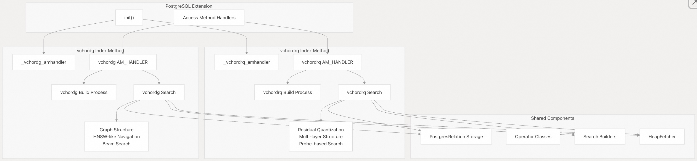
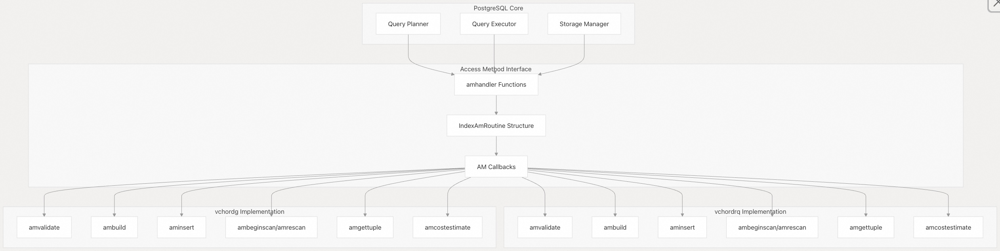

## VectorChord 源码学习: 2.3 索引存取方法 (Index Access Methods) 概述  
            
### 作者            
digoal            
            
### 日期            
2025-10-30            
            
### 标签            
VectorChord , 源码学习            
            
----            
            
## 背景            
本文介绍了 VectorChord 的两种向量索引存取方法 (vector index access methods) 的高层次概述：`vchordrq` (基于残差量化 - residual quantization-based) 和 `vchordg` (基于图 - graph-based)。涵盖它们的根本区别、PostgreSQL 集成 (PostgreSQL integration) 方法和配置选项 (configuration options)。  
  
## 索引方法架构 (Index Method Architecture)  
  
VectorChord 以 PostgreSQL 存取方法 (PostgreSQL access methods) 的形式实现了两种不同的向量相似性搜索 (vector similarity search) 方法，每种方法都针对不同的用例 (use cases) 和性能特征 (performance characteristics) 进行了优化。  
  
  
  
来源:  
- [`src/index/mod.rs` 25-30](https://github.com/tensorchord/VectorChord/blob/ac12e257/src/index/mod.rs#L25-L30)  
- [`src/index/vchordrq/am/mod.rs` 80-88](https://github.com/tensorchord/VectorChord/blob/ac12e257/src/index/vchordrq/am/mod.rs#L80-L88)  
- [`src/index/vchordg/am/mod.rs` 78-86](https://github.com/tensorchord/VectorChord/blob/ac12e257/src/index/vchordg/am/mod.rs#L78-L86)  
  
## vchordrq: 残差量化索引 (Residual Quantization Index)  
  
`vchordrq` 索引方法实现了基于层次化、量化 (quantization-based) 的向量相似性搜索方法。它使用残差量化 (residual quantization) 技术来压缩向量，同时保持搜索精度 (search accuracy)。  
  
### 主要特征 (Key Characteristics)  
  
* **多层结构 (Multi-layer Structure)**：具有 H1 磁带 (H1 tapes)、跳跃元组 (jump tuples) 和冻结/可追加磁带 (frozen/appendable tapes) 的层次化组织。  
* **量化 (Quantization)**：支持残差量化 (residual quantization) 以提高内存效率 (memory efficiency)。  
* **基于探测 (Probe-based) 的搜索**：可配置探测次数 (probe counts)，以权衡精度/速度。  
* **复杂成本模型 (Complex Cost Model)**：基于探测次数和数据分布的复杂成本估算 (cost estimation)。  
  
### 支持的操作 (Supported Operations)  
  
| 距离度量 (Distance Metric) | 向量类型 (Vector Types) | Maxsim 支持 (Maxsim Support) |  
| :--- | :--- | :--- |  
| L2 距离 (L2 Distance) | `vector`、`halfvec` | ✓ |  
| 内积 (Inner Product) | `vector`、`halfvec` | ✓ |  
| 余弦相似度 (Cosine Similarity) | `vector`、`halfvec` | ✓ |  
  
来源:  
- [`src/index/vchordrq/am/mod.rs` 196-214](https://github.com/tensorchord/VectorChord/blob/ac12e257/src/index/vchordrq/am/mod.rs#L196-L214)  
- [`src/index/vchordrq/am/mod.rs` 492-537](https://github.com/tensorchord/VectorChord/blob/ac12e257/src/index/vchordrq/am/mod.rs#L492-L537)  
  
## vchordg: 基于图的索引 (Graph-based Index)  
  
`vchordg` 索引方法实现了基于图的向量搜索算法 (graph-based vector search algorithm)，类似于 HNSW (分层可导航小世界 - Hierarchical Navigable Small World)，专为高维向量空间 (high-dimensional vector spaces) 优化。  
  
### 主要特征 (Key Characteristics)  
  
* **图结构 (Graph Structure)**：具有顶点 (vertices) 和邻居连接 (neighbor connections) 的可导航图。  
* **波束搜索 (Beam Search)**：并行搜索路径 (Parallel search paths)，以提高召回率 (recall)。  
* **更简单的架构 (Simpler Architecture)**：专注于图遍历 (graph traversal) 的精简设计。  
* **并行构建 (Parallel Build)**：内置支持并行索引构建。  
  
### 支持的操作 (Supported Operations)  
  
| 距离度量 (Distance Metric) | 向量类型 (Vector Types) | Maxsim 支持 (Maxsim Support) |  
| :--- | :--- | :--- |  
| L2 距离 (L2 Distance) | `vector`、`halfvec` | ✗ |  
| 内积 (Inner Product) | `vector`、`halfvec` | ✗ |  
| 余弦相似度 (Cosine Similarity) | `vector`、`halfvec` | ✗ |  
  
来源:  
- [`src/index/vchordg/am/mod.rs` 386-412](https://github.com/tensorchord/VectorChord/blob/ac12e257/src/index/vchordg/am/mod.rs#L386-L412)  
- [`src/index/vchordg/am/mod.rs` 166-179](https://github.com/tensorchord/VectorChord/blob/ac12e257/src/index/vchordg/am/mod.rs#L166-L179)  
  
## PostgreSQL 集成 (PostgreSQL Integration)  
  
两种索引方法都通过标准的存取方法接口 (access method interface) 与 PostgreSQL 集成 (integrate)，在提供一致的 SQL 语义 (SQL semantics) 的同时，利用了专门的向量算法 (vector algorithms)。  
  
  
  
来源:  
- [`src/index/vchordrq/am/mod.rs` 90-129](https://github.com/tensorchord/VectorChord/blob/ac12e257/src/index/vchordrq/am/mod.rs#L90-L129)  
- [`src/index/vchordg/am/mod.rs` 88-127](https://github.com/tensorchord/VectorChord/blob/ac12e257/src/index/vchordg/am/mod.rs#L88-L127)  
  
## 索引方法比较 (Index Method Comparison)  
  
| 特性 (Feature) | vchordrq | vchordg |  
| :--- | :--- | :--- |  
| **算法 (Algorithm)** | 残差量化 (Residual Quantization) | 基于图 (HNSW-like) (Graph-based) |  
| **内存使用 (Memory Usage)** | 较低 (量化向量 - quantized vectors) | 较高 (全精度 - full precision) |  
| **构建复杂度 (Build Complexity)** | 高 (多种策略 - multiple strategies) | 中等 (图构建 - graph construction) |  
| **搜索参数 (Search Parameters)** | `probes`、`epsilon`、`maxsim_*` | `ef_search`、`beam_search` |  
| **并行构建 (Parallel Build)** | ✓ | ✓ |  
| **成本估算 (Cost Estimation)** | 复杂 (基于探测 - probe-based) | 简单 (固定成本 - fixed costs) |  
| **Maxsim 支持 (Maxsim Support)** | ✓ | ✗ |  
| **配置 (Configuration)** | 广泛 (Extensive) | 适中 (Moderate) |  
  
来源:  
- [`src/index/vchordrq/am/mod.rs` 454-463](https://github.com/tensorchord/VectorChord/blob/ac12e257/src/index/vchordrq/am/mod.rs#L454-L463)  
- [`src/index/vchordg/am/mod.rs` 354-360](https://github.com/tensorchord/VectorChord/blob/ac12e257/src/index/vchordg/am/mod.rs#L354-L360)  
  
## 配置概述 (Configuration Overview)  
  
### vchordrq 配置 (vchordrq Configuration)  
  
`vchordrq` 索引通过 TOML 选项 (TOML options) 支持广泛的配置：  
  
* **构建来源 (Build Source)**：`default`、`internal` 或 `external` 质心生成 (centroid generation)。  
* **索引选项 (Index Options)**：`residual_quantization`、`rerank_in_table`、`degree_of_parallelism`。  
* **搜索参数 (Search Parameters)**：探测次数/质心桶数 (Probe counts)、epsilon 值 (epsilon values)、扫描限制 (scan limits)。  
* **内存管理 (Memory Management)**：页面固定 (Page pinning) 和缓存策略 (caching strategies)。  
  
### vchordg 配置 (vchordg Configuration)  
  
`vchordg` 索引使用更简单的配置：  
  
* **索引选项 (Index Options)**：图构建参数 (Graph construction parameters)，例如 `alpha` 值。  
* **搜索参数 (Search Parameters)**：用于候选集大小 (candidate set size) 的 `ef_search`，用于并行路径 (parallel paths) 的 `beam_search`。  
* **构建选项 (Build Options)**：线程 (Threading) 和内存分配 (memory allocation) 设置。  
  
来源:  
- [`src/index/vchordrq/types.rs` 153-162](https://github.com/tensorchord/VectorChord/blob/ac12e257/src/index/vchordrq/types.rs#L153-L162)  
- [`src/index/vchordg/types.rs` 1-40](https://github.com/tensorchord/VectorChord/blob/ac12e257/src/index/vchordg/types.rs#L1-L40)  
- [`crates/vchordrq/src/types.rs` 20-52](https://github.com/tensorchord/VectorChord/blob/ac12e257/crates/vchordrq/src/types.rs#L20-L52)  
  
## 运算符族支持 (Operator Family Support)  
  
两种索引方法都通过共享的运算符族 (operator families) 支持相同的向量数据类型 (vector data types) 和距离运算符 (distance operators)：  
  
* **向量类型 (Vector Types)**：`vector` (f32)、`halfvec` (f16)、`scalar8` (quantized)。  
* **距离运算符 (Distance Operators)**：`<->` (L2)、`<#>` (内积 - inner product)、`<=>` (余弦 - cosine)。  
* **扩展运算符 (Extended Operators)**：`<<->>`、`<<#>>`、`<<=>>`，用于重排操作 (reranking operations)。  
  
关键区别在于，`vchordrq` 额外支持 Maxsim 运算符族 (operator families)，用于专门的相似性计算 (similarity computations)，而 `vchordg` 则专注于核心距离度量。  
  
来源:  
- [`src/index/vchordrq/am/mod.rs` 492-537](https://github.com/tensorchord/VectorChord/blob/ac12e257/src/index/vchordrq/am/mod.rs#L492-L537)  
- [`src/index/vchordg/am/mod.rs` 386-412](https://github.com/tensorchord/VectorChord/blob/ac12e257/src/index/vchordg/am/mod.rs#L386-L412)  
    
#### [期望 PostgreSQL|开源PolarDB 增加什么功能?](https://github.com/digoal/blog/issues/76 "269ac3d1c492e938c0191101c7238216")
  
  
#### [PolarDB 开源数据库](https://openpolardb.com/home "57258f76c37864c6e6d23383d05714ea")
  
  
#### [PolarDB 学习图谱](https://www.aliyun.com/database/openpolardb/activity "8642f60e04ed0c814bf9cb9677976bd4")
  
  
#### [PostgreSQL 解决方案集合](../201706/20170601_02.md "40cff096e9ed7122c512b35d8561d9c8")
  
  
#### [德哥 / digoal's Github - 公益是一辈子的事.](https://github.com/digoal/blog/blob/master/README.md "22709685feb7cab07d30f30387f0a9ae")
  
  
#### [About 德哥](https://github.com/digoal/blog/blob/master/me/readme.md "a37735981e7704886ffd590565582dd0")
  
  

  
