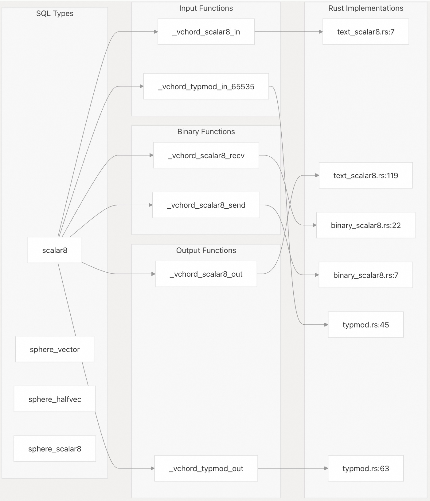
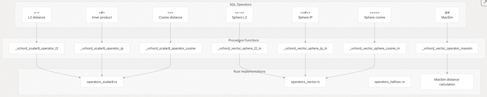
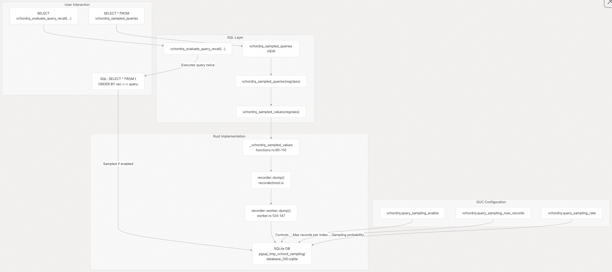
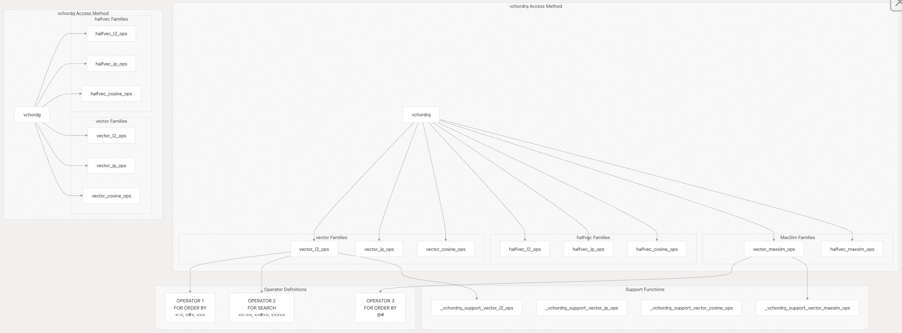

## VectorChord 源码学习: 2.4 数据类型和 SQL 接口 (Data Types and SQL Interface)  
              
### 作者              
digoal              
              
### 日期              
2025-10-30              
              
### 标签              
VectorChord , 源码学习              
              
----              
              
## 背景              
本文介绍 VectorChord 的 SQL 层面接口，包括**自定义数据类型 (custom data types)**、**距离运算符 (distance operators)**、**实用函数 (utility functions)** 和**运算符类 (operator class)** 定义。它侧重于用户通过 SQL 命令直接交互的 PostgreSQL 对象。  
  
## 数据类型 (Data Types)  
  
VectorChord 通过自定义数据类型 (custom data types) 扩展了 PostgreSQL，用于向量存储和搜索操作。  
  
### 向量类型 (Vector Types)  
  
VectorChord 定义了一种自定义向量类型 (custom vector type) 和三种球体类型 (sphere types)：  
  
| 类型名称 (Type Name) | 用途 (Purpose) | 存储 (Storage) | 维度 (Dimensions) |  
| :--- | :--- | :--- | :--- |  
| `scalar8` | 8 位量化向量 (8-bit quantized vector) | EXTERNAL, VARIABLE | 1-65535 |  
| `sphere_vector` | 用于范围搜索 (range search) 的球体 (全精度) | 复合类型 (Composite) | 匹配 `vector` |  
| `sphere_halfvec` | 用于范围搜索的球体 (半精度) | 复合类型 (Composite) | 匹配 `halfvec` |  
| `sphere_scalar8` | 用于范围搜索的球体 (量化) | 复合类型 (Composite) | 匹配 `scalar8` |  
  
`scalar8` 类型是具有自定义输入/输出函数 (custom input/output functions) 的完整 PostgreSQL **基础类型 (base type)**，而球体类型 (sphere types) 是定义为 `(center <vector_type>, radius REAL)` 的**复合类型 (composite types)**。  
  
来源:  
  
  - [`src/sql/finalize.sql` 3-28](https://github.com/tensorchord/VectorChord/blob/ac12e257/src/sql/finalize.sql#L3-L28)  
  
### scalar8 类型定义 (scalar8 Type Definition)  
  
`scalar8` 类型提供 8 位量化向量 (8-bit quantized vector) 存储，与 32 位浮点向量 (32-bit float vectors) 相比，可将内存占用减少约 4 倍：  
  
```sql  
CREATE TYPE scalar8 (  
    INPUT = _vchord_scalar8_in,  
    OUTPUT = _vchord_scalar8_out,  
    RECEIVE = _vchord_scalar8_recv,  
    SEND = _vchord_scalar8_send,  
    TYPMOD_IN = _vchord_typmod_in_65535,  
    TYPMOD_OUT = _vchord_typmod_out,  
    STORAGE = EXTERNAL,  
    INTERNALLENGTH = VARIABLE,  
    ALIGNMENT = double  
);  
```  
  
类型修改函数 (type modifier functions) `_vchord_typmod_in_65535` 和 `_vchord_typmod_out` 处理**维度规范 (dimension specification)** (例如，`scalar8(384)` 用于 384 维向量)。`EXTERNAL` 存储设置确保大型向量在必要时存储在 **TOAST 表 (TOAST tables)** 中。  
  
来源:  
  
  - [`src/sql/finalize.sql` 3-13](https://github.com/tensorchord/VectorChord/blob/ac12e257/src/sql/finalize.sql#L3-L13)  
  
### 球体类型 (Sphere Types)  
  
球体类型 (Sphere types) 支持在向量搜索期间进行**基于范围的过滤 (range-based filtering)**。每个球体都包含一个**中心点向量 (center vector)** 和一个**半径 (radius)**：  
  
```sql  
CREATE TYPE sphere_vector AS (  
    center vector,  
    radius REAL  
);  
```  
  
球体类型使用 `sphere()` 函数构造：  
  
```sql  
SELECT sphere('[1.0, 2.0, 3.0]'::vector, 0.5);  
SELECT sphere('[1.0, 2.0, 3.0]'::halfvec, 0.5);  
SELECT sphere('[1, 2, 3]'::scalar8, 0.5);  
```  
  
来源:  
  
  - [`src/sql/finalize.sql` 15-28](https://github.com/tensorchord/VectorChord/blob/ac12e257/src/sql/finalize.sql#L15-L28)  
  - [`src/sql/finalize.sql` 130-137](https://github.com/tensorchord/VectorChord/blob/ac12e257/src/sql/finalize.sql#L130-L137)  
  
### 类型实现映射 (Type Implementation Mapping)  
  
  
  
来源:  
  
  - [`src/sql/finalize.sql` 3-13](https://github.com/tensorchord/VectorChord/blob/ac12e257/src/sql/finalize.sql#L3-L13)  
  - [`sql/install/vchord--0.2.1.sql` 64-201](https://github.com/tensorchord/VectorChord/blob/ac12e257/sql/install/vchord--0.2.1.sql#L64-L201)  
  
-----  
  
## 距离运算符 (Distance Operators)  
  
VectorChord 提供了距离运算符 (distance operators)，用于**相似性搜索 (similarity search)** 和**基于球体的过滤 (sphere-based filtering)**。  
  
### 基本距离运算符 (Basic Distance Operators)  
  
为 `scalar8` 类型定义了三种距离运算符：  
  
| 运算符 (Operator) | 度量 (Metric) | 过程 (Procedure) | 用法 (Usage) |  
| :--- | :--- | :--- | :--- |  
| `<->` | 欧几里得 (L2) 距离 (Euclidean (L2) distance) | `_vchord_scalar8_operator_l2` | `a <-> b` |  
| `<#>` | 负内积 (Negative inner product) | `_vchord_scalar8_operator_ip` | `a <#> b` |  
| `<=>` | 余弦距离 (Cosine distance) | `_vchord_scalar8_operator_cosine` | `a <=> b` |  
  
这些运算符是**可交换的 (commutative)**，并返回 `real` (4 字节浮点数) 距离值。  
  
来源:  
  
  - [`src/sql/finalize.sql` 32-51](https://github.com/tensorchord/VectorChord/blob/ac12e257/src/sql/finalize.sql#L32-L51)  
  
### 球体搜索运算符 (Sphere Search Operators)  
  
球体运算符 (Sphere operators) 支持在**索引扫描 (index scans)** 期间进行基于范围的过滤。每个运算符返回一个布尔值 (boolean)，指示向量是否在球体的半径 (radius) 范围内：  
  
| 运算符 (Operator) | 度量 (Metric) | 左操作数 (Left Operand) | 右操作数 (Right Operand) | 用途 (Purpose) |  
| :--- | :--- | :--- | :--- | :--- |  
| `<<->>` | L2 距离 (L2 distance) | `vector`、`halfvec` 或 `scalar8` | 相应的球体类型 (Corresponding sphere type) | 距离在球体范围内 |  
| `<<#>>` | 内积 (Inner product) | `vector`、`halfvec` 或 `scalar8` | 相应的球体类型 (Corresponding sphere type) | 内积在球体范围内 |  
| `<<=>>` | 余弦距离 (Cosine distance) | `vector`、`halfvec` 或 `scalar8` | 相应的球体类型 (Corresponding sphere type) | 余弦距离在球体范围内 |  
  
使用示例：  
  
```sql  
SELECT * FROM items   
WHERE embedding <<->> sphere('[1.0, 2.0, 3.0]'::vector, 0.5);  
```  
  
球体运算符在**运算符类 (operator classes)** 中被标记为 `FOR SEARCH`，这使得 PostgreSQL 能够将它们识别为**可索引的搜索谓词 (indexable search predicates)**。  
  
来源:  
  
  - [`src/sql/finalize.sql` 53-114](https://github.com/tensorchord/VectorChord/blob/ac12e257/src/sql/finalize.sql#L53-L114)  
  - [`src/sql/finalize.sql` 336-413](https://github.com/tensorchord/VectorChord/blob/ac12e257/src/sql/finalize.sql#L336-L413)  
  
### MaxSim 运算符 (MaxSim Operator)  
  
`@#` 运算符实现了**最大相似度 (Maximum Similarity, MaxSim)** 搜索，用于**多向量查询 (multi-vector queries)**，通常用于 **ColBERT 风格的检索 (ColBERT-style retrieval)**：  
  
```sql  
CREATE OPERATOR @# (  
    PROCEDURE = _vchord_vector_operator_maxsim,  
    LEFTARG = vector[],  
    RIGHTARG = vector[]  
);  
```  
  
MaxSim 计算左侧数组中每个向量与右侧数组中所有向量之间的最大相似度，然后对这些最大值进行求和。它对 `vector` 或 `halfvec` 类型的数组进行操作。  
  
来源:  
  
  - [`src/sql/finalize.sql` 116-126](https://github.com/tensorchord/VectorChord/blob/ac12e257/src/sql/finalize.sql#L116-L126)  
  
### 运算符实现映射 (Operator Implementation Mapping)  
  
  
  
来源:  
  
  - [`src/sql/finalize.sql` 32-126](https://github.com/tensorchord/VectorChord/blob/ac12e257/src/sql/finalize.sql#L32-L126)  
  - [`sql/install/vchord--0.2.1.sql` 77-242](https://github.com/tensorchord/VectorChord/blob/ac12e257/sql/install/vchord--0.2.1.sql#L77-L242)  
  
-----  
  
## SQL 函数 (SQL Functions)  
  
VectorChord 提供实用函数 (utility functions)，用于**类型转换 (type conversion)**、**索引管理 (index management)** 和**查询分析 (query analysis)**。  
  
### 类型转换函数 (Type Conversion Functions)  
  
```  
-- Convert vector/halfvec to scalar8 (8-bit quantization)  
quantize_to_scalar8(vector) RETURNS scalar8  
quantize_to_scalar8(halfvec) RETURNS scalar8  
  
-- Construct sphere types  
sphere(vector, real) RETURNS sphere_vector  
sphere(halfvec, real) RETURNS sphere_halfvec  
sphere(scalar8, real) RETURNS sphere_scalar8  
```  
  
`quantize_to_scalar8()` 函数实现了 **8 位均匀量化 (8-bit uniform quantization)**，将输入向量的范围映射到 `[0, 255]`。  
  
来源:  
  
  - [`src/sql/finalize.sql` 130-143](https://github.com/tensorchord/VectorChord/blob/ac12e257/src/sql/finalize.sql#L130-L143)  
  
### 索引管理函数 (Index Management Functions)  
  
```  
-- Prewarm index pages into shared_buffers  
vchordrq_prewarm(regclass, integer default 0) RETURNS TEXT  
vchordg_prewarm(regclass) RETURNS TEXT  
  
-- Access method handlers (internal use)  
vchordrq_amhandler(internal) RETURNS index_am_handler  
vchordg_amhandler(internal) RETURNS index_am_handler  
```  
  
`prewarm` 函数将索引页加载到 PostgreSQL 的**缓冲区缓存 (buffer cache)** 中，以减少初始查询延迟 (initial query latency)。对于 `vchordrq_prewarm`，第二个参数指定要预热的**层次结构高度 (hierarchy height)** (0 = 所有级别)。  
  
来源:  
  
  - [`src/sql/finalize.sql` 224-229](https://github.com/tensorchord/VectorChord/blob/ac12e257/src/sql/finalize.sql#L224-L229)  
  - [`src/sql/finalize.sql` 303-307](https://github.com/tensorchord/VectorChord/blob/ac12e257/src/sql/finalize.sql#L303-L307)  
  - [`src/index/functions.rs` 22-63](https://github.com/tensorchord/VectorChord/blob/ac12e257/src/index/functions.rs#L22-L63)  
  
### 查询采样和召回率评估 (Query Sampling and Recall Evaluation)  
  
VectorChord 包含用于监控**查询模式 (query patterns)** 和评估**搜索质量 (search quality)** 的函数：  
  
```  
-- Get sampled query vectors for an index  
vchordrq_sampled_values(regclass) RETURNS SETOF TEXT  
  
-- Get sampled queries with metadata (returns table)  
vchordrq_sampled_queries(regclass)  
RETURNS TABLE(  
    schema_name NAME,  
    index_name NAME,  
    table_name NAME,  
    column_name NAME,  
    operator NAME,  
    value TEXT  
)  
  
-- Evaluate recall for a query  
vchordrq_evaluate_query_recall(  
    query text,  
    exact_search boolean default false,  
    accu_probes TEXT default NULL,  
    accu_epsilon real default 1.9  
) RETURNS real  
```  
  
召回率评估函数 (recall evaluation function) 执行两次查询：一次使用当前设置 (如果 `exact_search` 为 true，则禁用索引扫描得到`ground truth`) 以获得 **“粗略”结果 (rough results)** ；另一次使用高精度设置以获得 **“事实真相” (ground truth)** 。它返回在粗略结果中找到的事实真相结果的比例。  
  
来源:  
  
  - [`src/sql/finalize.sql` 145-301](https://github.com/tensorchord/VectorChord/blob/ac12e257/src/sql/finalize.sql#L145-L301)  
  - [`src/index/functions.rs` 90-110](https://github.com/tensorchord/VectorChord/blob/ac12e257/src/index/functions.rs#L90-L110)  
  - [`tests/vchordrq/recall.slt` 1-182](https://github.com/tensorchord/VectorChord/blob/ac12e257/tests/vchordrq/recall.slt#L1-L182)  
  
### 查询采样的函数调用流程 (Function Call Flow for Query Sampling)  
  
  
  
来源:  
  
  - [`src/sql/finalize.sql` 145-222](https://github.com/tensorchord/VectorChord/blob/ac12e257/src/sql/finalize.sql#L145-L222)  
  - [`src/index/functions.rs` 90-110](https://github.com/tensorchord/VectorChord/blob/ac12e257/src/index/functions.rs#L90-L110)  
  - [`src/recorder/worker.rs` 74-147](https://github.com/tensorchord/VectorChord/blob/ac12e257/src/recorder/worker.rs#L74-L147)  
  - [`src/index/gucs.rs` 30-34](https://github.com/tensorchord/VectorChord/blob/ac12e257/src/index/gucs.rs#L30-L34)  
  
-----  
  
## 访问方法和运算符类 (Access Methods and Operator Classes)  
  
VectorChord 在 PostgreSQL 中注册了两个**索引访问方法 (index access methods)**，每个方法支持多个**运算符类 (operator classes)**，用于不同的向量类型和距离度量 (distance metrics)。  
  
### 访问方法注册 (Access Method Registration)  
  
```sql  
CREATE ACCESS METHOD vchordrq TYPE INDEX HANDLER vchordrq_amhandler;  
CREATE ACCESS METHOD vchordg TYPE INDEX HANDLER vchordg_amhandler;  
```  
  
每个**访问方法处理函数 (access method handler function)** 返回一个 `IndexAmRoutine` 结构，其中包含用于索引操作 (**构建 (build)**、**插入 (insert)**、**扫描 (scan)** 等) 的回调函数 (callbacks)。  
  
来源:  
  
  - [`src/sql/finalize.sql` 311-312](https://github.com/tensorchord/VectorChord/blob/ac12e257/src/sql/finalize.sql#L311-L312)  
  
### 运算符族和运算符类 (Operator Families and Classes)  
  
**运算符族 (Operator families)** 为特定的索引访问方法 (index access method) 分组相关的运算符。VectorChord 为向量类型 (vector type) 和距离度量 (distance metric) 的每种组合定义了运算符族：  
  
| 族名称 (Family Name) | 向量类型 (Vector Type) | 度量 (Metric) | 访问方法 (Access Methods) |  
| :--- | :--- | :--- | :--- |  
| `vector_l2_ops` | `vector` | L2 距离 (L2 distance) | vchordrq, vchordg |  
| `vector_ip_ops` | `vector` | 内积 (Inner product) | vchordrq, vchordg |  
| `vector_cosine_ops` | `vector` | 余弦距离 (Cosine distance) | vchordrq, vchordg |  
| `halfvec_l2_ops` | `halfvec` | L2 距离 (L2 distance) | vchordrq, vchordg |  
| `halfvec_ip_ops` | `halfvec` | 内积 (Inner product) | vchordrq, vchordg |  
| `halfvec_cosine_ops` | `halfvec` | 余弦距离 (Cosine distance) | vchordrq, vchordg |  
| `vector_maxsim_ops` | `vector[]` | MaxSim (最大相似度) | 仅 vchordrq |  
| `halfvec_maxsim_ops` | `halfvec[]` | MaxSim (最大相似度) | 仅 vchordrq |  
  
来源:  
  
  - [`src/sql/finalize.sql` 316-329](https://github.com/tensorchord/VectorChord/blob/ac12e257/src/sql/finalize.sql#L316-L329)  
  
### 运算符类结构 (Operator Class Structure)  
  
每个运算符类 (operator class) 定义了：  
  
1.  **ORDER BY 运算符** (策略 1)：用于按距离对结果进行排序。  
2.  **SEARCH 运算符** (策略 2)：用于基于球体的过滤 (sphere-based filtering)。  
3.  **MaxSim 运算符** (策略 3)：用于 ColBERT 风格的**多向量搜索 (multi-vector search)**。  
4.  **支持函数 (Support function)**：返回索引构建配置选项。  
  
运算符类定义示例：  
  
```sql  
CREATE OPERATOR CLASS vector_l2_ops  
    FOR TYPE vector USING vchordrq FAMILY vector_l2_ops AS  
    OPERATOR 1 <-> (vector, vector) FOR ORDER BY float_ops,  
    OPERATOR 2 <<->> (vector, sphere_vector) FOR SEARCH,  
    FUNCTION 1 _vchordrq_support_vector_l2_ops();  
```  
  
支持函数 (FUNCTION 1) 实现了 `IndexAMValidate` 钩子 (hook)，提供**索引构建参数验证 (index build parameter validation)** 和**默认值 (defaults)**。  
  
来源:  
  
  - [`src/sql/finalize.sql` 333-413](https://github.com/tensorchord/VectorChord/blob/ac12e257/src/sql/finalize.sql#L333-L413)  
  
### 运算符类层次结构 (Operator Class Hierarchy)  
  
  
  
来源:  
  
  - [`src/sql/finalize.sql` 311-413](https://github.com/tensorchord/VectorChord/blob/ac12e257/src/sql/finalize.sql#L311-L413)  
  
-----  
  
## 视图 (Views)  
  
VectorChord 提供了一个视图 (view)，用于检查数据库中所有 vchordrq 索引的**采样查询 (sampled queries)**：  
  
```sql  
CREATE VIEW vchordrq_sampled_queries AS  
SELECT  
    record.schema_name,  
    record.index_name,  
    record.table_name,  
    record.column_name,  
    record.operator,  
    record.value  
FROM  
    (  
        SELECT i.oid  
        FROM pg_catalog.pg_class AS i  
        JOIN pg_catalog.pg_index AS ix ON i.oid = ix.indexrelid  
        JOIN pg_catalog.pg_opclass AS opc ON ix.indclass[0] = opc.oid  
        JOIN pg_catalog.pg_am AS am ON opc.opcmethod = am.oid  
        WHERE am.amname = 'vchordrq'  
    ) AS index_oids  
CROSS JOIN LATERAL vchordrq_sampled_queries(index_oids.oid::regclass) AS record;  
```  
  
此视图自动发现所有 vchordrq 索引，并为每个索引调用 `vchordrq_sampled_queries(regclass)`，以聚合所有索引中的采样查询向量 (sampled query vectors)。查询采样 (Query sampling) 必须通过 **GUC 参数 (GUC parameters)** 启用。  
  
使用示例：  
  
```sql  
-- View all sampled queries  
SELECT * FROM vchordrq_sampled_queries;  
  
-- Evaluate recall for sampled queries on a specific index  
SELECT AVG(  
    vchordrq_evaluate_query_recall(  
        format('SELECT ctid FROM %I.%I ORDER BY %I %s %L LIMIT 10',  
               schema_name, table_name, column_name, operator, value)  
    )  
)  
FROM vchordrq_sampled_queries  
WHERE index_name = 'my_index';  
```  
  
来源:  
  
  - [`src/sql/finalize.sql` 417-434](https://github.com/tensorchord/VectorChord/blob/ac12e257/src/sql/finalize.sql#L417-L434)  
  - [`tests/vchordrq/recall.slt` 99-129](https://github.com/tensorchord/VectorChord/blob/ac12e257/tests/vchordrq/recall.slt#L99-L129)  
  
-----  
  
## 配置参数 (Configuration Parameters)  
  
VectorChord 通过 PostgreSQL 的 **GUC (Grand Unified Configuration，大统一配置) 系统**公开运行时配置。主要参数包括：  
  
| 参数 (Parameter) | 类型 (Type) | 默认值 (Default) | 描述 (Description) |  
| :--- | :--- | :--- | :--- |  
| `vchordrq.enable_scan` | boolean (布尔值) | `true` | 启用 vchordrq 索引扫描 (index scans) |  
| `vchordrq.probes` | string (字符串) | `""` | 要探测的**质心 (centroids)** 数量 |  
| `vchordrq.epsilon` | float (浮点数) | `1.9` | 用于**重排序 (reranking)** 的搜索 epsilon |  
| `vchordrq.max_scan_tuples` | integer (整数) | `-1` | 要扫描的**元组 (tuples)** 最大数量 (-1 = 无限制) |  
| `vchordrq.prefilter` | boolean (布尔值) | `false` | 在重排序前应用 WHERE 过滤器 (filters) |  
| `vchordrq.io_search` | enum (枚举) | `read_stream` (PG17+), `prefetch_buffer` (PG13-16) | 用于搜索的 I/O 策略 (strategy) |  
| `vchordrq.io_rerank` | enum (枚举) | `read_stream` (PG17+), `prefetch_buffer` (PG13-16) | 用于重排序的 I/O 策略 (strategy) |  
| `vchordrq.query_sampling_enable` | boolean (布尔值) | `false` | 启用查询采样 (query sampling) (**SUSET**) |  
| `vchordrq.query_sampling_max_records` | integer (整数) | `0` | 每个索引的最大采样查询数量 (**SUSET**) |  
| `vchordrq.query_sampling_rate` | float (浮点数) | `0.0` | 查询采样概率 0.0-1.0 (**SUSET**) |  
| `vchordg.enable_scan` | boolean (布尔值) | `true` | 启用 vchordg 索引扫描 (index scans) |  
| `vchordg.ef_search` | integer (整数) | `64` | vchordg 的搜索宽度 (search width) |  
| `vchordg.beam_search` | integer (整数) | `1` | vchordg 搜索的**波束宽度 (beam width)** |  
| `vchordg.max_scan_tuples` | integer (整数) | `-1` | 要扫描的元组最大数量 (-1 = 无限制) |  
  
大多数参数使用 `GucContext::Userset`，允许进行**会话级别 (per-session)** 或**事务级别 (per-transaction)** 的更改。查询采样参数需要**超级用户权限 (superuser privileges, `GucContext::Suset`)**，因为它们会影响**共享存储 (shared storage)**。  
  
来源:  
  
  - [`src/index/gucs.rs` 19-380](https://github.com/tensorchord/VectorChord/blob/ac12e257/src/index/gucs.rs#L19-L380)  
  - [`tests/vchordrq/recall.slt` 12-80](https://github.com/tensorchord/VectorChord/blob/ac12e257/tests/vchordrq/recall.slt#L12-L80)  
  
-----  
  
## 使用示例 (Usage Examples)  
  
### 使用不同的运算符类创建索引 (Creating Indexes with Different Operator Classes)  
  
```sql  
-- Create table with vector columns  
CREATE TABLE documents (  
    id SERIAL PRIMARY KEY,  
    embedding_fp32 vector(384),  
    embedding_fp16 halfvec(384)  
);  
  
-- Create vchordrq index with L2 distance  
CREATE INDEX ON documents   
USING vchordrq (embedding_fp32 vector_l2_ops);  
  
-- Create vchordg index with cosine distance  
CREATE INDEX ON documents   
USING vchordg (embedding_fp32 vector_cosine_ops);  
  
-- Create index on half-precision vectors with inner product  
CREATE INDEX ON documents   
USING vchordrq (embedding_fp16 halfvec_ip_ops);  
```  
  
### 使用 scalar8 量化 (Using scalar8 Quantization)  
  
```sql  
-- Add quantized column  
ALTER TABLE documents ADD COLUMN embedding_scalar8 scalar8(384);  
  
-- Populate quantized vectors  
UPDATE documents   
SET embedding_scalar8 = quantize_to_scalar8(embedding_fp32);  
  
-- Create index on quantized vectors  
CREATE INDEX ON documents   
USING vchordrq (embedding_scalar8);  
  
-- Query using quantized vectors  
SELECT id FROM documents   
ORDER BY embedding_scalar8 <-> quantize_to_scalar8('[...]'::vector)   
LIMIT 10;  
```  
  
### 基于球体的范围搜索 (Sphere-Based Range Search)  
  
```sql  
-- Find vectors within distance 0.5 of query  
SELECT id, embedding_fp32 <-> '[...]'::vector AS distance  
FROM documents  
WHERE embedding_fp32 <<->> sphere('[...]'::vector, 0.5)  
ORDER BY distance  
LIMIT 100;  
```  
  
### MaxSim 搜索 (MaxSim Search)  
  
```sql  
-- ColBERT-style multi-vector search  
CREATE TABLE colbert_docs (  
    id SERIAL PRIMARY KEY,  
    token_embeddings vector(128)[]  
);  
  
CREATE INDEX ON colbert_docs   
USING vchordrq (token_embeddings vector_maxsim_ops);  
  
-- Query with multiple token embeddings  
SELECT id FROM colbert_docs  
ORDER BY token_embeddings @# ARRAY[  
    '[...]'::vector,  
    '[...]'::vector,  
    '[...]'::vector  
]::vector[]  
LIMIT 10;  
```  
  
来源:  
  
  - [`src/sql/finalize.sql` 333-377](https://github.com/tensorchord/VectorChord/blob/ac12e257/src/sql/finalize.sql#L333-L377)  
  - [`tests/vchordrq/recall.slt` 1-10](https://github.com/tensorchord/VectorChord/blob/ac12e257/tests/vchordrq/recall.slt#L1-L10)  
  
# 附录: 查询采样的原理、使用场景和用法  
VectorChord 中的 **查询采样(Query Sampling)** 是 `vchordrq` 索引的一个性能分析特性。   
  
有点类似PG数据库的LOG里的一个功能, 当SQL耗时超过阈值, 不会全部进行记录, 采样率决定了慢SQL有多大概率被记录到LOG文件里面.    
  
[《PostgreSQL 13 preview - SQL采样比例设置 log_min_duration_sample log_min_duration_sample》](../201912/20191204_04.md)    
  
## 原理  
  
查询采样系统在查询执行时捕获向量查询, 并将其存储到 SQLite 数据库中供后续分析。   
  
**工作流程:**  
  
1. **采样决策**: 当 `vchordrq.query_sampling_enable` 启用时, 系统根据 `vchordrq.query_sampling_rate` 概率随机决定是否采样当前查询    
  
2. **数据存储**: 采样的查询向量被存储到 `pgsql_tmp_vchord_sampling/database_{database_oid}.sqlite` SQLite 数据库中,每个索引有独立的表 `index_{indexrelid}`   
  
3. **记录维护**: 系统根据 `vchordrq.query_sampling_max_records` 限制每个索引保留的最大查询数量(0-10000)    
  
## 使用场景  
  
查询采样主要用于以下场景:  
  
1. **召回率评估**: 通过 `vchordrq_evaluate_query_recall()` 函数评估索引在真实查询负载下的召回率    
  
2. **性能调优**: 分析实际查询模式,优化 `probes` 和 `epsilon` 等参数   
  
3. **索引质量监控**: 持续监控生产环境中索引的查询性能   
  
## 用法  
  
### 1. 启用查询采样  
  
需要超级用户权限配置(GucContext::Suset):    
  
```sql  
-- 启用采样  
ALTER SYSTEM SET vchordrq.query_sampling_enable = on;  
  
-- 设置采样率(0.0-1.0,1.0表示100%采样)  
ALTER SYSTEM SET vchordrq.query_sampling_rate = 1.0;  
  
-- 设置每个索引最多保留的查询数  
ALTER SYSTEM SET vchordrq.query_sampling_max_records = 100;  
  
-- 重新加载配置  
SELECT pg_reload_conf();  
```  
  
### 2. 查看采样的查询  
  
使用 `vchordrq_sampled_queries` 视图或函数:    
  
```sql  
-- 查看所有vchordrq索引的采样查询  
SELECT * FROM vchordrq_sampled_queries;  
  
-- 查看特定索引的采样查询  
SELECT * FROM vchordrq_sampled_queries('idx_name');  
```  
  
返回字段包括: `schema_name`, `index_name`, `table_name`, `column_name`, `operator`, `value`    
  
### 3. 评估召回率  
  
使用 `vchordrq_evaluate_query_recall()` 函数:    
  
```sql  
-- 评估单个查询的召回率  
SELECT vchordrq_evaluate_query_recall(  
    query => 'SELECT ctid FROM table ORDER BY vec <-> ''[1,2,3]'' LIMIT 10'  
);  
  
-- 使用精确搜索作为ground truth  
SELECT vchordrq_evaluate_query_recall(  
    query => 'SELECT ctid FROM table ORDER BY vec <-> ''[1,2,3]'' LIMIT 10',  
    exact_search => true  
);  
  
-- 评估所有采样查询的平均召回率  
SELECT AVG(  
    vchordrq_evaluate_query_recall(  
        query => format(  
            'SELECT ctid FROM %I.%I ORDER BY %I OPERATOR(%s) %L LIMIT 10',  
            schema_name, table_name, column_name, operator, value  
        )  
    )  
)  
FROM vchordrq_sampled_queries('idx_name');  
```  
  
**参数说明:**  
- `query`: 要评估的SQL查询(必须返回ctid)  
- `exact_search`: 是否使用精确搜索作为ground truth(默认false,使用高精度参数)  
- `accu_probes`: ground truth使用的probes设置(默认NULL,自动推断)  
- `accu_epsilon`: ground truth使用的epsilon值(默认1.9)  
  
**算法:** 函数执行查询两次,一次使用当前设置(rough),一次使用高精度设置(accu),然后计算召回率 = `|rough ∩ accu| / |accu|`    
  
### 4. 测试示例    
```  
ALTER SYSTEM SET vchordrq.query_sampling_max_records = 1;  
  
statement ok  
ALTER SYSTEM SET vchordrq.query_sampling_rate = 1;  
  
statement ok  
ALTER SYSTEM SET vchordrq.query_sampling_enable = on;  
  
statement ok  
SELECT pg_reload_conf();  
  
query I retry 5 backoff 1s  
SHOW vchordrq.query_sampling_enable;  
----  
on  
  
statement ok  
SELECT * from t ORDER BY val <-> '[0.50, 0.25, 1.00]';  
  
statement ok  
SELECT * from t_dim4 ORDER BY val <-> '[1.00, 0.50, 0.25, 0]';  
  
query I  
SELECT value from vchordrq_sampled_queries('idx1');  
----  
[0.5,0.25,1]  
  
query I  
SELECT value from vchordrq_sampled_queries('idx2');  
----  
[1,0.5,0.25,0]  
  
query I  
SELECT COUNT(*) from vchordrq_sampled_queries;  
----  
2  
  
statement ok  
SELECT * from t_dim4 ORDER BY val <-> '[2.1, 0.3, 0.7, 0.9]';  
  
query I  
SELECT * from vchordrq_sampled_queries('idx2');  
----  
public idx2 t_dim4 val <-> [2.1,0.3,0.7,0.9]  
  
query I  
SELECT AVG(recall_value)  
FROM (  
    SELECT  
        vchordrq_evaluate_query_recall(  
            query => format(  
                'SELECT ctid FROM %I.%I ORDER BY %I OPERATOR(%s) %L LIMIT 10',  
                lq.schema_name,  
                lq.table_name,  
                lq.column_name,  
                lq.operator,  
                lq.value  
            )  
        ) AS recall_value  
    FROM  
        vchordrq_sampled_queries('idx2') AS lq  
) AS eval_results;  
----  
1  
```  
  
## Notes  
  
- 查询采样功能仅适用于 `vchordrq` 索引,不支持 `vchordg`   
- SQLite 数据库目录名以 `pgsql_tmp` 开头,确保不会被 `pg_basebackup` 备份   
- MaxSim 操作符(`@#`)的召回率评估必须使用 `exact_search => true`,因为无法通过调整参数获得准确的ground truth    
- 如果查询没有返回结果,`vchordrq_evaluate_query_recall()` 返回 `NaN`    
            
#### [期望 PostgreSQL|开源PolarDB 增加什么功能?](https://github.com/digoal/blog/issues/76 "269ac3d1c492e938c0191101c7238216")
  
  
#### [PolarDB 开源数据库](https://openpolardb.com/home "57258f76c37864c6e6d23383d05714ea")
  
  
#### [PolarDB 学习图谱](https://www.aliyun.com/database/openpolardb/activity "8642f60e04ed0c814bf9cb9677976bd4")
  
  
#### [PostgreSQL 解决方案集合](../201706/20170601_02.md "40cff096e9ed7122c512b35d8561d9c8")
  
  
#### [德哥 / digoal's Github - 公益是一辈子的事.](https://github.com/digoal/blog/blob/master/README.md "22709685feb7cab07d30f30387f0a9ae")
  
  
#### [About 德哥](https://github.com/digoal/blog/blob/master/me/readme.md "a37735981e7704886ffd590565582dd0")
  
  

  
