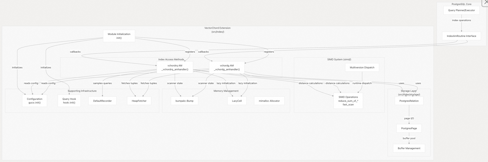
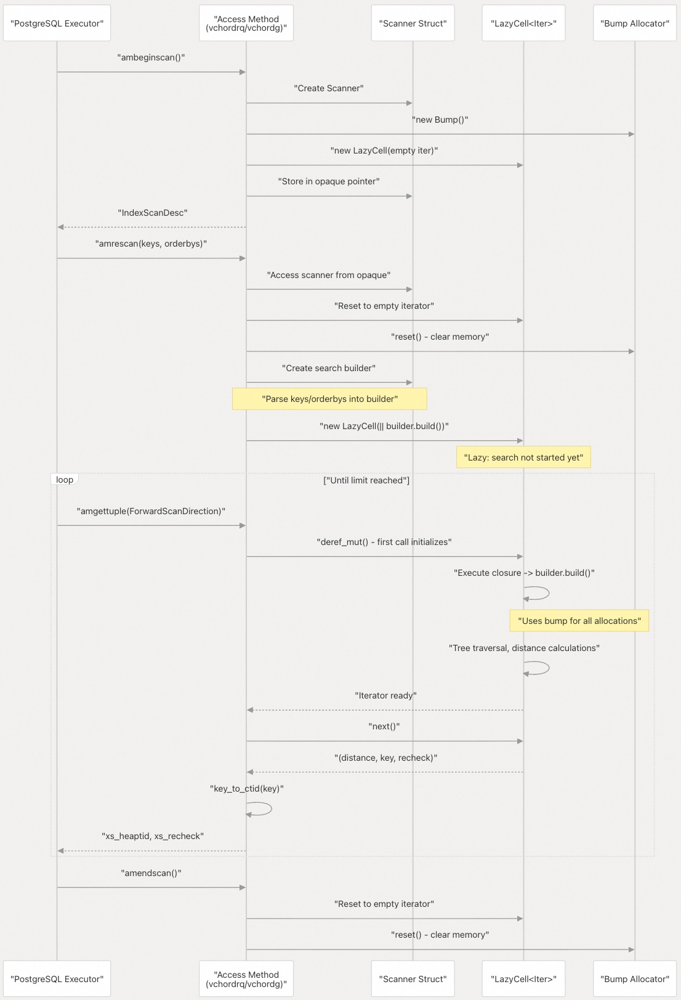
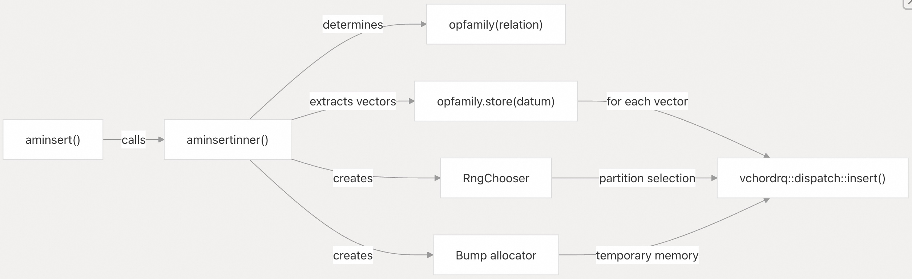
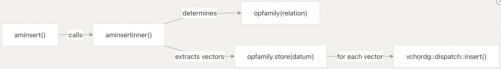
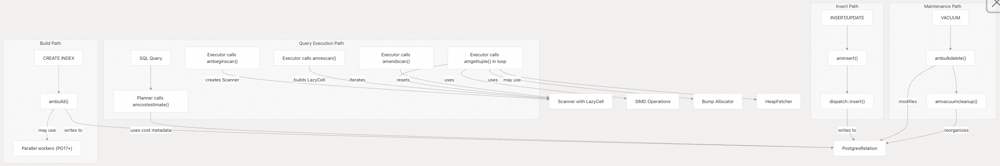

## VectorChord 源码学习: 3 核心组件 (Core Components)  
                
### 作者                
digoal                
                
### 日期                
2025-10-30                
                
### 标签                
VectorChord , 源码学习                
                
----                
                
## 背景                
本文介绍 **VectorChord** 主要技术子系统的架构概览。构成该扩展实现的**核心组件 (Core Components)**，它们如何相互作用，以在 **PostgreSQL** 中提供**向量相似性搜索 (vector similarity search)** 的能力。  
  
**VectorChord** 围绕两个专门的**索引存取方法 (Index Access Method, AM)**（`vchordrq` 和 `vchordg`）、一个复杂的**存储层 (storage layer)**、高性能的 **SIMD 操作 (SIMD operations)**，以及专门的**内存管理策略 (memory management strategies)** 构建。每个组件都旨在与 **PostgreSQL** 现有的基础设施无缝集成，同时提供大规模**向量相似性搜索**所需的性能特征。  
  
## 组件架构概览 (Component Architecture Overview)  
  
  
  
**来源 (Sources):**  
  
  - [`src/index/mod.rs` 1-31](https://github.com/tensorchord/VectorChord/blob/ac12e257/src/index/mod.rs#L1-L31)  
  - [`src/index/vchordrq/am/mod.rs` 1-585](https://github.com/tensorchord/VectorChord/blob/ac12e257/src/index/vchordrq/am/mod.rs#L1-L585)  
  - [`src/index/vchordg/am/mod.rs` 1-462](https://github.com/tensorchord/VectorChord/blob/ac12e257/src/index/vchordg/am/mod.rs#L1-L462)  
  
## PostgreSQL 索引存取方法 (Index Access Method) 接口  
  
**VectorChord** 通过 `IndexAmRoutine` 结构实现了 **PostgreSQL** 的**索引存取方法 (Index Access Method, AM)** 接口。`vchordrq` 和 `vchordg` 都通过返回填充了 `IndexAmRoutine` 结构的**句柄函数 (handler functions)** 将自身注册为不同的**存取方法 (access methods)**。  
  
**IndexAmRoutine 回调函数 (Callback) 映射**  
  
| 回调函数 (Callback Function) | vchordrq 实现 (Implementation) | vchordg 实现 (Implementation) | 目的 (Purpose) |  
| :--- | :--- | :--- | :--- |  
| `amvalidate` | `amvalidate()` | `amvalidate()` | 验证操作符类 (Validate operator class) |  
| `amoptions` | `amoptions()` | `amoptions()` | 解析索引选项 (**TOML**) |  
| `amcostestimate` | `amcostestimate()` | `amcostestimate()` | 为**规划器 (planner)** 估算查询**成本 (cost)** |  
| `ambuild` | `am_build::ambuild()` | `am_build::ambuild()` | 从 **堆 (heap)** 构建索引 |  
| `ambuildempty` | `am_build::ambuildempty()` | `am_build::ambuildempty()` | 创建空索引 |  
| `ambuildphasename` | `am_build::ambuildphasename()` | `am_build::ambuildphasename()` | 报告构建阶段名称 |  
| `aminsert` | `aminsert()` | `aminsert()` | 将**元组 (tuple)** 插入索引 |  
| `ambulkdelete` | `ambulkdelete()` | `ambulkdelete()` | 在 **VACUUM** 期间**批量删除 (Bulk delete)** |  
| `amvacuumcleanup` | `am_vacuumcleanup::amvacuumcleanup()` | `amvacuumcleanup()` | **Post-vacuum** 清理 |  
| `ambeginscan` | `ambeginscan()` | `ambeginscan()` | 初始化**扫描 (scan)** |  
| `amrescan` | `amrescan()` | `amrescan()` | 使用新键重置扫描 |  
| `amgettuple` | `amgettuple()` | `amgettuple()` | 获取下一个元组 |  
| `amendscan` | `amendscan()` | `amendscan()` | 结束扫描并清理 |  
  
**关键配置标志 (Key Configuration Flags)**  
  
两种存取方法都使用特定的功能配置了 `IndexAmRoutine`：  
  
```  
amcanorderbyop = true        // 支持带距离操作符的 ORDER BY  
amoptionalkey = true         // 允许不带 WHERE 子句的扫描  
amcanbuildparallel = true    // 启用并行索引构建 (PG17+)  
```  
  
设置 `amoptionalkey` 标志为 `true` 时有一个特殊考虑：尽管 **PostgreSQL** 要求索引能够处理不带索引子句的扫描，但 **VectorChord** 强制要求向量扫描必须带有 `ORDER BY` 子句或适当的索引子句。没有这些子句的扫描将在运行时被拒绝并报错  
[`src/index/vchordrq/am/mod.rs` 419-423](https://github.com/tensorchord/VectorChord/blob/ac12e257/src/index/vchordrq/am/mod.rs#L419-L423) [`src/index/vchordg/am/mod.rs` 347-351](https://github.com/tensorchord/VectorChord/blob/ac12e257/src/index/vchordg/am/mod.rs#L347-L351)  
  
**来源 (Sources):**  
  
  - [`src/index/vchordrq/am/mod.rs` 82-133](https://github.com/tensorchord/VectorChord/blob/ac12e257/src/index/vchordrq/am/mod.rs#L82-L133)  
  - [`src/index/vchordg/am/mod.rs` 78-130](https://github.com/tensorchord/VectorChord/blob/ac12e257/src/index/vchordg/am/mod.rs#L78-L130)  
  
## 扫描器 (Scanner) 生命周期和状态管理  
  
  
  
`Scanner` 结构在多次调用中维护**扫描状态 (scan state)**：  
  
**Scanner 结构**  
```  
pub struct Scanner {  
    pub hack: Option<NonNull<IndexScanState>>,  
    scanning: LazyCell<Iter, Box<dyn FnOnce() -> Iter>>,  
    bump: Box<bumpalo::Bump>,  
}  
```  
  
关键特征：  
  
  * **延迟单元格初始化 (LazyCell initialization)**：搜索**迭代器 (iterator)** 直到第一次 `amgettuple()` 调用才构建，从而**延迟 (deferring)** 了诸如**树遍历初始化 (tree traversal initialization)** 和**质心加载 (centroid loading)** 等昂贵操作  
    [`src/index/vchordrq/am/mod.rs` 392-401](https://github.com/tensorchord/VectorChord/blob/ac12e257/src/index/vchordrq/am/mod.rs#L392-L401) [`src/index/vchordg/am/mod.rs` 320-329](https://github.com/tensorchord/VectorChord/blob://ac12e257/src/index/vchordg/am/mod.rs#L320-L329)  
  * **Bump 分配器 (Bump allocator) 生命周期**：`bump` 分配器为所有搜索状态提供**竞技场式 (arena-based) 分配**。它在**重扫描 (rescans)** 之间会**重置 (reset)**，但在单次扫描中会**重复使用 (reused)**  
    [`src/index/vchordrq/am/mod.rs` 426](https://github.com/tensorchord/VectorChord/blob/ac12e257/src/index/vchordrq/am/mod.rs#L426-L426) [`src/index/vchordg/am/mod.rs` 354](https://github.com/tensorchord/VectorChord/blob://ac12e257/src/index/vchordg/am/mod.rs#L354-L354)  
  * **内存上下文 (Memory context)**：扫描器在 **PostgreSQL** 的 `CurrentMemoryContext` 中分配，并在**内存上下文**被销毁时自动清理  
    [`src/index/vchordrq/am/mod.rs` 398](https://github.com/tensorchord/VectorChord/blob/ac12e257/src/index/vchordrq/am/mod.rs#L398-L398)  
  
**来源 (Sources):**  
  
  - [`src/index/vchordrq/am/mod.rs` 384-551](https://github.com/tensorchord/VectorChord/blob/ac12e257/src/index/vchordrq/am/mod.rs#L384-L551)  
  - [`src/index/vchordg/am/mod.rs` 311-453](https://github.com/tensorchord/VectorChord/blob/ac12e257/src/index/vchordg/am/mod.rs#L311-L453)  
  
## 索引插入和维护操作 (Index Insert and Maintenance Operations)  
  
两种存取方法都通过专门的**调度机制 (dispatch mechanisms)** 实现**元组 (tuple)** 插入和维护，这些机制处理不同的**操作符族 (operator families)** 和**向量类型 (vector types)**。  
  
**vchordrq 插入流程 (Insert Flow)**  
  
  
  
`aminsert()` 函数：  
  
1.  确定**操作符族**（L2、余弦 (cosine)、IP、MaxSim）  
    [`src/index/vchordrq/am/mod.rs` 317](https://github.com/tensorchord/VectorChord/blob/ac12e257/src/index/vchordrq/am/mod.rs#L317-L317)  
2.  从 **datum** 中提取向量（处理 **MaxSim** 的**多向量类型 (multi-vector types)**）  
    [`src/index/vchordrq/am/mod.rs` 321](https://github.com/tensorchord/VectorChord/blob/ac12e257/src/index/vchordrq/am/mod.rs#L321-L321)  
3.  将 `ctid`（**物理元组指针 (physical tuple pointer)**）转换为内部键格式  
    [`src/index/vchordrq/am/mod.rs` 323](https://github.com/tensorchord/VectorChord/blob://ac12e257/src/index/vchordrq/am/mod.rs#L323-L323)  
4.  创建实现 `InsertChooser` **特性 (trait)** 的 `RngChooser`，用于**随机分区选择 (random partition selection)**  
    [`src/index/vchordrq/am/mod.rs` 310-315](https://github.com/tensorchord/VectorChord/blob/ac12e257/src/index/vchordrq/am/mod.rs#L310-L315)  
5.  **调度 (Dispatches)** 到特定于**类型 (type-specific)** 的插入实现  
    [`src/index/vchordrq/am/mod.rs` 327-336](https://github.com/tensorchord/VectorChord/blob://ac12e257/src/index/vchordrq/am/mod.rs#L327-L336)  
  
**vchordg 插入流程 (Insert Flow)**  
  
`vchordg` 遵循类似的模式，但插入逻辑更简单（没有**分区选择**）：  
  
  
  
**批量删除 (Bulk Delete) 和 VACUUM**  
  
两种存取方法都实现了 `ambulkdelete()`，用于在 **VACUUM** 操作期间删除**元组**：  
  
1.  遍历索引结构  
2.  对于每个**指针 (pointer)**，使用 `key_to_ctid()` 转换为 `ctid`  
    [`src/index/vchordrq/am/mod.rs` 373](https://github.com/tensorchord/VectorChord/blob/ac12e257/src/index/vchordrq/am/mod.rs#L373-L373)  
3.  调用 **PostgreSQL** 的**回调函数 (callback)**，检查**元组 (tuple)** 是否应被删除  
    [`src/index/vchordrq/am/mod.rs` 376](https://github.com/tensorchord/VectorChord/blob://ac12e257/src/index/vchordrq/am/mod.rs#L376-L376)  
4.  定期调用 `vacuum_delay_point()` 以允许其他操作  
    [`src/index/vchordrq/am/mod.rs` 358-369](https://github.com/tensorchord/VectorChord/blob://ac12e257/src/index/vchordrq/am/mod.rs#L358-L369)  
  
`vchordrq` 还实现了 `amvacuumcleanup()`，用于 **post-vacuum** 维护任务，例如**重组 (reorganizing)** **磁带结构 (tape structures)**  
[`src/index/vchordrq/am/mod.rs` 122](https://github.com/tensorchord/VectorChord/blob://ac12e257/src/index/vchordrq/am/mod.rs#L122-L122)  
  
**来源 (Sources):**  
  
  - [`src/index/vchordrq/am/mod.rs` 269-340](https://github.com/tensorchord/VectorChord/blob/ac12e257/src/index/vchordrq/am/mod.rs#L269-L340)  
  - [`src/index/vchordg/am/mod.rs` 185-239](https://github.com/tensorchord/VectorChord/blob/ac12e257/src/index/vchordg/am/mod.rs#L185-L239)  
  - [`src/index/vchordrq/am/mod.rs` 342-381](https://github.com/tensorchord/VectorChord/blob/ac12e257/src/index/vchordrq/am/mod.rs#L342-L381)  
  - [`src/index/vchordg/am/mod.rs` 241-309](https://github.com/tensorchord/VectorChord/blob/ac12e257/src/index/vchordg/am/mod.rs#L241-L309)  
  
## 查询规划的成本估算 (Cost Estimation for Query Planning)  
  
**PostgreSQL** 的**查询规划器 (query planner)** 使用**成本估算 (cost estimates)** 来决定是否使用索引。**VectorChord** 为 `vchordrq` 实现了复杂的**成本估算**，而为 `vchordg` 使用了更简单的**估算**。  
  
**vchordrq 成本估算 (Cost Estimation)**  
  
`amcostestimate()` 函数根据以下因素计算**成本 (costs)**：  
  
1.  **选择性计算 (Selectivity calculation)**：使用 **PostgreSQL** 的 `clauselist_selectivity()` 来**估算 (estimate)** **过滤器选择性 (filter selectivity)**  
    [`src/index/vchordrq/am/mod.rs` 184-198](https://github.com/tensorchord/VectorChord/blob/ac12e257/src/index/vchordrq/am/mod.rs#L184-L198)  
2.  **元数据读取 (Metadata reading)**：打开索引关系并通过 `vchordrq::cost()` 读取**成本元数据 (cost metadata)**  
    [`src/index/vchordrq/am/mod.rs` 219-221](https://github.com/tensorchord/VectorChord/blob://ac12e257/src/index/vchordrq/am/mod.rs#L219-L221)  
3.  **节点遍历成本 (Node traversal cost)**：根据 `probes` 配置**估算 (estimates)** 在每个树级别访问的**节点数 (nodes visited)**  
    [`src/index/vchordrq/am/mod.rs` 229-240](https://github.com/tensorchord/VectorChord/blob://ac12e257/src/index/vchordrq/am/mod.rs#L229-L240)  
4.  **页面 I/O 成本 (Page I/O cost)**：根据以下因素**估算 (estimates)** 读取的**页面数 (pages read)**：  
      * **元数据页面 (Metadata page)** (1 个页面)  
        [`src/index/vchordrq/am/mod.rs` 243](https://github.com/tensorchord/VectorChord/blob://ac12e257/src/index/vchordrq/am/mod.rs#L243-L243)  
      * **质心数据 (Centroid data)** (`node_count * dims / 60000`)  
        [`src/index/vchordrq/am/mod.rs` 244](https://github.com/tensorchord/VectorChord/blob://ac12e257/src/index/vchordrq/am/mod.rs#L244-L244)  
      * **向量数据磁带 (Vector data tapes)**  
        [`src/index/vchordrq/am/mod.rs` 245-248](https://github.com/tensorchord/VectorChord/blob://ac12e257/src/index/vchordrq/am/mod.rs#L245-L248)  
      * **叶子级别页面 (Leaf level pages)**  
        [`src/index/vchordrq/am/mod.rs` 249](https://github.com/tensorchord/VectorChord/blob://ac12e257/src/index/vchordrq/am/mod.rs#L249-L249)  
5.  **总成本计算 (Total cost computation)**：  
      * `index_startup_cost = 0.001 * node_count`  
        [`src/index/vchordrq/am/mod.rs` 254](https://github.com/tensorchord/VectorChord/blob://ac12e257/src/index/vchordrq/am/mod.rs#L254-L254)  
      * `index_total_cost = startup + next_count`，其中 `next_count` 考虑了 `LIMIT` 和**选择性 (selectivity)**  
        [`src/index/vchordrq/am/mod.rs` 252-255](https://github.com/tensorchord/VectorChord/blob://ac12e257/src/index/vchordrq/am/mod.rs#L252-L255)  
  
**禁用索引使用 (Disabling Index Usage)**  
  
索引可以通过 **GUC 参数**（`vchordrq_enable_scan`，`vchordg_enable_scan`）禁用。禁用时，**成本估算器 (cost estimator)** 返回 `disable_cost` 以阻止**规划器 (planner)** 选择该索引  
[`src/index/vchordrq/am/mod.rs` 175-183](https://github.com/tensorchord/VectorChord/blob://ac12e257/src/index/vchordrq/am/mod.rs#L175-L183) [`src/index/vchordg/am/mod.rs` 169-176](https://github.com/tensorchord/VectorChord/blob://ac12e257/src/index/vchordg/am/mod.rs#L169-L176)  
  
不带 `ORDER BY` 或索引子句的扫描也会被 `disable_cost` 禁用  
[`src/index/vchordrq/am/mod.rs` 174-183](https://github.com/tensorchord/VectorChord/blob://ac12e257/src/index/vchordrq/am/mod.rs#L174-L183)  
  
**来源 (Sources):**  
  
  - [`src/index/vchordrq/am/mod.rs` 159-267](https://github.com/tensorchord/VectorChord/blob/ac12e257/src/index/vchordrq/am/mod.rs#L159-L267)  
  - [`src/index/vchordg/am/mod.rs` 156-183](https://github.com/tensorchord/VectorChord/blob/ac12e257/src/index/vchordg/am/mod.rs#L156-L183)  
  
## 配置和查询采样 (Query Sampling) 集成  
  
两种**存取方法 (access methods)** 都集成了 **VectorChord** 的**配置系统 (configuration system)**（**GUC**s）和可选的**查询采样 (query sampling) 基础设施**。  
  
**搜索选项配置 (Search Options Configuration)**  
  
在 `amrescan()` 期间，搜索参数从 **GUC**s 中读取：  
  
**vchordrq 选项**  
[`src/index/vchordrq/am/mod.rs` 429-438](https://github.com/tensorchord/VectorChord/blob://ac12e257/src/index/vchordrq/am/mod.rs#L429-L438)：  
```  
SearchOptions {  
    epsilon: gucs::vchordrq_epsilon(),  
    probes: gucs::vchordrq_probes(),  
    max_scan_tuples: gucs::vchordrq_max_scan_tuples(),  
    maxsim_refine: gucs::vchordrq_maxsim_refine(),  
    maxsim_threshold: gucs::vchordrq_maxsim_threshold(),  
    io_search: gucs::vchordrq_io_search(),  
    io_rerank: gucs::vchordrq_io_rerank(),  
    prefilter: gucs::vchordrq_prefilter(),  
}  
```  
  
| GUC 参数 (GUC Parameter) | 目的 (Purpose) |  
| :--- | :--- |  
| `vchordrq.probes` | 要访问的倒排列表数 |  
| `vchordrq.k` | 要从倒排列表中检索的初始 **k** 值 |  
| `vchordrq.rerank_limit` | **重排 (rerank)** 之前要考虑的最大**元组 (tuple)** 数 |  
  
**vchordg 选项**  
[`src/index/vchordg/am/mod.rs` 357-363](https://github.com/tensorchord/VectorChord/blob://ac12e257/src/index/vchordg/am/mod.rs#L357-L363)：  
```  
SearchOptions {  
    ef_search: gucs::vchordg_ef_search(),  
    beam_search: gucs::vchordg_beam_search(),  
    max_scan_tuples: gucs::vchordg_max_scan_tuples(),  
    io_search: gucs::vchordg_io_search(),  
    io_rerank: gucs::vchordg_io_rerank(),  
}  
```  
  
| GUC 参数 (GUC Parameter) | 目的 (Purpose) |  
| :--- | :--- |  
| `vchordg.ef_search` | 搜索时**动态连接度 (dynamic connectivity)** 的大小 |  
| `vchordg.k` | 要返回的**近邻 (neighbors)** 数量 |  
| `vchordg.rerank_limit` | **重排 (rerank)** 之前要考虑的最大**元组 (tuple)** 数 |  
  
**查询采样记录器 (Query Sampling Recorder)**  
  
`vchordrq` 创建了一个 `DefaultRecorder` 用于可选的**查询采样 (query sampling)**  
[`src/index/vchordrq/am/mod.rs` 455-464](https://github.com/tensorchord/VectorChord/blob://ac12e257/src/index/vchordrq/am/mod.rs#L455-L464)：  
```  
DefaultRecorder {  
    enable: gucs::vchordrq_query_sampling_enable(),  
    rate: match gucs::vchordrq_query_sampling_rate() {  
        0.0 => None,  
        rate => Some(rate),  
    },  
    max_records: gucs::vchordrq_query_sampling_max_records(),  
    index: (*(*scan).indexRelation).rd_id.to_u32(),  
}  
```  
  
| 字段 (Field) | 目的 (Purpose) |  
| :--- | :--- |  
| `recorder` | **记录器 (Recorder)** 实例，可能为 `None` |  
| `index_oid` | 正在扫描的索引的 **OID** |  
| `is_sampling` | 指示是否启用**概率采样 (probabilistic sampling)** |  
  
该**记录器 (recorder)** 有**概率地 (probabilistically)** 将已执行的查询捕获到 **SQLite** 数据库中，用于**召回率 (recall) 评估**。**查询采样 (Query sampling)** 目前对 `vchordg` 禁用  
[`src/index/vchordg/am/mod.rs` 381-386](https://github.com/tensorchord/VectorChord/blob://ac12e257/src/index/vchordg/am/mod.rs#L381-L386)  
  
**来源 (Sources):**  
  
  - [`src/index/vchordrq/am/mod.rs` 429-464](https://github.com/tensorchord/VectorChord/blob/ac12e257/src/index/vchordrq/am/mod.rs#L429-L464)  
  - [`src/index/vchordg/am/mod.rs` 357-386](https://github.com/tensorchord/VectorChord/blob/ac12e257/src/index/vchordg/am/mod.rs#L357-L386)  
  
## 堆元组获取 (Heap Tuple Fetching)  
  
两种**存取方法 (access methods)** 都使用 `HeapFetcher` 在**重排 (reranking)** 操作期间从**堆关系 (heap relation)** 中检索完整的**元组 (tuples)**。  
  
**Fetcher 初始化 (Fetcher Initialization)**  
```  
let fetcher = {  
    let hack = scanner.hack;  
    LazyCell::new(move || {  
        HeapFetcher::new(  
            (*scan).indexRelation,  
            (*scan).heapRelation,  
            (*scan).xs_snapshot,  
            (*scan).xs_heapfetch,  
            if let Some(hack) = hack {  
                hack.as_ptr()  
            } else {  
                std::ptr::null_mut()  
            },  
        )  
    })  
};  
```  
  
`fetcher` 被包装在一个 `LazyCell` 中，并且仅在需要**重排 (reranking)** 时才初始化  
[`src/index/vchordrq/am/mod.rs` 439-454](https://github.com/tensorchord/VectorChord/blob://ac12e257/src/index/vchordrq/am/mod.rs#L439-L454)：  
  
| 字段 (Field) | 目的 (Purpose) |  
| :--- | :--- |  
| `fetcher` | 用于从**堆 (heap)** 中检索完整**元组 (tuple)** 的 `HeapFetcher` |  
| `hack` | 可选的 `IndexScanState` 引用，用于**预取 (prefetching)** |  
  
`HeapFetcher` 提供对存储在**堆 (heap)** 中的原始**全精度向量 (full-precision vectors)** 的访问，从而能够在**基于 epsilon 的重排 (epsilon-based reranking)** 期间进行**精确距离重新计算 (exact distance recalculation)**。可选的 `hack` 字段提供对 `IndexScanState` 的访问，用于高级**预取 (prefetching)** 场景。  
  
**来源 (Sources):**  
  
  - [`src/index/vchordrq/am/mod.rs` 439-454](https://github.com/tensorchord/VectorChord/blob/ac12e257/src/index/vchordrq/am/mod.rs#L439-L454)  
  - [`src/index/vchordg/am/mod.rs` 364-379](https://github.com/tensorchord/VectorChord/blob/ac12e257/src/index/vchordg/am/mod.rs#L364-L379)  
  
## 索引关系选项系统 (Index Reloption System)  
  
两种**存取方法 (access methods)** 都支持在索引创建期间指定为 **TOML** 字符串的**自定义索引选项 (custom index options)**。  
  
**关系选项注册 (Reloption Registration)**  
  
索引选项通过 **PostgreSQL** 的**关系选项系统 (reloption system)** 注册  
[`src/index/vchordrq/am/mod.rs` 53-79](https://github.com/tensorchord/VectorChord/blob://ac12e257/src/index/vchordrq/am/mod.rs#L53-L79)：  
```  
static RELOPT_KIND: OnceLock<relopt_kind::Type> = OnceLock::new();  
  
pub fn init() {  
    RELOPT_KIND.get_or_init(|| {  
        let kind = add_reloption_kind();  
        add_string_reloption(  
            kind,  
            c"options".as_ptr(),  
            c"Vector index options, represented as a TOML string.".as_ptr(),  
            c"".as_ptr(),  
            None,  
            AccessExclusiveLock,  
        );  
        kind  
    });  
}  
```  
  
| 选项名称 (Option Name) | 类型 (Type) | 目的 (Purpose) |  
| :--- | :--- | :--- |  
| `options` | **字符串 (string)** | **TOML** 格式的索引特定选项 |  
  
`Reloption` 结构存储已解析的选项，可以通过 `amoptions()` **回调函数 (callback)** 访问  
[`src/index/vchordrq/am/mod.rs` 36-51](https://github.com/tensorchord/VectorChord/blob://ac12e257/src/index/vchordrq/am/mod.rs#L36-L51) [`src/index/vchordrq/am/mod.rs` 140-157](https://github.com/tensorchord/VectorChord/blob://ac12e257/src/index/vchordrq/am/mod.rs#L140-L157)  
  
**SQL 示例 (Example SQL):**  
  
```sql  
CREATE INDEX idx ON table USING vchordrq (vec)   
WITH (options = 'build_strategy = "external"');  
```  
  
**来源 (Sources):**  
  
  - [`src/index/vchordrq/am/mod.rs` 36-79](https://github.com/tensorchord/VectorChord/blob/ac12e257/src/index/vchordrq/am/mod.rs#L36-L79)  
  - [`src/index/vchordrq/am/mod.rs` 140-157](https://github.com/tensorchord/VectorChord/blob/ac12e257/src/index/vchordrq/am/mod.rs#L140-L157)  
  - [`src/index/vchordg/am/mod.rs` 33-76](https://github.com/tensorchord/VectorChord/blob/ac12e257/src/index/vchordg/am/mod.rs#L33-L76)  
  
## 组件交互总结 (Component Interaction Summary)  
  
  
  
所有主要操作都通过 `IndexAmRoutine` **回调函数 (callbacks)** 进行，这些**回调函数**协调 **PostgreSQL** 的**执行器 (executor)**、**VectorChord** 的**存储层 (storage layer)**（`PostgresRelation`）、**SIMD 加速 (SIMD-accelerated)** 的距离计算，以及通过 **bump 分配器 (bump allocators)** 和**延迟初始化 (lazy initialization)** 实现的**高效内存管理 (efficient memory management)** 之间的交互。  
  
**来源 (Sources):**  
  
  - [`src/index/vchordrq/am/mod.rs` 1-585](https://github.com/tensorchord/VectorChord/blob/ac12e257/src/index/vchordrq/am/mod.rs#L1-L585)  
  - [`src/index/vchordg/am/mod.rs` 1-462](https://github.com/tensorchord/VectorChord/blob/ac12e257/src/index/vchordg/am/mod.rs#L1-L462)  
  - [`src/index/mod.rs` 1-31](https://github.com/tensorchord/VectorChord/blob/ac12e257/src/index/mod.rs#L1-L31)  
  
# 附录: `vchordg` 的插入流程，特别是图结构相关的部分  
  
`vchordg` 是一个基于图的索引方法(类似 HNSW)，用于向量相似度搜索。 插入流程分为两个阶段：索引构建(build)和单条插入(insert)。   
  
## 索引构建流程  
  
### 1. 初始化阶段  
  
构建从 `ambuild` 函数开始，该函数是 PostgreSQL 索引访问方法的入口点。    
  
首先调用 `vchordg::dispatch::build` 创建基础图结构，包含三个初始页面：    
  
- **页面 0 (meta page)**: 存储元数据，包括维度、量化位数、图参数(m, alpha, ef_construction 等)和起始节点指针    
- **页面 1 (vertex page)**: 存储图的顶点信息    
- **页面 2 (vector page)**: 存储向量数据    
  
### 2. 并行/顺序插入阶段  
  
构建支持并行和顺序两种模式：    
  
**并行模式**通过 `VchordgLeader` 协调多个 worker：    
- 使用共享内存传递状态(`VchordgShared`)、表扫描描述符和缓存数据    
- 每个 worker 执行 `parallel_build`，扫描堆表并插入向量    
  
**顺序模式**直接调用 `sequential_build`：    
  
两种模式都通过 `Heap::traverse` 遍历表数据，对每个向量调用 `vchordg::dispatch::insert` 插入到图中。    
  
## 图插入详细分析  
  
### 插入入口  
  
单条向量插入通过 `vchordg::dispatch::insert` 进入，该函数根据向量类型和距离度量分发到具体的 `Operator` 实现。    
  
### 核心数据结构  
  
插入过程使用以下关键组件：    
  
- **`Candidates`**: 候选节点集合，用于图搜索   
- **`Results`**: 搜索结果集   
- **`Visited`**: 访问标记，避免重复访问节点   
- **`Prefetcher`**: 预取器，优化 I/O 性能   
  
### 图结构维护  
  
图使用邻接表存储，每个顶点维护其邻居列表。 插入新向量时：  
  
1. **搜索插入位置**: 从起始节点开始，使用 beam search 找到最近邻节点   
2. **创建新顶点**: 分配新的顶点页面和向量页面   
3. **建立连接**: 根据 `m` 参数(最大邻居数)和 `alpha` 参数(多样性因子)选择邻居并建立双向边  
4. **更新元数据**: 如果需要，更新起始节点指针    
  
### 距离计算  
  
图搜索和邻居选择依赖距离计算，通过 `Operator` trait 的 `distance` 方法实现。 不同的向量类型和距离度量有不同的实现(如 L2、内积、余弦距离)。   
  
## 配置参数  
  
图构建和插入行为由以下参数控制：    
  
- **`m`**: 每个节点的最大邻居数   
- **`alpha`**: 邻居选择的多样性因子   
- **`ef_construction`**: 构建时的搜索宽度   
- **`beam_construction`**: 构建时的并行 beam 数量   
  
查询时参数通过 GUC 配置：    
- **`vchordg.ef_search`**: 搜索时的 beam 宽度(默认 64)   
- **`vchordg.beam_search`**: 搜索时的并行 beam 数量(默认 1)   
  
## Notes  
  
`vchordg` 的图结构采用分层存储设计，将元数据、顶点和向量分离到不同页面，便于管理和优化 I/O。 插入过程本质上是 HNSW 算法的实现，通过 beam search 找到合适的插入位置并维护图的连通性。并行构建通过 PostgreSQL 的并行扫描机制实现，多个 worker 并发插入向量到共享的图结构中。   
    
#### [期望 PostgreSQL|开源PolarDB 增加什么功能?](https://github.com/digoal/blog/issues/76 "269ac3d1c492e938c0191101c7238216")
  
  
#### [PolarDB 开源数据库](https://openpolardb.com/home "57258f76c37864c6e6d23383d05714ea")
  
  
#### [PolarDB 学习图谱](https://www.aliyun.com/database/openpolardb/activity "8642f60e04ed0c814bf9cb9677976bd4")
  
  
#### [PostgreSQL 解决方案集合](../201706/20170601_02.md "40cff096e9ed7122c512b35d8561d9c8")
  
  
#### [德哥 / digoal's Github - 公益是一辈子的事.](https://github.com/digoal/blog/blob/master/README.md "22709685feb7cab07d30f30387f0a9ae")
  
  
#### [About 德哥](https://github.com/digoal/blog/blob/master/me/readme.md "a37735981e7704886ffd590565582dd0")
  
  

  
