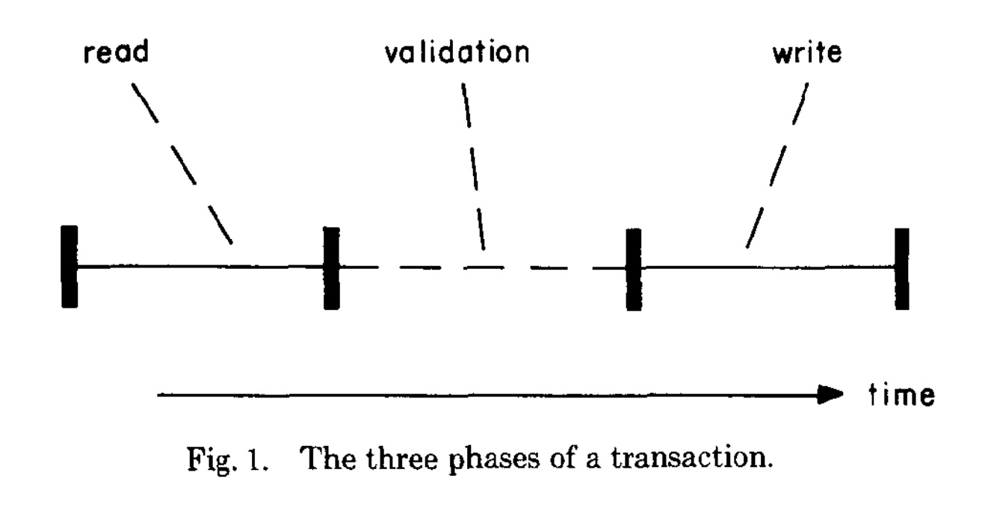
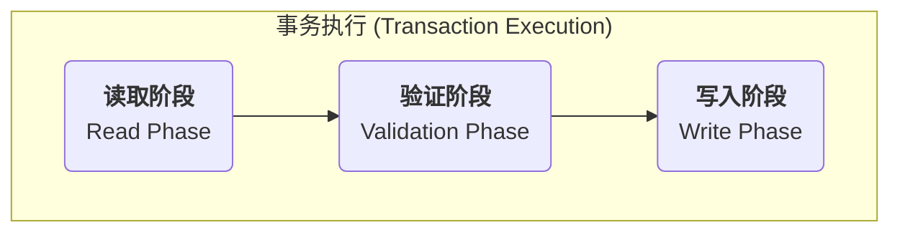
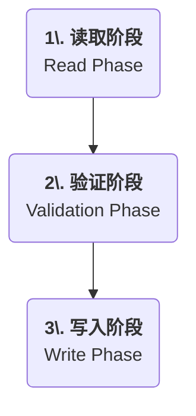
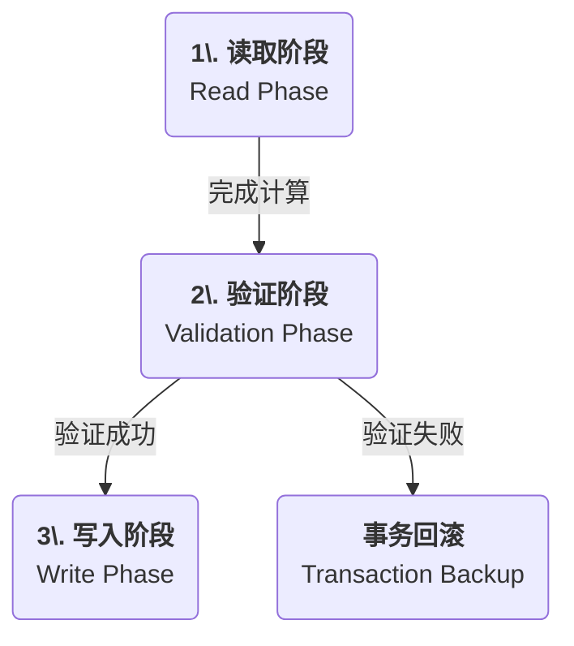

## AI论文解读 | On Optimistic Methods For Concurrency Control
        
### 作者        
digoal        
        
### 日期        
2025-10-30        
        
### 标签        
PostgreSQL , PolarDB , DuckDB , AI , 论文解读        
        
----        
        
## 背景  
      
https://dl.acm.org/doi/pdf/10.1145/319566.319567        
  
提示:          
```          
读懂《On Optimistic Methods For Concurrency Control》这篇论文需要提前掌握哪些基础知识, 请使用中文通熟易懂的讲解这些基础知识, 可以引用论文中的图、表或使用Markdown支持的图形(text,mermaid等)增加解释性. 
  
使用中文通熟易懂的解读《On Optimistic Methods For Concurrency Control》这篇论文, 其中的关键内容请着重讲解, 可以引用论文中的图、表或使用Markdown支持的图形(text,mermaid等)增加解释性. 
  
提取《On Optimistic Methods For Concurrency Control》这篇论文中的重要术语, 使用中文对这些术语进行通熟易懂的讲解, 可以引用论文中的图、表或使用Markdown支持的图形(text,mermaid等)增加解释性. 
```     
  
## 1 前置知识 
  
要读懂 H.T. Kung 和 John T. Robinson 的这篇经典论文《On Optimistic Methods for Concurrency Control》，你需要对数据库系统和并发编程的一些基本概念有扎实的理解。这篇论文开创了“乐观并发控制”（Optimistic Concurrency Control, OCC）这一领域，它所“反对”的传统方法是“悲观并发控制”（即“锁”）。

以下是你需要提前掌握的基础知识，我会尽量用通俗的语言来解释：

### 1\. 核心概念：数据库事务 (Transaction)

在阅读这篇论文之前，你必须理解什么是“事务”。

  * **通俗解释：** 你可以把事务想象成一个“工作单元”或“任务包”。这个包里包含了一系列数据库操作（比如读取、写入、删除数据）。
  * **核心要求：** 事务必须是**原子的**（Atomic）。这意味着，要么包里所有的操作都成功完成，要么一个都不做（如果中途失败，所有已做的更改都要撤销）。
  * **论文中的体现：** 论文提到，事务是“维护数据完整性约束 (integrity constraints) 的任意访问序列” 。比如，在银行转账中，“A 账户减 100 元”和“B 账户加 100 元”必须被捆绑在一个事务中，以确保总金额不变。

### 2\. 核心问题：并发控制 (Concurrency Control)

这是整篇论文要解决的问题。

  * **通俗解释：** 数据库通常需要同时为很多用户服务。如果两个用户（即两个事务）在同一时刻访问*相同*的数据，会发生什么？
  * **举个例子（“丢失更新”）：**
    1.  事务 A 读取了“商品库存 = 10”。
    2.  事务 B 也读取了“商品库存 = 10”。
    3.  事务 A 卖出了 3 个，计算出“新库存 = 7”，并写入数据库。
    4.  事务 B 卖出了 2 个，计算出“新库存 = 8”，并写入数据库。
    <!-- end list -->
      * **结果：** 数据库的最终库存是 8。但实际上总共卖了 5 个，应该是 5 才对。事务 A 的更新（写入 7）被事务 B 的更新“覆盖”了，这就是“丢失更新”。
  * **论文中的体现：** 论文指出，“不受限制的并发访问...通常会导致数据库完整性的丧失” 。并发控制的目标就是防止这类问题的发生。

### 3\. 传统方法：“锁” (Locking) - 悲观派

这篇论文提出的“乐观”方法是相对于“悲观”方法（即锁）而言的。你必须先懂“锁”才能理解这篇论文的新颖之处。

  * **通俗解释：** “锁”是一种**悲观** (Pessimistic) 的策略。它假设“冲突总会发生”，所以为了安全，在访问数据前必须先“上锁”。
  * **工作方式：** 就像进入一个会议室。
      * 如果你只是进去**读**文件（只读），你上一个“共享锁”（Share Lock）。别人也可以进来读，但不能修改。
      * 如果你要进去**写**文件（修改），你必须上一个“排他锁”（Exclusive Lock）。你进去后会锁门，任何其他人（无论读写）都必须在外面排队等你出来。
  * **论文中的体现：** 论文一开头就说，“目前大多数并发控制方法都依赖于数据对象的锁定” 。
  * **“锁”的问题（论文的G点）：**
    1.  **开销 (Overhead) ：** 维护锁本身需要成本。即使是只读事务（查询），通常也得上锁，以防别人在它读的时候修改数据 。
    2.  **死锁 (Deadlock) ：** 这是一个经典问题。
          * 事务 A 锁住了“数据 1”，然后它需要“数据 2”。
          * 事务 B 锁住了“数据 2”，然后它需要“数据 1”。
          * 双方都在等待对方释放锁，导致永久等待，程序卡死。
    3.  **并发度低 (Low Concurrency) ：** 如果一个事务锁住了一个关键数据（比如树的根节点 ），其他所有需要这个数据的事务都得排队，导致效率低下。

### 4\. 正确性标准：可串行性 (Serial Equivalence)

这是理解论文“验证阶段”的**最重要**的理论基础。

  * **通俗解释：** 我们如何判断一个并发系统是“正确”的？标准就是“可串行性”。
  * **定义：** 如果一堆事务并发执行（操作交织在一起）的**最终结果**，与它们“一个接一个排队执行”（串行执行）的**某种顺序**的结果**完全相同**，那么这个并发执行就是“可串行的”，也就是“正确”的。
  * **论文中的体现：** 论文明确将“串行等价性 (serial equivalence)”  作为正确性标准。它给出了一个数学定义： $d_{final} = T_{\pi(n)} \circ ... \circ T_{\pi(2)} \circ T_{\pi(1)}(d_{initial})$ 。
  * **简单来说：** 乐观方法的“验证” ，就是在“赌”它们的操作不会相互干扰，并在最后提交前检查一下，确保这个“赌局”的结果是可串行化的。

-----

### 论文的核心思想：乐观三阶段

当你具备了以上知识，你就可以理解论文提出的“乐观” (Optimistic) 方案了。

  * **核心假设：** “乐观”方法假设“冲突是很少发生的” 。
  * **核心策略：** “先执行，后检查”。我们不加锁，让所有事务自由运行，但在它们真正提交更改之前，进行一次“冲突检查”。如果发现冲突，就让其中一个事务“回滚”（backup，即撤销所有操作并重试） 。

论文将事务分为了三个阶段 ，这在图 1  中有清晰的展示：    

Fig. 1. The three phases of a transaction.



1.  **读取阶段 (Read Phase)**

      * **做什么：** 事务正常读取数据库数据。
      * **关键点：** 当事务需要**写入**时，它不会直接修改数据库，而是将更改写入到它自己的“本地副本” (local copies) 或“私有草稿”中 。
      * **好处：** 在这个阶段，事务绝对不会影响其他任何事务，因为所有的修改都是“私有的”。

2.  **验证阶段 (Validation Phase)**

      * **做什么：** 这是“乐观”方法的核心。在事务准备提交（即“发布草稿”）时，系统必须进行检查。
      * **检查什么：** 检查该事务的“草稿”是否与*其他已经提交*的事务的更改发生冲突。
      * **论文的机制：** 为了实现验证，系统会跟踪每个事务的“读取集” (read set，你读了哪些数据) 和“写入集” (write set，你*打算*写哪些数据) 。
      * **验证逻辑（简化版）：**
          * 系统检查：在我（ 事务 $T_j$ ）的“读取阶段”期间，是否有其他任何事务（ $T_i$ ）提交了更改？
          * 如果有，那么 $T_i$ 的“写入集”是否与我的“读取集”有交集？
          * **如果有交集：** 意味着我读取的是“旧数据”，我的计算基础是错的。**验证失败**！
          * **如果无交集：** 验证通过。

3.  **写入阶段 (Write Phase)**

      * **做什么：** 只有在“验证成功”后，事务才能进入这个阶段 。
      * **关键点：** 系统将事务的“本地副本”（私有草稿）一次性地应用到全局数据库中，使其成为“正式版本” 。
      * **如果验证失败：** 事务将被“回滚” (backed up)，它的本地副本被丢弃，然后整个事务从头重新启动 。

### 补充知识

  * **操作系统的基本概念：** 论文在讨论实现时，提到了“临界区 (critical section)”  和“信号量 (semaphore)” 。你需要知道“临界区”是一段“同一时间只允许一个线程进入”的代码，这是实现“验证阶段”和“写入阶段”原子性的关键。
  * **数据结构 (B-Trees)：** 论文在第 6 节  使用 B 树（数据库索引的常用结构）作为例子，来论证为什么“乐观”方法是高效的。因为在大型 B 树中，两次随机插入操作“撞车”（即修改了同一个树节点）的概率非常低 ，这完美符合了“冲突很少发生”的乐观假设。

### 总结

你需要带着以下问题去阅读这篇论文：

1.  **“事务”是什么？**（工作单元）
2.  **“并发”有什么问题？**（数据冲突）
3.  **“锁”是怎么解决这个问题的？**（悲观：先锁门再办事）
4.  **“锁”有什么缺点？**（开销大、死锁、并发低）
5.  **“可串行性”是什么？**（并发的“正确”标准）

然后你就能看懂论文的**新贡献**：

> “我们提出一种‘乐观’方法：不加锁，先办事（**读取阶段**），办完事把‘草稿’拿去验证（**验证阶段**），如果验证通过（即满足可串行性），就把草稿变成正式版（**写入阶段**）；如果失败，就撕掉草稿重来。”

希望这个基础知识清单对你有帮助！
  
## 2 解读论文 
  
这是对 H.T. Kung 和 John T. Robinson 经典论文《On Optimistic Methods for Concurrency Control》的详细解读。

这篇论文在数据库领域具有开创性地位，它首次系统地提出了**乐观并发控制 (Optimistic Concurrency Control, 简称 OCC)** 的思想，作为传统“锁定” (Locking) 机制的替代方案。

### 核心思想：为什么叫“乐观”？

在读论文之前，我们先要理解它的“对手”——**锁 (Locking)**。

  * **悲观（锁）** ：传统的锁机制是“悲观的”。它假设“冲突总是会发生”，所以为了安全，任何事务在访问数据前，都必须先获取一个“锁”。如果你要修改数据，你必须拿到“排他锁”，此时其他所有人都必须排队等你 。
  * **乐观（OCC）** ：这篇论文反其道而行之。它假设 **“冲突是极其罕见的”** 。既然冲突很少，那么加锁的开销（如锁维护、死锁检测）在大多数情况下都是浪费的 。

因此，乐观方法的核心策略是：

> **“先任意执行，后验证冲突。” (Run first, check for conflicts later.)**

它允许所有事务自由地读取数据，就好像系统中只有它自己一样。只有在事务准备“提交” (Commit) 的那一刻，系统才会进行一次“冲突检查”。

  * 如果**没有冲突**（这是它“希望”的乐观情况），事务成功提交。
  * 如果**发现冲突**，那么该事务将 **“回滚” (Backup)** ，即撤销所有操作，然后重新启动 。

-----

### 关键内容 (一)：传统“锁”机制的弊端

论文开篇就指出了传统锁机制的五大固有缺陷，这也是“乐观”方法试图解决的问题：

1.  **开销高 (Overhead)**：维护锁本身需要成本 。即使是“只读”事务（查询），为了保证读到的数据不被修改，也常常需要加锁，这在查询密集型系统中是巨大的浪费 。
2.  **死锁 (Deadlock)**：如果事务 A 锁了数据 1 并等待数据 2，而事务 B 锁了数据 2 并等待数据 1，两者就会无限期等待，即“死锁”。系统必须额外实现“死锁检测”机制 。
3.  **并发度低 (Low Concurrency)**：锁的本质就是排队。如果一个事务锁住了一个“热点”数据（比如 B 树的根节点），其他所有需要该数据的事务都得暂停，导致并发度急剧下降 。
4.  **I/O 导致性能瓶颈**：在等待磁盘 I/O（访问二级内存）时，事务通常不能释放它持有的锁。如果这个锁恰好是热点数据，整个系统的效率都会被拖垮 。
5.  **为“回滚”牺牲并发**：为了支持事务中途“中止” (abort)，锁必须一直持有到事务*结束*才能释放，这进一步降低了并发性 。

-----

### 关键内容 (二)：乐观事务的“三阶段”模型

为了实现“先执行后验证”，论文将每个事务的生命周期划分为三个截然不同的阶段 ，这在论文的图 1 中有清晰的展示：    

Fig. 1. The three phases of a transaction.



#### 1\. 读取阶段 (Read Phase)

  * 这是事务的“执行”阶段。事务可以自由地读取数据库中的任何数据 。
  * **关键点**：当事务需要**写入**时，它**不会**直接修改数据库。相反，它会将所有更改写入到它自己的“私有副本” (local copies) 中 。
  * **效果**：在这个阶段，事务对其他并发事务是“隐形”的。它既不会锁住别人，它的（未提交的）修改也不会被别人看到。

#### 2\. 验证阶段 (Validation Phase)

  * 这是乐观方法的核心。当事务完成所有计算并准备提交时，它进入此阶段 。
  * **关键点**：系统必须在此时进行“冲突检查”，以确定该事务在“读取阶段”所读到的数据是否是“过时的” (stale)，以及它的写入是否会和别的事务冲突 。
  * **正确性标准**：验证的目的是保证 **“可串行性” (Serial Equivalence)** 。即，虽然事务是并发执行的，但最终结果必须等同于它们按照*某一个*顺序一个接一个串行执行的结果 。

#### 3\. 写入阶段 (Write Phase)

  * 只有在“验证成功”后，事务才能进入这个阶段 。
  * **关键点**：系统将事务在读取阶段产生的所有“私有副本”一次性地、原子地应用到全局数据库中，使其对所有其他事务可见 。
  * **如果验证失败**：事务将被“回滚”，其私有副本被丢弃，然后整个事务从头重新启动 。

-----

### 关键内容 (三)：如何实现“验证”？

这是论文最精妙的技术点。为了实现验证，系统需要为每个事务维护：

  * **读取集 (Read Set)**：事务在读取阶段访问过的所有数据对象 。
  * **写入集 (Write Set)**：事务试图修改的所有数据对象（即它创建了“私有副本”的对象） 。

#### 事务编号 (Transaction Number)

系统维护一个全局的“事务编号计数器” ( $tnc$ ) 。当一个事务准备进入“验证阶段”时，它会被分配一个唯一的、递增的事务编号（ Transaction Number, $tn$ ） 。

这个编号 $tn$ 定义了事务在逻辑上的“串行顺序”。验证的目标就是确保：如果事务 $T_i$ 的编号小于 $T_j$ （ $t(i) < t(j)$ ），那么最终的结果必须好像 $T_i$ 是在 $T_j$ 之前完成的 。

#### 验证逻辑

当一个事务 $T_{validate}$ (我们称之为“待验证事务”) 准备提交时，它必须和所有“在它之前完成提交”的事务 $T_{finish}$ 进行比较。

论文在第 4 节（串行验证）中给出了一个核心验证逻辑 ：

**“待验证事务” $T_{validate}$ 必须检查：**
对于所有在 $T_{validate}$ **读取阶段开始后**、**验证阶段开始前** 这段时间内 *成功提交* 的事务 $T_{finish}$ ：

> $T_{finish}$ 的 **“写入集”** (Write Set) 是否与 $T_{validate}$ 的 **“读取集”** (Read Set) 有交集？ 

  * **如果无交集（验证成功）** ：说明 $T_{validate}$ 所读取的数据是“干净”的，它在计算时没有依赖任何“旧数据”。
  * **如果有交集（验证失败）** ：这意味着 $T_{finish}$ 已经修改了 $T_{validate}$ 读过的数据。 $T_{validate}$ 是基于“过时”的数据进行计算的，它的结果是错误的，必须回滚 。

-----

### 关键内容 (四)：为什么乐观方法是高效的？

你可能会想：如果事务总是失败和重启，那效率岂不是更低？

论文在第 6 节通过一个精彩的“B 树”案例分析回答了这个问题 ：

1.  **冲突概率极低**：在大型数据库中，两个并发事务（比如插入操作）恰好修改*同一个*数据页（B 树节点）的概率非常低 。论文甚至估算，在一个有 10000 个叶节点的 B 树中，冲突的概率小于 **0.0007** 。
2.  **“乐观”假设成立**：既然冲突概率如此之低，那么“悲观”的锁机制在 99.93% 的时间里都是在做“无用功”。而乐观方法几乎总是一次通过，完全避免了加锁开销。
3.  **读阶段慢 vs 验证阶段快**：事务的“读取阶段”通常很慢，因为它涉及大量的磁盘 I/O 。而“验证阶段”和“写入阶段”非常快，因为它们只涉及内存中的“读取集/写入集”比较和指针交换 。

乐观方法完美地利用了这一点：它让*慢速的 I/O 阶段*（读取阶段）可以大规模并发执行，而只把*极快的内存操作*（验证/写入阶段）放入一个短暂的临界区（串行执行）。

-----

### 总结：乐观与悲观的对比

这篇论文的结论提供了一个非常精辟的对比 ：

| 特性 | 悲观方法 (锁) | 乐观方法 (OCC) |
| :--- | :--- | :--- |
| **控制机制** | 通过“**等待**”来控制并发  | 通过“**回滚/重启**”来控制并发  |
| **逻辑顺序** | 通过“首次访问时间”来隐式排序  | 通过“**事务编号**”来显式排序  |
| **主要难题** | **死锁 (Deadlock)**  | **饥饿 (Starvation)**  |

**什么是饥饿？**
“饥饿”是指一个事务因为运气不好，每次去验证时都发现冲突，导致它被无限次地“回滚”和“重启” 。

**如何解决饥饿？**
论文也给出了一个优雅的解决方案：如果系统检测到一个事务“饥饿”了（比如连续失败了 10 次），系统可以在它下一次重启时，暂时切换到“悲观模式”——即**给它加一个“写锁”** ，让它“锁住”整个数据库，确保它这次一定能运行完成。

这形成了一个完美的闭环：**乐观方法的“主要难题”（饥饿）可以用“悲观方法”（锁）来解决；而悲观方法的“主要难题”（死锁）可以用“乐观方法”（回滚）来解决** 。
  
## 3 术语 
  
好的，这篇论文《On Optimistic Methods For Concurrency Control》开创了数据库“乐观并发控制”这一重要领域。理解了它的核心术语，也就理解了现代数据库系统（如 MySQL InnoDB、PostgreSQL）中 MVCC（多版本并发控制）的理论基础。

以下是论文中关键术语的通俗讲解：

### 核心概念：乐观 vs 悲观

#### 1\. 锁定 (Locking)

  * **通俗讲解：** 这是传统的并发控制方法，论文称之为“悲观派” 。它假设事务之间很可能会发生冲突。就像进入一个会议室，为了防止别人打扰，你必须先在门口“上锁” 。如果你要读，就上一个“共享锁”（别人也能读，但不能改）；如果你要写，就上一个“排他锁”（你进去后，任何人都不能进，直到你出来）。
  * **论文中的态度：** 论文认为“锁定”开销大、会降低并发度 ，并且会引发“死锁” 。

#### 2\. 乐观方法 (Optimistic Methods)

  * **通俗讲解：** 这是论文提出的核心方法，即“乐观派” 。它“乐观”地假设事务之间**很少**会发生冲突 。
  * **核心策略：** “先执行，后验证”。它不使用锁 ，让所有事务自由运行。只在事务准备提交的最后一刻，才进行一次“冲突检查”。如果没冲突，就提交；如果有冲突，就“回滚”（重做） 。
  * **适用场景：** 论文认为，这种方法在“查询为主”（只读事务多）或事务冲突概率很低（例如大型 B 树索引）的系统中，会比“锁定”更高效 。

-----

### 乐观方法的核心机制

#### 3\. 事务 (Transaction)

  * **通俗讲解：** 一个“工作单元”或“任务包” 。它包含了一系列数据库操作（如读、写）。系统必须保证这个“包”里的操作要么全部成功，要么全部失败（即“原子性”），以确保数据的完整性 。

#### 4\. 事务三阶段 (The Three Phases)

  * **通俗讲解：** 这是乐观方法实现的核心流程。论文将一个事务的执行划分为三个阶段（参见论文图 1） 。    

Fig. 1. The three phases of a transaction.



  * **1. 读取阶段 (Read Phase):** 事务的执行阶段。事务可以自由读取数据库数据 。但所有“写入”操作，都不会直接修改数据库，而是先写在事务自己的 **“本地副本” (local copies)** 上 。
  * **2. 验证阶段 (Validation Phase):** 事务的检查阶段 。当事务完成所有计算并请求提交时，系统会介入，检查该事务的读写操作是否与“近期已提交的”其他事务发生冲突 。
  * **3. 写入阶段 (Write Phase):** 事务的提交阶段 。*只有在验证成功后*，系统才会把事务在“读取阶段”产生的“本地副本”一次性地应用到数据库中，使其修改对所有其他事务可见 。

#### 5\. 事务回滚 (Transaction Backup)

  * **通俗讲解：** 这是乐观方法的主要“惩罚”机制 。如果在“验证阶段”发现冲突，事务将验证失败 。该事务的所有“本地副本”将被丢弃，整个事务必须 **“回滚”** （撤销），然后作为一个全新的事务重新启动 。

-----

### 验证阶段的技术术语

#### 6\. 串行等价性 (Serial Equivalence)

  * **通俗讲解：** 这是并发控制的“正确性黄金标准” 。它指的是：虽然多个事务是并发（交织）执行的，但它们的最终结果，必须和它们按照*某一个*串行（一个接一个排队）顺序执行的结果完全相同 。
  * **在论文中：** “验证阶段”的目的，就是为了保证所有成功提交的事务满足“串行等价性” 。

#### 7\. 读取集 (Read Set) 与 写入集 (Write Set)

  * **通俗讲解：** 这是实现“验证”的记账本。系统在“读取阶段”会为每个事务维护两个列表：
      * **读取集 (Read Set):** 事务在读取阶段读过的所有数据 。
      * **写入集 (Write Set):** 事务想要修改的所有数据（即它创建了“本地副本”的数据）。
  * **验证逻辑（简化版）：** 当事务 $T_j$ 验证时，它必须检查：在我（ $T_j$ ）的“读取阶段”期间，是否有其他事务 $T_i$ 已经*成功提交*？如果有，那么 $T_i$ 的“写入集”是否与我（ $T_j$ ）的“读取集”有重叠 ？
      * **有重叠：** 意味着 $T_j$ 读到了“旧数据”，验证失败，必须回滚 。
      * **无重叠：** 验证通过。

#### 8\. 事务编号 (Transaction Number)

  * **通俗讲解：** 为了确定事务之间的“先后顺序”（即“串行等价性”中的那个“顺序”），系统需要给它们分配编号。
  * **在论文中：** 系统维护一个全局的“事务编号计数器” ( $tnc$ ) 。论文强调，编号不应该在事务*开始*时分配，而应该在“读取阶段”*结束*时（即进入验证阶段的瞬间）分配 。这样做是为了防止一个执行很慢的事务（ $T_1$ ）虽然编号靠前，但却阻塞了一个执行很快的事务（ $T_2$ ）的验证 。

-----

### 锁与乐观方法的“难题”

#### 9\. 死锁 (Deadlock)

  * **通俗讲解：** “锁定”方法的主要难题 。它发生在两个或多个事务互相等待对方释放锁的情况。例如，事务 A 锁了数据 1，并等待数据 2；而事务 B 锁了数据 2，并等待数据 1。双方都无法继续，导致系统卡死 。
  * **乐观方法的优势：** 乐观方法因为不加锁，所以**天然“无死锁”** 。

#### 10\. 饥饿 (Starvation)

  * **通俗讲解：** “乐观”方法的主要难题 。如果一个事务“运气不好”，它在每次尝试提交时都验证失败（因为其他事务总是在它之前提交了冲突的修改），导致它被无限次地“回滚”和重启，永远无法完成 。
  * **论文的解决方案：** 论文风趣地指出，乐观方法的“饥饿”问题，反而可以用“锁定”来解决 。例如，系统可以检测到“饥饿”的事务，并在它下一次重启时，暂时给它一个数据库的“排他锁”，确保它这次一定能运行完成 。
  
## 参考        
         
https://dl.acm.org/doi/pdf/10.1145/319566.319567    
        
<b> 以上内容基于DeepSeek、Qwen、Gemini及诸多AI生成, 轻微人工调整, 感谢杭州深度求索人工智能、阿里云、Google等公司. </b>        
        
<b> AI 生成的内容请自行辨别正确性, 当然也多了些许踩坑的乐趣, 毕竟冒险是每个男人的天性.  </b>        
    
#### [期望 PostgreSQL|开源PolarDB 增加什么功能?](https://github.com/digoal/blog/issues/76 "269ac3d1c492e938c0191101c7238216")
  
  
#### [PolarDB 开源数据库](https://openpolardb.com/home "57258f76c37864c6e6d23383d05714ea")
  
  
#### [PolarDB 学习图谱](https://www.aliyun.com/database/openpolardb/activity "8642f60e04ed0c814bf9cb9677976bd4")
  
  
#### [PostgreSQL 解决方案集合](../201706/20170601_02.md "40cff096e9ed7122c512b35d8561d9c8")
  
  
#### [德哥 / digoal's Github - 公益是一辈子的事.](https://github.com/digoal/blog/blob/master/README.md "22709685feb7cab07d30f30387f0a9ae")
  
  
#### [About 德哥](https://github.com/digoal/blog/blob/master/me/readme.md "a37735981e7704886ffd590565582dd0")
  
  

  
