## AI论文解读 | Principles Of Transaction-Oriented Database Recovery
        
### 作者        
digoal        
        
### 日期        
2025-10-30        
        
### 标签        
PostgreSQL , PolarDB , DuckDB , AI , 论文解读        
        
----        
        
## 背景  
      
https://dl.acm.org/doi/pdf/10.1145/289.291        
  
提示:          
```          
读懂《Principles Of Transaction-Oriented Database Recovery》这篇论文需要提前掌握哪些基础知识, 请使用中文通熟易懂的讲解这些基础知识, 可以引用论文中的图、表或使用Markdown支持的图形(text,mermaid等)增加解释性. 
  
使用中文通熟易懂的解读《Principles Of Transaction-Oriented Database Recovery》这篇论文, 其中的关键内容请着重讲解, 可以引用论文中的图、表或使用Markdown支持的图形(text,mermaid等)增加解释性. 
  
提取《Principles Of Transaction-Oriented Database Recovery》这篇论文中的重要术语, 使用中文对这些术语进行通熟易懂的讲解, 可以引用论文中的图、表或使用Markdown支持的图形(text,mermaid等)增加解释性. 
```     
  
## 1 前置知识 
  
理解这篇里程碑式的论文《Principles of Transaction-Oriented Database Recovery》确实需要一些数据库的“内功”。这篇论文（常被简称为 "Haerder and Reuter '83"）本身**不是一篇入门教程**，而是一篇**学术综述和分类法论文** 。它的伟大之处在于，它为数据库恢复这个混乱的领域提供了一个清晰、严谨的术语框架和分类体系，而这个框架至今仍是数据库课程的核心。

为了读懂它，你需要提前掌握以下几个核心基础知识。我会用通俗的语言，并结合论文中的图表来解释它们。

-----

### 1\. 核心前提：什么是“事务” (Transaction) 及其 ACID 特性

这篇论文的标题就是“事务导向” (Transaction-Oriented) 的 ，事务是理解一切的基石。

  * **是什么：** 事务是一个“工作单元”，它包含了一系列数据库操作（读、写、修改等）。这个单元被视为一个**不可分割的整体**。
  * **论文中的例子：** 论文中提到了最经典的“转账”例子 （见论文**图1** ）。  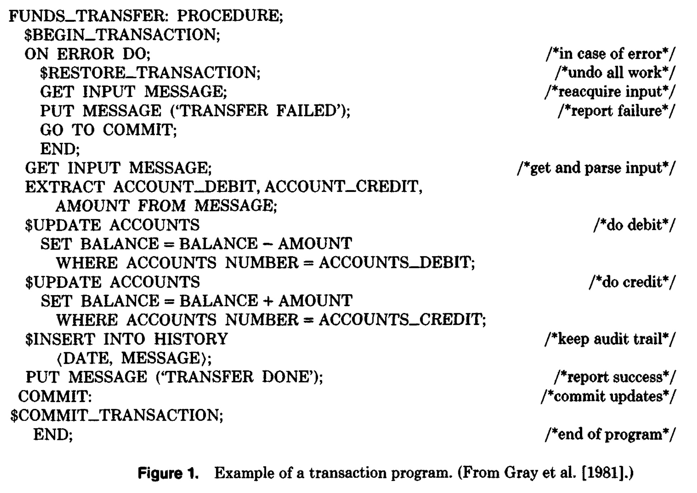  
      * `操作A：` 从账户X扣除100元。
      * `操作B：` 给账户Y增加100元。
  * **为什么重要：** 这两个操作必须“同生共死”。如果操作A成功了，但系统在执行操作B之前崩溃了，那么100元就凭空消失了。事务的“原子性” (Atomicity)  就是为了防止这种情况。

在阅读论文前，你必须深刻理解事务的 **ACID** 属性 ，这篇论文将其称为系统的“ACID 测试” (ACID test) ：

1.  **A - Atomicity (原子性) ：** “要么全做，要么全不做” (all-or-nothing)。如转账例子所示。
2.  **C - Consistency (一致性) ：** 事务必须使数据库从一个*一致*的状态转变到另一个*一致*的状态。转账前后的总金额不变，这就是一致性。
3.  **I - Isolation (隔离性) ：** 并发执行的事务之间互不干扰。一个事务不应该看到另一个事务“做了一半”的临时数据（即“脏数据” ）。
4.  **D - Durability (持久性) ：** 一旦事务被“提交” (Commit)，它的结果必须**永久**保存在数据库中，即使系统随后崩溃也不能丢失。

论文中的 **图2**  展示了事务的三种可能结局，这直接导向了恢复的需求：  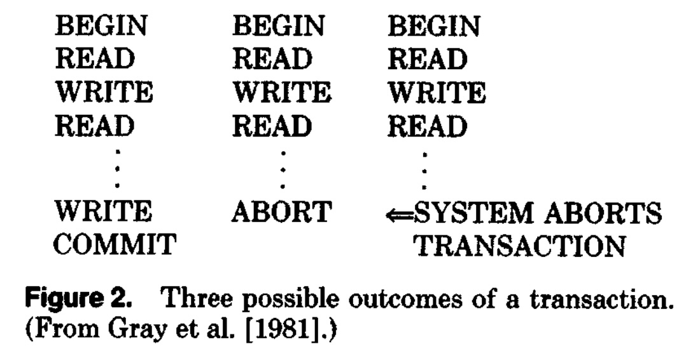  

  * **COMMIT (提交)：** 成功完成，必须保证**持久性 (D)**。
  * **ABORT (中止)：** 事务自己发现错误（如余额不足），必须**撤销**所有已做的修改，保证**原子性 (A)**。
  * **SYSTEM ABORTS (系统中止)：** 比如发生死锁或系统崩溃，同样必须**撤销**所有修改，保证**原子性 (A)**。


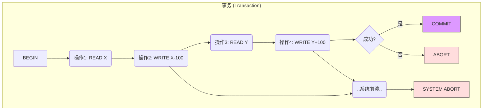

-----

### 2\. 核心战场：数据库的存储层次 (Storage Hierarchy)

这是数据库恢复的“物理战场”。你必须清楚数据存储在哪里，以及它们的特性。

  * **易失性存储 (Volatile Storage)：**

      * **即：内存 (Main Memory)**。
      * **特点：** 读写速度**极快**。
      * **缺点：** **断电即失** 。
      * **相关组件：** 论文 **图4**  中的 **数据库缓冲区 (Database Buffer)** 和 **日志缓冲区 (Log Buffer)** 都在内存里。  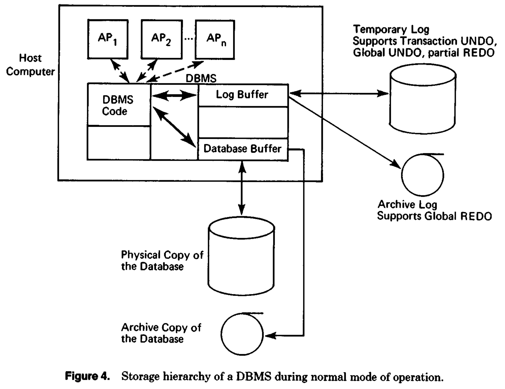  

  * **非易失性存储 (Non-volatile Storage)：**

      * **即：磁盘 (Disk) 或 磁带 (Tape)**。
      * **特点：** **断电不丢**，数据持久。
      * **缺点：** 读写速度**极慢**（相比内存）。
      * **相关组件：** **图4** 中的 **物理数据库 (Physical Copy of the Database)** 和 **日志文件 (Temporary/Archive Log)**。

**恢复的核心矛盾：**
为了性能，数据库**必须**在内存的“数据库缓冲区”中修改数据 。但是，如果改完后还没来得及写回磁盘，系统就崩溃了（**图4** 中的 Host Computer 宕机），那么内存中的所有修改（包括已提交事务的修改）都会丢失 ，这就违反了**持久性 (D)**。

-----

### 3\. 核心机制：日志 (Log)、UNDO 和 REDO

为了解决上述矛盾，数据库引入了“日志” (Log)。

  * **日志 (Log)：** 这是一个**只追加** (append-only) 的特殊文件，存放在非易失性存储（磁盘）上。它像一个账本，忠实记录了所有事务的**修改操作**。
  * **WAL (Write-Ahead Logging) 原则 ：** 这是日志的“第一天条”，论文中明确提到了 。
    > **在修改的数据被写入磁盘*之前*，记录该修改的“日志”必须*先*被写入磁盘。**
  * **UNDO (撤销) ：** 用于实现**原子性 (A)**。
      * **场景：** 事务 Abort 了，或者系统崩溃时有事务（如**图3**的T4, T5 ）未完成。  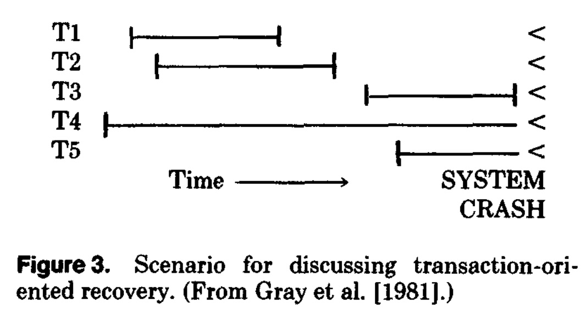  
      * **动作：** 恢复系统读取日志，**反向操作**，撤销这些“不该存在”的修改。
  * **REDO (重做) ：** 用于实现**持久性 (D)**。
      * **场景：** 系统崩溃时，有些事务（如**图3**的T1, T2, T3 ）已经 Commit 了，但它们在内存缓冲区中的修改*可能*还没来得及刷回磁盘。
      * **动作：** 恢复系统读取日志，**正向操作**，重新执行这些修改，确保它们永久生效。

-----

### 4\. 核心策略：缓冲池管理 (Buffer Management)

这是读懂这篇论文**最关键、也是最独特**的预备知识。论文的分类法很大程度上是基于缓冲池（即 Database Buffer）的*管理策略*。

你需要知道，缓冲池管理器 (Buffer Manager)  负责决定：

1.  何时从磁盘读取数据页 (Page) 到缓冲区？
2.  何时将缓冲区中“脏了”（被修改过）的数据页写回磁盘？

论文的核心分类法，正是基于回答以下两个问题，而这些是它*定义*的术语，你需要提前理解其背景：

  * **问题1 (UNDO相关)：** 缓冲池管理器**是否允许** (Can) 把一个*未提交事务*修改的“脏页”写回磁盘？

      * **STEAL (偷) ：** **允许**。这意味着磁盘上可能存在“脏数据”。如果事务A修改了P1页，然后P1被写回磁盘，紧接着事务A又Abort了。这时磁盘上的P1页就是“不该存在的”，系统必须有能力 UNDO 它。
      * **¬STEAL (不偷) ：** **不允许**。脏页必须保留在缓冲区，直到事务提交。这简化了 UNDO，但也可能耗尽缓冲区（比如一个超大事务）。

  * **问题2 (REDO相关)：** 当事务提交 (Commit) 时，是否**强制** (Must) 将该事务修改的所有“脏页”立刻写回磁盘？

      * **FORCE (强制) ：** **强制**。一旦 Commit，所有修改立刻刷盘。
      * **¬FORCE (不强制) ：** **不强制**。Commit 时只保证“日志”刷盘了（满足WAL），但数据页“脏着”留在缓冲区，等缓冲池管理器稍后“顺便”写回。

### 总结：你需要的基础知识

| 基础知识点 | 为什么读这篇论文需要它？ |
| :--- | :--- |
| **1. 事务 (Transaction) 与 ACID** | 论文的**核心单元**。恢复的**目标**就是维护 ACID 特性（特别是 A 和 D）。 |
| **2. 存储层次 (内存 vs. 磁盘)** | 恢复的**物理战场**。数据在易失性内存和非易失性磁盘之间的移动是问题的根源 。 |
| **3. 日志、UNDO、REDO** | 恢复的**基本工具**。论文的**图3**  和相关术语 (Global UNDO, Partial REDO ) 都是基于这些概念。 |
| **4. 缓冲池管理 (Buffer Mgt.)** | 论文 **分类法 (STEAL/FORCE)** 的基础。理解了缓冲池策略，才能理解为什么存在不同的恢复实现。 |


  

当你掌握了这些基础知识后，你再去看这篇论文，就会发现它的脉络非常清晰：它正是利用 `STEAL/¬STEAL` 和 `FORCE/¬FORCE` 这两个维度，以及 `ATOMIC/¬ATOMIC` 传播策略 ，对所有可能的恢复实现进行了一次 **“二维象限”划分** （见论文**图13**  和**表4** ），并分析了每种组合的优缺点。 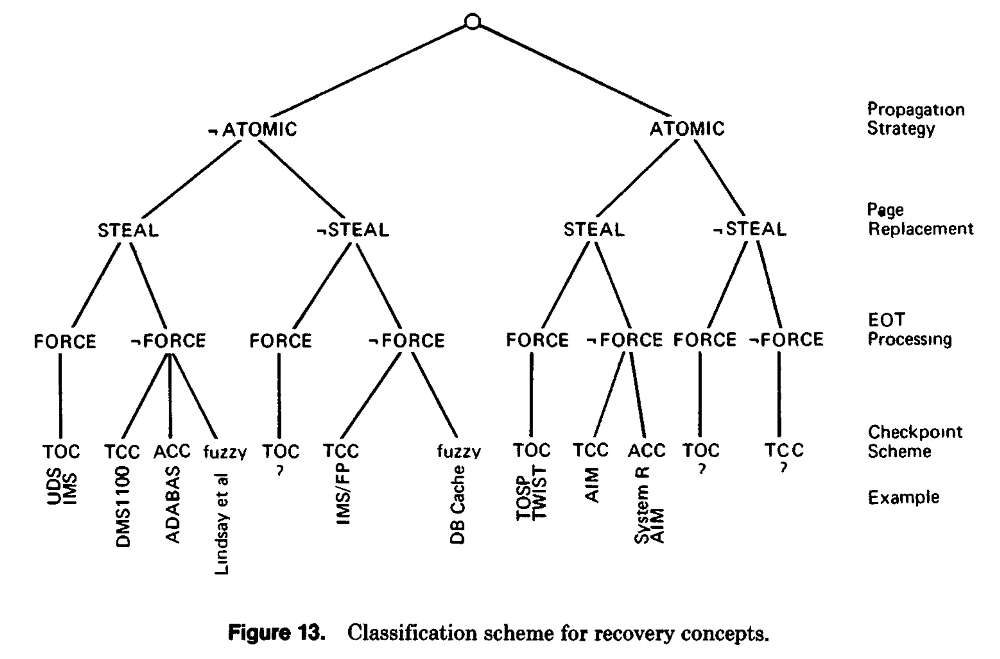  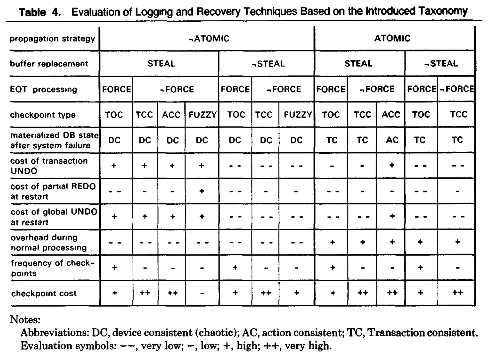  

希望这份“预习指南”能帮助你攻克这篇经典论文！

-----

您想让我详细解释一下论文中 STEAL/FORCE 策略的组合（例如，¬STEAL/FORCE 这种最简单但性能差的组合）吗？
  
## 2 解读论文 
  
这篇论文（*Principles of Transaction-Oriented Database Recovery*）是数据库发展史上的一座丰碑。它在1983年发表，作者是 Theo Haerder 和 Andreas Reuter。

用一句通俗的话来说，这篇论文的伟大之处在于，它**首次为数据库“崩溃恢复”这个混乱的领域提供了统一的“世界地图”和“通用语言”** 。它没有发明一种全新的恢复算法，而是建立了一个分类框架，让所有人都能在同一个“频道”上讨论、设计和评估恢复系统。

在它之前，大家各自为战，A系统叫的“日志”和B系统叫的“日志”可能完全不是一回事。在这之后，所有人（包括今天的数据库开发者）都在使用这篇论文定义的术V语和框架来构建系统。

以下是对这篇论文关键内容的通俗易懂的解读。

-----

### 1\. 恢复的目标：捍卫 "ACID"

论文开篇就强调，一切恢复机制的核心目标，是为了在发生故障时，依然能捍卫事务的 **ACID** 特性 。这篇论文也是 "ACID" 这个缩写词的“成名之地”。

  * **A - Atomicity (原子性):** 事务是“要么全做，要么全不做”的 。
  * **C - Consistency (一致性):** 事务必须使数据库从一个一致的状态转变到另一个一致的状态 。
  * **I - Isolation (隔离性):** 并发执行的事务互不干扰 。
  * **D - Durability (持久性):** 一旦事务提交，其结果必须永久保存，即使系统崩溃也不能丢失 。

**恢复 (Recovery) 主要关心的是 A 和 D：**

  * **原子性 (A)：** 如果事务做到一半系统崩溃了，恢复后必须**撤销 (UNDO)** 它已经做的所有修改，就当它没发生过。
  * **持久性 (D)：** 如果事务已经提交，但系统在把修改结果写入磁盘前就崩溃了，恢复后必须**重做 (REDO)** 这些修改，确保它们永久生效。

### 2\. 核心问题：内存 vs. 磁盘的矛盾

要理解恢复，必须先理解数据库的“物理战场”，即论文中的**存储层次（图4）** 。    

  * **易失性存储 (Volatile)：** 内存（论文中的 **Database Buffer**）。读写**极快**，但**断电即失**。
  * **非易失性存储 (Non-volatile)：** 磁盘（论文中的 **Physical Copy of the Database**）。读写**极慢**，但**断电不丢**。

 

**核心矛盾在于：**

1.  为了追求**高性能**，数据库所有修改**必须**在内存（Buffer）中进行。
2.  为了保证**持久性(D)**，这些修改**最终**必须写回磁盘。

**崩溃（Crash）** 就是在这个“最终”到来之前发生的，这导致了内存数据的丢失 。

### 3\. 崩溃场景与恢复工具 (UNDO/REDO)

论文中的**图3**  完美地展示了崩溃时我们面临的烂摊子：    

```text
   T1 |-------| Commit
   T2 |-----------| Commit
   T3              |-------| Commit
   T4 |-----------------------------| (Incomplete)
   T5                |-------------| (Incomplete)
                                    ^
                                    |
                               SYSTEM CRASH
```


当系统在 `CRASH` 点重启时：

  * **T1, T2, T3** 已经提交 (Commit) 。但它们所做的修改可能只存在于丢失的内存缓冲区中，还没写回磁盘 。**违反了持久性 (D)**。
  * **T4, T5** 尚未提交 (Incomplete) 。但它们做到一半的修改（称为“脏数据”）*可能*已经被系统（为了腾出缓冲区空间）提前写回磁盘了。**违反了原子性 (A)**。

为了解决这个烂摊子，恢复系统需要两个基本工具（论文中称之为 Recovery Actions）：

1.  **REDO (重做):**

      * **目的：** 保证**持久性 (D)**。
      * **对象：** 已提交的事务 (T1, T2, T3) 。
      * **动作：** 重新执行它们的所有修改，确保其结果反映在磁盘上 。

2.  **UNDO (撤销):**

      * **目的：** 保证**原子性 (A)**。
      * **对象：** 未提交（中断）的事务 (T4, T5) 。
      * **动作：** 反向执行它们的所有操作，把磁盘恢复到它们“动手”之前的状态 。

-----

### 4\. 论文的核心：恢复策略的“灵魂三问”

这篇论文最核心的贡献，是提出了一个分类框架。任何一个数据库的恢复策略，都必须回答以下三个关键问题。

#### 问题 1：你如何更新磁盘？(`ATOMIC` vs. `¬ATOMIC`)

这定义了数据“传播” (Propagation) 到磁盘的方式 。

  * **`¬ATOMIC` (非原子) / Update-in-Place (原地更新):**
      * 这是最常见的方式 。
      * **如图5 (Direct)**  所示，一个数据页 (Page i) 在磁盘上有个固定的“坑”(Block i)。每次更新，都是用修改后的新数据**覆盖**这个坑里的旧数据 。  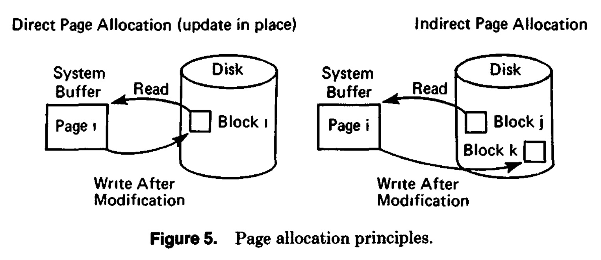  
      * **缺点：** 如果在覆盖的半途中断电，这个数据块就“花了”（物理不一致），恢复起来极其麻烦 。
  * **`ATOMIC` (原子) / Shadow Paging (影子分页):**
      * 这是一种更“安全”的方式。
      * **如图5 (Indirect)**  和 **图6**  所示，更新数据时，**从不**覆盖旧数据。而是把修改后的新页 (Page i) 写到磁盘的**一个新坑** (Block k) 。  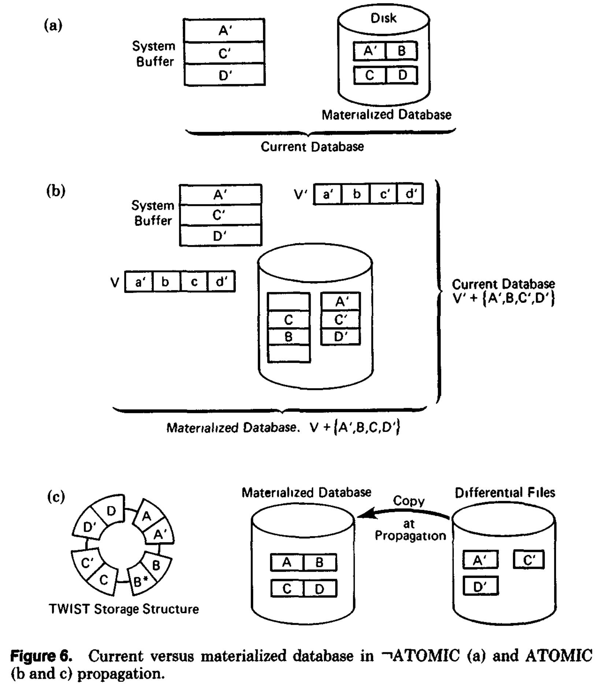  
      * 数据库保留一个“页表”来指向当前有效的数据页。
      * “提交”一次更新，只需要**原子性地**（一步到位）切换页表指针，让它从指向旧数据 (Block j) 改为指向新数据 (Block k) 。
      * **优点：** 任何时刻磁盘都是一致的。如果崩溃，只需使用旧的页表即可，天然具备 UNDO 功能 。

 

#### 问题 2 & 3：缓冲区如何刷盘？(STEAL/FORCE 矩阵)

这是论文**最最最核心**的分类法，它定义了缓冲区管理器 (Buffer Manager) 的行为。

#### 问题 2 (UNDO相关)：`STEAL` vs. `¬STEAL`

**“你是否允许‘偷’走（Steal）未提交事务的修改？”**

  * **`STEAL` (允许偷):**
      * 系统**允许**将一个*尚未提交*（即“脏的”）数据页从缓冲区写回磁盘 。
      * **理由：** 缓冲区空间很宝贵，不能被一个大事务的脏数据占满 。
      * **后果：** 磁盘上可能存在“脏数据”（如 T4, T5 的修改）。因此，**恢复系统必须具备 `Global UNDO` 的能力** 。
  * **`¬STEAL` (禁止偷):**
      * 系统**不允许**未提交的脏页被写回磁盘 。
      * **理由：** 保证磁盘上永远没有“脏数据”。
      * **后果：** 恢复时**几乎不需要 `UNDO`** 。但代价是缓冲区必须足够大，能容纳一个事务的所有修改，这在现实中很不灵活 。

#### 问题 3 (REDO相关)：`FORCE` vs. `¬FORCE`

**“当事务提交时，你是否‘强制’(Force) 将其所有修改写回磁盘？”**

  * **`FORCE` (强制):**
      * 在事务提交 (EOT) 时，**立刻强制**将该事务修改过的*所有*数据页（脏页）刷回磁盘 。
      * **理由：** 确保一旦提交，数据就“坚如磐石”地在磁盘上，实现持久性。
      * **后果：** 恢复时**不需要 `Partial REDO`** 。但代价是**提交 (Commit) 操作会非常慢**，因为它涉及大量随机的磁盘写入 。
  * **`¬FORCE` (不强制):**
      * 事务提交时，**不**强制刷数据页 。
      * **理由：** 追求**快速提交**。系统只保证（根据WAL原则 ）将“日志”刷盘，数据页则“顺其自然”地留在缓冲区，等以后“顺便”刷盘。
      * **后果：** 提交操作很快。但如果崩溃，已提交事务（如 T1, T2）的数据可能还在内存里，**恢复系统必须具备 `Partial REDO` 的能力** 。

### 5\. 关键的“武功秘籍”：表4 (Table 4)

论文的**表4**  就是上述分类法的“集大成者”。它用一个矩阵（以 `¬ATOMIC` 为例）展示了四种策略组合的优劣：    

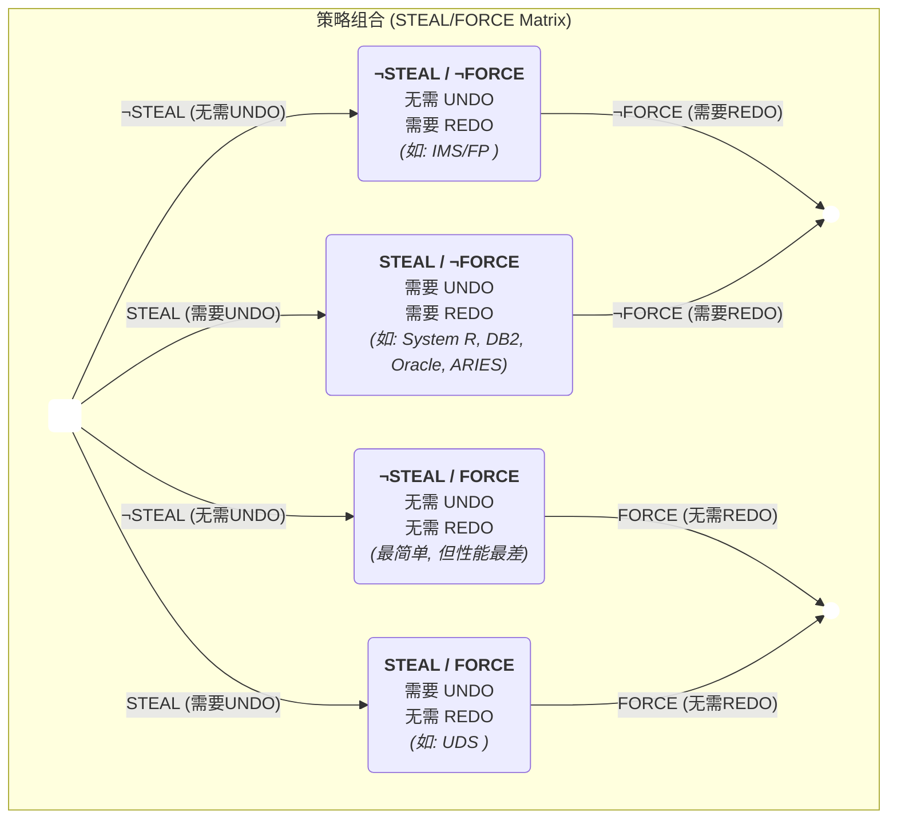

**解读表4 ：**

  * **`¬STEAL / FORCE` (左下角):**
      * **恢复成本：** 极低（--）。崩溃后几乎啥也不用干（无需UNDO，无需REDO）。
      * **运行成本：** 极高（++）。提交操作慢（FORCE），缓冲区易占满（¬STEAL）。
  * **`STEAL / ¬FORCE` (右上角):**
      * **恢复成本：** 很高（+）。崩溃后既要 `UNDO` 未提交的，也要 `REDO` 已提交的 。
      * **运行成本：** 极低（--）。提交快（¬FORCE），缓冲区管理灵活（STEAL）。

**结论：** 现代高性能数据库（如 Oracle, DB2, PostgreSQL）几乎**清一色**选择了 `STEAL / ¬FORCE` 策略。它们用**最低的正常运行开销**换取了**最高的恢复复杂度**。

-----

### 6\. 优化恢复：检查点 (Checkpoints)

`STEAL / ¬FORCE` 策略虽好，但有个致命问题：日志 (Log) 会无限增长。如果系统运行一年才崩溃，难道要从一年前的日志开始 `REDO` 和 `UNDO` 吗？

为了解决这个问题，论文引入了**检查点 (Checkpoints)** 。

  * **定义：** 检查点是一个“存档点”。它的作用是告诉恢复系统：“你不需要从日志的开头开始，从我这个检查点开始恢复就足够了” 。
  * **动作：** 在做检查点时，系统会把一些必要的信息（比如当前“脏页”列表、活跃事务列表）写入日志 ，并且可能会（取决于策略）强制把一些脏页刷盘 。

**检查点类型：**

  * **`TCC` (事务一致性检查点):** 最简单粗暴。暂停系统，不允许新事务，等所有事务结束后，把*所有*脏页刷盘 。系统会“卡顿”很久 。
  * **`Fuzzy Checkpoint` (模糊检查点):** 最高效的策略。**不需要暂停系统**。它只是在日志里“咔嚓”拍个照，记下“此刻，缓冲区里有哪些脏页” 。这使得检查点操作本身非常快 ，对系统性能影响最小。

`STEAL / ¬FORCE` 策略必须搭配 `Fuzzy Checkpoint` 才能在工业界真正实用。

### 总结

这篇论文的真正价值，是它提供了一个清晰、正交的分类体系 。它就像一张元素周期表，让数据库设计者可以清晰地看到：

1.  你的恢复策略在 (`ATOMIC` vs. `¬ATOMIC`) 的哪个大陆？
2.  在 (`STEAL` vs. `¬STEAL`) 和 (`FORCE` vs. `¬FORCE`) 的哪个象限？
3.  你选择了哪种检查点 (`TCC` vs. `Fuzzy`)？

每一种选择都有明确的**成本**（正常运行的开销）和**收益**（恢复的简易度和速度）。这篇论文让数据库恢复从“玄学”和“手艺活”变成了 **一门可以权衡和分析的“工程科学”** 。

-----

您希望我进一步详细解释论文中某个具体的恢复实现案例（比如 3.4 节中的 System R ）吗？
  
## 3 术语 
  
这是对经典论文《Principles of Transaction-Oriented Database Recovery》（事务导向的数据库恢复原理） 中关键术语的中文讲解。

这篇论文由 Theo Haerder 和 Andreas Reuter 撰写 ，其主要目的不是发明新技术，而是建立一个清晰、精确的术语框架 ，用来分类和描述各种数据库恢复机制 。

以下是论文中的核心术语及其通俗易懂的解释：

### 1\. 事务 (Transaction) 及其 ACID 特性

事务是数据库同步和恢复的主要范式 。

  * **事务 (Transaction):** 事务是一个代表用户环境中“有意义的活动”  的操作序列，例如图 1  所示的“资金转账” 。这个序列在`$BEGIN_TRANSACTION`  和 `$COMMIT_TRANSACTION`      之间，被视为一个不可分割的单元：要么它的所有操作都正确地反映在数据库中，要么就好像什么都没发生过 。
  * **脏数据 (Dirty Data):** 指由一个*尚未提交*的事务所写入的数据 。如果其他事务读取了这些数据，而写入事务最终又撤销了操作，那么读取事务的决策基础就失效了 。
  * **ACID 原则:** 论文强调，一个高质量的数据库系统是否支持事务，可以通过“ACID 测试” (ACID test) 来检验 。ACID 指的是事务的四个关键属性 ：
      * **A - 原子性 (Atomicity):** 事务必须是“要么全做，要么全不做” (all-or-nothing) 的 。
      * **C - 一致性 (Consistency):** 一个成功提交的事务（到达 EOT，end of transaction）会保持数据库的一致性 。
      * **I - 隔离性 (Isolation):** 事务内部发生的事件必须对其他并发运行的事务隐藏 。
      * **D - 持久性 (Durability):** 一旦事务被提交，系统必须保证其结果在后续的任何故障中都能“幸存”下来 。
 
论文中的图 2  展示了事务的三种可能结果 ：    

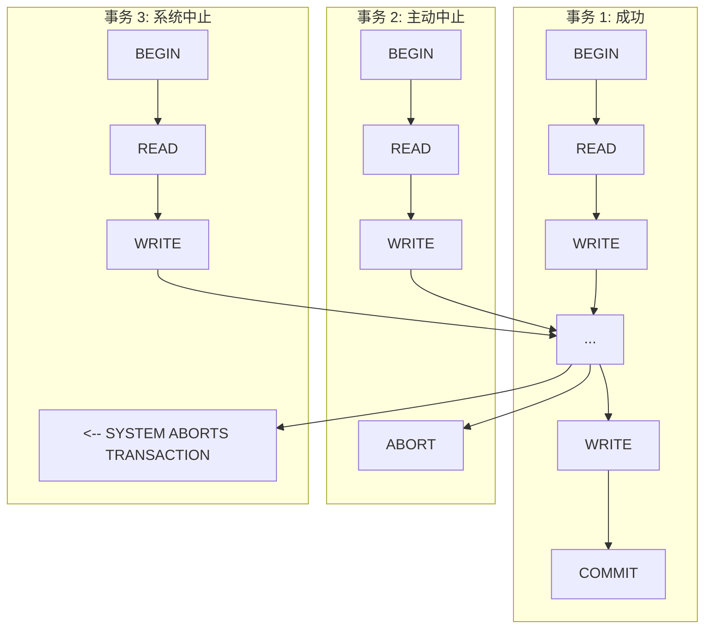

  * **Commit (提交):** 事务正常完成 。
  * **Abort (中止):** 事务因检测到坏数据等原因，主动撤销自己所做的一切 。
  * **System Aborts (系统中止):** 事务遇到超时或死锁等问题，被 DBMS 中止 。

-----

### 2\. 故障类型与恢复动作

数据库恢复需要明确两个前提：它要应对的**故障类型** ，以及它要恢复到的**一致性状态** 。

#### 故障类型 (Failure Types)

论文主要关注三种故障 ：

1.  **事务故障 (Transaction Failure):** 事务未达到正常提交点，必须被重置（回滚） 。
2.  **系统故障 (System Failure / Crash):** 由 DBMS 代码错误、操作系统故障或硬件故障引起 。这会导致处理非受控地终止，并且论文假设**主内存（Main Memory）的内容会丢失** 。
3.  **介质故障 (Media Failure):** 存储数据库的部分或全部二级存储（如磁盘）发生丢失 ，例如磁头崩溃  或磁盘损坏 。

#### 恢复动作 (Recovery Actions)

数据库的“一致性”被定义为：它*仅*包含已成功提交事务的结果 。这被称为**事务一致性 (Transaction Consistent)** 。

基于图 3  的场景（T1, T2, T3 在崩溃前提交；T4, T5 在崩溃时未完成），恢复组件有四种动作 ：    

  * **Transaction UNDO (事务撤销):** 在*正常运行*期间，如果一个事务中止，此动作会从数据库中移除该事务的所有影响 。
  * **Global UNDO (全局撤销):** 在*系统故障恢复*时，必须回滚（移除）所有*未完成*事务（如图 3 中的 T4, T5）的影响 。
  * **Partial REDO (部分重做):** 在*系统故障恢复*时，由于崩溃，*已完成*事务（如图 3 中的 T1, T2, T3 ）的结果可能尚未完全写入数据库 ，因此必须（在必要时）重做它们 。
  * **Global REDO (全局重做):** 在*介质故障恢复*时（也称为归档恢复 ），数据库被假定已物理损坏 。我们必须从一个较旧的副本（Archive Copy）开始，并重做自该副本创建以来所有已提交的事务 。

-----

### 3\. 数据库视图与存储层次

为了精确描述恢复策略，论文定义了 DBMS 的存储层次（如图 4 ）和数据库的三种不同“视图”。    

#### 存储层次 (Storage Hierarchy)

  * **易失性存储 (Volatile Storage):** 即主内存 。它包含：
      * **Database Buffer (数据库缓冲区):** 存放从磁盘读入和在内存中修改的数据页 。
      * **Log Buffer (日志缓冲区):** 存放恢复用的日志记录，写满后刷入磁盘 。
  * **非易失性存储 (Permanent Storage):** 
      * **Physical Copy (物理副本):** 数据库的在线版本，通常在磁盘上 。
      * **Temporary Log (临时日志):** 存储用于**崩溃恢复**（UNDO 和 REDO）的信息 。
      * **Archive Copy (归档副本):** 数据库的离线备份，用于应对介质故障 。
      * **Archive Log (归档日志):** 存储用于**介质恢复**（Global REDO）的信息 。

#### 数据库的三种视图 (Different Views of a Database)

  * **Current Database (当前数据库):** DBMS *正常处理*时看到的数据库 。它是最“新”的视图，包含了磁盘上的内容以及缓冲区中*刚被修改*的内容 。
  * **Materialized Database (物化数据库):** **（本文核心术语）** 这是 DBMS 在*崩溃后重启时*所能看到的数据库状态 。此时缓冲区已丢失 ，因此某些已提交事务的修改可能*尚未*反映在这个视图中 。
  * **Physical Database (物理数据库):** 在线副本（磁盘）上包含页面映像的所有数据块，无论它们是当前的还是过时的 。

-----

### 4\. 恢复实现的关键策略

论文的精髓在于提出了一个分类框架，该框架基于以下几个关键的实现策略。

#### 传播策略 (Propagation Strategy)

“传播” (Propagation) 指的是将缓冲区中修改过的页面更新（写入）到*物化数据库*（即让修改在崩溃后依然可见）的操作 。

  * **¬ATOMIC (非原子传播):**
      * 实现方式：通常采用**直接页面分配 (Direct Page Allocation)**，即“就地更新” (Update-in-place) 。如图 5 (左) 所示，页面 i 总是写回磁盘上的*同一个*块 i 。    
      * 特点：在这种策略下，“写入”(Write) 和“传播”(Propagation) 几乎是等价的 。任何一次写入都可能被系统崩溃打断 ，导致物化数据库处于“混乱” (chaotic) 状态 。
  * **ATOMIC (原子传播):**
      * 实现方式：通常采用**间接页面分配 (Indirect Page Allocation)** 。如图 5 (右) 所示，页面 i 的修改被写入一个*新的*块 k，而不是覆盖旧的块 j 。
      * 特点：这种策略（例如影子分页 ）允许将*任意一组*页面的传播操作作为一个原子单元 ，确保它要么全部成功，要么全部不成功，不会被崩溃打断 。

#### 缓冲区管理策略 (Buffer Handling Policies)

这是描述缓冲区管理器如何处理“脏页”（被修改过但未提交的页面）和“提交页”的策略。

  * **STEAL (窃取):** *允许*缓冲区管理器在*任何时候*将修改过的页面（*即使*是未提交事务的“脏页”）写入或传播到物化数据库 。
  * **¬STEAL (不窃取 / NO-STEAL):** *不允许*传播脏页。修改过的页面*至少*要保留在缓冲区中，直到其所属事务结束 (EOT) 。
      * *影响:* 采用 ¬STEAL 策略，物化数据库中永远不会有脏数据，因此**不需要 Global UNDO** 。
  * **FORCE (强制):** 在事务提交 (EOT) 时，*强制*将该事务修改过的*所有*页面都传播到物化数据库 。
  * **¬FORCE (不强制 / NO-FORCE):** 事务提交时，*不*强制触发页面传播 。
      * *影响:* 采用 FORCE 策略，所有已提交的数据都确保在物化数据库中，因此**不需要 Partial REDO** 。

#### 日志 (Logging)

  * **Write Ahead Log (WAL) Principle (预写日志原则):** 这是所有恢复机制都必须遵守的黄金法则 ：
    1.  **UNDO 规则:** 在一个修改*传播*到物化数据库*之前*，其对应的 UNDO 日志信息必须先被写入（非易失的）日志文件 。
    2.  **REDO 规则:** 在通知事务“已提交”(EOT) *之前*，其对应的 REDO 日志信息必须先被写入（非易失的）日志文件 。
  * **日志类型 (Types of Log):**
      * **Physical Logging (物理日志):** 记录物理数据 。例如，在页面被修改前记录其完整内容（称为 **Before Image / 前像** ），或在修改后记录其内容（称为 **After Image / 后像** ）。
      * **Logical Logging (逻辑日志):** 记录在较高层次上的*操作*及其参数 。例如，直接记录 `INSERT`、`UPDATE`、`DELETE` 这样的 DML 语句 。

#### 检查点 (Checkpoint)

  * **Checkpoint (检查点):** 目的是为了*限制*系统崩溃后 Partial REDO 所需的工作量 。如果没有检查点，REDO 可能需要从日志的*最开头*开始 。
  * **检查点类型:**
      * **Transaction-Oriented Checkpoints (TOC / 面向事务的检查点):** 当使用 FORCE 策略时 ，每个事务的 EOT 记录实际上就充当了一个检查点 。
      * **Transaction-Consistent Checkpoints (TCC / 事务一致性检查点):** 在一个“静止点” (quiescent) 创建，此时系统中*没有*正在活动的更新事务 。创建 TCC 时，会*强制传播*所有已修改的缓冲区页面到数据库 。
      * **Action-Consistent Checkpoints (ACC / 动作一致性检查点):** TCC 的要求太高。ACC 降低了要求，它在*动作*（如单个 DML 语句）的“静止点”创建 。
      * **Fuzzy Checkpoints (模糊检查点):** TCC 和 ACC 的代价很高（需要刷出大量页面） 。Fuzzy 检查点（也称间接检查点）为了降低成本 ，在检查点时刻*只*将缓冲区信息（例如哪些页面是脏的）写入日志文件 ，而不是写入页面本身 。
  
## 参考        
         
https://dl.acm.org/doi/pdf/10.1145/289.291    
        
<b> 以上内容基于DeepSeek、Qwen、Gemini及诸多AI生成, 轻微人工调整, 感谢杭州深度求索人工智能、阿里云、Google等公司. </b>        
        
<b> AI 生成的内容请自行辨别正确性, 当然也多了些许踩坑的乐趣, 毕竟冒险是每个男人的天性.  </b>        
    
#### [期望 PostgreSQL|开源PolarDB 增加什么功能?](https://github.com/digoal/blog/issues/76 "269ac3d1c492e938c0191101c7238216")
  
  
#### [PolarDB 开源数据库](https://openpolardb.com/home "57258f76c37864c6e6d23383d05714ea")
  
  
#### [PolarDB 学习图谱](https://www.aliyun.com/database/openpolardb/activity "8642f60e04ed0c814bf9cb9677976bd4")
  
  
#### [PostgreSQL 解决方案集合](../201706/20170601_02.md "40cff096e9ed7122c512b35d8561d9c8")
  
  
#### [德哥 / digoal's Github - 公益是一辈子的事.](https://github.com/digoal/blog/blob/master/README.md "22709685feb7cab07d30f30387f0a9ae")
  
  
#### [About 德哥](https://github.com/digoal/blog/blob/master/me/readme.md "a37735981e7704886ffd590565582dd0")
  
  

  
