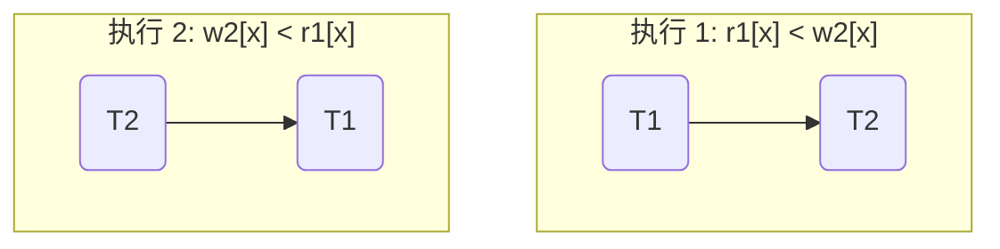
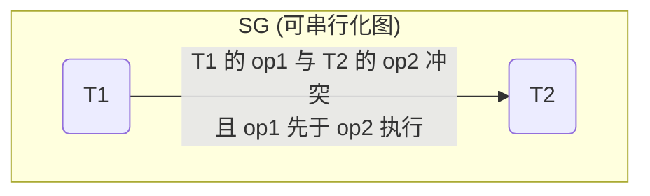
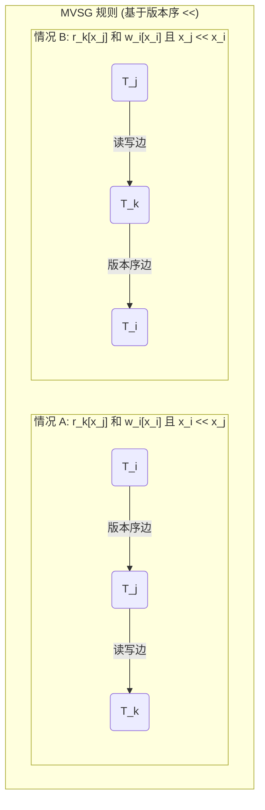

## AI论文解读 | Multiversion Concurrency Control - Theory And Algorithms
        
### 作者        
digoal        
        
### 日期        
2025-10-30        
        
### 标签        
PostgreSQL , PolarDB , DuckDB , AI , 论文解读        
        
----        
        
## 背景  
      
https://dl.acm.org/doi/pdf/10.1145/319996.319998        
  
提示:          
```          
读懂《Multiversion Concurrency Control - Theory And Algorithms》这篇论文需要提前掌握哪些基础知识, 请使用中文通熟易懂的讲解这些基础知识, 可以引用论文中的图、表或使用Markdown支持的图形(text,mermaid等)增加解释性. 
  
使用中文通熟易懂的解读《Multiversion Concurrency Control - Theory And Algorithms》这篇论文, 其中的关键内容请着重讲解, 可以引用论文中的图、表或使用Markdown支持的图形(text,mermaid等)增加解释性. 
  
提取《Multiversion Concurrency Control - Theory And Algorithms》这篇论文中的重要术语, 使用中文对这些术语进行通熟易懂的讲解, 可以引用论文中的图、表或使用Markdown支持的图形(text,mermaid等)增加解释性. 
```     
  
## 1 前置知识 
  
要读懂这篇经典的《Multiversion Concurrency Control - Theory And Algorithms》论文 ，你需要先掌握数据库领域中关于 **“并发控制” (Concurrency Control)** 的一套基础理论。

这篇论文的第 2 节  实际上就是对这套基础理论的回顾，然后第 3 节  才开始在此基础上构建多版本（Multiversion）的新理论。所以，你需要提前掌握的，正是第 2 节所回顾的 **“基础可串行化理论” (Basic Serializability Theory)** 。

下面我将用通俗的语言为你讲解这些核心的基础知识。

### 1\. 什么是并发控制 (Concurrency Control)？

  * **事务 (Transaction):** 想象一下你和你的朋友同时在网上买一件商品。你“下单”是一个事务（ $T_1$ ），你朋友“下单”是另一个事务（ $T_2$ ） 。一个事务包含了一系列的数据库操作，主要是**读 (read)** 和**写 (write)** 。
  * **并发 (Concurrency):** 数据库系统 (DBS) 为了高效，会同时处理多个事务 。它不会等 $T_1$ 完全结束后再开始 $T_2$ ，而是可能会把 $T_1$ 和 $T_2$ 的操作**交织 (interleaved)** 在一起执行 。
  * **问题所在:** 这种交织执行可能会产生“不期望的结果” 。比如，系统先读取了库存（剩 1 件）， $T_1$ 买了这 1 件，但系统还没来得及把库存*写*为 0，就切换到了 $T_2$ ， $T_2$ 也读取了库存（还是 1 件），也买了这 1 件。最后的结果是卖出了 2 件，库存却变成了 0，这显然是错的。
  * **目标 (并发控制):** 并发控制  的目标就是，既要允许并发执行（为了效率），又要保证执行的最终效果和 **“串行” (serial)** 执行（ 即一个一个排队执行， $T_1$ 完了再执行 $T_2$ ）的效果是一样的 。这种“等效于串行”的执行，就叫做 **“可串行化” (Serializable)** 。

> **小结:** 并发控制的目标就是保证“可串行化” ，这是判断一个并发执行是否“正确”的黄金标准 。

### 2\. "正确"的数学定义: 可串行化理论

这套理论用数学工具来精确地判断一次执行是否“正确”（即是否可串行化）。

#### 关键概念 1: 冲突 (Conflict)

并发问题的根源在于“冲突” 。两个操作，如果它们访问**同一个数据项**，并且至少有**一个是写**操作，那么它们就冲突了 。

  * `读-写` 冲突 ( $r_i[x]$ vs $w_j[x]$ )
  * `写-读` 冲突 ( $w_i[x]$ vs $r_j[x]$ )
  * `写-写` 冲突 ( $w_i[x]$ vs $w_j[x]$ )
    （`读-读` 不冲突）。并发控制的核心就是管理这些冲突操作的执行顺序 。

#### 关键概念 2: 日志 (Log)

为了分析执行，理论家们把一次执行抽象为 **“日志” (Log)** 。日志记录了所有事务的所有操作，以及它们之间发生的 **“先后关系” ( happens-before, 记为 $<$ )** 。

#### 关键概念 3: 可串行化图 (Serialization Graph, SG)

这是你**必须掌握**的核心工具。为了检测一次执行 (Log L) 是否可串行化，我们用它来画一张图 。

  * **节点 (Nodes):** 图中的每个节点代表一个事务 ( 如 $T_0, T_1, T_2, ...$ ) 。
  * **边 (Edges):** 如果 $T_i$ 的一个操作 $op_i$ **先于 ( $<$ )** $T_j$ 的一个操作 $op_j$ ，并且 $op_i$ 和 $op_j$ **相冲突**，我们就在图中画一条从 $T_i$ 指向 $T_j$ 的边 ( $T_i \to T_j$ ) 。

举个简单的例子：

  * $T_1$ 要读 $x$ ( $r_1[x]$ )
  * $T_2$ 要写 $x$ ( $w_2[x]$ )
  * 如果执行顺序是 $r_1[x] < w_2[x]$ ( $T_1$ 先读， $T_2$ 后写)，它们在 $x$ 上冲突了，所以我们画一条边 $T_1 \to T_2$ 。
  * 如果执行顺序是 $w_2[x] < r_1[x]$ ( $T_2$ 先写， $T_1$ 后读)，它们也冲突了，所以我们画一条边 $T_2 \to T_1$ 。




论文中 $SG(L_1)$ 的图 就是一个更复杂的例子。例如，因为 $w_0[x] < r_1[x]$ （ $T_0$ 的写操作在 $T_1$ 的读操作之前，且冲突 ），所以有一条边 $T_0 \to T_1$ 。

### 3\. 核心定理: 可串行化定理 (The Serializability Theorem)

掌握了 SG 图，定理就非常简单了：

> **如果一个日志 (L) 的可串行化图 (SG(L)) 是无环的 (acyclic)，那么这个日志 (L) 就是可串行化的 (SR)** 。

  * **无环 (Acyclic):** 意味着图中不存在“循环依赖”。
  * **有环 (Cycle):** 比如 $T_1 \to T_2$ 并且 $T_2 \to T_1$ 。
      * $T_1 \to T_2$ 意味着：在等效的串行执行中， $T_1$ 必须在 $T_2$ 之前。
      * $T_2 \to T_1$ 意味着：在等效的串行执行中， $T_2$ 必须在 $T_1$ 之前。
      * 这就是一个“悖论” (Catch-22)： $T_1$ 必须在 $T_2$ 之前，同时 $T_2$ 又必须在 $T_1$ 之前。这是不可能的。
  * 因此，**SG 图中的环 = 不可串行化 = 错误的并发执行**。

### 4\. 论文的创新点: 从 "SG" 到 "MVSG"

你掌握了上述基础知识后，就能看懂这篇论文的创新点了。

  * **什么是多版本 (Multiversion, MV)？**
      * 在基础理论中，`write(x)` 会**覆盖** $x$ 的旧值。
      * 在 MV 系统中，`write(x)` 会创造一个 $x$ 的**新版本**（ 比如 $w_i[x]$ 创造 $x_i$ ） 。
      * `read(x)` 操作可以被系统翻译为读取*任意*一个存在的版本（比如 $r_j[x_i]$ 就是 $T_j$ 读取 $T_i$ 写的版本） 。
  * **为什么 MV 好？**
      * 在基础理论中，一个“迟到的读” ( $r_j[x]$ ) 如果发生在 $w_i[x]$ 之后，它就只能读到新值。
      * 在 MV 中，这个“迟到的读”仍然可以被允许去读 $x$ 的**旧版本** 。这大大增加了并发的灵活性。
  * **论文的贡献 (你需要看懂的):**
    1.  论文定义了一个更强的正确性标准：**1-Copy Serializability (1-SR)** 。它要求 MV 的执行必须等价于一个*单版本*的串行执行（因为用户希望数据库表现得像只有一个副本） 。
    2.  论文引入了一个新概念：**版本序 ( Version Order, $\ll$ )** 。它代表了数据库中一个数据项的所有版本（ $x_i, x_j, ...$ ）的“最终”排序。
    3.  论文定义了一个**新图**：**Multiversion Serialization Graph (MVSG)** 。
    4.  $MVSG = SG$ （来自基础理论的读写冲突） + **新的边** （基于版本序 $\ll$ 产生的读写和写写冲突）。
    5.  论文给出了**新的核心定理 (1-Serializability Theorem)**：一个 MV 日志是 1-SR **当且仅当** 存在一个版本序 ( $\ll$ )，使得 $MVSG(L, \ll)$ 是**无环的** 。

-----

### 总结: 你需要掌握的基础知识

要读懂这篇论文，请确保你理解以下概念（它们都在论文的第 2 节  中有回顾）：

1.  **事务 (Transaction)** 、**读/写操作** 。
2.  **并发执行 (Concurrent)** vs **串行执行 (Serial)** 。
3.  **可串行化 (Serializability)** 的定义：并发执行等价于某个串行执行 。
4.  **冲突操作 (Conflicting Operations)** 的定义（同数据、至少一写） 。
5.  **可串行化图 (SG)** 的构建方法（节点=事务，边=冲突的先后顺序） 。
6.  **可串行化定理**：**SG 无环 $\iff$ 可串行化** 。

如果你理解了为什么“SG 中的环”会导致“不可串行化”，你就抓住了基础理论的精髓。这篇论文的全部工作，就是把这个“图论”工具从 $SG$ 扩展到了 $MVSG$ ，以分析更灵活的多版本系统。
  
## 2 解读论文 
  
这篇论文是数据库并发控制领域的一篇“圣经”级论文。它**首次为多版本并发控制 (MVCC) 提供了坚实的理论基础**。

简单来说，你今天在用的几乎所有主流数据库（如 PostgreSQL, Oracle, MySQL (InnoDB), SQL Server）都以某种形式在使用 MVCC。而这篇论文，就是为 "为什么 MVCC 是正确的" 提供了数学证明的“开山鼻祖”。

我将为你通俗地解读这篇论文，带你理解它的核心思想。

### 1\. 为什么需要多版本 (MVCC)？

在数据库中，并发控制的目标是：允许多个用户（事务）同时读写数据，但其执行效果要和他们“排队”执行（串行）的效果一样 。

**在传统的“单版本”世界里：**

  * 写操作会**覆盖**旧数据。
  * 这会导致一个经典问题：**读-写冲突**。如果一个“读”事务（ $T_{read}$ ）正在读取数据，一个“写”事务（ $T_{write}$ ）想要修改它，那么 $T_{read}$ 必须等待 $T_{write}$ 完成（或者反过来）。
  * **痛点：** “读”和“写”会互相阻塞，性能很差。

**MVCC 的天才想法：**

  * **写操作不覆盖**！而是创建一个数据的**新版本** 。
  * **读操作不阻塞**！一个“读”事务 $T_{read}$ 永远不需要等待“写”事务 $T_{write}$ 。 $T_{read}$ 只需要去读取它“应该”看到的那个**旧版本**（快照）即可 。

> **通俗比喻：**  
>  
>   * **单版本系统 (如 2PL)** 像是一个“共享文档”。你读的时候别人不能写，别人写的时候你不能读。  
>   * **MVCC 系统** 像是 Git。你 `commit`（写）一个新版本时，并不会影响正在 `checkout`（读）旧版本的同事。  

### 2\. MVCC 带来的新问题：怎样才算“正确”？

MVCC 提供了巨大的灵活性，但也带来了一个全新的理论难题：

  * 在单版本世界里，“正确”很简单：等价于*某个*串行执行顺序。
  * 在 MVCC 世界里，读操作可以“穿越时空”去读旧版本。这导致一些串行执行在“单版本”世界里根本不可能发生。

**论文中的例子 ：**
假设 $T_0$ 写了 $x_0, y_0$ 。
$L = w_0[x_0] \to w_0[y_0] \to r_1[x_0] \to w_1[y_1] \to r_2[y_0] \to w_2[x_2]$

这是一个串行执行 ( $T_0 \to T_1 \to T_2$ )。但看看发生了什么：

1.  $T_1$ 读取 $x_0$ （ 来自 $T_0$ ），然后写了 $y_1$ 。
2.  $T_2$ 却 **读取了 $y_0$** （ 来自 $T_0$ ）， **“跳过”了 $T_1$ 写的 $y_1$** 。

在“单版本”世界里，这是不可能的 。如果 $T_1$ 在 $T_0$ 之后、 $T_2$ 之前执行， $T_2$ 必须读到 $T_1$ 写的 $y_1$ 。

**因此，论文提出了 MVCC 的黄金标准：**

#### 核心概念 1: 单副本可串行化 (One-Copy Serializability, 1-SR)

  * **定义：** 一个 MVCC 的执行是“正确”的，当且仅当它等价于**某个**在**单副本 (One-Copy)** 数据库上的**串行**执行 。
  * **通俗解释：** 尽管你数据库内部玩着“多版本”的“时空穿越”，但你对外表现出的最终效果，必须和一个“老实巴交的、只有一个版本的、所有事务排队执行”的数据库所能产生的效果**完全一样**。
  * 上面那个例子 $L$ 就**不是 1-SR** 的 ，因为它无法在单版本世界中重现。

### 3\. 如何判断一个执行是否为 1-SR？

这是论文最核心的理论贡献。作者发明了一个图论工具来解决这个问题。

#### 核心概念 2: 版本序 ( Version Order, $\ll$ )

  * 我们知道，一个数据项 $x$ 现在可能有很多版本（ 如 $x_i, x_j, x_k$ ）。
  * **版本序 $\ll$** 是一个**假设的**、在所有版本上的全序关系 。
  * 例如，对于 $x$ 的版本 $x_0, x_1, x_2$ ，我们可以假设一个版本序 $x_0 \ll x_2 \ll x_1$ 。这**不一定**是它们的创建时间顺序，它只是我们为了分析而“猜测”的一个排序 。

#### 核心概念 3: 多版本可串行化图 (MVSG)

MVSG 是用来检测“悖论”（循环）的工具。它在传统的可串行化图 (SG) 基础上，增加了基于**版本序**的新边。

一个 MVSG 包含两类边 ：

1.  **“读-写”边 (来自 SG):**

      * 如果 $T_j$ 读取了 $T_i$ 写的版本（ 即 $r_j[x_i]$ ），那么图中就有一条边 $T_i \to T_j$ 。这代表了“读取依赖”。

2.  **“版本序”边 (论文的创新):**

      * 这是最关键的部分。它用来解决“一个读操作 $r_k[x_j]$ 和另一个写操作 $w_i[x_i]$ 之间的关系” 。
      * 我们必须根据假设的**版本序 $\ll$** 来添加这条边，规则如下：
          * **情况 A：如果 $x_i \ll x_j$**（即 $T_i$ 写的版本“旧于” $T_j$ 写的版本）：
              * 我们必须强制 $T_i$ 在 $T_j$ 之前。
              * 添加边： $T_i \to T_j$ 。
          * **情况 B：如果 $x_j \ll x_i$**（即 $T_i$ 写的版本“新于” $T_j$ 写的版本）：
              * $T_k$ 读取了 $x_j$ ，“无视”了 $x_i$ 。在单副本世界里，这只可能是因为 $T_i$ 的写操作发生在 $T_k$ 的读操作**之后**。
              * 添加边： $T_k \to T_i$ 。

#### 核心定理: 1-可串行化定理 (1-Serializability Theorem)

这是论文的“皇冠明珠”：

> **一个 MV 执行 L 是 1-SR 的，当且仅当，存在一个版本序 $\ll$ ，使得 $MVSG(L, \ll)$ 是无环的 (acyclic)** 。
 
  * **通俗解释：** 一个 MVCC 执行是“正确”的，只要我们能**找到至少一种**对版本（ $x_i, x_j...$ ）的排序方式（ 版本序 $\ll$ ），使得按照这个排序方式画出的 MVSG 图里**没有出现循环**（没有悖论）。
  * 如果无论怎么排版本序，MVSG 图里都会出现循环，那么这个执行就是**错误**的（非 1-SR）。

### 4\. 理论的应用：证明 MVCC 算法的正确性

论文的后半部分（第 4-6 节）就是用这个强大的 MVSG 理论工具，去分析当时已有的和新提出的 MVCC 算法。

我以**多版本时间戳 (MV Timestamping, 第 4 节)** 为例，讲解它是如何被证明的：

**MV 时间戳算法 ：**

1.  每个事务 $T_i$ 获得一个唯一的**时间戳 $TS(i)$** 。
2.  **读规则：** $T_k$ 读 $x$ 时 ( $r_k[x]$ )，系统选择版本 $x_j$ ，其中 $x_j$ 具有**小于等于 $TS(k)$ 的最大时间戳**（即读取 $T_k$ 开始前“最新”的那个版本）。
3.  **写规则：** $T_i$ 写 $x$ 时 ( $w_i[x]$ )，会创建一个带 $TS(i)$ 的新版本 $x_i$ 。但是，如果这个“写”会“作废”某个已经被读取的旧版本（ 即存在 $r_k[x_j]$ 使得 $TS(j) < TS(i) < TS(k)$ ），则 $T_i$ 必须被**拒绝 (abort)** 。

**如何证明它是 1-SR 的？**

  * **选择版本序 ( $\ll$ )：** 论文选择了一个“显而易见”的版本序，即**按时间戳排序**。 $x_i \ll x_j$ 当且仅当 $TS(i) < TS(j)$ 。
  * **分析 MVSG：** 论文证明了，使用这个“时间戳版本序”构建的 MVSG，**所有的边都必然是从小时间戳指向大时间戳** 。
      * $T_i \to T_j$ (读写边)： $T_j$ 读 $x_i$ ，根据读规则 $TS(i) \le TS(j)$ ，又因时间戳唯一，所以 $TS(i) < TS(j)$ 。
      * $T_i \to T_j$ (版本序边 A)：因为 $x_i \ll x_j$ ，所以 $TS(i) < TS(j)$ 。
      * $T_k \to T_i$ (版本序边 B)：因为 $x_j \ll x_i$ ，所以 $TS(j) < TS(i)$ 。根据算法规则 (TS5)，要么 $TS(i) < TS(j)$ (不可能) 要么 $TS(k) \le TS(i)$ 。又因时间戳唯一，所以 $TS(k) < TS(i)$ 。
  * **得出结论：** 既然 MVSG 中所有的边都是从“小”指向“大”的，那么这个图**绝对不可能有环**（ 因为你不可能 $TS(A) < TS(B)$ 且 $TS(B) < TS(A)$ ）。
  * **最终证明：** 既然我们找到了一个版本序（时间戳序），使得 MVSG 必定无环，根据“1-可串行化定理”，MV 时间戳算法**是正确的 (1-SR)** 。

论文还用同样的方法分析了**多版本锁 (MV Locking)**  和 **MV 混合方法** 。

### 总结：这篇论文的伟大之处

1.  **定义了“金标准”：** 首次提出了 **1-SR (单副本可串行化)**，作为评判 MVCC 算法正确性的唯一标准 。
2.  **创造了“度量衡”：** 发明了 **MVSG (多版本可串行化图)** 和 **版本序 ( $\ll$ )** 。
3.  **提供了“总定理”：** 证明了 **1-SR $\iff$ 存在一个 $\ll$ 使得 MVSG 无环** 。
4.  **提供了“方法论”：** 展示了如何使用这个理论框架去分析和证明具体的 MVCC 算法（如时间戳、锁）是正确的 。

在此之前，人们设计 MVCC 算法靠的是“直觉”和“经验”；在此之后，人们靠的是这篇论文提供的**数学理论**。
  
## 3 术语 
  
好的，这篇论文是数据库领域关于**多版本并发控制 (MVCC)** 的奠基之作。它用一套严谨的理论（图论）来分析和证明为什么 MVCC 算法是“正确”的。

以下是论文中几个最关键的术语，我将用通俗的语言为你讲解：

### 1\. 基础并发控制术语

#### 1.1 Concurrency Control (并发控制)

  * **通俗讲解：** 就像管理一个繁忙的十字路口。数据库（路口）会同时接收到很多个事务（车辆）发来的读、写操作（通行请求）。并发控制就是那个“交通指挥系统”（如红绿灯），它的工作是协调（同步）这些操作 ，确保它们不会“撞车”（即产生脏读、不可重复读等异常结果）。
  * **论文目标：** 最终的执行效果，必须和“串行”（serial，即车辆一辆一辆排队通过路口）执行的效果一样 。

#### 1.2 Serializable (可串行化)

  * **通俗讲解：** 这是判断并发执行“正确”的**黄金标准**。
  * **定义：** 如果一个并发（交织）执行所产生的结果，与**某一个**特定的串行执行（ 例如，事务 $T_1$ $\to$ $T_2$ $\to$ $T_3$ ）所产生的结果完全相同，那么这个并发执行就是“可串行化”的 。

#### 1.3 Serialization Graph (SG) (可串行化图)

  * **通俗讲解：** 这是一个用来检测“并发是否正确”的（单版本）图论工具。
  * **构建规则：**
    1.  图中的**节点** (Nodes) 代表每一个**事务** ( $T_i, T_j$ 等 ) 。
    2.  图中的**边** (Edges) 代表“冲突依赖”。如果 $T_i$ 的一个操作 $op_i$ **先于** $T_j$ 的一个操作 $op_j$ 执行，并且这两个操作**相冲突**（访问同一数据，且至少一个是写操作 ），我们就在图中画一条从 $T_i$ 指向 $T_j$ 的边 ( $T_i \to T_j$ ) 。
  * **可串行化定理 (Serializability Theorem)：**
      * 如果 $SG$ 是**无环的 (acyclic)**，则该执行是**可串行化的 (SR)** 。
      * 如果 $SG$ **有环 (cycle)**（ 例如 $T_i \to T_j$ 且 $T_j \to T_i$ ），则意味着出现“悖论”（ $T_i$ 必须在 $T_j$ 前， $T_j$ 也必须在 $T_i$ 前 ），该执行**不是可串行化**的。




-----

### 2\. 多版本 (MVCC) 核心理论术语

#### 2.1 Multiversion (MV) Database (多版本数据库)

  * **通俗讲解：** 传统数据库的“写”操作是**覆盖**旧值。MV 数据库的“写”操作是**创建新版本** 。
  * **类比：** 想象一个文档，传统数据库是 Word（保存时覆盖旧版），MV 数据库是 Git（提交时创建新版本）。
  * **操作：** $T_i$ 的写操作 $w_i[x]$ 会产生一个新版本 $x_i$ 。 $T_j$ 的读操作 $r_j[x]$ 可以被系统翻译为读取 $x$ 的*任意*一个已存在版本（ 如 $r_j[x_k]$ ）。

#### 2.2 One-Copy Serializable (1-SR) (单副本可串行化)

  * **通俗讲解：** 这是 **MVCC 的黄金标准**，是 $Serializable$ 的“升级版”。
  * **为什么需要它？** 因为 MVCC 允许读取旧版本，这可能产生一些在“单版本”数据库上*不可能*出现的串行结果（例如， $T_2$ 读到了 $T_0$ 的值，却“跳过”了 $T_1$ 刚写的新值）。
  * **定义：** 1-SR 要求 MVCC 的执行结果，必须等价于一个**在单副本（one-copy）数据库**上执行的**串行**日志 。
  * **目标：** 尽管系统内部玩着“多版本时空穿越”的游戏，但对用户表现出的行为，必须和用户所理解的“单版本”世界完全一致 。

#### 2.3 Version Order ( $\ll$ ) (版本序)

  * **通俗讲解：** 这是论文中用于分析 1-SR 的**核心工具**。
  * **定义：** 既然一个数据 $x$ 有了多个版本（ $x_i, x_j, x_k$ ）， $Version Order$ 就是我们在这些版本上假设的一个**非自反的（nonreflexive）全序关系** 。
  * **示例：** 假设有 $x_0, x_1, x_2$ 三个版本。我们可以*假设*一个版本序为 $x_0 \ll x_2 \ll x_1$ 。
  * **注意：** 这个 $\ll$ **不一定**是版本的创建时间顺序，它是我们为了“凑”出一个无环 MVSG 而*寻找*的一种“逻辑排序”。

#### 2.4 Multiversion Serialization Graph (MVSG) (多版本可串行化图)

  * **通俗讲解：** 这是 1-SR 的“检测工具”，是 $SG$ 在 MVCC 理论下的“升级版”。
  * **构建规则：** $MVSG$ = $SG$ + 基于 $Version Order$ 的新边 。
    1.  **读-写边 (来自 SG)：** 如果 $T_j$ 读取了 $T_i$ 写的 $x_i$ ( 操作为 $r_j[x_i]$ )，则画一条边 $T_i \to T_j$ 。
    2.  **版本序边 (论文创新)：**  考虑一个读操作 $r_k[x_j]$ 和一个写操作 $w_i[x_i]$ （ $i \ne k$ ），我们必须根据*假设*的版本序 $\ll$ 添加一条边：
          * **情况 A (Write-Write)：** 如果 $x_i \ll x_j$ (版本 $i$ 逻辑上在 $j$ 之前)，则添加 $T_i \to T_j$ 。
          * **情况 B (Read-Write)：** 如果 $x_j \ll x_i$ (版本 $j$ 逻辑上在 $i$ 之前)，则添加 $T_k \to T_i$ 。
              * (通俗理解B： $T_k$ 读了“较旧”的 $j$ ，无视了“较新”的 $i$ 。在 1-SR 世界里，这只可能因为 $T_k$ 读的时候 $T_i$ 还没写，所以 $T_k$ 必须在 $T_i$ 之前。)




#### 2.5 1-Serializability Theorem (1-可串行化定理)

  * **通俗讲解：** 这是整篇论文的**核心定理**，它将 1-SR 与 MVSG 关联了起来。
  * **定理：** 一个 MV 日志 L 是 **1-SR** 的 $\iff$ **存在 (exists)** 一个版本序 $\ll$ 使得 $MVSG(L, \ll)$ **无环 (acyclic)** 。
  * **意义：** 这个定理提供了“试金石”。要证明一个 MVCC 算法（如 MV 时间戳  或 MV 锁 ）是正确的，我们只需要证明：该算法产生的所有执行，都能*找到*一个（通常是基于时间戳或锁的顺序）版本序 $\ll$ ，使得 MVSG **必然无环** 。
  
## 参考        
         
https://dl.acm.org/doi/pdf/10.1145/319996.319998    
        
<b> 以上内容基于DeepSeek、Qwen、Gemini及诸多AI生成, 轻微人工调整, 感谢杭州深度求索人工智能、阿里云、Google等公司. </b>        
        
<b> AI 生成的内容请自行辨别正确性, 当然也多了些许踩坑的乐趣, 毕竟冒险是每个男人的天性.  </b>        
    
#### [期望 PostgreSQL|开源PolarDB 增加什么功能?](https://github.com/digoal/blog/issues/76 "269ac3d1c492e938c0191101c7238216")
  
  
#### [PolarDB 开源数据库](https://openpolardb.com/home "57258f76c37864c6e6d23383d05714ea")
  
  
#### [PolarDB 学习图谱](https://www.aliyun.com/database/openpolardb/activity "8642f60e04ed0c814bf9cb9677976bd4")
  
  
#### [PostgreSQL 解决方案集合](../201706/20170601_02.md "40cff096e9ed7122c512b35d8561d9c8")
  
  
#### [德哥 / digoal's Github - 公益是一辈子的事.](https://github.com/digoal/blog/blob/master/README.md "22709685feb7cab07d30f30387f0a9ae")
  
  
#### [About 德哥](https://github.com/digoal/blog/blob/master/me/readme.md "a37735981e7704886ffd590565582dd0")
  
  

  
