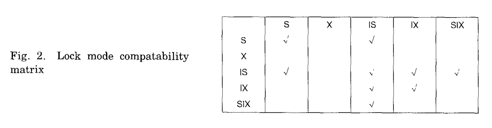
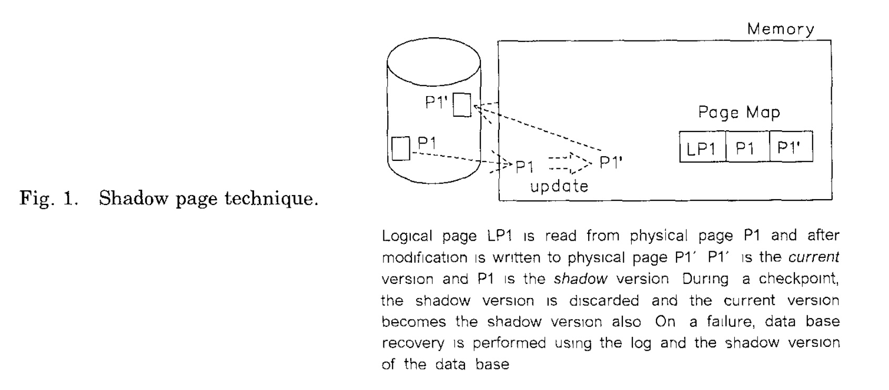
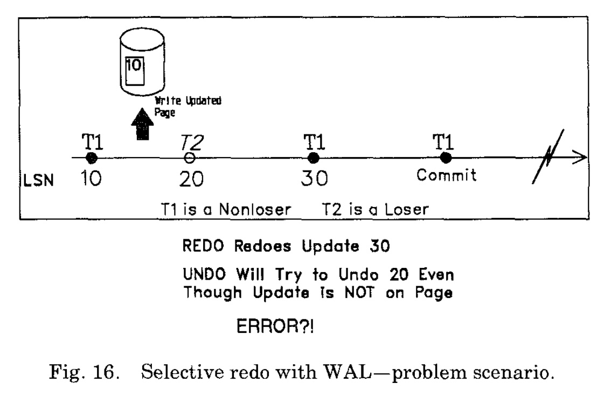
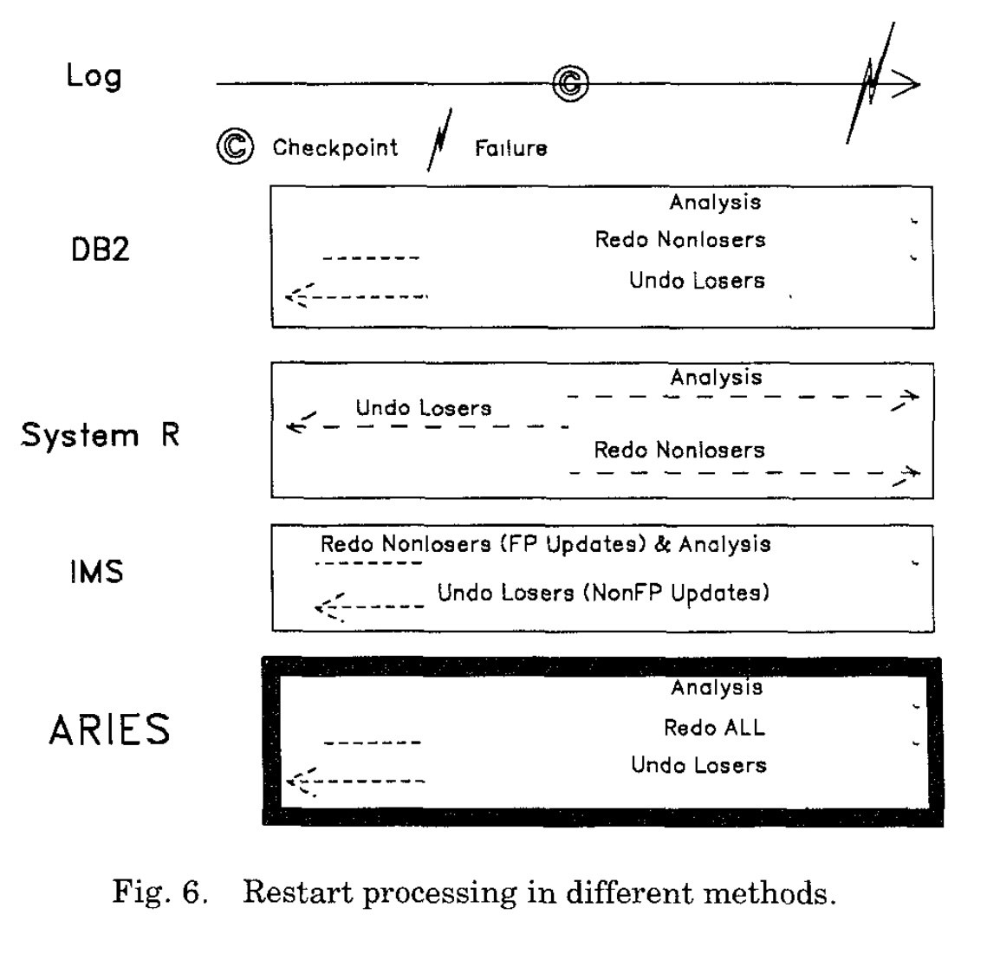
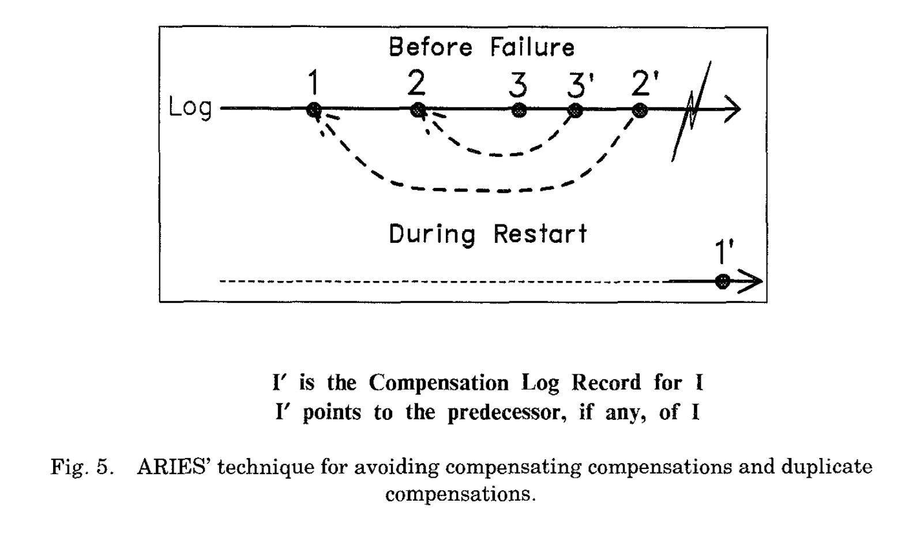
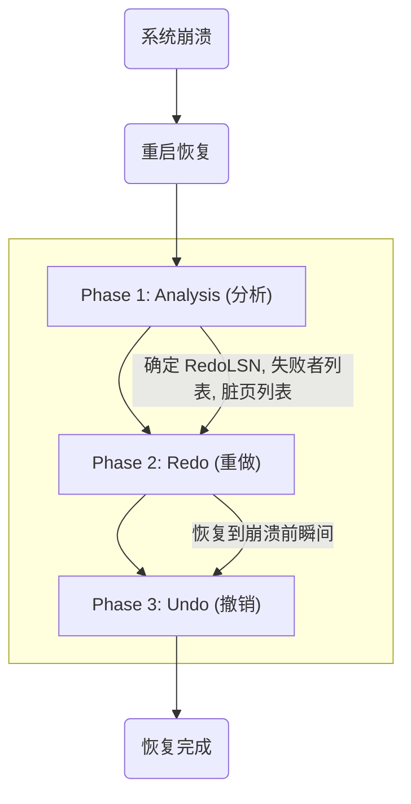
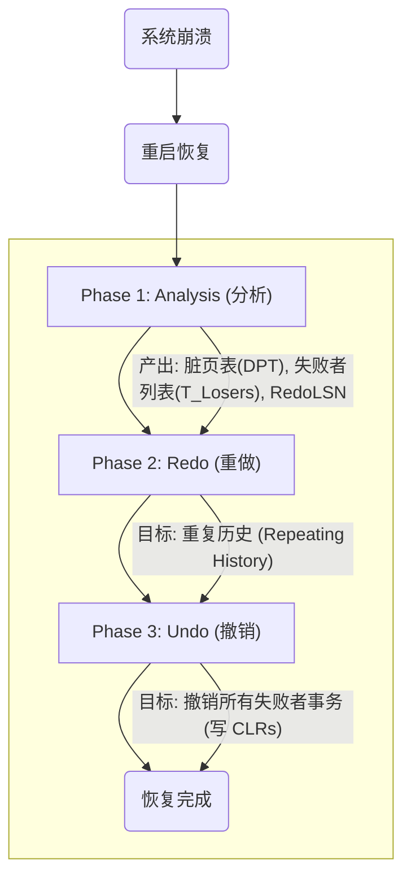

## AI论文解读 | Aries: A Transaction Recovery Method Supporting Fine-Granularity Locking And Partial Rollbacks Using Write-Ahead Logging
        
### 作者        
digoal        
        
### 日期        
2025-10-30        
        
### 标签        
PostgreSQL , PolarDB , DuckDB , AI , 论文解读        
        
----        
        
## 背景  
      
https://dl.acm.org/doi/pdf/10.1145/128765.128770        
  
提示:          
```          
读懂《Aries: A Transaction Recovery Method Supporting Fine-Granularity Locking And Partial Rollbacks Using Write-Ahead Logging》这篇论文需要提前掌握哪些基础知识, 请使用中文通熟易懂的讲解这些基础知识, 可以引用论文中的图、表或使用Markdown支持的图形(text,mermaid等)增加解释性. 
  
使用中文通熟易懂的解读《Aries: A Transaction Recovery Method Supporting Fine-Granularity Locking And Partial Rollbacks Using Write-Ahead Logging》这篇论文, 其中的关键内容请着重讲解, 可以引用论文中的图、表或使用Markdown支持的图形(text,mermaid等)增加解释性. 
  
提取《Aries: A Transaction Recovery Method Supporting Fine-Granularity Locking And Partial Rollbacks Using Write-Ahead Logging》这篇论文中的重要术语, 使用中文对这些术语进行通熟易懂的讲解, 可以引用论文中的图、表或使用Markdown支持的图形(text,mermaid等)增加解释性. 
```     
  
## 1 前置知识 
  
理解《ARIES》这篇论文确实需要一些数据库系统领域的基础知识。这是一篇在事务恢复领域具有里程碑意义的论文，它提出的算法（ARIES）是当今许多工业级数据库系统（如 DB2, SQL Server 等）恢复机制的核心。

为了帮助你更好地理解这篇论文，这里为你梳理了所需的基础知识，并会引用论文中的图表来辅助说明。

-----

### 1\. 事务 (Transaction) 与 ACID

这是最基本也是最重要的概念。数据库管理系统（DBMS）通过事务来保证数据的可靠性。

  * **事务 (Transaction):** 是用户定义的一系列数据库操作（如查询、插入、修改、删除），这些操作被视为一个不可分割的工作单元。
  * **ACID 特性:** 事务必须具备四个核心特性 ：
    1.  **原子性 (Atomicity):** 事务中的所有操作要么全部成功执行，要么全部不执行（回滚）。ARIES 的主要目标之一就是保证原子性，尤其是在系统崩溃时。
    2.  **一致性 (Consistency):** 事务执行前后，数据库都必须处于一致的状态（例如，转账操作前后，两个账户的总金额不变）。
    3.  **隔离性 (Isolation):** 多个事务并发执行时，它们的效果应该与它们串行执行时相同。这通常通过并发控制（如锁）来实现。
    4.  **持久性 (Durability):** 一旦事务被提交 (Commit)，它对数据库的更改就是永久性的，即使系统随后崩溃也不应丢失。

ARIES 算法的设计目标就是高效地保证 **原子性** 和 **持久性**，尤其是在发生系统故障时。

### 2\. 并发控制 (Concurrency Control)

为了实现隔离性 (Isolation)，数据库需要管理并发事务的访问。

  * **锁 (Locking):** 是最常见的并发控制机制 。

      * **锁模式 (Lock Modes):** 你需要了解最基本的锁模式。论文的图 2  定义了锁的兼容性矩阵。    
          * **共享锁 (S, Shared):** 用于读操作。多个事务可以同时持有同一数据的 S 锁 。
          * **排他锁 (X, eXclusive):** 用于写操作。如果一个事务持有 X 锁，其他任何事务都不能再获取该数据的 S 锁或 X 锁 。

        **图 2 的锁模式兼容矩阵**

| 模式 | S | X | IS | IX | SIX |
| :--- | :-: | :-: | :-: | :-: | :--: |
| **S** | √ | | √ | | |
| **X** | | | | | |
| **IS** | √ | | √ | √ | √ |
| **IX** | | | √ | √ | |
| **SIX** | | | √ | | |

(√ 代表兼容)

  * **锁粒度 (Granularity):** 锁可以应用在不同“大小”的对象上，如表 (Table)、页 (Page) 或记录 (Record) 。

      * **粗粒度 (Coarse-Granularity):** 如表锁。开销小，但并发性差。
      * **细粒度 (Fine-Granularity):** 如记录锁 。并发性好，但锁管理的开销大。
      * **意向锁 (Intention Locks):** 为了支持细粒度锁，引入了意向锁（如 IS, IX）。例如，当一个事务想给某个记录加 X 锁时，它必须先在包含该记录的页和表上加 IX（意向排他）锁 。这等于告诉其他事务：“我准备在内部的某个小单元上加 X 锁，你们不用等我，但你们也不能直接对整个表加 S 锁或 X 锁。”

  * **闩锁 (Latch):** 论文中也提到了 Latch 。你需要区分 Latch 和 Lock：

      * **Lock (锁):** 保护数据的**逻辑一致性**（事务层面），由事务持有，可能持续较长时间（直到事务提交）。
      * **Latch (闩锁):** 保护内存数据结构（如缓冲池中的页）的**物理一致性**，通常在多线程环境下使用 。它由线程持有，持续时间非常短（通常仅几条指令的时间）。

ARIES 的一个核心贡献就是支持**细粒度锁定 (Fine-Granularity Locking)** 。

### 3\. 故障恢复 (Failure Recovery) 与日志 (Logging)

这是理解 ARIES 的核心。系统会遇到各种故障（如断电、进程崩溃、磁盘损坏）。恢复 (Recovery) 的目标是在系统重启后，快速将数据库恢复到一致的状态（即：所有已提交的事务都已持久化，所有未提交的事务都已回滚）。

  * **日志 (Log):** 日志是实现恢复的基础。数据库对数据的所有更改都会先被记录在日志中 。

  * **WAL (Write-Ahead Logging) 协议:** 预写日志协议 。这是 ARIES 采用的基础协议，它有两条铁律：

    1.  **Undo 规则:** 数据的更改（无论是在内存还是磁盘） **之前**，描述该更改的日志记录（尤其是 undo 信息）必须先被写入稳定存储（如磁盘）。
    2.  **Redo 规则:** 事务在提交（Commit） **之前**，所有描述该事务更改的日志记录（尤其是 redo 信息）必须被写入稳定存储 。

  * **缓冲区管理策略 (Buffer Management Policies):**
    数据库的数据页通常在内存的“缓冲区 (Buffer Pool)”中进行修改 。何时将这些“脏页”（Dirty Page，即在内存中被修改但尚未写入磁盘的页）写回磁盘，涉及两种策略：

      * **`STEAL` vs. `NO-STEAL`**:
          * `STEAL` (窃取): 允许在事务**提交前**，将其修改的脏页写回磁盘 。
          * `NO-STEAL`: 不允许。
      * **`FORCE` vs. `NO-FORCE`**:
          * `FORCE` (强制): 要求在事务**提交时**，必须将其修改的所有脏页立即写回磁盘 。
          * `NO-FORCE`: 不要求。

    不同的策略组合对应不同的恢复开销：

    | 策略 | `FORCE` | `NO-FORCE` |
    | :--- | :--- | :--- |
    | **`NO-STEAL`** | 最简单，但性能最差。 | 需要 **Redo** (重做)。 |
    | **`STEAL`** | 需要 **Undo** (撤销)。 | **需要 Redo 和 Undo**。 |

    ARIES 运行在性能最高的 `STEAL` / `NO-FORCE` 环境下 。这意味着恢复时：

      * 可能需要 **Redo**：因为 `NO-FORCE` 允许已提交的事务数据仍在内存，系统崩溃会导致数据丢失 。
      * 可能需要 **Undo**：因为 `STEAL` 允许未提交的事务数据（“脏数据”）被写入磁盘 。

### 4\. 核心恢复概念

  * **LSN (Log Sequence Number):** 日志序列号 。这是 ARIES 的灵魂。

      * 每个日志记录都有一个唯一的、单调递增的 LSN 。
      * ARIES 要求**每个数据页**上都必须存储一个 `page_LSN` 字段 。
      * `page_LSN` 记录了**最后一次**修改该页的日志记录的 LSN。
      * **作用：** 通过比较日志记录的 LSN 和 `page_LSN`，ARIES 可以精确判断：在系统崩溃时，日志中的某项更改是否已经应用到了磁盘上的数据页中 。

  * **Checkpoint (检查点):** 检查点 。日志是无限增长的，系统恢复时不可能从头扫描所有日志。

      * **作用：** 检查点会定期记录当前系统的“快照”，主要是“脏页列表”（Dirty Page Table）和“活跃事务列表”（Transaction Table）。
      * **意义：** 它告诉恢复系统：“你不需要从日志的开头开始 Redo，你只需要从某个最早的脏页（即 `RedoLSN` ）开始扫描日志就可以了。”
      * ARIES 使用的是**模糊检查点 (Fuzzy Checkpoint)** ，即在做检查点时不需要停止所有事务 。

  * **影子分页 (Shadow Paging):** 这是 WAL 之外的另一种恢复技术，被 System R 等早期系统使用 。

      * **原理：** 从不“原地修改” (in-place updating) 磁盘上的数据 。当要修改一个页面 P 时，它会复制一个 P'，在 P' 上修改，然后通过“页表 (Page Map)”将指针从 P 指向 P' 。
      * 论文中的 **Figure 1** 描述了影子分页 。    
      * **缺点：** 这种方式会破坏数据的物理聚集性（数据页被分散到磁盘各处），并且检查点（即切换所有指针）的开销非常大 。ARIES 基于 WAL，解决了这些问题。

  * **ARIES 的核心思想 (The ARIES Idea):**
    ARIES 之前的 WAL 恢复算法（如 DB2 和 IMS 的早期版本）很复杂，例如它们在恢复时只重做 (Redo) “胜利者”事务（已提交的），这被称为**选择性重做 (Selective Redo)** 。

    ARIES 指出，在细粒度锁定的 `STEAL/NO-FORCE` 环境下，“选择性重做”是错误的（论文中的 **Figure 16**  展示了这种错误场景）。    
 
    ARIES 提出了一个更简单、更强大的范式：**重复历史 (Repeating History)** 。

    ARIES 的恢复过程分为三步（见论文 **Figure 6** ）：    

    ```mermaid
    graph LR
        A[开始恢复] --> B(1\. 分析 Analysis);
        B --> C(2\. 重做 Redo);
        C --> D(3\. 撤销 Undo);
        D --> E[恢复完成];

        subgraph "分析 Analysis "
            direction LR
            B1(扫描日志) --> B2(确定 T_active 和 D_dirty);
            B2 --> B3(确定 RedoLSN);
        end
        
        subgraph "重做 Redo "
            direction LR
            C1(从 RedoLSN 开始) --> C2(重做所有操作);
            C2 --> C3(无论胜利者还是失败者);
            C3 --> C4(数据库恢复到崩溃前瞬间);
        end

        subgraph "撤销 Undo "
            direction LR
            D1(反向扫描) --> D2(只回滚失败者事务);
            D2 --> D3(写入 CLR);
        end
    ```

  * **CLR (Compensation Log Record):** 补偿日志记录 。

      * **背景：** 论文要求**回滚 (Undo) 操作也必须被记录日志** 。
      * **定义：** CLR 就是在执行 Undo 时写入的日志。
      * **关键特性 (ARIES 独有):**
        1.  CLR 是一种 **“Redo-Only”** 的日志 。
        2.  CLR **永远不需要被 Undo** 。
      * **作用：**
        1.  **支持部分回滚 (Partial Rollback):** ARIES 的标题特性之一 。
        2.  **避免重复回滚：** 即使系统在 Undo 过程中再次崩溃，重启恢复时（重复历史 Redo）会重做 CLR，然后继续 Undo。由于 CLR 的存在，系统知道哪些已经 Undo 过了，不会重复劳动（见 **Figure 5** ）。    
        3.  **有界日志 (Bounded Logging):** 确保回滚不会导致无限的日志写入 。

-----

### 总结

要读懂 ARIES，你必须首先牢固掌握：

1.  **ACID** 的概念。
2.  **并发控制**的必要性，特别是**锁（S/X/IS/IX）和粒度**。
3.  **WAL 协议**（两条铁律）。
4.  **`STEAL/NO-FORCE`** 缓冲区策略（它决定了为何必须同时支持 Redo 和 Undo）。
5.  **LSN**（特别是 `page_LSN`）如何将日志与数据页状态联系起来。

掌握了这些，你就能理解 ARIES 提出的“重复历史”范式、三阶段恢复（Analysis-Redo-Undo）以及 CLR 的精妙设计是如何解决前人算法的缺陷的。
  
## 2 解读论文 
  
这篇名为《ARIES：一种支持细粒度锁和部分回滚的预写日志恢复方法》的论文，是数据库事务恢复领域一座不可撼动的里程碑 。它提出的 ARIES 算法（Algorithm for Recovery and Isolation Exploiting Semantics）极其巧妙且完备，解决了此前恢复算法的诸多缺陷，成为了后续几乎所有商业关系型数据库（如 IBM DB2、Microsoft SQL Server 等）恢复机制的核心和标准。

用一句话概括： **ARIES 是一种在系统崩溃后，如何“简单、快速、正确”地让数据库恢复到一致状态的算法，并且它在恢复时还能支持高并发（细粒度锁）和复杂事务（部分回滚）** 。

下面，我们将用通俗易懂的语言，为你深入解读这篇论文的核心内容。

-----

### 1\. 为什么需要 ARIES？（背景与挑战）

在 ARIES 出现之前，数据库恢复算法普遍面临两大挑战：

1.  **性能与恢复的矛盾：**

      * 为了高性能，数据库系统采用了 **细粒度锁（Fine-Granularity Locking）** （例如锁住一条记录，而不是整个表或整个页面）。
      * 为了高性能，数据库的内存 **缓冲区（Buffer Pool）** 采用了 `STEAL` 和 `NO-FORCE` 策略：
          * **`STEAL`（窃取）** ：允许未提交（Uncommitted）事务修改的“脏页”被写回磁盘 。**这带来了问题**：如果系统崩溃，磁盘上可能存在未提交的“垃圾数据”，恢复时必须**撤销 (UNDO)** 它们。
          * **`NO-FORCE`（不强制）** ：事务提交（Commit）时，不强制要求它修改的所有脏页都必须立即写回磁盘 。**这带来了问题**：如果系统崩溃，已提交的数据可能只在内存中，导致数据丢失，恢复时必须**重做 (REDO)** 它们。

    `STEAL` / `NO-FORCE` 策略性能最好，但它要求恢复算法必须**同时处理 UNDO 和 REDO**，这非常复杂 。

2.  **复杂的回滚逻辑：**

      * **部分回滚（Partial Rollbacks）** ：事务可能需要回滚到某个“保存点 (Savepoint)” 。
      * **回滚时崩溃**：如果系统在执行 UNDO（回滚）操作时又崩溃了，恢复逻辑会变得异常复杂。

早期的算法（如 System R 的影子分页  或 IMS 的方法 ）要么性能不佳（如影子分页破坏数据聚集性 ），要么在 `STEAL/NO-FORCE` 和细粒度锁环境下存在逻辑缺陷。

### 2\. ARIES 的核心思想：重复历史 (Repeating History)

ARIES 的设计哲学是“**追求简单，因为简单就是健壮**” 。它提出了一个颠覆性的核心思想：**重复历史 (Repeating History)** 。

这个思想是：**在系统崩溃恢复时，我们不关心事务是“胜利者”（Committed）还是“失败者”（Uncommitted）。我们首先通过 REDO（重做）操作，把数据库严格恢复到崩溃前“最后一刻”的状态，即使那个状态是“脏”的（包含了失败者的修改）。然后，我们再统一进行 UNDO（撤销），把所有失败者事务的影响“清理”掉。**

这个思想彻底简化了 REDO 阶段的逻辑。

-----

### 3\. ARIES 的三大法宝（关键技术）

为了实现“重复历史”这一思想，ARIES 依赖三大关键技术：

#### 法宝一：LSN (日志序列号)

LSN (Log Sequence Number) 是 ARIES 的灵魂 。

1.  **日志记录 (Log Record):** 数据库的每一个变更（Update, Commit, Abort 等）都会生成一条日志记录，每条记录都有一个**全局唯一且单调递增**的 LSN 。
2.  **数据页 (`page_LSN`):** ARIES 规定，数据库的**每一个数据页 (Page) 上都必须存储一个 LSN**，称为 `page_LSN` 。
3.  **核心规则：** 当一个操作（其日志 LSN 为 `L`）被应用到某个数据页 `P` 上时，该数据页 `P` 的 `page_LSN` 必须被更新为 `L` 。

`page_LSN` 就像是数据页的“版本号”。通过比较日志记录的 LSN 和数据页的 `page_LSN`，ARIES 可以精确判断：**这个日志记录所代表的修改，是否已经反映在了这个数据页上？**

> **判断规则 (REDO 阶段):**
>
> `IF LogRecord.LSN > Page.page_LSN THEN`
> 这个修改**没有**在页面上，需要**重做 (REDO)** 。
> `ELSE`
> 这个修改**已经**在页面上了，**跳过**。

#### 法宝二：CLR (补偿日志记录) 与完美回滚

ARIES 的第二大发明是**补偿日志记录 (Compensation Log Record, CLR)**，它用来解决 UNDO（回滚）操作的难题 。

**核心思想：** ARIES 认为，一个 UNDO（撤销）操作本身也是一个操作，它同样会修改数据页。因此，**UNDO 操作也必须被记录日志** 。这个用于记录 UNDO 操作的日志，就叫 CLR。

CLR 在 ARIES 中有两个“逆天”的特性：

1.  **CLRs 永远不会被撤销 (CLRs are Never Undone)** 。
2.  CLRs 被视为**只重做 (Redo-Only)** 的日志记录 。

**为什么这很关键？**
想象一个事务 T1 做了操作 1, 2, 3，然后它决定回滚。

1.  系统开始 UNDO 操作 3，并写入一个 CLR (我们称之为 3')，这个 CLR 描述了“如何撤销 3” 。
2.  **假设此时系统崩溃了！**

**恢复时：**

1.  **REDO 阶段：** 系统会“重复历史”，把 1, 2, 3 都重做。然后，它还会重做 CLR (3')，即**把“撤销 3”这个操作也重做了**。
2.  **UNDO 阶段：** 系统发现 T1 是失败者，需要回滚。它从操作 3 开始，但发现已经存在一个 CLR (3') 了，说明 3 已经被撤销过了。

为了让系统能“跳过”已经被 CLR 处理过的操作，CLR 还有一个精妙设计：`UndoNxtLSN` 指针 。

  * 一个普通的日志记录（如 3）有一个 `PrevLSN` 指针，指向它**前一个**的日志记录（如 2）。
  * 当为 3 写入 CLR (3') 时，CLR 的 `UndoNxtLSN` 字段被设置为 3 的 `PrevLSN`（即 2 的 LSN）。

如论文中的 **Figure 5** 所示，CLR 通过 `UndoNxtLSN` 巧妙地将所有“需要被撤销”的原始日志链接了起来，跳过了那些已经被撤销的操作 。    

```
    [Log 1] <--PrevLSN-- [Log 2] <--PrevLSN-- [Log 3]
       ^                     ^
       |                     |
       '----UndoNxtLSN---- [CLR 2'] <--UndoNxtLSN-- [CLR 3']
```

(UNDO 时，系统从 3' 开始，通过 `UndoNxtLSN` 找到 2，再通过 2' 的 `UndoNxtLSN` 找到 1 )

**CLR 的好处：**

  * **支持部分回滚：** 回滚到保存点，就是 UNDO 到那个点的 LSN 为止 。(见 **Figure 3** )    
  * **回滚时崩溃也不怕：** 恢复时 REDO 会把已做的 UNDO 也重做，UNDO 阶段通过 `UndoNxtLSN` 继续执行未完成的 UNDO。
  * **日志有界：** 因为 CLR 永远不被撤销，所以永远不会出现“撤销一个撤销（CLR）”的“CLR的CLR”，避免了无限日志 。

#### 法宝三：三阶段恢复 (Analysis-Redo-Undo)

ARIES 的崩溃恢复过程严格分为三个阶段（见论文 **Figure 6** ）：    



1.  **Phase 1: Analysis (分析)** 

      * **目标：** 搞清楚崩溃时“谁在干活”（活跃事务）以及“哪些页可能没存盘”（脏页）。
      * **动作：** 从最后一个**检查点 (Checkpoint)** 开始，**正向**扫描日志直到末尾 。
      * **产出：**
          * **失败者事务列表 (Loser Transactions):** 崩溃时还未提交的事务 。
          * **脏页表 (Dirty Pages Table, DPT):** 崩溃时可能在内存中被修改过，但未写回磁盘的页 。
          * **`RedoLSN`：** REDO 阶段的起始点。它是 DPT 中记录的**最早的 LSN** 。这代表了“最早可能丢失的修改”是从哪里开始的。

2.  **Phase 2: Redo (重做)** 

      * **目标：** **重复历史**。将数据库恢复到崩溃前的确切状态 。
      * **动作：** 从 `RedoLSN`（在 Analysis 阶段确定）开始，**正向**扫描日志到末尾 。
      * **规则：** 对**所有**日志记录（无论胜利者还是失败者），应用我们“法宝一”中的 LSN 判断规则 ：
          * 获取日志记录 `L` 对应的页面 `P`。
          * `IF L.LSN > P.page_LSN THEN`
          * **重做 (REDO)** 这个操作，并设置 `P.page_LSN = L.LSN` 。
          * （*注意：此阶段不写任何日志* ）。
      * **结果：** 数据库状态与崩溃瞬间完全一致。所有已提交但未存盘的数据被恢复（满足了**持久性**），所有未提交但已存盘的数据也依然存在（暂时）。

3.  **Phase 3: Undo (撤销)** 

      * **目标：** 清理“失败者”事务，保证**原子性**。
      * **动作：** **反向**（逻辑上）扫描 Analysis 阶段确定的**所有失败者事务**的日志 。
      * **规则：**
          * 从失败者事务的最后一条日志开始，沿着 `PrevLSN` 链回溯 。
          * 如果遇到的是**普通日志**：执行 UNDO 操作，并**写入一条 CLR** 。CLR 的 `UndoNxtLSN` 指向该普通日志的 `PrevLSN`。
          * 如果遇到的是 **CLR**：说明这个操作已经被撤销过了，**跳过它**，并根据 CLR 的 `UndoNxtLSN` 指针找到下一个要处理的日志 。
      * **结果：** 所有未提交事务的影响被彻底清除。数据库达到一致状态。

-----

### 4\. ARIES 为什么必须“重复历史”？（解决了什么关键缺陷）

为什么 ARIES 坚持要重做（REDO）失败者事务，然后再撤销（UNDO）它们？这难道不是多此一举吗？

**不是，这正是 ARIES 最核心的贡献！**

ARIES 之前的算法（如早期 DB2）试图“优化”REDO 阶段，它们只重做“胜利者”事务，这被称为**选择性重做 (Selective Redo)** 。ARIES 证明了，在支持细粒度锁的 `STEAL` 策略下，**选择性重做是错误的**。

论文中的 **Figure 16**  揭示了这个问题：    

**场景（一个导致数据损坏的经典例子）：**

1.  磁盘上的数据页 P，`page_LSN = 10`。
2.  **T2（失败者）** 更新了 P 上的记录 R1。（日志 LSN 20）
3.  **T1（胜利者）** 更新了 P 上的记录 R2。（日志 LSN 30）
4.  T1 提交。
5.  **系统崩溃**。（假设P还未写回磁盘）

**如果使用“选择性重做”（旧算法）：**

  * **Analysis：** T1 是胜利者，T2 是失败者。`RedoLSN` = 20。
  * **Redo (选择性)：**
      * 扫描到 LSN 20：T2 是失败者，**跳过 (SKIP)** 。
      * 扫描到 LSN 30：T1 是胜利者。`LSN (30) > page_LSN (10)`，**执行 REDO** 。
      * **REDO 后：** 页面 P 的状态是 {T1的修改}，`page_LSN = 30`。
  * **Undo：**
      * 开始撤销 T2。找到 LSN 20。
      * 系统检查 `page_LSN (30) > LSN (20)`。系统（错误地）认为 LSN 20 的修改（T2 的修改）*一定*在页面 P 上 。
      * 系统执行 LSN 20 的 UNDO 操作。但此时页面 P 上只有 T1 的修改，T2 的修改根本不在上面！
      * **结果：数据损坏 (DATA CORRUPTION)** 。

**如果使用 ARIES（重复历史）：**

  * **Analysis：** T1 是胜利者，T2 是失败者。`RedoLSN` = 20。
  * **Redo (重复历史)：**
      * 扫描到 LSN 20：`LSN (20) > page_LSN (10)`，**执行 REDO**（重做 T2 的修改）。页面 P 状态：{T2的修改}，`page_LSN = 20`。
      * 扫描到 LSN 30：`LSN (30) > page_LSN (20)`，**执行 REDO**（重做 T1 的修改）。页面 P 状态：{T2的修改 + T1的修改}，`page_LSN = 30`。
      * **REDO 后：** 页面 P 恢复到了崩溃前的**真实状态**。
  * **Undo：**
      * 开始撤销 T2。找到 LSN 20。
      * 系统检查 `page_LSN (30) > LSN (20)`。此时 T2 的修改**确实**在页面上（REDO 阶段刚放上去的）。
      * 系统**正确地**执行 LSN 20 的 UNDO 操作，并写入 CLR。
      * **结果：数据一致。** T1（胜利者）的修改保留，T2（失败者）的修改被清除。

**结论：** “重复历史”通过在 REDO 阶段无差别地重做所有操作，确保了 `page_LSN` 和页面状态的绝对同步，从而使后续的 UNDO 操作能够基于完全正确的页面状态来执行，避免了数据损坏。

### 总结：ARIES 的贡献

ARIES 算法以其简单、统一的逻辑，完美地解决了高性能数据库恢复的难题：

1.  **支持高并发：** “重复历史”范式正确支持了细粒度锁定 。
2.  **支持高性能：** 完美适配 `STEAL/NO-FORCE` 缓冲策略 。
3.  **支持复杂事务：** CLR 和 `UndoNxtLSN` 机制优雅地实现了部分回滚 。
4.  **鲁棒性极高：** 无论系统崩溃多少次，或在恢复中途再次崩溃，该算法都能正确恢复，且日志写入量有界（CLR 从不被撤销）。
5.  **恢复效率高：** 支持模糊检查点 、并行 REDO/UNDO ，恢复速度快。

ARIES 的设计是数据库工程的典范，它通过精妙的数据结构（LSN、CLR）和清晰的流程（三阶段恢复），将“重复历史”这一简单思想转化为了一个极其健壮和高效的工业级恢复算法。
  
## 3 术语 
  
理解这篇论文，关键在于掌握它提出的一系列用于构建健壮、高效恢复系统的专门术语。这些术语共同构成了 ARIES 算法的核心。

以下是论文中最重要的术语及其通俗易懂的讲解：

### 1\. ARIES (算法名称)

  * **全称**: Algorithm for Recovery and Isolation Exploiting Semantics（利用语义的恢复与隔离算法） 。
  * **通俗讲解**: 这是论文提出的这套恢复算法的名字。它的核心思想是“**重复历史**” ，并且在回滚（Undo）时使用一种聪明的日志记录（CLR）来确保操作的正确性和高效性 。

### 2\. Write-Ahead Logging (WAL) - 预写日志协议

  * **通俗讲解**: 这是 ARIES 算法的基石 。它是一条铁律：**在把数据（例如，一个被修改的页面）写入磁盘“之前”，必须“预先”确保描述这次修改的日志记录（Log Record）已经成功写入了磁盘（稳定存储）** 。
  * **为什么重要**: 想象一下，如果系统在数据写盘后、日志写盘前崩溃了。重启时，系统会看到磁盘上的数据变了，但在日志里却找不到“为什么变了”的记录，这就导致数据库无法恢复。WAL 协议保证了“凡有修改，必有日志可循”。
  * **ARIES 的 WAL 要求**: ARIES 特别强调，在数据页被刷回磁盘前，**至少**描述了如何撤销（Undo）这次修改的日志部分必须已被写入稳定存储 。

### 3\. Log Sequence Number (LSN) - 日志序列号

  * **通俗讲解**: LSN 是 ARIES 算法的“灵魂”。它是一个**全局唯一、单调递增**的编号 ，每一条日志记录都会被分配一个 LSN。
  * **ARIES 的创举 (`page_LSN`)**: ARIES 不仅给日志编号，它还要求**在每一个数据页（Page）的头部，都必须存储一个 `page_LSN` 字段** 。
  * **`page_LSN` 的作用**: 这个 `page_LSN` 记录了**最后一次修改该页面的那条日志的 LSN** 。
  * **为什么重要**: `page_LSN` 就像是数据页的“版本号”。在恢复的“重做 (Redo)”阶段，系统可以通过比较日志记录的 LSN 和磁盘上数据页的 `page_LSN` 来做出判断：
      * `如果 Log.LSN > Page.page_LSN`：说明日志里的这项修改“比”页面上的版本要新，页面“丢失”了这次更新，**需要重做 (Redo)** 。
      * `如果 Log.LSN <= Page.page_LSN`：说明这项修改已经存在于页面上，**不需要重做**。

### 4\. Repeating History - 重复历史

  * **通俗讲解**: 这是 ARIES 恢复范式的核心思想 。
  * **它是什么**: 当系统崩溃重启时，恢复的第一步（Redo 阶段）是**严格“重复”历史**。ARIES 会从一个特定点（`RedoLSN`）开始，重做（Redo） **所有** 在日志中但可能未体现在磁盘上的修改 。
  * **关键点**: 这个“所有”既包括已提交事务（胜利者）的修改，也包括未提交事务（失败者）的修改 。
  * **目标**: 此阶段的目的是将数据库**严格恢复到崩溃前瞬间的状态** ，哪怕那个状态是“脏”的（包含了失败者的修改）。
  * **为什么这么做**: 只有恢复到崩溃前的真实状态，`page_LSN` 和页面的实际内容才能保持一致。这为后续的 Undo 阶段提供了正确的数据基础（详见论文 Figure 16 的反例）。    

### 5\. Compensation Log Record (CLR) - 补偿日志记录

  * **通俗讲解**: CLR 是 ARIES 为解决“回滚（Undo）操作”而设计的关键发明。

  * **它是什么**: 当一个事务需要回滚（撤销）某个操作时（无论是正常回滚还是崩溃恢复时的回滚），它在执行撤销的同时，会**为这个“撤销动作”本身再写一条新的日志**，这条新日志就叫 CLR 。

  * **ARIES 的核心特性**:

    1.  **CLR 是“只重做 (Redo-Only)”的**: CLR 描述的操作（即“撤销”动作）是必须被执行的，但它本身**永远不需要再被撤销** 。
    2.  **避免重复回滚**: CLR 中包含一个特殊的指针 `UndoNxtLSN` 。这个指针不指向上一条日志，而是指向“原始事务中，**下一条需要被撤销**的日志” 。

  * **图解 (类比论文 Figure 5)**: 假设一个事务 T1 依次写入了 LSN 1, 2, 3。现在 T1 要回滚。    

    ```
    普通日志 (T1):  [LSN 1] <--PrevLSN-- [LSN 2] <--PrevLSN-- [LSN 3]
       ^                                                 |
       |             (回滚 3, 写入 CLR 3')                |
       '------------UndoNxtLSN------------------------- [CLR 3']
    ```

    1.  系统回滚 LSN 3，并写入 CLR 3' 。CLR 3' 的 `UndoNxtLSN` 指针被设置为 LSN 3 的 `PrevLSN`（即 LSN 2 的地址） 。
    2.  **此时如果系统崩溃**：
          * 恢复的 Redo 阶段会重做 LSN 1, 2, 3，然后也会**重做 CLR 3'**（即把“撤销 3”这个动作也重做了）。
          * 恢复的 Undo 阶段发现 T1 是失败者，开始回滚。它看到 T1 的最新日志是 CLR 3'。
          * 系统**跳过 CLR 3'**（因为它永不撤销） ，并直接根据 CLR 3' 的 `UndoNxtLSN` 指针（指向 LSN 2），**准确地跳转到 LSN 2** 继续执行回滚。

  * **好处**: CLR 机制确保了即使在回滚过程中反复崩溃，一个操作也**永远不会被重复撤销** ，并且**保证了日志写入是有界的**（不会出现 CLR 的 CLR 的 CLR...） 。

### 6\. ARIES 的三阶段恢复 (Recovery Phases)

ARIES 的恢复过程严格分为三个阶段 ，论文的 Figure 6 对比了 ARIES 和其他系统（如 IMS, System R）的恢复流程。    



1.  **Analysis Pass (分析阶段)** 

      * **动作**: 从最后一个检查点（Checkpoint）开始，**正向**扫描日志到结尾 。
      * **目标**: 确定数据库在崩溃瞬间的“快照” 。
      * **产出**:
          * **脏页表 (Dirty Page Table, DPT)**：哪些页在崩溃时可能在内存中是“脏”的 。
          * **失败者事务列表 (Loser Transactions)**：崩溃时还未提交的事务 。
          * **`RedoLSN`**: Redo 阶段的起始 LSN。它是 DPT 中所有 `RecLSN`（恢复LSN）的最小值 。

2.  **Redo Pass (重做阶段)** 

      * **动作**: 从 `RedoLSN` 开始，**正向**扫描日志到结尾 。
      * **目标**: **重复历史** 。
      * **规则**: 对每一条日志，应用 LSN 规则（见术语 3） 。如果日志 LSN 大于页面的 `page_LSN`，就重做这个操作 。
      * **结果**: 数据库恢复到崩溃前的确切状态 。

3.  **Undo Pass (撤销阶段)** 

      * **动作**: **反向**（逻辑上）回滚所有在分析阶段确定的“失败者事务” 。
      * **目标**: 保证事务的**原子性**（Atomicity）。
      * **规则**: 使用 `PrevLSN` 和 CLR 的 `UndoNxtLSN` 指针链进行回滚 。每撤销一个普通日志，就必须写入一个 CLR 。
      * **结果**: 所有失败者事务的影响被清除，数据库达到一致状态。

### 7\. 其他重要支持性术语

  * **Steal / No-Steal & Force / No-Force (缓冲区策略)**

      * **`Steal` (窃取)**：允许未提交事务的修改（脏页）被写回磁盘 。ARIES **支持** `Steal`。
      * **`No-Steal` (不窃取)**：不允许 。
      * **`Force` (强制)**：事务提交时，**强制**要求其所有修改过的页必须写回磁盘 。
      * **`No-Force` (不强制)**：事务提交时，**不要求**其修改过的页必须写回磁盘 。
      * **ARIES 的环境**: ARIES 的设计目标就是在最高性能的 **`Steal / No-Force`** 环境下工作 ，这也是它必须同时处理 Redo（因为 `No-Force`）和 Undo（因为 `Steal`）的原因。

  * **Fuzzy Checkpoint (模糊检查点)**

      * **通俗讲解**: 一种高效的“打点”方式。在执行检查点时，系统**不需要停止所有事务**（即不需要“冻结”系统） 。
      * **ARIES 如何做**: 检查点只是简单地记录下当前的“脏页表”和“活跃事务表” 。这使得检查点操作非常快，对系统性能影响极小 。

  * **Logical Undo (逻辑撤销)**

      * **通俗讲解**: 一种更高级的撤销方式。
      * **物理撤销 (Page-Oriented Undo)**：撤销操作严格地反转原始操作的物理字节 。
      * **逻辑撤销 (Logical Undo)**：撤销操作是基于“逻辑”的，它最终达到的效果是撤销了原始操作，但具体修改的物理位置可能不同 。
      * **例子**: T1 在 B+ 树的页面 P10 中插入了一个键。在 T1 提交前，T2 执行了页面分裂，将 T1 插入的键移到了 P20。此时 T1 回滚。
          * 物理撤销会失败，因为它试图去 P10 删除一个已经不存在的键。
          * 逻辑撤销会重新遍历 B+ 树，在 P20 找到并删除该键 。
      * **ARIES 支持逻辑撤销** ，这是它支持高并发（如索引并发）的关键。

  * **Partial Rollback (部分回滚)**

      * **通俗讲解**: 事务不需要完全撤销，只需回滚到事务执行过程中设置的某个“**保存点 (Savepoint)**” 。
      * **ARIES 的支持**: ARIES 的 CLR 和 `UndoNxtLSN` 机制天生就支持部分回滚 。回滚到保存点，就是从当前 LSN 开始，沿着 `UndoNxtLSN` 链一直回滚，直到指定的 LSN 为止 。
  
## 参考        
         
https://dl.acm.org/doi/pdf/10.1145/128765.128770    
        
<b> 以上内容基于DeepSeek、Qwen、Gemini及诸多AI生成, 轻微人工调整, 感谢杭州深度求索人工智能、阿里云、Google等公司. </b>        
        
<b> AI 生成的内容请自行辨别正确性, 当然也多了些许踩坑的乐趣, 毕竟冒险是每个男人的天性.  </b>        
    
#### [期望 PostgreSQL|开源PolarDB 增加什么功能?](https://github.com/digoal/blog/issues/76 "269ac3d1c492e938c0191101c7238216")
  
  
#### [PolarDB 开源数据库](https://openpolardb.com/home "57258f76c37864c6e6d23383d05714ea")
  
  
#### [PolarDB 学习图谱](https://www.aliyun.com/database/openpolardb/activity "8642f60e04ed0c814bf9cb9677976bd4")
  
  
#### [PostgreSQL 解决方案集合](../201706/20170601_02.md "40cff096e9ed7122c512b35d8561d9c8")
  
  
#### [德哥 / digoal's Github - 公益是一辈子的事.](https://github.com/digoal/blog/blob/master/README.md "22709685feb7cab07d30f30387f0a9ae")
  
  
#### [About 德哥](https://github.com/digoal/blog/blob/master/me/readme.md "a37735981e7704886ffd590565582dd0")
  
  

  
