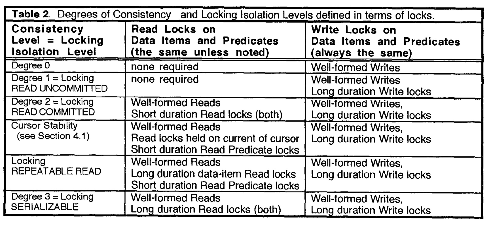
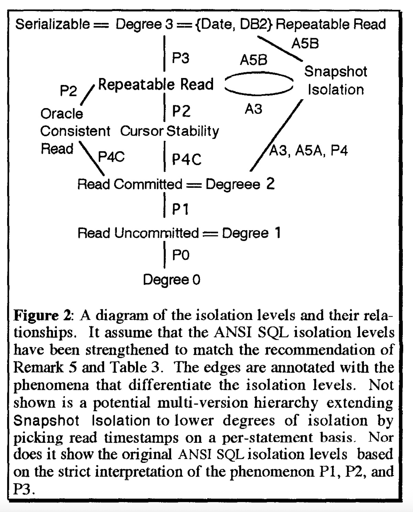
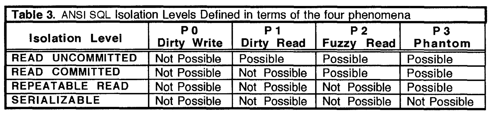
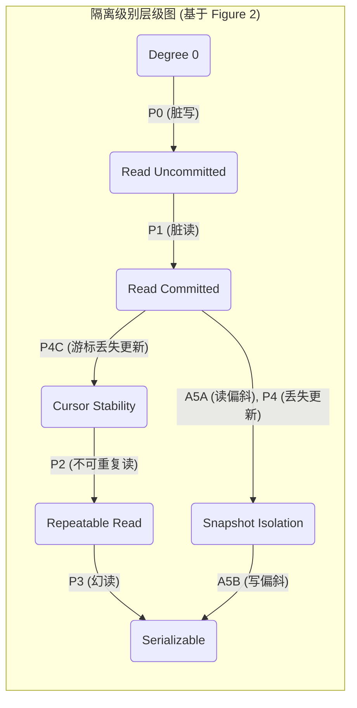
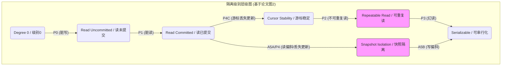

## AI论文解读 | A Critique Of Ansi Sql Isolation Levels
        
### 作者        
digoal        
        
### 日期        
2025-10-30        
        
### 标签        
PostgreSQL , PolarDB , DuckDB , AI , 论文解读        
        
----        
        
## 背景  
      
https://dl.acm.org/doi/pdf/10.1145/568271.223785        
  
提示:          
```          
读懂《A Critique Of Ansi Sql Isolation Levels》这篇论文需要提前掌握哪些基础知识, 请使用中文通熟易懂的讲解这些基础知识, 可以引用论文中的图、表或使用Markdown支持的图形(text,mermaid等)增加解释性. 
  
使用中文通熟易懂的解读《A Critique Of Ansi Sql Isolation Levels》这篇论文, 其中的关键内容请着重讲解, 可以引用论文中的图、表或使用Markdown支持的图形(text,mermaid等)增加解释性. 
  
提取《A Critique Of Ansi Sql Isolation Levels》这篇论文中的重要术语, 使用中文对这些术语进行通熟易懂的讲解, 可以引用论文中的图、表或使用Markdown支持的图形(text,mermaid等)增加解释性. 
```     
  
## 1 前置知识 
  
您好！这是一篇数据库领域的经典论文 ，它深刻地影响了后续数据库系统的设计。要读懂这篇论文，您需要先掌握一些数据库并发控制的基础知识。

这篇论文的核心在于**批判（Critique）**  1992年的ANSI SQL标准（SQL-92）  是如何定义“隔离级别”的。它指出SQL-92的定义是模糊的 、不完整的 ，并且无法准确描述许多流行数据库（尤其是基于锁的系统）的实际行为 。

以下是您需要提前掌握的核心基础知识，我会用通俗的语言来解释：

### 1. 什么是“事务” (Transaction)？

您可以把“事务”想象成一个 **“工作单元”** ，它包含一系列数据库操作（比如读取、写入、更新）。这个工作单元必须是“原子的”，意思是**要么全部成功，要么全部失败**（回滚），不会停在中间状态。

* **论文中的定义:** 事务是一组操作，它将数据库从一个一致的状态转换到另一个一致的状态 。

### 2. 什么是“并发控制” (Concurrency Control)？

数据库系统通常需要同时处理来自许多用户的请求。当多个事务同时运行时，就叫“并发” (Concurrency) 。

并发控制的**核心矛盾**是：
* **性能 (Performance):** 为了快，我们希望事务能同时运行 。
* **正确性 (Correctness):** 如果不加控制地同时运行，事务之间可能会相互干扰，导致数据出错 。

并发控制就是用来解决这个矛盾的技术，而“隔离级别”就是允许您在这种性能和正确性之间做出权衡的“旋钮” 。

### 3. “可串行化” (Serializability) - 隔离的黄金标准

这是理解隔离级别的**基石**。
* **串行 (Serial) 执行:** 想象一下事务在排队，一个接一个地执行，A做完B再做。这种方式绝对不会出错，但速度很慢 。
* **可串行化 (Serializable):** 事务可以并发（交错）执行，但数据库系统保证其**最终结果**和*某一种*串行执行的结果**完全相同** 。

“可串行化”是最高、最安全的隔离级别 。这篇论文讨论的所有“异常”或“现象”，都是指那些破坏了可串行化性的执行方式 。

### 4. “锁” (Locking) - 最主流的实现方式

并发控制是怎么实现的？最常见的方式就是“加锁” 。
* **写锁 (Exclusive Lock):** 我要修改数据X，就加上写锁。在我释放锁之前，别人不能读也不能写X 。
* **读锁 (Share Lock):** 我要读取数据X，就加上读锁。别人也可以加读锁（一起读），但不能加写锁（不能改） 。

要保证可串行化，一个关键技术叫做 **“两阶段锁定” (Two-Phase Locking, 2PL)** 。通俗地说，就是：
1.  **增长阶段:** 事务只能*获取*锁。
2.  **缩减阶段:** 事务一旦*释放*了任何一个锁，就不能再获取*新*的锁 。

> **关键点：** 这篇论文大量讨论了“锁的持续时间” (Duration)，即锁是“长”还是“短” 。  
> * **长锁 (Long duration):** 锁一直持有到事务结束（提交或回滚） 。  
> * **短锁 (Short duration):** 锁在操作完成后立刻释放 。  
>  
> 论文中的**表2 (Table 2)**  展示了不同的锁策略（比如读锁是短的，写锁是长的）如何对应到不同的隔离级别。这是理解“基于锁的隔离” (Locking Isolation) 的关键。  

  

### 5. ANSI SQL定义的“异常现象” (Phenomena) - 论文的批判对象

SQL-92标准为了不和“锁”这种具体实现绑定 ，尝试用“禁止发生某些坏事”的方式来定义隔离级别 。这篇论文的核心就是批判这些“坏事”（现象）的定义。

您必须理解这三种最基本的“异常现象”：

1.  **P1: 脏读 (Dirty Read)** 
    * **故事:** 事务A修改了数据X，但**还没提交**。事务B读取了X。如果A随后**回滚**了（撤销了修改），那么B就读到了一个“压根没存在过”的“脏”数据 。
    * **例子:** `w1[x]...r2[x]...a1` (w1代表T1写, r2代表T2读, a1代表T1回滚) 。

2.  **P2: 不可重复读 (Non-Repeatable Read or Fuzzy Read)** 
    * **故事:** 事务A读取了数据X。事务B**修改或删除**了数据X并**提交了**。事务A*再次*读取数据X，发现值变了或者数据消失了 。
    * **例子:** `r1[x]...w2[x]...c2...r1[x]` (w2代表T2写, c2代表T2提交, r1[x]...r1[x]代表T1两次读取) 。

3.  **P3: 幻读 (Phantom)** 
    * **故事:** 事务A执行了一个*范围查询*（例如，`SELECT * FROM users WHERE age > 30`）。事务B**插入**了一条`age=35`的新数据并**提交了**。事务A*再次*执行**相同的范围查询**，发现多出了一条“幽灵”般的（Phantom）数据 。
    * **例子:** `r1[P]...w2[y in P]...c2...r1[P]` (P代表查询条件, w2[y in P]代表T2插入了满足P的新数据) 。

---

### 总结：您需要带着什么去读？

您需要理解 **“可串行化”** 是目标 ， **“锁”** 是常见手段 ，而 **“异常现象”** (P1, P2, P3) 是ANSI SQL用来定义“距离目标有多远”的（有缺陷的）标准 。

这篇论文的**核心论点**是：
1.  ANSI对P1, P2, P3的英文描述是**模糊的**（存在“严格”和“宽松”两种解释） 。
2.  即使采用更合理的（宽松）解释，这三种现象也**不够完整**。例如，它没有禁止“脏写”（P0）  或“丢失更新”（P4） 。
3.  它导致了“名不副实”：例如ANSI的“可重复读”级别（禁止P1, P2），实际上并不能保证“读”是可重复的（因为它允许P3幻读） 。
4.  它**无法描述**其他重要且流行的隔离级别，比如论文重点介绍的 **“快照隔离” (Snapshot Isolation)** 。

论文最终在**图2 (Figure 2)**  中提出了一个更完整、更清晰的隔离级别“族谱”，展示了各种级别（包括快照隔离）之间的真实关系，以及区分它们的真正异常（A5A, A5B等） 。

  

掌握了以上基础知识，您就能理解为什么作者要写这篇论文，以及他们是如何一步步论证ANSI SQL标准存在缺陷并提出改进方案的。

我是否可以帮您总结一下论文中介绍的“快照隔离”（Snapshot Isolation）是如何工作的？
  
## 2 解读论文 
  
这是一篇数据库领域的“必读”经典论文 。它在1995年发表时，犹如一声惊雷，深刻地指出了当时（乃至现在）行业金标准——ANSI SQL-92——在定义事务“隔离级别”时存在的严重缺陷。

这篇论文的核心贡献可以总结为三点：

1.  **“批判”(Critique)：** 证明了ANSI SQL-92标准对隔离级别的定义是模糊的、不完整的，并且与现实中数据库（尤其是基于锁的系统）的实现不符 。
2.  **“修正”(Correction)：** 提出了更严谨的异常现象定义（如“脏写”P0），使定义与主流的“锁”实现相统一 。
3.  **“创新”(Innovation)：** 首次正式定义并分析了一个非常重要的新隔离级别——**快照隔离 (Snapshot Isolation)**，并指出了它独有的异常现象（“写偏斜”A5B） 。

下面，我们将用通俗的语言，为您深入解读这篇论文的关键内容。

-----

### 1\. 批判：ANSI SQL-92标准错在哪了？

在论文发表前，ANSI SQL-92标准试图通过“禁止发生某些坏事”的方式来定义四个隔离级别 。这些“坏事”被称为 **“异常现象”(Phenomena)** 。

#### ANSI定义的三大“异常现象”

1.  **P1: 脏读 (Dirty Read)** 

      * **通俗解释：** 事务T1修改了数据，但**还没提交**。T2此时读取了这个数据 。如果T1随后**回滚**了（撤销了修改），T2就读到了一个从未“正式存在”过的“脏”数据 。
      * **比喻：** 你读了朋友的微信草稿，他随后删掉了这个草稿，你却以为他真的要发了。

2.  **P2: 不可重复读 (Non-Repeatable Read)** 

      * **通俗解释：** T1读取了一个数据。T2**修改或删除**了该数据并**提交了** 。T1稍后*再次*读取**同一个**数据，发现值变了或消失了 。
      * **比喻：** 你查银行余额是100元。你老婆取走了50元（T2）。你再查一遍，余额变成了50元。你无法“重复”读到100元。

3.  **P3: 幻读 (Phantom)** 

      * **通俗解释：** T1执行了一个**范围查询**（例如，`SELECT * FROM users WHERE age > 30`） 。T2此时**插入**了一条`age=35`的新数据并**提交了** 。T1*再次*执行**相同的**范围查询，发现多出了一条“幽灵”般的（Phantom）数据 。
      * **比喻：** 你数了数房间里有5个人。有个人（T2）从你背后溜了进来。你再数一遍，房间里变成了6个人。

#### 论文指出的两大“硬伤”

这篇论文的作者们（来自微软、伯克利等机构的“大神”）指出，用这三种现象来定义隔离级别，存在致命问题：

**硬伤一：定义模糊 (Strict vs. Loose)**

论文指出，ANSI对这些现象的英文描述非常模糊 。以P1“脏读”为例，它有两种截然不同的理解：

  * **严格解释 (A1):** 只有当T1 **真的回滚(abort)** 时，才算发生了脏读 。
  * **宽松解释 (P1):** 只要T2读取了T1未提交的数据，**无论T1后续是提交还是回滚**，都算发生了脏读 。

作者们通过一个“经典”的转账反例（H1）证明：如果采用“严格解释”，会导致像`READ COMMITTED`这样的级别允许“非串行化”的执行（即数据出错），这显然是荒谬的 。因此，**必须采用“宽松解释”** 。

**硬伤二：定义不全 (Missing Phenomena)**

更严重的是，ANSI标准**完全遗漏了一个最基本、最危险的异常：**

  * **P0: 脏写 (Dirty Write)** 
      * **通俗解释：** 事务T1修改了数据。在T1**提交或回滚之前**，T2**也修改了**这个数据 。
      * **为什么致命？** 这会导致数据库的**恢复系统彻底崩溃** 。想象一下，T1写了X，T2也写了X，然后T1决定回滚。系统该怎么办？如果系统恢复T1的“写前”镜像，T2的修改就被覆盖丢失了 。如果T2再回滚，它的“写前”镜像是T1修改过的值，恢复回去也是错的 。
      * **结论：** **任何**一个正经的数据库（哪怕是最低的隔离级别）都**必须**通过“长写锁”（Long duration Write locks）来禁止“脏写”(P0) 。而ANSI标准竟然没有禁止它 ！

-----

### 2\. 修正：用“锁”重新定义隔离级别

论文指出，与其使用ANSI模糊的“现象”定义，不如回归到数据库最主流的实现方式——**锁 (Locking)** 。

论文在**表2 (Table 2)** 中，使用“锁”的行为重新定义了隔离级别 。核心区别在于 **“锁的持续时间”** ：    

  * **短 (Short) 锁：** 操作一完成（比如读完一行）就释放锁 。
  * **长 (Long) 锁：** 锁必须**持有到事务结束**（Commit或Rollback） 。

以下是基于锁的（更准确的）定义：

| 隔离级别 (Locking-based) | 写锁 (Write Locks) | 读锁 (Read Locks) |
| :--- | :--- | :--- |
| **READ UNCOMMITTED** | **长**锁 (防止P0脏写) | 不需要  |
| **READ COMMITTED** | **长**锁 (防止P0) | **短**锁 (防止P1脏读)  |
| **REPEATABLE READ** | **长**锁 (防止P0) | **长**的“数据项”读锁 (防止P2不可重复读)  |
| **SERIALIZABLE** | **长**锁 (防止P0) | **长**的“谓词”读锁 (防止P3幻读)  |

论文在**表3 (Table 3)** 中，将修正后的“现象”定义（P0, P1, P2, P3）与这些基于锁的实现对应起来，证明了这才是ANSI当初*想要*但*没能*正确表达的定义 。

  

> **关键点：** 论文还指出了ANSI用词的“不幸” 。ANSI的`REPEATABLE READ`级别（只禁止P1, P2）并**不能**保证“读”是可重复的，因为它允许“幻读”(P3)的发生 ！

-----

### 3\. 创新：快照隔离 (Snapshot Isolation)

这是论文最著名的贡献。作者们指出，在ANSI和锁的世界之外，还存在一种日益流行的、基于“多版本”的隔离级别 。

#### 什么是快照隔离 (SI)？

SI的核心思想是 **“读你该读的，写你该写的，互不干扰”** 。

  * **读 (Read)：** 当你的事务T1启动时，它会获得一个“时间戳”(Start-Timestamp) 。T1**永远只读取**数据库在那个时间戳“快照”中的（已提交）数据 。
  * **写 (Write)：** T1的修改会先在自己的“快照”中进行 。
  * **惊人好处：** 你读你的旧版本，我写我的新版本。**读取者永远不会阻塞写入者，写入者也永远不会阻塞读取者** 。

#### SI的“阿喀琉斯之踵”：写偏斜 (Write Skew)

SI听起来非常完美。它能避免“脏读”(P1)、“不可重复读”(P2) 吗？
当然！因为你只读你自己的快照，别人的修改你根本看不见 。

它能避免“幻读”(P3) 吗？
在大多数情况下（ANSI的严格定义A3）也能！因为你的快照是固定的，别人插入的新数据你同样看不见 。

那么，SI = SERIALIZABLE (可串行化) 吗？
**答案是：否！** 

论文引入了一个SI独有的、全新的异常现象：

  * **A5B: 写偏斜 (Write Skew)** 
      * **通俗解释：** 两个事务（T1和T2）各自读取了*相同*的数据（X和Y），然后各自修改了*不同*的数据（T1修改Y，T2修改X），最后都成功提交了 。
      * **经典案例 (H5)：** 假设银行有一个约束“两个关联账户(x, y)的总额必须大于0” 。
        1.  **快照：** `x=50`, `y=50`。
        2.  T1 (启动) 读到 `x=50, y=50`。
        3.  T2 (启动) 读到 `x=50, y=50`。
        4.  T1 (业务逻辑)：`50+50 > 0`，安全。T1决定`w1[y=-40]`。
        5.  T2 (业务逻辑)：`50+50 > 0`，安全。T2决定`w2[x=-40]`。
        6.  T1 提交。（ 此时数据库 $x=50, y=-40$ ）
        7.  T2 提交。（ 此时数据库 $x=-40, y=-40$ ）
      * **结果：** 最终 $x+y = -80$ ，数据库的约束被破坏了 。
      * **为什么SI没能阻止？** SI使用“第一提交者获胜”(First-Committer-Wins)来防止冲突 。但在这个例子中，T1修改了Y，T2修改了X，它们**没有写入冲突** ，所以系统认为没有问题，两个都允许提交了。

-----

### 总结：全新的隔离级别“地图”

这篇论文的最终结论，可以用它著名的**图2 (Figure 2)**  来概括。它重新绘制了隔离级别的“鄙视链”，并正确地安放了Snapshot Isolation的位置。    

我们可以用Markdown的Mermaid图形来重现这个关键的层级关系：



**对这张图的解读：**

1.  **分叉的路径：** 最大的启示是，从`Read Committed`开始，世界分成了两条路：传统的“锁”路径（左侧）和“多版本”路径（右侧） 。
2.  **无法比较：** `Repeatable Read` 和 `Snapshot Isolation` **是无法比较的 (Incomparable)** 。
      * SI *强于* RR：SI能防止RR无法防止的“幻读”(A3) 。
      * RR *强于* SI：RR能防止SI无法防止的“写偏斜”(A5B) 。
3.  **通往罗马：** 最终，所有路径都汇聚于“可串行化”(Serializable)，这是唯一真正“完美”的隔离级别 。

**一言以蔽之：** 这篇论文以其无可辩驳的严谨分析，推翻了SQL-92的“现象”定义，用“锁”和“版本”的实现重塑了隔离级别的认知，并为“快照隔离”这个如今在Oracle, PostgreSQL, SQL Server中广泛使用的技术，提供了奠基性的理论分析。
  
## 3 术语 
  
根据这篇经典的论文《A Critique of ANSI SQL Isolation Levels》，以下是帮助您理解该论文所需掌握的关键术语及其通俗易懂的中文讲解。

-----

### 1\. 核心概念 (Core Concepts)

这些术语是理解数据库并发控制的基础。

  * **事务 (Transaction):**
    您可以把事务想象成一个“工作单元”或“任务包”。它包含一个或多个数据库操作（如增、删、改、查）。这个任务包必须是“原子的”，即要么全部成功（提交 Commit），要么全部失败（回滚 Rollback），绝不会停在中间的某个状态 。

  * **并发 (Concurrency):**
    指数据库系统在同一时间处理多个事务 。就像一个银行同时为多个客户办理业务。并发可以提高效率和吞吐量 ，但如果控制不好，事务之间就会相互“打架”，导致数据出错 。

  * **可串行化 (Serializability):**
    这是并发控制的“黄金标准”和最高隔离级别 。它指的是：虽然多个事务是并发（交错）执行的，但系统保证其**最终结果**和*某一种*按顺序一个接一个（串行）执行它们的结果**完全相同** 。如果达到了可串行化，就意味着数据绝对不会出错。

  * **隔离级别 (Isolation Levels):**
    并发事务之间是需要“隔离”的。隔离级别就是这个“隔离墙”的高度 。级别越高，墙越高，事务间越不容易相互干扰，数据越安全 ；但级别越低，墙越矮，并发性能越好，但也越容易出“异常”。

### 2\. “异常现象” (Phenomena / Anomalies)

这是论文批判的**核心对象**。ANSI SQL标准试图通过“禁止发生某些异常”来定义隔离级别 。

  * **P1: 脏读 (Dirty Read)**

      * **讲解：** 事务T1修改了数据X，但**还没提交**。事务T2此时读取了X 。如果T1随后**回滚**了（撤销了修改），那么T2就读到了一个“压根没存在过”的“脏”数据 。
      * **比喻：** 你读了朋友的微信草稿，他随后删掉了这个草稿，你却以为他真的要发了。

  * **P2: 不可重复读 (Non-Repeatable / Fuzzy Read)**

      * **讲解：** 事务T1读取了数据X 。紧接着，事务T2**修改或删除**了数据X并**提交了** 。T1稍后*再次*读取数据X，发现值变了或者数据消失了 。
      * **比喻：** 你查银行余额是100元。你老婆在另一台ATM取走了50元（T2提交了）。你再查一遍，余额变成了50元。你无法“重复”读到100元。

  * **P3: 幻读 (Phantom)**

      * **讲解：** 事务T1执行了一个**范围查询**（例如，`SELECT * FROM users WHERE age > 30`）。紧接着，事务T2**插入**了一条`age=35`的新数据并**提交了** 。T1*再次*执行**相同的范围查询**，发现多出了一条“幽灵”般的（Phantom）数据 。
      * **比喻：** 你数了数房间里有5个人。有个人（T2）从你背后溜了进来并站好了。你再数一遍，房间里变成了6个人。

### 3\. 论文补充的“异常现象”

论文指出ANSI的定义不完整，并补充了以下几种关键异常：

  * **P0: 脏写 (Dirty Write)**

      * **讲解：** 事务T1修改了数据X。在T1**提交或回滚之前**，事务T2**也修改了**数据X 。
      * **为什么致命？** 这是论文指出的ANSI标准**最大的遗漏** 。脏写会彻底搞乱数据库的“回滚”日志和恢复机制 。因此，**所有**隔离级别（包括最低的）都必须禁止脏写 。

  * **P4: 丢失更新 (Lost Update)**

      * **讲解：** T1读取X的值（比如X=100）。T2也读取X的值（X=100），然后T2将X更新为120并提交 。T1（基于它之前读到的100）计算出新值130，并写入X，然后提交 。最终X=130，T2的更新（120）彻底“丢失”了 。

  * **A5A: 读偏斜 (Read Skew)**

      * **讲解：** 假设数据库有约束（例如X+Y必须=100）。T1读取了X（=50）。此时T2修改X=30、Y=70并提交 。T1再去读取Y（=70）。T1看到的是一个“分裂”的、不一致的状态（X=50, Y=70），它会误以为总和是120 。

  * **A5B: 写偏斜 (Write Skew)**

      * **讲解：** 假设约束是“X+Y必须\>=0”。T1读取X=50, Y=50 。T2也读取X=50, Y=50 。T1（检查50+50\>=0）决定将Y修改为-40并提交 。T2（也检查50+50\>=0）决定将X修改为-40并提交 。
      * **结果：** 两个事务都认为自己的操作是安全的，但最终数据库状态变为X=-40, Y=-40，总和为-80，破坏了约束 。这是“快照隔离”独有的弱点。

### 4\. 隔离的实现机制 (Mechanisms)

  * **锁 (Locking):**
    实现隔离最传统的方式。

      * **长时锁 (Long duration):** 锁（无论是读锁还是写锁）必须一直**持有到事务结束**（提交或回滚）。
      * **短时锁 (Short duration):** 锁在操作完成后就立刻释放 。
      * 论文在**表2 (Table 2)** 中指出，隔离级别其实是由不同“时长”的锁组合定义的（例如，`READ COMMITTED`就是“短读锁”+“长写锁”）。    

  * **快照隔离 (Snapshot Isolation - SI):**
    这是论文**重点介绍和定义**的一种新型隔离级别 。

      * **多版本 (Multiversion / MVCC):** SI是基于“多版本”的 。系统会为数据保留多个历史版本 。
      * **开始时间戳 (Start-Timestamp):** 事务T1启动时，会获得一个“时间戳”。T1在整个生命周期中，**永远只读取**数据库在那个时间戳（T1启动时）的（已提交）数据**快照** 。
      * **好处：** 读操作（SI事务）永远不会被写操作阻塞，写操作也永远不会被读操作阻塞 。
      * **第一提交者获胜 (First-committer-wins):** SI的冲突检测方法。如果T1和T2都修改了*相同*的数据X，那么先提交的那个事务“获胜”。后提交的那个事务（在T1启动后提交的T2如果也写了X）在T1提交时会被检测到，导致T1必须回滚 。这可以防止“丢失更新”(P4) 。

### 总结：全新的隔离级别“地图”

论文最终在 **图2 (Figure 2)**  中绘制了更准确的隔离级别关系图，展示了`Snapshot Isolation`（快照隔离）与传统级别（如`Repeatable Read`）的关系。    

我们可以用Mermaid图来展示这个关键的关系（基于图2）：



**图解：**

  * **分叉的路径：** 从 `Read Committed` 级别开始，隔离级别分成了两条路径：传统的“锁”路径（左侧）和“多版本快照”路径（右侧）。
  * **无法比较：** `Repeatable Read` 和 `Snapshot Isolation` 是**无法直接比较强弱的**（Incomparable）。
      * SI *强于* RR：SI能防止幻读（A3）。
      * RR *强于* SI：RR能防止写偏斜（A5B），而SI不能 。
  
## 参考        
         
https://dl.acm.org/doi/pdf/10.1145/568271.223785    
        
<b> 以上内容基于DeepSeek、Qwen、Gemini及诸多AI生成, 轻微人工调整, 感谢杭州深度求索人工智能、阿里云、Google等公司. </b>        
        
<b> AI 生成的内容请自行辨别正确性, 当然也多了些许踩坑的乐趣, 毕竟冒险是每个男人的天性.  </b>        
    
#### [期望 PostgreSQL|开源PolarDB 增加什么功能?](https://github.com/digoal/blog/issues/76 "269ac3d1c492e938c0191101c7238216")
  
  
#### [PolarDB 开源数据库](https://openpolardb.com/home "57258f76c37864c6e6d23383d05714ea")
  
  
#### [PolarDB 学习图谱](https://www.aliyun.com/database/openpolardb/activity "8642f60e04ed0c814bf9cb9677976bd4")
  
  
#### [PostgreSQL 解决方案集合](../201706/20170601_02.md "40cff096e9ed7122c512b35d8561d9c8")
  
  
#### [德哥 / digoal's Github - 公益是一辈子的事.](https://github.com/digoal/blog/blob/master/README.md "22709685feb7cab07d30f30387f0a9ae")
  
  
#### [About 德哥](https://github.com/digoal/blog/blob/master/me/readme.md "a37735981e7704886ffd590565582dd0")
  
  

  
