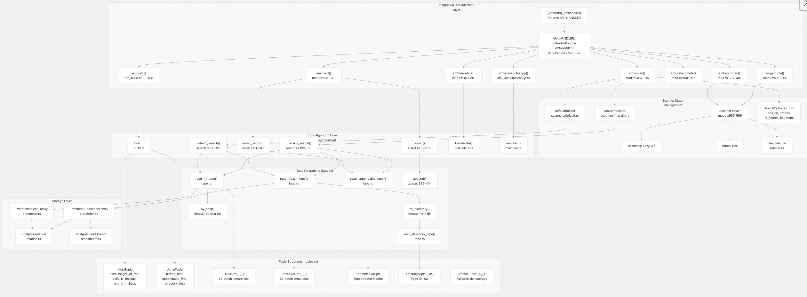
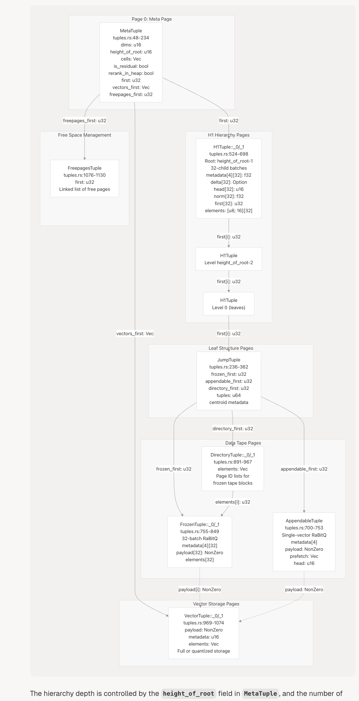
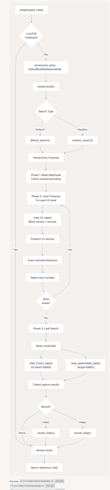
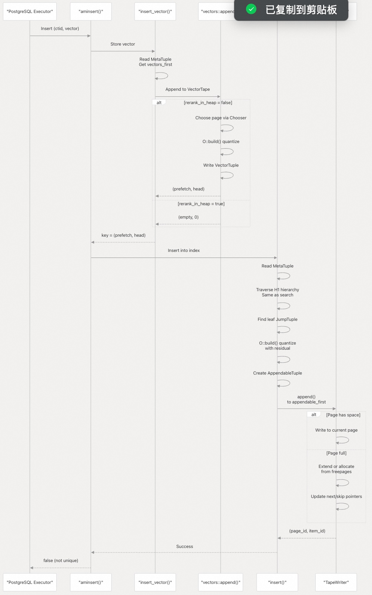
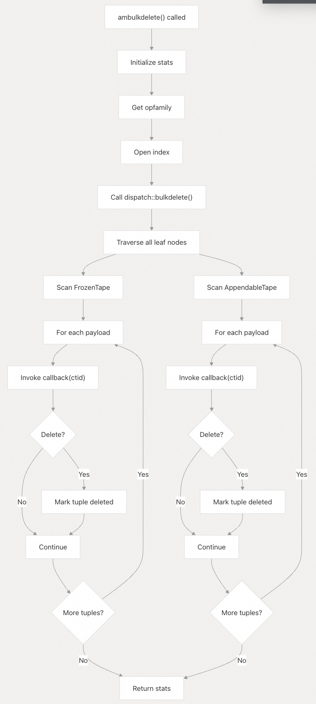
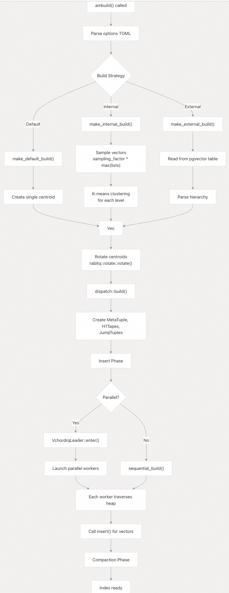
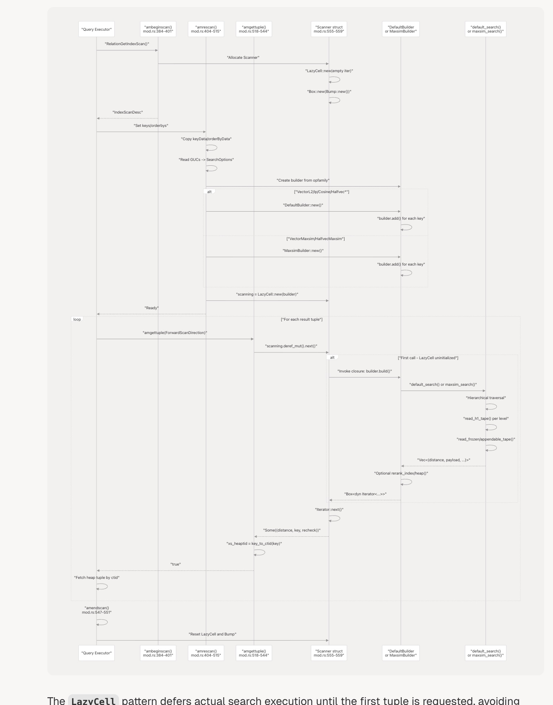
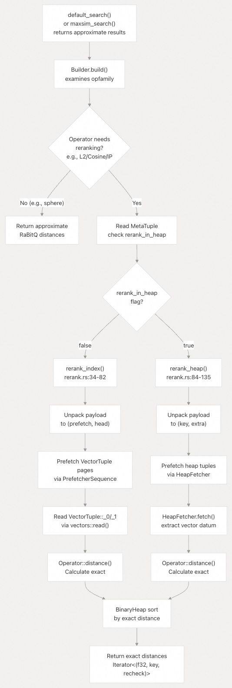
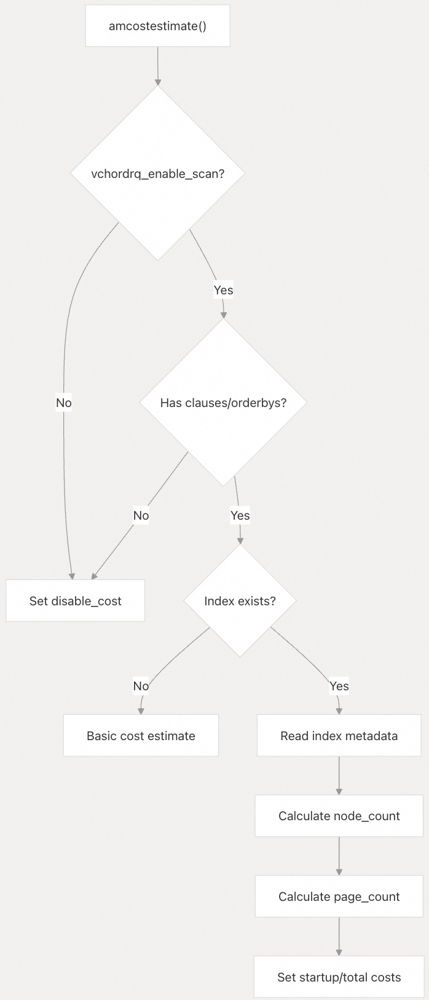

## VectorChord 源码学习: 3.1 vchordrq 索引方法 (Index Method)  
                  
### 作者                  
digoal                  
                  
### 日期                  
2025-10-31                  
                  
### 标签                  
VectorChord , 源码学习                  
                  
----                  
                  
## 背景                  
`vchordrq` 索引方法 (index method) 是 VectorChord 的主要索引访问方法 (index access method)，它实现了分层的倒排文件 (Inverted File, IVF) 结构，并结合了残差和二值量化 (Residual and Binary Quantization, RaBitQ)，以实现高性能的近似向量相似性搜索 (approximate vector similarity search)。该名称代表 "VectorChord RQ"，其中 RQ 指的是所采用的量化技术 (quantization techniques)。  
  
[《AI论文解读 | 向量ANNs方法之 RaBitQ: Quantizing High-Dimensional Vectors with a Theoretical Error Bound for Approximate Nearest Neighbor Search》](../202504/20250427_01.md)    
  
## 关键特性 (Key Features)  
  
* **分层 IVF 结构 (Hierarchical IVF structure)**: 多级树形结构，其深度由 `height_of_root` 和 `cells[]` 数组控制，可进行配置。  
* **RaBitQ 量化 (RaBitQ quantization)**: 通过 4 位码 (4-bit codes) 实现 32 倍内存压缩，且准确性损失极小。  
* **残差编码 (Residual encoding)**: 向量被编码为与质心 (centroids) 之间的残差 (residuals)，并可选择多级量化。  
* **多种构建策略 (Multiple build strategies)**: 默认 (Default, 单一质心. 注: 指root层级质心数. 因为是多层级的.)、内部 (Internal, k-means) 和外部 (External, 预计算) 方法。  
* **并行索引构建 (Parallel index building)**: 采用多工作进程 (Multi-worker) 结构，并通过共享内存进行协调。  
* **灵活的 I/O 策略 (Flexible I/O strategies)**: 通过 `PrefetcherHeapFamily` 和 `PrefetcherSequenceFamily` 可配置预取 (prefetching)。  
* **双重重排序模式 (Dual reranking modes)**: 根据 `rerank_in_heap` 标志，可以选择基于索引 (通过 `VectorTuple`) 或基于堆 (通过 `HeapFetcher`) 的方式。  
* **MaxSim 支持 (MaxSim support)**: 通过 `maxsim_search()` 函数支持多向量相似性查询 (multi-vector similarity queries)。  
  
来源 (Sources):  
- [`src/index/vchordrq/am/mod.rs` 1-585](https://github.com/tensorchord/VectorChord/blob/ac12e257/src/index/vchordrq/am/mod.rs#L1-L585)  
- [`crates/vchordrq/src/search.rs` 1-369](https://github.com/tensorchord/VectorChord/blob/ac12e257/crates/vchordrq/src/search.rs#L1-L369)  
- [`crates/vchordrq/src/insert.rs` 1-200](https://github.com/tensorchord/VectorChord/blob/ac12e257/crates/vchordrq/src/insert.rs#L1-L200)  
  
## 架构概述 (Architecture Overview)  
  
vchordrq 索引方法 (index method) 由多个层组成，它们将 PostgreSQL 的 IndexAmRoutine 接口桥接到核心的 RaBitQ 量化算法。实现代码分为 PostgreSQL 扩展代码 (`src/index/vchordrq/`) 和核心算法包 (crate) (`crates/vchordrq/`) 两部分。  
  
**图表：vchordrq 组件架构和代码实体 (Component Architecture and Code Entities)**  
  
  
  
来源 (Sources):  
- [`src/index/vchordrq/am/mod.rs` 82-133](https://github.com/tensorchord/VectorChord/blob/ac12e257/src/index/vchordrq/am/mod.rs#L82-L133)  
- [`src/index/vchordrq/am/mod.rs` 384-544](https://github.com/tensorchord/VectorChord/blob/ac12e257/src/index/vchordrq/am/mod.rs#L384-L544)  
- [`crates/vchordrq/src/search.rs` 36-368](https://github.com/tensorchord/VectorChord/blob/ac12e257/crates/vchordrq/src/search.rs#L36-L368)  
- [`crates/vchordrq/src/insert.rs` 37-199](https://github.com/tensorchord/VectorChord/blob/ac12e257/crates/vchordrq/src/insert.rs#L37-L199)  
- [`crates/vchordrq/src/tuples.rs` 48-1130](https://github.com/tensorchord/VectorChord/blob/ac12e257/crates/vchordrq/src/tuples.rs#L48-L1130)  
- [`crates/vchordrq/src/tape.rs`](https://github.com/tensorchord/VectorChord/blob/ac12e257/crates/vchordrq/src/tape.rs)  
  
## 索引结构概述 (Index Structure Overview)  
  
vchordrq 索引使用一种基于分层磁带 (hierarchical tape-based) 的结构，它将向量组织成一个多级 IVF 树，并进行 RaBitQ 压缩。该结构存储在由 `PostgresRelation` 管理的 PostgreSQL 页面 (pages) 中。  
  
### 存储层次结构 (Storage Hierarchy)  
  
vchordrq 索引使用存储在 PostgreSQL 页面上的多级磁带结构 (multi-level tape structure)。存储布局由 [crates/vchordrq/src/tuples.rs](https://github.com/tensorchord/VectorChord/blob/ac12e257/crates/vchordrq/src/tuples.rs) 中定义的元组类型 (tuple types) 决定。  
  
**图表：vchordrq 索引存储层次结构和页面布局 (Index Storage Hierarchy with Page Layout)**  
  
  
  
层次结构的深度由 `MetaTuple` 中的 `height_of_root` 字段控制，每个级别的子节点数量存储在 `cells` 数组中。每个级别通过基于 `centroids::read()` 计算的质心距离 (centroid distances) 来选择探针 (probe selection)，从而缩小搜索空间。  
  
来源 (Sources):  
- [`crates/vchordrq/src/tuples.rs` 48-1130](https://github.com/tensorchord/VectorChord/blob/ac12e257/crates/vchordrq/src/tuples.rs#L48-L1130)  
- [`crates/vchordrq/src/search.rs` 51-66](https://github.com/tensorchord/VectorChord/blob/ac12e257/crates/vchordrq/src/search.rs#L51-L66)  
- [`crates/vchordrq/src/tape.rs`](https://github.com/tensorchord/VectorChord/blob/ac12e257/crates/vchordrq/src/tape.rs)  
  
### 元组类型参考 (Tuple Type Reference)  
  
| 元组类型 (Tuple Type) | 变体 (Variants) | 用途 (Purpose) | 关键字段 (Key Fields) | 压缩 (Compression) |  
| :--- | :--- | :--- | :--- | :--- |  
| `MetaTuple` | 1 | 根元数据 (Root metadata) | `dims`, `height_of_root`, `cells`, `is_residual`, `rerank_in_heap` | 无 (None) |  
| `JumpTuple` | 1 | 叶节点指针 (Leaf node pointers) | `frozen_first`, `appendable_first`, `directory_first`, `tuples` | 无 (None) |  
| `H1Tuple` | `_0`, `_1` | 分层质心 (Hierarchical centroids) | `metadata[4][32]`, `delta[32]`, `prefetch`, `head[32]`, `norm[32]`, `first[32]`, `elements` | RaBitQ (32-批次/batch) |  
| `FrozenTuple` | `_0`, `_1` | 不可变向量 (Immutable vectors) | `metadata[4][32]`, `delta[32]`, `payload[32]`, `prefetch`, `head[32]`, `elements` | RaBitQ (32-批次/batch) |  
| `AppendableTuple` | 1 | 最近插入 (Recent inserts) | `metadata[4]`, `delta`, `payload`, `prefetch`, `head`, `elements` | RaBitQ (单一/single) |  
| `DirectoryTuple` | `_0`, `_1` | 页面列表 (Page lists) | `elements` (页面 ID/page IDs) | 无 (None) |  
| `VectorTuple` | `_0`, `_1` | 完整向量 (Full vectors) | `payload`, `metadata`, `elements` | 可选 (Optional) |  
| `CentroidTuple` | `_0`, `_1` | 质心向量 (Centroid vectors) | `metadata`, `elements` | 可选 (Optional) |  
| `FreepagesTuple` | 1 | 自由页面列表 (Free page list) | `first` | 无 (None) |  
  
**元组变体 (Tuple Variants):**  
  
* `_0` 变体包含内联 (inline) 元数据。  
* `_1` 变体通过 `head` 指针引用元数据，以减少冗余 (redundancy)。  
  
来源 (Sources):  
- [`crates/vchordrq/src/tuples.rs` 48-1130](https://github.com/tensorchord/VectorChord/blob/ac12e257/crates/vchordrq/src/tuples.rs#L48-L1130)  
  
### RaBitQ 压缩 (RaBitQ Compression)  
  
vchordrq 索引使用 RaBitQ (残差和二值量化 / Residual and Binary Quantization) 实现 32 倍压缩：  
  
1.  **残差量化 (Residual Quantization)**: 向量被编码为与质心 (centroids) 之间的残差 (residuals)。  
2.  **二值量化 (Binary Quantization)**: 每个维度使用 4 位码 (4-bit codes) (对于 32 个维度，打包成 `[u8; 16]`)。  
3.  **批处理 (Batch Processing)**: 32 个向量一起处理，以提高 SIMD 效率。  
4.  **元数据存储 (Metadata Storage)**: 用于距离边界 (distance bounds) 的每批次元数据 `[f32; 32]` 数组。  
  
量化元数据 (quantization metadata) 包括：  
  
* `dis_u_2`: 距离平方的上限 (Upper bound on distance squared)。  
* `factor_cnt`: 计数校正因子 (Count correction factor)。  
* `factor_ip`: 内积校正因子 (Inner product correction factor)。  
* `factor_err`: 误差边界因子 (Error bound factor)。  
  
来源 (Sources):  
- [`crates/vchordrq/src/tuples.rs` 755-849](https://github.com/tensorchord/VectorChord/blob/ac12e257/crates/vchordrq/src/tuples.rs#L755-L849)  
- [`crates/vchordrq/src/search.rs` 95-99](https://github.com/tensorchord/VectorChord/blob/ac12e257/crates/vchordrq/src/search.rs#L95-L99)  
  
## 搜索算法概述 (Search Algorithm Overview)  
  
vchordrq 搜索算法实现了一个多阶段的分层搜索 (multi-phase hierarchical search)，带有 RaBitQ 距离近似 (distance approximation) 和可选的重排序 (reranking)。  
  
### 搜索入口点 (Search Entry Points)  
  
`vchordrq` 包 (crate) 在 [`crates/vchordrq/src/search.rs`](https://github.com/tensorchord/VectorChord/blob/ac12e257/crates/vchordrq/src/search.rs) 中提供了两个主要的搜索函数：  
  
**`default_search()`**: 标准的近似最近邻搜索 (Standard approximate nearest neighbor search)。  
  
* 接受一个查询向量 (query vector)、每级别的探针数量 (probe counts per level) 和 epsilon 阈值 (epsilon threshold)。  
* 返回一个由 `(distance, payload, prefetch_data)` 元组组成的向量 (vector)，按近似距离 (approximate distance) 排序。  
* 使用 `PrefetcherHeapFamily` 进行 H1 质心预取 (centroid prefetching)，使用 `PrefetcherSequenceFamily` 进行数据元组预取 (data tuple prefetching)。  
* 在每个级别执行 `read_h1_tape()` 的分层遍历 (hierarchical traversal)。  
  
**`maxsim_search()`**: 用于多向量查询的最大相似性搜索 (Maximum similarity search for multi-vector queries)。  
  
* 类似于 `default_search()`，但计算 MaxSim (多向量集合中的最大相似性 / maximum similarity across multi-vector sets)。  
* 接受一个额外的 `threshold` 参数以限制提前终止 (early termination)。  
* 返回元组结果 (tuple results) 和用于阈值估计的 `Distance` 值。  
* 用于 `@#` (MaxSim) 运算符。  
  
两个函数都接受：  
  
* `index: &'b R` - 要搜索的 `PostgresRelation<Opaque>`。  
* `vector` - 运算符特定的借用形式 (borrowed form) 的查询向量。  
* `probes: Vec<u32>` - 每个级别要探测的分区数量 (Number of partitions to probe) (长度 = `height_of_root - 1`)。  
* `epsilon: f32` - 近似边界的误差边界扩展因子 (Error bound expansion factor for approximate bounds) (插入时通常为 1.9，搜索时可配置)。  
* `bump: &'b impl Bump` - 搜索过程中用于临时分配的 Bump 分配器 (Bump allocator)。  
* `prefetch_h1_vectors/prefetch_h0_tuples` - I/O 策略实现 (I/O strategy implementations)。  
  
来源 (Sources):  
- [`crates/vchordrq/src/search.rs` 36-191](https://github.com/tensorchord/VectorChord/blob/ac12e257/crates/vchordrq/src/search.rs#L36-L191)  
- [`crates/vchordrq/src/search.rs` 193-368](https://github.com/tensorchord/VectorChord/blob/ac12e257/crates/vchordrq/src/search.rs#L193-L368)  
  
### 高级搜索流程 (High-Level Search Flow)  
  
**图表：vchordrq 搜索算法流程 (Search Algorithm Flow)**  
  
  
  
来源 (Sources):  
- [`src/index/vchordrq/am/mod.rs` 428-540](https://github.com/tensorchord/VectorChord/blob/ac12e257/src/index/vchordrq/am/mod.rs#L428-L540)  
- [`src/index/vchordrq/am/mod.rs` 542-569](https://github.com/tensorchord/VectorChord/blob/ac12e257/src/index/vchordrq/am/mod.rs#L542-L569)  
- [`src/index/vchordrq/scanners/default.rs` 80-401](https://github.com/tensorchord/VectorChord/blob/ac12e257/src/index/vchordrq/scanners/default.rs#L80-L401)  
  
### 搜索配置 (Search Configuration)  
  
搜索行为由 `SearchOptions` 结构体控制，该结构体在 [`src/index/vchordrq/am/mod.rs` 429-438](https://github.com/tensorchord/VectorChord/blob/ac12e257/src/index/vchordrq/am/mod.rs#L429-L438) 中的 `amrescan()` 中填充：  
  
| 字段（Field） | 类型（Type） | 用途（Purpose） | GUC 参数（GUC Parameter） | 默认值（Default） |  
|---|---|---|---|---|  
| `epsilon` | `f32` | 距离边界扩展因子，用于剪枝 | `vchordrq.epsilon` | 依操作而异 |  
| `probes` | `Vec<u32>` | 每棵树层级要检查的分区数 | `vchordrq.probes` | [1, 1, ...] |  
| `max_scan_tuples` | `Option<NonZero<u32>>` | 扫描元组数上限（超过则停止） | `vchordrq.max_scan_tuples` | 无（不限制） |  
| `maxsim_refine` | `bool` | 启用 MaxSim 精炼阶段 | `vchordrq.maxsim_refine` | true |  
| `maxsim_threshold` | `u32` | MaxSim 阈值估计所需的最小元组数 | `vchordrq.maxsim_threshold` | 1000 |  
| `io_search` | `IoSearch` | H1 层次结构预取策略 | `vchordrq.io_search` | IoSearch::Auto |  
| `io_rerank` | `IoRerank` | 结果元组预取策略 | `vchordrq.io_rerank` | IoRerank::Auto |  
| `prefilter` | `bool` | 启用堆可见性过滤 | `vchordrq.prefilter` | false |  
  
`probes` 数组的长度必须等于 `height_of_root - 1`。每个元素 `probes[i]` 指定在树的第 `height_of_root - 1 - i` 层应跟随多少个子节点。如果探针数量与树结构不匹配，搜索将 panic。  
  
来源:  
- [`src/index/vchordrq/am/mod.rs` 429-438](https://github.com/tensorchord/VectorChord/blob/ac12e257/src/index/vchordrq/am/mod.rs#L429-L438)  
- [`src/index/gucs.rs`](https://github.com/tensorchord/VectorChord/blob/ac12e257/src/index/gucs.rs)  
- [`crates/vchordrq/src/search.rs` 59-66](https://github.com/tensorchord/VectorChord/blob/ac12e257/crates/vchordrq/src/search.rs#L59-L66)  
  
## 插入算法概览  
  
vchordrq 中的向量插入遵循两阶段流程：先存储向量，再将其插入分层索引结构。  
  
### 插入入口点  
  
PostgreSQL 访问方法回调 `aminsert()`（见 [`src/index/vchordrq/am/mod.rs` 第 291–340 行](https://github.com/tensorchord/VectorChord/blob/ac12e257/src/index/vchordrq/am/mod.rs#L291-L340)）协调插入流程：  
- 1、从索引中获取 `Opfamily`  
- 2、通过 `kv_to_pointer()` 将 `(ctid, extra)` 转换为 64 位 `payload`  
- 3、调用 `insert_vector()` 存储全精度或量化后的向量，返回 `(prefetch: Vec<u32>, head: u16)` 键  
- 4、调用 `insert()` 将 RaBitQ 编码后的向量插入 IVF 层次结构  
  
**阶段 1：`insert_vector()`**（[`crates/vchordrq/src/insert.rs` 第 37–67 行](https://github.com/tensorchord/VectorChord/blob/ac12e257/crates/vchordrq/src/insert.rs#L37-L67)）    
- 读取 `MetaTuple` 获取 `vectors_first` 和 `rerank_in_heap` 标志    
- 若 `rerank_in_heap == false`：调用 `vectors::append()` 写入 `VectorTuple`，返回 `(prefetch, head)` 元数据    
- 若 `rerank_in_heap == true`：跳过向量存储，返回 `(empty, 0)`，因为向量将从堆表中获取  
  
**阶段 2：`insert()`**（[`crates/vchordrq/src/insert.rs` 第 69–199 行](https://github.com/tensorchord/VectorChord/blob/ac12e257/crates/vchordrq/src/insert.rs#L69-L199)）    
- 执行与 **搜索 (search)** 相同的**层次遍历 (hierarchical traversal)**，以找到目标**叶分区 (leaf partition)**。  
- 从 **`JumpTuple`** 中读取 **质心 (centroid)** 以计算**残差向量 (residual vector)**。  
- 调用 **`O::build()`** 对向量进行 **RaBitQ 编码 (RaBitQ-encode)**（如果 **`is_residual == true`**，则使用残差）。  
- 创建一个带有编码数据的 **`AppendableTuple`**，并调用 **`tape::append()`** 将数据写入**可追加磁带 (appendable tape)**。  
  
`InsertChooser` 特质允许在多个分区距离相近时进行随机分区选择。  
  
来源:  
- [`src/index/vchordrq/am/mod.rs` 304-340](https://github.com/tensorchord/VectorChord/blob/ac12e257/src/index/vchordrq/am/mod.rs#L304-L340)  
- [`crates/vchordrq/src/insert.rs` 31-199](https://github.com/tensorchord/VectorChord/blob/ac12e257/crates/vchordrq/src/insert.rs#L31-L199)  
- [`crates/vchordrq/src/tape.rs` 329-404](https://github.com/tensorchord/VectorChord/blob/ac12e257/crates/vchordrq/src/tape.rs#L329-L404)  
  
### 插入流程  
  
**图示：vchordrq 插入算法**  
  
  
  
来源:  
- [`src/index/vchordrq/am/mod.rs` 300-336](https://github.com/tensorchord/VectorChord/blob/ac12e257/src/index/vchordrq/am/mod.rs#L300-L336)  
- [`crates/vchordrq/src/insert.rs` 33-195](https://github.com/tensorchord/VectorChord/blob/ac12e257/crates/vchordrq/src/insert.rs#L33-L195)  
- [`crates/vchordrq/src/tape.rs` 329-404](https://github.com/tensorchord/VectorChord/blob/ac12e257/crates/vchordrq/src/tape.rs#L329-L404)  
  
### 向量存储策略  
  
`MetaTuple` 中的 `rerank_in_heap` 字段（见 [`crates/vchordrq/src/tuples.rs` 第 207–208 行](https://github.com/tensorchord/VectorChord/blob/ac12e257/crates/vchordrq/src/tuples.rs)）控制全精度向量的存储位置：  
  
| 策略（Strategy） | `rerank_in_heap` | 向量位置（Vector Location） | 重排序方法（Reranking Method） | Payload 结构 | 使用场景（Use Case） |  
|---|---|---|---|---|---|  
| 索引存储（Index Storage） | `false` | 索引中的 `VectorTuple` 页面 | 通过预取调用 `rerank_index()` | 指向 `VectorTuple` 的 `(prefetch, head)` | 默认 — 重排序更快 |  
| 堆存储（Heap Storage） | `true` | PostgreSQL 堆表 | 通过 `HeapFetcher` 调用 `rerank_heap()` | 指向堆 `ctid` 的 `(key, extra)` | 节省索引空间 |  
  
**索引存储（`rerank_in_heap == false`）时：**    
- `MetaTuple` 中的 `vectors_first: Vec<u32>` 字段指向一个或多个向量磁带头页面    
- `InsertChooser` 将向量分布到多个磁带以减少争用    
- `FrozenTuple` / `AppendableTuple` 中的 `payload` 包含指向 `VectorTuple` 的打包 `(prefetch, head)`    
- `VectorTuple` 页面通常已在缓冲池中  
  
**堆存储（`rerank_in_heap == true`）时：**    
- 不创建 `VectorTuple` 页面    
- `payload` 包含解码为堆 `ctid` 的打包 `(key, extra)`    
- 使用 `HeapFetcher` 通过 `xs_heapfetch` 从堆表中获取元组  
  
来源:  
- [`crates/vchordrq/src/insert.rs` 51-66](https://github.com/tensorchord/VectorChord/blob/ac12e257/crates/vchordrq/src/insert.rs#L51-L66)  
- [`crates/vchordrq/src/tuples.rs` 207-208](https://github.com/tensorchord/VectorChord/blob/ac12e257/crates/vchordrq/src/tuples.rs#L207-L208)  
- [`crates/vchordrq/src/rerank.rs`](https://github.com/tensorchord/VectorChord/blob/ac12e257/crates/vchordrq/src/rerank.rs)  
  
## 维护与生命周期操作  
  
vchordrq 索引实现了 PostgreSQL 的标准索引维护回调。  
  
### 维护回调  
  
| 回调（Callback） | 位置（Location） | 用途（Purpose） | 实现（Implementation） |  
|---|---|---|---|  
| `ambulkdelete()` | `mod.rs:343-381` | 在 VACUUM 期间标记已删除元组 | 调用 `dispatch::bulkdelete()` 遍历磁带并对每个 payload 调用回调 |  
| `amvacuumcleanup()` | `am_vacuumcleanup.rs` | VACUUM 后压缩索引 | 调用 `dispatch::maintain()` 将 AppendableTape 压缩为 FrozenTape 批次 |  
| `ambuildempty()` | `am_build.rs` | 创建空索引结构 | 不支持 — vchordrq 需要初始构建 |  
  
`ambulkdelete()` 函数遍历所有 `FrozenTuple` 和 `AppendableTuple` 条目，解包每个 `payload: NonZero<u64>` 以获取堆 `ctid`，并调用提供的回调函数检查元组可见性。被删除的元组会被标记，但不会立即移除。  
  
#### 批量删除 (`ambulkdelete()`)  
  
`ambulkdelete()` 函数会遍历所有的 **`FrozenTuple`**（已冻结元组）和 **`AppendableTuple`**（可追加元组）条目，执行以下操作：  
  
* **解包 (unpacking)** 每个 **`payload: NonZero<u64>`** 以获取堆 (heap) **`ctid`**（元组标识符）。  
* 调用提供的**回调函数 (callback)** 来检查元组的**可见性 (visibility)**。  
* **被删除的元组会被标记 (marked) 但不会立即移除 (not immediately removed)**。  
  
#### 空间清理 (`amvacuumcleanup()`)  
  
`amvacuumcleanup()` 函数执行**压缩 (compaction)** 操作：  
  
* 从**可追加磁带 (appendable tape)** 中读取所有的 **`AppendableTuple`** 条目。  
* 将它们以 **32 个元素**为一批进行**分组 (groups)**。  
* 将新的 **`FrozenTuple`** 批次写入**已冻结磁带 (frozen tape)**。  
* 使用新的**页面 ID (page IDs)** 更新 **`DirectoryTuple`**（目录元组）。  
* 将**释放的页面 (freed pages)** 回收 (recycles) 到 **freepages 列表 (freepages list)**。  
* 更新 **`JumpTuple`** 的**指针 (pointers)**。  
  
来源:  
- [`src/index/vchordrq/am/mod.rs` 343-381](https://github.com/tensorchord/VectorChord/blob/ac12e257/src/index/vchordrq/am/mod.rs#L343-L381)  
- [`src/index/vchordrq/am/am_vacuumcleanup.rs`](https://github.com/tensorchord/VectorChord/blob/ac12e257/src/index/vchordrq/am/am_vacuumcleanup.rs)  
  
### 批量删除流程  
  
**图示：`ambulkdelete()` 操作**  
  
  
  
回调使用 PostgreSQL 的 MVCC 快照检查元组可见性。被删除的元组会被标记，但不会立即移除。  
  
来源:  
- [`src/index/vchordrq/am/mod.rs` 338-377](https://github.com/tensorchord/VectorChord/blob/ac12e257/src/index/vchordrq/am/mod.rs#L338-L377)  
  
### 压缩益处  
  
`maintain()` **压缩过程 (compaction process)** 带来了以下几个好处：  
  
* **提升搜索性能 (Improved Search Performance):**  
    * 通过 **`FrozenTuple`**（已冻结元组）进行的批处理，使得可以对 **32 个向量**同时执行 **SIMD 操作**（单指令多数据流）。  
    * 相比之下，**`AppendableTuple`**（可追加元组）只能进行单向量处理。  
* **减少 I/O (Reduced I/O):**  
    * 页面读取次数减少，因为 32 个向量被**连续 (contiguously)** 存储在一个 **`FrozenTuple`** 中。  
    * 相比之下，`AppendableTuple` 条目是**分散 (scattered)** 存储的。  
* **更好的预取 (Better Prefetching):**  
    * **`DirectoryTuple`**（目录元组）允许 **`PrefetcherSequenceFamily`** 预取 **整个** 冻结数据块 。  
* **空间回收 (Space Reclamation):**  
    * 从**可追加磁带 (appendable tape)** 释放的页面会被添加到 **freepages 列表**中，以便**重用 (reuse)**。  
  
压缩操作是在 **`VACUUM`** 操作期间触发的，但也可以通过调度层 (dispatch layer) 的 **`maintain()`** 函数**手动调用 (manually invoked)**。  
  
来源:  
- [`src/index/vchordrq/am/am_vacuumcleanup.rs`](https://github.com/tensorchord/VectorChord/blob/ac12e257/src/index/vchordrq/am/am_vacuumcleanup.rs)  
- [`crates/vchordrq/src/tape.rs`](https://github.com/tensorchord/VectorChord/blob/ac12e257/crates/vchordrq/src/tape.rs)  
  
## 构建策略 (Build Strategies)  
  
vchordrq 索引支持三种构建策略 (build strategies) 来创建分层质心结构 (hierarchical centroid structure)。  
  
### 构建策略配置 (Build Strategy Configuration)  
  
构建策略是通过 [`src/index/vchordrq/am/mod.rs` 53-59](https://github.com/tensorchord/VectorChord/blob/ac12e257/src/index/vchordrq/am/mod.rs#L53-L59) 中的 `options` 关系选项 (reloption) 进行配置的，并在 [`src/index/vchordrq/am/am_build.rs` 272-274](https://github.com/tensorchord/VectorChord/blob/ac12e257/src/index/vchordrq/am/am_build.rs#L272-L274) 中进行解析：  
```  
CREATE INDEX ON table USING vchordrq (vector)  
WITH (options = $$  
[build.source.default]  
# or  
[build.source.internal]  
lists = [100, 10]  
sampling_factor = 1000  
# or  
[build.source.external]  
table = "centroids_table"  
$$);  
```  
  
`options` 字符串由 [`src/index/vchordrq/am/am_build.rs` 272-339](https://github.com/tensorchord/VectorChord/blob/ac12e257/src/index/vchordrq/am/am_build.rs#L272-L339) 处的 `make_build()` 函数解析为 TOML 格式，该函数返回一个包含质心层次结构 (centroid hierarchy) 和量化参数的 `BuildImpl` 枚举 (enum)。  
  
来源 (Sources):  
- [`src/index/vchordrq/am/mod.rs` 53-79](https://github.com/tensorchord/VectorChord/blob/ac12e257/src/index/vchordrq/am/mod.rs#L53-L79)  
- [`src/index/vchordrq/am/am_build.rs` 272-339](https://github.com/tensorchord/VectorChord/blob/ac12e257/src/index/vchordrq/am/am_build.rs#L272-L339)  
  
### 策略对比 (Strategy Comparison)  
  
| 策略 (Strategy) | 质心来源 (Centroid Source) | 构建时间 (Build Time) | 质量 (Quality) | 并行度 (Parallelism) | 用例 (Use Case) |  
| :--- | :--- | :--- | :--- | :--- | :--- |  
| **Default (默认)** | 根部单个质心 (Single centroid at root) | 即时 (Instant) | 基线 (Baseline) | 完全并行插入 (Full parallel insert) | 测试，小表 (向量 < 100 万) |  
| **Internal (内部)** | 对水塘采样 (reservoir samples) 进行 K-means | 适中 (进程内/in-process) | 平衡聚类 (Balanced clustering) | 完全并行插入 (Full parallel insert) | 一般用途 (向量 100 万 - 1000 万) |  
| **External (外部)** | 从外部表预训练 (Pre-trained from external table) | 快速 (仅导入/import only) | 最优 (GPU 训练) | 完全并行插入 (Full parallel insert) | 大规模生产 (向量 > 1000 万) |  
  
所有三种策略都通过 `VchordrqLeader` 和 `VchordrqWorker` 基础设施，支持并行索引构建 (PostgreSQL 17+)。  
  
**图表：构建策略流程 (Build Strategy Flow)**  
  
  
  
来源 (Sources):  
- [`src/index/vchordrq/am/am_build.rs` 265-431](https://github.com/tensorchord/VectorChord/blob/ac12e257/src/index/vchordrq/am/am_build.rs#L265-L431)  
  
### 使用 K-means 的内部构建 (Internal Build with K-means)  
  
内部构建策略 (internal build strategy) (位于 [`src/index/vchordrq/am/am_build.rs` 295-334](https://github.com/tensorchord/VectorChord/blob/ac12e257/src/index/vchordrq/am/am_build.rs#L295-L334) 的 `make_internal_build()`) 执行分层 K-means 聚类：  
  
1.  **采样 (Sampling)**: 水塘采样 (Reservoir sampling) 从堆表 (heap table) 中收集最多 `sampling_factor * lists.last()` 个向量。  
2.  **归一化 (Normalization)**: 根据距离度量 (distance metric) 算子的要求，是否对向量进行归一化。  
3.  **分层聚类 (Hierarchical Clustering)**: K-means 在每个级别运行，使用 `lists[i]` 个质心，从最底层开始。  
4.  **父节点分配 (Parent Assignment)**: 级别 `i` 的每个质心都被分配给级别 `i+1` 中最近的父节点。  
5.  **结构创建 (Structure Creation)**: 最终的层次结构被包装在 `Structure::_0` 或 `Structure::_1` 变体中。  
  
`lists` 数组决定了每个级别的树分支因子 (tree branching factor)。例如，`lists = [100, 10]` 创建一个 2 级树，有 100 个第二级分区和 10 个第一级分区，其中 `height_of_root = 3` (元数据层 meta → 第一层 first → 第二层 second → 叶子层 leaves)。  
  
来源 (Sources):  
- [`src/index/vchordrq/am/am_build.rs` 295-334](https://github.com/tensorchord/VectorChord/blob/ac12e257/src/index/vchordrq/am/am_build.rs#L295-L334)  
  
### 使用预计算质心的外部构建 (External Build with Pre-computed Centroids)  
  
外部构建策略 (`make_external_build()`，位于 [`src/index/vchordrq/am/am_build.rs` 336-338](https://github.com/tensorchord/VectorChord/blob/ac12e257/src/index/vchordrq/am/am_build.rs#L336-L338)) 从一个 PostgreSQL 表中加载预计算的质心层次结构 (pre-computed centroid hierarchy)。表的格式由 pgvector 集成决定：  
```  
-- Expected table structure for external centroids  
CREATE TABLE centroids_table (  
    parent_id INTEGER,      -- NULL for root, otherwise parent centroid ID  
    centroid_id INTEGER PRIMARY KEY,  
    centroid vector(dims)   -- Centroid vector  
);  
```  
  
**外部构建过程 (The external build process):**  
  
外部构建过程包括以下步骤：  
* 1、使用 **SPI (Server Programming Interface，服务器编程接口)** 查询指定的表。  
* 2、解析父子关系，以**重建树的层次结构**。  
* 3、验证该层次结构是**完整且平衡**的。  
* 4、将质心包装在 `Structure::_0` 或 `Structure::_1` 变体中。  
  
**这使得以下成为可能 (This enables):**  
* **GPU 加速训练 (GPU-accelerated training)**：通过 Python 脚本在 GPU 集群上使用 **FAISS**（参见 [`train.py`](https://github.com/tensorchord/VectorChord/blob/ac12e257/train.py)）。  
* **可重现构建 (Reproducible builds)**：在开发、预发布和生产环境中拥有**相同的质心**。  
* **自定义层次结构 (Custom hierarchies)**：针对特定数据集特性进行**精细调整的聚类**。  
  
对于**大型数据集（大于 1000 万向量）**，推荐使用外部策略，因为离线的 **GPU 训练**比进程内的 **CPU k-means** 能提供**更好的质心质量**。  
  
来源 (Sources):  
- [`src/index/vchordrq/am/am_build.rs` 336-338](https://github.com/tensorchord/VectorChord/blob/ac12e257/src/index/vchordrq/am/am_build.rs#L336-L338)  
  
## 查询执行 (Query Execution)  
  
**vchordrq** 索引通过 `Scanner` 结构体和处理不同查询类型的 **Builder** 实现，与 PostgreSQL 的查询执行器 (query executor) 进行集成。  
  
### 扫描器架构与生命周期 (Scanner Architecture and Lifecycle)  
  
`Scanner` 结构体在 [`src/index/vchordrq/am/mod.rs` 555-559](https://github.com/tensorchord/VectorChord/blob/ac12e257/src/index/vchordrq/am/mod.rs#L555-L559) 维护扫描状态：  
  
```  
pub struct Scanner {  
    pub hack: Option<NonNull<pgrx::pg_sys::IndexScanState>>,  
    scanning: LazyCell<Iter, Box<dyn FnOnce() -> Iter>>,  
    bump: Box<bumpalo::Bump>,  
}  
```  
  
**扫描器代码**  
  
  
  
`LazyCell` 模式会将实际的搜索执行推迟到请求第一个元组 (tuple) 时才进行，避免扫描提前取消（例如，带有提前退出的 `LIMIT 1`）时浪费工作。  
  
**来源:**  
  
  - [`src/index/vchordrq/am/mod.rs` 384-551](https://github.com/tensorchord/VectorChord/blob/ac12e257/src/index/vchordrq/am/mod.rs#L384-L551)  
  - [`src/index/vchordrq/scanners/default.rs` 36-79](https://github.com/tensorchord/VectorChord/blob/ac12e257/src/index/vchordrq/scanners/default.rs#L36-L79)  
  - [`src/index/vchordrq/scanners/maxsim.rs` 37-67](https://github.com/tensorchord/VectorChord/blob/ac12e257/src/index/vchordrq/scanners/maxsim.rs#L37-L67)  
  
### 查询策略模式 (Query Strategy Patterns)  
  
扫描器 (scanner) 通过检查 **`IndexScanDesc`** 中的 **`numberOfOrderBys`** 和 **`numberOfKeys`** 来检测查询模式，并将请求分派给 [`src/index/vchordrq/am/mod.rs` 467-512](https://github.com/tensorchord/VectorChord/blob/ac12e257/src/index/vchordrq/am/mod.rs#L467-L512) 处的相应 **Builder**：  
  
| SQL 模式 | 操作符族 (Operator Family) | Builder | 搜索函数 (Search Function) | 策略 ID (Strategy ID) |  
|---|---|---|---|---|  
| `ORDER BY vec <-> $1 LIMIT k` | `VectorL2/HalfvecL2` | `DefaultBuilder` | `default_search()` | `OrderBy(L2)` |  
| `ORDER BY vec <#> $1 LIMIT k` | `VectorIp/HalfvecIp` | `DefaultBuilder` | `default_search()` | `OrderBy(IP)` |  
| `ORDER BY vec <=> $1 LIMIT k` | `VectorCosine/HalfvecCosine` | `DefaultBuilder` | `default_search()` | `OrderBy(Cosine)` |  
| `WHERE vec <-> $1 < t` | `VectorL2/HalfvecL2` | `DefaultBuilder` with sphere | `default_search()` | `Where(Sphere)` |  
| `ORDER BY vec @# $1 LIMIT k` | `VectorMaxsim/HalfvecMaxsim` | `MaxsimBuilder` | `maxsim_search()` | `MaxSim` |  
  
[`src/index/vchordrq/opclass.rs`](https://github.com/tensorchord/VectorChord/blob/ac12e257/src/index/vchordrq/opclass.rs) 中的 **Opfamily** 枚举决定了使用哪个 **Builder**。**Builder** 的 **`add()`** 方法会处理每个扫描键 (scan key) 和 **orderby**，提取查询向量 (query vector) 和距离阈值 (distance threshold) 参数。  
  
如果 **`numberOfOrderBys == 0`** 且 **`numberOfKeys == 0`**，扫描器会引发错误：“不支持没有 **WHERE** 子句且没有 **ORDER BY** 子句的向量搜索 (vector search with no WHERE clause and no ORDER BY clause is not supported)” (在 [`src/index/vchordrq/am/mod.rs` 419-423](https://github.com/tensorchord/VectorChord/blob/ac12e257/src/index/vchordrq/am/mod.rs#L419-L423))  
  
**来源:**  
  
  - [`src/index/vchordrq/am/mod.rs` 467-512](https://github.com/tensorchord/VectorChord/blob/ac12e257/src/index/vchordrq/am/mod.rs#L467-L512)  
  - [`src/index/vchordrq/scanners/default.rs` 36-79](https://github.com/tensorchord/VectorChord/blob/ac12e257/src/index/vchordrq/scanners/default.rs#L36-L79)  
  - [`src/index/vchordrq/scanners/maxsim.rs` 37-67](https://github.com/tensorchord/VectorChord/blob/ac12e257/src/index/vchordrq/scanners/maxsim.rs#L37-L67)  
  - [`src/index/vchordrq/opclass.rs`](https://github.com/tensorchord/VectorChord/blob/ac12e257/src/index/vchordrq/opclass.rs)  
  
### 重排序 (Reranking)  
  
在近似的 **RaBitQ** 搜索之后，结果可能会使用精确距离 (exact distances) 进行**重排序 (reranking)**，以提高准确性。重排序由 **Builder** 在调用 **`default_search()`** 或 **`maxsim_search()`** 后执行。  
  
**重排序方法 (Reranking Methods):**  
  
1.  **不重排序 (No Reranking)**：返回近似的 **RaBitQ** 距离（最快，召回率较低）  
2.  **索引重排序 (Index Reranking)**：通过 [`crates/vchordrq/src/rerank.rs` 34-82](https://github.com/tensorchord/VectorChord/blob/ac12e257/crates/vchordrq/src/rerank.rs#L34-L82) 处的 **`rerank_index()`** 从 **`VectorTuple`** 页面重新读取完整向量 (full vectors)  
3.  **堆表重排序 (Heap Reranking)**：通过 [`crates/vchordrq/src/rerank.rs` 84-135](https://github.com/tensorchord/VectorChord/blob/ac12e257/crates/vchordrq/src/rerank.rs#L84-L135) 处的 **`rerank_heap()`** 从堆表 (heap table) 获取完整向量  
  
**重排序决策流程代码**  
  
  
  
索引和堆表重排序之间的选择是在索引构建时，通过 **TOML** 选项中的 **`rerank_in_heap`** 设置确定的。索引重排序通常更快，因为 **`VectorTuple`** 页面是连续的，并受益于预取 (prefetching)，而堆表重排序需要随机的堆访问，但可以节省索引存储空间。  
  
**来源:**  
  
  - [`crates/vchordrq/src/rerank.rs` 34-135](https://github.com/tensorchord/VectorChord/blob/ac12e257/crates/vchordrq/src/rerank.rs#L34-L135)  
  - [`src/index/vchordrq/scanners/default.rs` 218-261](https://github.com/tensorchord/VectorChord/blob/ac12e257/src/index/vchordrq/scanners/default.rs#L218-L261)  
  - [`src/index/vchordrq/scanners/maxsim.rs` 186-251](https://github.com/tensorchord/VectorChord/blob/ac12e257/src/index/vchordrq/scanners/maxsim.rs#L186-L251)  
  
## 成本估算 (Cost Estimation)  
  
**`amcostestimate()`** 函数为 PostgreSQL 查询规划器 (query planner) 提供成本估算 (cost estimates)：  
  
  
  
成本计算考虑了以下因素：  
  
  - 每个级别的探查 (probe) 次数  
  - 索引维度 (Index dimensions) 和向量元素大小 (vector element size)  
  - 基于查询谓词 (query predicates) 的估计选择性 (Estimated selectivity)  
  
**来源:**  
  
  - [`src/index/vchordrq/am/mod.rs` 155-263](https://github.com/tensorchord/VectorChord/blob/ac12e257/src/index/vchordrq/am/mod.rs#L155-L263)  
  
# 附录1: vchordrq 索引中如何将`向量`编码为与质心之间的`残差`  
  
## 残差编码过程  
  
在 vchordrq 中,向量的残差编码发生在插入和构建过程中, 通过 `Operator::build()` 方法实现。    
  
### 核心编码逻辑  
  
当 `is_residual` 为 true 时, 向量会被编码为与质心的残差。以 L2 距离为例:    
  
具体步骤:  
  
1. **计算残差向量**: `residual = vector - centroid`    
  
2. **RaBitQ 编码残差**: 对残差向量调用 `Self::Vector::code()` 生成 4-bit 量化码    
  
3. **计算 delta 校正值**: delta 用于在搜索时补偿残差量化误差    
  
### 插入时的应用  
  
在向量插入时,系统会:    
  
1. 遍历层次树找到目标叶节点  
2. 读取该分区的质心  
3. 调用 `O::build(vector, Some(centroid))` 计算残差编码  
4. 将编码后的数据写入 `AppendableTuple`  
  
### 搜索时的残差处理  
  
搜索时, 系统使用残差信息来计算近似距离:    
  
如果 `is_residual` 为 true, 会先计算到根质心的距离, 然后在每层使用残差调整的距离计算:    
  
## Notes  
  
- 残差量化由 `residual_quantization` 配置项控制    
- 对于单层树(default build), `is_residual` 可能为 false, 此时直接编码原始向量    
- delta 值的计算公式针对不同距离度量(L2/Dot)有所不同    
  
# 附录2: vchordrq 索引方法中质心分层的工作原理, 从数据插入和搜索角度的理解  
  
## 质心分层结构  
  
vchordrq 使用多层树状结构组织质心, 每层包含若干个质心节点, 用于将向量空间递归划分。树的高度由 `height_of_root` 决定, 范围为 1-8 层。   
  
### 层次结构定义  
  
每层由 `Structure` 定义,包含质心向量和子节点索引:    
  
- `centroids`: 该层的所有质心向量  
- `children`: 每个质心的子节点索引列表  
  
构建时, 系统从底层(height=0)到顶层(root)逐层创建:     
  
## 数据插入过程  
  
### 自顶向下遍历  
  
插入时, 系统从根节点开始, 逐层向下找到最佳叶节点:    
  
1. **根节点处理**: 如果 `is_residual` 为 true, 计算查询向量到根(root)质心的距离    
  
2. **逐层下降**: 对于每个中间层(height > 1), 执行 `step` 函数:    
   - 读取当前层的 H1 tape, 获取所有子质心     
   - 使用 RaBitQ 的 `block_access` 计算粗略距离和误差界    
   - 通过堆维护候选节点, 精确计算距离后选择最近的质心    
  
3. **叶节点插入**: 到达叶节点后, 读取该分区的质心并计算残差编码:    
  
循环执行 `height_of_root - 1` 次下降操作.   
  
## 搜索过程  
  
### 多探针搜索  
  
搜索时需要提供 `probes` 参数, 长度必须等于 `height_of_root - 1`: 每个 probe 值指定在该层探索的质心数量。   
  
### 逐层扩展  
  
搜索同样采用自顶向下策略:    
  
1. **初始化**: 从根质心开始,计算查询向量到根的距离    
  
2. **层级扩展**: 对每层执行 `step` 函数:    
   - 对当前层的每个候选质心, 读取其子节点    
   - 使用 RaBitQ 快速估算距离, 维护 top-k 候选    
   - 返回距离最近的 `probes[layer]` 个质心  
  
3. **叶节点扫描**: 最终在选定的叶分区中扫描向量并计算精确距离   
  
## 分层的好处  
  
### 1. 减少距离计算  
  
通过层次化剪枝, 避免计算所有质心的距离。例如, 3 层树结构(每层 100 个质心)只需计算约 300 次距离, 而扁平结构需要 1,000,000 次 (也就是3层共`100^3`个质心)。   
  
### 2. 提高召回率  
  
多探针机制允许在每层探索多个候选分支, 弥补贪心下降可能错过的最优路径。通过调整 `probes` 参数平衡召回率和性能。   
  
### 3. 灵活的构建策略  
  
支持三种构建方式:    
  
- **Default Build**: 单质心, 无分层    
- **Internal Build**: 数据库内 k-means 聚类, 自底向上构建多层   
- **External Build**: 导入预训练的层次结构, 支持 GPU 加速    
  
### 4. 残差量化精度  
  
分层结构天然支持残差量化(`is_residual=true`)。向量相对于其所属分区的质心编码,减小量化误差。    
  
## Notes  
  
- 树必须是高度平衡的(所有叶节点在同一层), 这在 External Build 时会被验证   
- 每层的质心数量存储在 `cells` 数组中   
- H1+ tape 存储中间层节点, H0 层(叶节点)使用 JumpTuple 指向实际向量数据    
- 搜索和插入都使用相同的层次遍历逻辑,但插入只选择单个最优路径,而搜索可以探索多条路径   
    
#### [期望 PostgreSQL|开源PolarDB 增加什么功能?](https://github.com/digoal/blog/issues/76 "269ac3d1c492e938c0191101c7238216")
  
  
#### [PolarDB 开源数据库](https://openpolardb.com/home "57258f76c37864c6e6d23383d05714ea")
  
  
#### [PolarDB 学习图谱](https://www.aliyun.com/database/openpolardb/activity "8642f60e04ed0c814bf9cb9677976bd4")
  
  
#### [PostgreSQL 解决方案集合](../201706/20170601_02.md "40cff096e9ed7122c512b35d8561d9c8")
  
  
#### [德哥 / digoal's Github - 公益是一辈子的事.](https://github.com/digoal/blog/blob/master/README.md "22709685feb7cab07d30f30387f0a9ae")
  
  
#### [About 德哥](https://github.com/digoal/blog/blob/master/me/readme.md "a37735981e7704886ffd590565582dd0")
  
  

  
