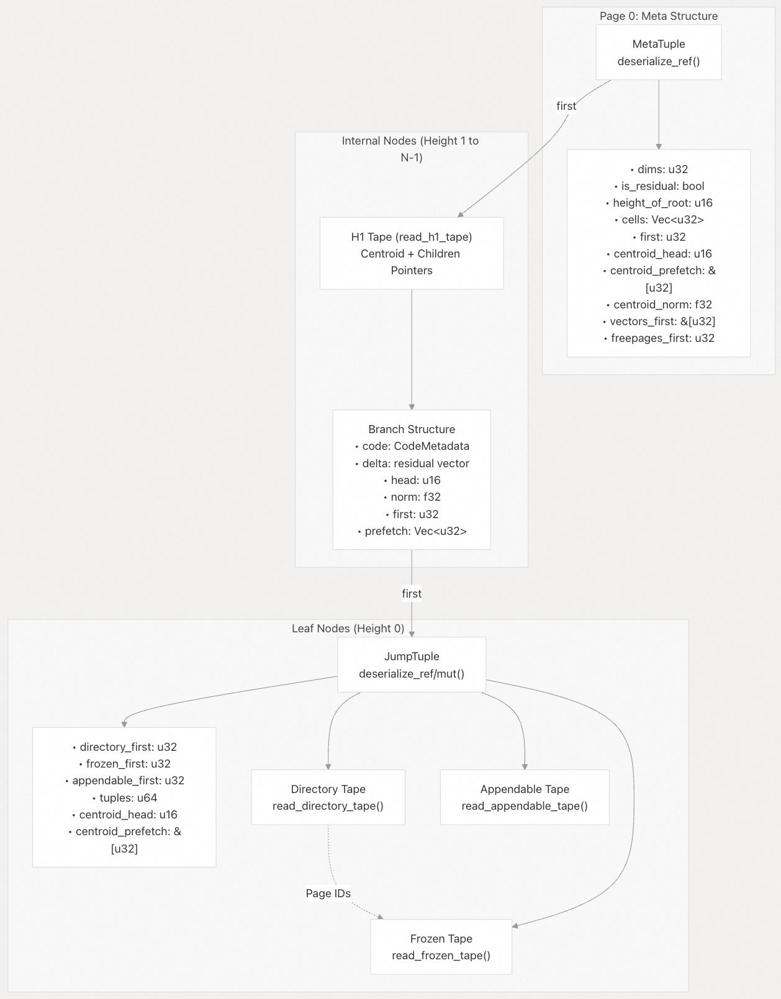
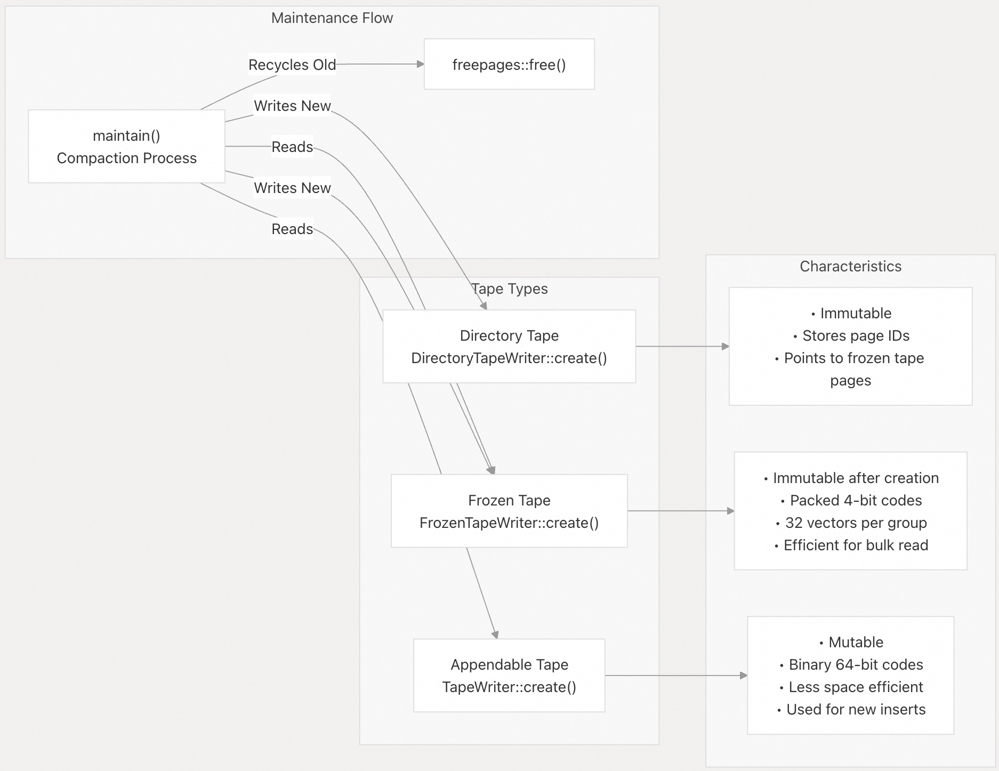
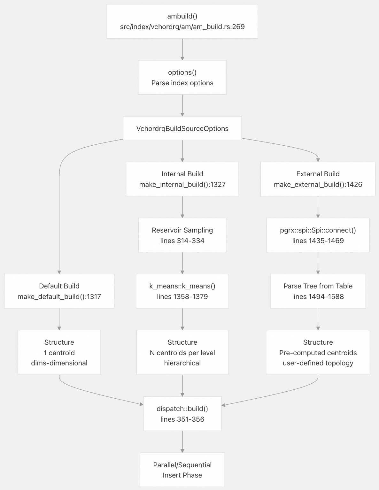
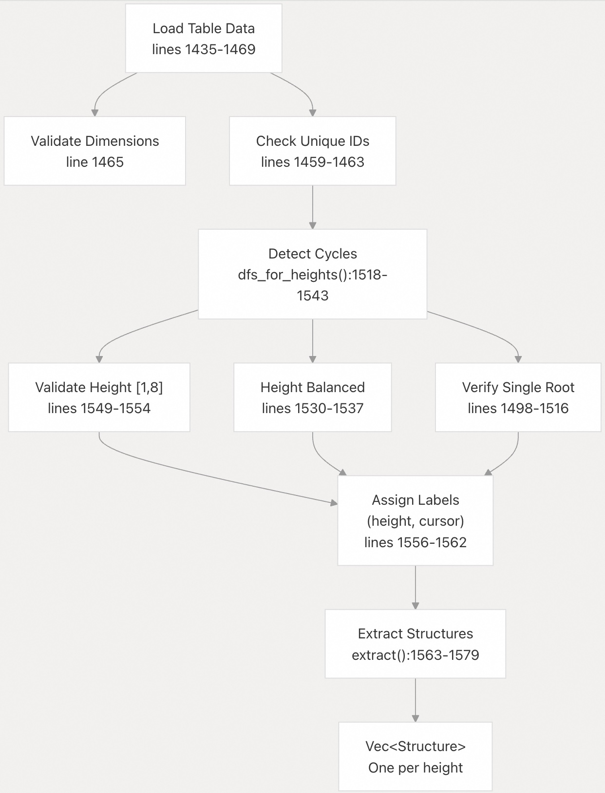
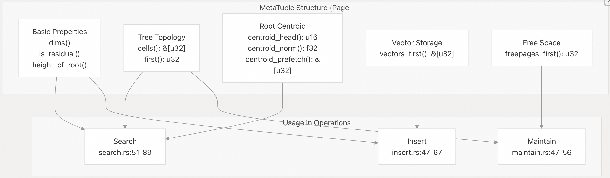
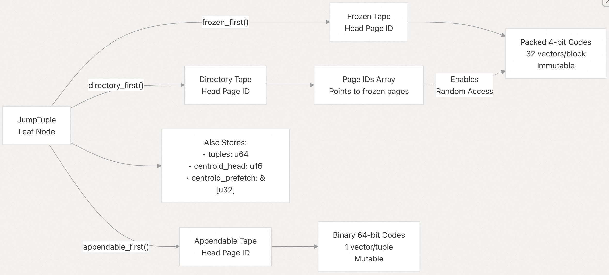
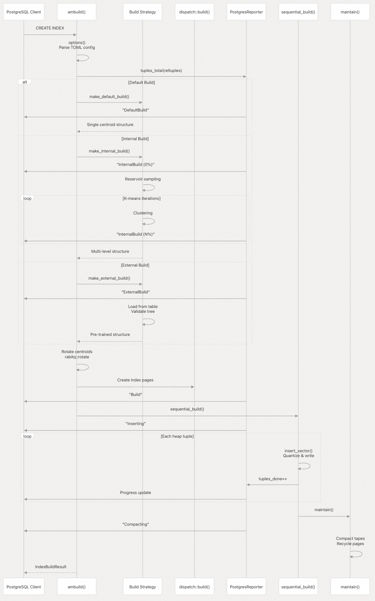
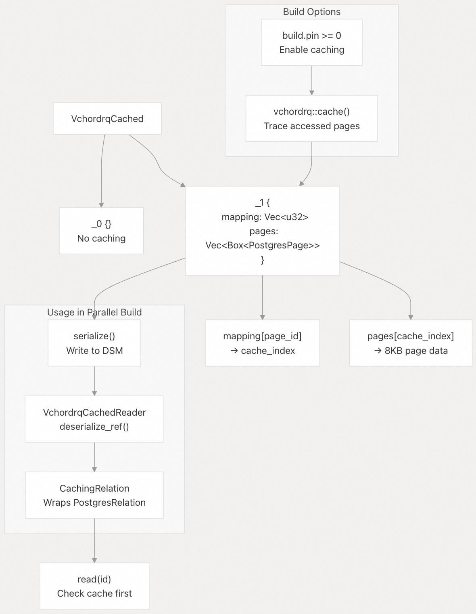

## VectorChord 源码学习: 3.1.1 索引结构和构建策略（Index Structure and Build Strategies）  
                    
### 作者                    
digoal                    
                    
### 日期                    
2025-10-31                    
                    
### 标签                    
VectorChord , 源码学习                    
                    
----                    
                    
## 背景                    
本文介绍 **vchordrq 索引（vchordrq index）的内部结构以及可用于构建它的三种策略。vchordrq 是一种带有残差量化（Residual Quantization, RQ）的倒排文件（Inverted File, IVF）索引，它被组织成一种分层树结构（hierarchical tree structure）**，并配备了专用的 **存储磁带（storage tapes）** 以实现高效的基于磁盘的向量搜索。  
  
## 概览（Overview）  
  
vchordrq 索引使用一种**多层树结构（multi-level tree structure）**，其中：  
  
  * 每个层级都包含将向量空间进行分区的**质心（centroids）**  
  * 向量相对于其分区质心使用 RaBitQ 压缩进行**量化（quantized）**  
  * 数据被组织成三种类型的**磁带（tapes）**：目录磁带（directory）、冻结磁带（frozen）和可追加磁带（appendable）  
  * 该树可以有 1-8 个层级（高度），可在构建时配置  
  
该索引支持三种**构建策略（build strategies）**：  
  
1.  **默认构建（Default Build）**：单个质心，不进行聚类（最快， **召回率（recall）** 最低）  
2.  **内部构建（Internal Build）**：数据库内的 **k-均值聚类（k-means clustering）**（平衡）  
3.  **外部构建（External Build）**：从 GPU 集群导入预训练的质心（最适合大型数据集）  
  
## 索引结构组件（Index Structure Components）  
  
### 分层树组织（Hierarchical Tree Organization）  
  
    
  
**来源**:  
  
  - [`crates/vchordrq/src/tuples.rs`](https://github.com/tensorchord/VectorChord/blob/ac12e257/crates/vchordrq/src/tuples.rs)  
  - [`crates/vchordrq/src/search.rs` 51-57](https://github.com/tensorchord/VectorChord/blob/ac12e257/crates/vchordrq/src/search.rs#L51-L57)  
  - [`crates/vchordrq/src/insert.rs` 47-52](https://github.com/tensorchord/VectorChord/blob/ac12e257/crates/vchordrq/src/insert.rs#L47-L52)  
  
### 元组类型和元数据（Tuple Types and Metadata）  
  
该索引在不同层级使用专门的 **元组（Tuple）** 类型：  
  
| 元组类型（Tuple Type） | 位置（Location） | 用途（Purpose） | 关键字段（Key Fields） |  
| :--- | :--- | :--- | :--- |  
| `MetaTuple`（元数据元组） | Page 0（页 0） | 根元数据（Root metadata） | `dims`, `height_of_root`, `is_residual`, `cells[]` |  
| `JumpTuple`（跳转元组） | 叶节点（Leaf nodes） | 指向数据磁带的指针（Pointers to data tapes） | `directory_first`, `frozen_first`, `appendable_first` |  
| `AppendableTuple`（可追加元组） | 可追加磁带（Appendable tapes） | 单个向量（Individual vectors） | `metadata[4]`, `elements[]`, `delta[]`, `payload` |  
| Branch（内部） | H1+ 磁带（H1+ tapes） | 内部树节点（Internal tree nodes） | `code`, `delta`, `norm`, `first`, `prefetch[]` |  
  
**来源**:  
  
  - [`crates/vchordrq/src/tuples.rs`](https://github.com/tensorchord/VectorChord/blob/ac12e257/crates/vchordrq/src/tuples.rs)  
  - [`crates/vchordrq/src/search.rs` 155-162](https://github.com/tensorchord/VectorChord/blob/ac12e257/crates/vchordrq/src/search.rs#L155-L162)  
  - [`crates/vchordrq/src/maintain.rs` 93-95](https://github.com/tensorchord/VectorChord/blob/ac12e257/crates/vchordrq/src/maintain.rs#L93-L95)  
  
### 磁带存储系统（Tape Storage System）  
  
    
  
**来源**:  
  
  - [`crates/vchordrq/src/tape_writer.rs`](https://github.com/tensorchord/VectorChord/blob/ac12e257/crates/vchordrq/src/tape_writer.rs)  
  - [`crates/vchordrq/src/maintain.rs` 121-236](https://github.com/tensorchord/VectorChord/blob/ac12e257/crates/vchordrq/src/maintain.rs#L121-L236)  
  - [`crates/vchordrq/src/tape.rs`](https://github.com/tensorchord/VectorChord/blob/ac12e257/crates/vchordrq/src/tape.rs)  
  
## 构建策略（Build Strategies）  
  
### 策略选择与分派（Strategy Selection and Dispatch）  
  
   
  
**来源**:  
  
  - [`src/index/vchordrq/am/am_build.rs` 295-344](https://github.com/tensorchord/VectorChord/blob/ac12e257/src/index/vchordrq/am/am_build.rs#L295-L344)  
  - [`src/index/vchordrq/am/am_build.rs` 1317-1589](https://github.com/tensorchord/VectorChord/blob/ac12e257/src/index/vchordrq/am/am_build.rs#L1317-L1589)  
  
### 1\. 默认构建策略（Default Build Strategy）  
  
这是最简单的策略，它在原点创建一个单个**质心（centroid）**。  
  
**使用时机**：  
  
  * 快速原型设计  
  * 小型数据集（\<10k 向量）  
  * 当 **召回率（recall）** 要求不高时  
  
**实现**：  
  
```  
Structure {  
    centroids: vec![vec![0.0; dims]],  
    children: vec![vec![]]  
}  
```  
  
**构建阶段（Build Phase）**：`BuildPhaseCode::DefaultBuild`  
  
所有向量都被分配到一个分区，并相对于一个零向量或计算出的质心执行**残差量化（residual quantization）**。  
  
**来源**:  
  
  - [`src/index/vchordrq/am/am_build.rs` 1317-1325](https://github.com/tensorchord/VectorChord/blob/ac12e257/src/index/vchordrq/am/am_build.rs#L1317-L1325)  
  
### 2\. 内部构建策略（Internal Build Strategy）  
  
使用 **水塘抽样（Reservoir Sampling）** 直接在 PostgreSQL 内部执行 **k-均值聚类（k-means clustering）**。  
  
**配置参数**（在 `VchordrqInternalBuildOptions` 中）：  
  
| 参数（Parameter） | 类型（Type） | 描述（Description） |  
| :--- | :--- | :--- |  
| `lists` | `Vec<u32>` | 每层簇的数量（自底向上） |  
| `sampling_factor` | `u32` | 水塘大小的乘数（默认：50） |  
| `kmeans_iterations` | `u32` | K-均值迭代次数（默认：10） |  
| `spherical_centroids` | `bool` | 将质心归一化（Normalize）到单位球体 |  
| `build_threads` | `u32` | K-均值的并行线程数 |  
  
**构建过程**：  
  
1.  **水塘抽样（Reservoir Sampling）**：收集 `lists[last] * sampling_factor` 个样本  
2.  **自底向上聚类（Bottom-up Clustering）**：将向量聚类到第一层，然后递归地对质心进行聚类  
3.  **进度报告（Progress Reporting）**：102 个阶段（第一层占 0-100%，然后是后续层级）  
  
**进度跟踪（Progress Tracking）**：  
  
```  
BuildPhase(BuildPhaseCode::InternalBuild, k)  
其中 k ∈ [0, 101]  
```  
  
阶段跟踪通过 PostgreSQL 的进度报告系统提供详细的进度更新。  
  
**来源**:  
  
  - [`src/index/vchordrq/am/am_build.rs` 300-339](https://github.com/tensorchord/VectorChord/blob/ac12e257/src/index/vchordrq/am/am_build.rs#L300-L339)  
  - [`src/index/vchordrq/am/am_build.rs` 1327-1423](https://github.com/tensorchord/VectorChord/blob/ac12e257/src/index/vchordrq/am/am_build.rs#L1327-L1423)  
  - [`src/index/vchordrq/am/am_build.rs` 1358-1379](https://github.com/tensorchord/VectorChord/blob/ac12e257/src/index/vchordrq/am/am_build.rs#L1358-L1379)  
  
### 3\. 外部构建策略（External Build Strategy）  
  
从 PostgreSQL 表导入预训练的**质心（centroids）**，从而能够在大型数据集上进行 **GPU 加速训练（GPU-accelerated training）**。  
  
**表模式（Table Schema）**：  
```  
CREATE TABLE centroids (  
    id INTEGER PRIMARY KEY,  
    parent INTEGER REFERENCES centroids(id),  
    vector vector(dims)  
);  
```  
  
| 列（Column） | 类型（Type） | 描述（Description） |  
| :--- | :--- | :--- |  
| `id` | `bigint` | 簇 ID（从 0 开始） |  
| `parent` | `bigint` | 父簇 ID（根节点为 NULL） |  
| `vector` | `vector` | 质心向量 |  
  
**树构建规则（Tree Construction Rules）**：  
  
  * 有且只有一个根节点（其中 `parent` 为 `NULL`）  
  * 所有节点必须形成一个**连通树（connected tree）**  
  * 所有叶节点必须位于相同的高度（**高度平衡（height-balanced）**）  
  * 高度必须在 [1, 8] 范围内  
  
**特殊情况处理（Special Case Handling）**：  
  
如果所有 `parent` 值均为 `NULL` 且行数 ≥2，则通过平均所有向量（不进行归一化）创建一个**隐式根（implicit root）**。  
  
**执行的验证（Validation Performed）**：  
  
   
  
**来源**:  
  
  - [`src/index/vchordrq/am/am_build.rs` 1426-1589](https://github.com/tensorchord/VectorChord/blob/ac12e257/src/index/vchordrq/am/am_build.rs#L1426-L1589)  
  - [`src/index/vchordrq/am/am_build.rs` 1518-1543](https://github.com/tensorchord/VectorChord/blob/ac12e257/src/index/vchordrq/am/am_build.rs#L1518-L1543)  
  - [`src/index/vchordrq/am/am_build.rs` 1563-1579](https://github.com/tensorchord/VectorChord/blob/ac12e257/src/index/vchordrq/am/am_build.rs#L1563-L1579)  
  
## 结构和归一化（Structure and Normalization）  
  
### 结构类型（The Structure Type）  
  
所有三种构建策略都会生成一个 `Vec<Structure<Normalized>>`：  
```  
struct Structure<N> {  
    centroids: Vec<N>,        // Cluster centers at this level  
    children: Vec<Vec<u32>>   // Child indices for each centroid  
}  
  
type Normalized = Vec<f32>;   // Normalized to unit sphere after rotation  
```  
  
**后处理（Post-Processing）**：  
  
结构创建后，所有 **质心（centroids）** 都会经历 **RaBitQ 旋转（RaBitQ rotation）**（第 346-348 行）：  
  
```  
for centroid in structure.centroids.iter_mut() {  
    *centroid = rabitq::rotate::rotate(centroid);  
}  
```  
  
此旋转(rotation)对于在搜索和插入过程中使用的 **RaBitQ 量化方案（RaBitQ quantization scheme）** 至关重要。  
  
**来源**:  
  
  - [`src/index/vchordrq/am/am_build.rs` 345-349](https://github.com/tensorchord/VectorChord/blob/ac12e257/src/index/vchordrq/am/am_build.rs#L345-L349)  
  - [`src/index/vchordrq/types.rs`](https://github.com/tensorchord/VectorChord/blob/ac12e257/src/index/vchordrq/types.rs)  
  - [`src/index/vchordrq/build.rs`](https://github.com/tensorchord/VectorChord/blob/ac12e257/src/index/vchordrq/build.rs)  
  
## 索引元数据组织（Index Metadata Organization）  
  
### MetaTuple 字段和访问（MetaTuple Fields and Access）  
  
   
  
**关键字段语义（Key Field Semantics）**：  
  
  * `dims()`：**向量维度（Vector dimensionality）**，必须与被索引的列匹配  
  * `is_residual()`：量化是否使用**残差向量（residual vectors）**（对于多级树总是为 `true`）  
  * `height_of_root()`：树的高度，决定所需的探测参数数量  
  * `cells()`：大小为 `height_of_root` 的数组，存储每层的节点数量  
  * `first()`：根 H1 磁带的**页面 ID（Page ID）**  
  * `centroid_head()`：质心存储页面内的偏移量  
  * `centroid_prefetch()`：用于根质心访问的预取**页面 ID（Page IDs）**  
  * `vectors_first()`：用于向量存储分区（用于插入路由）的页面 ID 数组  
  * `freepages_first()`： **自由空间链表（freespace linked list）** 的头部  
  
**来源**:  
  
  - [`crates/vchordrq/src/tuples.rs`](https://github.com/tensorchord/VectorChord/blob/ac12e257/crates/vchordrq/src/tuples.rs)  
  - [`crates/vchordrq/src/search.rs` 51-89](https://github.com/tensorchord/VectorChord/blob/ac12e257/crates/vchordrq/src/search.rs#L51-L89)  
  - [`crates/vchordrq/src/insert.rs` 47-67](https://github.com/tensorchord/VectorChord/blob/ac12e257/crates/vchordrq/src/insert.rs#L47-L67)  
  
### JumpTuple 字段和磁带组织（JumpTuple Fields and Tape Organization）  
  
每个叶节点都包含一个 **JumpTuple（跳转元组）**，指向三种磁带结构：  
  
   
  
| 磁带（Tape） | 指针字段（Pointer Field） | 用途（Purpose） |  
| :--- | :--- | :--- |  
| **目录磁带（Directory Tape）** | `directory_first` | 用于 **随机访问（Random access）** 冻结磁带的页面 ID 数组 |  
| **冻结磁带（Frozen Tape）** | `frozen_first` | 不可变向量的主要存储（向量数据） |  
| **可追加磁带（Appendable Tape）** | `appendable_first` | 用于新插入的、可变向量的存储（WAL） |  
  
**目录磁带的用途（Directory Tape Purpose）**：  
  
目录磁带存储了一个指向 **冻结磁带（frozen tape）** 页面的 **页面 ID（Page IDs）** 数组。这使得以下操作成为可能：  
  
  * 对冻结数据进行**随机访问（Random access）**（当 `prefetch_h0_tuples.is_not_plain()` 返回 `true` 时使用）  
  * 基于搜索启发式的高效特定页面预取  
  * 更好的 SSD 存储 I/O 模式  
  
如果没有目录磁带，冻结数据将通过使用 `by_next()` 的链表 **顺序遍历（sequential traversal）** 进行访问。  
  
**来源**:  
  
  - [`crates/vchordrq/src/tuples.rs`](https://github.com/tensorchord/VectorChord/blob/ac12e257/crates/vchordrq/src/tuples.rs)  
  - [`crates/vchordrq/src/search.rs` 169-183](https://github.com/tensorchord/VectorChord/blob/ac12e257/crates/vchordrq/src/search.rs#L169-L183)  
  - [`crates/vchordrq/src/maintain.rs` 229-236](https://github.com/tensorchord/VectorChord/blob/ac12e257/crates/vchordrq/src/maintain.rs#L229-L236)  
  
## 构建阶段流程（Build Phase Progression）  
  
### 顺序构建流程（Sequential Build Flow）  
  
   
  
| 阶段代码（Phase Code） | 描述（Description） |  
| :--- | :--- |  
| `InternalBuild` | 执行 k-均值聚类（如果使用内部策略） |  
| `ExternalBuild` | 验证/加载质心（如果使用外部策略） |  
| `StructureFinalize` | 应用 RaBitQ 旋转 |  
| `InitialMapping` | 创建映射数组以实现快速页面访问 |  
| `VectorInsert` | 将所有向量插入到索引中，并分配到分区 |  
| `FlushDirty` | 将所有修改过的页面写入磁盘 |  
| `MaintainTapes` | 压缩/冻结可追加磁带 |  
| `IndexFinalize` | 写入根 `MetaTuple` |  
  
**来源**:  
  
  - [`src/index/vchordrq/am/am_build.rs` 268-525](https://github.com/tensorchord/VectorChord/blob/ac12e257/src/index/vchordrq/am/am_build.rs#L268-L525)  
  - [`src/index/vchordrq/am/am_build.rs` 1149-1252](https://github.com/tensorchord/VectorChord/blob/ac12e257/src/index/vchordrq/am/am_build.rs#L1149-L1252)  
  
### 并行构建协调（Parallel Build Coordination）  
  
对于**并行构建（parallel builds）**，系统在三个关键点使用**屏障同步（barrier synchronization）**：  
  
1.  **屏障 0（Barrier 0）**：所有工作进程附加后，插入开始前  
      * 主导者计算工作进程数量（`nparticipants`）  
      * 每个工作进程获得一个用于分区分配的 `order`  
2.  **屏障 1（Barrier 1）**：插入完成后，维护开始前  
      * 同步 `indtuples` 计数  
      * 转换到压缩阶段  
3.  **屏障 2（Barrier 2）**：维护完成后  
      * 确保所有工作进程完成清理  
  
**分区分配（Partition Assignment）**：  
  
每个工作进程使用其分配的 `order` 的 `IdChooser`：  
  
```  
struct IdChooser(u32);  // order from barrier 0  
  
impl InsertChooser for IdChooser {  
    fn choose(&mut self, n: NonZero<usize>) -> usize {  
        self.0 as usize % n.get()  
    }  
}  
```  
  
在维护期间，工作通过 `ChooseSome` 进行分配：  
  
```  
struct ChooseSome { n: usize, k: usize }  
  
impl MaintainChooser for ChooseSome {  
    fn choose(&mut self, i: usize) -> bool {  
        i % self.n == self.k  
    }  
}  
```  
  
这确保了每个工作进程处理叶节点的一个**不相交子集（disjoint subset）**。  
  
**来源**:  
  
  - [`src/index/vchordrq/am/am_build.rs` 1017-1147](https://github.com/tensorchord/VectorChord/blob/ac12e257/src/index/vchordrq/am/am_build.rs#L1017-L1147)  
  - [`src/index/vchordrq/am/am_build.rs` 1048-1063](https://github.com/tensorchord/VectorChord/blob/ac12e257/src/index/vchordrq/am/am_build.rs#L1048-L1063)  
  - [`src/index/vchordrq/am/am_build.rs` 398-468](https://github.com/tensorchord/VectorChord/blob/ac12e257/src/index/vchordrq/am/am_build.rs#L398-L468)  
  
## 缓存的索引页面（Cached Index Pages）  
  
为了提高构建性能，系统支持在 **共享内存（shared memory）** 中缓存频繁访问的索引页面。  
  
### VchordrqCached 结构（VchordrqCached Structure）  
  
   
  
**缓存策略（Caching Strategy）**：  
  
1.  初始索引结构构建后，调用 `vchordrq::cache(&index, pin)` 在模拟搜索期间跟踪页面访问  
2.  对访问的 **页面 ID（page IDs）** 进行排序和去重  
3.  创建映射数组：`mapping[page_id] = cache_index` 或 `u32::MAX`  
4.  将访问的页面克隆到 `Vec<Box<PostgresPage>>` 中  
5.  序列化到 **共享内存（shared memory）** 中供工作进程使用  
  
在并行插入期间，工作进程使用 `CachingRelation`，它在从磁盘读取之前会检查缓存。  
  
**来源**:  
  
  - [`src/index/vchordrq/am/am_build.rs` 357-375](https://github.com/tensorchord/VectorChord/blob/ac12e257/src/index/vchordrq/am/am_build.rs#L357-L375)  
  - [`src/index/vchordrq/am/am_build.rs` 553-683](https://github.com/tensorchord/VectorChord/blob/ac12e257/src/index/vchordrq/am/am_build.rs#L553-L683)  
  - [`src/index/vchordrq/am/am_build.rs` 1591-1676](https://github.com/tensorchord/VectorChord/blob/ac12e257/src/index/vchordrq/am/am_build.rs#L1591-L1676)  
  
## 存储布局摘要（Storage Layout Summary）  
  
| 组件（Component） | 页面组织（Page Organization） | 可变性（Mutability） | 访问模式（Access Pattern） |  
| :--- | :--- | :--- | :--- |  
| MetaTuple | Page 0, offset 1（页 0，偏移量 1） | 构建后不可变（Immutable after build） | 每次搜索/插入时读取（Read on every search/insert） |  
| H1+ Tapes | 通过 `first` 链接的页面（Linked pages via `first`） | 构建后不可变（Immutable after build） | **顺序遍历（Sequential traversal）** |  
| JumpTuple | 每个叶分区一个 | 可变（更新磁带指针）（Mutable (updates tape pointers)） | 叶节点访问时读取 |  
| Directory Tape | 链接的页面（Linked pages） | 在维护期间增长（Grows during maintenance） | **顺序写入，随机读取（Sequential write, random read）** |  
| Frozen Tape | 链接的页面（Linked pages） | 写入后不可变（Immutable after write） | 通过目录进行**随机访问（Random access via directory）** |  
| Appendable Tape | 链接的页面（Linked pages） | 仅追加（Append-only） | **顺序追加和扫描（Sequential append and scan）** |  
| Freepages List | 通过不透明数据链接（Linked via opaque data） | 可变（Mutable） | 栈式（后进先出 LIFO） |  
  
**来源**:  
  
  - [`crates/vchordrq/src/tuples.rs`](https://github.com/tensorchord/VectorChord/blob/ac12e257/crates/vchordrq/src/tuples.rs)  
  - [`crates/vchordrq/src/tape.rs`](https://github.com/tensorchord/VectorChord/blob/ac12e257/crates/vchordrq/src/tape.rs)  
  - [`crates/vchordrq/src/freepages.rs`](https://github.com/tensorchord/VectorChord/blob/ac12e257/crates/vchordrq/src/freepages.rs)  
      
#### [期望 PostgreSQL|开源PolarDB 增加什么功能?](https://github.com/digoal/blog/issues/76 "269ac3d1c492e938c0191101c7238216")
  
  
#### [PolarDB 开源数据库](https://openpolardb.com/home "57258f76c37864c6e6d23383d05714ea")
  
  
#### [PolarDB 学习图谱](https://www.aliyun.com/database/openpolardb/activity "8642f60e04ed0c814bf9cb9677976bd4")
  
  
#### [PostgreSQL 解决方案集合](../201706/20170601_02.md "40cff096e9ed7122c512b35d8561d9c8")
  
  
#### [德哥 / digoal's Github - 公益是一辈子的事.](https://github.com/digoal/blog/blob/master/README.md "22709685feb7cab07d30f30387f0a9ae")
  
  
#### [About 德哥](https://github.com/digoal/blog/blob/master/me/readme.md "a37735981e7704886ffd590565582dd0")
  
  

  
