## VectorChord 源码学习: 3.1.2 搜索管线与重排序（Reranking）  
                      
### 作者                      
digoal                      
                      
### 日期                      
2025-10-31                      
                      
### 标签                      
VectorChord , 源码学习                      
                      
----                      
                      
## 背景                      
本文介绍 `vchordrq` 的搜索管线（Search Pipeline），涵盖了查询向量（Query Vectors）如何通过**分层遍历（Hierarchical Traversal）**、**候选集收集（Candidate Collection）和重排序（Reranking）来处理，以生成最终结果。搜索管线是 `vchordrq` 索引的核心读取路径，它将 SQL 的 `ORDER BY <->` 查询转换为高效的近似最近邻（ANN）搜索**，并带有**精确距离优化（Exact Distance Refinement）**。  
  
## 概述（Overview）  
  
`vchordrq` 搜索管线实现了带有精确重排序（Exact Reranking）的多阶段**近似最近邻（ANN）搜索**。该管线由 PostgreSQL 的 `amgettuple` 回调函数启动，并以迭代器（Iterator）的形式返回结果。  
  
### 搜索管线架构（Search Pipeline Architecture）  
  
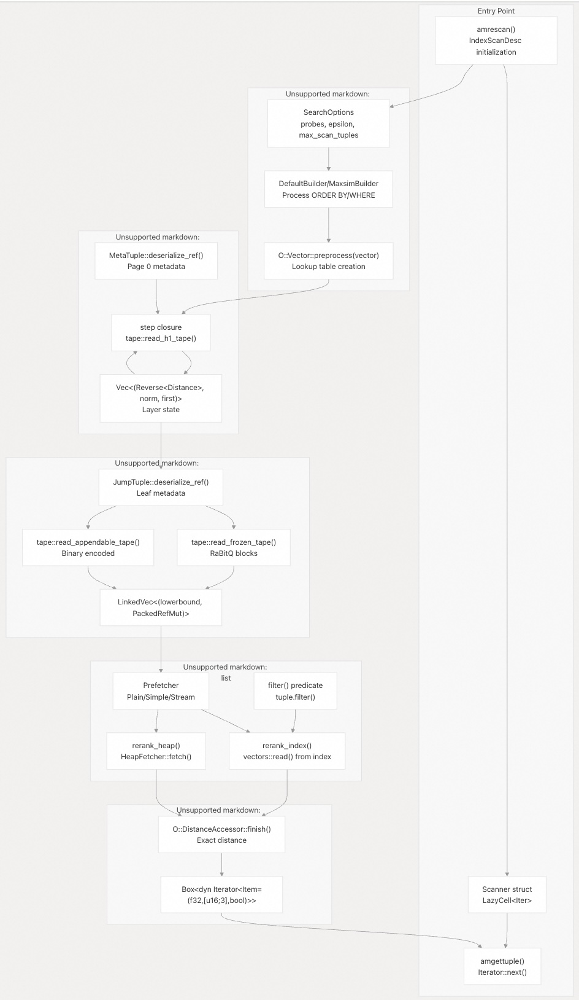  
  
**来源**:  
  
  - [`src/index/vchordrq/am/mod.rs` 404-515](https://github.com/tensorchord/VectorChord/blob/ac12e257/src/index/vchordrq/am/mod.rs#L404-L515)  
  - [`crates/vchordrq/src/search.rs` 36-191](https://github.com/tensorchord/VectorChord/blob/ac12e257/crates/vchordrq/src/search.rs#L36-L191)  
  - [`src/index/vchordrq/scanners/default.rs` 80-262][https://github.com/tensorchord/VectorChord/blob/ac12e257/src/index/vchordrq/scanners/default.rs#L80-L262)  
  
## 搜索入口点（Search Entry Points）  
  
### PostgreSQL 集成  
  
搜索管线由 PostgreSQL 的索引访问方法回调函数触发：  
  
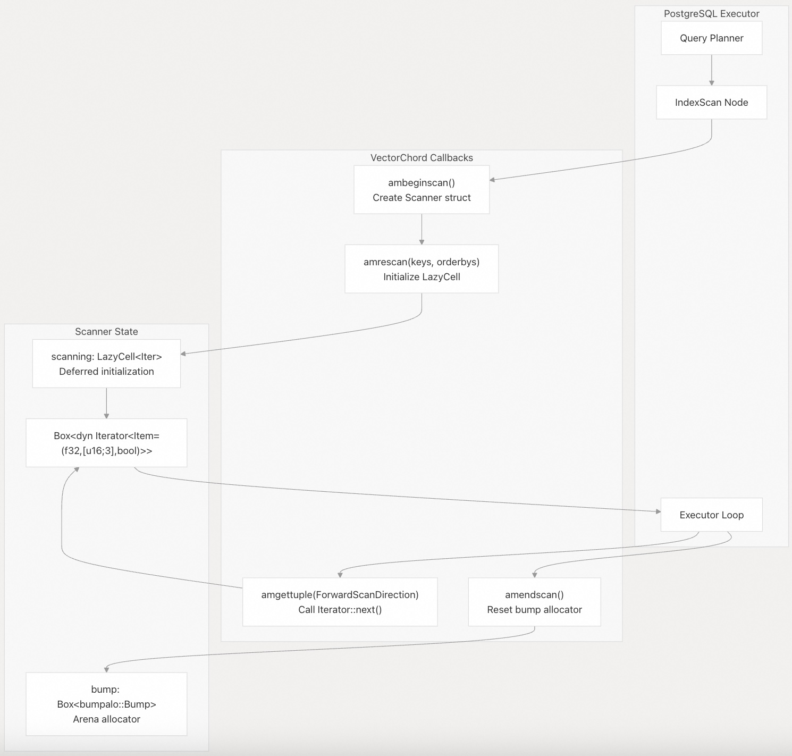  
  
`Scanner` 结构体定义于 [`src/index/vchordrq/am/mod.rs` 555-559](https://github.com/tensorchord/VectorChord/blob/ac12e257/src/index/vchordrq/am/mod.rs#L555-L559)，并包含：  
  
  * `hack`：索引扫描状态的可选指针  
  * `scanning`：包含搜索迭代器（在首次访问时初始化）的**惰性单元（LazyCell）**  
  * `bump`：用于临时搜索分配的**碰撞分配器（Bump allocator）**  
  
**来源**:  
  
  - [`src/index/vchordrq/am/mod.rs` 384-551](https://github.com/tensorchord/VectorChord/blob/ac12e257/src/index/vchordrq/am/mod.rs#L384-L551)  
  
### 核心搜索函数（Core Search Functions）  
  
`vchordrq` **包（Crate）** 提供了两个主要的搜索函数，都位于 [`crates/vchordrq/src/search.rs`](https://github.com/tensorchord/VectorChord/blob/ac12e257/crates/vchordrq/src/search.rs) 中：  
  
| 函数 | 目的 | 返回类型 | 关键参数 |  
| :--- | :--- | :--- | :--- |  
| `default_search` | 标准相似性搜索（Standard Similarity Search） | `Vec<((Reverse<Distance>, AlwaysEqual<()>), AlwaysEqual<PackedRefMut4<...>>)>` | `probes`, `epsilon` |  
| `maxsim_search` | 多向量 MaxSim 查询 | `(Vec<((Reverse<Distance>, AlwaysEqual<Distance>), AlwaysEqual<PackedRefMut8<...>>)>, Distance)` | `probes`, `epsilon`, `threshold` |  
  
两个函数都接受：  
  
  * `index`: `&R`，其中 `R: RelationRead` - **索引关系（Index Relation）**  
  * `vector`: `<O::Vector as VectorOwned>::Borrowed<'_>` - **查询向量（Query Vector）** (已预处理)  
  * `probes`: `Vec<u32>` - 每个层次的**探测计数（Probe Counts）**  
  * `epsilon`: `f32` - 近似边界的**误差乘数（Error Multiplier for Approximate Bounds）** (通常为 1.0-2.0)  
  * `bump`: `&impl Bump` - 用于临时分配的**碰撞分配器（Bump Allocator）**  
  * `prefetch_h1_vectors`: `impl PrefetcherHeapFamily<'b, R>` - 用于**中心点向量（Centroid Vectors）的预取器（Prefetcher）**  
  * `prefetch_h0_tuples`: `impl PrefetcherSequenceFamily<'b, R>` - 用于结果**元组（Tuples）的预取器（Prefetcher）**  
  
`SearchOptions` 结构体位于 [`src/index/vchordrq/scanners/default.rs` 36-45](https://github.com/tensorchord/VectorChord/blob/ac12e257/src/index/vchordrq/scanners/default.rs#L36-L45)，捕获了 **GUC 参数**：  
  
```  
SearchOptions {  
    epsilon: f32,                    // vchordrq.epsilon  
    probes: Vec<u32>,                // vchordrq.probes  
    max_scan_tuples: u32,            // vchordrq.max_scan_tuples  
    maxsim_refine: u32,              // vchordrq.maxsim_refine  
    maxsim_threshold: u32,           // vchordrq.maxsim_threshold  
    io_search: IoStrategy,           // vchordrq.io_search  
    io_rerank: IoStrategy,           // vchordrq.io_rerank  
    prefilter: bool,                 // vchordrq.prefilter  
}  
```  
  
**来源**:  
  
  - [`crates/vchordrq/src/search.rs` 36-48](https://github.com/tensorchord/VectorChord/blob/ac12e257/crates/vchordrq/src/search.rs#L36-L48)  
  - [`crates/vchordrq/src/search.rs` 193-208](https://github.com/tensorchord/VectorChord/blob/ac12e257/crates/vchordrq/src/search.rs#L193-L208)  
  - [`src/index/vchordrq/scanners/default.rs` 36-45](https://github.com/tensorchord/VectorChord/blob/ac12e257/src/index/vchordrq/scanners/default.rs#L36-L45)  
  - [`src/index/vchordrq/am/mod.rs` 429-438](https://github.com/tensorchord/VectorChord/blob/ac12e257/src/index/vchordrq/am/mod.rs#L429-L438)  
  
## 分层遍历（Hierarchical Traversal）  
  
### 初始化  
  
搜索从读取第 0 页的 `MetaTuple` 开始，以确定索引参数：  
  
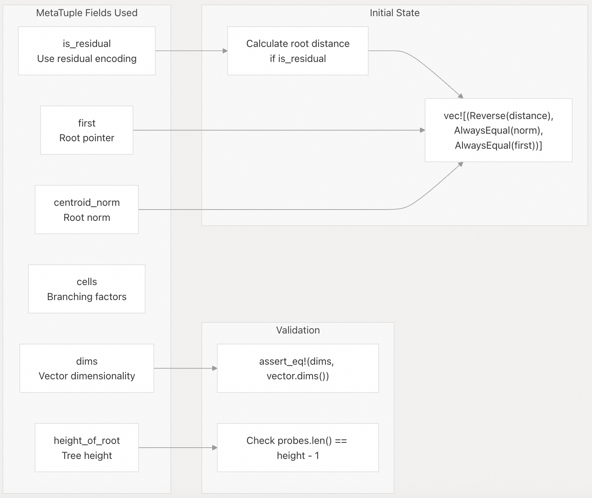  
  
**来源**:  
  
  - [`crates/vchordrq/src/search.rs` 51-90](https://github.com/tensorchord/VectorChord/blob/ac12e257/crates/vchordrq/src/search.rs#L51-L90)  
  - [`crates/vchordrq/src/tuples.rs` 197-234](https://github.com/tensorchord/VectorChord/blob/ac12e257/crates/vchordrq/src/tuples.rs#L197-L234)  
  
### 逐层下降（Layer-by-Layer Descent）  
  
分层遍历迭代通过 `height_of_root - 1` 个级别，并在每个级别维护一个**候选集优先队列（Priority Queue of Candidates）**：  
  
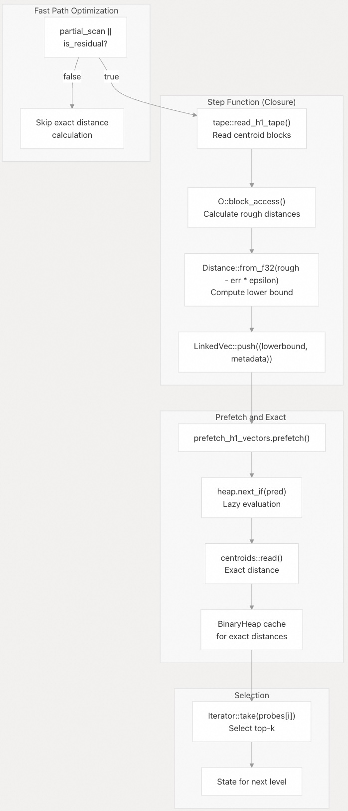  
  
`step` 闭包（Closure）定义于 [`crates/vchordrq/src/search.rs` 92-127](https://github.com/tensorchord/VectorChord/blob/ac12e257/crates/vchordrq/src/search.rs#L92-L127)，并在 129-151 行的循环中执行。关键优化点：  
  
  * **快速路径（Fast Path）**：当 `!partial_scan && !is_residual` 时，跳过精确距离计算，并使用 `Distance::ZERO` 作为下限（Lower Bound） [`crates/vchordrq/src/search.rs` 134-150](https://github.com/tensorchord/VectorChord/blob/ac12e257/crates/vchordrq/src/search.rs#L134-L150)。  
  * **惰性预取（Lazy Prefetching）**：预取器（Prefetcher）仅在通过 `next_if()` 比较必要时才获取页面 [`crates/vchordrq/src/search.rs` 115-116](https://github.com/tensorchord/VectorChord/blob/ac12e257/crates/vchordrq/src/search.rs#L115-L116)。  
  * **Epsilon 剪枝（Epsilon Pruning）**：使用 `rough - err * epsilon` 计算 **保守的下限（Conservative Lower Bounds）** [`crates/vchordrq/src/search.rs` 99](https://github.com/tensorchord/VectorChord/blob/ac12e257/crates/vchordrq/src/search.rs#L99-L99)。  
  
**来源**:  
  
  - [`crates/vchordrq/src/search.rs` 92-151](https://github.com/tensorchord/VectorChord/blob/ac12e257/crates/vchordrq/src/search.rs#L92-L151)  
  - [`crates/vchordrq/src/tape.rs` 229-268](https://github.com/tensorchord/VectorChord/blob/ac12e257/crates/vchordrq/src/tape.rs#L229-L268)  
  
## 候选集收集（Candidate Collection）  
  
遍历到叶子节点后，搜索从三种磁带（Tape）类型中收集候选集：  
  
### 跳转元组（JumpTuple）导航  
  
每个叶子节点包含一个指向结果磁带的 `JumpTuple`：  
  
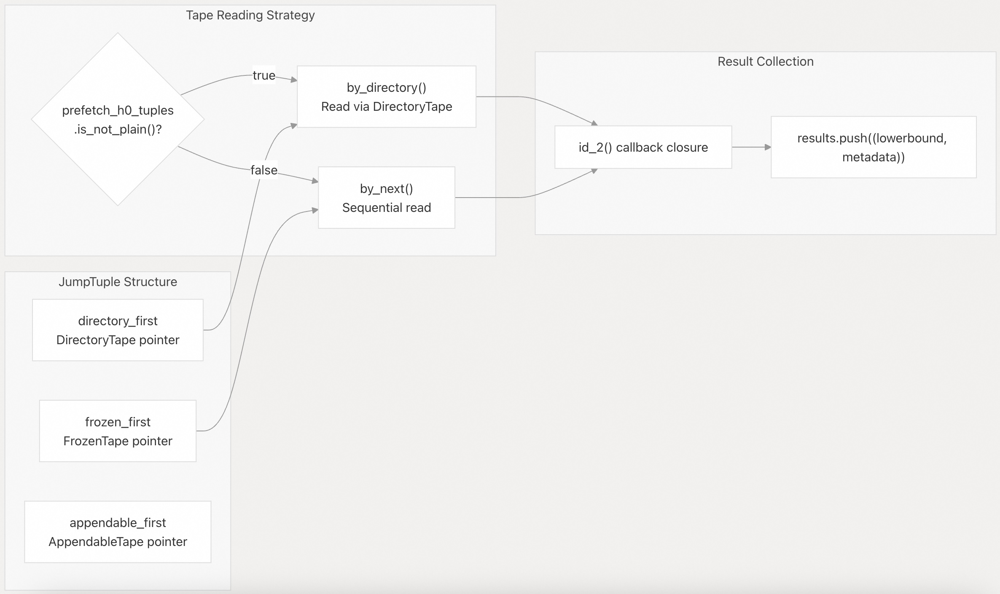  
  
**来源**:  
  
  - [`crates/vchordrq/src/search.rs` 155-189](https://github.com/tensorchord/VectorChord/blob/ac12e257/crates/vchordrq/src/search.rs#L155-L189)  
  - [`crates/vchordrq/src/tuples.rs` 798-861](https://github.com/tensorchord/VectorChord/blob/ac12e257/crates/vchordrq/src/tuples.rs#L798-L861)  
  
### 磁带（Tape）读取细节  
  
候选集收集从每个叶子分区内的三种磁带结构中读取：  
  
#### 冻结磁带（FrozenTape）  
  
```  
tape::read_frozen_tape<R, _, _>(  
    by_directory(&mut prefetch_h0_tuples, directory),  // or by_next()  
    || O::block_access(&lut.0, is_residual, dis_f.to_f32(), norm),  
    &mut callback,  
)  
```  
  
  * **目的**：读取**批量压缩向量（Batch-compressed Vectors）**（每个 `FrozenTuple` 包含 32 个向量）  
  * **编码**：带有元数据（`dis_u_2`、`factor_pqt`、`factor_err`）的 RaBitQ 4 位编码  
  * **访问器（Accessor）**：`O::block_access()` 返回一个计算粗略距离的**块访问器（BlockAccessor）**  
  * **调用**：[`crates/vchordrq/src/search.rs`](https://github.com/tensorchord/VectorChord/blob/ac12e257/crates/vchordrq/src/search.rs) 中的 172-182 行（MaxSim 为 337-347 行）  
  * **实现**：[`crates/vchordrq/src/tape.rs` 270-308](https://github.com/tensorchord/VectorChord/blob/ac12e257/crates/vchordrq/src/tape.rs#L270-L308)  
  
#### 可追加磁带（AppendableTape）  
  
```  
tape::read_appendable_tape<R, _>(  
    by_next(index, jump_tuple.appendable_first()),  
    O::binary_access(&lut.1, is_residual, dis_f.to_f32(), norm),  
    &mut callback,  
)  
```  
  
  * **目的**：读取尚未重组为批次(batchs)的**单独插入向量（Individually Inserted Vectors）**  
  * **编码**：`AppendableTuple` 中的**位打包二进制量化（Bit-packed Binary Quantization）**  
  * **访问器（Accessor）**：`O::binary_access()` 返回用于 1 位编码的**二进制访问器（BinaryAccessor）**  
  * **调用**：[`crates/vchordrq/src/search.rs`](https://github.com/tensorchord/VectorChord/blob/ac12e257/crates/vchordrq/src/search.rs) 中的 184-188 行（MaxSim 为 349-353 行）  
  * **实现**：[`crates/vchordrq/src/tape.rs` 310-327](https://github.com/tensorchord/VectorChord/blob/ac12e257/crates/vchordrq/src/tape.rs#L310-L327)  
  
#### 目录磁带（DirectoryTape）  
  
```  
let directory = tape::read_directory_tape::<R>(  
    by_next(index, jump_tuple.directory_first())  
);  
```  
  
  * **目的**：提供**页面 ID（Page ID）**，用于基于 **预取器（Prefetcher）** 访问 `FrozenTape`  
  * **格式**：`DirectoryTuple` 的打包序列，带有页面 ID 数组  
  * **用法**：仅当 `prefetch_h0_tuples.is_not_plain()` 时（即 `Simple` 或 `Stream` I/O）  
  * **返回类型**：`impl Iterator<Item = u32>` (页面 ID)  
  * **实现**：[`crates/vchordrq/src/tape.rs` 116-194](https://github.com/tensorchord/VectorChord/blob/ac12e257/crates/vchordrq/src/tape.rs#L116-L194)  
  
#### 回调调用（Callback Invocation）  
  
两个磁带读取器都为每个向量调用一个回调闭包（Callback Closure）：  
```  
id_2(|(rough, err), head, payload, prefetch| {  
    let lowerbound = Distance::from_f32(rough - err * epsilon);  
    results.push((  
        (Reverse(lowerbound), AlwaysEqual(())),  
        AlwaysEqual(PackedRefMut4(bump.alloc((  
            payload,      // NonZero<u64> with ctid  
            head,         // u16 offset in VectorTape  
            prefetch,     // BorrowedIter<u32> with page IDs  
        )))),  
    ));  
})  
```  
  
[`crates/vchordrq/src/search.rs` 158-167](https://github.com/tensorchord/VectorChord/blob/ac12e257/crates/vchordrq/src/search.rs#L158-L167) 中的回调函数收集带有其近似下限(lower bounds)的候选集。  
  
**来源**:  
  
  - [`crates/vchordrq/src/search.rs` 169-189](https://github.com/tensorchord/VectorChord/blob/ac12e257/crates/vchordrq/src/search.rs#L169-L189)  
  - [`crates/vchordrq/src/tape.rs` 116-327](https://github.com/tensorchord/VectorChord/blob/ac12e257/crates/vchordrq/src/tape.rs#L116-L327)  
  
## 重排序（Reranking）方法  
  
在候选结果收集完成后，搜索会执行精确距离的重排序（reranking）。该方法由 `MetaTuple::rerank_in_heap()` 决定：  
  
### 对比表  
方面 | `rerank_index` | `rerank_heap`  
---|---|---  
向量来源 | 索引结构 (VectorTape) | 堆表 (PostgreSQL tuple)  
获取方法 | `LTryAccess` + `vectors::read()` | `fetcher.fetch()` + 数据解析  
性能 | 更快（索引局部性好） | 较慢（堆表随机访问）  
存储 | 需要在索引中存储向量 | 索引存储空间最小化  
使用场景 | 默认模式 | 存储空间受限的场景  
  
来源:  
- [`crates/vchordrq/src/rerank.rs` 34-44](https://github.com/tensorchord/VectorChord/blob/ac12e257/crates/vchordrq/src/rerank.rs#L34-L44)  
- [`crates/vchordrq/src/rerank.rs` 82-135](https://github.com/tensorchord/VectorChord/blob/ac12e257/crates/vchordrq/src/rerank.rs#L82-L135)  
  
### 基于索引的重排序  
  
位于 [`crates/vchordrq/src/rerank.rs` 82-108](https://github.com/tensorchord/VectorChord/blob/ac12e257/crates/vchordrq/src/rerank.rs#L82-L108) 的 `rerank_index` 函数实现了一个流式重排序器，它从索引的 `VectorTape` 中读取向量。  
  
**重排序器迭代器实现**  
  
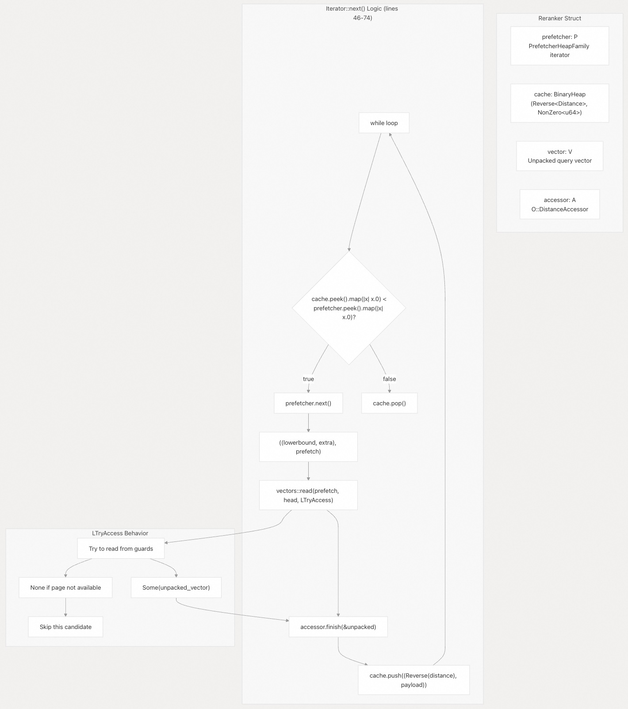  
  
**关键实现细节：**  
  
1.  **闭包生命周期绑定**：重排序器通过第 95 行的 `id_4` 创建，该函数绑定了已解包向量的生命周期：  
    ```rust  
    id_4(|vector, mut accessor| {  
        // vector 和 accessor 在闭包内被捕获  
    })  
    ```  
  
2.  **LTryAccess 模式**：第 100-103 行的 `vectors::read()` 调用使用了 `LTryAccess`，允许优雅降级：  
    ```rust  
    LAccess::try_access(  
        id_2(|x: &[u8]| {  
            accessor.push(&O::Vector::unpack_cast(x, dims()));  
        }),  
        id_1(|| None),  // 当向量不可用时的回退方案  
    )  
    ```  
    如果向量所在的页面不在预取集合中，则返回 `None`，并跳过该候选结果。  
  
3.  **堆不变式**：缓存仅在确认最小精确距离小于任何剩余的近似下界时才会弹出元素（第 64-68 行）。  
  
4.  **距离计算**：`O::DistanceAccessor::finish()` 方法在读取完解包后的向量后计算精确距离。  
  
来源:  
- [`crates/vchordrq/src/rerank.rs` 82-108](https://github.com/tensorchord/VectorChord/blob/ac12e257/crates/vchordrq/src/rerank.rs#L82-L108)  
- [`crates/vchordrq/src/rerank.rs` 46-74](https://github.com/tensorchord/VectorChord/blob/ac12e257/crates/vchordrq/src/rerank.rs#L46-L74)  
  
### 基于堆（Heap）的重排序（Reranking）  
  
当索引不包含向量数据的副本（即 `MetaTuple::rerank_in_heap()` 返回 `true`）时，`vchordrq` 会从 PostgreSQL **堆表（Heap Table）** 中加载原始向量进行精确距离计算。  
  
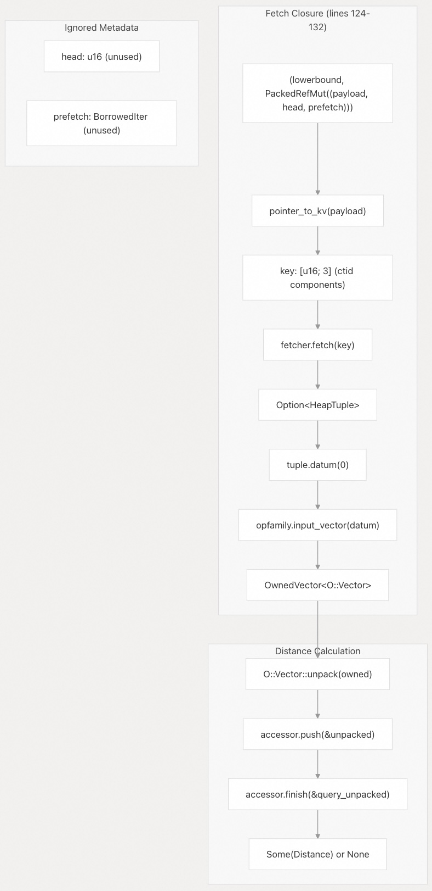  
  
`heap_based_reranking` 函数（在 `src/index/vchordrq/scanners/default.rs` 中定义）迭代通过候选集，并为每个候选集执行以下步骤：  
  
1.  **TID 解析**：候选集包含**元组 ID (TID)**，用于定位堆元组。  
2.  **堆元组（HeapTuple）提取**：调用 `RelationRead::get_latest_tuple` 提取 `Option<HeapTuple>` 并进行可见性检查。  
3.  **向量解析**：[`opfamily.input_vector()` 方法在 127 行](https://github.com/tensorchord/VectorChord/blob/ac12e257/crates/vchordrq/src/rerank.rs#L127) 处理特定类型的转换：  
  
```  
opfamily.input_vector(datum) -> Option<OwnedVector<O::Vector>>  
```  
  
这支持 `vector`、`halfvec` 和其他向量类型。  
  
4.  **元数据被忽略**：与 `rerank_index` 不同，`head` 和 `prefetch` 字段未被使用，因为向量来自**堆（Heap）**，而不是索引的 `VectorTape`。  
5.  **优雅失败**：如果找不到元组或 **数据元（Datum）** 为空，则返回 `None` 并跳过该候选集。  
  
**何时使用基于堆的重排序：**  
  
当 `MetaTuple::rerank_in_heap()` 返回 `true` 时，会选择基于堆的重排序。这发生在通过不重复向量来最小化索引存储的场景中。其权衡：  
  
  * **优点**：减少索引大小  
  * **缺点**：对堆表（Heap Table）的**随机 I/O（Random I/O）**，重排序速度较慢  
  
**来源**:  
  
  - [`crates/vchordrq/src/rerank.rs` 110-135](https://github.com/tensorchord/VectorChord/blob/ac12e257/crates/vchordrq/src/rerank.rs#L110-L135)  
  - [`src/index/vchordrq/scanners/default.rs` 217-236](https://github.com/tensorchord/VectorChord/blob/ac12e257/src/index/vchordrq/scanners/default.rs#L217-L236)  
  
## I/O 优化策略（I/O Optimization Strategies）  
  
VectorChord 提供了三种可通过 **GUC 参数**配置的 I/O 策略：  
  
### 策略比较  
  
| 策略 | PostgreSQL API | 预取（Prefetching） | 最佳适用场景 | 可用性 |  
| :--- | :--- | :--- | :--- | :--- |  
| **Plain** | 顺序 `RelationRead::read()` | 无 | 小结果集 | 所有版本 |  
| **Simple** | 顺序读取 + 手动预取 | 一次一页 | 中等结果集 | 所有版本 |  
| **Stream** | `read_stream` API | **自适应批处理（Adaptive Batching）** | 大结果集 | PostgreSQL 17+ |  
  
**来源**:  
  
  - [`src/index/scanners.rs` 21-30](https://github.com/tensorchord/VectorChord/blob/ac12e257/src/index/scanners.rs#L21-L30)  
  - [`src/index/vchordrq/scanners/default.rs` 113-162](https://github.com/tensorchord/VectorChord/blob/ac12e257/src/index/vchordrq/scanners/default.rs#L113-L162)  
  
### 预取器（Prefetcher）工厂模式  
  
扫描器使用工厂结构（Factory Structures）根据 I/O 策略创建预取器：  
  
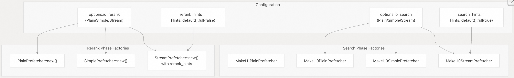  
  
**来源**:  
  
  - [`src/index/vchordrq/scanners/default.rs` 114-122](https://github.com/tensorchord/VectorChord/blob/ac12e257/src/index/vchordrq/scanners/default.rs#L114-L122)  
  - [`src/index/vchordrq/scanners/default.rs` 166-216](https://github.com/tensorchord/VectorChord/blob/ac12e257/src/index/vchordrq/scanners/default.rs#L166-L216)  
  
### 流预取器（Stream Prefetcher）细节  
  
流预取器（PostgreSQL 17+）使用 `RelationReadStream` 来批量处理 I/O 操作：  
  
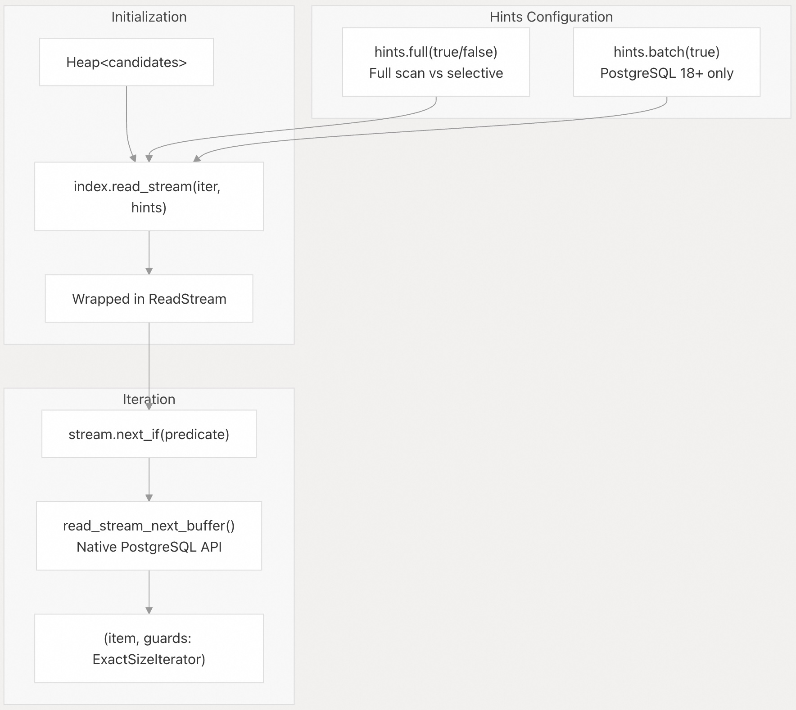  
  
流的实现位于 [`src/index/storage.rs` 540-690](https://github.com/tensorchord/VectorChord/blob/ac12e257/src/index/storage.rs#L540-L690)。关键特性：  
  
  * 使用基于回调的 API 进行**自适应预取（Adaptive Prefetching）** [`src/index/storage.rs` 646-659](https://github.com/tensorchord/VectorChord/blob/ac12e257/src/index/storage.rs#L646-L659)  
  * 维护带有 `VecDeque` 窗口的内部**缓存（Cache）** [`src/index/storage.rs` 422-483](https://github.com/tensorchord/VectorChord/blob/ac12e257/src/index/storage.rs#L422-L483)  
  * 支持通过 `next_if` 谓词（Predicate）进行**条件弹出（Conditional Popping）** [`src/index/storage.rs` 590-600](https://github.com/tensorchord/VectorChord/blob/ac12e257/src/index/storage.rs#L590-L600)  
  
**来源**:  
  
  - [`src/index/storage.rs` 540-690](https://github.com/tensorchord/VectorChord/blob/ac12e257/src/index/storage.rs#L540-L690)  
  - [`src/index/vchordrq/scanners/default.rs` 200-215](https://github.com/tensorchord/VectorChord/blob/ac12e257/src/index/vchordrq/scanners/default.rs#L200-L215)  
  
## 预过滤（Prefiltering）  
  
当 SQL 查询包含 `WHERE` 子句时，扫描器会应用 **预过滤（Prefiltering）** 来减少重排序（Reranking）开销：  
  
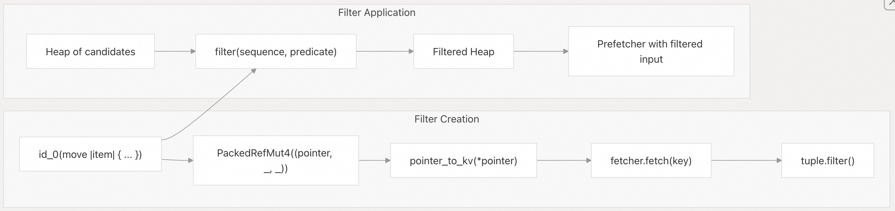  
  
过滤函数定义于 [`src/index/vchordrq/filter.rs`](https://github.com/tensorchord/VectorChord/blob/ac12e257/src/index/vchordrq/filter.rs)，并将堆（Heap）包装在一个过滤迭代器中。示例用法位于 [`src/index/vchordrq/scanners/default.rs` 171-182](https://github.com/tensorchord/VectorChord/blob/ac12e257/src/index/vchordrq/scanners/default.rs#L171-L182)：  
```  
let predicate = id_0(move |(_, AlwaysEqual(PackedRefMut4((pointer, _, _))))| {  
    let (key, _) = pointer_to_kv(*pointer);  
    let Some(mut tuple) = fetcher.fetch(key) else {  
        return false;  
    };  
    tuple.filter()  
});  
let sequence = filter(sequence, predicate);  
```  
  
**来源**:  
  
  - [`src/index/vchordrq/scanners/default.rs` 171-182](https://github.com/tensorchord/VectorChord/blob/ac12e257/src/index/vchordrq/scanners/default.rs#L171-L182)  
  - [`src/index/vchordrq/scanners/default.rs` 446-457](https://github.com/tensorchord/VectorChord/blob/ac12e257/src/index/vchordrq/scanners/default.rs#L446-L457)  
  
## MaxSim 搜索特化（MaxSim Search Specialization）  
  
`maxsim_search` 函数处理多向量 MaxSim 查询，并具有专门的行为：  
  
### 与默认搜索的主要区别  
  
| 方面 | `default_search` | `maxsim_search` |  
| :--- | :--- | :--- |  
| 查询输入 | 单个向量 | 多个向量 |  
| 返回类型 | 仅候选集 | 候选集 + 阈值估计 |  
| 阈值处理 | 无 | 通过 `threshold` 提前终止 |  
| 优化（Refinement） | 所有候选集 | 可配置的 `maxsim_refine` 限制 |  
| 距离跟踪 | 单个（下限） | 双重（粗略 + 精确） |  
  
**来源**:  
  
  - [`crates/vchordrq/src/search.rs` 193-368](https://github.com/tensorchord/VectorChord/blob/ac12e257/crates/vchordrq/src/search.rs#L193-L368)  
  - [`src/index/vchordrq/scanners/maxsim.rs` 39-410](https://github.com/tensorchord/VectorChord/blob/ac12e257/src/index/vchordrq/scanners/maxsim.rs#L39-L410)  
  
### 基于阈值的终止（Threshold-Based Termination）  
  
MaxSim 搜索使用 `threshold` 参数来估计何时收集了足够的候选集：  
  
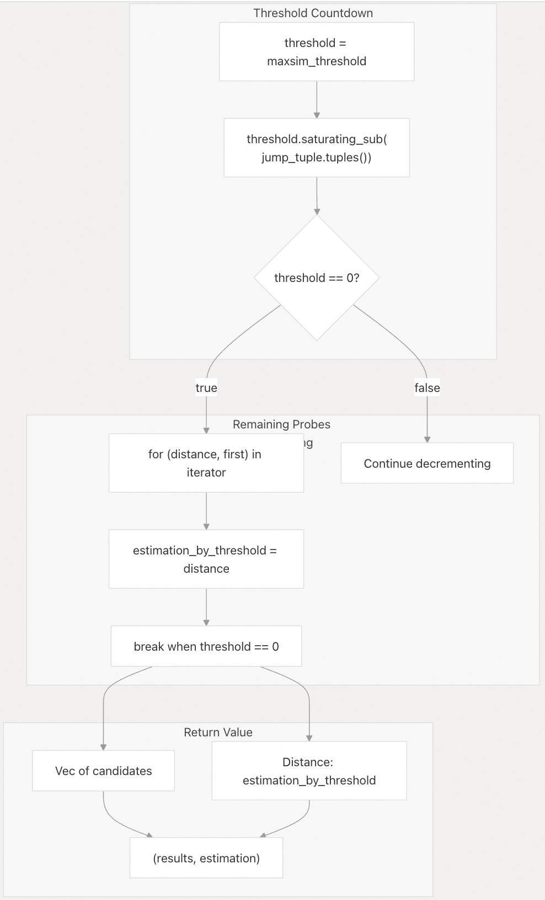  
  
实现细节位于 [`crates/vchordrq/src/search.rs` 354-366](https://github.com/tensorchord/VectorChord/blob/ac12e257/crates/vchordrq/src/search.rs#L354-L366)：  
- 为每次探查（probe）从阈值中减去元组计数  
- 在主搜索结束后，继续迭代剩余的探查  
- 返回最终的距离估计值用于剪枝  
  
来源:  
- [`crates/vchordrq/src/search.rs` 354-368](https://github.com/tensorchord/VectorChord/blob/ac12e257/crates/vchordrq/src/search.rs#L354-L368)  
- [`src/index/vchordrq/scanners/maxsim.rs` 139-264](https://github.com/tensorchord/VectorChord/blob/ac12e257/src/index/vchordrq/scanners/maxsim.rs#L139-L264)  
  
### 双距离集合(Dual Distance Sets)  
  
MaxSim 搜索维护两组距离用于聚合：  
  
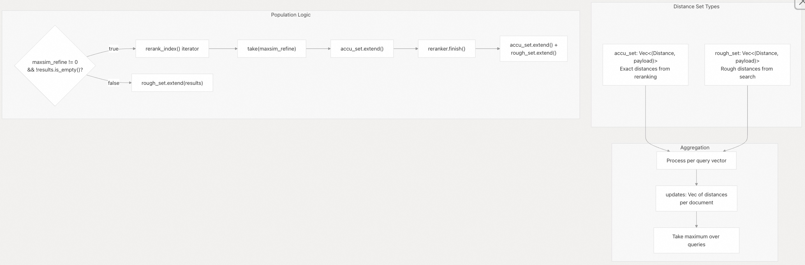  
  
来源:  
- [`src/index/vchordrq/scanners/maxsim.rs` 172-264](https://github.com/tensorchord/VectorChord/blob/ac12e257/src/index/vchordrq/scanners/maxsim.rs#L172-L264)  
- [`src/index/vchordrq/scanners/maxsim.rs` 412-488](https://github.com/tensorchord/VectorChord/blob/ac12e257/src/index/vchordrq/scanners/maxsim.rs#L412-L488)  
  
## 结果限制与输出  
  
最终阶段应用限制并准备结果以供 PostgreSQL 使用：  
  
### 限制机制  
  
| 限制类型 | 配置 | 应用位置 | 目的 |  
|---|---|---|---|  
| Sphere 阈值 | `Sphere { radius }` | 重排序器迭代器 | 距离截断 |  
| 最大扫描元组数 | `max_scan_tuples` GUC 参数 | 扫描器状态 | 防止无界扫描 |  
| SQL LIMIT | PostgreSQL 执行器 | 扫描器外部 | 结果数量限制 |  
  
扫描器返回一个类型为 `Box<dyn Iterator<Item = (f32, [u16; 3], bool)>>` 的迭代器，其中：  
- `f32`: 输出距离（由 `opfamily.output()` 转换）  
- `[u16; 3]`: ctid 组件（块号、偏移量、重新检查标志）  
- `bool`: 用于额外谓词的重新检查标志  
  
来源:  
- [`src/index/vchordrq/scanners/default.rs` 87-112](https://github.com/tensorchord/VectorChord/blob/ac12e257/src/index/vchordrq/scanners/default.rs#L87-L112)  
- [`src/index/vchordg/am/mod.rs` 417-442](https://github.com/tensorchord/VectorChord/blob/ac12e257/src/index/vchordg/am/mod.rs#L417-L442)  
  
### ctid 编码  
  
向量载荷（payload）被编码为 `NonZero<u64>`，结合了 ctid 和可选的额外数据：  
  
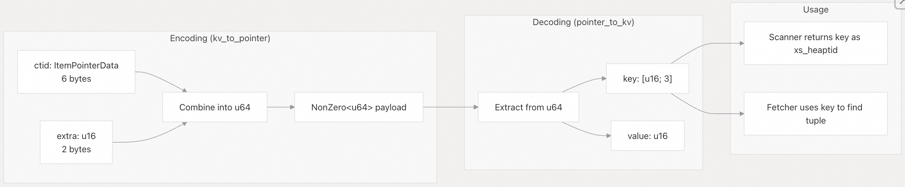  
  
在 [`src/index/vchordrq/dispatch.rs`](https://github.com/tensorchord/VectorChord/blob/ac12e257/src/index/vchordrq/dispatch.rs) 中定义的函数：  
- `kv_to_pointer((key, extra))`: 将 ctid 和额外数据编码为载荷  
- `pointer_to_kv(payload)`: 从载荷中提取 ctid 和额外数据  
- `ctid_to_key(ctid)`: 将 PostgreSQL ctid 转换为键数组  
- `key_to_ctid(key)`: 将键数组转换回 ctid  
  
来源:  
- [`src/index/vchordrq/dispatch.rs`](https://github.com/tensorchord/VectorChord/blob/ac12e257/src/index/vchordrq/dispatch.rs)  
- [`src/index/vchordg/am/mod.rs` 433-437](https://github.com/tensorchord/VectorChord/blob/ac12e257/src/index/vchordg/am/mod.rs#L433-L437)  
      
#### [期望 PostgreSQL|开源PolarDB 增加什么功能?](https://github.com/digoal/blog/issues/76 "269ac3d1c492e938c0191101c7238216")
  
  
#### [PolarDB 开源数据库](https://openpolardb.com/home "57258f76c37864c6e6d23383d05714ea")
  
  
#### [PolarDB 学习图谱](https://www.aliyun.com/database/openpolardb/activity "8642f60e04ed0c814bf9cb9677976bd4")
  
  
#### [PostgreSQL 解决方案集合](../201706/20170601_02.md "40cff096e9ed7122c512b35d8561d9c8")
  
  
#### [德哥 / digoal's Github - 公益是一辈子的事.](https://github.com/digoal/blog/blob/master/README.md "22709685feb7cab07d30f30387f0a9ae")
  
  
#### [About 德哥](https://github.com/digoal/blog/blob/master/me/readme.md "a37735981e7704886ffd590565582dd0")
  
  

  
