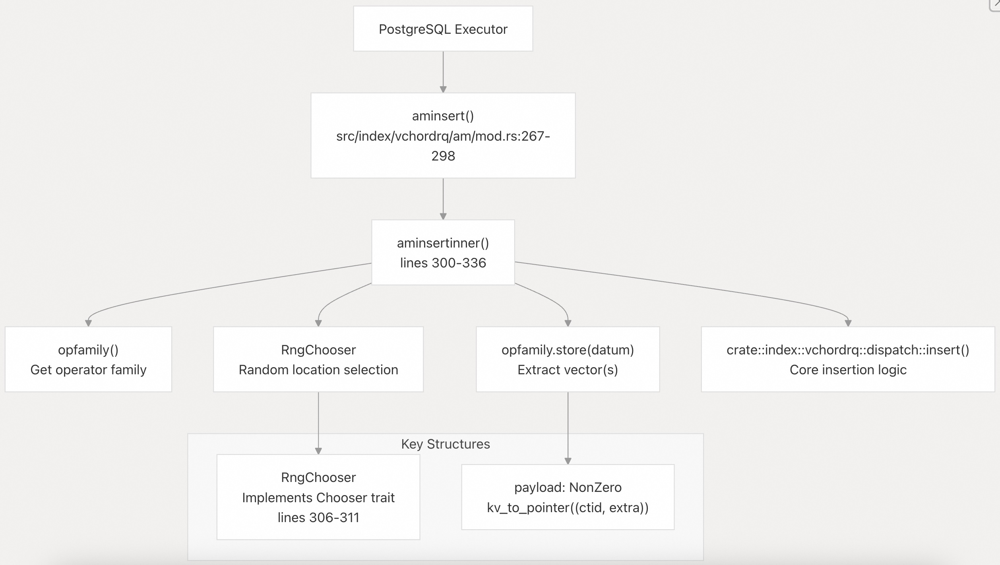
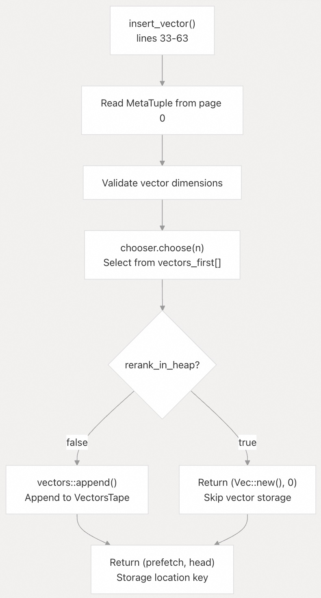
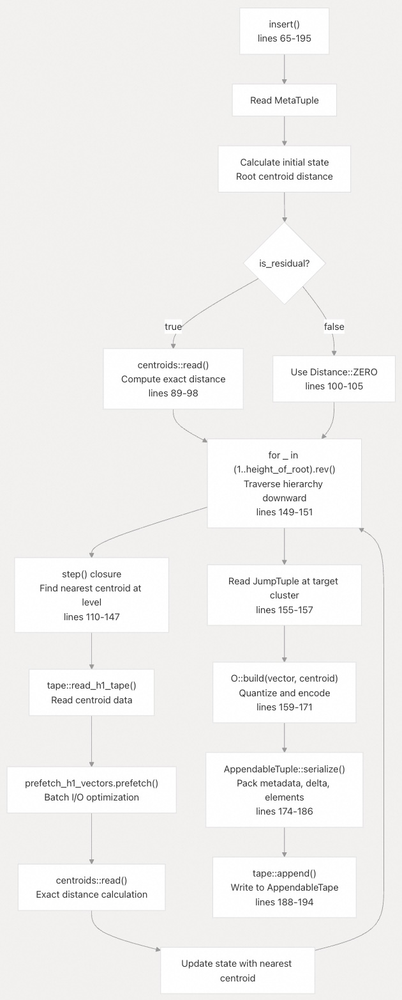
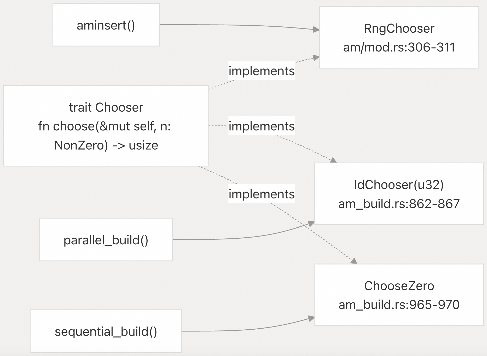
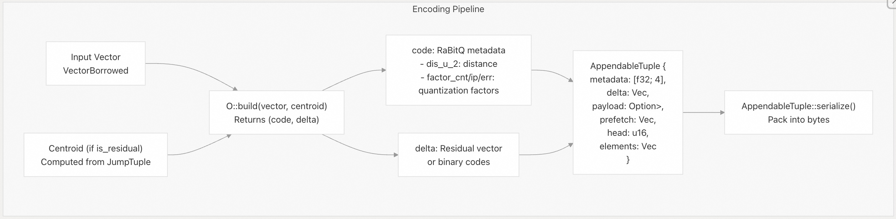
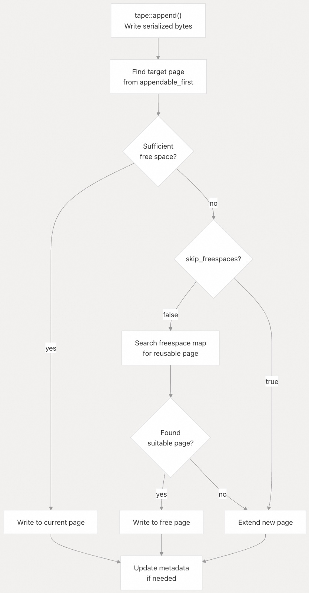
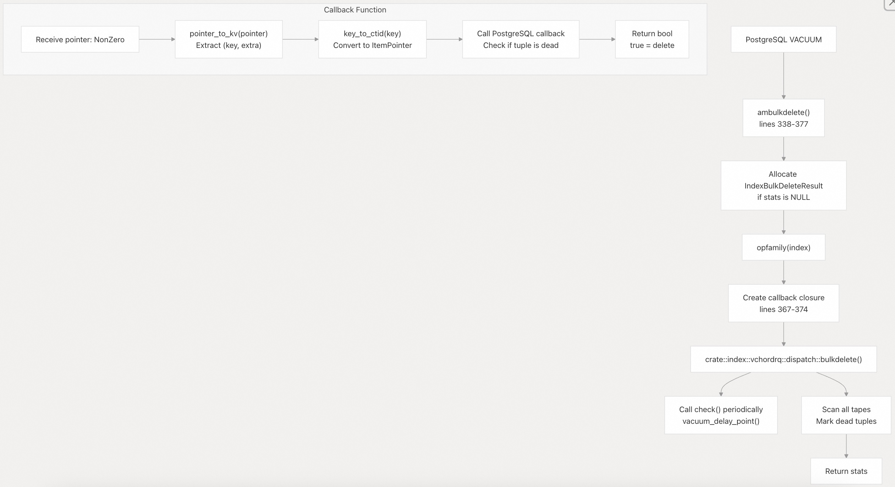
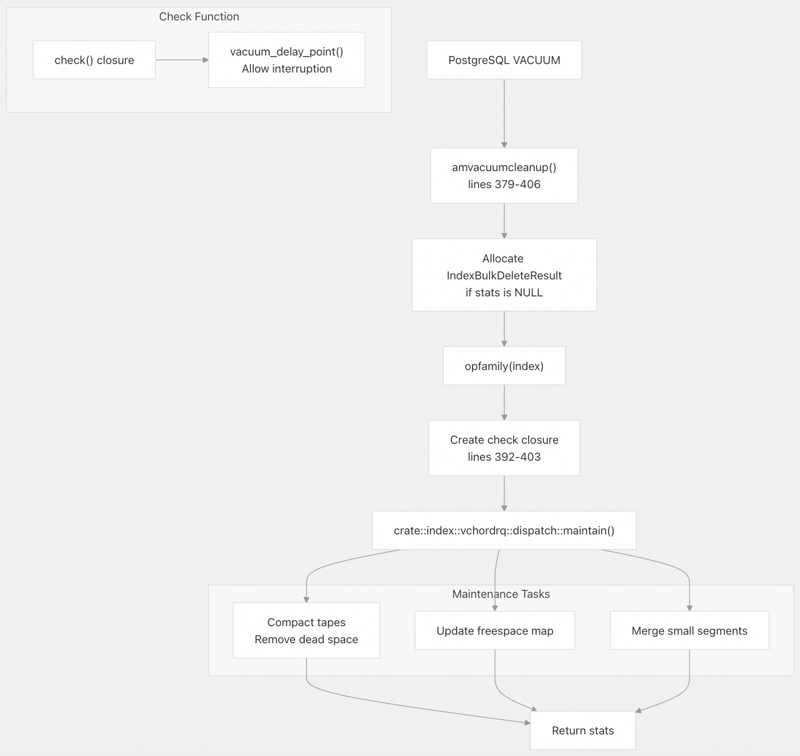
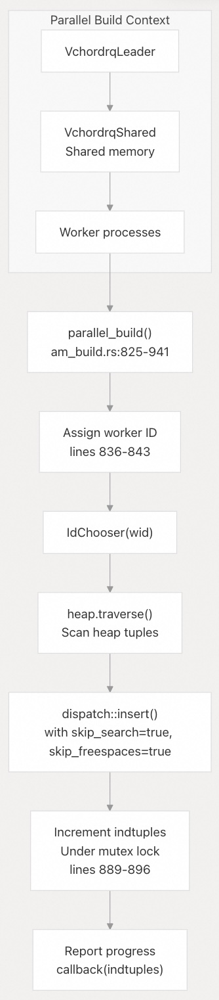

## VectorChord 源码学习: 3.1.3 插入与维护操作 (Insert and Maintenance Operations)  
                        
### 作者                        
digoal                        
                        
### 日期                        
2025-10-31                        
                        
### 标签                        
VectorChord , 源码学习                        
                        
----                        
                        
## 背景                        
本文介绍如何将**向量**（vector）插入到 **vchordrq 索引**（vchordrq index）中，以及**维护操作**（maintenance operations）（**批量删除**（bulk delete）和 **清理**（vacuum））如何保持索引的健康。  
  
### 概览 (Overview)  
  
**vchordrq 索引**（vchordrq index）支持三种主要的**维护操作**（maintenance operations）：  
  
1.  **单元组插入**（Single-tuple insertion）（`aminsert`）：在向量被添加到表时，插入单个向量。  
2.  **批量删除**（Bulk deletion）（`ambulkdelete`）：在 `VACUUM` 操作期间，根据回调**谓词**（predicate）移除向量。  
3.  **清理收尾**（Vacuum cleanup）（`amvacuumcleanup`）：**压缩**（compact）索引并**回收**（reclaims）空间。  
  
插入操作必须遍历**分层质心结构**（hierarchical centroid structure）以确定目标**簇**（cluster），使用 **RaBitQ 编码**（RaBitQ encoding）对向量进行**量化**（quantize），并将**编码后的元组**（encoded tuple）附加到相应的 **磁带**（tape，指存储段）。维护操作会扫描索引以标记**已删除的元组**（deleted tuples）并压缩存储。  
  
来源:  
- [`src/index/vchordrq/am/mod.rs` 1-610](https://github.com/tensorchord/VectorChord/blob/ac12e257/src/index/vchordrq/am/mod.rs#L1-L610)  
- [`crates/vchordrq/src/insert.rs` 1-196](https://github.com/tensorchord/VectorChord/blob/ac12e257/crates/vchordrq/src/insert.rs#L1-L196)  
  
### 插入操作入口点 (Insert Operation Entry Point)  
  
`aminsert` **回调**（callback）由 **PostgreSQL** 调用，用于插入到**堆表**（heap table）中的每个**元组**（tuple）。不同 PostgreSQL 版本之间的实现略有不同，但遵循相同的模式：  
  
  
  
**关键数据转换**（Key data transformations）：  
  
* **CTID → 键**（Key）：`ctid_to_key(ctid)` 将 PostgreSQL **元组 ID**（tuple ID）转换为内部**键格式**（key format）。  
* **键 + 额外信息 → 指针**（Pointer）：`kv_to_pointer((key, extra))` 将两者打包成一个 `NonZero<u64>` **有效载荷**（payload）。  
* **随机选择**：`RngChooser` 使用 `rand::rng()` 从多个**存储位置**（storage locations）中随机进行选择。  
  
来源:  
- [`src/index/vchordrq/am/mod.rs` 265-336](https://github.com/tensorchord/VectorChord/blob/ac12e257/src/index/vchordrq/am/mod.rs#L265-L336)  
  
### 插入管线 (Insert Pipeline)  
  
核心插入逻辑在 `crates/vchordrq/src/insert.rs` 中的两个函数之间拆分：  
  
#### `insert_vector`: 位置选择 (Location Selection)  
  
  
  
`rerank_in_heap` **标志**（flag）决定了**存储策略**（storage strategy）：  
  
* **false**：将**量化向量**（quantized vector）存储在**索引**中，启用 `rerank_index` **模式**（mode）。  
* **true**：仅存储**指针**（pointer），需要**堆访问**（heap access）来进行**重新排序**（reranking）。  
  
来源:  
- [`crates/vchordrq/src/insert.rs` 33-63](https://github.com/tensorchord/VectorChord/blob/ac12e257/crates/vchordrq/src/insert.rs#L33-L63)  
  
#### `insert`: 带有层级遍历的完整插入 (Full Insertion with Hierarchy Traversal)  
  
  
  
**关键操作**（Key operations）：  
  
* **层级遍历**（Hierarchy traversal）：使用与搜索相同的 `step()` **闭包模式**（closure pattern），但在每个级别仅找到单个**最近质心**（nearest centroid）。  
* **O::build**：**操作符特定的量化**（Operator-specific quantization）（向量类型的 **RaBitQ**）。  
* **AppendableTuple**：存储**元数据**（metadata）（`dis_u_2`、`factor_cnt`、`factor_ip`、`factor_err`）、**增量向量**（delta vector）和**打包的二进制代码**（packed binary codes）。  
  
来源:  
- [`crates/vchordrq/src/insert.rs` 65-196](https://github.com/tensorchord/VectorChord/blob/ac12e257/crates/vchordrq/src/insert.rs#L65-L196)  
  
### Chooser 特性及其实现 (Chooser Trait and Implementations)  
  
`Chooser` **特性**（trait）抽象了**存储位置的选择**（storage location selection）：  
  
| 实现 (Implementation) | 用途 (Used In) | 行为 (Behavior) |  
| :--- | :--- | :--- |  
| `RngChooser` | 普通插入 (Normal inserts) | 使用 `rand::Rng::random_range` 进行随机选择 |  
| `IdChooser` | 并行构建 (Parallel builds) | 使用**工作线程 ID**（worker ID）进行**确定性选择**（Deterministic selection）：`wid % n` |  
| `ChooseZero` | 顺序构建 (Sequential builds) | 始终选择索引 0 |  
  
  
  
此设计确保了**并行构建**（parallel builds）中的**负载均衡**（load balancing），同时避免了**资源争用**（contention）——每个**工作线程**（worker）都**确定性**地针对不同的**存储位置**（storage locations）。  
  
来源:  
- [`src/index/vchordrq/am/mod.rs` 306-311](https://github.com/tensorchord/VectorChord/blob/ac12e257/src/index/vchordrq/am/mod.rs#L306-L311)  
- [`src/index/vchordrq/am/am_build.rs` 862-867](https://github.com/tensorchord/VectorChord/blob/ac12e257/src/index/vchordrq/am/am_build.rs#L862-L867)  
- [`src/index/vchordrq/am/am_build.rs` 965-970](https://github.com/tensorchord/VectorChord/blob/ac12e257/src/index/vchordrq/am/am_build.rs#L965-L970)  
  
### 向量编码与序列化 (Vector Encoding and Serialization)  
  
**插入管线**（insertion pipeline）通过多个阶段对向量进行编码：  
  
  
  
**元数据字段**（Metadata fields）：  
  
* `dis_u_2`：**到质心的平方距离**（Squared distance to centroid）。  
* `factor_cnt/ip/err`：用于**快速近似搜索**（fast approximate search）的 **RaBitQ 量化参数**（RaBitQ quantization parameters）。  
* `prefetch`：用于搜索期间**预取**（prefetching）的**页 ID**（Page IDs）。  
* `head`：**页**（page）内的**元组偏移量**（Tuple offset）。  
* `elements`：**向量的打包二进制表示**（Packed binary representation of vector）。  
  
来源:  
- [`crates/vchordrq/src/insert.rs` 159-186](https://github.com/tensorchord/VectorChord/blob/ac12e257/crates/vchordrq/src/insert.rs#L159-L186)  
  
### 磁带追加操作 (Tape Append Operation)  
  
**序列化元组**（serialized tuple）使用 `tape::append` 写入存储：  
  
  
  
`skip_freespaces` **参数**（parameter）设置为：  
  
* **false**：在**普通插入**（normal inserts）期间 - **重用空闲空间**（reuses free space）。  
* **true**：在**并行构建**（parallel builds）期间 - 避免**空闲空间结构**（freespace structures）上的**资源争用**（contention）。  
  
来源:  
- [`crates/vchordrq/src/insert.rs` 188-194](https://github.com/tensorchord/VectorChord/blob/ac12e257/crates/vchordrq/src/insert.rs#L188-L194)  
  
### 批量删除操作 (Bulk Delete Operation)  
  
`ambulkdelete` **回调**（callback）在 `DELETE` 或 `VACUUM` 操作期间被调用：  
  
  
  
**关键方面**（Key aspects）：  
  
* `callback` **参数**：由 **PostgreSQL 提供**的函数，用于确定是否应删除**元组**（tuple）。  
* `vacuum_delay_point()`：允许**中断**（interruption）和**节流**（throttling）**清理操作**（vacuum operations）。  
* `pg_guard_ffi_boundary`：在**回调**期间，**保护 Rust 代码**免受 PostgreSQL `longjmp` 的影响。  
  
来源:  
- [`src/index/vchordrq/am/mod.rs` 338-377](https://github.com/tensorchord/VectorChord/blob/ac12e257/src/index/vchordrq/am/mod.rs#L338-L377)  
  
### 清理收尾操作 (Vacuum Cleanup Operation)  
  
`amvacuumcleanup` **回调**（callback）执行**删除后的维护**（post-deletion maintenance）：  
  
  
  
**维护操作**（Maintenance operations）：  
  
* **压缩**（Compaction）：**重写页**（Rewrite pages）以移除**已删除的元组**（deleted tuples）。  
* **空闲空间更新**（Freespace updates）：**跟踪可用空间**（Track available space）以便于**未来的插入**（future inserts）。  
* **段合并**（Segment merging）：将**小的可追加段**（small appendable segments）合并到**冻结段**（frozen segments）中。  
  
`check()` **闭包**（closure）在**维护**期间定期调用，以遵守 `vacuum_cost_delay` **设置**（settings）并允许**查询取消**（query cancellation）。  
  
来源:  
- [`src/index/vchordrq/am/mod.rs` 379-406](https://github.com/tensorchord/VectorChord/blob/ac12e257/src/index/vchordrq/am/mod.rs#L379-L406)  
  
### 插入与构建插入的区别 (Insert vs. Build Insert Differences)  
  
**插入行为**（insertion behavior）在**普通操作**（normal operations）和**索引构建**（index builds）之间有所不同：  
  
| 方面 (Aspect) | 普通插入 (`skip_search=false`) | 构建插入 (`skip_search=true`) |  
| :--- | :--- | :--- |  
| **向量存储** (Vector storage) | 调用 `vectors::append()` | 跳过 (Skipped) |  
| **搜索键** (Search key) | 返回 `(prefetch, head)` | 返回 `(Vec::new(), 0)` |  
| **目的** (Purpose) | 启用**高效重新排序** (Enable efficient reranking) | **推迟直到压缩** (Defer until compaction) |  
| **用例** (Use case) | **增量更新** (Incremental updates) | **批量加载** (Bulk loading) |  
  
在**索引构建**（index builds）期间，向量不会立即存储在 `VectorsTape` 中，原因如下：  
  
1.  **效率**（Efficiency）：**批量压缩**（Bulk compaction）比**单独写入**（individual writes）更高效。  
2.  **并行性**（Parallelism）：避免**向量存储页**（vector storage pages）上的**资源争用**（contention）。  
3.  **优化**（Optimization）：允许**批量编码**（batch encoding）和**更好的压缩**（better compression）。  
  
`skip_freespaces` **参数**（parameter）具有相似的**目的**（purpose），即在**并行操作**（parallel operations）期间避免**空闲空间结构**（freespace structures）上的**资源争用**（contention）。  
  
来源:  
- [`crates/vchordrq/src/insert.rs` 33-63](https://github.com/tensorchord/VectorChord/blob/ac12e257/crates/vchordrq/src/insert.rs#L33-L63)  
- [`src/index/vchordrq/am/am_build.rs` 869-941](https://github.com/tensorchord/VectorChord/blob/ac12e257/src/index/vchordrq/am/am_build.rs#L869-L941)  
  
### 与并行构建的集成 (Integration with Parallel Builds)  
  
**并行索引构建**（parallel index builds）期间的**插入操作**（Insert operations）使用**确定性 Chooser 实现**（deterministic Chooser implementations）：  
  
  
  
**工作线程协调**（Worker coordination）：  
  
* 每个**工作线程**（worker）从**共享内存**（shared memory）获取唯一的 `wid`。  
* `IdChooser(wid)` 确保**确定性**（deterministic）的、**不重叠的存储选择**（non-overlapping storage selection）。  
* `Mutex` 仅保护**元组计数器**（tuple counter），而不保护**实际的插入操作**（actual insert operations）。  
* **进度报告**（Progress reporting）更新 `pgstat_progress_update_param`。  
  
来源:  
- [`src/index/vchordrq/am/am_build.rs` 825-941](https://github.com/tensorchord/VectorChord/blob/ac12e257/src/index/vchordrq/am/am_build.rs#L825-L941)  
  
### 错误处理与约束 (Error Handling and Constraints)  
  
执行了多项**不变量**（invariants）和**错误条件**（error conditions）：  
  
| **条件** (Condition) | **错误** (Error) | **位置** (Location) |  
| :--- | :--- | :--- |  
| **维度不匹配** (Dimension mismatch) | `assert_eq!(dims, vector.dims())` | insert.rs:48, 83 |  
| **高度不匹配** (Height mismatch) | `panic!("invariant violated")` | insert.rs:146 |  
| **NULL 向量** (NULL vector) | **静默跳过** (Silently skipped) | am/mod.rs:317-318, 334 |  
| **仅限前向扫描** (Forward scan only) | `pgrx::error!()` | am/mod.rs:548 |  
| **非 MVCC 快照** (Non-MVCC snapshot) | `pgrx::error!()` | am/mod.rs:554-556 |  
  
在读取**元组**（tuples）时使用 `expect("data corruption")` **模式**（pattern），这表明**故障**（failures）代表**索引损坏**（index corruption），而非**正常的错误条件**（normal error conditions）。  
  
来源:  
- [`crates/vchordrq/src/insert.rs` 48-83](https://github.com/tensorchord/VectorChord/blob/ac12e257/crates/vchordrq/src/insert.rs#L48-L83)  
- [`src/index/vchordrq/am/mod.rs` 300-336](https://github.com/tensorchord/VectorChord/blob/ac12e257/src/index/vchordrq/am/mod.rs#L300-L336)  
  
### 性能考量 (Performance Considerations)  
  
**插入优化策略**（Insert optimization strategies）：  
  
1.  **碰撞式分配**（Bump allocation）：使用 `bumpalo::Bump::new()` 进行**插入**（insertion）期间的**临时分配**（temporary allocations）。  
2.  **预取**（Prefetching）：与 `prefetch_h1_vectors` 协调以进行 **I/O 优化**（I/O optimization）。  
3.  **跳过标志**（Skip flags）：`skip_search` 和 `skip_freespaces` 减少**批量操作**（bulk operations）期间的**开销**（overhead）。  
4.  **WAL 日志记录**（WAL logging）：**预写式日志**（Write-ahead logging）确保**崩溃安全**（crash safety），但会增加**开销**（overhead）。  
  
**维护优化**（Maintenance optimization）：  
  
1.  **批量处理**（Batching）：**清理**（Vacuum）在**检查点**（checkpoint）之前处理**多个元组**（multiple tuples）。  
2.  **节流**（Throttling）：`vacuum_delay_point()` 防止 **I/O 饱和**（I/O saturation）。  
3.  **增量式**（Incremental）：**大型索引**（Large indexes）可以**增量式地清理**（vacuumed incrementally）。  
  
**插入管线**（insertion pipeline）旨在最大限度地减少**锁竞争**（lock contention）和 **I/O 操作**（I/O operations），同时通过 **PostgreSQL 的 WAL 机制**（WAL mechanism）保持 **ACID 保证**（ACID guarantees）。  
  
来源:  
- [`crates/vchordrq/src/insert.rs` 1-196](https://github.com/tensorchord/VectorChord/blob/ac12e257/crates/vchordrq/src/insert.rs#L1-L196)  
- [`src/index/vchordrq/am/mod.rs` 338-406](https://github.com/tensorchord/VectorChord/blob/ac12e257/src/index/vchordrq/am/mod.rs#L338-L406)  
    
#### [期望 PostgreSQL|开源PolarDB 增加什么功能?](https://github.com/digoal/blog/issues/76 "269ac3d1c492e938c0191101c7238216")
  
  
#### [PolarDB 开源数据库](https://openpolardb.com/home "57258f76c37864c6e6d23383d05714ea")
  
  
#### [PolarDB 学习图谱](https://www.aliyun.com/database/openpolardb/activity "8642f60e04ed0c814bf9cb9677976bd4")
  
  
#### [PostgreSQL 解决方案集合](../201706/20170601_02.md "40cff096e9ed7122c512b35d8561d9c8")
  
  
#### [德哥 / digoal's Github - 公益是一辈子的事.](https://github.com/digoal/blog/blob/master/README.md "22709685feb7cab07d30f30387f0a9ae")
  
  
#### [About 德哥](https://github.com/digoal/blog/blob/master/me/readme.md "a37735981e7704886ffd590565582dd0")
  
  

  
