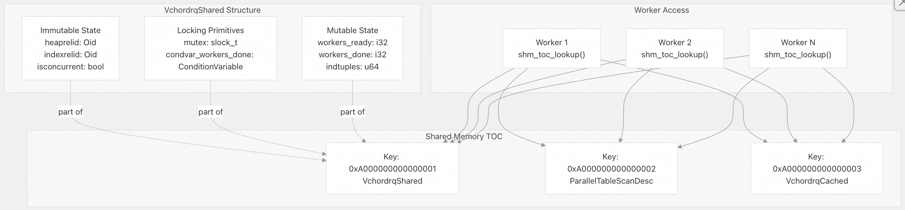
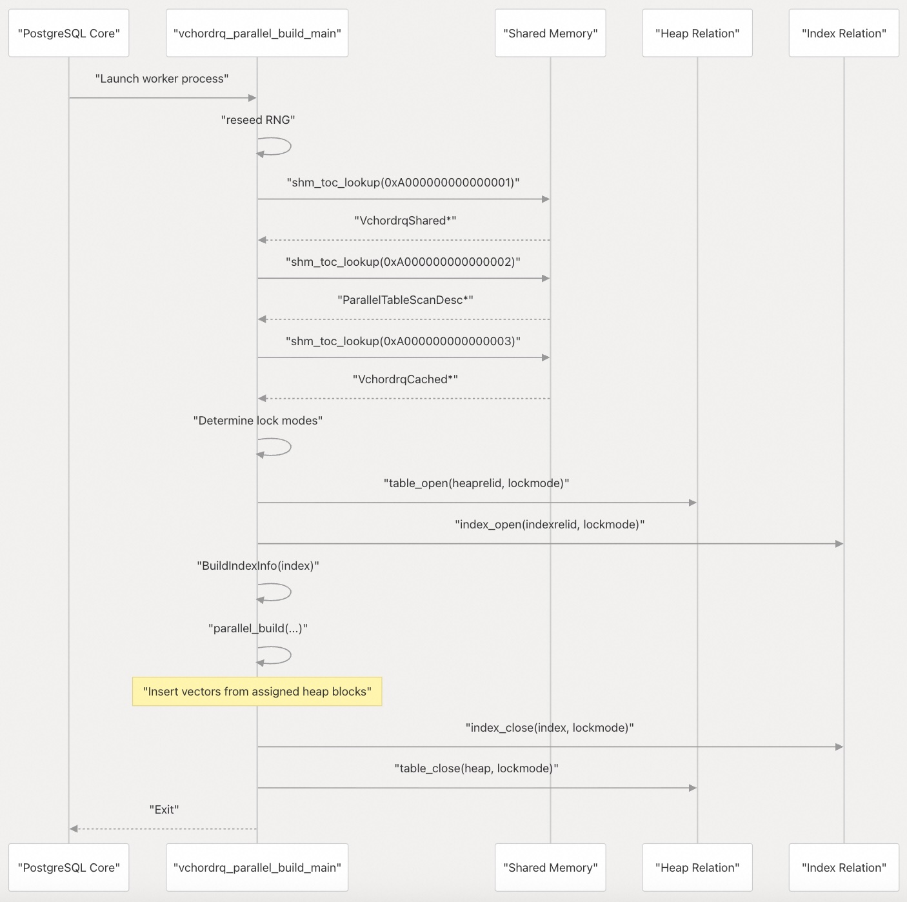
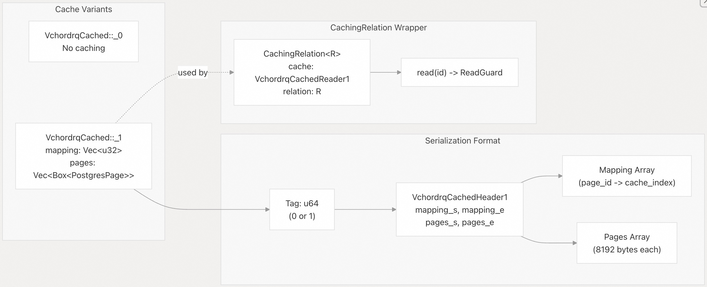
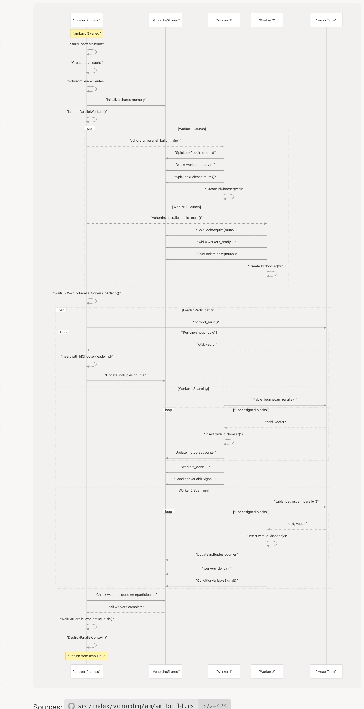
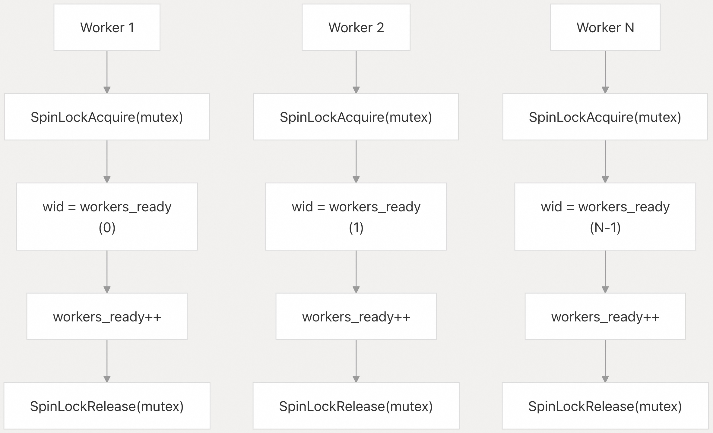

## VectorChord 源码学习: 3.1.4 并行构建基础设施 (Parallel Build Infrastructure)  
                          
### 作者                          
digoal                          
                          
### 日期                          
2025-10-31                          
                          
### 标签                          
VectorChord , 源码学习                          
                          
----                          
                          
## 背景                          
本文介绍 VectorChord 的**并行索引构建基础设施（Parallel Index Building Infrastructure）**，重点介绍实现并发索引构建的**Leader-Worker（领导者-工作者）协调模型**、**共享内存结构（Shared Memory Structures）**和**页面缓存（Page Caching）机制**。  
  
## 概览 (Overview)  
  
`vchordrq` 和 `vchordg` 两种索引类型都支持在 PostgreSQL 17 及更高版本上进行**并行索引构建（Parallel Index Building）**，这在其**访问方法处理程序（Access Method handlers）**中通过 `amcanbuildparallel = true` 指明。  
  
**并行构建（Parallel Building）**将**堆表扫描（heap table scan）**分配给多个**工作进程（worker processes）**，每个进程独立地将向量插入到索引结构中。这种方法显著缩短了大型数据集的索引创建时间，同时通过针对工作进程的插入策略保持了**确定性行为（deterministic behavior）**。  
  
并行构建基础设施包含三个主要阶段：  
  
1.  **初始化 (Initialization)**：Leader（领导者）进程设置**共享内存（Shared Memory）**并启动**工作进程（workers）**。  
2.  **并行插入 (Parallel Insertion)**：**工作进程（Workers）**并发扫描**堆（heap）**并插入**向量（vectors）**。  
3.  **同步 (Synchronization)**：**Leader（领导者）**等待所有**工作进程（workers）**完成。  
  
来源:   
- [`src/index/vchordrq/am/am_build.rs` 266-431](https://github.com/tensorchord/VectorChord/blob/ac12e257/src/index/vchordrq/am/am_build.rs#L266-L431)  
- [`src/index/vchordrq/am/mod.rs` 98-101](https://github.com/tensorchord/VectorChord/blob/ac12e257/src/index/vchordrq/am/mod.rs#L98-L101)  
  
## 启用条件 (Enabling Conditions)  
  
当满足以下条件时，将启用**并行构建（Parallel Building）**：  
  
| 条件 (Condition) | 实现 (Implementation) | 位置 (Location) |  
| :--- | :--- | :--- |  
| PostgreSQL 版本 | PG 17+ | [`src/index/vchordrq/am/mod.rs` 98-101](https://github.com/tensorchord/VectorChord/blob/ac12e257/src/index/vchordrq/am/mod.rs#L98-L101) |  
| **工作进程（Worker）**可用性 | `plan_create_index_workers() > 0` | [`src/index/vchordrq/am/am_build.rs` 605-616](https://github.com/tensorchord/VectorChord/blob/ac12e257/src/index/vchordrq/am/am_build.rs#L605-L616) |  
| 表选项 | **堆表（heap table）**上的 `parallel_workers` 设置 | [`src/index/vchordrq/am/am_build.rs` 617-628](https://github.com/tensorchord/VectorChord/blob/ac12e257/src/index/vchordrq/am/am_build.rs#L617-L628) |  
| **并行模式（Parallel Mode）**进入 | `EnterParallelMode()` 成功 | [`src/index/vchordrq/am/am_build.rs` 636-638](https://github.com/tensorchord/VectorChord/blob/ac12e257/src/index/vchordrq/am/am_build.rs#L636-L638) |  
| **工作进程（Worker）**启动 | 至少一个**工作进程（worker）**成功启动 | [`src/index/vchordrq/am/am_build.rs` 726-738](https://github.com/tensorchord/VectorChord/blob/ac12e257/src/index/vchordrq/am/am_build.rs#L726-L738) |  
  
如果任何条件不满足，系统将通过 `sequential_build()` 自动回退到**顺序构建（sequential building）**。  
  
来源:  
- [`src/index/vchordrq/am/am_build.rs` 605-738](https://github.com/tensorchord/VectorChord/blob/ac12e257/src/index/vchordrq/am/am_build.rs#L605-L738)  
- [`src/index/vchordrq/am/mod.rs` 98-101](https://github.com/tensorchord/VectorChord/blob/ac12e257/src/index/vchordrq/am/mod.rs#L98-L101)  
  
## 架构组件 (Architecture Components)  
  
### 共享内存结构 (Shared Memory Structure)  
  
`VchordrqShared` 结构通过 PostgreSQL 的**动态共享内存（Dynamic Shared Memory, DSM）**系统协调**工作进程（worker processes）**：  
  
  
  
**VchordrqShared 字段：**  
  
* **不可变（Immutable）**：关系 OIDs 和并发构建标志，由 **Leader（领导者）**一次性设置。  
* **锁定（Locking）**：**自旋锁（Spinlock, `mutex`）**保护可变状态；**条件变量（condition variable, `condvar_workers_done`）**发出完成信号。  
* **可变（Mutable）**：**工作进程（Worker）**计数器和**元组计数（tuple count）**，在**自旋锁（Spinlock）**保护下更新。  
  
该结构通过 `shm_toc_allocate()` 在 **DSM** 中分配，并由 **Leader（领导者）**初始化。**工作进程（Workers）**使用键 `0xA000000000000001` 通过 `shm_toc_lookup()` 检索它。  
  
来源:  
- [`src/index/vchordrq/am/am_build.rs` 433-447](https://github.com/tensorchord/VectorChord/blob/ac12e257/src/index/vchordrq/am/am_build.rs#L433-L447)  
- [`src/index/vchordrq/am/am_build.rs` 682-720](https://github.com/tensorchord/VectorChord/blob/ac12e257/src/index/vchordrq/am/am_build.rs#L682-L720)  
- [`src/index/vchordrq/am/am_build.rs` 779-790](https://github.com/tensorchord/VectorChord/blob/ac12e257/src/index/vchordrq/am/am_build.rs#L779-L790)  
  
### Leader（领导者）进程结构 (Leader Process Structure)  
  
`VchordrqLeader` 结构管理**并行上下文（Parallel Context）**的生命周期：  
```  
struct VchordrqLeader {  
    pcxt: *mut ParallelContext,         // PostgreSQL parallel context  
    nparticipants: i32,                 // Leader + workers count  
    snapshot: Snapshot,                 // MVCC snapshot or SnapshotAny  
    vchordrqshared: *mut VchordrqShared, // Shared coordination structure  
    tablescandesc: *mut ParallelTableScanDescData, // Parallel scan descriptor  
    vchordrqcached: *const u8,          // Serialized page cache  
}  
```  
  
**Leader（领导者）**的职责包括：  
  
1.  **上下文创建（Context Creation）**：使用库 `"vchord"` 和**入口点（Entry Point）**`"vchordrq_parallel_build_main"` 分配**并行上下文（Parallel Context）**。  
2.  **内存估算（Memory Estimation）**：计算共享结构的 **DSM** 空间。  
3.  **工作进程启动（Worker Launch）**：通过 `LaunchParallelWorkers()` 启动**工作进程（worker processes）**。  
4.  **参与（Participation）**：**Leader（领导者）**自身通过调用 `parallel_build()` 参与构建。  
5.  **同步（Synchronization）**：使用**条件变量（condition variable）**等待所有**工作进程（workers）**。  
6.  **清理（Cleanup）**：在 `Drop` 实现中销毁**并行上下文（Parallel Context）**。  
  
来源:  
- [`src/index/vchordrq/am/am_build.rs` 589-770](https://github.com/tensorchord/VectorChord/blob/ac12e257/src/index/vchordrq/am/am_build.rs#L589-L770)  
  
### Worker（工作进程）入口点 (Worker Process Entry Point)  
  
**工作进程（Worker processes）**从 `vchordrq_parallel_build_main()` 开始执行：  
  
  
  
**工作进程（Worker）**初始化中的关键操作：  
  
* **随机数生成器重设种子（RNG Reseeding）**：每个**工作进程（worker）**重设其**随机数生成器（Random Number Generator）**的种子。  
* **锁模式选择（Lock Mode Selection）**：并发构建使用 `ShareUpdateExclusiveLock`/`RowExclusiveLock`；非并发构建使用 `ShareLock`/`AccessExclusiveLock`。  
* **关系打开（Relation Opening）**：**工作进程（Workers）**独立打开**堆（heap）**和**索引关系（index relations）**。  
  
来源:  
- [`src/index/vchordrq/am/am_build.rs` 774-823](https://github.com/tensorchord/VectorChord/blob/ac12e257/src/index/vchordrq/am/am_build.rs#L774-L823)  
  
## 页面缓存系统 (Page Caching System)  
  
`VchordrqCached` 系统通过将频繁访问的**索引页面（Index Pages）**预加载到**共享内存（Shared Memory）**中，减少了**并行构建（Parallel Builds）**期间的 **I/O 竞争（I/O Contention）**。  
  
### 缓存结构 (Cache Structure)  
  
  
  
缓存创建受 `pin` 构建选项控制：  
  
1.  **缓存追踪（Cache Tracing）**：`vchordrq::cache()` 通过模拟索引操作识别**热页面（Hot Pages）**。  
2.  **页面收集（Page Collection）**：**热页面（Hot Pages）**被读取并装箱（boxed）到内存中。  
3.  **映射生成（Mapping Generation）**：一个映射数组将**页面 ID（page IDs）**转换为缓存索引。  
4.  **序列化（Serialization）**：缓存被序列化为一个**字节缓冲区（byte buffer）**，用于 **DSM** 放置。  
  
在**并行构建（parallel builds）**期间，**工作进程（workers）**使用 `CachingRelation`，它会拦截 `read()` 调用，并在可用时返回缓存的页面，从而避免**缓冲区管理器（Buffer Manager）竞争**。  
  
来源:  
- [`src/index/vchordrq/am/am_build.rs` 353-371](https://github.com/tensorchord/VectorChord/blob/ac12e257/src/index/vchordrq/am/am_build.rs#L353-L371)  
- [`src/index/vchordrq/am/am_build.rs` 449-579](https://github.com/tensorchord/VectorChord/blob/ac12e257/src/index/vchordrq/am/am_build.rs#L449-L579)  
- [`src/index/vchordrq/am/am_build.rs` 1363-1448](https://github.com/tensorchord/VectorChord/blob/ac12e257/src/index/vchordrq/am/am_build.rs#L1363-L1448)  
  
## 并行构建流程 (Parallel Build Process Flow)  
  
  
  
来源:  
- [`src/index/vchordrq/am/am_build.rs` 372-424](https://github.com/tensorchord/VectorChord/blob/ac12e257/src/index/vchordrq/am/am_build.rs#L372-L424)  
- [`src/index/vchordrq/am/am_build.rs` 825-941](https://github.com/tensorchord/VectorChord/blob/ac12e257/src/index/vchordrq/am/am_build.rs#L825-L941)  
  
## 确定性插入策略 (Deterministic Insertion Strategy)  
  
为了避免多个**工作进程（workers）**向**共享数据结构（shared data structures）**插入数据时发生冲突，**并行构建（parallel build）**使用基于**工作进程 ID（Worker IDs）**的**确定性插入策略（Deterministic Insertion Strategy）**。  
  
### 选择器（Chooser）实现 (Chooser Implementations)  
  
| 上下文 (Context) | **选择器（Chooser）**类型 | 行为 (Behavior) | 位置 (Location) |  
| :--- | :--- | :--- | :--- |  
| **顺序构建（Sequential Build）** | `ChooseZero` | 始终返回 0 | [`src/index/vchordrq/am/am_build.rs` 965-970](https://github.com/tensorchord/VectorChord/blob/ac12e257/src/index/vchordrq/am/am_build.rs#L965-L970) |  
| **并行构建（Parallel Build）** | `IdChooser(wid)` | 返回 `wid % n` | [`src/index/vchordrq/am/am_build.rs` 862-867](https://github.com/tensorchord/VectorChord/blob/ac12e257/src/index/vchordrq/am/am_build.rs#L862-L867) |  
| 常规插入（Regular Insert） | `RngChooser` | 随机选择 | [`src/index/vchordrq/am/mod.rs` 306-311](https://github.com/tensorchord/VectorChord/blob/ac12e257/src/index/vchordrq/am/mod.rs#L306-L311) |  
  
**IdChooser 实现：**  
```  
struct IdChooser(u32);  // Worker ID  
  
impl Chooser for IdChooser {  
    fn choose(&mut self, n: NonZero<usize>) -> usize {  
        self.0 as usize % n.get()  
    }  
}  
```  
  
当**工作进程（worker）**需要选择写入哪个**可附加磁带（appendable tape）**时（当存在 `n` 个磁带时），`IdChooser` 会确定性地将**工作进程 ID（worker ID）**映射到磁带索引。这确保了：  
  
1.  **无写入冲突（No Write Conflicts）**：不同的**工作进程（workers）**自然会选择不同的**磁带（tapes）**（当 `n ≥ nworkers` 时）。  
2.  **负载均衡（Load Balancing）**：**工作进程（Workers）**在**磁带（tapes）**上均匀分布。  
3.  **可重现性（Reproducibility）**：无论调度如何，数据分布结果保持一致。  
  
选择器使用标志 `insert(parallel=true, is_build=true)` 来指示向量插入采用并行构建模式。  
  
来源:  
- [`src/index/vchordrq/am/am_build.rs` 862-886](https://github.com/tensorchord/VectorChord/blob/ac12e257/src/index/vchordrq/am/am_build.rs#L862-L886)  
- [`src/index/vchordrq/am/mod.rs` 306-311](https://github.com/tensorchord/VectorChord/blob/ac12e257/src/index/vchordrq/am/mod.rs#L306-L311)  
  
## 工作进程协调 (Worker Coordination)  
  
### 工作进程 ID 分配 (Worker ID Assignment)  
  
**工作进程（Workers）**在初始化期间通过原子递增 `workers_ready` 来获取唯一 ID：  
  
  
  
此模式确保每个**工作进程（worker）**获得一个唯一的、顺序的 ID（0 到 N-1），该 ID 用于构造 `IdChooser`。  
  
### 进度跟踪 (Progress Tracking)  
  
每个**堆元组（heap tuple）**处理后，**工作进程（Workers）**更新**元组计数器（tuple counter）**：  
```  
unsafe {  
    let indtuples;  
    {  
        pgrx::pg_sys::SpinLockAcquire(&raw mut (*vchordrqshared).mutex);  
        (*vchordrqshared).indtuples += 1;  
        indtuples = (*vchordrqshared).indtuples;  
        pgrx::pg_sys::SpinLockRelease(&raw mut (*vchordrqshared).mutex);  
    }  
    callback(indtuples);  
}  
```  
  
回调函数将进度报告给 PostgreSQL 的**进度报告系统（progress reporting system）**，允许用户通过 `pg_stat_progress_create_index` 监控索引创建。  
  
### 完成信号发送 (Completion Signaling)  
  
当**工作进程（worker）**完成其分配的**堆块（heap blocks）**时，它发出完成信号：  
```  
unsafe {  
    pgrx::pg_sys::SpinLockAcquire(&raw mut (*vchordrqshared).mutex);  
    (*vchordrqshared).workers_done += 1;  
    pgrx::pg_sys::SpinLockRelease(&raw mut (*vchordrqshared).mutex);  
    pgrx::pg_sys::ConditionVariableSignal(&raw mut (*vchordrqshared).condvar_workers_done);  
}  
```  
  
**Leader（领导者）**等待所有参与者（Leader + Workers）完成。  
```  
loop {  
    pgrx::pg_sys::SpinLockAcquire(&raw mut (*leader.vchordrqshared).mutex);  
    if (*leader.vchordrqshared).workers_done == nparticipants {  
        pgrx::pg_sys::SpinLockRelease(&raw mut (*leader.vchordrqshared).mutex);  
        break;  
    }  
    pgrx::pg_sys::SpinLockRelease(&raw mut (*leader.vchordrqshared).mutex);  
    pgrx::pg_sys::ConditionVariableSleep(  
        &raw mut (*leader.vchordrqshared).condvar_workers_done,  
        WAIT_EVENT_PARALLEL_CREATE_INDEX_SCAN,  
    );  
}  
```  
  
来源:  
- [`src/index/vchordrq/am/am_build.rs` 888-897](https://github.com/tensorchord/VectorChord/blob/ac12e257/src/index/vchordrq/am/am_build.rs#L888-L897)  
- [`src/index/vchordrq/am/am_build.rs` 935-940](https://github.com/tensorchord/VectorChord/blob/ac12e257/src/index/vchordrq/am/am_build.rs#L935-L940)  
- [`src/index/vchordrq/am/am_build.rs` 394-409](https://github.com/tensorchord/VectorChord/blob/ac12e257/src/index/vchordrq/am/am_build.rs#L394-L409)  
  
## 快照处理 (Snapshot Handling)  
  
**并行构建（parallel build）**通过使用适当的**快照（snapshots）**来遵循 **MVCC 语义（MVCC semantics）**：  
  
| 构建模式 (Build Mode) | **快照（Snapshot）**类型 | 注册 (Registration) | 位置 (Location) |  
| :--- | :--- | :--- | :--- |  
| 并发（Concurrent, `ii_Concurrent = true`） | `SNAPSHOT_MVCC` | 注册的事务**快照（snapshot）** | [`src/index/vchordrq/am/am_build.rs` 647-649](https://github.com/tensorchord/VectorChord/blob/ac12e257/src/index/vchordrq/am/am_build.rs#L647-L649) |  
| 非并发（Non-Concurrent） | `SnapshotAny` | 静态**快照（snapshot）**，不注册 | [`src/index/vchordrq/am/am_build.rs` 650-651](https://github.com/tensorchord/VectorChord/blob/ac12e257/src/index/vchordrq/am/am_build.rs#L650-L651) |  
  
**快照（Snapshot）**由 **Leader（领导者）**在上下文设置期间初始化，并通过**并行表扫描描述符（parallel table scan descriptor）**与**工作进程（workers）**共享。**工作进程（Workers）**使用 `table_beginscan_parallel()`，它会自动使用**并行扫描描述符（parallel scan descriptor）**中配置的**快照（snapshot）**。  
  
对于并发构建，**Leader（领导者）**仅在**快照（snapshot）**已注册的情况下才在清理期间注销它，从而防止**快照泄露（snapshot leaks）**。  
  
来源:  
- [`src/index/vchordrq/am/am_build.rs` 647-651](https://github.com/tensorchord/VectorChord/blob/ac12e257/src/index/vchordrq/am/am_build.rs#L647-L651)  
- [`src/index/vchordrq/am/am_build.rs` 762-764](https://github.com/tensorchord/VectorChord/blob/ac12e257/src/index/vchordrq/am/am_build.rs#L762-L764)  
- [`src/index/vchordrq/am/am_build.rs` 581-587](https://github.com/tensorchord/VectorChord/blob/ac12e257/src/index/vchordrq/am/am_build.rs#L581-L587)  
  
## 错误处理与资源清理 (Error Handling and Resource Cleanup)  
  
`VchordrqLeader` 实现了 `Drop` 接口以确保适当的**清理（cleanup）**：  
```  
impl Drop for VchordrqLeader {  
    fn drop(&mut self) {  
        if !std::thread::panicking() {  
            unsafe {  
                pgrx::pg_sys::WaitForParallelWorkersToFinish(self.pcxt);  
                if is_mvcc_snapshot(self.snapshot) {  
                    pgrx::pg_sys::UnregisterSnapshot(self.snapshot);  
                }  
                pgrx::pg_sys::DestroyParallelContext(self.pcxt);  
                pgrx::pg_sys::ExitParallelMode();  
            }  
        }  
    }  
}  
```  
  
`!std::thread::panicking()` 检查可防止在**栈展开（stack unwinding）**期间发生**二次panic异常（double-panics）**。如果发生错误：  
  
1.  **工作进程（Workers）**由 PostgreSQL 的错误处理机制终止。  
2.  **Leader（领导者）**的 `Drop` 等待**工作进程（workers）**完成。  
3.  **并行上下文（Parallel context）**和模式被清理。  
4.  原始错误传播给调用者。  
  
**Leader（领导者）**还在多个点检查上下文创建是否失败：  
  
* **DSM 分配失败**：如果 `InitializeParallelDSM()` 未能分配**共享内存（shared memory）**。  
* **工作进程启动失败**：如果没有**工作进程（workers）**成功启动。  
  
在这两种情况下，系统在**清理（cleanup）**后都会回退到**顺序构建（sequential building）**。  
  
来源:  
- [`src/index/vchordrq/am/am_build.rs` 757-770](https://github.com/tensorchord/VectorChord/blob/ac12e257/src/index/vchordrq/am/am_build.rs#L757-L770)  
- [`src/index/vchordrq/am/am_build.rs` 670-679](https://github.com/tensorchord/VectorChord/blob/ac12e257/src/index/vchordrq/am/am_build.rs#L670-L679)  
- [`src/index/vchordrq/am/am_build.rs` 728-737](https://github.com/tensorchord/VectorChord/blob/ac12e257/src/index/vchordrq/am/am_build.rs#L728-L737)  
  
## 对比：vchordrq 与 vchordg  
  
两种索引类型共享相似的**并行构建基础设施（parallel build infrastructure）**，但存在细微差异：  
  
| 方面 (Aspect) | `vchordrq` | `vchordg` | 备注 (Notes) |  
| :--- | :--- | :--- | :--- |  
| **共享结构（Shared Structure）** | `VchordrqShared` | `VchordgShared` | `vchordg` 省略了 `workers_ready` 字段 |  
| **Leader（领导者）结构** | `VchordrqLeader` | `VchordgLeader` | 设计相同 |  
| **入口点（Entry Point）** | `vchordrq_parallel_build_main` | `vchordg_parallel_build_main` | 函数名称不同 |  
| **页面缓存（Page Caching）** | 通过 `VchordrqCached::_1` 支持 | 不支持 | 只有 `vchordrq` 缓存页面 |  
| **确定性选择器（Deterministic Chooser）** | `IdChooser(wid)` | 不适用 (N/A) | `vchordg` 不使用**选择器（chooser）**模式 |  
  
`vchordg` 的实现更简单，因为它不需要 **确定性插入策略（deterministic insertion strategies）** —— 它的 **图结构（graph structure）** 处理 **并发插入（concurrent insertions）** 的方式与 `vchordrq` 的 **基于磁带（tape-based）的存储** 不同。  
  
来源:  
- [`src/index/vchordg/am/am_build.rs` 261-274](https://github.com/tensorchord/VectorChord/blob/ac12e257/src/index/vchordg/am/am_build.rs#L261-L274)  
- [`src/index/vchordrq/am/am_build.rs` 433-447](https://github.com/tensorchord/VectorChord/blob/ac12e257/src/index/vchordrq/am/am_build.rs#L433-L447)  
- [`src/index/vchordg/am/am_build.rs` 467-516](https://github.com/tensorchord/VectorChord/blob/ac12e257/src/index/vchordg/am/am_build.rs#L467-L516)  
- [`src/index/vchordrq/am/am_build.rs` 774-823](https://github.com/tensorchord/VectorChord/blob/ac12e257/src/index/vchordrq/am/am_build.rs#L774-L823)  
    
#### [期望 PostgreSQL|开源PolarDB 增加什么功能?](https://github.com/digoal/blog/issues/76 "269ac3d1c492e938c0191101c7238216")
  
  
#### [PolarDB 开源数据库](https://openpolardb.com/home "57258f76c37864c6e6d23383d05714ea")
  
  
#### [PolarDB 学习图谱](https://www.aliyun.com/database/openpolardb/activity "8642f60e04ed0c814bf9cb9677976bd4")
  
  
#### [PostgreSQL 解决方案集合](../201706/20170601_02.md "40cff096e9ed7122c512b35d8561d9c8")
  
  
#### [德哥 / digoal's Github - 公益是一辈子的事.](https://github.com/digoal/blog/blob/master/README.md "22709685feb7cab07d30f30387f0a9ae")
  
  
#### [About 德哥](https://github.com/digoal/blog/blob/master/me/readme.md "a37735981e7704886ffd590565582dd0")
  
  

  
