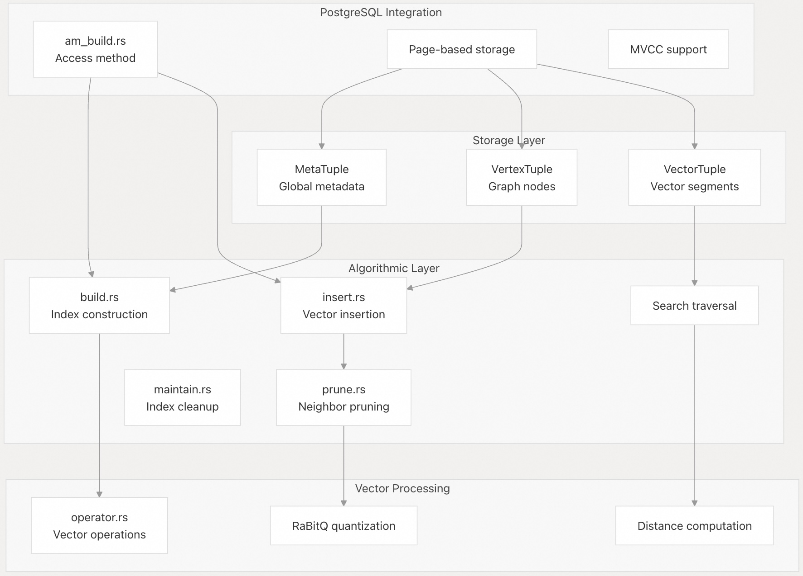
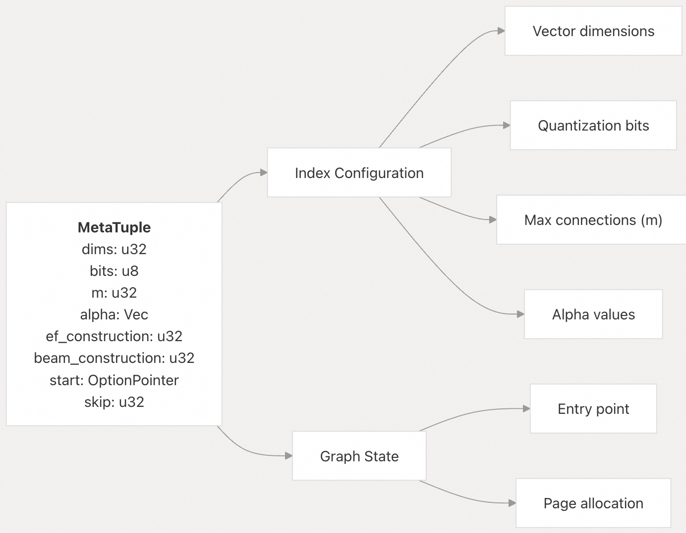
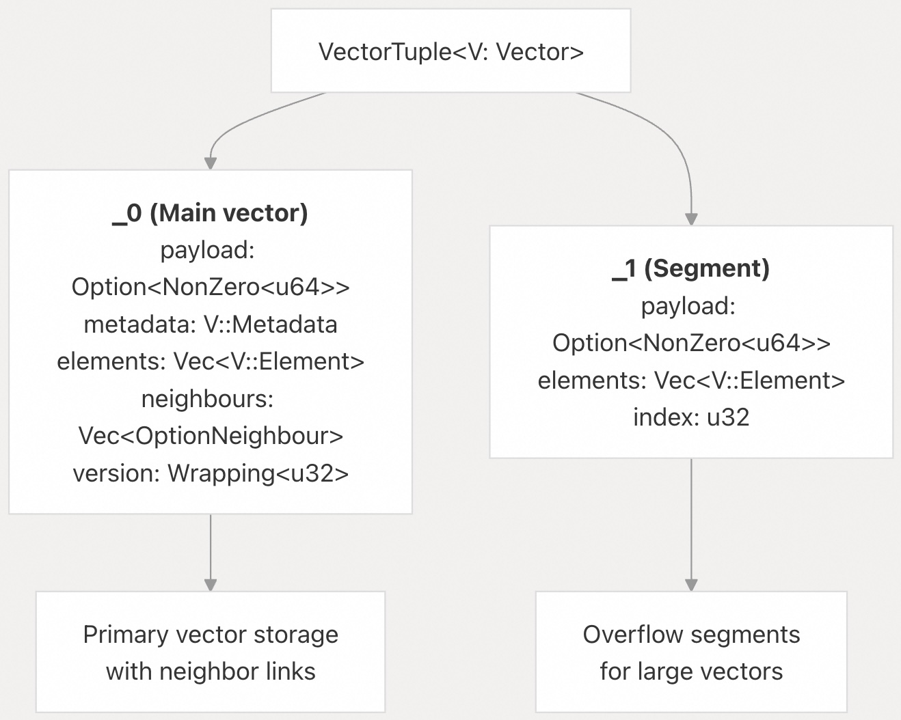
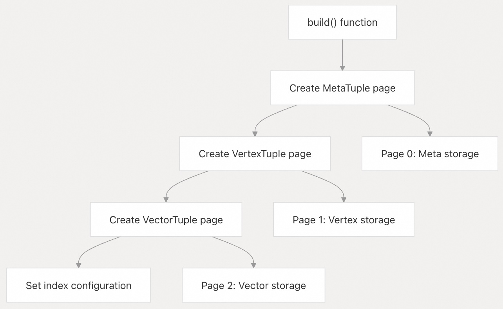
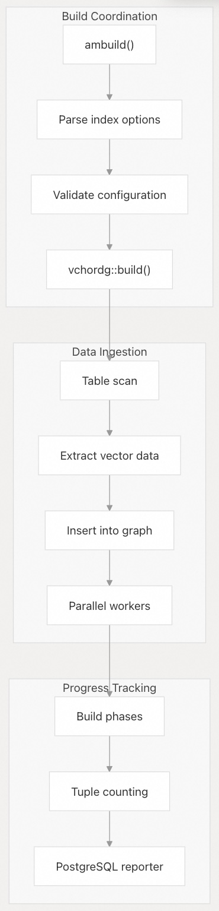
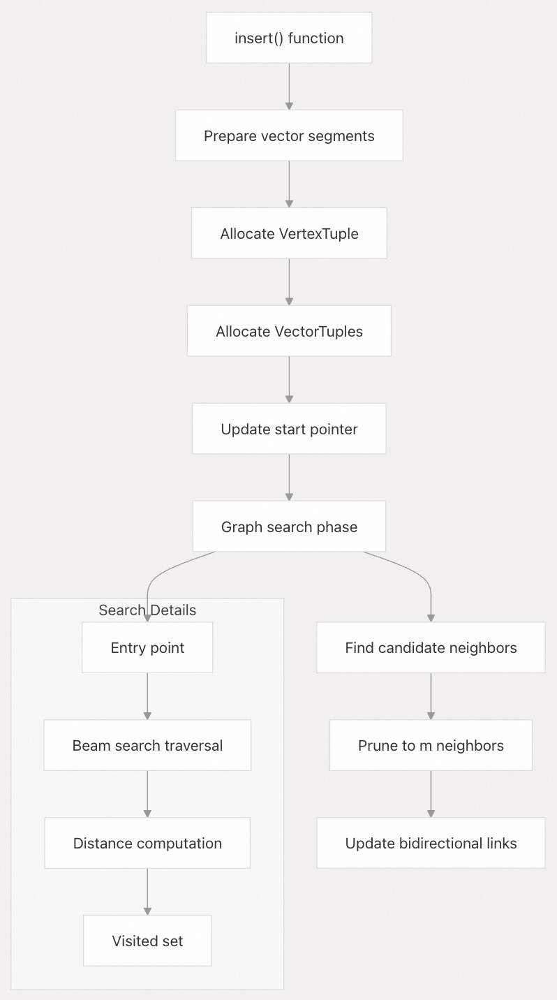
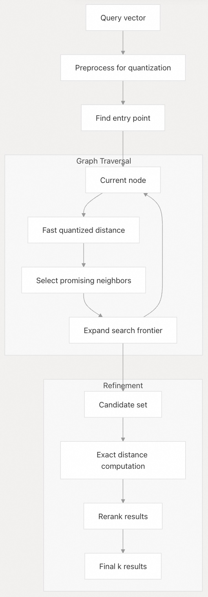
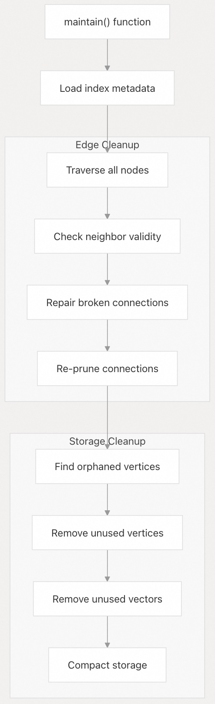
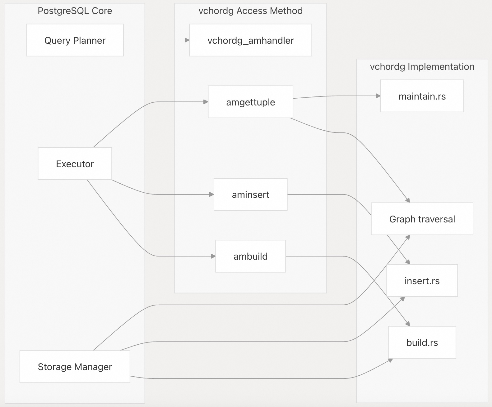

## VectorChord 源码学习: 3.2 vchordg 索引方法 (Index Method)    
                              
### 作者                              
digoal                              
                              
### 日期                              
2025-10-31                              
                              
### 标签                              
VectorChord , 源码学习                              
                              
----                              
                              
## 背景                              
`vchordg` 索引方法 (index method) 为 `VectorChord` 实现了一个**基于图的向量相似性搜索算法 (graph-based vector similarity search algorithm)**。它利用**量化向量表示 (quantized vector representations)** 和一种**可导航小世界图 (Navigable Small World, NSW graph)** 结构，提供了**近似最近邻 (Approximate Nearest Neighbor, ANN)** 搜索能力，以实现高效存储和快速距离计算。    
    
本文涵盖了 `vchordg` 索引方法的内部**架构 (architecture)**、**数据结构 (data structures)**、**算法 (algorithms)** 和 **PostgreSQL 集成 (PostgreSQL integration)**。    
    
## 架构概览 (Architecture Overview)    
    
`vchordg` 索引方法实现了一种类似于 **HNSW (Hierarchical Navigable Small World)** 的**基于图的 ANN 算法**，但针对 **PostgreSQL 的基于页面的存储模型 (PostgreSQL's page-based storage model)** 进行了优化。该架构由三个主要的存储组件 (storage components) 和几个算法模块 (algorithmic modules) 组成。    
    
    
    
**来源:**    
- [`crates/vchordg/src/types.rs` 1-148](https://github.com/tensorchord/VectorChord/blob/ac12e257/crates/vchordg/src/types.rs#L1-L148)    
- [`crates/vchordg/src/tuples.rs` 1-764](https://github.com/tensorchord/VectorChord/blob/ac12e257/crates/vchordg/src/tuples.rs#L1-L764)    
- [`src/index/vchordg/am/am_build.rs` 1-728](https://github.com/tensorchord/VectorChord/blob/ac12e257/src/index/vchordg/am/am_build.rs#L1-L728)    
    
## 数据结构与存储 (Data Structures and Storage)    
    
### 元组类型 (Tuple Types)    
    
`vchordg` 索引使用三种主要的**元组 (tuple) 类型**进行数据存储，每种类型都以特定的布局和访问模式序列化到 **PostgreSQL 页面 (PostgreSQL pages)** 中。    
    
#### 元数据元组结构 (MetaTuple Structure)    
    
`MetaTuple` 存储全局索引配置和状态信息：    
    
    
    
**来源:**    
- [`crates/vchordg/src/tuples.rs` 49-206](https://github.com/tensorchord/VectorChord/blob/ac12e257/crates/vchordg/src/tuples.rs#L49-L206)    
    
#### 顶点元组结构 (VertexTuple Structure)    
    
每个 `VertexTuple` 代表一个图节点 (graph node)，包含**量化向量代码 (quantized vector codes)** 和**连接性信息 (connectivity information)**：    
    
| 字段 (Field) | 类型 (Type) | 用途 (Purpose) |    
| :--- | :--- | :--- |    
| `metadata` | `[f32; 3]` | 量化元数据 (Quantization metadata) |    
| `elements` | `Vec<u64>` | 打包的量化代码 (Packed quantized code) |    
| `payload` | `Option<NonZero<u64>>` | 行标识符 (Row identifier) |    
| `pointers` | `Vec<Pointer>` | 向量段引用 (Vector segment references) |    
    
**来源:**    
- [`crates/vchordg/src/tuples.rs` 208-339](https://github.com/tensorchord/VectorChord/blob/ac12e257/crates/vchordg/src/tuples.rs#L208-L339)    
    
#### 向量元组变体 (VectorTuple Variants)    
    
`VectorTuple` 枚举 (enum) 存储实际的向量数据，采用两种针对不同用例优化的格式：    
    
    
    
**来源:**    
- [`crates/vchordg/src/tuples.rs` 342-646](https://github.com/tensorchord/VectorChord/blob/ac12e257/crates/vchordg/src/tuples.rs#L342-L646)    
    
### 向量量化集成 (Vector Quantization Integration)    
    
`vchordg` 索引集成了 **RaBitQ 量化 (quantization)**，以实现紧凑存储和快速近似距离计算：    
    
    
    
**来源:**    
- [`crates/vchordg/src/operator.rs` 37-78](https://github.com/tensorchord/VectorChord/blob/ac12e257/crates/vchordg/src/operator.rs#L37-L78)    
- [`crates/vchordg/src/operator.rs` 111-118](https://github.com/tensorchord/VectorChord/blob/ac12e257/crates/vchordg/src/operator.rs#L111-L118)    
    
## 索引构建过程 (Index Building Process)    
    
### 构建算法 (Build Algorithm)    
    
索引构建过程初始化图结构 (graph structure) 并准备插入向量：    
    
    
    
**来源:**    
- [`crates/vchordg/src/build.rs` 21-68](https://github.com/tensorchord/VectorChord/blob/ac12e257/crates/vchordg/src/build.rs#L21-L68)    
    
### PostgreSQL 集成 (PostgreSQL Integration)    
    
**PostgreSQL 访问方法 (access method)** 集成处理并行构建和事务管理 (transaction management)：    
    
    
    
**来源:**    
- [`src/index/vchordg/am/am_build.rs` 181-259](https://github.com/tensorchord/VectorChord/blob/ac12e257/src/index/vchordg/am/am_build.rs#L181-L259)    
- [`src/index/vchordg/am/am_build.rs` 518-571](https://github.com/tensorchord/VectorChord/blob/ac12e257/src/index/vchordg/am/am_build.rs#L518-L571)    
    
## 向量插入算法 (Vector Insertion Algorithm)    
    
### 插入过程 (Insertion Process)    
    
向量插入算法实现了一种基于图的方法，包括**邻居发现 (neighbor discovery)** 和**剪枝 (pruning)**：    
    
    
    
**来源:**    
- [`crates/vchordg/src/insert.rs` 33-302](https://github.com/tensorchord/VectorChord/blob/ac12e257/crates/vchordg/src/insert.rs#L33-L302)    
    
### 邻居选择与剪枝 (Neighbor Selection and Pruning)    
    
剪枝算法 (pruning algorithm) 在限制节点度 (node degree) 的同时保持图的连接性 (connectivity)：    
    
| 参数 (Parameter) | 用途 (Purpose) | 默认值 (Default) |    
| :--- | :--- | :--- |    
| `m` | 每节点最大连接数 (Maximum connections per node) | 32 |    
| `alpha` | 用于鲁棒性 (robustness) 的剪枝因子 (Pruning factors for robustness) | [1.0, 1.2] |    
| `ef_construction` | 插入时的搜索宽度 (Search width during insertion) | 64 |    
| `beam_construction` | 并行搜索束 (Parallel search beams) | 1 |    
    
鲁棒性剪枝算法 (robust pruning algorithm) 确保：    
* 节点保持良好的连接性 (connectivity)    
* 基于距离的邻居选择 (Distance-based neighbor selection)    
* 支持多个 `alpha` 值进行分层剪枝 (hierarchical pruning)    
    
**来源:**    
- [`crates/vchordg/src/prune.rs` 19-72](https://github.com/tensorchord/VectorChord/blob/ac12e257/crates/vchordg/src/prune.rs#L19-L72)    
- [`crates/vchordg/src/types.rs` 22-80](https://github.com/tensorchord/VectorChord/blob/ac12e257/crates/vchordg/src/types.rs#L22-L80)    
    
## 搜索操作 (Search Operations)    
    
### 图遍历 (Graph Traversal)    
    
搜索操作使用量化代码 (quantized codes) 进行快速距离近似 (fast distance approximation)，随后进行**精确的重新排序 (exact reranking)**：    
    
    
    
**来源:**    
- [`crates/vchordg/src/insert.rs` 134-200](https://github.com/tensorchord/VectorChord/blob/ac12e257/crates/vchordg/src/insert.rs#L134-L200)    
    
## 索引维护 (Index Maintenance)    
    
### 清理操作 (Cleanup Operations)    
    
维护算法移除损坏的边 (broken edges) 和未使用的存储空间 (unused storage)：    
    
    
    
**来源:**    
- [`crates/vchordg/src/maintain.rs` 25-195](https://github.com/tensorchord/VectorChord/blob/ac12e257/crates/vchordg/src/maintain.rs#L25-L195)    
    
## 配置与调优 (Configuration and Tuning)    
    
### 索引选项 (Index Options)    
    
`VchordgIndexOptions` 结构控制索引行为：    
```    
pub struct VchordgIndexOptions {    
    pub bits: u8,                    // Quantization bits (1-2)    
    pub m: u32,                      // Max connections (1-512)      
    pub alpha: Vec<f32>,             // Pruning factors (1.0-2.0)    
    pub ef_construction: u32,        // Construction search width    
    pub beam_construction: u32,      // Parallel construction beams    
}    
```    
    
### 性能考量 (Performance Considerations)    
    
| 参数 (Parameter) | 影响 (Impact) | 调优指南 (Tuning Guidance) |    
| :--- | :--- | :--- |    
| `bits` | 存储与准确性之间的权衡 (Storage vs accuracy tradeoff) | 推荐 2 bits |    
| `m` | 图连接性 (Graph connectivity) | 越高 = 召回率 (recall) 越好，存储空间越大 |    
| `alpha` | 剪枝鲁棒性 (Pruning robustness) | 多个值用于分层剪枝 (hierarchical pruning) |    
| `ef_construction` | 构建质量 (Build quality) | 越高 = 质量越好，构建越慢 |    
    
**来源:**    
- [`crates/vchordg/src/types.rs` 20-80](https://github.com/tensorchord/VectorChord/blob/ac12e257/crates/vchordg/src/types.rs#L20-L80)    
- [`src/index/vchordg/types.rs` 19-25](https://github.com/tensorchord/VectorChord/blob/ac12e257/src/index/vchordg/types.rs#L19-L25)    
    
## 与 PostgreSQL 的集成 (Integration with PostgreSQL)    
    
### 访问方法接口 (Access Method Interface)    
    
`vchordg` 索引通过**访问方法 (Access Method, AM) API** 与 PostgreSQL 集成：    
    
    
    
访问方法支持：    
* 带进度报告的**并行索引构建 (Parallel index building)**    
* 支持 **MVCC (多版本并发控制)** 的并发插入    
* 高效的图遍历 (graph traversal) 搜索    
* 操作过程中的自动维护 (Automatic maintenance)    
    
**来源:**    
- [`src/index/vchordg/am/am_build.rs` 180-612](https://github.com/tensorchord/VectorChord/blob/ac12e257/src/index/vchordg/am/am_build.rs#L180-L612)    
    
# 附录: vchordg的索引维护是在DML操作过程中实时进行的? 还是vacuum时进行的?  
`vchordg` 索引的维护采用**混合模式**:  
  
### DML 操作期间的实时维护  
   
在 INSERT 操作时,索引会实时更新图结构。每次插入向量时, `aminsert` 函数会调用 `crate::index::vchordg::dispatch::insert`, 将新向量添加到图中并更新邻居连接。  
  
### VACUUM 期间的清理维护  
  
在 VACUUM 操作时,索引会执行更深层的维护工作:  
  
1. **DELETE 操作的清理**: `ambulkdelete` 函数处理已删除元组的索引项清理    
  
2. **完整的索引维护**: `amvacuumcleanup` 函数调用 `crate::index::vchordg::dispatch::maintain` 执行完整的索引维护,包括修复断裂的边、删除孤立节点和压缩存储    
  
### 总结  
  
- **INSERT**: 实时维护,立即更新图结构  
- **DELETE**: 延迟清理,在 VACUUM 时处理  
- **索引优化**: 在 VACUUM 时进行,包括边修复和存储压缩  
  
这种设计平衡了写入性能和索引质量,INSERT 操作保持高效,而 VACUUM 负责清理和优化工作。  
  
## Notes  
  
测试文件 `tests/vchordg/vacuum.slt` 和 `tests/vchordg/vacuum_parallel.slt` 展示了 VACUUM 在各种 DML 操作后的使用场景, 验证了这种维护策略 。  
    
#### [期望 PostgreSQL|开源PolarDB 增加什么功能?](https://github.com/digoal/blog/issues/76 "269ac3d1c492e938c0191101c7238216")
  
  
#### [PolarDB 开源数据库](https://openpolardb.com/home "57258f76c37864c6e6d23383d05714ea")
  
  
#### [PolarDB 学习图谱](https://www.aliyun.com/database/openpolardb/activity "8642f60e04ed0c814bf9cb9677976bd4")
  
  
#### [PostgreSQL 解决方案集合](../201706/20170601_02.md "40cff096e9ed7122c512b35d8561d9c8")
  
  
#### [德哥 / digoal's Github - 公益是一辈子的事.](https://github.com/digoal/blog/blob/master/README.md "22709685feb7cab07d30f30387f0a9ae")
  
  
#### [About 德哥](https://github.com/digoal/blog/blob/master/me/readme.md "a37735981e7704886ffd590565582dd0")
  
  

  
