## VectorChord 源码学习: 3.3 存储层与元组系统 (Storage Layer and Tuple System)    
                                
### 作者                                
digoal                                
                                
### 日期                                
2025-11-01                                
                                
### 标签                                
VectorChord , 源码学习                                
                                
----                                
                                
## 背景      
本文介绍 VectorChord 的存储基础设施 (storage infrastructure)，它为页面 (pages)、缓冲区 (buffers) 和结构化数据序列化 (structured data serialization) 提供了与 PostgreSQL 兼容的抽象。存储层 (storage layer) 由三个主要组件构成：  
  
1.  **PostgreSQL 存储抽象 (Storage Abstraction)**：页面 (Page) 和关系 (relation) 接口，封装了 PostgreSQL 的缓冲区池 (buffer pool) 和页面管理 (page management)。  
2.  **元组序列化系统 (Tuple Serialization System)**：一种类型安全 (type-safe) 的序列化框架 (serialization framework)，用于在页面中存储结构化数据。  
3.  **带状结构 (Tape Structures)**：用于组织向量 (vectors) 和索引元数据 (index metadata) 的顺序存储模式 (sequential storage patterns)。  
  
-----  
  
## PostgreSQL 存储抽象 (Storage Abstraction)  
  
VectorChord 使用 Rust 原生 (Rust-native) 的抽象来封装 PostgreSQL 基于页面的存储系统，提供了类型安全 (type safety)、RAII 语义 (RAII semantics) 和通用接口 (generic interfaces)。该抽象层 (abstraction layer) 处理与 PostgreSQL 缓冲区池 (buffer pool)、预写日志 (write-ahead logging，WAL) 和空闲空间管理 (free space management) 的所有交互。  
  
### 核心存储类型 (Core Storage Types)  
  
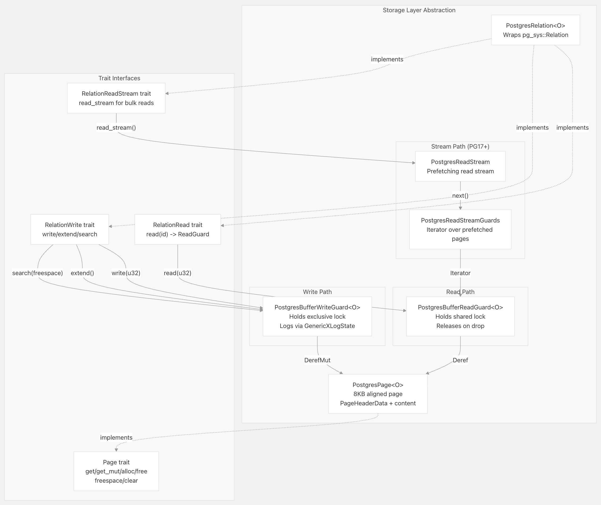  
  
来源: [`src/index/storage.rs` 28-276](https://github.com/tensorchord/VectorChord/blob/ac12e257/src/index/storage.rs#L28-L276)  
  
### 页面结构与布局 (Page Structure and Layout)  
  
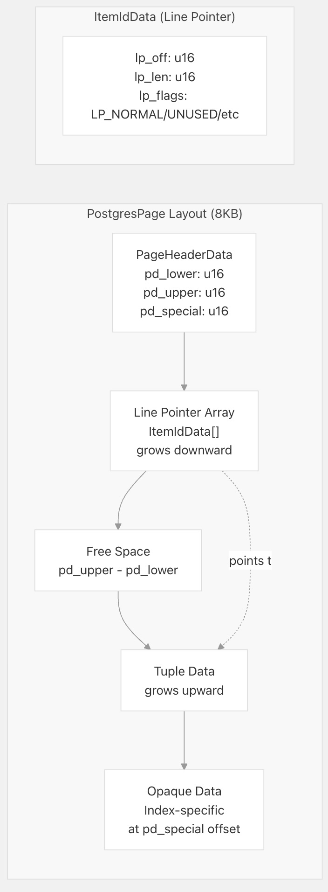  
  
`PostgresPage<O>` 类型是一个 8KB 对齐的结构体 (8KB-aligned structure)，与 PostgreSQL 的 `BLCKSZ` 大小匹配。每个页面包含：  
  
  * **Header (头部)**：标准 PostgreSQL 页面头部，包含指向空闲空间边界的指针。  
  * **Line Pointers (行指针)**：指向元组 (tuple) 位置的项标识符 (item identifiers) 数组。  
  * **Content Area (内容区)**：存储在 `pd_lower` 和 `pd_upper` 之间的可变长度元组数据 (Variable-length tuple data)。  
  * **Opaque Data (不透明数据)**：位于页面末尾的索引特定元数据 (Index-specific metadata)。  
  
来源: [`src/index/storage.rs` 28-168](https://github.com/tensorchord/VectorChord/blob/ac12e257/src/index/storage.rs#L28-L168)  
  
### 缓冲区管理与守卫 (Buffer Management and Guards)  
  
VectorChord 使用 RAII 守卫 (RAII guards) 来管理缓冲区锁 (buffer locks) 和事务日志记录 (transaction logging)：  
  
| Guard Type (守卫类型) | Lock Mode (锁模式) | Transaction Logging (事务日志记录) | Use Case (用途) |  
| :--- | :--- | :--- | :--- |  
| `PostgresBufferReadGuard` | `BUFFER_LOCK_SHARE` (共享锁) | None (无) | Read-only access to pages (对页面的只读访问) |  
| `PostgresBufferWriteGuard` | `BUFFER_LOCK_EXCLUSIVE` (独占锁) | `GenericXLogState` | Modifying page contents (修改页面内容) |  
  
**Read Guards (读取守卫)**：  
  
  * 通过 `LockBuffer()` 获取共享锁 (shared lock)。  
  * 允许多个并发读取器 (concurrent readers)。  
  * 在 `drop` 时通过 `UnlockReleaseBuffer()` 释放锁。  
  
**Write Guards (写入守卫)**：  
  
  * 获取独占锁 (exclusive lock)。  
  * 通过 `GenericXLogRegisterBuffer()` 注册页面以进行 WAL 记录 (WAL logging)。  
  * 如果启用了 `tracking_freespace`，则跟踪空闲空间更新。  
  * 在 `drop` 时通过 `GenericXLogFinish()` 提交或通过 `GenericXLogAbort()` 中止。  
  
来源: [`src/index/storage.rs` 184-256](https://github.com/tensorchord/VectorChord/blob/ac12e257/src/index/storage.rs#L184-L256)  
  
### 关系操作 (Relation Operations)  
  
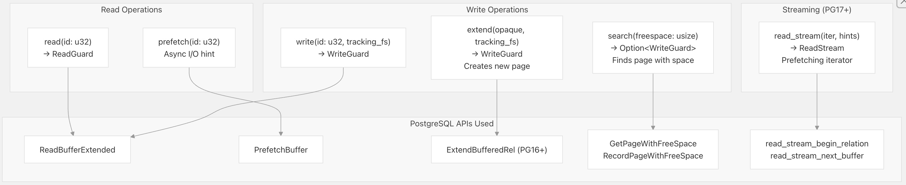  
  
**关键实现细节 (Key Implementation Details)**：  
  
  * `read()`：通过 PostgreSQL 缓冲区池读取页面。  
  * `write()`：使用 `GenericXLog` 打开页面进行修改。  
  * `extend()`：向关系中添加新页面，在 PG13-15 与 PG16+ 之间有所不同。  
  * `search()`：使用 **FSM (Free Space Map，空闲空间图)** 查找具有可用空间的页面。  
  * `read_stream()`：PostgreSQL 17+ 流式 API (streaming API)，支持基于回调的预取 (callback-based prefetching)。  
  
来源: [`src/index/storage.rs` 273-691](https://github.com/tensorchord/VectorChord/blob/ac12e257/src/index/storage.rs#L273-L691)  
  
-----  
  
## 元组系统 (Tuple System)  
  
VectorChord 的元组系统 (tuple system) 提供了将结构化数据类型安全地序列化 (type-safe serialization) 到页面中的功能。每种元组类型都实现了 `Tuple` 特征 (trait)，并支持序列化 (serialization) 和零拷贝反序列化 (zero-copy deserialization)。  
  
### 元组特征层次结构 (Tuple Trait Hierarchy)  
  
  
  
来源: [`crates/vchordrq/src/tuples.rs` 34-46](https://github.com/tensorchord/VectorChord/blob/ac12e257/crates/vchordrq/src/tuples.rs#L34-L46)  
  
### 元组序列化格式 (Tuple Serialization Format)  
  
所有元组 (tuples) 都使用 8 字节对齐 (8-byte alignment) 的通用序列化模式：  
  
```  
+----------------+  
| Tag (u64)      | Optional type discriminator (可选的类型鉴别器)  
+----------------+  
| Header         | Fixed-size header with offsets (包含偏移量的固定大小头部)  
+----------------+  
| ...padding...  | Align to 8 bytes (对齐到 8 字节)  
+----------------+  
| Variable Data  | Arrays, vectors, etc. (数组、向量等)  
+----------------+  
| ...padding...  | Align to 8 bytes (对齐到 8 字节)  
+----------------+  
```  
  
**关键常量 (Key Constants)**：  
  
  * `ALIGN = 8`：所有元组部分都是 8 字节对齐。  
  * `MAGIC = "vchordrq"`：用于 MetaTuple 验证的魔数 (Magic number)。  
  * `VERSION = 12`：当前元组格式版本。  
  
**序列化流程 (Serialization Process)**：  
  
1.  写入 tag/magic bytes。  
2.  为头部 (header) 预留空间。  
3.  写入可变长度部分 (variable-length sections)，记录起始/结束偏移量 (start/end offsets)。  
4.  填充至 8 字节边界 (Pad to 8-byte boundaries)。  
5.  用偏移量回填头部 (Back-fill header with offsets)。  
  
来源: [`crates/vchordrq/src/tuples.rs` 87-156](https://github.com/tensorchord/VectorChord/blob/ac12e257/crates/vchordrq/src/tuples.rs#L87-L156)  
  
### MetaTuple: 索引元数据 (Index Metadata)  
  
`MetaTuple` 存储在页面 0 (page 0) 的项 1 (item 1) 中，包含全局索引配置 (global index configuration) 和根节点指针 (root node pointer)：  
  
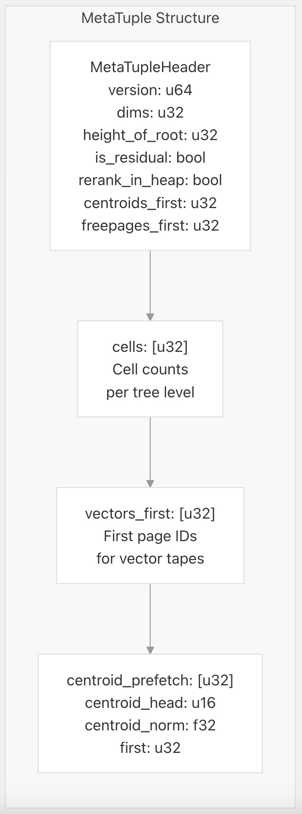  
  
**关键字段 (Key Fields)**：  
  
  * `dims`：向量维度 (Vector dimensionality)。  
  * `height_of_root`：IVF 结构 (IVF structure) 的树高 (Tree height)。  
  * `is_residual`：是否使用残差编码 (residual encoding)。  
  * `rerank_in_heap`：从堆表 (heap table) 还是索引进行重新排序 (Rerank)。  
  * `cells`：每个级别 (level) 的质心 (centroids) 数量。  
  * `centroids_first`：质心带 (centroid tape) 的第一个页面。  
  * `vectors_first`：每个分区 (partition) 的向量带 (vector tapes) 的第一个页面。  
  * `freepages_first`：空闲页面列表 (Free page list) 头部。  
  * `first`：根节点页面 ID (Root node page ID)。  
  
来源: [`crates/vchordrq/src/tuples.rs` 48-234](https://github.com/tensorchord/VectorChord/blob/ac12e257/crates/vchordrq/src/tuples.rs#L48-L234)  
  
### 质心和向量元组 (Centroid and Vector Tuples)  
  
`CentroidTuple<V>` 和 `VectorTuple<V>` 都使用一个双变体枚举 (two-variant enum) 来支持去重 (deduplication)：  
  
**变体选择 (Variant Selection)**：  
  
  * `_0`：用于唯一的向量 (unique vectors) 或首次出现。  
  * `_1`：当元数据可以通过 `head` 指针共享时使用。  
  
**VectorTuple 附加字段 (Additional Field)**：  
  
  * `payload: Option<NonZero<u64>>`：指向堆元组 (heap tuple) 的 `ctid` 引用。  
  
来源: [`crates/vchordrq/src/tuples.rs` 295-606](https://github.com/tensorchord/VectorChord/blob/ac12e257/crates/vchordrq/src/tuples.rs#L295-L606)  
  
### H1Tuple：高度-1 节点 (Height-1 Nodes)  
  
`H1Tuple` 存储 **IVF 树** 中批量的 32 个分支以及 RaBitQ 量化元数据：  
  
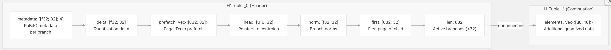  
  
**目的 (Purpose)**：存储 **IVF 树** 中的**中间节点 (intermediate nodes)**。每个 H1 节点最多包含 32 个子节点，带有用于**树遍历 (tree traversal)** 期间近似距离计算的**量化元数据 (quantization metadata)**。  
  
来源:  
[`crates/vchordrq/src/tuples.rs` 755-974](https://github.com/tensorchord/VectorChord/blob/ac12e257/crates/vchordrq/src/tuples.rs#L755-L974)  
  
### JumpTuple：叶节点元数据 (Leaf Node Metadata)  
  
`JumpTuple` 存储在每个叶节点上，提供指向包含向量的三个磁带结构的指针：  
  
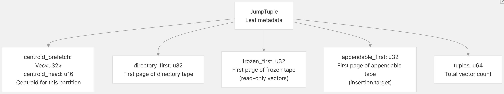  
  
**存储位置 (Storage Location)**：每个叶节点一个 JumpTuple，提供向量存储的**入口点 (entry point)**。  
  
来源:  
[`crates/vchordrq/src/tuples.rs` 976-1096](https://github.com/tensorchord/VectorChord/blob/ac12e257/crates/vchordrq/src/tuples.rs#L976-L1096)  
  
### FrozenTuple 和 AppendableTuple  
  
这些元组在**叶分区 (leaf partitions)** 中存储实际的**量化向量 (quantized vectors)**：  
  
| 元组类型 (Tuple Type) | 批大小 (Batch Size) | 可变性 (Mutability) | 有效载荷数组大小 (Payload Array Size) |  
| :--- | :--- | :--- | :--- |  
| `FrozenTuple` | 32 个向量 | **只读 (Read-only)** | `[Option<NonZero<u64>>; 32]` |  
| `AppendableTuple` | 1 个向量 | **可插入 (Insertable)** | `Option<NonZero<u64>>` |  
  
**FrozenTuple** ([`crates/vchordrq/src/tuples.rs` 1120-1353](https://github.com/tensorchord/VectorChord/blob/ac12e257/crates/vchordrq/src/tuples.rs#L1120-L1353)):  
  
  * 存储 32 个打包在一起的向量和共享的量化元数据  
  * 在**索引维护 (index maintenance)** 期间，当可追加向量被冻结时创建  
  * `_0` 变体：完整的元数据 + 32 个有效 payload IDs  
  * `_1` 变体：当元素无法放入一个元组时的**延续数据 (Continuation data)**  
  
**AppendableTuple** ([`crates/vchordrq/src/tuples.rs` 1355-1483](https://github.com/tensorchord/VectorChord/blob/ac12e257/crates/vchordrq/src/tuples.rs#L1355-L1483)):  
  
  * 存储单个向量和独立的量化元数据  
  * 用于新的插入操作  
  * 包含在搜索期间读取向量的**预取提示 (prefetch hints)**  
  
来源:  
[`crates/vchordrq/src/tuples.rs` 1098-1483](https://github.com/tensorchord/VectorChord/blob/ac12e257/crates/vchordrq/src/tuples.rs#L1098-L1483)  
  
-----  
  
## 磁带结构 (Tape Structures)  
  
**磁带结构 (Tape Structures)** 是实现为**页链表 (linked lists of pages)** 的**顺序存储结构 (sequential storage structures)**。它们在透明地管理页分配的同时，提供了高效的**追加操作 (append operations)** 和**顺序扫描 (sequential scanning)**。  
  
### 磁带架构 (Tape Architecture)  
  
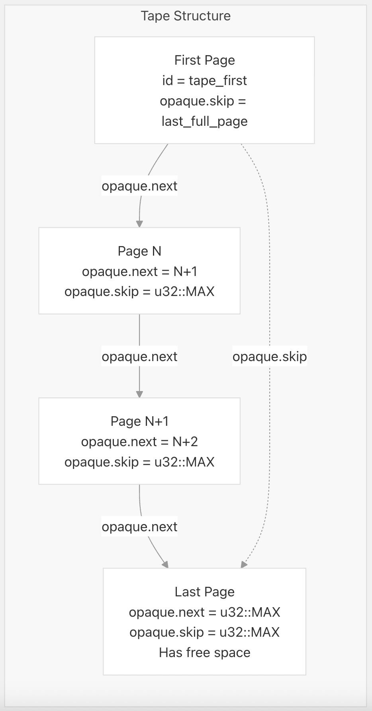  
  
磁带页的**不透明结构 (Opaque Structure)**：  
```  
struct Opaque {  
    next: u32,  // Next page in tape, or u32::MAX if last  
    skip: u32,  // For first page: points to last full page  
                // For other pages: u32::MAX  
}  
```  
  
**导航方法**（Navigation Methods）：  
  
* **顺序式**（Sequential）：`by_next()` (来源: [`crates/vchordrq/src/tape.rs` 212-227](https://github.com/tensorchord/VectorChord/blob/ac12e257/crates/vchordrq/src/tape.rs#L212-L227)) - 沿着 `next` 指针前进。  
* **跳至末尾**（Skip to End）：使用第一页上的 `skip` 字段跳到插入点。  
* **基于目录**（Directory-Based）：`by_directory()` (来源: [`crates/vchordrq/src/tape.rs` 196-210](https://github.com/tensorchord/VectorChord/blob/ac12e257/crates/vchordrq/src/tape.rs#L196-L210)) - 使用单独的**目录磁带**（directory tape）列出页面 ID。  
  
来源:  
[`crates/vchordrq/src/tape.rs` 23-227](https://github.com/tensorchord/VectorChord/blob/ac12e257/crates/vchordrq/src/tape.rs#L23-L227)  
  
### TapeWriter: 基本磁带写入器  
  
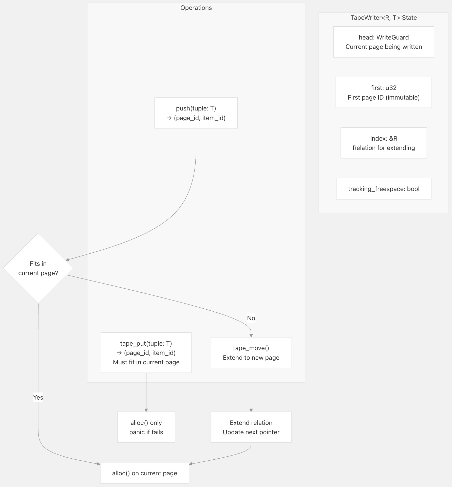  
  
**实现细节**（Implementation Details）：  
  
* `create()` (来源: [`crates/vchordrq/src/tape.rs` 39-56](https://github.com/tensorchord/VectorChord/blob/ac12e257/crates/vchordrq/src/tape.rs#L39-L56))：使用第一页初始化磁带。  
* `push()` (来源: [`crates/vchordrq/src/tape.rs` 85-105](https://github.com/tensorchord/VectorChord/blob/ac12e257/crates/vchordrq/src/tape.rs#L85-L105))：追加元组，如果需要则扩展磁带。  
* `tape_move()` (来源: [`crates/vchordrq/src/tape.rs` 63-76](https://github.com/tensorchord/VectorChord/blob/ac12e257/crates/vchordrq/src/tape.rs#L63-L76))：扩展到新页面，更新 `next` 指针。  
  
来源:  
[`crates/vchordrq/src/tape.rs` 23-114](https://github.com/tensorchord/VectorChord/blob/ac12e257/crates/vchordrq/src/tape.rs#L23-L114)  
  
### 专业磁带写入器（Specialized Tape Writers）  
  
VectorChord 提供了处理**多元组序列化**（multi-tuple serialization）和**批处理**（batching）的更高级磁带写入器：  
  
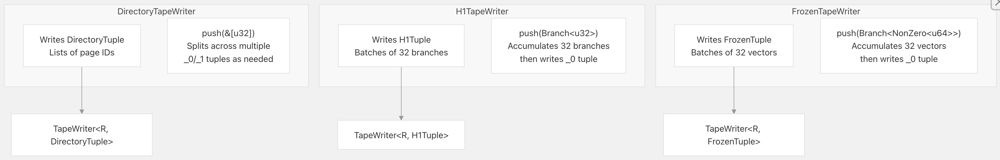  
  
**DirectoryTapeWriter** (目录磁带写入器)  
(来源: [`crates/vchordrq/src/tape_writer.rs` 22-61](https://github.com/tensorchord/VectorChord/blob/ac12e257/crates/vchordrq/src/tape_writer.rs#L22-L61))  
  
* 存储用于目录结构的页面 ID 列表。  
* 自动将大型数组拆分到 `_0`（标头，header）和 `_1`（续传，continuation）元组中。  
* 使用 `fit_1()` 来计算有多少元素适合可用空间。  
  
**H1TapeWriter**  
(来源: [`crates/vchordrq/src/tape_writer.rs` 63-161](https://github.com/tensorchord/VectorChord/blob/ac12e257/crates/vchordrq/src/tape_writer.rs#L63-L161))  
  
* 在写入前累积 32 个**分支**（branches）。  
* 使用 `padding_pack()` 打包量化代码，以进行 **RaBitQ 压缩**（RaBitQ compression）。  
* 通过 `flush()` 方法刷写（Flushes）剩余的分支。  
  
**FrozenTapeWriter** (冻结磁带写入器)  
(来源: [`crates/vchordrq/src/tape_writer.rs` 163-223](https://github.com/tensorchord/VectorChord/blob/ac12e257/crates/vchordrq/src/tape_writer.rs#L163-L223))  
  
* 与 `H1TapeWriter` 类似，但用于叶向量（leaf vectors）。  
* 存储用于**堆表引用**（heap table references）的负载 ID（payload IDs）。  
* 在**索引维护**（index maintenance）期间，将可追加（appendable）向量转换为冻结（frozen）向量时使用。  
  
来源:  
[`crates/vchordrq/src/tape_writer.rs` 1-258](https://github.com/tensorchord/VectorChord/blob/ac12e257/crates/vchordrq/src/tape_writer.rs#L1-L258)  
  
### 磁带读取函数（Tape Reading Functions）  
  
VectorChord 为每种磁带类型提供了执行**零拷贝反序列化**（zero-copy deserialization）的专业读取器（specialized readers）：  
  
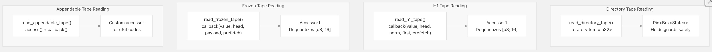  
  
**read_directory_tape()** (读取目录磁带)  
(来源: [`crates/vchordrq/src/tape.rs` 116-194](https://github.com/tensorchord/VectorChord/blob/ac12e257/crates/vchordrq/src/tape.rs#L116-L194))  
  
* 返回页面 ID 的 `Iterator<Item = u32>`。  
* 使用**固定状态**（pinned state）来安全地在迭代（iterations）中持有**守卫**（guards）。  
* 透明地（transparently）处理 `_0` 和 `_1` 两种元组变体。  
  
**read_h1_tape()** (读取 H1 磁带)  
(来源: [`crates/vchordrq/src/tape.rs` 229-268](https://github.com/tensorchord/VectorChord/blob/ac12e257/crates/vchordrq/src/tape.rs#L229-L268))  
  
* 对 RaBitQ 编码的向量进行**反量化**（Dequantizes）。  
* 用反量化值、元数据和**预取提示**（prefetch hints）调用回调函数（callback）。  
* 在处理 `_0` 标头（headers）之前，累积 `_1` **续传数据**（continuation data）。  
  
**read_frozen_tape()** (读取冻结磁带)  
(来源: [`crates/vchordrq/src/tape.rs` 270-308](https://github.com/tensorchord/VectorChord/blob/ac12e257/crates/vchordrq/src/tape.rs#L270-L308))  
  
* 类似于 H1，但包含**负载 ID**（payload IDs）。  
* 跳过 `payload[j]` 为 `None` 的条目。  
  
**read_appendable_tape()** (读取可追加磁带)  
(来源: [`crates/vchordrq/src/tape.rs` 310-327](https://github.com/tensorchord/VectorChord/blob/ac12e257/crates/vchordrq/src/tape.rs#L310-L327))  
  
* 处理单个向量（非批处理）。  
* 接受自定义的 `access()` 函数进行解码。  
  
来源:  
[`crates/vchordrq/src/tape.rs` 116-327](https://github.com/tensorchord/VectorChord/blob/ac12e257/crates/vchordrq/src/tape.rs#L116-L327)  
  
### 磁带追加操作（Tape Append Operation）  
  
`append()` 函数提供**原子元组插入**（atomic tuple insertion）到现有磁带中，并进行**可用空间管理**（free space management）：  
  
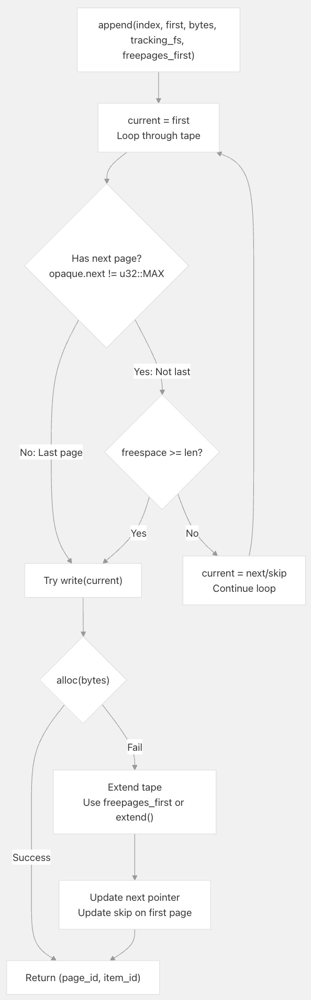  
  
**关键特性**（Key Features）：  
  
* 查找最后一个页面或具有足够可用空间的页面。  
* 使用 `opaque.skip` 从第一页跳转到最后一个完整页面。  
* 可选择从**空闲页面列表**（free page list）（`freepages_first`）分配空间。  
* 扩展磁带时更新 `skip` 指针。  
  
来源:  
[`crates/vchordrq/src/tape.rs` 329-404](https://github.com/tensorchord/VectorChord/blob/ac12e257/crates/vchordrq/src/tape.rs#L329-L404)  
  
## 缓冲区管理与事务安全（Buffer Management and Transaction Safety）  
  
### 预写式日志集成（Write-Ahead Logging Integration）  
  
VectorChord 集成了 PostgreSQL 的**通用预写式日志**（Generic WAL, Write-Ahead Logging），以确保**崩溃安全**（crash safety）：  
  
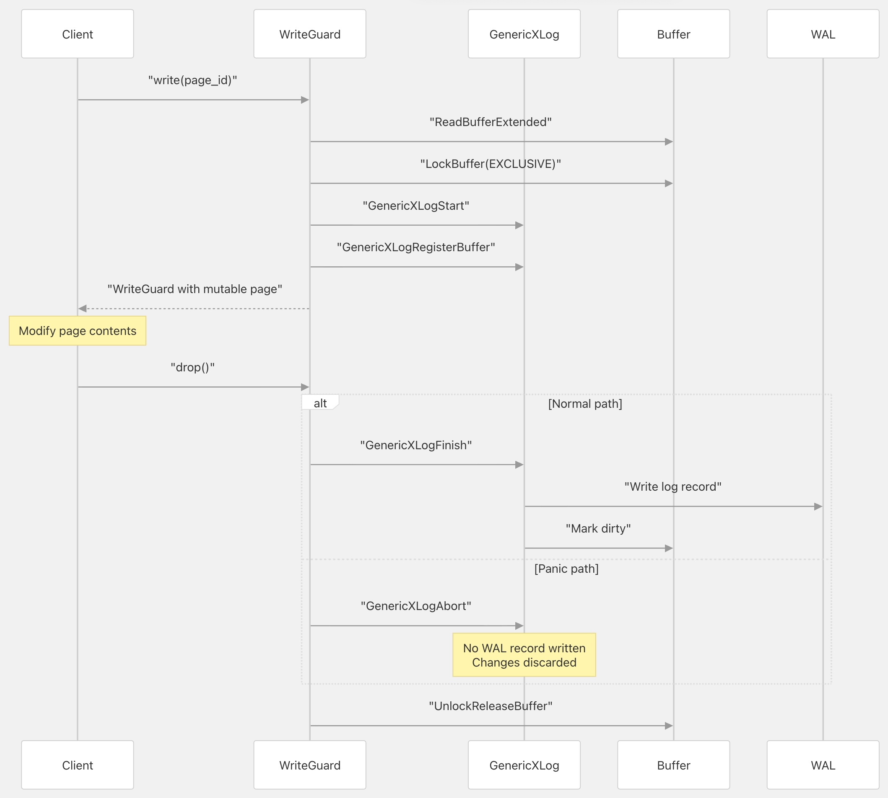  
  
**事务安全保证**（Transaction Safety Guarantees）：  
  
1.  所有页面修改都通过 `GenericXLogState` 注册 (来源: [`src/index/storage.rs` 216](https://github.com/tensorchord/VectorChord/blob/ac12e257/src/index/storage.rs#L216-L216))。  
2.  在**守卫丢弃**（guard drop）时，通过 `GenericXLogFinish()` 提交更改 (来源: [`src/index/storage.rs` 251](https://github.com/tensorchord/VectorChord/blob/ac12e257/src/index/storage.rs#L251-L251))。  
3.  在**程序恐慌**（panic）时，`GenericXLogAbort()` 丢弃更改 (来源: [`src/index/storage.rs` 245](https://github.com/tensorchord/VectorChord/blob/ac12e257/src/index/storage.rs#L245-L245))。  
4.  PostgreSQL 使用 WAL 记录处理**崩溃恢复**（crash recovery）。  
  
来源:  
[`src/index/storage.rs` 241-256](https://github.com/tensorchord/VectorChord/blob/ac12e257/src/index/storage.rs#L241-L256)  
  
### 可用空间管理（Free Space Management）  
  
VectorChord 使用 PostgreSQL 的**可用空间映射**（FSM, Free Space Map）来跟踪页面中的可用空间：  
  
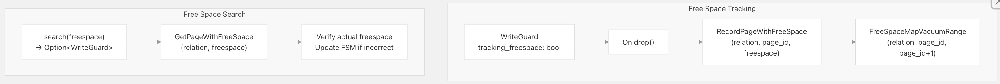  
  
**实现细节**（Implementation Details）：  
  
* `tracking_freespace` 标志启用 FSM 更新 (来源: [`src/index/storage.rs` 218](https://github.com/tensorchord/VectorChord/blob/ac12e257/src/index/storage.rs#L218-L218))。  
* `RecordPageWithFreeSpace()` 在**守卫丢弃**（guard drop）时更新 FSM (来源: [`src/index/storage.rs` 248](https://github.com/tensorchord/VectorChord/blob/ac12e257/src/index/storage.rs#L248-L248))。  
* `search()` 使用 FSM 查找具有所需可用空间的页面 (来源: [`src/index/storage.rs` 392-410](https://github.com/tensorchord/VectorChord/blob/ac12e257/src/index/storage.rs#L392-L410))。  
* FSM 可能会**过时**（stale）；实际的可用空间会经过验证和修正 (来源: [`src/index/storage.rs` 400-404](https://github.com/tensorchord/VectorChord/blob/ac12e257/src/index/storage.rs#L400-L404))。  
  
**何时启用跟踪**（When to Enable Tracking）：  
  
好的，万能且优秀的助理随时为您服务！  
  
* **✓ 适用于会重用的页面(e.g., appendable tapes)**    
* **✗ 适用于仅写一次(write-once)的页面 (e.g., frozen tapes)**    
  
来源:  
[`src/index/storage.rs` 412-421](https://github.com/tensorchord/VectorChord/blob/ac12e257/src/index/storage.rs#L241-L410)  
  
## Read Streaming (PostgreSQL 17+) (流式读取)  
  
VectorChord 支持 PostgreSQL 17 的**流式读取 API**（streaming read API），以实现高效的**批量预取**（bulk prefetching）：  
  
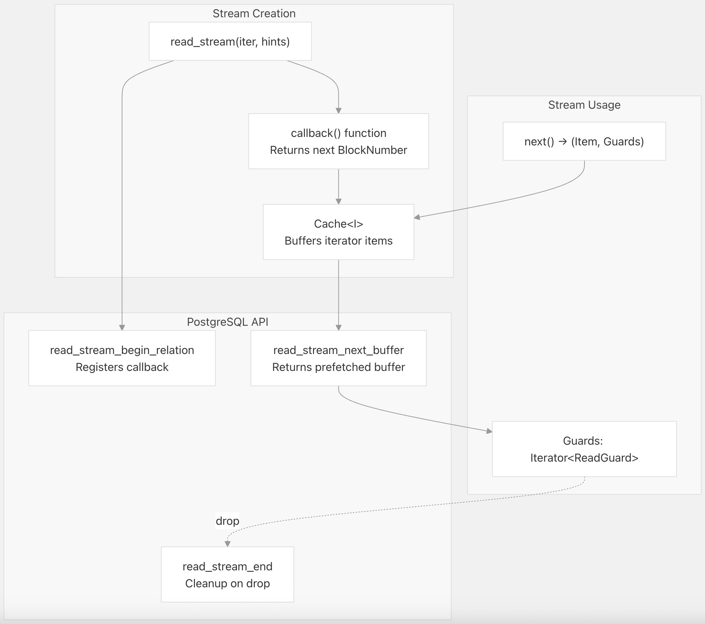  
  
**工作原理 (How It Works)**：  
  
1.  `read_stream()` 使用**迭代器**（iterator）和**提示**（hints）创建流。[`src/index/storage.rs` 641-690](https://github.com/tensorchord/VectorChord/blob/ac12e257/src/index/storage.rs#L641-L690)  
2.  PostgreSQL 调用**回调函数**（callback function）`callback()` 来获取下一个**页 ID**（page ID）。[`src/index/storage.rs` 646-658](https://github.com/tensorchord/VectorChord/blob/ac12e257/src/index/storage.rs#L646-L658)  
3.  `Cache` 结构缓冲**迭代器项**（iterator items）并提取页 ID。[`src/index/storage.rs` 422-483](https://github.com/tensorchord/VectorChord/blob/ac12e257/src/index/storage.rs#L422-L483)  
4.  `next()` 返回**项**（item）加上对预取**守卫**（prefetched guards）的迭代器。[`src/index/storage.rs` 580-600](https://github.com/tensorchord/VectorChord/blob/ac12e257/src/index/storage.rs#L580-L600)  
  
**提示 (Hints)** [`src/index/storage.rs` 668-674](https://github.com/tensorchord/VectorChord/blob/ac12e257/src/index/storage.rs#L668-L674)：  
  
* `hints.full`：为**顺序扫描**（sequential scans）设置 `READ_STREAM_FULL` 标志。  
* `hints.batch`：（PG18+）为**并行 I/O**（parallel I/O）设置 `READ_STREAM_USE_BATCHING` 标志。  
  
**限制 (Limitations)**：  
  
* 仅在 PostgreSQL 17+ 上可用。[`src/index/storage.rs` 506-509](https://github.com/tensorchord/VectorChord/blob/ac12e257/src/index/storage.rs#L506-L509) [`src/index/storage.rs` 566-577](https://github.com/tensorchord/VectorChord/blob/ac12e257/src/index/storage.rs#L566-L577)  
* 在早期版本上会**崩溃**（panics）并显示有用的错误消息。  
  
来源: [`src/index/storage.rs` 422-691](https://github.com/tensorchord/VectorChord/blob/ac12e257/src/index/storage.rs#L422-L691)  
  
---  
  
## Usage in Reranking (在重排序中的应用)  
  
**存储层**（storage layer）在**查询重排序**（query reranking）过程中被大量使用，此时使用精确的**距离计算**（exact distance calculations）来**精炼**（refined）近似结果：  
  
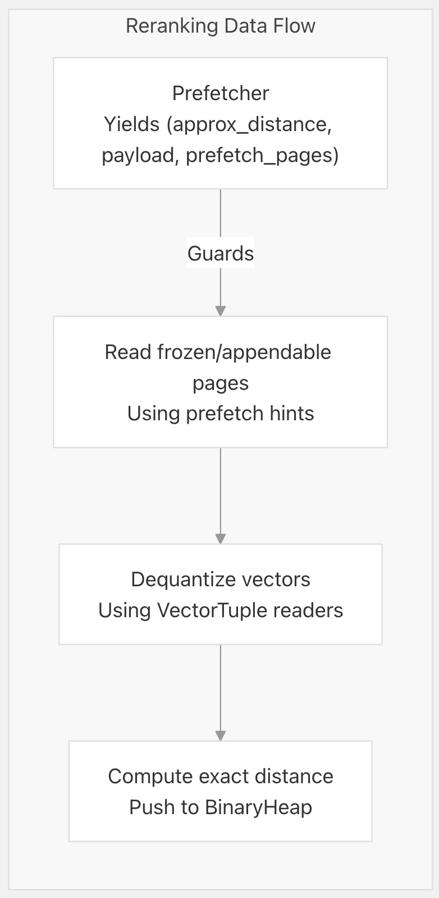  
  
**rerank\_index()** [`crates/vchordrq/src/rerank.rs` 82-108](https://github.com/tensorchord/VectorChord/blob/ac12e257/crates/vchordrq/src/rerank.rs#L82-L108)：  
  
* 使用**预取器**（prefetcher）获取**近似距离**（approximate distances）和**页提示**（page hints）。  
* 使用提供的**守卫**（guards）从**索引**（index）中读取**向量数据**（vector data）。  
* 使用**反量化向量**（dequantized vectors）执行**精确距离计算**（exact distance calculation）。  
  
**rerank\_heap()** [`crates/vchordrq/src/rerank.rs` 110-135](https://github.com/tensorchord/VectorChord/blob/ac12e257/crates/vchordrq/src/rerank.rs#L110-L135)：  
  
* 转而从**堆表**（heap table）中**获取**（fetches）原始向量。  
* **绕过**（Bypasses）索引向量读取。  
* 由 `MetaTuple::rerank_in_heap` 标志控制。  
  
**Reranker Iterator (重排序迭代器)** [`crates/vchordrq/src/rerank.rs` 53-74](https://github.com/tensorchord/VectorChord/blob/ac12e257/crates/vchordrq/src/rerank.rs#L53-L74)：  
  
* **懒惰地**（Lazily）处理来自预取器的结果。  
* 仅当**近似距离**（approximate distance）具有**竞争力**（competitive）时才进行重排序。  
* 维护**精炼结果**（refined results）的 `BinaryHeap`（二叉堆）。  
  
来源: [`crates/vchordrq/src/rerank.rs` 34-135](https://github.com/tensorchord/VectorChord/blob/ac12e257/crates/vchordrq/src/rerank.rs#L34-L135)  
  
---  
  
## Performance Considerations (性能考量)  
  
### Memory Layout (内存布局)  
  
**Page Alignment (页对齐)** [`src/index/storage.rs` 51-52](https://github.com/tensorchord/VectorChord/blob/ac12e257/src/index/storage.rs#L51-L52)：  
```  
const _: () = assert!(align_of::<PostgresPage<()>>() == MAXIMUM_ALIGNOF);  
const _: () = assert!(size_of::<PostgresPage<()>>() == BLCKSZ);  
```  
  
* **页**（Pages）为 **8 字节对齐**（8-byte aligned），以进行 **SIMD 操作**（SIMD operations）。  
* 精确的 8KB 大小与 PostgreSQL 的**块大小**（block size）匹配。  
  
**Zero-Copy Deserialization (零拷贝反序列化)**：  
  
* **元组读取器**（Tuple readers）返回对**页数据**（page data）的**引用**（references）。[`crates/vchordrq/src/tuples.rs` 159-186](https://github.com/tensorchord/VectorChord/blob/ac12e257/crates/vchordrq/src/tuples.rs#L159-L186)  
* 读取期间没有**分配**（allocation）或**复制**（copying）。  
* 使用 `zerocopy` **库特性**（crate traits）（`FromBytes`、`Immutable`）。  
  
### Batch Processing (批处理)  
  
`FrozenTuple` 和 `H1Tuple` 中的 **32 向量批处理**（32-Vector Batching）：  
  
* **分摊**（Amortizes）**元数据开销**（metadata overhead）（128 字节 / 32 = 每个向量 4 字节）。  
* 支持在**批次**（batches）上进行 SIMD 操作。  
* 减少**页管理开销**（page management overhead）。  
  
**Variable-Length Tuples (可变长度元组)**：  
  
* `_0` **变体**（variants）存储完整数据。  
* `_1` 变体处理**跨页溢出**（overflow across pages）。  
* `fit_1()` 函数计算**最优拆分**（optimal splits）。[`crates/vchordrq/src/tuples.rs` 638-650](https://github.com/tensorchord/VectorChord/blob/ac12e257/crates/vchordrq/src/tuples.rs#L638-L650)  
  
### I/O Patterns (I/O 模式)  
  
**Sequential Tape Scans (顺序带式扫描)**：  
  
* 通过 `by_next()` 进行**线性页遍历**（Linear page traversal）。[`crates/vchordrq/src/tape.rs` 212-227](https://github.com/tensorchord/VectorChord/blob/ac12e257/crates/vchordrq/src/tape.rs#L212-L227)  
* 可预测的 I/O 模式，利于 **OS 预读**（OS read-ahead）。  
  
**Skip Optimization (跳过优化)**：  
  
* `opaque.skip` **指针**（pointer）跳转到**最后一个完整页**（last full page）。[`crates/vchordrq/src/tape.rs` 47](https://github.com/tensorchord/VectorChord/blob/ac12e257/crates/vchordrq/src/tape.rs#L47-L47)  
* 在**追加**（append）过程中避免扫描整个**带**（tapes）。  
  
**Streaming Prefetch (流式预取) (PG17+)**：  
  
* 通过 `read_stream_begin_relation()` 进行**异步 I/O**（Asynchronous I/O）。[`src/index/storage.rs` 675-683](https://github.com/tensorchord/VectorChord/blob/ac12e257/src/index/storage.rs#L675-L683)  
* 通过将 I/O 隐藏在**计算**（computation）之后来减少**查询延迟**（query latency）。  
  
来源: [`src/index/storage.rs` 28-691](https://github.com/tensorchord/VectorChord/blob/ac12e257/src/index/storage.rs#L28-L691) [`crates/vchordrq/src/tuples.rs` 1-1483](https://github.com/tensorchord/VectorChord/blob/ac12e257/crates/vchordrq/src/tuples.rs#L1-L1483) [`crates/vchordrq/src/tape.rs` 1-404](https://github.com/tensorchord/VectorChord/blob/ac12e257/crates/vchordrq/src/tape.rs#L1-L404)  
    
  
#### [期望 PostgreSQL|开源PolarDB 增加什么功能?](https://github.com/digoal/blog/issues/76 "269ac3d1c492e938c0191101c7238216")
  
  
#### [PolarDB 开源数据库](https://openpolardb.com/home "57258f76c37864c6e6d23383d05714ea")
  
  
#### [PolarDB 学习图谱](https://www.aliyun.com/database/openpolardb/activity "8642f60e04ed0c814bf9cb9677976bd4")
  
  
#### [PostgreSQL 解决方案集合](../201706/20170601_02.md "40cff096e9ed7122c512b35d8561d9c8")
  
  
#### [德哥 / digoal's Github - 公益是一辈子的事.](https://github.com/digoal/blog/blob/master/README.md "22709685feb7cab07d30f30387f0a9ae")
  
  
#### [About 德哥](https://github.com/digoal/blog/blob/master/me/readme.md "a37735981e7704886ffd590565582dd0")
  
  

  
