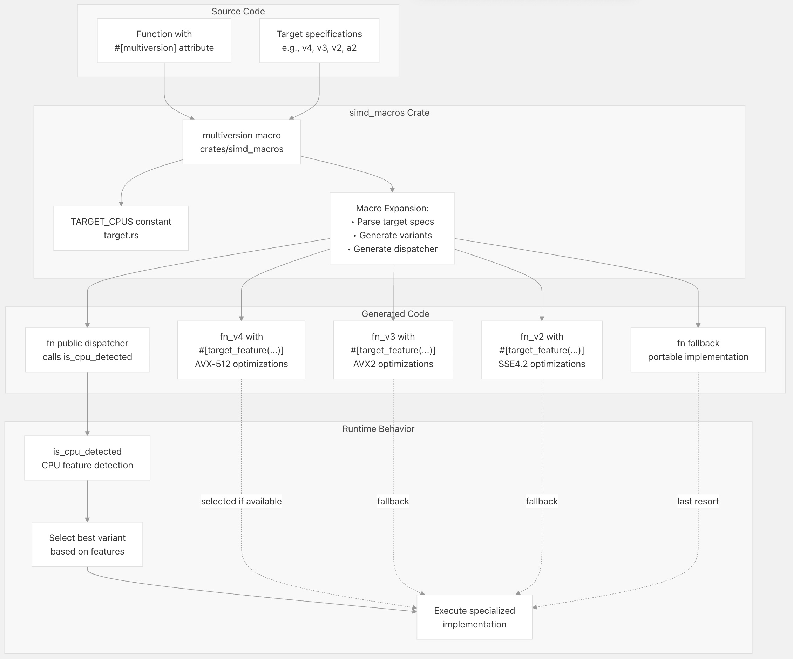
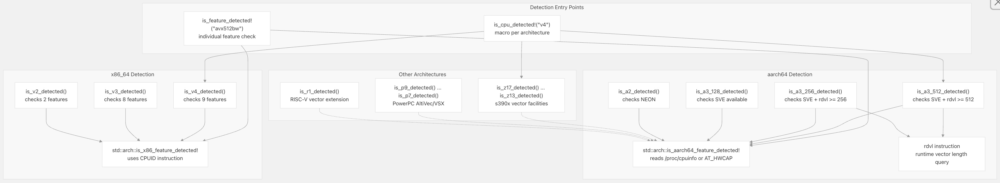
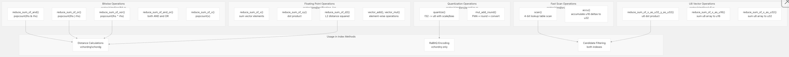
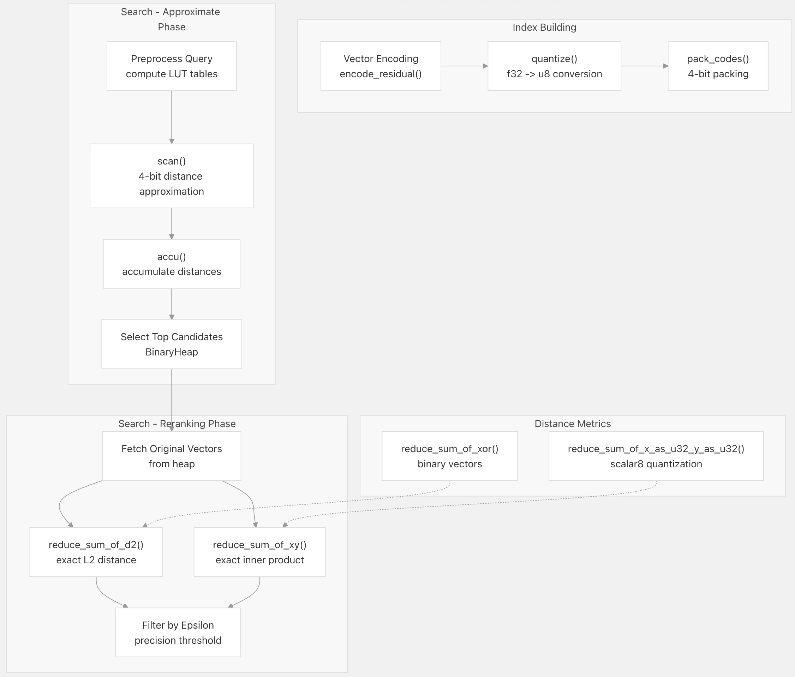
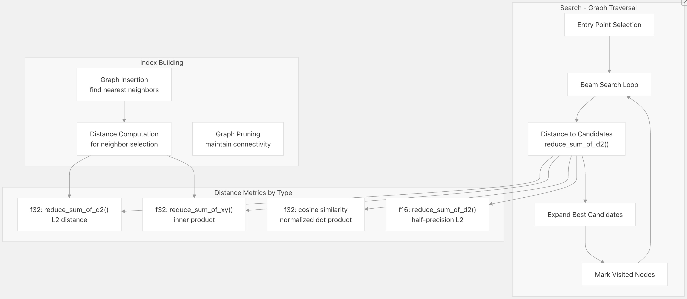
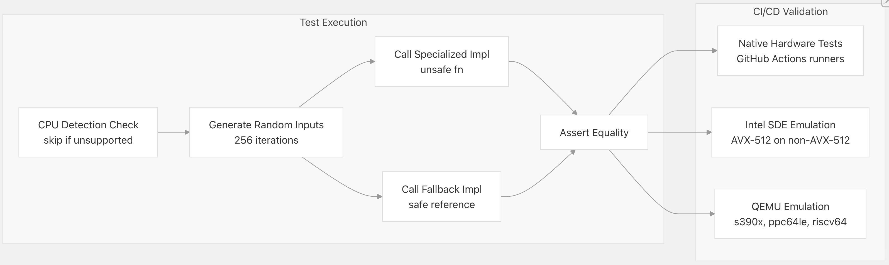

## VectorChord 源码学习: 3.4 SIMD (单指令多数据) 优化系统  
                                  
### 作者                                  
digoal                                  
                                  
### 日期                                  
2025-11-01                                  
                                  
### 标签                                  
VectorChord , 源码学习                                  
                                  
----                                  
                                  
## 背景        
**SIMD (单指令多数据) 优化系统**在多个 **CPU 架构**（CPU architectures）上提供可移植、高性能的向量操作。它使 VectorChord 能够在 x86\_64 (SSE4.1 到 AVX-512)、ARM (NEON 和 SVE)、IBM 大型机 (s390x)、PowerPC 和 RISC-V 处理器上实现最佳性能，而无需用户手动选择优化。  
  
本文分享**多版本编译框架**（Multiversion Compilation Framework）、**运行时调度机制**（Runtime Dispatch Mechanism）以及 **SIMD** 加速操作的目录(catalog)。  
  
## 多版本编译架构  
  
SIMD 系统使用**过程宏**（procedural macros）为每个性能关键函数生成多个专业化实现，每个实现对应一个支持的**指令集**（instruction set）。在运行时，**CPU 特性检测**（CPU feature detection）会选择最佳的可用实现。  
  
### 代码生成流程  
  
  
  
**多版本编译系统** - 将单个带**注解函数**（annotated function）转换为多个带**运行时调度**（runtime dispatch）的专业化变体。  
  
`#[multiversion]` **属性宏**（attribute macro）生成带有渐进式更高级 SIMD 指令的专业化函数变体。前缀 `@` 表示接受平台特定优化（标记为 `unsafe`）的架构，而没有前缀的目标则使用可移植的**回退方案**（portable fallback）。  
  
来源:  
[`crates/simd/src/lib.rs` 314](https://github.com/tensorchord/VectorChord/blob/ac12e257/crates/simd/src/lib.rs#L314-L314)  
[`crates/simd_macros/src/target.rs` 21-161](https://github.com/tensorchord/VectorChord/blob/ac12e257/crates/simd_macros/src/target.rs#L21-L161)  
  
### 目标 CPU 规格  
  
每个目标 **CPU** 定义了所需的**指令集特性**（instruction set features）。系统会在运行时检查所有特性，然后选择一个实现。  
  
| 目标 CPU（Target CPU） | 架构（Architecture） | 向量宽度（Vector Width） | 关键特性（Key Features） | 示例用例（Example Use Case） |  
| :--- | :--- | :--- | :--- | :--- |  
| `v4` | x86\_64 | 512-bit | AVX-512BW/CD/DQ/VL, BMI1/2, LZCNT, POPCNT | **硬件** `popcount`（Hardware popcount，置位位数计数），**宽向量**（wide vectors） |  
| `v4:avx512vpopcntdq` | x86\_64 | 512-bit | v4 + AVX512VPOPCNTDQ | 原生 64 位 `popcount` 指令 |  
| `v3` | x86\_64 | 256-bit | AVX2, FMA, F16C, BMI1/2, LZCNT, POPCNT | **FMA**（Fused Multiply-Add，乘加融合）操作，**半精度**（half-precision） |  
| `v2` | x86\_64 | 128-bit | SSE4.2, POPCNT | **x86\_64** SIMD **基线**（Baseline） |  
| `a3.512` | aarch64 | 512-bit | SVE with 512-bit vectors | ARM **可扩展向量**（scalable vectors）（高端） |  
| `a2` | aarch64 | 128-bit | NEON | 标准 ARM SIMD |  
| `z13`-`z17` | s390x | 128-bit | Vector Facility + enhancements | IBM **大型机**（mainframe）（渐进式特性） |  
| `r1` | riscv64 | Scalable | Vector Extension | RISC-V 向量指令 |  
  
来源:  
[`crates/simd_macros/src/target.rs` 21-161](https://github.com/tensorchord/VectorChord/blob/ac12e257/crates/simd_macros/src/target.rs#L21-L161)  
  
### 示例：多版本声明  
  
函数使用 `#[multiversion]` 属性来注解它们的目标架构：  
  
```rust  
#[multiversion(@"v4:avx512vpopcntdq", @"v4", @"v3", "v2", "a2", "z17", "z16", "z15", "z14", "z13", "p9", "p8", "p7", "r1")]  
pub fn reduce_sum_of_and(lhs: &[u64], rhs: &[u64]) -> u32 {  
    // Portable fallback implementation  
    assert_eq!(lhs.len(), rhs.len());  
    let n = lhs.len();  
    let mut and = 0;  
    for i in 0..n {  
        and += (lhs[i] & rhs[i]).count_ones();  
    }  
    and  
}  
```  
  
该宏生成：  
  
  * `reduce_sum_of_and_v4_avx512vpopcntdq()` - 使用 `_mm512_popcnt_epi64()` **硬件指令**（hardware instruction）  
  * `reduce_sum_of_and_v4()` - 使用 AVX-512 和**查找表**（lookup table）进行 `popcount`  
  * `reduce_sum_of_and_v3()` - 使用 AVX2 和查找表  
  * `reduce_sum_of_and()` - **可移植回退方案**（portable fallback）（也用于 v2, a2, z17 等）  
  * 公共 `reduce_sum_of_and()` **调度器**（dispatcher），调用最佳可用变体  
  
来源:  
[`crates/simd/src/bit.rs` 186-196](https://github.com/tensorchord/VectorChord/blob/ac12e257/crates/simd/src/bit.rs#L186-L196)  
  
-----  
  
## 运行时 CPU 检测  
  
SIMD 系统在运行时执行 **CPU 特性检测**，以选择最佳的代码路径。由于 **CPU 指令缓存**（CPU instruction caching），这在每次函数调用时发生一次，但速度极快。  
  
### CPU 检测实现  
  
  
  
**CPU 特性检测流程** - 跨架构的**指令集可用性**（instruction set availability）运行时检查。  
  
来源:  
[`crates/simd/src/lib.rs` 117-312](https://github.com/tensorchord/VectorChord/blob/ac12e257/crates/simd/src/lib.rs#L117-L312)  
  
### x86\_64 特性检测  
  
在 **x86\_64** 上，系统会检查渐进式更高级的指令集：  
  
**v4 (AVX-512) 检测：**  
  
```rust  
pub fn is_v4_detected() -> bool {  
    std::arch::is_x86_feature_detected!("avx512bw")  
        && std::arch::is_x86_feature_detected!("avx512cd")  
        && std::arch::is_x86_feature_detected!("avx512dq")  
        && std::arch::is_x86_feature_detected!("avx512vl")  
        && std::arch::is_x86_feature_detected!("bmi1")  
        && std::arch::is_x86_feature_detected!("bmi2")  
        && std::arch::is_x86_feature_detected!("lzcnt")  
        && std::arch::is_x86_feature_detected!("movbe")  
        && std::arch::is_x86_feature_detected!("popcnt")  
}  
```  
  
额外的 `v4:avx512vpopcntdq` 变体检查**硬件 popcount**：  
  
```rust  
if crate::is_cpu_detected!("v4") && crate::is_feature_detected!("avx512vpopcntdq") {  
    // Use _mm512_popcnt_epi64() hardware instruction  
} else if crate::is_cpu_detected!("v4") {  
    // Use AVX-512 with lookup table  
}  
```  
  
来源:  
[`crates/simd/src/lib.rs` 154-183](https://github.com/tensorchord/VectorChord/blob/ac12e257/crates/simd/src/lib.rs#L154-L183)  
[`crates/simd/src/bit.rs` 22-47](https://github.com/tensorchord/VectorChord/blob/ac12e257/crates/simd/src/bit.rs#L22-L47)  
  
### ARM SVE 向量长度检测  
  
ARM 的**可扩展向量扩展**（Scalable Vector Extension, SVE）支持**运行时可配置**（runtime-configurable）的向量长度。VectorChord 使用 `rdvl` 指令检测实际的向量长度：  
  
```rust  
#[target_feature(enable = "sve")]  
fn is_512_detected() -> bool {  
    let vl: u64;  
    unsafe {  
        core::arch::asm!(  
            "rdvl {0}, #8",  
            out(reg) vl  
        );  
    }  
    vl >= 512  
}  
```  
  
这使得系统能够根据硬件的实际**向量宽度**（vector width）（128、256 或 512 位）选择最佳的 SVE 实现。  
  
来源:  
[`crates/simd/src/lib.rs` 186-228](https://github.com/tensorchord/VectorChord/blob/ac12e257/crates/simd/src/lib.rs#L186-L228)  
  
-----  
  
## SIMD 操作类别  
  
SIMD 系统在五个主要操作类别中提供了优化实现，每个类别对于**向量相似性搜索**（vector similarity search）性能都至关重要。  
  
### 操作目录  
  
  
  
**SIMD 操作类别** - 按**数据类型**（data type）和**使用模式**（usage pattern）组织。  
  
来源:  
[`crates/simd/src/bit.rs` 1-788](https://github.com/tensorchord/VectorChord/blob/ac12e257/crates/simd/src/bit.rs#L1-L788)  
[`crates/simd/src/fast_scan.rs` 1-688](https://github.com/tensorchord/VectorChord/blob/ac12e257/crates/simd/src/fast_scan.rs#L1-L688)  
[`crates/simd/src/u8.rs` 1-740](https://github.com/tensorchord/VectorChord/blob/ac12e257/crates/simd/src/u8.rs#L1-L740)  
[`crates/simd/src/quantize.rs` 1-312](https://github.com/tensorchord/VectorChord/blob/ac12e257/crates/simd/src/quantize.rs#L1-L312)  
  
### 1\. u64 数组上的位操作（Bitwise Operations）  
  
位操作计算表示为 u64 数组的布尔向量上的**种群计数**（population counts，即 1 的位数）。它们对于**二进制量化向量**（binary quantized vectors）中的**汉明距离**（Hamming distance）计算至关重要。  
  
**关键函数（Key Functions）**  
  
* `reduce_sum_of_and(lhs: &[u64], rhs: &[u64]) -> u32` - 计算所有元素上的 `popcount(lhs[i] & rhs[i])`。  
* `reduce_sum_of_or(lhs: &[u64], rhs: &[u64]) -> u32` - 计算所有元素上的 `popcount(lhs[i] | rhs[i])`。  
* `reduce_sum_of_xor(lhs: &[u64], rhs: &[u64]) -> u32` - 计算**汉明距离**（**Hamming distance**）的 `popcount(lhs[i] ^ rhs[i])`。  
* `reduce_sum_of_and_or(lhs: &[u64], rhs: &[u64]) -> (u32, u32)` - 同时计算 AND 和 OR，用于**杰卡德相似度**（**Jaccard similarity**）。  
* `reduce_sum_of_x(this: &[u64]) -> u32` - 单个数组的**简单 popcount**（Simple popcount，即置位位数计数）。  
  
**性能特征（Performance Characteristics）**  
  
| 架构（Architecture） | 实现策略（Implementation Strategy） | 吞吐量（Throughput, GB/s） |  
| :--- | :--- | :--- |  
| x86\_64 v4 + VPOPCNTDQ | **`_mm512_popcnt_epi64()` 硬件指令**（hardware instruction） | ~50-60 GB/s |  
| x86\_64 v4 | 使用 **`_mm512_shuffle_epi8()` 的查找表**（Lookup table） | ~35-45 GB/s |  
| x86\_64 v3 | 使用 **`_mm256_shuffle_epi8()` 的查找表** | ~20-30 GB/s |  
| x86\_64 v2 | **标量**（**Scalar**） `u64::count_ones()` | ~5-10 GB/s |  
| aarch64 a2 | **NEON 置换操作**（permute operations） | ~15-25 GB/s |  
  
**查找表**（lookup table）方法一次处理 4 位，使用预计算的表格 `[0,1,1,2,1,2,2,3,1,2,2,3,2,3,3,4]`，将每个 4 位模式映射到其 **popcount**（置位位数计数）。  
  
来源:  
[`crates/simd/src/bit.rs` 15-787](https://github.com/tensorchord/VectorChord/blob/ac12e257/crates/simd/src/bit.rs#L15-L787)  
  
好的，万能且优秀的助理乐意为您服务！  
  
根据您的要求，我将从“2. Fast Scan for 4-bit Quantized Codes”章节开始，为您翻译网页内容。翻译过程中将保留重要术语的原文和译文，并严格遵守您提出的链接格式要求。  
  
### 2\. 针对 4-bit 量化编码的快速扫描（Fast Scan for 4-bit Quantized Codes）  
  
快速扫描（fast scan）操作实现了 RaBitQ 算法中近似距离计算的核心部分。它利用查找表（lookup tables）处理打包的 4-bit 量化编码（quantization codes），以累积距离贡献值。  
  
**函数签名（Function Signature）:**  
  
```rust  
pub fn scan(code: &[[u8; 16]], lut: &[[u8; 16]]) -> [u16; 32]  
```  
  
**操作（Operation）:** 对于 $n$ 个编码组中的每一个（即向量 $32i$ 到 $32i+31$），使用 4-bit 编码作为查找表的索引，将结果累积到 32 个独立的和中，这些和代表 32 个向量的距离。  
  
**数据布局（Data Layout）:** 编码以缓存友好的模式（cache-friendly pattern）进行打包，使得 32 个连续向量的编码交错排列。请参阅 [`crates/simd/src/fast_scan.rs` 15-47](https://github.com/tensorchord/VectorChord/blob/ac12e257/crates/simd/src/fast_scan.rs#L15-L47) 中的详细布局文档。  
  
**AVX-512 实现亮点（Implementation Highlights）:**  
  
  * 每次迭代处理 4 个编码组（同时处理 128 个向量）。  
  * 使用 `_mm512_shuffle_epi8()` 进行并行查找表操作（parallel table lookups）。  
  * 累积到 4 个独立的 `__m512i` 累加器中，分别对应低/高半字节（low/high nibbles）。  
  * 在现代中央处理器（CPUs）上可实现约 1000 亿到 2000 亿次每秒的操作（\~100-200 billion operations per second）。  
  
**用例（Use Case）:** 这是 `vchordrq` 索引方法在 RaBitQ 量化下进行近似最近邻搜索（approximate nearest neighbor search）时，性能最关键的内层循环。  
  
来源: [`crates/simd/src/fast_scan.rs` 49-688](https://github.com/tensorchord/VectorChord/blob/ac12e257/crates/simd/src/fast_scan.rs#L49-L688)  
  
### 3\. U8 向量操作（U8 Vector Operations）  
  
无符号 8 位（Unsigned 8-bit, u8）操作支持量化向量（quantized vector）的算术运算，特别适用于标量量化（scalar quantization）方案，其中全精度浮点数（full-precision floats）被量化为 `u8` 值。  
  
**关键函数（Key Functions）:**  
  
  * `reduce_sum_of_x_as_u32_y_as_u32(lhs: &[u8], rhs: &[u8]) -> u32` - 点积（Dot product）：$\Sigma(\text{lhs}[i]\ \text{as}\ u32 \times \text{rhs}[i]\ \text{as}\ u32)$  
  * `reduce_sum_of_x_as_u16(this: &[u8]) -> u16` - 使用 `u16` 累加器的求和  
  * `reduce_sum_of_x_as_u32(this: &[u8]) -> u32` - 使用 `u32` 累加器的求和  
  
**实现策略（Implementation Strategy）:**  
  
点积实现将 `u8` 值拓宽（widens）到 `u16` 进行乘法运算，然后累积到 `u32` 中以防止溢出（overflow）：  
  
```  
u8 × u8 → u16 (中间乘积 - intermediate products)  
Σ(u16) → u32 (最终累加器 - final accumulator)  
```  
  
在 AVX-512 上，每次迭代处理 64 个 `u8` 元素，在少数几个时钟周期（cycles）内完成 64 次乘法和累加。  
  
来源: [`crates/simd/src/u8.rs` 1-740](https://github.com/tensorchord/VectorChord/blob/ac12e257/crates/simd/src/u8.rs#L1-L740)  
  
### 4\. 量化操作（Quantization Operations）  
  
量化操作将浮点向量（floating-point vectors）转换为无符号 8 位整数（unsigned 8-bit integers），具有可配置的缩放（scale）和偏差（bias）参数。  
  
**函数签名（Function Signature）:**  
  
```rust  
pub fn quantize(lut: &[f32], n: f32) -> (f32, f32, Vec<u8>)  
```  
  
返回 `(scale, bias, quantized_values)`，其中：  
  
  * `scale = max(0, (max - min) / n)`  
  * `bias = min`  
  * `quantized_values[i] = round((lut[i] - bias) / scale)`  
  
**核心操作（Core Operation）:**  
```  
fn mul_add_round(this: &[f32], k: f32, b: f32) -> Vec<u8>  
// Computes: [round(this[i] * k + b) as u8 for each i]  
```  
  
**优化（Optimizations）:**  
  
  * **AVX-512:** 使用 `_mm512_fmadd_round_ps()` 并配合舍入模式 `_MM_FROUND_TO_NEAREST_INT`，实现单指令的融合乘加和舍入（FMA+round）。  
  * **AVX2/FMA:** 使用 `_mm256_fmadd_ps()` 后跟 `_mm256_round_ps()`。  
  * **NEON:** 使用 `vfmaq_f32()` 后跟 `vcvtnq_u32_f32()`（带舍入的转换）。  
  
对于典型的向量维度（512-2048 个元素），这比标量（scalar）代码实现了 5-10 倍的加速。  
  
来源: [`crates/simd/src/quantize.rs` 1-312](https://github.com/tensorchord/VectorChord/blob/ac12e257/crates/simd/src/quantize.rs#L1-L312)  
  
### 5\. 浮点向量操作（Floating-Point Vector Operations）  
  
`Floating` 特性（trait）为 `f32` 和 `f16` 向量操作提供了一个统一的接口，适用于所有架构：  
  
**归约操作（Reduction Operations）:**  
  
  * `reduce_sum_of_x(this: &[Self]) -> f32` - 求所有元素的和  
  * `reduce_sum_of_xy(lhs: &[Self], rhs: &[Self]) -> f32` - 点积（Dot product）  
  * `reduce_sum_of_d2(lhs: &[Self], rhs: &[Self]) -> f32` - 平方 L2 距离（Squared L2 distance）：$\Sigma((\text{lhs}[i] - \text{rhs}[i])^2)$  
  * `reduce_sum_of_x2(this: &[Self]) -> f32` - 平方和（Sum of squares）  
  
**逐元素操作（Element-wise Operations）:**  
  
  * `vector_add(lhs: &[Self], rhs: &[Self]) -> Vec<Self>` - 向量加法  
  * `vector_mul(lhs: &[Self], rhs: &[Self]) -> Vec<Self>` - 向量乘法  
  * `vector_mul_scalar(lhs: &[Self], rhs: f32) -> Vec<Self>` - 向量与标量乘法  
  
**稀疏操作（Sparse Operations）:**  
  
  * `reduce_sum_of_xy_sparse(lidx, lval, ridx, rval)` - 稀疏向量（sparse vectors）的点积  
  * `reduce_sum_of_d2_sparse(lidx, lval, ridx, rval)` - 稀疏向量的 L2 距离  
  
这些操作构成了重新排序（reranking）期间进行精确距离计算以及向量预处理的基础。  
  
来源: [`crates/simd/src/lib.rs` 83-115](https://github.com/tensorchord/VectorChord/blob/ac12e257/crates/simd/src/lib.rs#L83-L115) [`crates/simd/src/floating_f32.rs`](https://github.com/tensorchord/VectorChord/blob/ac12e257/crates/simd/src/floating_f32.rs) [`crates/simd/src/floating_f16.rs`](https://github.com/tensorchord/VectorChord/blob/ac12e257/crates/simd/src/floating_f16.rs)  
  
-----  
  
## 与索引方法的集成（Integration with Index Methods）  
  
SIMD 系统深度集成到 `vchordrq` 和 `vchordg` 两种索引方法中，为所有距离计算和候选过滤提供计算引擎。  
  
### vchordrq 集成点（vchordrq Integration Points）  
  
  
  
**vchordrq SIMD 集成 - 使用量化编码进行近似搜索，随后进行精确重新排序**  
  
**性能影响（Performance Impact）:**  
  
使用 `scan()` 的近似阶段比精确距离计算快 50-100 倍，从而能够高效地探测数千个候选（candidates）。重新排序阶段（reranking phase）使用精确的浮点距离计算，但只针对通过 epsilon 阈值过滤出的一小部分子集（通常是 10-100 个向量）。  
  
对于典型查询（typical query）：  
  
1.  **近似扫描（Approximate scan）:** 在约 10-50 微秒内完成 10,000 个候选。  
2.  **精确重新排序（Exact reranking）:** 在约 5-20 微秒内完成 100 个候选。  
3.  **总延迟（Total latency）:** 每次查询约 20-100 微秒。  
  
来源: [`crates/vchordrq/src/rabitq/encode.rs`](https://github.com/tensorchord/VectorChord/blob/ac12e257/crates/vchordrq/src/rabitq/encode.rs) [`crates/vchordrq/src/rabitq/search.rs`](https://github.com/tensorchord/VectorChord/blob/ac12e257/crates/vchordrq/src/rabitq/search.rs)  
  
### vchordg 集成点（vchordg Integration Points）  
  
  
  
**vchordg SIMD 集成 - 在每一步图遍历中进行精确距离计算**  
  
**性能特征（Performance Characteristics）:**  
  
与 `vchordrq` 不同，`vchordg` 在图遍历（graph traversal）期间为每次比较计算精确距离。性能严重依赖于 SIMD 效率：  
  
  * **高维向量（512-2048）:** 距离计算占主导地位（占 CPU 时间的 70-80%）。  
  * **低维向量（32-128）:** 图遍历逻辑占主导地位（占 CPU 时间的 60-70%）。  
  
SIMD 优化提供了：  
  
  * **AVX-512:** 相对于 `f32` 距离的标量计算，速度提高 8-12 倍。  
  * **AVX2:** 相对于标量计算，速度提高 4-6 倍。  
  * **NEON:** 相对于标量计算，速度提高 3-5 倍。  
  
来源: [`crates/vchordg/src/index.rs`](https://github.com/tensorchord/VectorChord/blob/ac12e257/crates/vchordg/src/index.rs) [`crates/distance/src/l2.rs`](https://github.com/tensorchord/VectorChord/blob/ac12e257/crates/distance/src/l2.rs) [`crates/distance/src/dot.rs`](https://github.com/tensorchord/VectorChord/blob/ac12e257/crates/distance/src/dot.rs)  
  
-----  
  
## 测试与验证（Testing and Validation）  
  
每个 SIMD 操作都包含全面的测试，用于验证其在所有架构上的正确性。  
  
### 测试基础设施（Test Infrastructure）  
  
  
  
**SIMD 测试策略 - 验证专业化实现与便携式参考的正确性**  
  
### 示例测试模式（Example Test Pattern）  
  
每个 SIMD 操作都遵循此测试模式：  
  
```rust  
#[cfg(all(target_arch = "x86_64", test, not(miri)))]  
#[test]  
fn reduce_sum_of_and_v4_test() {  
    if !crate::is_cpu_detected!("v4") {  
        println!("test {} ... skipped (v4)", module_path!());  
        return;  
    }  
    for _ in 0..256 {  
        let lhs = (0..126).map(|_| rand::random::<u64>()).collect::<Vec<_>>();  
        let rhs = (0..126).map(|_| rand::random::<u64>()).collect::<Vec<_>>();  
        let specialized = unsafe { reduce_sum_of_and_v4(&lhs, &rhs) };  
        let fallback = fallback(&lhs, &rhs);  
        assert_eq!(specialized, fallback);  
    }  
}  
```  
  
此模式确保：  
  
1.  测试仅在支持该指令集的中央处理器（CPUs）上运行。  
2.  随机输入捕获边界情况（edge cases）和溢出条件（overflow conditions）。  
3.  专业化实现（specialized implementation）与参考回退（reference fallback）完全匹配。  
4.  测试在持续集成/持续交付（CI/CD）中跨各种硬件配置运行。  
  
来源: [`crates/simd/src/bit.rs` 49-63](https://github.com/tensorchord/VectorChord/blob/ac12e257/crates/simd/src/bit.rs#L49-L63) [`crates/simd/src/fast_scan.rs` 160-180](https://github.com/tensorchord/VectorChord/blob/ac12e257/crates/simd/src/fast_scan.rs#L160-L180) [`crates/simd/src/u8.rs` 68-92](https://github.com/tensorchord/VectorChord/blob/ac12e257/crates/simd/src/u8.rs#L68-L92)  
  
### 跨架构验证（Cross-Architecture Validation）  
  
GitHub Actions 持续集成（CI）在以下平台上运行 SIMD 测试：  
  
  * **x86\_64:** 原生的 `v2`/`v3`，以及使用 Intel SDE 进行 `v4`/`VPOPCNTDQ` 的测试。  
  * **aarch64:** 原生的 `a2` (NEON)，在硬件不可用时使用 QEMU 进行 `a3` (SVE) 的模拟。  
  * **s390x:** 使用 QEMU 仿真进行 `z13`-`z17` 的测试。  
  * **powerpc64:** 使用 QEMU 仿真进行 `p7`-`p9` 的测试。  
  * **riscv64:** 使用 QEMU 仿真进行 `r1` 的测试。  
  
这种全面的测试确保了在所有支持的平台上的可移植性正确性（portable correctness）。  
  
来源: [`.github/workflows/psql.yml`](https://github.com/tensorchord/VectorChord/blob/ac12e257/.github/workflows/psql.yml)  
  
      
  
#### [期望 PostgreSQL|开源PolarDB 增加什么功能?](https://github.com/digoal/blog/issues/76 "269ac3d1c492e938c0191101c7238216")
  
  
#### [PolarDB 开源数据库](https://openpolardb.com/home "57258f76c37864c6e6d23383d05714ea")
  
  
#### [PolarDB 学习图谱](https://www.aliyun.com/database/openpolardb/activity "8642f60e04ed0c814bf9cb9677976bd4")
  
  
#### [PostgreSQL 解决方案集合](../201706/20170601_02.md "40cff096e9ed7122c512b35d8561d9c8")
  
  
#### [德哥 / digoal's Github - 公益是一辈子的事.](https://github.com/digoal/blog/blob/master/README.md "22709685feb7cab07d30f30387f0a9ae")
  
  
#### [About 德哥](https://github.com/digoal/blog/blob/master/me/readme.md "a37735981e7704886ffd590565582dd0")
  
  

  
