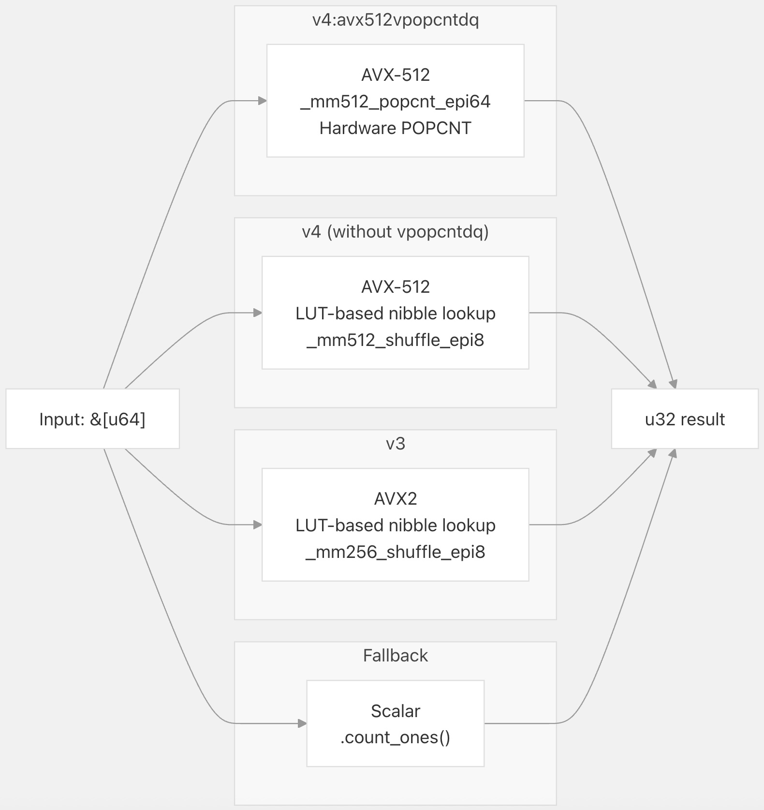
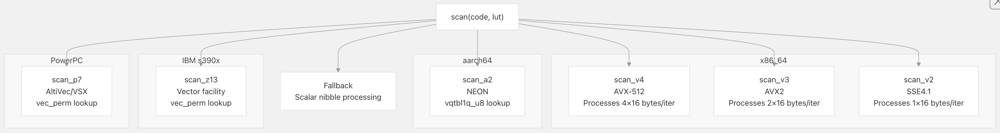
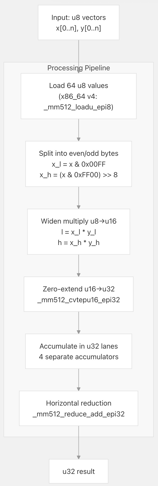
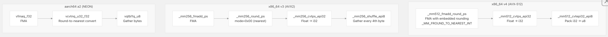
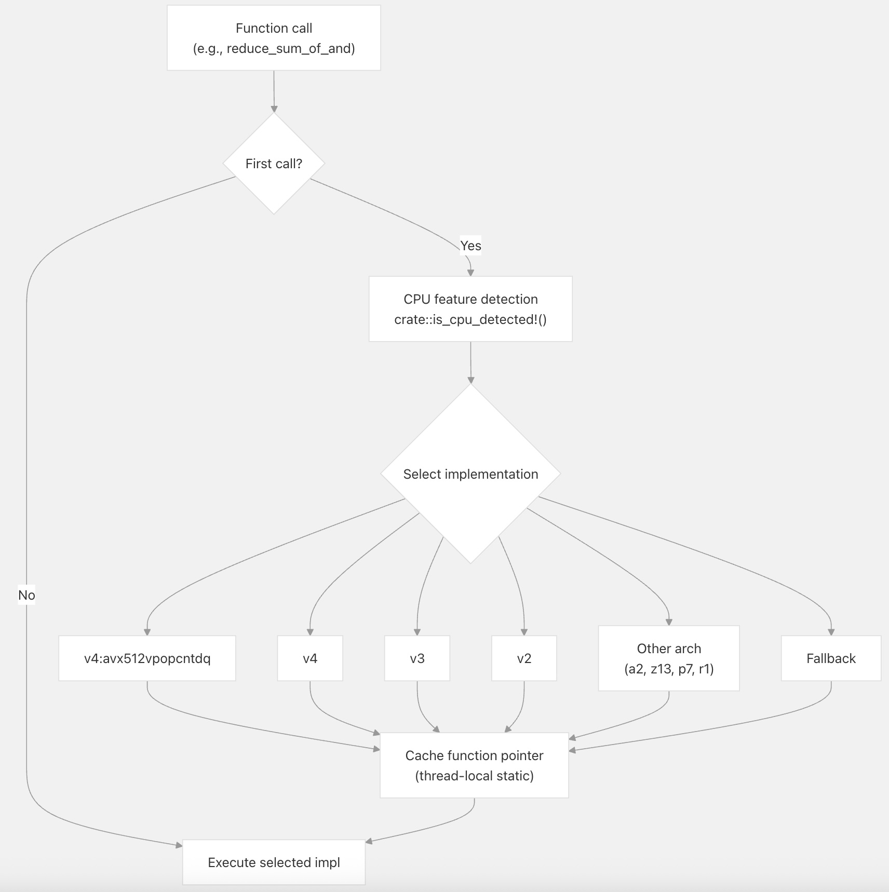

## VectorChord 源码学习: 3.4.1 SIMD 操作参考 (SIMD Operations Reference)  
                                    
### 作者                                    
digoal                                    
                                    
### 日期                                    
2025-11-01                                    
                                    
### 标签                                    
VectorChord , 源码学习                                    
                                    
----                                    
                                    
## 背景          
本文提供了对 VectorChord `simd` **包 (crate)** 中可用的低级 **SIMD 操作 (SIMD operations)** 的详细参考。这些操作构成了驱动 **距离计算 (distance calculations)**、**量化 (quantization)** 和 **搜索操作 (search operations)** 的**计算原语 (computational primitives)**。  
  
## 概述 (Overview)  
  
**SIMD 操作库 (SIMD operations library)** 为跨多个 **CPU 架构 (CPU architectures)** 的常见**向量处理任务 (vector processing tasks)** 提供了手工优化的实现。每个操作都遵循一致的模式：针对不同的 **CPU 特性级别 (CPU feature levels)**（如 x86\_64 v2/v3/v4, aarch64 a2 等）的专用实现，以及一个**标量回退 (scalar fallback)** 方案，通过 `multiversion` **宏 (macro)** 在**运行时 (runtime)** 进行**调度 (dispatched)**。  
  
**操作类别 (Operation Categories)**  
  
  
  
**来源 (Sources)**: [`crates/simd/src/bit.rs` 1-1021](https://github.com/tensorchord/VectorChord/blob/ac12e257/crates/simd/src/bit.rs#L1-L1021) [`crates/simd/src/fast_scan.rs` 1-688](https://github.com/tensorchord/VectorChord/blob/ac12e257/crates/simd/src/fast_scan.rs#L1-L688) [`crates/simd/src/u8.rs` 1-740](https://github.com/tensorchord/VectorChord/blob/ac12e257/crates/simd/src/u8.rs#L1-L740) [`crates/simd/src/quantize.rs` 1-312](https://github.com/tensorchord/VectorChord/blob/ac12e257/crates/simd/src/quantize.rs#L1-L312)  
  
## 位操作 (Bitwise Operations)  
  
**位操作 (Bitwise operations)** 计算 u64 **数组 (arrays)** 之间**布尔组合 (boolean combinations)** 的**总体计数 (population counts)**（即 **汉明权重 (Hamming weights)**）。这些对于**二进制向量 (binary vectors)** 的**距离度量 (distance metrics)** 和 **RaBitQ 量化 (RaBitQ quantization)** 至关重要。  
  
### 缩减操作 (Reduction Operations)  
  
| 函数 (Function) | 签名 (Signature) | 用途 (Purpose) |  
| :--- | :--- | :--- |  
| `reduce_sum_of_and` | `(&[u64], &[u64]) -> u32` | 位 AND (bitwise AND) 的总体计数总和 |  
| `reduce_sum_of_or` | `(&[u64], &[u64]) -> u32` | 位 OR (bitwise OR) 的总体计数总和 |  
| `reduce_sum_of_xor` | `(&[u64], &[u64]) -> u32` | 位 XOR (bitwise XOR) 的总体计数总和（**汉明距离** (Hamming distance)） |  
| `reduce_sum_of_and_or` | `(&[u64], &[u64]) -> (u32, u32)` | 同时计算 AND 和 OR 的计数 |  
| `reduce_sum_of_x` | `(&[u64]) -> u32` | 总体计数总和（总设置位数 (total set bits)） |  
  
**实现策略 (Implementation Strategy)**  
  
  
  
**来源 (Sources)**: [`crates/simd/src/bit.rs` 16-196](https://github.com/tensorchord/VectorChord/blob/ac12e257/crates/simd/src/bit.rs#L16-L196) [`crates/simd/src/bit.rs` 198-379]() [`crates/simd/src/bit.rs` 381-562](https://github.com/tensorchord/VectorChord/blob/ac12e257/crates/simd/src/bit.rs#L198-L379)  
  
**总体计数技术 (Population Count Techniques)**  
  
这些实现根据**硬件能力 (hardware capabilities)** 采用了两种不同的方法：  
  
1.  **硬件 POPCNT (Hardware POPCNT)**（x86\_64 v4 带有 **AVX-512 VPOPCNTDQ**）：使用原生的 `_mm512_popcnt_epi64` **指令 (instruction)**，直接计算每个 64 位**通道 (lane)** 中的位数。这是在可用时最快的方法。  
2.  **基于 LUT 的半字节查找 (LUT-based Nibble Lookup)**：对于没有硬件总体计数的架构，使用一个 16 字节的**查找表 (LUT)** 来编码所有 4 位值 (0-15) 的总体计数。该算法：将每个字节拆分为低半字节 (low nibble) 和高半字节 (high nibble)（各 4 位）；使用 `_mm512_shuffle_epi8` 或等效指令来查找每个半字节的总体计数；使用 `_mm512_sad_epu8`（**绝对差值之和 (sum of absolute differences)**）累加结果。  
  
**示例: 使用 LUT 的 reduce\_sum\_of\_and**  
  
[`crates/simd/src/bit.rs` 68-109](https://github.com/tensorchord/VectorChord/blob/ac12e257/crates/simd/src/bit.rs#L68-L109) 展示了 v4 **LUT 实现 (LUT implementation)**：  
  
  * **静态 LUT (Static LUT)**: `[[0, 1, 1, 2, 1, 2, 2, 3, ...]; 4]`（用于 512 位**寄存器 (register)** 的 4 个副本）  
  * 每次**迭代 (iteration)** 处理 8 个 u64 值（512 位）  
  * 使用 `0x0f` 进行**掩码 (Masks)** 以提取半字节  
  * 使用 `_mm512_shuffle_epi8` 进行**并行 LUT 查找 (parallel LUT lookups)**  
  
**来源 (Sources)**: [`crates/simd/src/bit.rs` 20-196](https://github.com/tensorchord/VectorChord/blob/ac12e257/crates/simd/src/bit.rs#L20-L196) [`crates/simd/src/bit.rs` 71-72](https://github.com/tensorchord/VectorChord/blob/ac12e257/crates/simd/src/bit.rs#L71-L72) [`crates/simd/src/bit.rs` 86-92](https://github.com/tensorchord/VectorChord/blob/ac12e257/crates/simd/src/bit.rs#L86-L92)  
  
### 向量操作 (Vector Operations)  
  
| 函数 (Function) | 签名 (Signature) | 用途 (Purpose) |  
| :--- | :--- | :--- |  
| `vector_and` | `(&[u64], &[u64]) -> Vec<u64>` | **元素级** (Element-wise) 位 AND (bitwise AND) |  
| `vector_or` | `(&[u64], &[u64]) -> Vec<u64>` | **元素级** (Element-wise) 位 OR (bitwise OR) |  
| `vector_xor` | `(&[u64], &[u64]) -> Vec<u64>` | **元素级** (Element-wise) 位 XOR (bitwise XOR) |  
  
这些函数执行**元素级布尔运算 (element-wise boolean operations)**，不进行总体计数。它们用于**预过滤 (pre-filtering)** 和**复合距离计算 (composite distance calculations)** 中的**二进制向量操作 (binary vector manipulation)**。  
  
**来源 (Sources)**: [`crates/simd/src/bit.rs` 947-1020](https://github.com/tensorchord/VectorChord/blob/ac12e257/crates/simd/src/bit.rs#L947-L1020)  
  
## 快速扫描操作 (Fast Scan Operations)  
  
**快速扫描模块 (fast scan module)** 实现了针对 **RaBitQ 编码 (RaBitQ encoding)** 的高效 4 位**量化距离表查找 (quantized distance table lookups)**。这是**乘积量化 (product quantization)** 的专用操作，其中到**质心 (centroids)** 的距离是预先计算并打包的。  
  
### 数据布局 (Data Layout)  
  
**4 位代码布局（输入） (4-bit Code Layout (Input))**  
  
```  
单个向量组的字节布局 (Byte Layout for Single Vector Group):  
| 字节 0     | 字节 1     | 字节 2     | ... | 字节 n/2-1 |  
| 代码 0,1   | 代码 2,3   | 代码 4,5   | ... | 代码 n-2,n-1 |  
  
半字节编码 (Nibble Encoding):  
  位 0-3: 代码 i  
  位 4-7: 代码 i+1  
```  
  
**打包代码布局（针对 32 个向量） (Packed Code Layout (for 32 Vectors))**  
  
```  
16 字节块, 总共 32 个向量, n 维度:  
块 0: [向量 0,8,1,9,2,10,...,15,31 的 代码 0]  
块 1: [向量 0,8,1,9,2,10,...,15,31 的 代码 1]  
...  
块 n-1: [向量 0,8,1,9,2,10,...,15,31 的 代码 n-1]  
  
结果 (Result): [u16; 32], 包含每个向量的累积距离 (accumulated distances)  
```  
  
**来源 (Sources)**: [`crates/simd/src/fast_scan.rs` 15-46](https://github.com/tensorchord/VectorChord/blob/ac12e257/crates/simd/src/fast_scan.rs#L15-L46)  
  
### 扫描函数 (Scan Function)  
  
**签名 (Signature)**: `scan(code: &[[u8; 16]], lut: &[[u8; 16]]) -> [u16; 32]`  
  
同时对 32 个向量执行**并行表查找 (parallel table lookups)**。对于每个**维度 (dimension)**：从打包输入中提取 4 位**代码 (codes)**；从 **LUT** 中查找预计算的**距离值 (distance values)**；将结果累加到 32 个单独的 u16 **和 (sums)** 中。  
  
**特定于架构的实现 (Architecture-Specific Implementations)**  
  
  
  
**来源 (Sources)**: [`crates/simd/src/fast_scan.rs` 49-666](https://github.com/tensorchord/VectorChord/blob/ac12e257/crates/simd/src/fast_scan.rs#L49-L666)  
  
**关键实现细节 (Key Implementation Details)**  
  
v4 **AVX-512 实现 (AVX-512 implementation)** [`crates/simd/src/fast_scan.rs` 53-158](https://github.com/tensorchord/VectorChord/blob/ac12e257/crates/simd/src/fast_scan.rs#L53-L158) 使用了复杂的**累加策略 (accumulation strategy)**：  
  
1.  **四个独立的累加器 (Four Separate Accumulators)**：维护 `accu_0`、`accu_1`、`accu_2`、`accu_3` 以避免 u16 **通道 (lanes)** 溢出 (overflow)。  
2.  **半字节提取 (Nibble Extraction)**：对低半字节使用带有**掩码 (mask)** `0x0f` 的 `_mm512_and_si512`，对高半字节使用 `_mm512_srli_epi16` + 掩码。  
3.  **重排查找 (Shuffle Lookup)**：`_mm512_shuffle_epi8(lut, code)` 每次**指令 (instruction)** 执行 64 次**并行 LUT 查找 (parallel LUT lookups)**。  
4.  **拆分累加 (Split Accumulation)**：查找结果的低字节和高字节分别累加，以正确处理 u16 **算术运算 (arithmetic)**。  
5.  **最终组合 (Final Combination)**：`combine4x2` **辅助函数 (helper function)** [`crates/simd/src/fast_scan.rs` 68-78](https://github.com/tensorchord/VectorChord/blob/ac12e257/crates/simd/src/fast_scan.rs#L68-L78) 使用**置换 (permutes)** 和**混合 (blends)** 合并部分结果。  
  
**来源 (Sources)**: [`crates/simd/src/fast_scan.rs` 53-158](https://github.com/tensorchord/VectorChord/blob/ac12e257/crates/simd/src/fast_scan.rs#L53-L158) [`crates/simd/src/fast_scan.rs` 80-156](https://github.com/tensorchord/VectorChord/blob/ac12e257/crates/simd/src/fast_scan.rs#L80-L156)  
  
### Accu 函数 (Accu Function)  
  
**签名 (Signature)**: `accu(sum: &mut [u32; 32], delta: &[u16; 32])`  
  
将一个 **delta 数组 (delta array)** 累加到一个**运行总和数组 (running sum array)** 中。用于处理**向量批次 (batches of vectors)** 时聚合多个扫描结果。该实现虽然简单 (**trivial**)，但受益于 **SIMD 自动向量化 (SIMD auto-vectorization)**。  
  
**来源 (Sources)**: [`crates/simd/src/fast_scan.rs` 673-687](https://github.com/tensorchord/VectorChord/blob/ac12e257/crates/simd/src/fast_scan.rs#L673-L687)  
  
## U8 操作 (U8 Operations)  
  
**U8 操作 (U8 operations)** 提供对 u8 **数组 (arrays)** 的**加宽算术运算 (widening arithmetic)**，以防止在**累加 (accumulation)** 期间溢出 (**overflow**)。这对于**量化向量 (quantized vectors)** 上的**距离计算 (distance calculations)** 至关重要，因为中间结果必须累加到更宽的**类型 (types)** 中。  
  
### 操作参考 (Operation Reference)  
  
| 函数 (Function) | 签名 (Signature) | 用途 (Purpose) | 溢出策略 (Overflow Strategy) |  
| :--- | :--- | :--- | :--- |  
| `reduce_sum_of_x_as_u32_y_as_u32` | `(&[u8], &[u8]) -> u32` | **点积 (Dot product)**: `Σ(x[i] * y[i])` 作为 u32 | 乘法时**加宽 (Widen)** 到 u16，在 u32 中累加 |  
| `reduce_sum_of_x_as_u16` | `(&[u8]) -> u16` | **求和 (Sum)**: `Σ(x[i])` 作为 u16 | 累加前**零扩展 (Zero-extend)** u8→u16 |  
| `reduce_sum_of_x_as_u32` | `(&[u8]) -> u32` | **求和 (Sum)**: `Σ(x[i])` 作为 u32 | 累加前**零扩展 (Zero-extend)** u8→u16→u32 |  
  
### 加宽乘法策略 (Widening Multiplication Strategy)  
  
**`reduce_sum_of_x_as_u32_y_as_u32` 实现模式 (Implementation Pattern)**  
  
  
  
**来源 (Sources)**: [`crates/simd/src/u8.rs` 19-66](https://github.com/tensorchord/VectorChord/blob/ac12e257/crates/simd/src/u8.rs#L19-L66)  
  
**关键细节 (Critical Details)**  
  
v4 **实现 (implementation)** [`crates/simd/src/u8.rs` 19-66](https://github.com/tensorchord/VectorChord/blob/ac12e257/crates/simd/src/u8.rs#L19-L66) 展示了仔细的**溢出管理 (overflow management)**：  
  
1.  **字节通道分离 (Byte Lane Separation)**：使用**掩码 (masks)** `0x00ff` 和 `0xff00` 分离 u16 **通道 (lanes)** 内的奇/偶**字节 (bytes)**。  
2.  **16 位乘法 (16-bit Multiplication)**：`_mm512_mullo_epi16` 在 u16 中计算**乘积 (products)**（安全，因为 u8\*u8 ≤ 65025 \< 65536）。  
3.  **32 位累加 (32-bit Accumulation)**：累加前通过 `_mm512_cvtepu16_epi32` **零扩展 (Zero-extends)** u16→u32。  
4.  **四个累加器 (Four Accumulators)**：维护 `_0`、`_1`、`_2`、`_3` 以延迟溢出（4 × 65535 × 64 \< 2^32）。  
5.  **块处理 (Chunk Processing)**：在 **AVX-512** 上每次**迭代 (iteration)** 处理 64 个 u8 值。  
  
**来源 (Sources)**: [`crates/simd/src/u8.rs` 19-66](https://github.com/tensorchord/VectorChord/blob/ac12e257/crates/simd/src/u8.rs#L19-L66) [`crates/simd/src/u8.rs` 34-46](https://github.com/tensorchord/VectorChord/blob/ac12e257/crates/simd/src/u8.rs#L34-L46)  
  
### 求和操作 (Sum Operations)  
  
**`reduce_sum_of_x_as_u16` 和 `reduce_sum_of_x_as_u32`**  
  
这些函数对 u8 值进行**加宽求和 (sum with widening)** 以防止溢出。这些实现使用了**零扩展内部函数 (zero-extension intrinsics)**：  
  
  * `_mm512_cvtepi8_epi16` (x86\_64 v4)：**符号扩展 (Sign-extends)** i8→i16，然后用 `0x00ff` 掩码进行**零扩展 (zero-extend)**。  
  * `_mm512_cvtepi8_epi32` (x86\_64 v4)：**符号扩展 (Sign-extends)** i8→i32，然后用 `0xff` 掩码进行**零扩展 (zero-extend)**。  
  * `vmovl_u8` (aarch64 a2)：直接**零扩展 (Zero-extends)** u8→u16。  
  
**来源 (Sources)**: [`crates/simd/src/u8.rs` 335-353](https://github.com/tensorchord/VectorChord/blob/ac12e257/crates/simd/src/u8.rs#L335-L353) [`crates/simd/src/u8.rs` 540-557](https://github.com/tensorchord/VectorChord/blob/ac12e257/crates/simd/src/u8.rs#L540-L557)  
  
## 量化操作 (Quantization Operations)  
  
**量化操作 (Quantization operations)** 将**浮点向量 (floating-point vectors)** 转换为**整数表示 (integer representations)**，以实现**紧凑存储 (compact storage)** 和更快的**距离计算 (distance calculations)**。  
  
### mul\_add\_round  
  
**签名 (Signature)**: `mul_add_round(this: &[f32], k: f32, b: f32) -> Vec<u8>`  
  
执行**元素级量化 (element-wise quantization)**: `result[i] = round((this[i] * k) + b) as u8`  
  
这是**标量量化 (scalar quantization)** 的**核心原语 (core primitive)**，其中：  
  
  * `k`：**缩放因子 (Scale factor)**（通常为 `1.0 / step_size`）  
  * `b`：**偏移量 (Offset)**（通常为 `-min / step_size`）  
  * **舍入 (Rounding)**：使用“**四舍五入到偶数 (round ties to even)**”（**银行家舍入 (banker's rounding)**）。  
  
**特定于架构的舍入 (Architecture-Specific Rounding)**  
  
  
  
**来源 (Sources)**: [`crates/simd/src/quantize.rs` 18-53](https://github.com/tensorchord/VectorChord/blob/ac12e257/crates/simd/src/quantize.rs#L18-L53) [`crates/simd/src/quantize.rs` 78-123](https://github.com/tensorchord/VectorChord/blob/ac12e257/crates/simd/src/quantize.rs#L78-L123) [`crates/simd/src/quantize.rs` 214-263](https://github.com/tensorchord/VectorChord/blob/ac12e257/crates/simd/src/quantize.rs#L214-L263)  
  
**关键差异 (Key Differences)**  
  
  * **AVX-512**：`_mm512_fmadd_round_ps` 在单个**指令 (instruction)** 中执行 **FMA** 和**舍入 (rounding)** [`crates/simd/src/quantize.rs` 29-29](https://github.com/tensorchord/VectorChord/blob/ac12e257/crates/simd/src/quantize.rs#L29-L29)  
  * **AVX2**：在 **FMA** 之后需要单独的 `_mm256_round_ps` [`crates/simd/src/quantize.rs` 95-96](https://github.com/tensorchord/VectorChord/blob/ac12e257/crates/simd/src/quantize.rs#L95-L96)  
  * **NEON**：使用 `vcvtnq_u32_f32`，它在**转换 (conversion)** 过程中执行**舍入 (rounding)** [`crates/simd/src/quantize.rs` 238-238](https://github.com/tensorchord/VectorChord/blob/ac12e257/crates/simd/src/quantize.rs#L238-L238)  
  
**打包策略 (Packing Strategy)**：转换成 i32 后，实现会从每个 4 字节**通道 (lane)** 中收集低字节：  
  
  * **AVX-512**：`_mm512_cvtepi32_epi8` **硬件指令 (hardware instruction)**  
  * **AVX2**：使用**置换掩码 (permutation mask)** `[0,4,8,12,...]` 的 `_mm256_shuffle_epi8`  
  * **NEON**：使用**索引向量 (index vector)** 的 `vqtbl1q_u8`  
  
**来源 (Sources)**: [`crates/simd/src/quantize.rs` 31-33](https://github.com/tensorchord/VectorChord/blob/ac12e257/crates/simd/src/quantize.rs#L31-L33) [`crates/simd/src/quantize.rs` 82-103](https://github.com/tensorchord/VectorChord/blob/ac12e257/crates/simd/src/quantize.rs#L82-L103) [`crates/simd/src/quantize.rs` 229-243](https://github.com/tensorchord/VectorChord/blob/ac12e257/crates/simd/src/quantize.rs#L229-L243)  
  
### quantize  
  
**签名 (Signature)**: `quantize(lut: &[f32], n: f32) -> (f32, f32, Vec<u8>)`  
  
**高级量化函数 (High-level quantization function)**，它：  
  
1.  查找输入**数组 (array)** 中的**最小值 (min)**/**最大值 (max)**；  
2.  计算**量化参数 (quantization parameters)** `k`（**缩放因子 (scale)**）和 `b`（**偏移量 (offset)**）；  
3.  调用 `mul_add_round` 以生成**量化值 (quantized values)**。  
  
返回**元组 (tuple)**：`(k, b, quantized_values)`  
  
**量化公式 (quantization formula)** 确保值映射到范围 `[0, n]`：  
  
  * `k = max(0.0, (max - min) / n)`  
  * `b = min`  
  * `quantized[i] = round((lut[i] - b) / k)`  
  
**来源 (Sources)**: [`crates/simd/src/quantize.rs` 305-311](https://github.com/tensorchord/VectorChord/blob/ac12e257/crates/simd/src/quantize.rs#L305-L311)  
  
## 架构支持矩阵 (Architecture Support Matrix)  
  
下表总结了每种操作类别所需的 **CPU 特性 (CPU feature)** 和实现可用性：  
  
| 操作 (Operation) | x86\_64 v4 | x86\_64 v3 | x86\_64 v2 | aarch64 a2 | s390x z13+ | ppc64 p7+ | riscv64 r1 |  
| :--- | :--- | :--- | :--- | :--- | :--- | :--- | :--- |  
| **位缩减 (Bitwise Reductions)** | ✓ (+vpopcntdq) | ✓ | ✓ | ✓ | ✓ | ✓ | ✓ |  
| **位向量 (Bitwise Vectors)** | ✓ | ✓ | ✓ | ✓ | ✓ | ✓ | ✓ |  
| **快速扫描 (Fast Scan)** | ✓ | ✓ | ✓ | ✓ | ✓ | ✓ | **回退 (Fallback)** |  
| **U8 点积 (U8 Dot Product)** | ✓ | ✓ | ✓ | ✓ | **回退 (Fallback)** | **回退 (Fallback)** | **回退 (Fallback)** |  
| **U8 求和 (u16) (U8 Sum (u16))** | ✓ | ✓ | ✓ | ✓ | **回退 (Fallback)** | **回退 (Fallback)** | **回退 (Fallback)** |  
| **U8 求和 (u32) (U8 Sum (u32))** | ✓ | ✓ | ✓ | ✓ | **回退 (Fallback)** | **回退 (Fallback)** | **回退 (Fallback)** |  
| **量化 (Quantization)** | ✓ | ✓ | ✓ (FMA) | ✓ | **回退 (Fallback)** | **回退 (Fallback)** | **回退 (Fallback)** |  
  
**特性要求 (Feature Requirements)**:  
  
  * x86\_64 v2: **SSE4.1**, **POPCNT**  
  * x86\_64 v3: **AVX2**, **FMA**, **BMI2**  
  * x86\_64 v4: **AVX-512F**, **AVX-512BW**, **AVX-512CD**, **AVX-512DQ**, **AVX-512VL**  
  * x86\_64 v4 + vpopcntdq: **AVX-512VPOPCNTDQ**（**位操作 (bitwise operations)** 的最佳选择）  
  * aarch64 a2: **NEON**（**ARMv8 基线 (baseline)**）  
  * s390x z13+: **向量能力 (Vector Facility)**  
  * ppc64 p7+: **AltiVec**, **VSX**  
  
**来源 (Sources)**: [`crates/simd/src/bit.rs` 186-186](https://github.com/tensorchord/VectorChord/blob/ac12e257/crates/simd/src/bit.rs#L186-L186) [`crates/simd/src/fast_scan.rs` 614-614](https://github.com/tensorchord/VectorChord/blob/ac12e257/crates/simd/src/fast_scan.rs#L614-L614) [`crates/simd/src/u8.rs` 314-314](https://github.com/tensorchord/VectorChord/blob/ac12e257/crates/simd/src/u8.rs#L314-L314) [`crates/simd/src/quantize.rs` 286-286](https://github.com/tensorchord/VectorChord/blob/ac12e257/crates/simd/src/quantize.rs#L286-L286)  
  
## 多版本调度模式 (Multiversion Dispatch Pattern)  
  
所有操作都遵循使用 `multiversion` **过程宏 (procedural macro)** 的一致**调度模式 (dispatch pattern)**。该**宏 (macro)** 生成**运行时 CPU 特性检测 (runtime CPU feature detection)** 和**函数指针调度 (function pointer dispatching)**。  
  
**调度流程 (Dispatch Flow)**  
  
  
  
**来源 (Sources)**: [`crates/simd/src/bit.rs` 186-195](https://github.com/tensorchord/VectorChord/blob/ac12e257/crates/simd/src/bit.rs#L186-L195)  
  
**宏使用示例 (Macro Usage Example)**  
  
```rust  
#[crate::multiversion(  
    @"v4:avx512vpopcntdq",  // @ prefix = check feature at runtime  
    @"v4",                   // @ prefix = check feature at runtime    
    @"v3",                   // @ prefix = check feature at runtime  
    "v2",                    // No @ = compile-time only  
    "a2",                    // Architecture alternatives  
    "z17", "z16", ...        // Additional targets  
)]  
pub fn reduce_sum_of_and(lhs: &[u64], rhs: &[u64]) -> u32 {  
    // Fallback scalar implementation  
}  
```  
  
`@` **前缀 (prefix)** 表示**运行时特性检测 (runtime feature detection)**。如果没有它，则仅当**目标 (target)** 在**编译时 (compile time)** 支持该**变体 (variant)** 时才会进行编译。  
  
**来源 (Sources)**: [`crates/simd/src/bit.rs` 186-186](https://github.com/tensorchord/VectorChord/blob/ac12e257/crates/simd/src/bit.rs#L186-L186) [`crates/simd/src/fast_scan.rs` 614-614](https://github.com/tensorchord/VectorChord/blob/ac12e257/crates/simd/src/fast_scan.rs#L614-L614)  
    
  
#### [期望 PostgreSQL|开源PolarDB 增加什么功能?](https://github.com/digoal/blog/issues/76 "269ac3d1c492e938c0191101c7238216")
  
  
#### [PolarDB 开源数据库](https://openpolardb.com/home "57258f76c37864c6e6d23383d05714ea")
  
  
#### [PolarDB 学习图谱](https://www.aliyun.com/database/openpolardb/activity "8642f60e04ed0c814bf9cb9677976bd4")
  
  
#### [PostgreSQL 解决方案集合](../201706/20170601_02.md "40cff096e9ed7122c512b35d8561d9c8")
  
  
#### [德哥 / digoal's Github - 公益是一辈子的事.](https://github.com/digoal/blog/blob/master/README.md "22709685feb7cab07d30f30387f0a9ae")
  
  
#### [About 德哥](https://github.com/digoal/blog/blob/master/me/readme.md "a37735981e7704886ffd590565582dd0")
  
  

  
