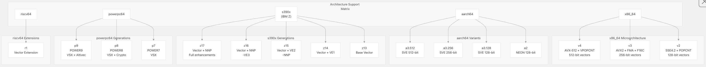
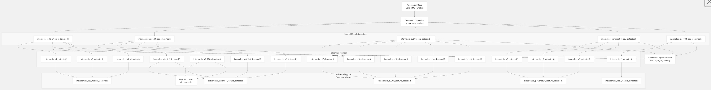
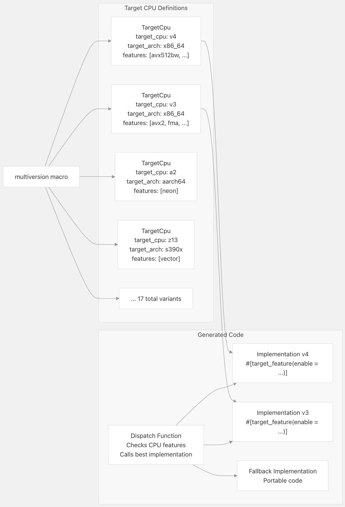
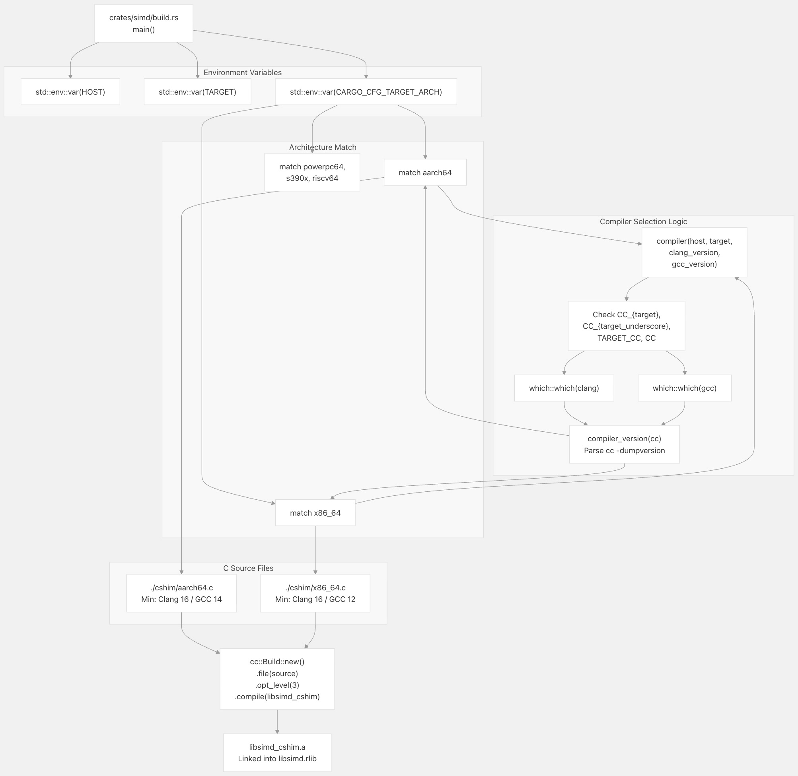
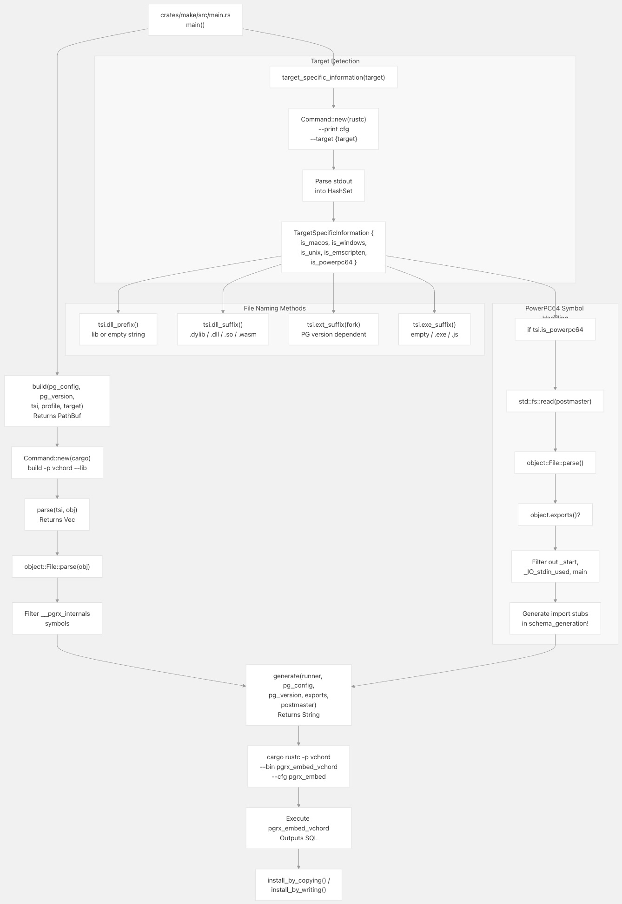

## VectorChord 源码学习: 3.4.2 跨平台 SIMD 实现 (Cross-Platform SIMD Implementation)  
                                      
### 作者                                      
digoal                                      
                                      
### 日期                                      
2025-11-01                                      
                                      
### 标签                                      
VectorChord , 源码学习                                      
                                      
----                                      
                                      
## 背景            
本文介绍 VectorChord 的**跨平台 SIMD 实现** (cross-platform SIMD implementation)，包括 **CPU 特性检测** (CPU feature detection)、**多版本调度** (multiversion dispatch) 和**架构特定优化** (architecture-specific optimizations)。它重点阐述了系统如何在**运行时** (runtime) 动态选择最适合目标 CPU 的实现，以及如何在**构建时** (build time) 为特定架构编译 **C 垫片** (C shims)。  
  
## 架构支持概述 (Architecture Support Overview)  
  
VectorChord 支持跨六种主要 CPU 架构的 SIMD 加速 (acceleration)，每种架构都有多个**微架构级别** (microarchitecture levels)，以最大限度地提高在现代和传统硬件上的性能。  
  
  
  
来源: [`crates/simd_macros/src/target.rs` 21-161](https://github.com/tensorchord/VectorChord/blob/ac12e257/crates/simd_macros/src/target.rs#L21-L161)  
  
## CPU 特性检测系统 (CPU Feature Detection System)  
  
VectorChord 实现了全面的**运行时 CPU 特性检测** (runtime CPU feature detection)，以选择适用于主机处理器 (host processor) 的最佳 SIMD 实现。该检测系统使用了 Rust 标准库提供的**架构特定内联函数** (architecture-specific intrinsics)。  
  
### 检测架构 (Detection Architecture)  
  
**运行时 CPU 特性检测流程** (Runtime CPU Feature Detection Flow)  
  
  
  
检测系统组织在 [`crates/simd/src/lib.rs` 117-312](https://github.com/tensorchord/VectorChord/blob/ac12e257/crates/simd/src/lib.rs#L117-L312) 的 `internal` 模块中，并通过**条件编译** (conditional compilation) 导出**架构特定检测函数** (architecture-specific detection functions)。每个架构都有一个由 `simd_macros` 中的 `define_is_cpu_detected!` **宏** (macro) 生成的顶层 `is_*_cpu_detected()` 函数，该函数内部调用用于微架构级别检测的辅助函数 (helper functions)。  
  
来源: [`crates/simd/src/lib.rs` 117-351](https://github.com/tensorchord/VectorChord/blob/ac12e257/crates/simd/src/lib.rs#L117-L351)  
  
### x86_64 特性检测 (Feature Detection)  
  
x86_64 架构提供了三个微架构级别 (microarchitecture levels)，对应于不同世代的 Intel 和 AMD 处理器：  
  
| 级别 (Level) | 向量宽度 (Vector Width) | 关键特性 (Key Features) | 检测函数 (Detection Function) |  
| :--- | :--- | :--- | :--- |  
| v4 | 512 位 (512-bit) | AVX-512BW/CD/DQ/VL, BMI1/2, LZCNT, MOVBE, POPCNT | `` `is_v4_detected()` `` |  
| v3 | 256 位 (256-bit) | AVX2, F16C, FMA, BMI1/2, LZCNT, MOVBE, POPCNT | `` `is_v3_detected()` `` |  
| v2 | 128 位 (128-bit) | SSE4.2, POPCNT | `` `is_v2_detected()` `` |  
  
检测函数会**原子性地** (atomically) 检查多个特性，以确保所有必需的功能都存在：  
```  
// x86_64 v4 detection  
pub fn is_v4_detected() -> bool {  
    std::arch::is_x86_feature_detected!("avx512bw")  
        && std::arch::is_x86_feature_detected!("avx512cd")  
        && std::arch::is_x86_feature_detected!("avx512dq")  
        && std::arch::is_x86_feature_detected!("avx512vl")  
        && std::arch::is_x86_feature_detected!("bmi1")  
        && std::arch::is_x86_feature_detected!("bmi2")  
        && std::arch::is_x86_feature_detected!("lzcnt")  
        && std::arch::is_x86_feature_detected!("movbe")  
        && std::arch::is_x86_feature_detected!("popcnt")  
}  
```  
  
来源: [`crates/simd/src/lib.rs` 154-183](https://github.com/tensorchord/VectorChord/blob/ac12e257/crates/simd/src/lib.rs#L154-L183)  
  
### ARM aarch64 特性检测 (Feature Detection)  
  
ARM 处理器同时支持**固定宽度 NEON** (fixed-width NEON, 128 位) 和**可伸缩宽度 SVE** (Scalable Vector Extension)。对于 SVE，VectorChord 在运行时 (runtime) 使用 `` `rdvl` `` **汇编指令** (assembly instruction) 来检测实际的向量长度 (vector length)：  
  
| 变体 (Variant) | 向量宽度 (Vector Width) | 特性 (Features) | 检测函数 (Detection Function) |  
| :--- | :--- | :--- | :--- |  
| a3.512 | 512 位 (512-bit) | SVE with VL ≥ 512 bits | `` `is_a3_512_detected()` `` |  
| a3.256 | 256 位 (256-bit) | SVE with VL ≥ 256 bits | `` `is_a3_256_detected()` `` |  
| a3.128 | 128 位 (128-bit) | SVE with VL ≥ 128 bits | `` `is_a3_128_detected()` `` |  
| a2 | 128 位 (128-bit) | NEON | `` `is_a2_detected()` `` |  
  
SVE 向量长度检测使用**内联汇编** (inline assembly) 来查询硬件：  
```  
#[target_feature(enable = "sve")]  
fn is_512_detected() -> bool {  
    let vl: u64;  
    unsafe {  
        core::arch::asm!(  
            "rdvl {0}, #8",  
            out(reg) vl  
        );  
    }  
    vl >= 512  
}  
```  
  
这种方法允许 VectorChord 在可用时利用更大的**向量寄存器** (vector registers)，同时在 SVE 支持有限的处理器上**回退** (fall back) 到较小的宽度或 NEON。  
  
来源: [`crates/simd/src/lib.rs` 184-227](https://github.com/tensorchord/VectorChord/blob/ac12e257/crates/simd/src/lib.rs#L184-L227)  
  
### IBM s390x 特性检测 (Feature Detection)  
  
IBM Z **大型机处理器** (mainframe processors) 提供了丰富的**向量指令集** (vector instruction set)，该指令集经历了多代演进 (z13 到 z17)。每一代都增加了渐进的增强功能 (incremental enhancements)：  
  
| 世代 (Generation) | 关键增强功能 (Key Enhancements) | 检测函数 (Detection Function) |  
| :--- | :--- | :--- |  
| z17 | Vector Enhancements 3, Vector Packed Decimal Enhancement 3, Miscellaneous Extensions 4 | `` `is_z17_detected()` `` |  
| z16 | Vector Packed Decimal Enhancement 2, NNP Assist | `` `is_z16_detected()` `` |  
| z15 | Vector Enhancements 2, Miscellaneous Extensions 3 | `` `is_z15_detected()` `` |  
| z14 | Vector Enhancements 1, Miscellaneous Extensions 2 | `` `is_z14_detected()` `` |  
| z13 | Base Vector Facility | `` `is_z13_detected()` `` |  
  
每个检测函数都会检查该世代所需的**累积特性集** (cumulative set of features)。例如，z17 需要前几代的所有特性以及其新增功能。  
  
来源: [`crates/simd/src/lib.rs` 229-280](https://github.com/tensorchord/VectorChord/blob/ac12e257/crates/simd/src/lib.rs#L229-L280)  
  
### PowerPC powerpc64 特性检测 (Feature Detection)  
  
PowerPC 处理器支持 **AltiVec** (VMX) 和 **VSX** (Vector Scalar Extension) **指令集** (instruction sets)，并在 POWER8 和 POWER9 中增加了增强功能：  
  
| 世代 (Generation) | 特性 (Features) | 检测函数 (Detection Function) |  
| :--- | :--- | :--- |  
| p9 | AltiVec, VSX, POWER8 AltiVec/Crypto/Vector, POWER9 AltiVec/Vector | `` `is_p9_detected()` `` |  
| p8 | AltiVec, VSX, POWER8 AltiVec/Crypto/Vector | `` `is_p8_detected()` `` |  
| p7 | AltiVec, VSX | `` `is_p7_detected()` `` |  
  
来源: [`crates/simd/src/lib.rs` 282-306](https://github.com/tensorchord/VectorChord/blob/ac12e257/crates/simd/src/lib.rs#L282-L306)  
  
### RISC-V riscv64 特性检测 (Feature Detection)  
  
RISC-V 的支持目前仅限于检查**向量扩展** (vector extension) 的单一配置：  
```  
pub fn is_r1_detected() -> bool {  
    std::arch::is_riscv_feature_detected!("v")  
}  
```  
  
来源: [`crates/simd/src/lib.rs` 308-311](https://github.com/tensorchord/VectorChord/blob/ac12e257/crates/simd/src/lib.rs#L308-L311)  
  
## 多版本调度 (Multiversion Dispatch)  
  
来自 `simd_macros` **包** (crate) 的 `multiversion` **过程宏** (procedural macro) 能够自动生成针对不同 CPU 特性的多个函数实现，并通过**运行时调度** (runtime dispatch) 来选择最佳变体 (optimal variant)。  
  
### 目标 CPU 配置 (Target CPU Configuration)  
  
所有支持的**目标 CPU 配置** (target CPU configurations) 都定义在 `TARGET_CPUS` 中，它为每个变体指定了目标架构 (target architecture)、CPU 标识符 (CPU identifier) 和所需的**目标特性** (target features)：  
  
  
  
来源: [`crates/simd_macros/src/target.rs` 15-161](https://github.com/tensorchord/VectorChord/blob/ac12e257/crates/simd_macros/src/target.rs#L15-L161)  
  
### 多版本宏用法 (Multiversion Macro Usage)  
  
`#[multiversion]` **属性宏** (attribute macro) 为 `TARGET_CPUS` 中定义的每个相关目标 CPU 生成**专用实现** (specialized implementations)。当应用于一个函数时，它会创建：  
  
1.  **专用实现** - 为 `TARGET_CPUS` 中 `target_arch` 与编译目标匹配的每个 `TargetCpu` 生成一个副本，每个副本都用 `` `#[target_feature(enable = "...")]` `` 进行**注解** (annotated)。  
2.  **调度函数** (Dispatcher function) - 一个公共包装器 (public wrapper)，它调用 `is_cpu_detected()` 来选择最佳实现。  
3.  **回退实现** (Fallback implementation) - 一个没有特殊目标特性的基准版本 (baseline version)。  
  
**示例: 浮点运算** (Floating Point Operations)  
  
```  
// From crates/simd/src/floating_f32.rs  
#[multiversion(targets("x86_64+v4", "x86_64+v3", "x86_64+v2",   
                       "aarch64+a3.512", "aarch64+a3.256", "aarch64+a3.128", "aarch64+a2",  
                       "s390x+z17", "s390x+z16", "s390x+z15", "s390x+z14", "s390x+z13",  
                       "powerpc64+p9", "powerpc64+p8", "powerpc64+p7",  
                       "riscv64+r1"))]  
pub fn reduce_sum_of_x_f32(this: &[f32]) -> f32 {  
    // Function body compiled multiple times  
}  
```  
  
生成的代码执行**运行时调度** (runtime dispatch)：  
  
```  
// Conceptual generated code (actual output is more complex)  
pub fn reduce_sum_of_x_f32(this: &[f32]) -> f32 {  
    #[cfg(target_arch = "x86_64")]  
    if is_cpu_detected("x86_64+v4") {  
        return reduce_sum_of_x_f32_v4(this);  
    } else if is_cpu_detected("x86_64+v3") {  
        return reduce_sum_of_x_f32_v3(this);  
    }  
    // ... more checks ...  
    reduce_sum_of_x_f32_fallback(this)  
}  
```  
  
`multiversion` 宏和 `target_cpu` 宏由 `simd_macros` 包提供，并在 [`crates/simd/src/lib.rs` 314](https://github.com/tensorchord/VectorChord/blob/ac12e257/crates/simd/src/lib.rs#L314-L314) 中导出。实际的检测函数 (`is_cpu_detected`) 通过条件编译解析为架构特定的实现，如 `is_x86_64_cpu_detected` 或 `is_aarch64_cpu_detected` [`crates/simd/src/lib.rs` 332-350](https://github.com/tensorchord/VectorChord/blob/ac12e257/crates/simd/src/lib.rs#L332-L350)。  
  
来源: [`crates/simd/src/lib.rs` 314](https://github.com/tensorchord/VectorChord/blob/ac12e257/crates/simd/src/lib.rs#L314-L314) [`crates/simd_macros/src/target.rs` 21-161](https://github.com/tensorchord/VectorChord/blob/ac12e257/crates/simd_macros/src/target.rs#L21-L161)  
  
## 构建时架构配置 (Build-Time Architecture Configuration)  
  
VectorChord 在构建时 (build time) 编译**架构特定的 C 垫片** (architecture-specific C shims)，以访问 Rust 中不可用的**内联函数** (intrinsics)。**构建脚本** (build script) 根据架构选择合适的编译器，并验证最低编译器版本。  
  
### C 垫片编译 (C Shim Compilation)  
  
**架构特定的 C 代码构建脚本流程** (Build Script Flow for Architecture-Specific C Code)  
  
  
  
构建脚本实现了具有版本要求的**智能编译器选择** (intelligent compiler selection)：  
  
| 架构 (Architecture) | C 垫片文件 (C Shim File) | 最低 Clang (Minimum Clang) | 最低 GCC (Minimum GCC) |  
| :--- | :--- | :--- | :--- |  
| aarch64 | `` `./cshim/aarch64.c` `` | 16 | 14 |  
| x86_64 | `` `./cshim/x86_64.c` `` | 16 | 12 |  
| powerpc64 | 无 (None) | N/A | N/A |  
| s390x | 无 (None) | N/A | N/A |  
| riscv64 | 无 (None) | N/A | N/A |  
  
编译器选择逻辑按以下顺序尝试查找合适的编译器：  
  
1.  检查**环境变量** (environment variables) (`` `CC_*` ``, `` `TARGET_CC` ``, `` `CC` ``)  
2.  如果没有覆盖 (override)，搜索 `clang` 并验证版本  
3.  **回退** (Fall back) 到 `gcc` 并验证版本  
4.  如果未满足版本要求，则使用默认编译器 (cc 包处理此问题)  
  
来源: [`crates/simd/build.rs` 1-87](https://github.com/tensorchord/VectorChord/blob/ac12e257/crates/simd/build.rs#L1-L87)  
  
### 编译器版本检测 (Compiler Version Detection)  
  
`compiler_version()` 函数解析编译器输出，以提取**主版本号** (major version number)：  
```  
fn compiler_version(cc: impl AsRef<Path>) -> Option<u16> {  
    let cc = cc.as_ref();  
    if let Ok(r) = std::process::Command::new(cc).arg("-dumpversion").output()  
        && r.status.success()  
        && let Some(major) = r.stdout.split(|c| !c.is_ascii_digit()).next()  
        && let Ok(major) = std::str::from_utf8(major)  
        && let Ok(major) = major.parse::<u16>()  
    {  
        return Some(major);  
    }  
    None  
}  
```  
  
这确保了 C 垫片 (C shims) 是使用支持现代 SIMD 指令所需**内联函数** (intrinsics) 的编译器进行编译的。  
  
来源: [`crates/simd/build.rs` 20-31](https://github.com/tensorchord/VectorChord/blob/ac12e257/crates/simd/build.rs#L20-L31)  
  
## 构建系统中的目标特定信息 (Target-Specific Information in Build System)  
  
主要的**构建协调器** (build orchestrator) ( `make` 包) 检测**目标特定信息** (target-specific information)，以便正确命名和安装**共享库** (shared libraries)：  
  
**目标信息和构建协调** (Target Information and Build Orchestration)  
  
  
  
`make` 包协调整个构建过程，处理**平台特定的库命名** (platform-specific library naming) 和 PowerPC64 独特的**符号导入要求** (symbol import requirements)。 `target_specific_information()` [`crates/make/src/main.rs` 140-160](https://github.com/tensorchord/VectorChord/blob/ac12e257/crates/make/src/main.rs#L140-L160)、`build()` [`crates/make/src/main.rs` 162-193](https://github.com/tensorchord/VectorChord/blob/ac12e257/crates/make/src/main.rs#L162-L193)、`parse()` [`crates/make/src/main.rs` 195-230](https://github.com/tensorchord/VectorChord/blob/ac12e257/crates/make/src/main.rs#L195-L230) 和 `generate()` [`crates/make/src/main.rs` 232-307](https://github.com/tensorchord/VectorChord/blob/ac12e257/crates/make/src/main.rs#L232-L307) 等函数协同工作，为每个 PostgreSQL 版本和目标平台生成正确命名的共享库和 SQL 安装脚本。  
  
来源: [`crates/make/src/main.rs` 40-160](https://github.com/tensorchord/VectorChord/blob/ac12e257/crates/make/src/main.rs#L40-L160) [`crates/make/src/main.rs` 162-307](https://github.com/tensorchord/VectorChord/blob/ac12e257/crates/make/src/main.rs#L162-L307)  
  
### PowerPC64 符号导入处理 (Symbol Import Handling)  
  
由于其**链接模型** (linking model)，PowerPC64 需要特殊处理。构建系统从 PostgreSQL**二进制文件** (binary) 中提取**导出符号** (exported symbols)，并生成**导入存根** (import stubs) 以满足**链接器** (linker) 的要求。  
  
**符号提取过程 (Symbol Extraction Process):**  
  
1.  **读取二进制文件** - 使用 `` `object::File::parse()` `` 读取 `` `{pg_config[BINDIR]}/postgres` `` [`crates/make/src/main.rs` 243-246](https://github.com/tensorchord/VectorChord/blob/ac12e257/crates/make/src/main.rs#L243-L246)  
2.  **提取导出** - 调用 `` `object.exports()?` `` 获取所有导出符号 [`crates/make/src/main.rs` 247-250](https://github.com/tensorchord/VectorChord/blob/ac12e257/crates/make/src/main.rs#L247-L250)  
3.  **过滤符号** - 排除特殊符号： `` `_start` ``, `` `_IO_stdin_used` ``, `` `main` `` [`crates/make/src/main.rs` 251](https://github.com/tensorchord/VectorChord/blob/ac12e257/crates/make/src/main.rs#L251-L251)  
4.  **生成存根** - 将符号传递给 `` `schema_generation!` `` 宏 [`crates/make/src/main.rs` 263-264](https://github.com/tensorchord/VectorChord/blob/ac12e257/crates/make/src/main.rs#L263-L264)  
  
[`src/bin/pgrx_embed.rs` 20-54](https://github.com/tensorchord/VectorChord/blob/ac12e257/src/bin/pgrx_embed.rs#L20-L54) 中的 `` `schema_generation!` `` 宏为每个导入的符号生成**空操作函数存根** (no-op function stubs)：  
  
```  
// Generated for each PostgreSQL export  
#[unsafe(no_mangle)]  
unsafe extern "C" fn symbol_name() {  
    panic!("{} is called unexpectedly.", stringify!(symbol_name));  
}  
```  
  
这些**存根** (stubs) 满足了链接器的**符号解析** (symbol resolution) 要求，同时防止了意外的**运行时调用** (runtime invocation)。如果调用了存根，它会**崩溃** (panic) 并显示清晰的错误消息，指示意外的符号引用。  
  
来源: [`crates/make/src/main.rs` 242-256](https://github.com/tensorchord/VectorChord/blob/ac12e257/crates/make/src/main.rs#L242-L256) [`src/bin/pgrx_embed.rs` 24-30](https://github.com/tensorchord/VectorChord/blob/ac12e257/src/bin/pgrx_embed.rs#L24-L30)  
  
## 特性标志和实验性支持 (Feature Flags and Experimental Support)  
  
SIMD 包使用 **Cargo 特性标志** (feature flags) 来启用**实验性功能** (experimental functionality)：  
  
| 特性标志 (Feature Flag) | 用途 (Purpose) | 依赖关系 (Dependencies) |  
| :--- | :--- | :--- |  
| `` `experimental_f16` `` | 本地 Rust f16 支持 (夜间版/nightly) | 需要 `` `#![feature(f16)]` `` |  
| `` `experimental_math` `` | 高级数学运算 | 需要 `` `#![feature(float_algebraic)]` `` |  
| `` `init` `` | 初始化代码 (平台特定) | 无 (None) |  
  
架构特定的**不稳定特性** (unstable features) 是有条件启用的：  
  
```  
#![cfg_attr(target_arch = "s390x", feature(stdarch_s390x_feature_detection))]  
#![cfg_attr(target_arch = "s390x", feature(s390x_target_feature))]  
#![cfg_attr(target_arch = "powerpc64", feature(stdarch_powerpc_feature_detection))]  
#![cfg_attr(target_arch = "powerpc64", feature(powerpc_target_feature))]  
#![cfg_attr(target_arch = "riscv64", feature(stdarch_riscv_feature_detection))]  
#![cfg_attr(target_arch = "riscv64", feature(riscv_target_feature))]  
```  
  
这些特性使得能够访问 Rust 中尚未稳定的**架构特定内联函数** (architecture-specific intrinsics)。  
  
来源: [`crates/simd/src/lib.rs` 15-29](https://github.com/tensorchord/VectorChord/blob/ac12e257/crates/simd/src/lib.rs#L15-L29) [`crates/simd/Cargo.toml` 7-10](https://github.com/tensorchord/VectorChord/blob/ac12e257/crates/simd/Cargo.toml#L7-L10)  
  
## 平台特定特性导出 (Platform-Specific Feature Export)  
  
SIMD 库导出**平台特定特性检测函数** (platform-specific feature detection functions) 和宏供其他包使用：  
  
  
  
该库提供了**平台无关的别名** (platform-agnostic aliases) (`` `is_cpu_detected` ``, `` `is_feature_detected` ``)，这些别名在**编译时** (compile time) 解析为适当的架构特定函数，从而简化了**跨平台代码** (cross-platform code)。  
  
来源: [`crates/simd/src/lib.rs` 314-351](https://github.com/tensorchord/VectorChord/blob/ac12e257/crates/simd/src/lib.rs#L314-L351)  
  
  
#### [期望 PostgreSQL|开源PolarDB 增加什么功能?](https://github.com/digoal/blog/issues/76 "269ac3d1c492e938c0191101c7238216")
  
  
#### [PolarDB 开源数据库](https://openpolardb.com/home "57258f76c37864c6e6d23383d05714ea")
  
  
#### [PolarDB 学习图谱](https://www.aliyun.com/database/openpolardb/activity "8642f60e04ed0c814bf9cb9677976bd4")
  
  
#### [PostgreSQL 解决方案集合](../201706/20170601_02.md "40cff096e9ed7122c512b35d8561d9c8")
  
  
#### [德哥 / digoal's Github - 公益是一辈子的事.](https://github.com/digoal/blog/blob/master/README.md "22709685feb7cab07d30f30387f0a9ae")
  
  
#### [About 德哥](https://github.com/digoal/blog/blob/master/me/readme.md "a37735981e7704886ffd590565582dd0")
  
  

  
