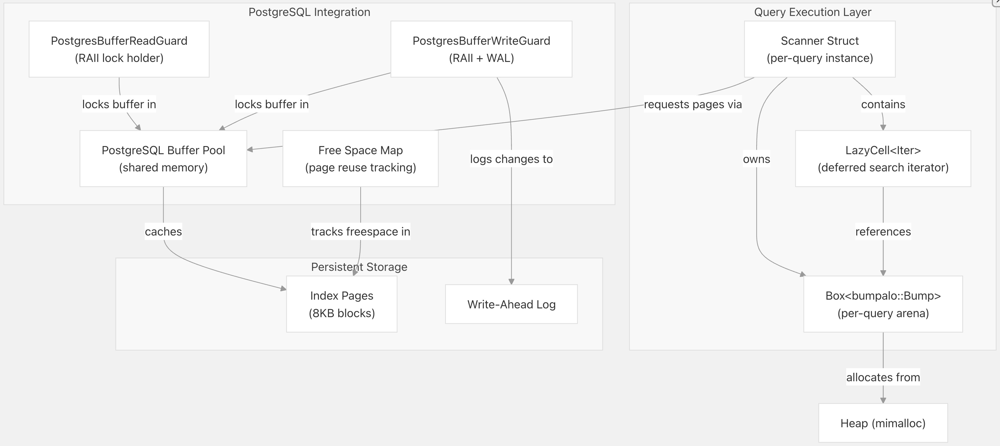
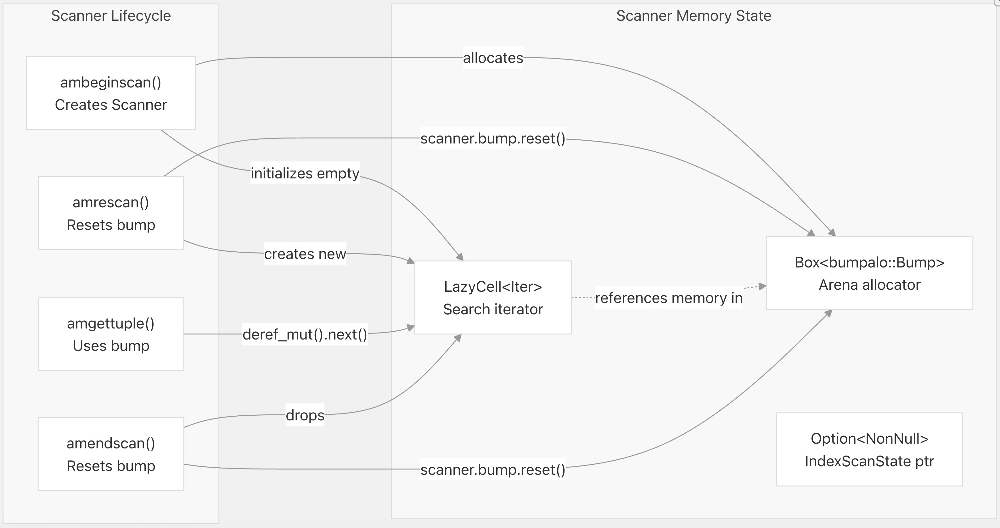
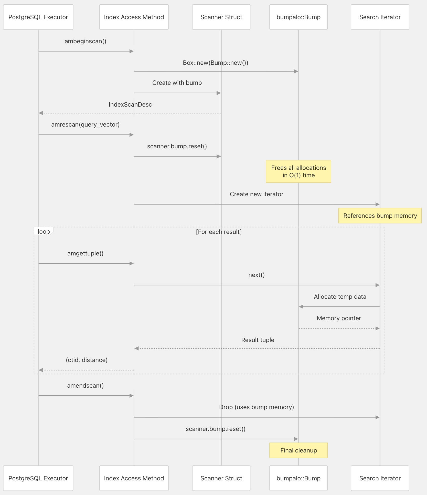
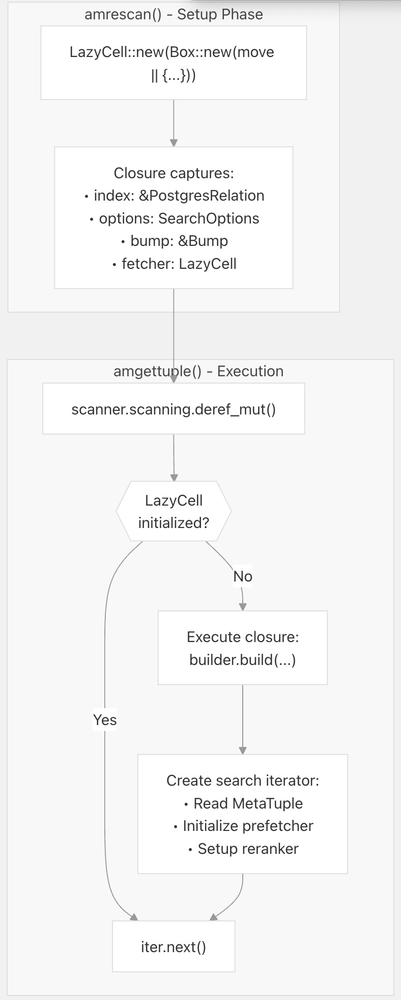
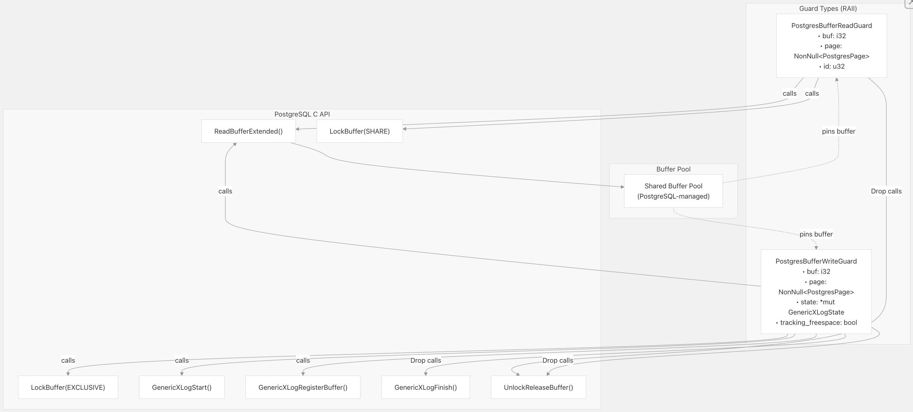
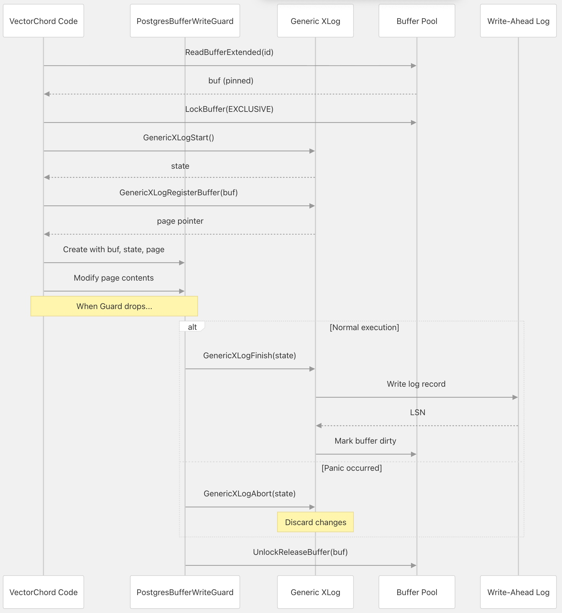
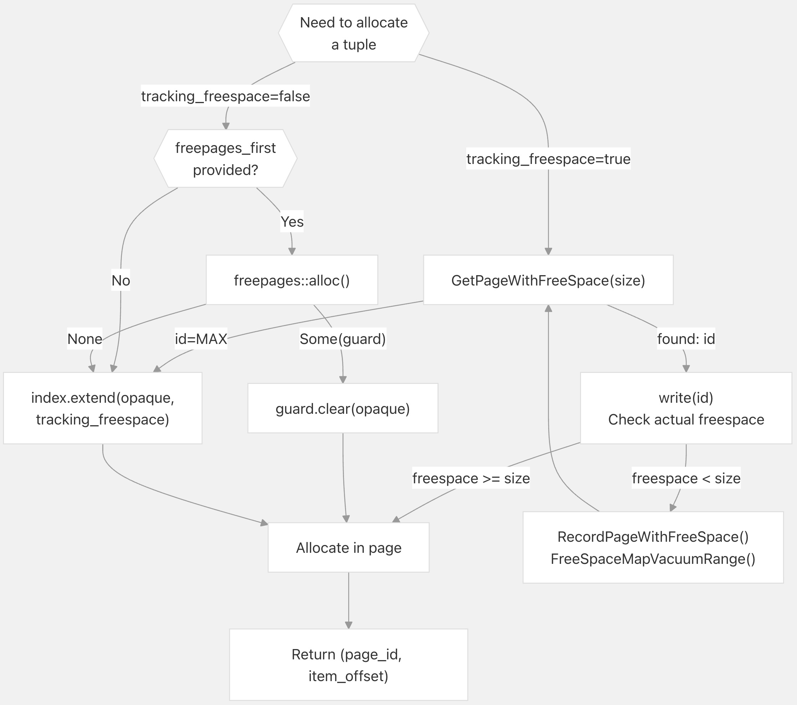
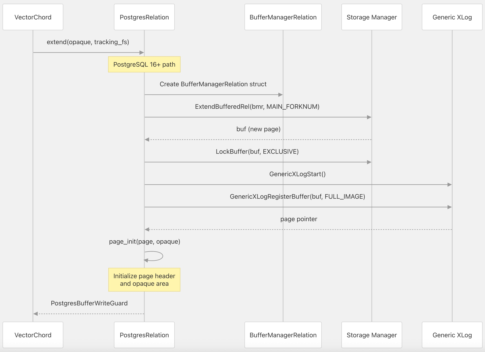
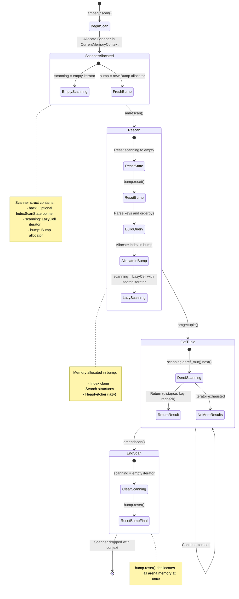
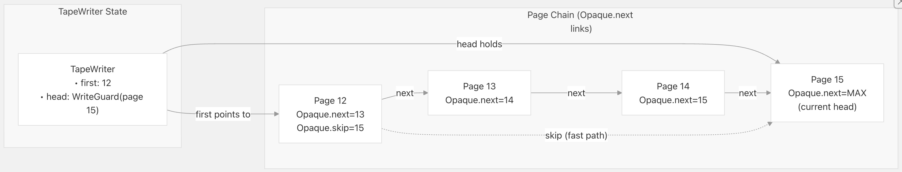

## VectorChord 源码学习: 3.5 内存管理（Memory Management）  
                                        
### 作者                                        
digoal                                        
                                        
### 日期                                        
2025-11-01                                        
                                        
### 标签                                        
VectorChord , 源码学习                                        
                                        
----                                        
                                        
## 背景              
本文介绍 VectorChord 中采用的**内存管理策略**（memory management strategies），包括用于搜索操作的**碰撞分配器**（bump allocators）、**延迟初始化模式**（lazy initialization patterns），以及与 PostgreSQL **缓冲区管理系统**（buffer management system）的集成。  
  
## 内存分配策略概览 (Memory Allocation Strategies Overview)  
  
VectorChord 采用了多种内存分配策略，针对不同的工作负载模式（workload patterns）进行了优化：  
  
| 策略 (Strategy) | 用例 (Use Case) | 生命周期 (Lifetime) | 实现 (Implementation) |  
| :--- | :--- | :--- | :--- |  
| **碰撞分配器**（Bump Allocator） | 搜索查询临时数据 | 每次查询执行（Per-query execution） | `bumpalo::Bump` |  
| **延迟单元**（LazyCell） | 延迟初始化（Deferred initialization） | 每次扫描生命周期（Per-scan lifecycle） | `std::cell::LazyCell` |  
| **PostgreSQL 缓冲区池**（Buffer Pool） | 页面 I/O 和缓存（Page I/O and caching） | 由 PostgreSQL 管理（Managed by PostgreSQL） | `Buffer` + 锁（locks） |  
| **全局分配器**（Global Allocator） | 长生命周期结构（Long-lived structures） | 进程生命周期（Process lifetime） | `mimalloc`（默认） |  
| **栈分配**（Stack Allocation） | 小型临时数据 | 函数作用域（Function scope） | 标准 Rust 栈（Standard Rust stack） |  
  
**内存分配架构 (Memory Allocation Architecture)**  
  
    
  
来源:  
[`src/index/vchordrq/am/mod.rs` 388-401](https://github.com/tensorchord/VectorChord/blob/ac12e257/src/index/vchordrq/am/mod.rs#L388-L401)  
[`src/index/vchordg/am/mod.rs` 320-328](https://github.com/tensorchord/VectorChord/blob/ac12e257/src/index/vchordg/am/mod.rs#L320-L328)  
[`src/index/storage.rs` 184-256](https://github.com/tensorchord/VectorChord/blob/ac12e257/src/index/storage.rs#L184-L256)  
  
## 搜索操作中的碰撞分配器 (Bump Allocators)  
  
### 扫描器结构与碰撞分配器的所有权 (Scanner Structure and Bump Allocator Ownership)  
  
`vchordrq` 和 `vchordg` 索引方法（index methods）都使用一个 `Scanner` **结构体**（struct），该结构体拥有一个碰撞分配器（bump allocator），用于每次查询的临时分配（per-query temporary allocations）：  
  
    
  
来源:  
[`src/index/vchordrq/am/mod.rs` 392-395](https://github.com/tensorchord/VectorChord/blob/ac12e257/src/index/vchordrq/am/mod.rs#L392-L395)  
[`src/index/vchordg/am/mod.rs` 320-328](https://github.com/tensorchord/VectorChord/blob/ac12e257/src/index/vchordg/am/mod.rs#L320-L328)  
  
### 为什么使用碰撞分配器 (Why Bump Allocators)  
  
碰撞分配器通过**递增指针**（incrementing a pointer）提供 **O(1)** 的分配，没有**每次分配开销**（per-allocation overhead）或**解除分配成本**（deallocation cost）。这对于搜索操作非常理想，因为搜索操作中：  
  
1.  需要**多次小型分配**（many small allocations）（距离计算、候选列表、**预取迭代器**（prefetch iterators））  
2.  **所有分配具有相同的生命周期**（all allocations have the same lifetime）（查询执行）  
3.  **批量解除分配**（bulk deallocation）是可以接受的（查询完成后通过 `reset` 重置）  
  
选择 `bumpalo::Bump` 实现是因为它：  
  
* 通过 `reset()` 提供**零开销的解除分配**（zero-overhead deallocation）  
* **恐慌-安全**（panic-safe）（分配被正确丢弃（dropped））  
* 避免**内存碎片**（fragmentation）（单调分配模式（monotonic allocation pattern））  
  
来源:  
[`src/index/vchordrq/am/mod.rs` 326-336](https://github.com/tensorchord/VectorChord/blob/ac12e257/src/index/vchordrq/am/mod.rs#L326-L336)  
[`src/index/vchordg/am/mod.rs` 323-323](https://github.com/tensorchord/VectorChord/blob/ac12e257/src/index/vchordg/am/mod.rs#L323-L323)  
  
### 关键顺序约束 (Critical Ordering Constraint)  
  
`Scanner` 结构体在两种索引实现中都记录了一个**关键的顺序要求**（critical ordering requirement）：  
  
```  
// From vchordrq/am/mod.rs:465-466  
// PAY ATTENTATION: `scanning` references `bump`, so `scanning` must be dropped before `bump`.  
pub struct Scanner {  
    pub hack: Option<NonNull<pgrx::pg_sys::IndexScanState>>,  
    scanning: LazyCell<Iter, Box<dyn FnOnce() -> Iter>>,  
    bump: Box<bumpalo::Bump>,  
}  
```  
  
> `scanning` 迭代器（iterator）包含对 `bump` 中分配的内存的**引用**（references）。Rust 的**丢弃顺序**（drop order）（字段按声明顺序丢弃）确保 `scanning` 在 `bump` 之前被丢弃，从而防止了**释放后使用**（use-after-free）。这就是为什么这些字段必须以这个特定顺序出现。  
  
来源:  
[`src/index/vchordrq/am/mod.rs` 465-466](https://github.com/tensorchord/VectorChord/blob/ac12e257/src/index/vchordrq/am/mod.rs#L465-L466)  
[`src/index/vchordrq/am/mod.rs` 555-559](https://github.com/tensorchord/VectorChord/blob/ac12e257/src/index/vchordrq/am/mod.rs#L555-L559)  
[`src/index/vchordg/am/mod.rs` 387-388](https://github.com/tensorchord/VectorChord/blob/ac12e257/src/index/vchordg/am/mod.rs#L387-L388)  
[`src/index/vchordg/am/mod.rs` 457-461](https://github.com/tensorchord/VectorChord/blob/ac12e257/src/index/vchordg/am/mod.rs#L457-L461)  
  
### 碰撞分配器的生命周期 (Bump Allocator Lifecycle)  
  
**查询执行内存生命周期 (Query Execution Memory Lifecycle)**  
  
    
  
来源:  
[`src/index/vchordrq/am/mod.rs` 383-401](https://github.com/tensorchord/VectorChord/blob/ac12e257/src/index/vchordrq/am/mod.rs#L383-L401)  
[`src/index/vchordrq/am/mod.rs` 403-515](https://github.com/tensorchord/VectorChord/blob/ac12e257/src/index/vchordrq/am/mod.rs#L403-L515)  
[`src/index/vchordrq/am/mod.rs` 547-551](https://github.com/tensorchord/VectorChord/blob/ac12e257/src/index/vchordrq/am/mod.rs#L547-L551)  
  
## 用于延迟初始化的 LazyCell (LazyCell for Deferred Initialization)  
  
### LazyCell 模式用法 (LazyCell Pattern Usage)  
  
VectorChord 使用 `std::cell::LazyCell` 来**延迟**（defer）昂贵的初始化（expensive initialization），直到它实际需要时才执行：  
  
```  
// From vchordrq/am/mod.rs:393-394  
scanning: LazyCell<Iter, Box<dyn FnOnce() -> Iter>>,  
```  
  
> 此模式延迟了搜索迭代器（search iterator）的创建（其中涉及读取**索引元数据**（index metadata）、初始化预取器（prefetchers）等），直到首次调用 `amgettuple()`。如果在获取任何结果之前查询被取消，则完全避免了初始化成本。  
  
**LazyCell 初始化流程 (LazyCell Initialization Flow)**  
  
    
  
来源:  
[`src/index/vchordrq/am/mod.rs` 487-491](https://github.com/tensorchord/VectorChord/blob/ac12e257/src/index/vchordrq/am/mod.rs#L487-L491)  
[`src/index/vchordrq/am/mod.rs` 507-511](https://github.com/tensorchord/VectorChord/blob/ac12e257/src/index/vchordrq/am/mod.rs#L507-L511)  
[`src/index/vchordrq/am/mod.rs` 533-543](https://github.com/tensorchord/VectorChord/blob/ac12e257/src/index/vchordrq/am/mod.rs#L533-L543)  
  
### 延迟初始化 (Lazy Initialization) 的优势  
  
1.  **避免浪费工作**（Avoid wasted work）：如果查询提前取消或使用了非索引路径（non-index path），则初始化永远不会发生。  
2.  **延迟错误处理**（Deferred error handling）：索引读取中的错误发生在 `amgettuple()` 期间，而非 `amrescan()` 期间，这简化了**错误传播**（error propagation）。  
3.  **内存效率**（Memory efficiency）：只有在实际需要时才分配迭代器状态（iterator state）。  
  
`fetcher`（用于**重新排序**（reranking）期间的**堆元组查找**（heap tuple lookups））也出于相同的原因使用了 `LazyCell`：  
  
```  
// From vchordrq/am/mod.rs:439-454  
let fetcher = {  
    let hack = scanner.hack;  
    LazyCell::new(move || {  
        HeapFetcher::new(  
            (*scan).indexRelation,  
            (*scan).heapRelation,  
            (*scan).xs_snapshot,  
            (*scan).xs_heapfetch,  
            // ...  
        )  
    })  
};  
```  
  
来源:  
[`src/index/vchordrq/am/mod.rs` 439-454](https://github.com/tensorchord/VectorChord/blob/ac12e257/src/index/vchordrq/am/mod.rs#L439-L454)  
[`src/index/vchordg/am/mod.rs` 364-378](https://github.com/tensorchord/VectorChord/blob/ac12e257/src/index/vchordg/am/mod.rs#L364-L378)  
  
## PostgreSQL 缓冲区管理集成 (PostgreSQL Buffer Management Integration)  
  
### 缓冲区守卫与 RAII 模式 (Buffer Guards and RAII Pattern)  
  
VectorChord 通过 **RAII 守卫类型**（RAII guard types）与 PostgreSQL 的**共享缓冲区池**（shared buffer pool）集成，这些类型自动处理锁定和解锁：  
  
| 守卫类型 (Guard Type) | 锁模式 (Lock Mode) | 功能 (Capabilities) | 丢弃行为 (Drop Behavior) |  
| :--- | :--- | :--- | :--- |  
| `PostgresBufferReadGuard` | `BUFFER_LOCK_SHARE` (共享锁) | 只读页面访问（Read-only page access） | `UnlockReleaseBuffer` (解锁并释放缓冲区) |  
| `PostgresBufferWriteGuard` | `BUFFER_LOCK_EXCLUSIVE` (排他锁) | 修改页面 + **预写式日志**（WAL） | `GenericXLogFinish` → `UnlockReleaseBuffer` |  
  
**PostgreSQL 缓冲区守卫层次结构 (PostgreSQL Buffer Guard Hierarchy)**  
  
    
  
来源:  
[`src/index/storage.rs` 184-210](https://github.com/tensorchord/VectorChord/blob/ac12e257/src/index/storage.rs#L184-L210)  
[`src/index/storage.rs` 212-256](https://github.com/tensorchord/VectorChord/blob/ac12e257/src/index/storage.rs#L212-L256)  
  
### 读取守卫实现 (Read Guard Implementation)  
  
`PostgresBufferReadGuard` 通过**共享锁定**（shared locking）提供只读访问（read-only access）：  
  
```  
// From storage.rs:282-299  
fn read(&self, id: u32) -> Self::ReadGuard<'_> {  
    unsafe {  
        let buf = ReadBufferExtended(  
            self.raw,  
            0,  // MAIN_FORKNUM  
            id,  
            ReadBufferMode::RBM_NORMAL,  
            std::ptr::null_mut(),  
        );  
        LockBuffer(buf, BUFFER_LOCK_SHARE as _);  
        let page = NonNull::new(BufferGetPage(buf).cast()).expect("failed to get page");  
        PostgresBufferReadGuard { buf, page, id }  
    }  
}  
```  
  
`Drop` **实现**（implementation）确保即使发生**恐慌**（panic），缓冲区也会被解锁（unlocked）：  
  
```  
// From storage.rs:204-210  
impl<Opaque> Drop for PostgresBufferReadGuard<Opaque> {  
    fn drop(&mut self) {  
        unsafe {  
            pgrx::pg_sys::UnlockReleaseBuffer(self.buf);  
        }  
    }  
}  
```  
  
来源:  
[`src/index/storage.rs` 282-299](https://github.com/tensorchord/VectorChord/blob/ac12e257/src/index/storage.rs#L282-L299)  
[`src/index/storage.rs` 204-210](https://github.com/tensorchord/VectorChord/blob/ac12e257/src/index/storage.rs#L204-L210)  
  
### 写入守卫与 WAL 集成 (Write Guard and WAL Integration)  
  
`PostgresBufferWriteGuard` 更为复杂，它集成了 PostgreSQL 的**预写式日志**（Write-Ahead Logging, WAL）：  
  
**带 WAL 的写入守卫生命周期 (Write Guard Lifecycle with WAL)**  
  
   
  
来源:  
[`src/index/storage.rs` 306-335](https://github.com/tensorchord/VectorChord/blob/ac12e257/src/index/storage.rs#L306-L335)  
[`src/index/storage.rs` 241-256](https://github.com/tensorchord/VectorChord/blob/ac12e257/src/index/storage.rs#L241-L256)  
  
### 空闲空间映射集成 (Free Space Map Integration)  
  
`PostgresBufferWriteGuard` 可以选择性地跟踪 PostgreSQL 的**空闲空间映射**（Free Space Map, FSM）中的空闲空间：  
  
```  
// From storage.rs:241-256  
impl<O: Opaque> Drop for PostgresBufferWriteGuard<O> {  
    fn drop(&mut self) {  
        unsafe {  
            if std::thread::panicking() {  
                pgrx::pg_sys::GenericXLogAbort(self.state);  
            } else {  
                if self.tracking_freespace {  
                    pgrx::pg_sys::RecordPageWithFreeSpace(self.raw, self.id, self.freespace() as _);  
                    pgrx::pg_sys::FreeSpaceMapVacuumRange(self.raw, self.id, self.id + 1);  
                }  
                pgrx::pg_sys::GenericXLogFinish(self.state);  
            }  
            pgrx::pg_sys::UnlockReleaseBuffer(self.buf);  
        }  
    }  
}  
```  
  
> 这使得 PostgreSQL 能够有效地找到具有足够空闲空间来容纳新元组（new tuples）的页面，从而避免了不必要的**页面扫描**（page scans）。  
  
来源:  
[`src/index/storage.rs` 241-256](https://github.com/tensorchord/VectorChord/blob/ac12e257/src/index/storage.rs#L241-L256)  
[`src/index/storage.rs` 392-409](https://github.com/tensorchord/VectorChord/blob/ac12e257/src/index/storage.rs#L392-L409)  
  
## 页面分配策略 (Page Allocation Strategies)  
  
VectorChord 采用了多种策略来分配新页面，具体取决于用例和空闲空间的可用性。  
  
### 页面分配决策树 (Page Allocation Decision Tree)  
  
   
  
来源:  
[`src/index/storage.rs` 392-409](https://github.com/tensorchord/VectorChord/blob/ac12e257/src/index/storage.rs#L392-L409)  
[`crates/vchordrq/src/tape.rs` 330-404](https://github.com/tensorchord/VectorChord/blob/ac12e257/crates/vchordrq/src/tape.rs#L330-L404)  
  
### 关系扩展操作 (Relation Extension Operations)  
  
`RelationWrite::extend()` 方法在**关系**（relation）末尾创建一个新页面：  
  
**页面扩展过程 (Page Extension Process) (PostgreSQL 16+)**  
  
   
  
> 对于 PostgreSQL 13-15 版本，该过程使用 `LockRelationForExtension` / `ReadBufferExtended` 配合 `id=u32::MAX`，而不是 `ExtendBufferedRel`。  
  
来源:  
[`src/index/storage.rs` 336-391](https://github.com/tensorchord/VectorChord/blob/ac12e257/src/index/storage.rs#L336-L391)  
  
### 空闲空间映射用法 (Free Space Map Usage)  
  
`search()` 方法利用 PostgreSQL 的**空闲空间映射**（Free Space Map）来查找具有足够空闲空间的页面：  
  
```  
// From storage.rs:392-409  
fn search(&self, freespace: usize) -> Option<PostgresBufferWriteGuard<O>> {  
    unsafe {  
        loop {  
            let id = pgrx::pg_sys::GetPageWithFreeSpace(self.raw, freespace);  
            if id == u32::MAX {  
                return None;  // No page with enough space  
            }  
            let write = self.write(id, true);  
            if write.freespace() < freespace as _ {  
                // FSM was stale, update it and retry  
                pgrx::pg_sys::RecordPageWithFreeSpace(self.raw, id, write.freespace() as _);  
                pgrx::pg_sys::FreeSpaceMapVacuumRange(self.raw, id, id + 1);  
                continue;  
            }  
            return Some(write);  
        }  
    }  
}  
```  
  
> 这避免了扫描所有页面以查找具有空闲空间页面的需要，这对于大型索引的性能至关重要。  
  
来源:  
[`src/index/storage.rs` 392-409](https://github.com/tensorchord/VectorChord/blob/ac12e257/src/index/storage.rs#L392-L409)  
  
## 查询执行中的内存生命周期 (Memory Lifecycle in Query Execution)  
  
### 完整的查询执行内存流 (Complete Query Execution Memory Flow)  
  
**索引扫描生命周期中的内存状态 (Memory States Across Index Scan Lifecycle)**  
  

  
来源:  
[`src/index/vchordrq/am/mod.rs` 383-551](https://github.com/tensorchord/VectorChord/blob/ac12e257/src/index/vchordrq/am/mod.rs#L383-L551)  
  
### 各阶段的内存分配特性 (Memory Allocation Characteristics by Phase)  
  
| 阶段 (Phase) | 分配 (Allocations) | 位置 (Location) | 解除分配 (Deallocation) |  
| :--- | :--- | :--- | :--- |  
| **ambeginscan** | Scanner 结构体, 碰撞分配器 | PostgreSQL CurrentMemoryContext | 自动（通过 `leak_and_drop_on_delete`） |  
| **amrescan** | 延迟闭包（Lazy closure）, 捕获变量 | 栈 / 堆 | 通过 `reset()` 释放先前的碰撞状态 |  
| **amgettuple (first)** | 搜索迭代器, 预取器, 堆 | 碰撞竞技场（Bump arena） | 保留直到下一次 `amrescan`/`amendscan` |  
| **amgettuple (subsequent)** | 每次结果的临时数据 | 碰撞竞技场（Bump arena） | 保留直到下一次 `amrescan`/`amendscan` |  
| **amendscan** | 无（仅清理） | N/A | 所有碰撞分配都被释放 |  
  
关键的洞察是，**所有查询生命周期内的分配**（all query-lifetime allocations）都发生在**碰撞竞技场**（bump arena）中，无论发生了多少中间分配，**解除分配**（deallocation）都是 **O(1)**。  
  
来源:  
[`src/index/vchordrq/am/mod.rs` 383-401](https://github.com/tensorchord/VectorChord/blob/ac12e257/src/index/vchordrq/am/mod.rs#L383-L401)  
[`src/index/vchordrq/am/mod.rs` 403-515](https://github.com/tensorchord/VectorChord/blob/ac12e257/src/index/vchordrq/am/mod.rs#L403-L515)  
[`src/index/vchordrq/am/mod.rs` 517-544](https://github.com/tensorchord/VectorChord/blob/ac12e257/src/index/vchordrq/am/mod.rs#L517-L544)  
[`src/index/vchordrq/am/mod.rs` 547-551](https://github.com/tensorchord/VectorChord/blob/ac12e257/src/index/vchordrq/am/mod.rs#L547-L551)  
  
## 磁带写入器内存管理 (Tape Writer Memory Management)  
  
### TapeWriter 结构 (TapeWriter Structure)  
  
`TapeWriter` 管理一个用于存储索引数据（index data）的**页面链表**（linked list of pages）：  
  
```  
// From vchordrq/src/tape.rs:23-32  
pub struct TapeWriter<'a, R, T>  
where  
    R: RelationWrite + 'a,  
{  
    head: R::WriteGuard<'a>,        // Current page being written  
    first: u32,                      // First page ID in tape  
    index: &'a R,                    // Relation reference  
    tracking_freespace: bool,        // Whether to update FSM  
    _phantom: PhantomData<fn(T) -> T>,  
}  
```  
  
**TapeWriter 页面链接 (TapeWriter Page Chaining)**  
  
   
  
来源:  
[`crates/vchordrq/src/tape.rs` 23-77](https://github.com/tensorchord/VectorChord/blob/ac12e257/crates/vchordrq/src/tape.rs#L23-L77)  
  
### 磁带追加策略 (Tape Append Strategy)  
  
`append()` 函数演示了磁带结构（tape structures）的页面分配策略：  
  
```  
// From vchordrq/src/tape.rs:330-404  
pub fn append<R: RelationRead + RelationWrite>(  
    index: &R,  
    first: u32,  
    bytes: &[u8],  
    tracking_freespace: bool,  
    freepages_first: Option<u32>,  
) -> (u32, u16)  
```  
  
该函数：  
  
1.  使用 `Opaque.skip`（如果可用）或 `Opaque.next` 遍历**磁带链**（tape chain）  
2.  检查最后一个页面是否有足够的空闲空间  
3.  如果空间不足，则通过分配新页面（从**空闲列表**（freelist）或**扩展关系**（extending relation））来扩展磁带  
4.  更新 `Opaque.next` 指针以**链接页面**（chain pages）  
5.  更新第一个页面中的 `Opaque.skip` 指针以指向最后一个页面（针对未来追加的优化）  
  
此策略在保持简单的链表结构的同时，最大限度地减少了页面遍历。  
  
来源:  
[`crates/vchordrq/src/tape.rs` 330-404](https://github.com/tensorchord/VectorChord/blob/ac12e257/crates/vchordrq/src/tape.rs#L330-L404)  
  
## 总结 (Summary)  
  
VectorChord 的内存管理架构（memory management architecture）利用了多种专业策略：  
  
1.  **碰撞分配器**（Bump allocators）为**每次查询的临时数据**（per-query temporary data）提供了 **O(1)** 的分配和解除分配。  
2.  **LazyCell** 将昂贵的初始化延迟到实际需要时，避免了浪费的工作。  
3.  **PostgreSQL 缓冲区池集成**（PostgreSQL buffer pool integration）通过 **RAII 守卫**（RAII guards）确保了正确的锁定和 **WAL 日志记录**（WAL logging）。  
4.  **空闲空间映射**（Free Space Map）实现了高效的页面重用，无需扫描。  
5.  带有**跳过指针**（skip pointers）的**磁带结构**（Tape structures）优化了追加操作。  
  
这些技术的结合提供了高效的内存使用，同时保持了 PostgreSQL 的 **ACID 保障**（ACID guarantees）和**崩溃安全**（crash safety）。  
  
来源:  
[`src/index/vchordrq/am/mod.rs` 383-551](https://github.com/tensorchord/VectorChord/blob/ac12e257/src/index/vchordrq/am/mod.rs#L383-L551)  
[`src/index/vchordg/am/mod.rs` 311-453](https://github.com/tensorchord/VectorChord/blob/ac12e257/src/index/vchordg/am/mod.rs#L311-L453)  
[`src/index/storage.rs` 184-691](https://github.com/tensorchord/VectorChord/blob/ac12e257/src/index/storage.rs#L184-L691)  
[`crates/vchordrq/src/tape.rs` 23-404](https://github.com/tensorchord/VectorChord/blob/ac12e257/crates/vchordrq/src/tape.rs#L23-L404)  
  
# 附录: PostgreSQL 13-15 版本与 16+ 版本在页面扩展过程中的实现差异  
在 VectorChord 的存储层实现中，页面扩展过程针对不同 PostgreSQL 版本使用了两种不同的方法:   
  
### PostgreSQL 13-15 版本的实现  
  
使用 `LockRelationForExtension` + `ReadBufferExtended(id=u32::MAX)` 的组合:   
  
```rust  
LockRelationForExtension(self.raw, ExclusiveLock as _);  
buf = ReadBufferExtended(  
    self.raw,  
    ForkNumber::MAIN_FORKNUM,  
    u32::MAX,  // 特殊值表示扩展新页面  
    ReadBufferMode::RBM_NORMAL,  
    std::ptr::null_mut(),  
);  
UnlockRelationForExtension(self.raw, ExclusiveLock as _);  
```  
  
### PostgreSQL 16+ 版本的实现  
  
使用 `ExtendBufferedRel` API:    
  
```rust  
let bmr = BufferManagerRelation {  
    rel: self.raw,  
    smgr: std::ptr::null_mut(),  
    relpersistence: 0,  
};  
buf = ExtendBufferedRel(bmr, ForkNumber::MAIN_FORKNUM, std::ptr::null_mut(), 0);  
```  
  
## 两种方法的对比  
  
### PostgreSQL 13-15 方法的特点  
  
**优点:**  
- 实现简单直接，使用标准的锁机制   
- 显式的锁获取和释放，行为可预测   
  
**缺点:**  
- **并发性能较差**: 需要持有 `ExclusiveLock` 锁住整个关系进行扩展，阻塞其他并发扩展操作   
- **锁持有时间长**: 从获取锁到释放锁期间，其他进程无法扩展该关系   
- **I/O 效率低**: 每次只能扩展一个页面，无法批量扩展   
  
### PostgreSQL 16+ 方法的特点  
  
**优点:**  
- **更好的并发性**: `ExtendBufferedRel` 使用更细粒度的锁机制，允许多个进程并发扩展   
- **批量扩展支持**: 可以一次性扩展多个页面（虽然当前代码中参数为 0，表示扩展 1 个页面）    
- **更好的缓冲区管理**: 通过 `BufferManagerRelation` 结构体提供更灵活的缓冲区管理    
  
**缺点:**  
- 仅在 PostgreSQL 16+ 版本可用，需要条件编译    
  
## 实际影响  
  
在 VectorChord 的使用场景中，这个差异主要影响:    
  
1. **索引构建性能**: 在并行构建索引时（`am_build.rs`），多个 worker 需要扩展页面    
2. **插入操作**: 当 tape 需要扩展新页面时    
3. **维护操作**: 在 `maintain()` 过程中创建新的 frozen/directory tape 时    
  
对于大规模并行构建场景，PostgreSQL 16+ 的 `ExtendBufferedRel` 方法能显著减少锁竞争，提升整体性能。   
  
## Notes  
  
代码中使用条件编译 `#[cfg(any(feature = "pg13", feature = "pg14", feature = "pg15"))]` 和 `#[cfg(any(feature = "pg16", feature = "pg17", feature = "pg18"))]` 来适配不同版本 。这种设计确保了 VectorChord 可以在不同 PostgreSQL 版本上运行，同时在新版本上获得更好的性能。   
    
  
#### [期望 PostgreSQL|开源PolarDB 增加什么功能?](https://github.com/digoal/blog/issues/76 "269ac3d1c492e938c0191101c7238216")
  
  
#### [PolarDB 开源数据库](https://openpolardb.com/home "57258f76c37864c6e6d23383d05714ea")
  
  
#### [PolarDB 学习图谱](https://www.aliyun.com/database/openpolardb/activity "8642f60e04ed0c814bf9cb9677976bd4")
  
  
#### [PostgreSQL 解决方案集合](../201706/20170601_02.md "40cff096e9ed7122c512b35d8561d9c8")
  
  
#### [德哥 / digoal's Github - 公益是一辈子的事.](https://github.com/digoal/blog/blob/master/README.md "22709685feb7cab07d30f30387f0a9ae")
  
  
#### [About 德哥](https://github.com/digoal/blog/blob/master/me/readme.md "a37735981e7704886ffd590565582dd0")
  
  

  
