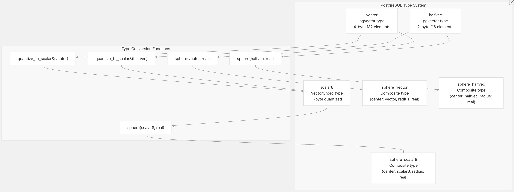
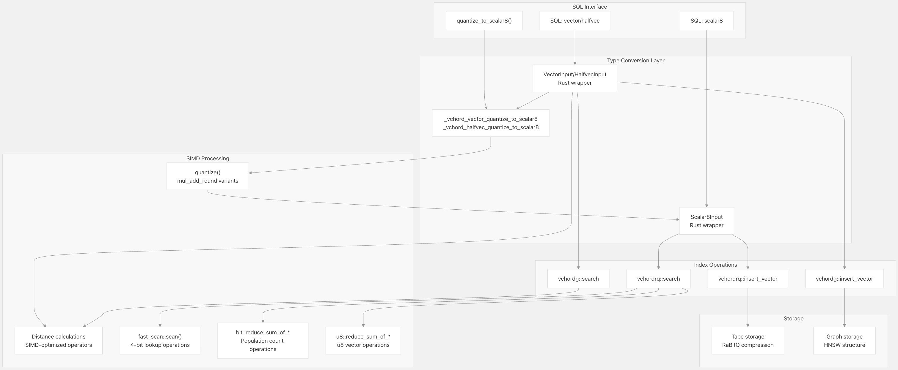
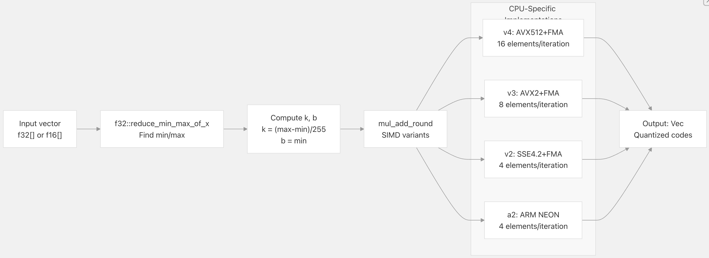
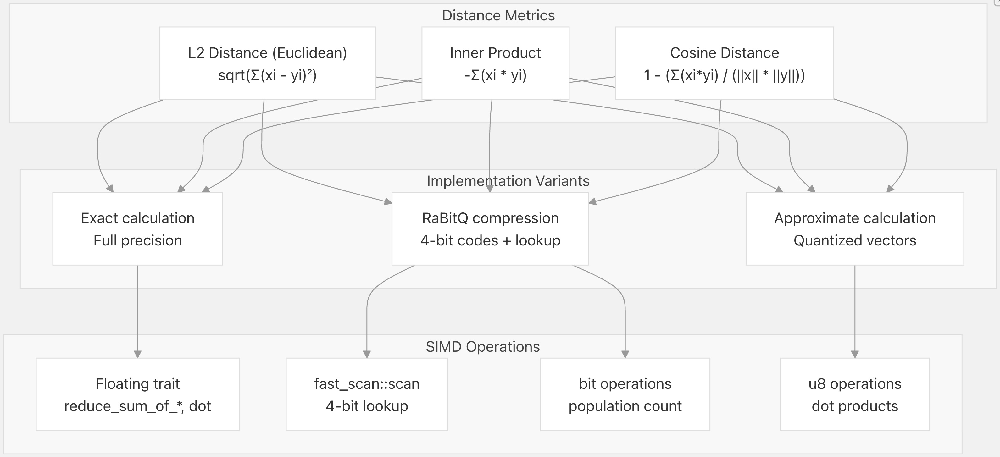
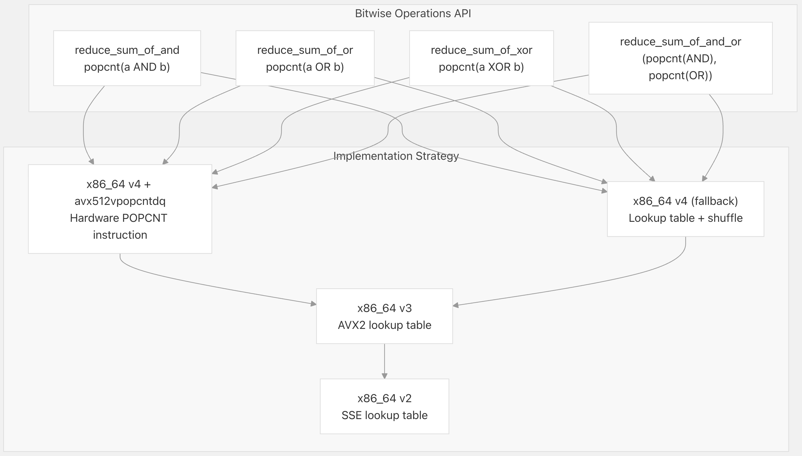
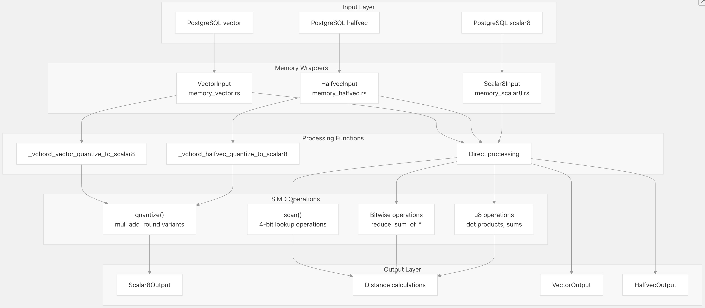

## VectorChord 源码学习: 4 数据处理 (Data Processing)    
                                          
### 作者                                          
digoal                                          
                                          
### 日期                                          
2025-11-01                                          
                                          
### 标签                                          
VectorChord , 源码学习                                          
                                          
----                                          
                                          
## 背景                
本文介绍 **VectorChord** 中的**向量数据处理**（Vector Data Processing），涵盖了**类型转换**（Type Conversions）、**量化方法**（Quantization Methods）和**距离计算**（Distance Calculations）。该**处理管线**（processing pipeline）将输入向量转换为优化后的表示形式，以实现**高性能相似性搜索**（high-performance similarity search）操作。  
  
## SQL 类型和运算符 (SQL Types and Operators)  
  
**VectorChord** 扩展了 **PostgreSQL**，加入了**自定义向量类型**（custom vector types）和**距离运算符**（distance operators），这些都与标准 **SQL** 查询无缝集成。  
  
### 自定义数据类型 (Custom Data Types)  
  
  
  
**来源** (Sources)：  
[`src/sql/finalize.sql` 3-28](https://github.com/tensorchord/VectorChord/blob/ac12e257/src/sql/finalize.sql#L3-L28)  
[`src/sql/finalize.sql` 130-144](https://github.com/tensorchord/VectorChord/blob/ac12e257/src/sql/finalize.sql#L130-L144)  
  
### 距离运算符 (Distance Operators)  
  
**VectorChord** 提供了用于**精确**（exact）和**近似相似性搜索**（approximate similarity search）的标准距离运算符：  
  
| 运算符 (Operator) | 名称 (Name) | 描述 (Description) | 支持的类型 (Supported Types) |  
| :--- | :--- | :--- | :--- |  
| `<->` | **L2 距离** (L2 distance) | **欧几里德距离** (Euclidean distance) | `vector`, `halfvec`, `scalar8` |  
| `<#>` | **内积** (Inner product) | 负内积 (Negative inner product) | `vector`, `halfvec`, `scalar8` |  
| `<=>` | **余弦距离** (Cosine distance) | 1 - 余弦相似度 (cosine similarity) | `vector`, `halfvec`, `scalar8` |  
| `<<->>` | **球体 L2** (Sphere L2) | 球体中心点的 L2 距离减去半径 | `sphere_vector`, `sphere_halfvec`, `sphere_scalar8` |  
| `<<#>>` | **球体 IP** (Sphere IP) | 球体中心点的负内积 (Negative IP) 减去半径 | `sphere_vector`, `sphere_halfvec`, `sphere_scalar8` |  
| `<<=>>` | **球体余弦** (Sphere cosine) | 球体中心点的余弦距离减去半径 | `sphere_vector`, `sphere_halfvec`, `sphere_scalar8` |  
| `@#` | **最大相似度** (MaxSim) | 多向量查询的最大相似度 (Maximum similarity for multi-vector queries) | `vector[]`, `halfvec[]` |  
  
**来源** (Sources)：  
[`src/sql/finalize.sql` 32-127](https://github.com/tensorchord/VectorChord/blob/ac12e257/src/sql/finalize.sql#L32-L127)  
  
### SQL 用法示例 (SQL Usage Examples)  
```  
-- Create scalar8 type from vector  
SELECT quantize_to_scalar8('[1.0, 2.0, 3.0]'::vector);  
  
-- Create sphere for range queries  
SELECT sphere('[1.0, 2.0, 3.0]'::vector, 0.5::real);  
  
-- L2 distance query  
SELECT * FROM items ORDER BY embedding <-> '[1.0, 2.0, 3.0]' LIMIT 10;  
  
-- MaxSim multi-vector query  
SELECT * FROM items   
ORDER BY embeddings @# ARRAY['[1.0, 2.0]'::vector, '[3.0, 4.0]'::vector]  
LIMIT 10;  
```  
  
## 处理管线概述 (Processing Pipeline Overview)  
  
**数据处理管线**（data processing pipeline）将向量从 **SQL** 输入到优化后的**内部表示**（internal representations），历经多个阶段的转换。  
  
  
  
**来源** (Sources)：  
[`src/sql/finalize.sql` 139-144](https://github.com/tensorchord/VectorChord/blob/ac12e257/src/sql/finalize.sql#L139-L144)  
[`crates/simd/src/quantize.rs` 305-311](https://github.com/tensorchord/VectorChord/blob/ac12e257/crates/simd/src/quantize.rs#L305-L311)  
[`crates/simd/src/fast_scan.rs` 614-615](https://github.com/tensorchord/VectorChord/blob/ac12e257/crates/simd/src/fast_scan.rs#L614-L615)  
[`crates/simd/src/bit.rs` 15-18](https://github.com/tensorchord/VectorChord/blob/ac12e257/crates/simd/src/bit.rs#L15-L18)  
[`crates/simd/src/u8.rs` 326-329](https://github.com/tensorchord/VectorChord/blob/ac12e257/crates/simd/src/u8.rs#L326-L329)  
  
## 类型转换和量化 (Type Conversion and Quantization)  
  
**VectorChord** 提供了 **SQL** 级别和**内部类型转换**（internal type conversion）能力，以优化向量表示。  
  
### SQL 级别的类型转换 (SQL-Level Type Conversion)  
  
`quantize_to_scalar8` 函数将**高精度向量**（high-precision vectors）转换为**量化后的 8 位表示**（quantized 8-bit representations）：  
  
```  
-- Convert vector to scalar8  
CREATE FUNCTION quantize_to_scalar8(vector) RETURNS scalar8;  
  
-- Convert halfvec to scalar8    
CREATE FUNCTION quantize_to_scalar8(halfvec) RETURNS scalar8;  
```  
  
**用法示例** (Usage Example)：  
  
```  
-- Create quantized column  
ALTER TABLE items ADD COLUMN embedding_q scalar8;  
UPDATE items SET embedding_q = quantize_to_scalar8(embedding);  
  
-- Create index on quantized vectors  
CREATE INDEX ON items USING vchordrq (embedding_q scalar8_l2_ops);  
```  
  
**来源** (Sources)：  
[`src/sql/finalize.sql` 139-143](https://github.com/tensorchord/VectorChord/blob/ac12e257/src/sql/finalize.sql#L139-L143)  
  
### 内部量化过程 (Internal Quantization Process)  
  
**量化**（quantization）实现使用了 **SIMD 优化操作**，将**浮点向量**（floating-point vectors）转换为 **8 位整数**。  
  
**量化公式** (Quantization Formula)：  
`quantized = round((value - b) / k)`  
其中：  
  
  * `k = (max - min) / 255`（**缩放因子** / scale factor）  
  * `b = min`（**偏差/偏移量** / bias/offset）  
  
  
  
**来源** (Sources)：  
[`crates/simd/src/quantize.rs` 305-311](https://github.com/tensorchord/VectorChord/blob/ac12e257/crates/simd/src/quantize.rs#L305-L311)  
[`crates/simd/src/quantize.rs` 19-53](https://github.com/tensorchord/VectorChord/blob/ac12e257/crates/simd/src/quantize.rs#L19-L53)  
[`crates/simd/src/quantize.rs` 79-123](https://github.com/tensorchord/VectorChord/blob/ac12e257/crates/simd/src/quantize.rs#L79-L123)  
[`crates/simd/src/quantize.rs` 216-263](https://github.com/tensorchord/VectorChord/blob/ac12e257/crates/simd/src/quantize.rs#L216-L263)  
  
### Scalar8 元数据 (Scalar8 Metadata)  
  
`scalar8` 类型存储了额外的**元数据**（metadata），用于精确的距离计算：  
  
| 字段 (Field) | 类型 (Type) | 用途 (Purpose) |  
| :--- | :--- | :--- |  
| `sum_of_x2` | `f32` | 原始值的平方和 (Sum of squared original values) ($\Sigma x^2$) |  
| `k` | `f32` | 量化缩放因子 (Quantization scale factor) |  
| `b` | `f32` | 量化偏差/偏移量 (Quantization bias/offset) |  
| `sum_of_code` | `f32` | 量化码的总和 (Sum of quantized codes) ($\Sigma c$) |  
| `elements` | `u8[]` | 量化后的向量数据 (Quantized vector data) |  
  
此**元数据**可以在不需要原始高精度值的情况下，实现高效的**近似距离计算**（approximate distance calculations）。  
  
**来源** (Sources)：  
[`src/sql/finalize.sql` 3-13](https://github.com/tensorchord/VectorChord/blob/ac12e257/src/sql/finalize.sql#L3-L13)  
  
## SIMD 处理操作 (SIMD Processing Operations)  
  
**VectorChord** 采用了广泛的 **SIMD 优化**（SIMD optimizations），以在多种 **CPU 架构**上实现**高吞吐量**（high-throughput）的数据处理操作。  
  
## 距离计算方法 (Distance Calculation Methods)  
  
**VectorChord** 实现了多种**距离度量**（distance metrics），并采用 **SIMD 优化实现**（SIMD-optimized implementations）以实现**高性能相似性搜索**（high-performance similarity search）。  
  
### 支持的距离度量 (Supported Distance Metrics)  
  
  
  
**来源** (Sources)：  
[`src/sql/finalize.sql` 32-51](https://github.com/tensorchord/VectorChord/blob/ac12e257/src/sql/finalize.sql#L32-L51)  
[`crates/simd/src/fast_scan.rs` 614-615](https://github.com/tensorchord/VectorChord/blob/ac12e257/crates/simd/src/fast_scan.rs#L614-L615)  
[`crates/simd/src/bit.rs` 15-18](https://github.com/tensorchord/VectorChord/blob/ac12e257/crates/simd/src/bit.rs#L15-L18)  
[`crates/simd/src/u8.rs` 326-329](https://github.com/tensorchord/VectorChord/blob/ac12e257/crates/simd/src/u8.rs#L326-L329)  
  
### 基于球体的范围查询 (Sphere-Based Range Queries)  
  
**球体运算符**（Sphere operators）通过比较到**球体中心**（sphere center）和**半径**（radius）的距离，实现高效的**范围查询**（range queries）：  
  
```  
-- Sphere operator formula: distance(vector, sphere.center) - sphere.radius  
-- Returns all vectors within radius distance of center  
  
-- Create sphere for L2 range query  
SELECT * FROM items   
WHERE embedding <<->> sphere('[1.0, 2.0, 3.0]'::vector, 0.5) < 0;  
  
-- Sphere operators work with all distance metrics  
WHERE embedding <<#>> sphere('[1.0, 2.0]'::vector, 0.3) < 0;  -- Inner product  
WHERE embedding <<=>> sphere('[1.0, 2.0]'::vector, 0.1) < 0;  -- Cosine  
```  
  
**来源** (Sources)：  
[`src/sql/finalize.sql` 53-114](https://github.com/tensorchord/VectorChord/blob/ac12e257/src/sql/finalize.sql#L53-L114)  
[`src/sql/finalize.sql` 130-137](https://github.com/tensorchord/VectorChord/blob/ac12e257/src/sql/finalize.sql#L130-L137)  
  
### MaxSim 多向量查询 (MaxSim Multi-Vector Queries)  
  
**MaxSim 运算符**支持具有多个向量表示的查询，它会找到所有查询向量中的**最大相似度**（maximum similarity）：  
  
```  
-- MaxSim operator: max(similarity(doc_vector, query_vector)) for all query vectors  
SELECT * FROM documents  
ORDER BY embeddings @# ARRAY[  
    '[1.0, 2.0, 3.0]'::vector,  
    '[4.0, 5.0, 6.0]'::vector  
]  
LIMIT 10;  
```  
  
**MaxSim** 通常用于**多表示检索**（multi-representation retrieval），即文档具有多个嵌入（embeddings）（例如，每**词元** / per-token 嵌入），且查询包含多个向量的场景。  
  
**来源** (Sources)：  
[`src/sql/finalize.sql` 116-126](https://github.com/tensorchord/VectorChord/blob/ac12e257/src/sql/finalize.sql#L116-L126)  
[`src/sql/finalize.sql` 369-377](https://github.com/tensorchord/VectorChord/blob/ac12e257/src/sql/finalize.sql#L369-L377)  
  
### 用于 RaBitQ 压缩的快速扫描 (Fast Scan for RaBitQ Compression)  
  
**快速扫描**（fast scan）操作使用 **SIMD 加速的查找表**（SIMD-accelerated lookup tables）来处理 **4 位量化向量**：  
  
**4 位码布局** (4-bit Code Layout)：  
  
```  
Byte 0: bits 0-3 = code 0, bits 4-7 = code 1  
Byte 1: bits 0-3 = code 2, bits 4-7 = code 3  
...  
Byte n/2-1: bits 0-3 = code n-2, bits 4-7 = code n-1  
```  
  
**SIMD 快速扫描变体** (SIMD Fast Scan Variants)：  
  
| 架构 (Architecture) | 函数 (Function) | SIMD 位宽 (SIMD Width) | 每次迭代的元素数 (Elements/Iteration) |  
| :--- | :--- | :--- | :--- |  
| `x86_64 v4` | `scan_v4` | 512-bit | 4 × 16 字节块 (4 × 16-byte blocks) |  
| `x86_64 v3` | `scan_v3` | 256-bit | 2 × 16 字节块 (2 × 16-byte blocks) |  
| `x86_64 v2` | `scan_v2` | 128-bit | 1 × 16 字节块 (1 × 16-byte block) |  
| `aarch64 a2` | `scan_a2` | 128-bit | 1 × 16 字节块 (1 × 16-byte block) |  
| `s390x z13` | `scan_z13` | 128-bit | 1 × 16 字节块 (1 × 16-byte block) |  
| `powerpc64 p7` | `scan_p7` | 128-bit | 1 × 16 字节块 (1 × 16-byte block) |  
  
`scan` 函数返回 `[u16; 32]`，其中包含 32 个**打包向量**（packed vectors）的**累积查找结果**（accumulated lookup results）。  
  
**来源** (Sources)：  
[`crates/simd/src/fast_scan.rs` 15-47](https://github.com/tensorchord/VectorChord/blob/ac12e257/crates/simd/src/fast_scan.rs#L15-L47)  
[`crates/simd/src/fast_scan.rs` 52-158](https://github.com/tensorchord/VectorChord/blob/ac12e257/crates/simd/src/fast_scan.rs#L52-L158)  
[`crates/simd/src/fast_scan.rs` 183-261](https://github.com/tensorchord/VectorChord/blob/ac12e257/crates/simd/src/fast_scan.rs#L183-L261)  
[`crates/simd/src/fast_scan.rs` 358-428](https://github.com/tensorchord/VectorChord/blob/ac12e257/crates/simd/src/fast_scan.rs#L358-L428)  
  
## 底层 SIMD 操作 (Low-Level SIMD Operations)  
  
**VectorChord** 的距离计算依赖于针对不同 **CPU 架构**而优化的专用 **SIMD 操作**。  
  
### 位运算**总体计数**操作 (Bitwise Population Count Operations)  
  
**位运算**（Bitwise operations）计算**二进制向量**（binary vectors）的**汉明距离**（Hamming distances）和 **Jaccard 相似度**（Jaccard similarities）：  
  
  
  
**实现细节** (Implementation Details)：  
  
  * **v4 with avx512vpopcntdq**：使用硬件 `_mm512_popcnt_epi64`，每次迭代 8 个 `u64`  
  * **v4 fallback**：使用 4 位**半字节查找表**（nibble lookup tables）配合 `_mm512_shuffle_epi8`  
  * **v3**：使用 **AVX2 256 位操作**配合查找表  
  * **Fallback**（回退）：标准**标量**（scalar）`count_ones()` 方法  
  
**来源** (Sources)：  
[`crates/simd/src/bit.rs` 20-196](https://github.com/tensorchord/VectorChord/blob/ac12e257/crates/simd/src/bit.rs#L20-L196)  
[`crates/simd/src/bit.rs` 23-47](https://github.com/tensorchord/VectorChord/blob/ac12e257/crates/simd/src/bit.rs#L23-L47)  
[`crates/simd/src/bit.rs` 68-109](https://github.com/tensorchord/VectorChord/blob/ac12e257/crates/simd/src/bit.rs#L68-L109)  
[`crates/simd/src/bit.rs` 130-168](https://github.com/tensorchord/VectorChord/blob/ac12e257/crates/simd/src/bit.rs#L130-L168)  
  
### 无符号 8 位向量操作 (Unsigned 8-bit Vector Operations)  
  
**量化向量操作**处理 `u8` 数组，用于**近似距离计算**：  
  
**主要操作** (Primary Operations)：  
  
| 函数 (Function) | 用途 (Purpose) | 返回类型 (Return Type) |  
| :--- | :--- | :--- |  
| `reduce_sum_of_x_as_u32_y_as_u32` | **点积** (Dot product)：$\Sigma (x_i \times y_i)$ | `u32` |  
| `reduce_sum_of_x_as_u16` | **求和** (Sum)：$\Sigma x_i$ | `u16` |  
| `reduce_sum_of_x_as_u32` | **求和** (Sum)：$\Sigma x_i$（更宽的**累加器** / wider accumulator） | `u32` |  
  
**处理策略** (Processing Strategy)：  
  
1.  在 **SIMD 寄存器**中加载 `u8` 值  
2.  **加宽**（Widen）到 `u16`/`u32` 以防止溢出  
3.  执行乘法或加法  
4.  在向量通道中**累积**（Accumulate）结果  
5.  **归约**（Reduce）到最终的**标量值**（scalar value）  
  
**架构覆盖** (Architecture Coverage)：  
  
  * `x86_64 v4`：**AVX512**，每次迭代处理 64 字节  
  * `x86_64 v3`：**AVX2**，每次迭代处理 32 字节  
  * `x86_64 v2`：**SSE4.2**，每次迭代处理 16 字节  
  * `aarch64 a2`：**ARM NEON**，每次迭代处理 16 字节  
  
**来源** (Sources)：  
[`crates/simd/src/u8.rs` 15-323](https://github.com/tensorchord/VectorChord/blob/ac12e257/crates/simd/src/u8.rs#L15-L323)  
[`crates/simd/src/u8.rs` 19-66](https://github.com/tensorchord/VectorChord/blob/ac12e257/crates/simd/src/u8.rs#L19-L66)  
[`crates/simd/src/u8.rs` 97-141](https://github.com/tensorchord/VectorChord/blob/ac12e257/crates/simd/src/u8.rs#L97-L141)  
[`crates/simd/src/u8.rs` 247-286](https://github.com/tensorchord/VectorChord/blob/ac12e257/crates/simd/src/u8.rs#L247-L286)  
  
## 数据流架构 (Data Flow Architecture)  
  
完整的数据处理流集成了**向量类型处理**（vector type handling）、**量化**（quantization）和 **SIMD 操作**，以实现最佳性能。  
  
  
  
### 关键数据转换 (Key Data Transformations)  
  
1.  **输入处理** (Input Processing)：**PostgreSQL** 的 `varlena` 结构被封装在**类型安全的 Rust 结构**（type-safe Rust structures）中，并具有**自动内存管理**（automatic memory management）  
2.  **类型转换** (Type Conversion)：向量可以使用**校准后的缩放参数**（calibrated scaling parameters）从 `vector`/`halfvec` 量化到 `scalar8`  
3.  **SIMD 处理** (SIMD Processing)：所有操作都通过**运行时分派**（runtime dispatch）利用 **CPU 专用 SIMD 指令**  
4.  **内存效率** (Memory Efficiency)：**8 字节对齐**（8-byte aligned）的结构最大限度地减少了**内存开销**（memory overhead），同时保持了与 **PostgreSQL** 的兼容性  
  
**来源** (Sources)：  
[`src/datatype/memory_vector.rs` 49-61](https://github.com/tensorchord/VectorChord/blob/ac12e257/src/datatype/memory_vector.rs#L49-L61)  
[`src/datatype/memory_halfvec.rs` 50-62](https://github.com/tensorchord/VectorChord/blob/ac12e257/src/datatype/memory_halfvec.rs#L50-L62)  
[`src/datatype/memory_scalar8.rs` 59-71](https://github.com/tensorchord/VectorChord/blob/ac12e257/src/datatype/memory_scalar8.rs#L59-L71)  
[`src/datatype/functions_scalar8.rs` 22-28](https://github.com/tensorchord/VectorChord/blob/ac12e257/src/datatype/functions_scalar8.rs#L22-L28)  
    
# 附录: VectorChord 中 **残差量化(residual quantization)** 的性能优势。  
为什么使用残差向量计算距离比直接使用原始向量更快?  
  
以及为什么存储残差值比存储原始向量更高效?   
  
## 残差运算的速度优势  
  
残差量化通过存储向量与其最近质心的 **差值(残差)** 而非原始向量, 使得量化后的值更小、更集中, 从而提高计算效率:    
  
### 1. 更小的量化误差  
  
当向量被表示为残差时, 数值范围显著缩小。在 `Op::build()` 函数中, 残差向量通过 `f32::vector_sub(vector.slice(), centroid.slice())` 计算得出。   
  
由于残差值通常比原始向量值小得多, RaBitQ 的 4-bit 量化可以用更少的位数表示相同的信息精度。 量化过程在 `preprocess_with_distance()` 中使用 `quantize()` 函数, 将向量映射到 `(1 << BITS) - 1` 范围内(对于 binary 是 63,对于 block 是 255)。  
  
### 2. 距离计算的优化  
  
在搜索时, 残差编码允许使用预计算的质心距离来加速: 对于 L2 距离, `half_process_l2_residual()` 函数使用公式:  
```  
rough = dis_u_2 + dis_f - 2.0 * e * factor_ip + delta  
```  
其中 `dis_f` 是查询向量到质心的距离, 这个值在层级遍历时已经计算过。在 `default_search()` 中, 如果 `is_residual` 为 true, 会预先计算到根质心的距离并在状态中传递。   
  
相比之下, 非残差模式需要完整计算 `dis_u_2 + dis_v_2 - 2.0 * e * factor_ip`, 没有利用已有的质心距离信息。    
  
### 3. 层级搜索中的复用  
在插入操作中, 残差模式会读取质心信息并计算到质心的距离, 这个距离在后续的层级遍历中被重复使用, 避免了重复计算。   
  
## 存储效率优势  
  
### 1. 更高的压缩率  
  
残差值的分布更集中在零附近, 这使得量化后的码本(codebook)能更有效地表示数据。 `MetaTuple` 中的 `is_residual` 字段控制是否使用残差编码。   
  
### 2. 批量处理优化   
  
RaBitQ 的 block 处理函数 `full_process_l2()` 一次处理 32 个向量, 使用 SIMD 指令加速。残差值的较小范围使得这些批量操作更高效,因为量化误差更小。   
  
### 3. 元数据开销  
  
残差编码需要额外存储 `delta` 值(用于误差修正), 但这个开销远小于存储完整向量的成本。  在 L2 距离的 `build()` 函数中, `delta` 是一个标量值,用于补偿残差量化引入的系统性偏差。   
  
## Notes  
  
残差量化是 VectorChord 实现 32x 压缩率的关键技术之一。 通过将向量表示为与最近质心的差值,系统不仅减少了存储空间,还通过复用质心距离计算加速了搜索过程。 这种方法在 IVF(Inverted File)索引结构中特别有效, 因为每个分区的向量都与该分区的质心相近,残差值自然很小。    
  
     
  
#### [期望 PostgreSQL|开源PolarDB 增加什么功能?](https://github.com/digoal/blog/issues/76 "269ac3d1c492e938c0191101c7238216")
  
  
#### [PolarDB 开源数据库](https://openpolardb.com/home "57258f76c37864c6e6d23383d05714ea")
  
  
#### [PolarDB 学习图谱](https://www.aliyun.com/database/openpolardb/activity "8642f60e04ed0c814bf9cb9677976bd4")
  
  
#### [PostgreSQL 解决方案集合](../201706/20170601_02.md "40cff096e9ed7122c512b35d8561d9c8")
  
  
#### [德哥 / digoal's Github - 公益是一辈子的事.](https://github.com/digoal/blog/blob/master/README.md "22709685feb7cab07d30f30387f0a9ae")
  
  
#### [About 德哥](https://github.com/digoal/blog/blob/master/me/readme.md "a37735981e7704886ffd590565582dd0")
  
  

  
