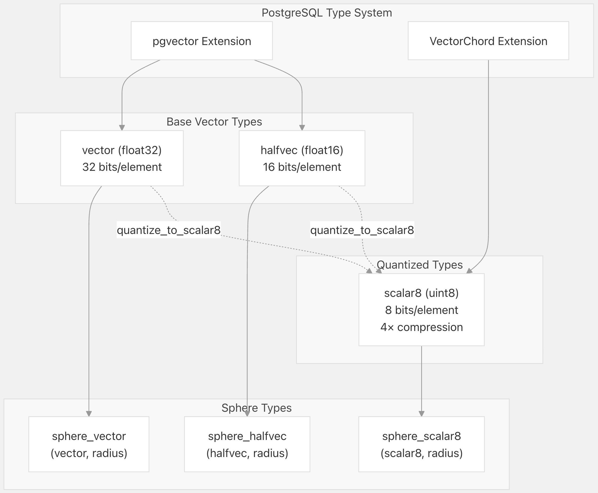
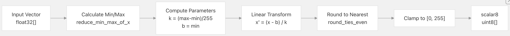
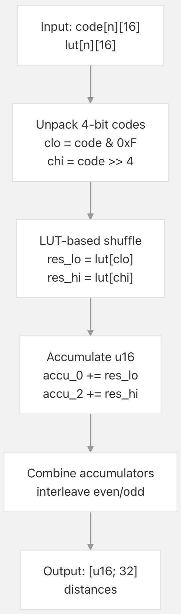

## VectorChord 源码学习: 4.1 向量类型与量化 (Vector Types and Quantization)    
                                            
### 作者                                            
digoal                                            
                                            
### 日期                                            
2025-11-01                                            
                                            
### 标签                                            
VectorChord , 源码学习                                            
                                            
----                                            
                                            
## 背景                  
本文介绍 VectorChord 的**向量数据类型** (`vector data types`) 和**量化系统** (`quantization system`)。它涵盖了 **`scalar8` 量化类型** (`quantized type`)、用于**基于半径的搜索** (`radius-based search`) 的**球体类型** (`sphere types`)、**量化算法** (`quantization algorithms`) 及其 **SIMD** 优化的实现 (`SIMD-optimized implementations`)。  
  
-----  
  
## 向量数据类型概览 (Vector Data Types Overview)  
  
VectorChord 支持三种主要**向量类型** (`vector types`) 来存储**嵌入** (`embeddings`)：  
  
| 类型 (`Type`) | 元素类型 (`Element Type`) | 每元素位数 (`Bits per Element`) | 存储 (`Storage`) | 来源扩展 (`Source Extension`) |  
| :--- | :--- | :--- | :--- | :--- |  
| `vector` | `float32` | 32 | 可变长度 (`Variable length`) | `pgvector` |  
| `halfvec` | `float16` | 16 | 可变长度 (`Variable length`) | `pgvector` |  
| `scalar8` | `uint8` | 8 | 可变长度 (`Variable length`) | `VectorChord` |  
  
这三种类型都使用 PostgreSQL 的 **EXTERNAL 存储策略** (`EXTERNAL storage strategy`)，具有**可变长度** (`variable length`) 和**双精度对齐** (`double alignment`)。**`scalar8`** 类型相比于 **`vector`** 类型可提供 4 倍的内存减少，同时在**相似性搜索** (`similarity search`) 中保持可接受的**精度** (`accuracy`)。  
  
**类型系统架构** (`Type System Architecture`)  
  
  
  
**来源:** [`src/sql/finalize.sql` 3-28](https://github.com/tensorchord/VectorChord/blob/ac12e257/src/sql/finalize.sql#L3-L28) [`sql/install/vchord--0.2.1.sql` 313-338](https://github.com/tensorchord/VectorChord/blob/ac12e257/sql/install/vchord--0.2.1.sql#L313-L338)  
  
-----  
  
## scalar8 类型 (The scalar8 Type)  
  
### 类型定义 (Type Definition)  
  
**`scalar8`** 类型存储具有 8 位**无符号整数** (`unsigned integer`) 元素的向量，相比于 **`vector`** 类型提供 4 倍的**压缩** (`compression`)，同时为**近似最近邻搜索** (`approximate nearest neighbor search`) 保持足够的**精度** (`precision`)。它使用具有可配置**尺度** (`scale`) 和**偏移量** (`offset`) 参数的**线性量化** (`linear quantization`)。  
  
```  
CREATE TYPE scalar8 (  
    INPUT = _vchord_scalar8_in,  
    OUTPUT = _vchord_scalar8_out,  
    RECEIVE = _vchord_scalar8_recv,  
    SEND = _vchord_scalar8_send,  
    TYPMOD_IN = _vchord_typmod_in_65535,  
    TYPMOD_OUT = _vchord_typmod_out,  
    STORAGE = EXTERNAL,  
    INTERNALLENGTH = VARIABLE,  
    ALIGNMENT = double  
);  
```  
  
**类型属性:**  
  
  * **最大维度** (`Maximum dimensions`): 65,535（由 `typmod` 强制执行）  
  * **存储开销** (`Storage overhead`): 4 字节**头部** (`header`) + 维度（每个 1 字节）  
  * **对齐** (`Alignment`): **双精度** (`Double`，8 字节），用于 **SIMD** 优化 (`SIMD optimization`)  
  * **序列化** (`Serialization`): 通过 `_vchord_scalar8_recv`/`_vchord_scalar8_send` 的**二进制格式** (`Binary format`)  
  
**来源:** [`src/sql/finalize.sql` 3-13](https://github.com/tensorchord/VectorChord/blob/ac12e257/src/sql/finalize.sql#L3-L13) [`sql/install/vchord--0.2.1.sql` 313-323](https://github.com/tensorchord/VectorChord/blob/ac12e257/sql/install/vchord--0.2.1.sql#L313-L323)  
  
### 距离运算符 (Distance Operators)  
  
**`scalar8`** 类型支持三种与 **`vchordrq`** 和 **`vchordg` 索引方法** (`index methods`) 兼容的**距离运算符** (`distance operators`)：  
  
| 运算符 (`Operator`) | 距离度量 (`Distance Metric`) | 函数 (`Function`) | 用例 (`Use Case`) |  
| :--- | :--- | :--- | :--- |  
| `<->` | **L2 (欧几里得)** (`L2 (Euclidean)`) | `_vchord_scalar8_operator_l2` | **通用相似性** (`General purpose similarity`) |  
| `<#>` | **内积** (`Inner Product`) | `_vchord_scalar8_operator_ip` | **归一化向量** (`Normalized vectors`)、**余弦相似性** (`cosine similarity`) |  
| `<=>` | **余弦距离** (`Cosine Distance`) | `_vchord_scalar8_operator_cosine` | **角度相似性** (`Angular similarity`) |  
  
**来源:** [`src/sql/finalize.sql` 32-51](https://github.com/tensorchord/VectorChord/blob/ac12e257/src/sql/finalize.sql#L32-L51) [`sql/install/vchord--0.2.1.sql` 342-361](https://github.com/tensorchord/VectorChord/blob/ac12e257/sql/install/vchord--0.2.1.sql#L342-L361)  
  
-----  
  
## 用于半径搜索的球体类型 (Sphere Types for Radius Search)  
  
**球体类型** (`Sphere types`) 封装了一个**中心向量** (`center vector`) 和**半径** (`radius`)，从而实现高效的**基于半径的相似性搜索** (`radius-based similarity search`)。这些**复合类型** (`composite types`) 与**球体搜索运算符** (`sphere search operators`) (`<<->>`, `<<#>>`, `<<=>>`) 一起使用，用于在**距离阈值** (`distance threshold`) 内过滤结果。  
  
### 类型定义 (Type Definitions)  
```  
CREATE TYPE sphere_vector AS (  
    center vector,  
    radius REAL  
);  
  
CREATE TYPE sphere_halfvec AS (  
    center halfvec,  
    radius REAL  
);  
  
CREATE TYPE sphere_scalar8 AS (  
    center scalar8,  
    radius REAL  
);  
```  
  
### 构造函数 (Constructor Functions)  
```  
-- Create sphere types from vector and radius  
sphere(vector, real) RETURNS sphere_vector  
sphere(halfvec, real) RETURNS sphere_halfvec    
sphere(scalar8, real) RETURNS sphere_scalar8  
```  
  
### 使用示例 (Usage Example)  
```  
-- Find vectors within radius 0.5 of query  
SELECT * FROM embeddings  
WHERE embedding <<->> sphere('[0.1, 0.2, 0.3]'::vector, 0.5);  
```  
  
**来源:** [`src/sql/finalize.sql` 15-28](https://github.com/tensorchord/VectorChord/blob/ac12e257/src/sql/finalize.sql#L15-L28) [`src/sql/finalize.sql` 130-137](https://github.com/tensorchord/VectorChord/blob/ac12e257/src/sql/finalize.sql#L130-L137)  
  
-----  
  
## 量化过程 (Quantization Process)  
  
### 算法概览 (Algorithm Overview)  
  
VectorChord 使用**线性量化** (`linear quantization`) 将**浮点向量** (`floating-point vectors`) 转换为 8 位**无符号整数** (`unsigned integers`)。该量化使用以下公式将范围 `[min, max]` 内的值映射到 `[0, 255]`：  
  
```  
quantized_value = round((original_value - b) / k)  
其中:  
  k = 尺度因子 (scale factor) = max(0, (max - min) / 255)  
  b = 偏移量 (offset) = min  
```  
  
**量化管道** (`Quantization Pipeline`)  
  
  
  
**来源:** [`crates/simd/src/quantize.rs` 305-311](https://github.com/tensorchord/VectorChord/blob/ac12e257/crates/simd/src/quantize.rs#L305-L311)  
  
### 量化函数 (Quantization Functions)  
  
VectorChord 提供了两个对 `pgvector` 类型进行操作的转换函数：  
  
```  
quantize_to_scalar8(vector) RETURNS scalar8  
quantize_to_scalar8(halfvec) RETURNS scalar8  
```  
  
这些函数分析输入向量的值分布，计算**最佳尺度** (`optimal scale`) 和**偏移量** (`offset`) 参数，并执行**量化转换** (`quantization transformation`)。  
  
**来源:** [`src/sql/finalize.sql` 139-143](https://github.com/tensorchord/VectorChord/blob/ac12e257/src/sql/finalize.sql#L139-L143) [`sql/install/vchord--0.2.1.sql` 437-441](https://github.com/tensorchord/VectorChord/blob/ac12e257/sql/install/vchord--0.2.1.sql#L437-L441)  
  
### mul\_add\_round 实现 (mul\_add\_round Implementation)  
  
核心的量化操作由 **`mul_add_round()`** 实现，它对向量执行**融合乘加舍入** (`fused multiply-add-round`) 操作：  
  
```  
pub fn quantize(lut: &[f32], n: f32) -> (f32, f32, Vec<u8>) {  
    let (min, max) = f32::reduce_min_max_of_x(lut);  
    let k = 0.0f32.max((max - min) / n);  
    let b = min;  
    (k, b, mul_add_round::mul_add_round(lut, 1.0 / k, -b / k))  
}  
```  
  
该函数返回：  
  
  * `k`: **反量化** (`dequantization`) 的**尺度因子** (`Scale factor`)  
  * `b`: **反量化** 的**偏移量** (`Offset`)  
  * `Vec<u8>`: **量化向量** (`Quantized vector`)  
  
**SIMD 优化 (SIMD Optimizations):**  
  
| 架构 (`Architecture`) | 实现 (`Implementation`) | 向量宽度 (`Vector Width`) |  
| :--- | :--- | :--- |  
| `x86_64 v4` | `AVX-512` + `FMA` | 16 元素 (512 位) |  
| `x86_64 v3` | `AVX2` + `FMA` | 8 元素 (256 位) |  
| `x86_64 v2` | `SSE4.2` + `FMA` | 4 元素 (128 位) |  
| `aarch64 a2` | `NEON` + `FMA` | 4 元素 (128 位) |  
  
**来源:** [`crates/simd/src/quantize.rs` 15-311](https://github.com/tensorchord/VectorChord/blob/ac12e257/crates/simd/src/quantize.rs#L15-L311)  
  
-----  
  
## 4 位代码的快速扫描操作 (Fast Scan Operations for 4-bit Codes)  
  
对于 **`vchordrq`** 索引内部的量化 (**RaBitQ** 编码 (`encoding`))，VectorChord 使用打包到针对 **SIMD 距离计算** (`SIMD distance calculations`) 优化的专用布局中的 4 位代码。  
  
### 4 位代码布局 (4-bit Code Layout)  
  
**`fast_scan` 模块** (`fast_scan module`) 实现了对以 32 为一组组织的 4 位**量化向量** (`quantized vectors`) 进行高效查找：  
  
```  
Byte:      | 0      | 1      | 2      | ... | n/2 - 1  |  
Bits 0..3: | code 0 | code 2 | code 4 | ... | code n-2 |  
Bits 4..7: | code 1 | code 3 | code 5 | ... | code n-1 |  
```  
  
**打包代码组织** (`Packed Code Organization`)（32 个向量组）：  
  
```  
Group i contains vectors 32i through 32i+31, stored in n*16 bytes:  
  
Byte 0-15:   Code 0 for vectors 0,8,1,9,...,15,31  
Byte 16-31:  Code 1 for vectors 0,8,1,9,...,15,31  
Byte 32-47:  Code 2 for vectors 0,8,1,9,...,15,31  
...  
```  
  
这种布局支持高效的 **SIMD 处理** (`SIMD processing`)，只需一条**洗牌指令** (`shuffle instruction`) 即可同时收集 32 个向量的所有代码值。  
  
**来源:** [`crates/simd/src/fast_scan.rs` 15-47](https://github.com/tensorchord/VectorChord/blob/ac12e257/crates/simd/src/fast_scan.rs#L15-L47)  
  
### 扫描操作 (Scan Operation)  
  
**`scan()`** 函数使用**查找表** (`lookup tables`) 并行计算 32 个向量的距离：  
  
  
  
**特定架构实现 (Architecture-Specific Implementations):**  
  
| 目标 (`Target`) | 函数 (`Function`) | 特性 (`Features`) |  
| :--- | :--- | :--- |  
| `x86_64 v4` | `scan_v4` | `AVX-512` 512 位向量，4 重循环展开 (`4-way loop unrolling`) |  
| `x86_64 v3` | `scan_v3` | `AVX2` 256 位向量，2 重循环展开 (`2-way loop unrolling`) |  
| `x86_64 v2` | `scan_v2` | `SSE4.2` 128 位向量 |  
| `aarch64 a2` | `scan_a2` | `NEON` 128 位向量，带 `vqtbl1q` |  
| `s390x z13` | `scan_z13` | 向量设施 (`Vector facility`)，带 `vec_perm` |  
| `powerpc64 p7` | `scan_p7` | `AltiVec/VSX`，带**字节序处理** (`endian handling`) |  
  
**来源:** [`crates/simd/src/fast_scan.rs` 49-612](https://github.com/tensorchord/VectorChord/blob/ac12e257/crates/simd/src/fast_scan.rs#L49-L612)  
  
-----  
  
## u8 向量操作 (u8 Vector Operations)  
  
**`u8` 模块** (`u8 module`) 提供了针对 8 位**量化向量** (`quantized vectors`) 的优化操作，这对于 **`scalar8`** 类型的距离计算至关重要。  
  
### 加宽乘法累加 (Widening Multiply-Accumulate)  
  
**`reduce_sum_of_x_as_u32_y_as_u32()`** 函数通过**加宽** (`widening`) 到 32 位来计算**点积** (`dot products`)，避免溢出：  
  
```  
// Computes: sum(lhs[i] as u32 * rhs[i] as u32)  
pub fn reduce_sum_of_x_as_u32_y_as_u32(lhs: &[u8], rhs: &[u8]) -> u32  
```  
  
**实现策略 (x86\_64 v4):**  
  
1.  加载 64 字节（64 个元素）  
2.  使用**掩码** (`masks`) 分割为低位和高位**半字节** (`nibbles`)  
3.  **加宽** (`Widen`) 到 `u16`（防止乘法溢出）  
4.  乘法对：`x_l * y_l` 和 `x_h * y_h`  
5.  **加宽** 到 `u32` 并**累加** (`accumulate`)  
6.  最终**水平求和** (`horizontal sum`)  
  
这可以防止使用 16 位**累加器** (`accumulators`) 时发生的**中间溢出** (`intermediate overflow`)，确保维度高达约 4000 的向量结果正确。  
  
**来源:** [`crates/simd/src/u8.rs` 15-329](https://github.com/tensorchord/VectorChord/blob/ac12e257/crates/simd/src/u8.rs#L15-L329)  
  
### 求和累加 (Sum Accumulation)  
  
为了计算**向量幅度** (`vector magnitudes`)，**`reduce_sum_of_x_as_u16()`** 函数将 **`u8`** 元素求和到 **`u16`** 中：  
  
```  
// Computes: sum(this[i] as u16)  
pub fn reduce_sum_of_x_as_u16(this: &[u8]) -> u16  
```  
  
这用于 **L2 距离计算** (`L2 distance calculations`)，其中 `||x - y||² = ||x||² + ||y||² - 2·x·y`。  
  
**来源:** [`crates/simd/src/u8.rs` 331-529](https://github.com/tensorchord/VectorChord/blob/ac12e257/crates/simd/src/u8.rs#L331-L529)  
  
-----  
  
## 使用示例 (Usage Examples)  
  
### 创建和转换向量类型 (Creating and Converting Vector Types)  
```  
-- Create a table with float32 vectors  
CREATE TABLE embeddings (  
    id SERIAL PRIMARY KEY,  
    embedding vector(128)  
);  
  
-- Insert data  
INSERT INTO embeddings (embedding)   
VALUES ('[0.1, 0.2, ..., 0.128]'::vector(128));  
  
-- Quantize on-the-fly  
SELECT id, quantize_to_scalar8(embedding) AS quantized  
FROM embeddings;  
  
-- Create index on quantized type (implicit quantization)  
CREATE INDEX ON embeddings   
USING vchordrq (embedding vector_l2_ops);  
```  
  
### 使用球体进行基于半径的搜索 (Radius-Based Search with Spheres)  
```  
-- Find all vectors within radius 0.3 of query  
SELECT id, embedding <-> '[...]'::vector AS distance  
FROM embeddings  
WHERE embedding <<->> sphere('[...]'::vector, 0.3)  
ORDER BY distance  
LIMIT 100;  
```  
  
### 类型检查 (Type Inspection)  
```  
-- View scalar8 representation (text output)  
SELECT '[1.0, 2.0, 3.0]'::vector::scalar8;  
-- Output: [13,26,38] (quantized values)  
  
-- Check dimensions  
SELECT   
    pg_column_size(embedding) AS vector_bytes,  
    pg_column_size(quantize_to_scalar8(embedding)) AS scalar8_bytes  
FROM embeddings  
LIMIT 1;  
-- Example output: vector_bytes=516 (128*4 + 4), scalar8_bytes=132 (128 + 4)  
```  
  
**来源:** [`tests/vchordrq/recall.slt` 1-10](https://github.com/tensorchord/VectorChord/blob/ac12e257/tests/vchordrq/recall.slt#L1-L10) [`src/sql/finalize.sql` 139-143](https://github.com/tensorchord/VectorChord/blob/ac12e257/src/sql/finalize.sql#L139-L143)  
  
-----  
  
## 实现文件参考 (Implementation Files Reference)  
  
| 组件 (`Component`) | 文件路径 (`File Path`) | 描述 (`Description`) |  
| :--- | :--- | :--- |  
| **类型定义** (`Type definitions`) | [`src/sql/finalize.sql` 3-28](https://github.com/tensorchord/VectorChord/blob/ac12e257/src/sql/finalize.sql#L3-L28) | **`scalar8`** 和**球体类型** (`sphere types`) 的 SQL **DDL** (`SQL DDL`) |  
| **量化核心** (`Quantization core`) | [`crates/simd/src/quantize.rs` 305-311](https://github.com/tensorchord/VectorChord/blob/ac12e257/crates/simd/src/quantize.rs#L305-L311) | **线性量化算法** (`Linear quantization algorithm`) |  
| **快速扫描** (`Fast scan`) | [`crates/simd/src/fast_scan.rs`](https://github.com/tensorchord/VectorChord/blob/ac12e257/crates/simd/src/fast_scan.rs) | 4 位代码 **SIMD** 操作 |  
| **`u8` 操作** | [`crates/simd/src/u8.rs`](https://github.com/tensorchord/VectorChord/blob/ac12e257/crates/simd/src/u8.rs) | **`scalar8`** 的**加宽算术** (`Widening arithmetic`) |  
| **位操作** (`Bitwise ops`) | [`crates/simd/src/bit.rs`](https://github.com/tensorchord/VectorChord/blob/ac12e257/crates/simd/src/bit.rs) | **二值量化** (`binary quantization`) 的**群体计数** (`Population count`) |  
| **类型 I/O** | [`src/datatype/text_scalar8.rs`](https://github.com/tensorchord/VectorChord/blob/ac12e257/src/datatype/text_scalar8.rs) | **文本序列化** (`Text serialization`) |  
| **二进制 I/O** | [`src/datatype/binary_scalar8.rs`](https://github.com/tensorchord/VectorChord/blob/ac12e257/src/datatype/binary_scalar8.rs) | **二进制序列化** (`Binary serialization`) |  
| **运算符** (`Operators`) | [`src/datatype/operators_scalar8.rs`](https://github.com/tensorchord/VectorChord/blob/ac12e257/src/datatype/operators_scalar8.rs) | **距离函数** (`Distance functions`) |  
| **安装** (`Installation`) | [`sql/install/vchord--0.2.1.sql` 313-441](https://github.com/tensorchord/VectorChord/blob/ac12e257/sql/install/vchord--0.2.1.sql#L313-L441) | 完整的**类型设置** (`type setup`) |  
  
    
  
#### [期望 PostgreSQL|开源PolarDB 增加什么功能?](https://github.com/digoal/blog/issues/76 "269ac3d1c492e938c0191101c7238216")
  
  
#### [PolarDB 开源数据库](https://openpolardb.com/home "57258f76c37864c6e6d23383d05714ea")
  
  
#### [PolarDB 学习图谱](https://www.aliyun.com/database/openpolardb/activity "8642f60e04ed0c814bf9cb9677976bd4")
  
  
#### [PostgreSQL 解决方案集合](../201706/20170601_02.md "40cff096e9ed7122c512b35d8561d9c8")
  
  
#### [德哥 / digoal's Github - 公益是一辈子的事.](https://github.com/digoal/blog/blob/master/README.md "22709685feb7cab07d30f30387f0a9ae")
  
  
#### [About 德哥](https://github.com/digoal/blog/blob/master/me/readme.md "a37735981e7704886ffd590565582dd0")
  
  

  
