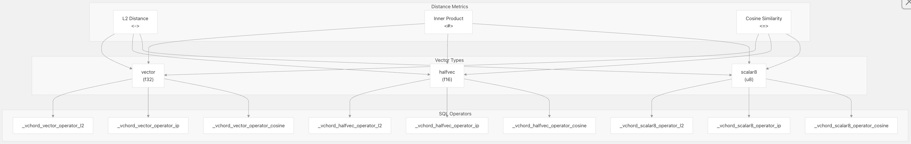
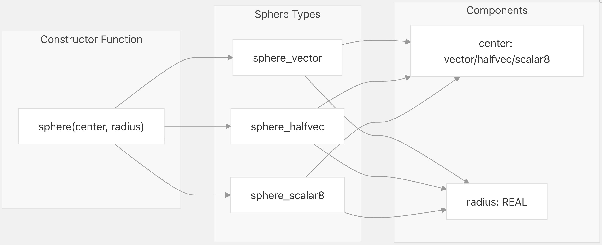
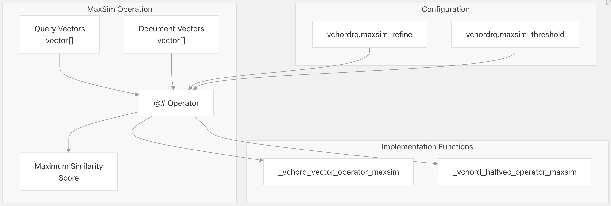
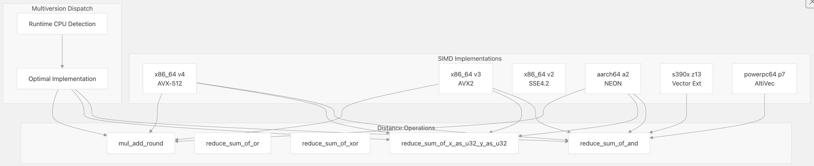

## VectorChord 源码学习: 4.2 距离度量和运算符（Distance Metrics and Operators）  
                                              
### 作者                                              
digoal                                              
                                              
### 日期                                              
2025-11-01                                              
                                              
### 标签                                              
VectorChord , 源码学习                                              
                                              
----                                              
                                              
## 背景                    
本文介绍 **VectorChord** 为向量相似性搜索（vector similarity search）提供的距离度量（distance metrics）和 **SQL** 运算符（operators）。它解释了可用的距离函数（distance functions）、它们对应的 **SQL** 运算符、专门的球体操作（sphere operations），以及支持高效距离计算的底层 **SIMD** 优化（optimizations）。  
  
## 支持的距离度量（Supported Distance Metrics）  
  
**VectorChord** 支持跨多种向量数据类型的三种主要距离度量：  
  
### 核心距离度量（Core Distance Metrics）  
  
| 度量名称（Metric） | 运算符（Operator） | 描述（Description） | SQL 用法（SQL Usage） | 支持类型（Supported Types） |  
| :--- | :--- | :--- | :--- | :--- |  
| **L2 距离** (**Euclidean**) | `<->` | 衡量两个向量之间的直线距离 | `vector_a <-> vector_b` | `vector`, `halfvec`, `scalar8` |  
| **内积** (**Inner Product** / **Dot Product**) | `<#>` | 计算两个向量的点积 | `vector_a <#> vector_b` | `vector`, `halfvec`, `scalar8` |  
| **余弦相似度** (**Cosine Similarity**) | `<=>` | 衡量两个向量之间夹角的余弦值 | `vector_a <=> vector_b` | `vector`, `halfvec`, `scalar8` |  
  
  
  
来源:  
[`src/sql/finalize.sql` 32-51](https://github.com/tensorchord/VectorChord/blob/ac12e257/src/sql/finalize.sql#L32-L51)  
  
## 球体操作（Sphere Operations）  
  
球体操作通过定义一个中心点（center point）和半径（radius），实现基于范围的查询（range-based queries）。这些专门的运算符支持在索引扫描（index scans）期间进行高效的空间过滤（spatial filtering）。  
  
### 球体运算符（Sphere Operators）  
  
| 名称（Name） | 运算符（Operator） | 描述（Description） | 用法（Usage） |  
| :--- | :--- | :--- | :--- |  
| **L2 球体** (**L2 Sphere**) | `<<->>` | 测试向量是否在球体的 L2 距离内 | `vector_column <<->> sphere(center_vector, radius)` |  
| **内积球体** (**Inner Product Sphere**) | `<<#>>` | 测试向量是否在球体的内积距离内 | `vector_column <<#>> sphere(center_vector, radius)` |  
| **余弦球体** (**Cosine Sphere**) | `<<=>>` | 测试向量是否在球体的余弦距离内 | `vector_column <<=>> sphere(center_vector, radius)` |  
  
### 球体类型定义（Sphere Type Definitions）  
  
  
  
来源:  
[`src/sql/finalize.sql` 15-28](https://github.com/tensorchord/VectorChord/blob/ac12e257/src/sql/finalize.sql#L15-L28)  
[`src/sql/finalize.sql` 53-114](https://github.com/tensorchord/VectorChord/blob/ac12e257/src/sql/finalize.sql#L53-L114)  
[`src/sql/finalize.sql` 130-137](https://github.com/tensorchord/VectorChord/blob/ac12e257/src/sql/finalize.sql#L130-L137)  
  
## MaxSim 操作（MaxSim Operations）  
  
**MaxSim** (最大相似度，Maximum Similarity) 操作支持多向量相似性搜索（multi-vector similarity search），通常用于 **ColBERT** 式的检索系统，其中查询和文档均表示为向量集合。  
  
### MaxSim 运算符（MaxSim Operator）  
  
| 名称（Name） | 运算符（Operator） | 描述（Description） | SQL 用法（SQL Usage） | 支持类型（Supported Types） |  
| :--- | :--- | :--- | :--- | :--- |  
| **MaxSim** | `@#` | 计算两个向量数组之间的最大相似度 | `vector_array_a @# vector_array_b` | `vector[]`, `halfvec[]` |  
  
**MaxSim** 操作通过比较第一个数组中的每个向量与第二个数组中的所有向量，来找出最大相似度得分(累加每个最相似的值)。  
  
  
  
来源:  
[`src/sql/finalize.sql` 116-126](https://github.com/tensorchord/VectorChord/blob/ac12e257/src/sql/finalize.sql#L116-L126)  
[`src/sql/finalize.sql` 369-377](https://github.com/tensorchord/VectorChord/blob/ac12e257/src/sql/finalize.sql#L369-L377)  
[`src/index/gucs.rs` 66-68](https://github.com/tensorchord/VectorChord/blob/ac12e257/src/index/gucs.rs#L66-L68)  
  
## SIMD 优化（SIMD Optimizations）  
  
**VectorChord** 利用广泛的 **SIMD** 优化来加速跨多个 **CPU** 架构的距离计算（distance calculations）。  
  
### 量化向量的位操作（Bit Operations for Quantized Vectors）  
  
对于 `scalar8` (量化，quantized) 向量，**VectorChord** 使用专门的位操作：  
  
| 操作（Operation） | 描述（Description） | 用途（Usage） |  
| :--- | :--- | :--- |  
| **AND 操作** (`reduce_sum_of_and`) | 计算位级 **AND** 后跟总体计数（population count） | 用于类似**汉明距离**（Hamming-like distance）的计算 |  
| **OR 操作** (`reduce_sum_of_or`) | 计算位级 **OR** 后跟总体计数 | 用于类似**Jaccard 相似度**（Jaccard-like similarity）的计算 |  
| **XOR 操作** (`reduce_sum_of_xor`) | 计算位级 **XOR** 后跟总体计数 | 用于**汉明距离**（Hamming distance）的计算 |  
  
### CPU 架构支持（CPU Architecture Support）  
  
**VectorChord** 提供了针对以下架构的优化实现：  
  
* **x86\_64**: v2, v3, v4 with **AVX2**, **AVX-512**  
* **aarch64**: a2, a3 with **NEON**  
* **s390x**: z13-z17 with vector extensions  
* **powerpc64**: p7-p9 with **AltiVec**  
  
  
  
来源:  
[`crates/simd/src/bit.rs` 15-18](https://github.com/tensorchord/VectorChord/blob/ac12e257/crates/simd/src/bit.rs#L15-L18)  
[`crates/simd/src/u8.rs` 326-329](https://github.com/tensorchord/VectorChord/blob/ac12e257/crates/simd/src/u8.rs#L326-L329)  
[`crates/simd/src/quantize.rs` 304-311](https://github.com/tensorchord/VectorChord/blob/ac12e257/crates/simd/src/quantize.rs#L304-L311)  
  
## 运算符类和索引支持（Operator Classes and Index Support）  
  
每个距离度量都被组织到运算符类（operator classes）中，这些类定义了它们如何与 **VectorChord** 的索引访问方法（index access methods）配合工作。  
  
### vchordrq 运算符类（vchordrq Operator Classes）  
  
| 运算符类（Operator Class） | 距离度量（Distance Metric） | 向量类型（Vector Type） | 主要运算符（Primary Operator） | 球体运算符（Sphere Operator） |  
| :--- | :--- | :--- | :--- | :--- |  
| `vector_l2_ops` | L2 距离 | `vector` | `<->` | `<<->>` |  
| `vector_ip_ops` | 内积 | `vector` | `<#>` | `<<#>>` |  
| `vector_cosine_ops` | 余弦 | `vector` | `<=>` | `<<=>>` |  
| `halfvec_l2_ops` | L2 距离 | `halfvec` | `<->` | `<<->>` |  
| `halfvec_ip_ops` | 内积 | `halfvec` | `<#>` | `<<#>>` |  
| `halfvec_cosine_ops` | 余弦 | `halfvec` | `<=>` | `<<=>>` |  
| `vector_maxsim_ops` | MaxSim | `vector[]` | `@#` | - |  
| `halfvec_maxsim_ops` | MaxSim | `halfvec[]` | `@#` | - |  
  
### vchordg 运算符类（vchordg Operator Classes）  
  
`vchordg` 访问方法支持相同的距离度量，但不包括 **MaxSim** 操作：  
  
| 运算符类（Operator Class） | 距离度量（Distance Metric） | 向量类型（Vector Type） | 主要运算符（Primary Operator） | 球体运算符（Sphere Operator） |  
| :--- | :--- | :--- | :--- | :--- |  
| `vector_l2_ops` | L2 距离 | `vector` | `<->` | `<<->>` |  
| `vector_ip_ops` | 内积 | `vector` | `<#>` | `<<#>>` |  
| `vector_cosine_ops` | 余弦 | `vector` | `<=>` | `<<=>>` |  
| `halfvec_l2_ops` | L2 距离 | `halfvec` | `<->` | `<<->>` |  
| `halfvec_ip_ops` | 内积 | `halfvec` | `<#>` | `<<#>>` |  
| `halfvec_cosine_ops` | 余弦 | `halfvec` | `<=>` | `<<=>>` |  
  
来源:  
[`src/sql/finalize.sql` 316-329](https://github.com/tensorchord/VectorChord/blob/ac12e257/src/sql/finalize.sql#L316-L329)  
[`src/sql/finalize.sql` 333-413](https://github.com/tensorchord/VectorChord/blob/ac12e257/src/sql/finalize.sql#L333-L413)  
  
## 配置参数（Configuration Parameters）  
  
距离度量行为可以通过各种 **GUC** 参数（**GUC** parameters）进行调整：  
  
### MaxSim 配置（MaxSim Configuration）  
  
| 参数（Parameter） | 类型（Type） | 默认值（Default） | 描述（Description） |  
| :--- | :--- | :--- | :--- |  
| **vchordrq.maxsim\_refine** | 整数（Integer） | 0 | **MaxSim** 操作的细化（refinement）步数 |  
| **vchordrq.maxsim\_threshold** | 整数（Integer） | 0 | **MaxSim** 过滤的阈值 |  
  
### 搜索配置（Search Configuration）  
  
| 参数（Parameter） | 类型（Type） | 默认值（Default） | 描述（Description） |  
| :--- | :--- | :--- | :--- |  
| **vchordrq.epsilon** | 浮点数（Float, 0.0 - 4.0） | 1.9 | 控制速度与准确性之间的权衡 |  
| **vchordrq.probes** | 字符串（String） | "" | 用于多级搜索的探针计数（probe counts），以逗号分隔 |  
  
来源:  
[`src/index/gucs.rs` 62-68](https://github.com/tensorchord/VectorChord/blob/ac12e257/src/index/gucs.rs#L62-L68)  
[`src/index/gucs.rs` 104-112](https://github.com/tensorchord/VectorChord/blob/ac12e257/src/index/gucs.rs#L104-L112)  
[`src/index/gucs.rs` 96-102](https://github.com/tensorchord/VectorChord/blob/ac12e257/src/index/gucs.rs#L96-L102)  
      
  
#### [期望 PostgreSQL|开源PolarDB 增加什么功能?](https://github.com/digoal/blog/issues/76 "269ac3d1c492e938c0191101c7238216")
  
  
#### [PolarDB 开源数据库](https://openpolardb.com/home "57258f76c37864c6e6d23383d05714ea")
  
  
#### [PolarDB 学习图谱](https://www.aliyun.com/database/openpolardb/activity "8642f60e04ed0c814bf9cb9677976bd4")
  
  
#### [PostgreSQL 解决方案集合](../201706/20170601_02.md "40cff096e9ed7122c512b35d8561d9c8")
  
  
#### [德哥 / digoal's Github - 公益是一辈子的事.](https://github.com/digoal/blog/blob/master/README.md "22709685feb7cab07d30f30387f0a9ae")
  
  
#### [About 德哥](https://github.com/digoal/blog/blob/master/me/readme.md "a37735981e7704886ffd590565582dd0")
  
  

  
