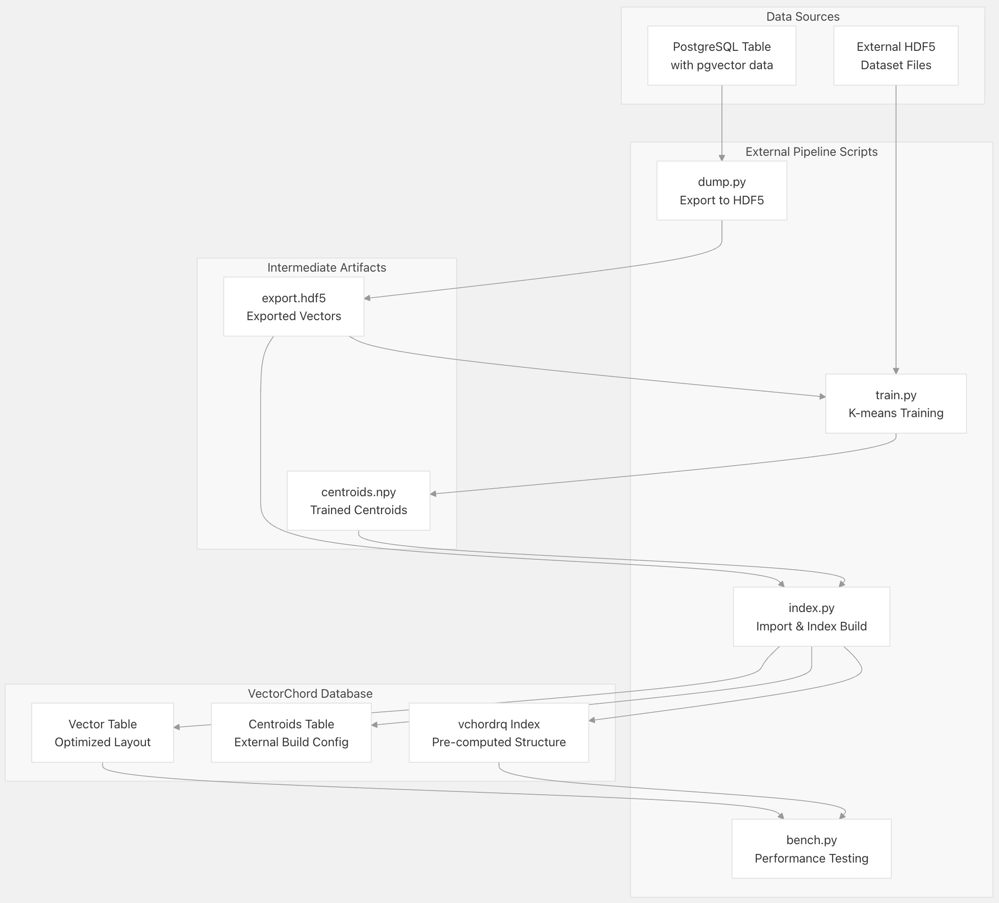
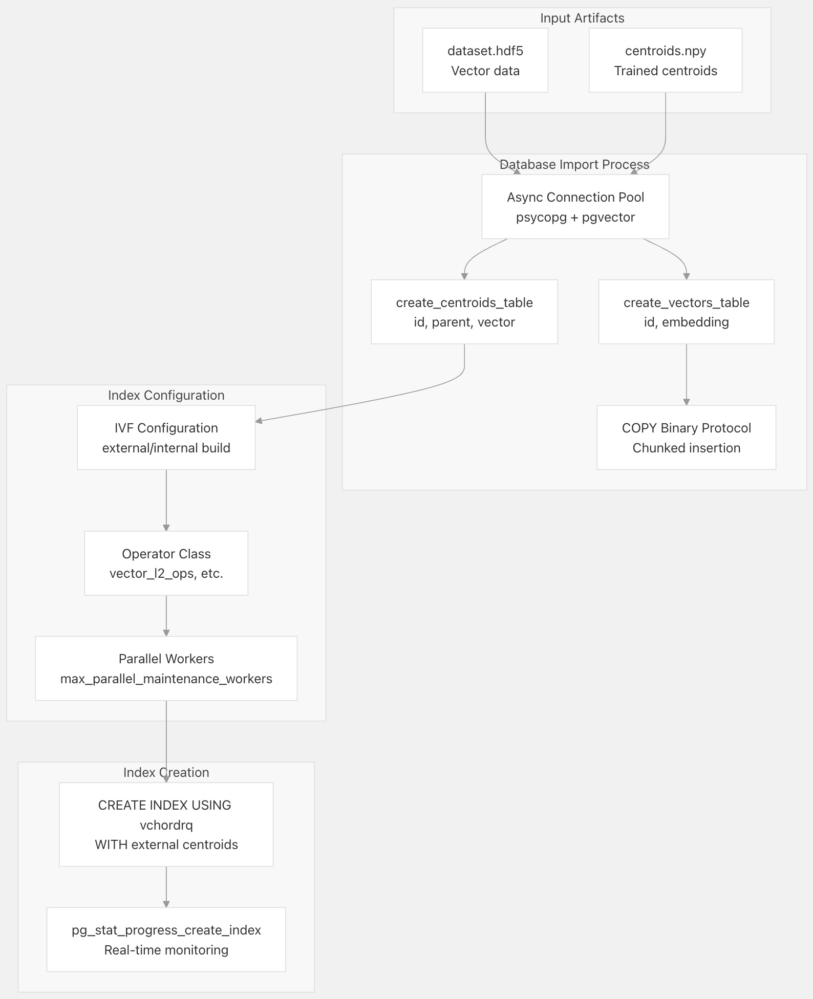
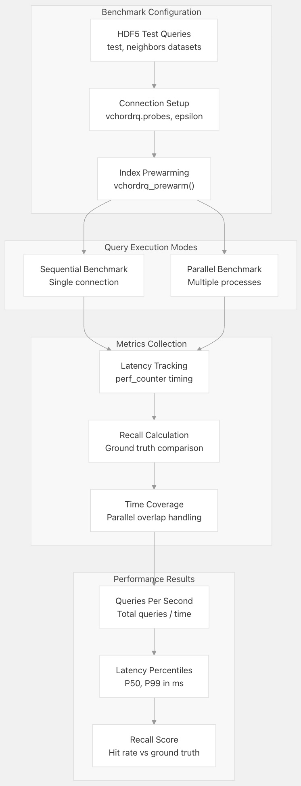
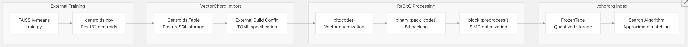

## VectorChord 源码学习: 4.3 外部数据管道 (External Data Pipeline)  
                                                
### 作者                                                
digoal                                                
                                                
### 日期                                                
2025-11-01                                                
                                                
### 标签                                                
VectorChord , 源码学习                                                
                                                
----                                                
                                                
## 背景                      
本文介绍 VectorChord 的**外部数据处理管道**（`external data processing pipeline`），它提供基于 **Python** 的工具，用于大规模**向量数据准备**（`vector data preparation`）、**K-均值聚类**（`K-means clustering`）、**索引预计算**（`index precomputation`）和**基准测试**（`benchmarking`）。该管道通过利用**外部计算资源**（包括 **GPU 加速**）来处理 **K-均值聚类**等密集型操作，从而能够高效地处理从数百万到数亿个向量的**数据集**（`datasets`）。  
  
## 概述与目的  
  
**外部数据管道**（`external data pipeline`）通过将资源密集型操作移到 **PostgreSQL** 之外，解决了为大型**数据集**（`datasets`）构建**向量索引**（`vector indexes`）的计算挑战。该管道由四个主要的 **Python 脚本**组成，它们协同工作以实现：  
  
1.  将现有 **PostgreSQL 表**中的**向量数据**（`vector data`）导出为标准化的 **HDF5 格式**  
2.  使用 **CPU** 或 **GPU 加速**，通过可配置的参数**训练 K-均值中心点**（`K-means centroids`）  
3.  将**优化后的数据**和**预计算的中心点**（`pre-computed centroids`）导回 **PostgreSQL**，以加快**索引构建**（`index building`）  
4.  进行**性能基准测试**（`Benchmark performance`），以验证**搜索质量**（`search quality`）和**吞吐量**（`throughput`）  
  
  
  
**外部管道工作流程和组件**  
  
来源:  
[`scripts/README.md` 1-58](https://github.com/tensorchord/VectorChord/blob/ac12e257/scripts/README.md#L1-L58)  
[`scripts/dump.py` 1-83](https://github.com/tensorchord/VectorChord/blob/ac12e257/scripts/dump.py#L1-L83)  
[`scripts/train.py` 1-219](https://github.com/tensorchord/VectorChord/blob/ac12e257/scripts/train.py#L1-L219)  
[`scripts/index.py` 1-244](https://github.com/tensorchord/VectorChord/blob/ac12e257/scripts/index.py#L1-L244)  
[`scripts/bench.py` 1-267](https://github.com/tensorchord/VectorChord/blob/ac12e257/scripts/bench.py#L1-L267)  
  
## 数据导出和准备  
  
### 向量数据导出 (`dump.py`)  
  
`dump.py` 脚本从现有的 **PostgreSQL 表**中提取**向量嵌入**（`vector embeddings`），并将其转换为 **HDF5 格式**，以便外部工具进行高效处理。  
  
| 参数 | 目的 | 示例 |  
| :--- | :--- | :--- |  
| `-n, --name` | 源表名 | `embeddings_table` |  
| `-c, --column` | 向量列名 | `embedding` |  
| `-d, --dim` | 向量维度 | `768` |  
| `-o, --output` | 输出 HDF5 文件路径 | `export.hdf5` |  
  
```  
python scripts/dump.py -n embeddings_table -c embedding -d 768 -o export.hdf5  
```  
  
该脚本使用带有**保持连接设置**（`keepalive settings`）的 **PostgreSQL 连接池**（`connection pooling`），并实现了**分块写入**（`chunked writing`），以高效处理大型**数据集**（`datasets`）。输出的 **HDF5 文件**包含一个 **`train` 数据集**，其形状为 `(n_vectors, dimensions)`，格式为 **float32**。  
  
### 外部数据集来源  
  
对于尚未导入 **PostgreSQL** 的**数据集**（`datasets`），该管道支持标准的**基准数据集**（`benchmark datasets`）：  
  
```  
# Small to medium datasets (1M vectors)  
wget http://ann-benchmarks.com/sift-128-euclidean.hdf5  
wget http://ann-benchmarks.com/gist-960-euclidean.hdf5  
  
# Large scale datasets (5M-100M vectors)    
wget https://myscale-datasets.s3.ap-southeast-1.amazonaws.com/laion-5m-test-ip.hdf5  
wget https://myscale-datasets.s3.ap-southeast-1.amazonaws.com/laion-100m-test-ip.hdf5  
```  
  
来源:  
[`scripts/dump.py` 1-83](https://github.com/tensorchord/VectorChord/blob/ac12e257/scripts/dump.py#L1-L83)  
[`scripts/README.md` 16-31](https://github.com/tensorchord/VectorChord/blob/ac12e257/scripts/README.md#L16-L31)  
  
## K-均值聚类训练 (`K-means Clustering Training`)  
  
### 训练算法 (`train.py`)  
  
`train.py` 脚本执行 **K-均值聚类**（`K-means clustering`），为 VectorChord 的**残差量化算法**（`residual quantization algorithm`）生成**中心点**（`centroids`）。它集成了 **FAISS 库**，提供 **CPU** 和 **GPU** 两种加速选项。  
  
  
  
**支持分层 (`Hierarchical Support`) 的 K-均值训练管道**  
  
### 训练参数和优化  
  
| 参数 | 目的 | 推荐值 |  
| :--- | :--- | :--- |  
| `--lists` | 主要中心点计数 | `4√n` 到 `16√n` (n 为数据集大小) |  
| `--lists-2` | 次要层中心点 | 可选的**分层聚类**（`hierarchical clustering`） |  
| `--niter` | Lloyd 迭代次数 | `10` (默认) |  
| `--metric` | 距离度量标准 (`Distance metric`) | `l2`、`cos`、`dot` |  
| `--gpu` | GPU 加速 | 对于 > 5M 的数据集启用 |  
| `--mmap` | 内存映射 (`Memory mapping`) | 对于 > 5M 的数据集启用 |  
  
当**数据集**（`datasets`）超过 `MAX_POINTS_PER_CLUSTER * k` (256 * k) 个点时，**训练过程**使用**水塘采样**（`reservoir sampling`）来管理内存使用，同时保持**聚类质量**（`clustering quality`）。  
  
### 与 VectorChord K-均值的集成  
  
**外部训练**利用 VectorChord **内部**使用的相同 **Lloyd 算法实现**（`Lloyd's algorithm implementation`），但加入了 **FAISS 优化**以进行大规模处理：  
  
```  
# CPU training for smaller datasets  
python scripts/train.py -i dataset.hdf5 -o centroids.npy --lists 4096 -m l2  
  
# GPU training for large datasets    
python scripts/train.py -i dataset.hdf5 -o centroids.npy --lists 8192 -m l2 -g --mmap  
```  
  
来源:  
[`scripts/train.py` 1-219](https://github.com/tensorchord/VectorChord/blob/ac12e257/scripts/train.py#L1-L219)  
[`scripts/README.md` 33-47](https://github.com/tensorchord/VectorChord/blob/ac12e257/scripts/README.md#L33-L47)  
[`crates/k_means/src/lib.rs` 22-62](https://github.com/tensorchord/VectorChord/blob/ac12e257/crates/k_means/src/lib.rs#L22-L62)  
  
## 索引构建和数据导入  
  
### 向量和中心点导入 (`index.py`)  
  
`index.py` 脚本将处理后的**向量**（`vectors`）和**预计算的中心点**（`pre-computed centroids`）导入 **PostgreSQL**，然后使用**外部构建配置**（`external build configuration`）构建优化的 VectorChord **索引**（`indexes`）。  
  
  
  
**使用外部中心点的索引构建过程**  
  
### 构建配置生成  
  
该脚本根据**距离度量标准**（`distance metric`）以及是否提供了**外部中心点**（`external centroids`）来生成 **TOML 格式**的**构建配置**（`build configurations`）：  
  
```  
# External centroids configuration  
external_centroids_cfg = """  
[build.external]  
table = 'public.{name}_centroids'  
"""  
  
# Internal centroids configuration    
internal_centroids_cfg = """  
[build.internal]  
lists = [{k}]  
build_threads = {workers}  
spherical_centroids = {spherical}  
"""  
```  
  
**残差量化**（`residual quantization`）和**标准量化**（`standard quantization`）之间的选择由**距离度量标准**（`distance metric`）决定，其中 **L2 距离**可启用**残差量化**，从而提高**准确性**（`accuracy`）。  
  
### 异步导入过程  
  
**导入过程**使用**异步 PostgreSQL 操作**（`asynchronous PostgreSQL operations`）来最大化**吞吐量**（`throughput`）：  
  
* 使用 `asyncio.gather()` 进行并发**中心点和向量插入**（`Concurrent centroid and vector insertion`）  
* 使用**二进制 COPY 协议**（`Binary COPY protocol`）进行高效的**批量数据传输**（`bulk data transfer`）  
* 通过 `pg_stat_progress_create_index` 系统视图进行**进度监控**（`Progress monitoring`）  
* 采用**内存高效的分块**（`Memory-efficient chunking`）来处理大于可用 **RAM** 的**数据集**（`datasets`）  
  
来源:  
[`scripts/index.py` 1-244](https://github.com/tensorchord/VectorChord/blob/ac12e257/scripts/index.py#L1-L244)  
[`scripts/README.md` 48-52](https://github.com/tensorchord/VectorChord/blob/ac12e257/scripts/README.md#L48-L52)  
  
## 性能基准测试 (`Performance Benchmarking`)  
  
### 基准测试框架 (`bench.py`)  
  
`bench.py` 脚本为 VectorChord **索引**（`indexes`）提供全面的**性能测试**（`performance testing`），支持**顺序**（`sequential`）和**并行查询执行模式**（`parallel query execution patterns`）。  
  
  
  
**基准测试执行和指标管道**  
  
### 基准测试参数和指标  
  
| 参数 | 目的 | 影响 |  
| :--- | :--- | :--- |  
| `--nprob` | 探针数量 (`Number of probes`) | 值越高 = 更好的**召回率**（`recall`），更慢的**查询**（`queries`） |  
| `--epsilon` | 搜索 ε值（`epsilon`） | **准确性**（`Accuracy`）与**速度**（`speed`）的权衡 |  
| `--processes` | 并行进程数 | **并发负载测试**（`Concurrent load testing`） |  
| `--top` | 结果集大小 | 10 或 100 个**最近邻**（`nearest neighbors`） |  
  
**基准测试框架**（`benchmarking framework`）计算关键**性能指标**（`key performance indicators`）：  
  
* **召回率**（`Recall`）：在结果中找到的**真实邻居**（`ground truth neighbors`）的比例  
* **QPS**（每秒查询次数）：经过**并行执行的时间覆盖校正**（`time coverage correction for parallel execution`）后的每秒查询次数  
* **延迟百分位数**（`Latency percentiles`）：**P50** 和 **P99** **响应时间**（`response times`）（以毫秒为单位）  
  
### 带有时间覆盖校正的并行基准测试  
  
对于**并行基准测试**（`parallel benchmarking`），该脚本实现了**时间覆盖计算**（`time coverage calculation`），以处理跨多个进程的**重叠查询执行**（`overlapping query execution`）：  
  
```  
def calculate_coverage(time_intervals):  
    sorted_intervals = sorted(time_intervals, key=lambda x: x[0])  
    merged = []  
    current_start, current_end = sorted_intervals[0]  
    for interval in sorted_intervals[1:]:  
        next_start, next_end = interval  
        if next_start <= current_end:  
            current_end = max(current_end, next_end)  
        else:  
            merged.append((current_start, current_end))  
            current_start, current_end = next_start, next_end  
```  
  
这确保了当多个进程**并发执行查询**（`execute queries concurrently`）时，**QPS** 计算的**准确性**（`accurate`）。  
  
来源:  
[`scripts/bench.py` 1-267](https://github.com/tensorchord/VectorChord/blob/ac12e257/scripts/bench.py#L1-L267)  
[`scripts/README.md` 54-58](https://github.com/tensorchord/VectorChord/blob/ac12e257/scripts/README.md#L54-L58)  
  
## 与核心 VectorChord 系统的集成  
  
### RaBitQ 量化管道  
  
**外部管道**与 VectorChord 的 **RaBitQ 量化系统**（`RaBitQ quantization system`）集成，该系统为 **`vchordrq` 索引方法**中使用的**残差量化**（`residual quantization`）提供了**理论基础**（`theoretical foundation`）。  
  
  
  
**外部管道与 VectorChord 核心之间的集成**  
  
### 索引方法的兼容性  
  
**外部管道**是专为 **`vchordrq` 索引方法**设计的，并与其**残差量化算法**（`residual quantization algorithm`）集成：  
  
* **外部中心点**（`External centroids`）存储在带有 `id`、`parent` 和 `vector` 列的 **PostgreSQL 表**中  
* **构建配置**（`Build configuration`）以 **TOML 格式**指定**外部表引用**（`external table references`）  
* **量化参数**（`Quantization parameters`）自动从**距离度量标准**（`distance metric`）和**中心点配置**（`centroid configuration`）中导出  
* **并行构建**（`Parallel building`）利用 **PostgreSQL 的**并行维护工作者**（`parallel maintenance workers`）进行大规模**索引构建**（`index construction`）  
  
**管道输出**直接馈送到 VectorChord 在 **`vchordrq` crate** 中实现的**内部算法**（`internal algorithms`），特别是处理**量化向量存储**（`quantized vector storage`）和**搜索优化**（`search optimization`）的**维护**（`maintain`）和**构建**（`build`）过程。  
  
来源:  
[`scripts/index.py` 77-116](https://github.com/tensorchord/VectorChord/blob/ac12e257/scripts/index.py#L77-L116)  
[`crates/rabitq/src/bit.rs` 1-469](https://github.com/tensorchord/VectorChord/blob/ac12e257/crates/rabitq/src/bit.rs#L1-L469)  
[`crates/vchordrq/src/maintain.rs` 35-249](https://github.com/tensorchord/VectorChord/blob/ac12e257/crates/vchordrq/src/maintain.rs#L35-L249)  
    
  
#### [期望 PostgreSQL|开源PolarDB 增加什么功能?](https://github.com/digoal/blog/issues/76 "269ac3d1c492e938c0191101c7238216")
  
  
#### [PolarDB 开源数据库](https://openpolardb.com/home "57258f76c37864c6e6d23383d05714ea")
  
  
#### [PolarDB 学习图谱](https://www.aliyun.com/database/openpolardb/activity "8642f60e04ed0c814bf9cb9677976bd4")
  
  
#### [PostgreSQL 解决方案集合](../201706/20170601_02.md "40cff096e9ed7122c512b35d8561d9c8")
  
  
#### [德哥 / digoal's Github - 公益是一辈子的事.](https://github.com/digoal/blog/blob/master/README.md "22709685feb7cab07d30f30387f0a9ae")
  
  
#### [About 德哥](https://github.com/digoal/blog/blob/master/me/readme.md "a37735981e7704886ffd590565582dd0")
  
  

  
