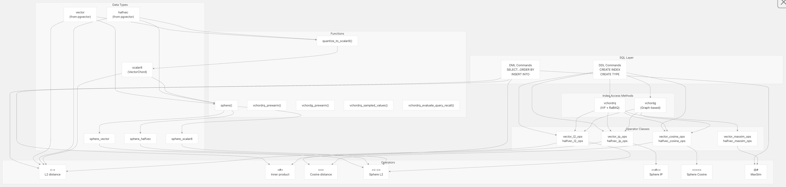
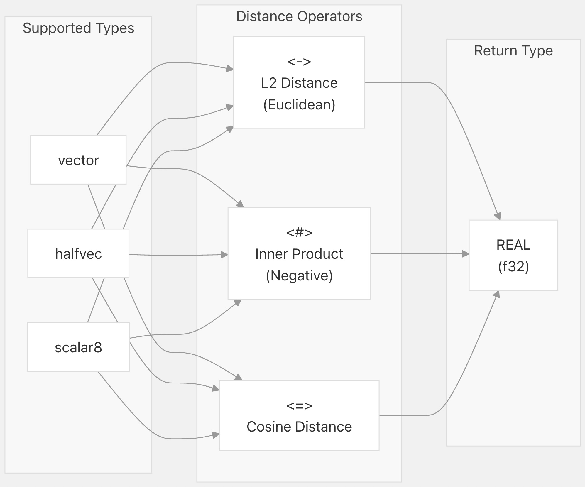
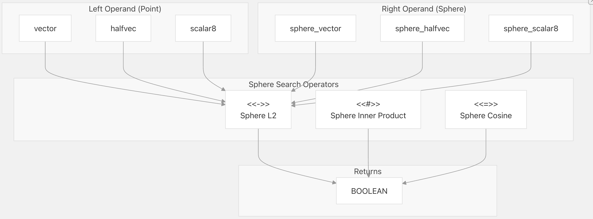
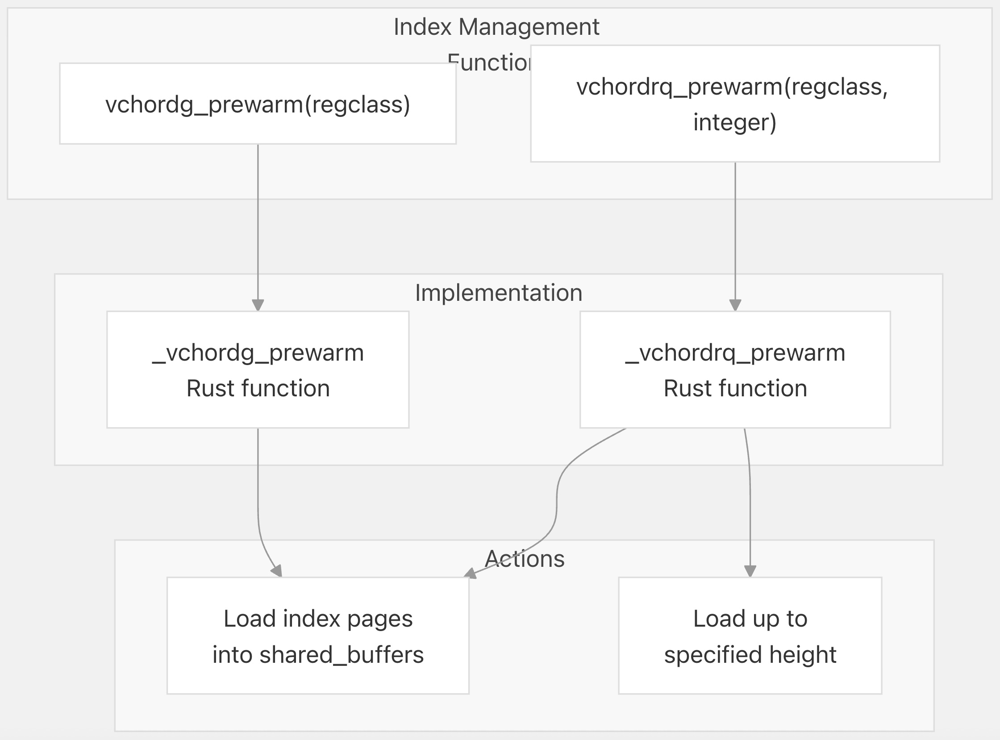
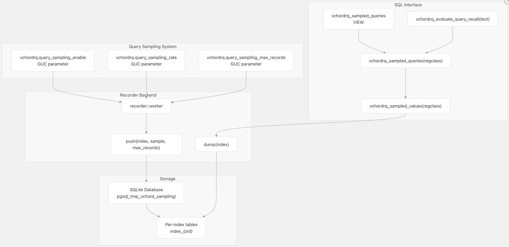
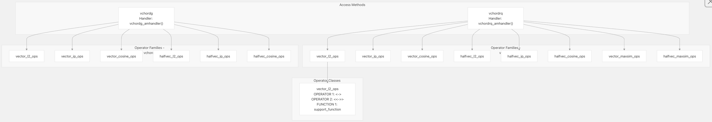

## VectorChord 源码学习: 6.1 SQL Interface and Operators (SQL 接口和操作符)  
                                                    
### 作者                                                    
digoal                                                    
                                                    
### 日期                                                    
2025-11-01                                                    
                                                    
### 标签                                                    
VectorChord , 源码学习                                                    
                                                    
----                                                    
                                                    
## 背景         
本文介绍 VectorChord 的 **SQL 接口 (SQL interface)** 完整参考，包括**数据类型 (data types)**、**操作符 (operators)**、**函数 (functions)** 和**索引创建命令 (index creation commands)**。它涵盖了用户在创建**索引 (indexes)** 和查询**向量数据 (vector data)** 时与之交互的所有 **SQL 级结构 (SQL-level constructs)**。  
  
-----  
  
## Overview of SQL Components (SQL 组件概述)  
  
VectorChord 通过自定义的**数据类型 (data types)**、**距离操作符 (distance operators)** 和**索引访问方法 (index access methods)** 扩展了 **PostgreSQL**。该扩展与 **pgvector** 的 `vector` 和 `halfvec` 类型无缝集成，同时添加了其自身的 `scalar8` **量化类型 (quantized type)** 和**基于球体的搜索操作符 (sphere-based search operators)**。  
  
  
  
**来源 (Sources):** [`src/sql/finalize.sql` 1-435](https://github.com/tensorchord/VectorChord/blob/ac12e257/src/sql/finalize.sql#L1-L435)  
  
-----  
  
## Data Types (数据类型)  
  
### scalar8  
  
`scalar8` 类型是 VectorChord 自定义的**量化向量类型 (quantized vector type)**，它将每个维度存储为**8 位有符号整数 (8-bit signed integer)**。与 `vector` (**32 位浮点数 (32-bit floats)**) 相比，这提供了显著的**空间节省 (space savings)**，同时在许多应用中仍保持了良好的**精度 (accuracy)**。  
  
**类型定义 (Type Definition):**  
  
```  
CREATE TYPE scalar8 (  
    INPUT = _vchord_scalar8_in,  
    OUTPUT = _vchord_scalar8_out,  
    RECEIVE = _vchord_scalar8_recv,  
    SEND = _vchord_scalar8_send,  
    TYPMOD_IN = _vchord_typmod_in_65535,  
    TYPMOD_OUT = _vchord_typmod_out,  
    STORAGE = EXTERNAL,  
    INTERNALLENGTH = VARIABLE,  
    ALIGNMENT = double  
);  
```  
  
**文本格式 (Text Format):** 文本表示使用与 pgvector 相同的语法：`[1,2,3]` 表示一个**3 维向量 (3-dimensional vector)**。  
  
**类型修饰符 (Type Modifier):** 可以使用类型修饰符指定维度：`scalar8(384)` 表示一个 **384 维向量 (384-dimensional vector)**。支持的最大维度：65535。  
  
**来源 (Sources):** [`src/sql/finalize.sql` 3-13](https://github.com/tensorchord/VectorChord/blob/ac12e257/src/sql/finalize.sql#L3-L13)  
  
### Sphere Types (球体类型)  
  
**球体类型 (Sphere types)** 表示一个**中心向量 (center vector)** 加上一个**半径 (radius)**，用于**基于范围的搜索操作 (range-based search operations)**。存在对应于三种基本向量类型的三种变体：  
  
| Sphere Type (球体类型) | Center Type (中心类型) | Definition (定义) |  
| :--- | :--- | :--- |  
| `sphere_vector` | `vector` | `(center vector, radius REAL)` |  
| `sphere_halfvec` | `halfvec` | `(center halfvec, radius REAL)` |  
| `sphere_scalar8` | `scalar8` | `(center scalar8, radius REAL)` |  
  
这些是使用以下方式创建的**复合类型 (composite types)**：  
  
```  
CREATE TYPE sphere_vector AS (  
    center vector,  
    radius REAL  
);  
```  
  
**来源 (Sources):** [`src/sql/finalize.sql` 15-28](https://github.com/tensorchord/VectorChord/blob/ac12e257/src/sql/finalize.sql#L15-L28)  
  
-----  
  
## Distance Operators (距离操作符)  
  
VectorChord 提供了**距离操作符 (distance operators)**，用于计算向量之间的**相似度 (similarity)**。这些操作符用于 `ORDER BY` 子句中，以执行**近似最近邻 (ANN) 搜索 (approximate nearest neighbor search)**。  
  
### Basic Distance Operators (基本距离操作符)  
  
  
  
#### L2 Distance Operator (L2 距离操作符): `<->`  
  
计算两个向量之间的**欧几里得 (L2) 距离 (Euclidean (L2) distance)**：`sqrt(sum((a[i] - b[i])^2))`  
  
**操作符定义 (Operator Definitions):**  
  
  * `vector <-> vector` - [`src/sql/finalize.sql` 32-37](https://github.com/tensorchord/VectorChord/blob/ac12e257/src/sql/finalize.sql#L32-L37)  
  * `halfvec <-> halfvec` - 来自 **pgvector**  
  * `scalar8 <-> scalar8` - [`src/sql/finalize.sql` 32-37](https://github.com/tensorchord/VectorChord/blob/ac12e257/src/sql/finalize.sql#L32-L37)  
  
**示例 (Example):**  
  
```  
SELECT id, val <-> '[1.0, 2.0, 3.0]' AS distance  
FROM vectors  
ORDER BY val <-> '[1.0, 2.0, 3.0]'  
LIMIT 10;  
```  
  
#### Inner Product Operator (内积操作符): `<#>`  
  
计算**负内积 (negative inner product)**：`-sum(a[i] * b[i])`。使用负值是为了让更大（**更正 (more positive)**）的**内积 (inner products)** 在**最近邻查询 (nearest neighbor queries)** 中产生更小的距离。  
  
**操作符定义 (Operator Definitions):**  
  
  * `vector <#> vector` - 来自 **pgvector**  
  * `halfvec <#> halfvec` - 来自 **pgvector**  
  * `scalar8 <#> scalar8` - [`src/sql/finalize.sql` 39-44](https://github.com/tensorchord/VectorChord/blob/ac12e257/src/sql/finalize.sql#L39-L44)  
  
**示例 (Example):**  
  
```  
SELECT id FROM vectors  
ORDER BY embedding <#> query_vector  
LIMIT 10;  
```  
  
#### Cosine Distance Operator (余弦距离操作符): `<=>`  
  
计算**余弦距离 (cosine distance)**：`1 - (dot(a, b) / (norm(a) * norm(b)))`。这等同于转换为**距离度量 (distance metric)** 的**余弦相似度 (cosine similarity)**。  
  
**操作符定义 (Operator Definitions):**  
  
  * `vector <=> vector` - 来自 **pgvector**  
  * `halfvec <=> halfvec` - 来自 **pgvector**  
  * `scalar8 <=> scalar8` - [`src/sql/finalize.sql` 46-51](https://github.com/tensorchord/VectorChord/blob/ac12e257/src/sql/finalize.sql#L46-L51)  
  
**示例 (Example):**  
  
```  
SELECT id FROM documents  
ORDER BY embedding <=> query_embedding  
LIMIT 20;  
```  
  
**来源 (Sources):** [`src/sql/finalize.sql` 30-51](https://github.com/tensorchord/VectorChord/blob/ac12e257/src/sql/finalize.sql#L30-L51)  
  
### Sphere Search Operators (球体搜索操作符)  
  
**球体操作符 (Sphere operators)** 测试**点向量 (point vector)** 是否在距**中心向量 (sphere center)** 指定的**半径 (radius)** 范围内。它们主要用于**基于范围的搜索 (range-based searches)**，而不是 **k 最近邻查询 (k-nearest neighbor queries)**。  
  
  
  
#### Sphere L2 Operator (球体 L2 操作符): `<<->>`  
  
测试点到球体中心的 **L2 距离 (L2 distance)** 是否在半径内。  
  
**操作符定义 (Operator Definitions):**  
  
  * `vector <<->> sphere_vector` - [`src/sql/finalize.sql` 53-58](https://github.com/tensorchord/VectorChord/blob/ac12e257/src/sql/finalize.sql#L53-L58)  
  * `halfvec <<->> sphere_halfvec` - [`src/sql/finalize.sql` 60-65](https://github.com/tensorchord/VectorChord/blob/ac12e257/src/sql/finalize.sql#L60-L65)  
  * `scalar8 <<->> sphere_scalar8` - [`src/sql/finalize.sql` 67-72](https://github.com/tensorchord/VectorChord/blob/ac12e257/src/sql/finalize.sql#L67-L72)  
  
**示例 (Example):**  
  
```  
SELECT id FROM vectors  
WHERE val <<->> sphere('[1.0, 2.0, 3.0]', 0.5)  
LIMIT 100;  
```  
  
#### Sphere Inner Product Operator (球体内积操作符): `<<#>>`  
  
测试点到球体中心的**负内积 (negative inner product)** 是否在半径内。  
  
**操作符定义 (Operator Definitions):**  
  
  * `vector <<#>> sphere_vector` - [`src/sql/finalize.sql` 74-79](https://github.com/tensorchord/VectorChord/blob/ac12e257/src/sql/finalize.sql#L74-L79)  
  * `halfvec <<#>> sphere_halfvec` - [`src/sql/finalize.sql` 81-86](https://github.com/tensorchord/VectorChord/blob/ac12e257/src/sql/finalize.sql#L81-L86)  
  * `scalar8 <<#>> sphere_scalar8` - [`src/sql/finalize.sql` 88-93](https://github.com/tensorchord/VectorChord/blob/ac12e257/src/sql/finalize.sql#L88-L93)  
  
#### Sphere Cosine Operator (球体余弦操作符): `<<=>>`  
  
测试点到球体中心的**余弦距离 (cosine distance)** 是否在半径内。  
  
**操作符定义 (Operator Definitions):**  
  
  * `vector <<=>> sphere_vector` - [`src/sql/finalize.sql` 95-100](https://github.com/tensorchord/VectorChord/blob/ac12e257/src/sql/finalize.sql#L95-L100)  
  * `halfvec <<=>> sphere_halfvec` - [`src/sql/finalize.sql` 102-107](https://github.com/tensorchord/VectorChord/blob/ac12e257/src/sql/finalize.sql#L102-L107)  
  * `scalar8 <<=>> sphere_scalar8` - [`src/sql/finalize.sql` 109-114](https://github.com/tensorchord/VectorChord/blob/ac12e257/src/sql/finalize.sql#L109-L114)  
  
**来源 (Sources):** [`src/sql/finalize.sql` 53-114](https://github.com/tensorchord/VectorChord/blob/ac12e257/src/sql/finalize.sql#L53-L114)  
  
-----  
  
## MaxSim Operator (MaxSim 操作符)  
  
`@#` 操作符为**多向量查询 (multi-vector queries)** 实现了**最大相似度 (MaxSim) 搜索 (Maximum Similarity search)**。这通常用于 **ColBERT 风格的检索系统 (ColBERT-style retrieval systems)** 中，其中文档和查询被表示为**标记嵌入序列 (sequences of token embeddings)**。  
  
**操作符定义 (Operator Definition):**  
  
  * `vector[] @# vector[]` - [`src/sql/finalize.sql` 116-120](https://github.com/tensorchord/VectorChord/blob/ac12e257/src/sql/finalize.sql#L116-L120)  
  * `halfvec[] @# halfvec[]` - [`src/sql/finalize.sql` 122-126](https://github.com/tensorchord/VectorChord/blob/ac12e257/src/sql/finalize.sql#L122-L126)  
  
**MaxSim 计算 (MaxSim Computation):** 对于**查询向量 (query vectors)** Q 和**文档向量 (document vectors)** D，MaxSim 计算：  
  
```  
sum over q in Q of max over d in D of dot(q, d)  
```  
  
**示例 (Example):**  
  
```  
-- Multi-vector query search  
SELECT doc_id  
FROM colbert_embeddings  
ORDER BY doc_vectors @# query_vectors  
LIMIT 10;  
```  
  
**注意 (Notes):**  
  
  * 只有 `vchordrq` **索引访问方法 (index access method)** 支持 MaxSim  
  * 必须使用特殊的**操作符类 (operator classes)** `vector_maxsim_ops` 和 `halfvec_maxsim_ops`  
  * **操作符策略编号 (operator strategy number)** 是 3（距离操作符是 1）  
  
**来源 (Sources):** [`src/sql/finalize.sql` 116-127](https://github.com/tensorchord/VectorChord/blob/ac12e257/src/sql/finalize.sql#L116-L127) [`src/sql/finalize.sql` 369-377](https://github.com/tensorchord/VectorChord/blob/ac12e257/src/sql/finalize.sql#L369-L377)  
  
-----  
  
## 实用函数 (Utility Functions)  
  
### 向量构造与转换 (Vector Construction and Conversion)  
  
#### sphere()  
  
根据中心向量 (center vector) 和半径 (radius) 构造一个球体 (sphere)。  
  
**函数签名 (Function Signatures):**  
  
```sql  
sphere(vector, real) RETURNS sphere_vector  
sphere(halfvec, real) RETURNS sphere_halfvec  
sphere(scalar8, real) RETURNS sphere_scalar8  
```  
  
**实现 (Implementation):** 使用 `ROW()` 构造函数的简单 SQL 函数。  
  
**示例 (Example):**  
  
```sql  
SELECT id FROM vectors  
WHERE embedding <<->> sphere('[1.0, 2.0]', 0.5);  
```  
  
来源:  
[`src/sql/finalize.sql` 130-137](https://github.com/tensorchord/VectorChord/blob/ac12e257/src/sql/finalize.sql#L130-L137)  
  
#### quantize\_to\_scalar8()  
  
将全精度向量 (full-precision vector) 转换为量化后的 `scalar8` 格式。  
  
**函数签名 (Function Signatures):**  
  
```sql  
quantize_to_scalar8(vector) RETURNS scalar8  
quantize_to_scalar8(halfvec) RETURNS scalar8  
```  
  
**量化方法 (Quantization Method):** 线性量化 (Linear quantization)，将向量的值范围映射到 `[-127, 127]` 的 8 位有符号整数 (8-bit signed integers)。  
  
**示例 (Example):**  
  
```sql  
-- Insert quantized vectors  
INSERT INTO quantized_vectors (id, vec)  
SELECT id, quantize_to_scalar8(embedding)  
FROM original_vectors;  
```  
  
来源:  
[`src/sql/finalize.sql` 139-143](https://github.com/tensorchord/VectorChord/blob/ac12e257/src/sql/finalize.sql#L139-L143)  
  
### 索引管理函数 (Index Management Functions)  
  
  
  
#### vchordrq\_prewarm()  
  
将索引页面预加载 (Preloads) 到 PostgreSQL 的共享缓冲区 (shared buffers) 中，以提高冷启动性能 (cold-start performance)。  
  
**函数签名 (Function Signature):**  
  
```sql  
vchordrq_prewarm(regclass, integer DEFAULT 0) RETURNS TEXT  
```  
  
**参数 (Parameters):**  
  
  * `regclass`: 索引关系 OID 或名称 (Index relation OID or name)  
  * `integer`: 高度参数 (Height parameter) (默认值 0) - 控制加载的索引层级 (index hierarchy) 数量  
  
**返回值 (Return Value):** 指示已加载页面数量的文本消息。  
  
**示例 (Example):**  
  
```sql  
-- Prewarm entire index  
SELECT vchordrq_prewarm('my_vector_idx');  
  
-- Prewarm only top levels  
SELECT vchordrq_prewarm('my_vector_idx', 2);  
```  
  
**实现 (Implementation):** [`src/index/functions.rs` 44-63](https://github.com/tensorchord/VectorChord/blob/ac12e257/src/index/functions.rs#L44-L63)  
  
来源:  
[`src/sql/finalize.sql` 227-228](https://github.com/tensorchord/VectorChord/blob/ac12e257/src/sql/finalize.sql#L227-L228)  
[`src/index/functions.rs` 44-63](https://github.com/tensorchord/VectorChord/blob/ac12e257/src/index/functions.rs#L44-L63)  
  
#### vchordg\_prewarm()  
  
将 `vchordg` 图基索引 (graph-based index) 页面预加载到共享缓冲区 (shared buffers) 中。  
  
**函数签名 (Function Signature):**  
  
```sql  
vchordg_prewarm(regclass) RETURNS TEXT  
```  
  
**参数 (Parameters):**  
  
  * `regclass`: 索引关系 OID 或名称 (Index relation OID or name)  
  
**示例 (Example):**  
  
```sql  
SELECT vchordg_prewarm('my_graph_idx');  
```  
  
**实现 (Implementation):** [`src/index/functions.rs` 22-41](https://github.com/tensorchord/VectorChord/blob/ac12e257/src/index/functions.rs#L22-L41)  
  
来源:  
[`src/sql/finalize.sql` 306-307](https://github.com/tensorchord/VectorChord/blob/ac12e257/src/sql/finalize.sql#L306-L307)  
  
---  
  
## 查询采样与召回率评估 (Query Sampling and Recall Evaluation)  
VectorChord 包含一个查询采样系统，用于记录查询以进行性能分析和召回率评估。  
  
  
  
### vchordrq\_sampled\_values()  
  
该**集合返回函数 (set-returning function)** 用于从索引中抽取**样本向量 (sample vectors)**，主要用于调试和分析。  
  
**函数签名 (Function Signature):**  
  
```  
vchordrq_sampled_values(regclass) RETURNS SETOF TEXT  
```  
  
**参数 (Parameters):**  
  
* `regclass`: **索引关系 OID (Index relation OID)** 或名称。  
  
**返回值 (Return Value):** 采样的结果向量  
  
**示例 (Example):**  
  
```  
SELECT value FROM vchordrq_sampled_values('my_idx');  
```  
  
**实现 (Implementation):** [`src/index/functions.rs` 91-110](https://github.com/tensorchord/VectorChord/blob/ac12e257/src/index/functions.rs#L91-L110)  
  
**来源 (Sources):** [`src/sql/finalize.sql` 145-146](https://github.com/tensorchord/VectorChord/blob/ac12e257/src/sql/finalize.sql#L145-L146) [`src/index/functions.rs` 91-110](https://github.com/tensorchord/VectorChord/blob/ac12e257/src/index/functions.rs#L91-L110)  
  
### vchordrq\_sampled\_queries()  
  
该函数旨在通过对 **vchordrq** 索引中的数据进行**采样 (sampling)** 来生成**代表性查询 (representative queries)**。它通过从索引中选择**质心 (centroids)** 或**近邻 (nearby tuples)** 来合成查询。  
  
**函数签名 (Function Signature):**  
  
```  
vchordrq_sampled_queries(regclass)   
RETURNS TABLE(  
    schema_name NAME,  
    index_name NAME,  
    table_name NAME,  
    column_name NAME,  
    operator NAME,  
    value TEXT  
)  
```  
  
返回列：  
- `schema_name`： 包含索引的模式  
- `index_name`： 索引名称  
- `table_name`： 索引表的名称  
- `column_name`： 索引列的名称（表达式索引为 `NULL`）  
- `operator`： 使用的距离运算符（`<->`、`<#>`、`<=>`）  
- `value`： 查询向量的文本表示  
  
例子:  
```  
SELECT * FROM vchordrq_sampled_queries('my_idx');  
```  
  
**来源 (Sources):** [`src/sql/finalize.sql` 148-222](https://github.com/tensorchord/VectorChord/blob/ac12e257/src/sql/finalize.sql#L148-L222)    
  
### vchordrq\_sampled\_queries View (vchordrq\_sampled\_queries 视图)  
  
该**视图 (View)** 提供了对 `vchordrq_sampled_queries()` 函数的简化**表访问 (table access)**。  
  
**视图定义 (View Definition):**  
  
```  
CREATE VIEW vchordrq_sampled_queries AS  
SELECT  
    record.schema_name,  
    record.index_name,  
    record.table_name,  
    record.column_name,  
    record.operator,  
    record.value  
FROM  
    (SELECT i.oid FROM pg_catalog.pg_class AS i  
     JOIN pg_catalog.pg_index AS ix ON i.oid = ix.indexrelid  
     JOIN pg_catalog.pg_opclass AS opc ON ix.indclass[0] = opc.oid  
     JOIN pg_catalog.pg_am AS am ON opc.opcmethod = am.oid  
     WHERE am.amname = 'vchordrq') AS index_oids  
CROSS JOIN LATERAL vchordrq_sampled_queries(index_oids.oid::regclass) AS record;  
```  
  
**示例 (Example):**  
  
```  
-- Get all sampled queries across all indexes  
SELECT schema_name, index_name, operator, value  
FROM vchordrq_sampled_queries;  
```  
  
**来源 (Sources):** [`src/sql/finalize.sql` 417-434](https://github.com/tensorchord/VectorChord/blob/ac12e257/src/sql/finalize.sql#L417-L434)  
  
### vchordrq\_evaluate\_query\_recall()  
  
评估给定查询的**召回率 (recall)**，通过将**近似结果 (approximate results)** 与**真实结果 (ground truth)** 进行比较。  
  
**函数签名 (Function Signature):**  
  
```  
vchordrq_evaluate_query_recall(  
    query text,  
    exact_search boolean DEFAULT false,  
    accu_probes TEXT DEFAULT NULL,  
    accu_epsilon real DEFAULT 1.9  
) RETURNS real  
```  
  
**参数 (Parameters):**  
  
* `query`: 返回 `ctid` 值的 SQL 查询 (例如：`SELECT ctid FROM t ORDER BY val <-> '[1,2,3]' LIMIT 10`)  
* `exact_search`: 如果为 true，则禁用索引扫描以获取**地面真实 (ground truth)**；如果为 false，则使用较高的**探测次数 (probe counts)**  
* `accu_probes`: **地面真实查询 (ground truth query)** 的**探测次数 (Probe counts)** (覆盖默认值)  
* `accu_epsilon`: **地面真实查询 (ground truth query)** 的 **Epsilon 值 (Epsilon value)**  
  
**返回值 (Return Value):** 召回率，表示为一个**浮点数 (float)** (0.0 到 1.0)，如果未找到结果则为 **NaN**。  
  
**算法 (Algorithm):**  
  
1.  使用**当前设置 (current settings)** 执行查询以获取“**粗略 (rough)**”结果  
2.  使用应检索**地面真实 (ground truth)** 的设置执行查询以获取“**准确 (accurate)**”结果  
3.  计算召回率：$|粗略 \cap 准确| / |准确|$  (`|rough ∩ accurate| / |accurate|`)      
  
**示例 (Example):**  
  
```  
-- Evaluate recall with default settings  
SELECT vchordrq_evaluate_query_recall(  
    'SELECT ctid FROM vectors ORDER BY embedding <-> ''[1.0, 2.0, 3.0]'' LIMIT 10'  
);  
  
-- Evaluate with exact ground truth  
SELECT vchordrq_evaluate_query_recall(  
    'SELECT ctid FROM vectors ORDER BY embedding <-> ''[1.0, 2.0, 3.0]'' LIMIT 10',  
    exact_search => true  
);  
```  
  
**限制 (Limitations):**  
  
* 查询必须返回 `ctid` 列用于**元组身份比较 (tuple identity comparison)**  
* MaxSim 查询 (`@#`) 需要 `exact_search => true`  
* 查询必须正确地**转义 (escaped)** 为**文本字面量 (text literal)**  
  
**实现 (Implementation):** **PL/pgSQL 函数 (PL/pgSQL function)** 位于 [`src/sql/finalize.sql` 230-301](https://github.com/tensorchord/VectorChord/blob/ac12e257/src/sql/finalize.sql#L230-L301)  
  
**来源 (Sources):** [`src/sql/finalize.sql` 230-301](https://github.com/tensorchord/VectorChord/blob/ac12e257/src/sql/finalize.sql#L230-L301) [`tests/vchordrq/recall.slt` 1-182](https://github.com/tensorchord/VectorChord/blob/ac12e257/tests/vchordrq/recall.slt#L1-L182)  
  
-----  
  
## 索引创建 (Index Creation)  
  
VectorChord 提供了两种索引访问方法 (index access methods)：`vchordrq` (基于 IVF + RaBitQ 量化 (quantization)) 和 `vchordg` (基于图 (graph-based))。  
  
### 基本索引创建语法 (Basic Index Creation Syntax)  
  
```sql  
CREATE INDEX index_name ON table_name  
USING {vchordrq | vchordg} (column_name opclass);  
```  
  
**支持的运算符类 (Supported Operator Classes):**  
  
| Operator Class | Vector Type | Distance Metric | Access Methods |  
| :--- | :--- | :--- | :--- |  
| `vector_l2_ops` | `vector` | L2 (Euclidean) (欧几里得) | `vchordrq`, `vchordg` |  
| `vector_ip_ops` | `vector` | Inner product (内积) | `vchordrq`, `vchordg` |  
| `vector_cosine_ops` | `vector` | Cosine (余弦) | `vchordrq`, `vchordg` |  
| `halfvec_l2_ops` | `halfvec` | L2 (Euclidean) (欧几里得) | `vchordrq`, `vchordg` |  
| `halfvec_ip_ops` | `halfvec` | Inner product (内积) | `vchordrq`, `vchordg` |  
| `halfvec_cosine_ops` | `halfvec` | Cosine (余弦) | `vchordrq`, `vchordg` |  
| `vector_maxsim_ops` | `vector[]` | MaxSim (最大相似度) | `vchordrq` only (仅限 `vchordrq`) |  
| `halfvec_maxsim_ops` | `halfvec[]` | MaxSim (最大相似度) | `vchordrq` only (仅限 `vchordrq`) |  
  
### vchordrq 索引示例 (Index Examples)  
  
```sql  
-- Basic L2 index  
CREATE INDEX ON embeddings USING vchordrq (vector_col vector_l2_ops);  
  
-- Cosine similarity index  
CREATE INDEX ON documents USING vchordrq (embedding vector_cosine_ops);  
  
-- Half-precision index  
CREATE INDEX ON images USING vchordrq (features halfvec_cosine_ops);  
  
-- MaxSim index for multi-vector retrieval  
CREATE INDEX ON colbert_docs USING vchordrq (token_embeddings vector_maxsim_ops);  
  
-- Index with storage parameters  
CREATE INDEX ON vectors USING vchordrq (val vector_l2_ops)  
WITH (options = '  
residual_quantization = true  
hierarchical_clustering = 1  
# ... TOML configuration  
');  
```  
  
### vchordg 索引示例 (Index Examples)  
  
```sql  
-- Graph-based L2 index  
CREATE INDEX ON embeddings USING vchordg (vector_col vector_l2_ops);  
  
-- Inner product index  
CREATE INDEX ON vectors USING vchordg (embedding vector_ip_ops);  
```  
  
来源:  
[`src/sql/finalize.sql` 311-413](https://github.com/tensorchord/VectorChord/blob/ac12e257/src/sql/finalize.sql#L311-L413)  
  
-----  
  
## 运算符类与家族 (Operator Classes and Families)  
  
  
  
### 访问方法处理器 (Access Method Handlers)  
  
**vchordrq 处理器 (Handler):**  
  
```sql  
CREATE ACCESS METHOD vchordrq TYPE INDEX HANDLER vchordrq_amhandler;  
```  
  
实现 (Implementation): [`src/sql/finalize.sql` 311](https://github.com/tensorchord/VectorChord/blob/ac12e257/src/sql/finalize.sql#L311-L311) [`src/sql/finalize.sql` 224-225](https://github.com/tensorchord/VectorChord/blob/ac12e257/src/sql/finalize.sql#L224-L225)  
  
**vchordg 处理器 (Handler):**  
  
```sql  
CREATE ACCESS METHOD vchordg TYPE INDEX HANDLER vchordg_amhandler;  
```  
  
实现 (Implementation): [`src/sql/finalize.sql` 312](https://github.com/tensorchord/VectorChord/blob/ac12e257/src/sql/finalize.sql#L312-L312) [`src/sql/finalize.sql` 303-304](https://github.com/tensorchord/VectorChord/blob/ac12e257/src/sql/finalize.sql#L303-L304)  
  
来源:  
[`src/sql/finalize.sql` 309-312](https://github.com/tensorchord/VectorChord/blob/ac12e257/src/sql/finalize.sql#L309-L312)  
  
### 运算符类结构 (Operator Class Structure)  
  
每个运算符类 (operator class) 定义了：  
  
1.  **运算符 1 (OPERATOR 1)**: 主要距离运算符 (Primary distance operator) (用于 `FOR ORDER BY float_ops`)  
2.  **运算符 2 (OPERATOR 2)**: 球体搜索运算符 (Sphere search operator) (用于 `FOR SEARCH`)  
3.  **运算符 3 (OPERATOR 3)**: 仅用于 MaxSim 运算符类 (maxsim operator classes) 的 MaxSim 运算符 (用于 `FOR ORDER BY float_ops`)  
4.  **函数 1 (FUNCTION 1)**: 返回配置信息 (configuration information) 的支持函数 (Support function)  
  
**示例 - vchordrq 的 vector\_l2\_ops:**  
  
```sql  
CREATE OPERATOR CLASS vector_l2_ops  
    FOR TYPE vector USING vchordrq FAMILY vector_l2_ops AS  
    OPERATOR 1 <-> (vector, vector) FOR ORDER BY float_ops,  
    OPERATOR 2 <<->> (vector, sphere_vector) FOR SEARCH,  
    FUNCTION 1 _vchordrq_support_vector_l2_ops();  
```  
  
来源:  
[`src/sql/finalize.sql` 333-413](https://github.com/tensorchord/VectorChord/blob/ac12e257/src/sql/finalize.sql#L333-L413)  
  
### 支持函数 (Support Functions)  
  
每个运算符类 (operator class) 都有一个提供配置 (configuration) 的支持函数 (support function)：  
  
| Function | Returns |  
| :--- | :--- |  
| `_vchordrq_support_vector_l2_ops()` | Configuration text (配置文本) |  
| `_vchordrq_support_vector_ip_ops()` | Configuration text (配置文本) |  
| `_vchordrq_support_vector_cosine_ops()` | Configuration text (配置文本) |  
| `_vchordrq_support_halfvec_l2_ops()` | Configuration text (配置文本) |  
| `_vchordrq_support_halfvec_ip_ops()` | Configuration text (配置文本) |  
| `_vchordrq_support_halfvec_cosine_ops()` | Configuration text (配置文本) |  
| `_vchordrq_support_vector_maxsim_ops()` | Configuration text (配置文本) |  
| `_vchordrq_support_halfvec_maxsim_ops()` | Configuration text (配置文本) |  
| `_vchordg_support_vector_l2_ops()` | Configuration text (配置文本) |  
| `_vchordg_support_vector_ip_ops()` | Configuration text (配置文本) |  
| `_vchordg_support_vector_cosine_ops()` | Configuration text (配置文本) |  
| `_vchordg_support_halfvec_l2_ops()` | Configuration text (配置文本) |  
| `_vchordg_support_halfvec_ip_ops()` | Configuration text (配置文本) |  
| `_vchordg_support_halfvec_cosine_ops()` | Configuration text (配置文本) |  
  
来源:  
[`src/sql/finalize.sql` 333-413](https://github.com/tensorchord/VectorChord/blob/ac12e257/src/sql/finalize.sql#L333-L413)  
  
-----  
  
## 完整使用示例 (Complete Usage Example)  
  
```sql  
-- Create table with vector column  
CREATE TABLE documents (  
    id SERIAL PRIMARY KEY,  
    content TEXT,  
    embedding vector(1536)  
);  
  
-- Insert sample data  
INSERT INTO documents (content, embedding)  
VALUES   
    ('Sample document', '[0.1, 0.2, ...]'::vector(1536)),  
    ('Another document', '[0.3, 0.4, ...]'::vector(1536));  
  
-- Create vchordrq index with L2 distance  
CREATE INDEX ON documents USING vchordrq (embedding vector_l2_ops);  
  
-- Query for nearest neighbors  
SELECT id, content, embedding <-> '[0.5, 0.6, ...]'::vector(1536) AS distance  
FROM documents  
ORDER BY embedding <-> '[0.5, 0.6, ...]'::vector(1536)  
LIMIT 10;  
  
-- Enable query sampling  
ALTER SYSTEM SET vchordrq.query_sampling_enable = on;  
ALTER SYSTEM SET vchordrq.query_sampling_rate = 1.0;  
ALTER SYSTEM SET vchordrq.query_sampling_max_records = 100;  
SELECT pg_reload_conf();  
  
-- Run some queries (they will be sampled)  
SELECT * FROM documents ORDER BY embedding <-> '[0.1, 0.2, ...]' LIMIT 5;  
  
-- View sampled queries  
SELECT * FROM vchordrq_sampled_queries;  
  
-- Evaluate recall  
SELECT vchordrq_evaluate_query_recall(  
    'SELECT ctid FROM documents ORDER BY embedding <-> ''[0.1, 0.2, ...]'' LIMIT 10'  
);  
  
-- Prewarm index for better performance  
SELECT vchordrq_prewarm('documents_embedding_idx');  
  
-- Use sphere search for range queries  
SELECT id FROM documents  
WHERE embedding <<->> sphere('[0.5, 0.6, ...]', 0.1);  
```  
  
来源:  
[`tests/vchordrq/recall.slt` 1-182](https://github.com/tensorchord/VectorChord/blob/ac12e257/tests/vchordrq/recall.slt#L1-L182)  
[`src/sql/finalize.sql` 1-435](https://github.com/tensorchord/VectorChord/blob/ac12e257/src/sql/finalize.sql#L1-L435)  
  
-----  
  
## 配置参数参考 (Configuration Parameters Reference)  
  
虽然在 [配置参数 (Configuration Parameters)](/tensorchord/VectorChord/6.2-configuration-parameters) 中有详细说明，但以下 GUC 参数 (GUC parameters) 会影响查询行为：  
  
**vchordrq 参数 (parameters):**  
  
  * `vchordrq.enable_scan` - 启用/禁用索引扫描 (index scans)  
  * `vchordrq.probes` - 要探测 (probe) 的聚类 (clusters) 数量 (例如：'10' 或 '10,20')  
  * `vchordrq.epsilon` - 搜索扩展因子 (Search expansion factor) (0.0 到 4.0)  
  * `vchordrq.max_scan_tuples` - 要扫描的最大元组 (tuples) 数量 (-1 表示无限制)  
  * `vchordrq.maxsim_refine` - MaxSim 的精炼参数 (Refinement parameter)  
  * `vchordrq.maxsim_threshold` - MaxSim 的阈值参数 (Threshold parameter)  
  * `vchordrq.prefilter` - 启用 `WHERE` 子句 (WHERE clauses) 的预过滤 (prefiltering)  
  * `vchordrq.io_search` - 搜索阶段的 I/O 策略 (I/O strategy)  
  * `vchordrq.io_rerank` - 重新排序 (reranking) 阶段的 I/O 策略 (I/O strategy)  
  
**vchordg 参数 (parameters):**  
  
  * `vchordg.enable_scan` - 启用/禁用索引扫描 (index scans)  
  * `vchordg.ef_search` - 搜索扩展因子 (Search expansion factor) (1 到 65535)  
  * `vchordg.beam_search` - 搜索的波束宽度 (Beam width) (1 到 65535)  
  * `vchordg.max_scan_tuples` - 要扫描的最大元组 (tuples) 数量 (-1 表示无限制)  
  * `vchordg.io_search` - 搜索阶段的 I/O 策略 (I/O strategy)  
  * `vchordg.io_rerank` - 重新排序 (reranking) 阶段的 I/O 策略 (I/O strategy)  
  
来源:  
[`src/index/gucs.rs` 1-380](https://github.com/tensorchord/VectorChord/blob/ac12e257/src/index/gucs.rs#L1-L380)                   
    
  
#### [期望 PostgreSQL|开源PolarDB 增加什么功能?](https://github.com/digoal/blog/issues/76 "269ac3d1c492e938c0191101c7238216")
  
  
#### [PolarDB 开源数据库](https://openpolardb.com/home "57258f76c37864c6e6d23383d05714ea")
  
  
#### [PolarDB 学习图谱](https://www.aliyun.com/database/openpolardb/activity "8642f60e04ed0c814bf9cb9677976bd4")
  
  
#### [PostgreSQL 解决方案集合](../201706/20170601_02.md "40cff096e9ed7122c512b35d8561d9c8")
  
  
#### [德哥 / digoal's Github - 公益是一辈子的事.](https://github.com/digoal/blog/blob/master/README.md "22709685feb7cab07d30f30387f0a9ae")
  
  
#### [About 德哥](https://github.com/digoal/blog/blob/master/me/readme.md "a37735981e7704886ffd590565582dd0")
  
  

  
