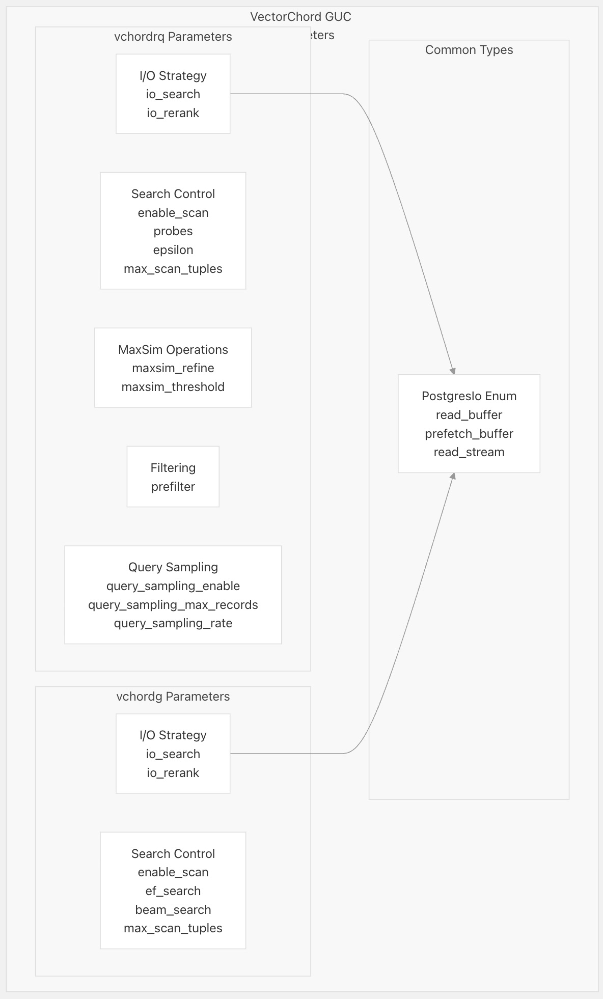
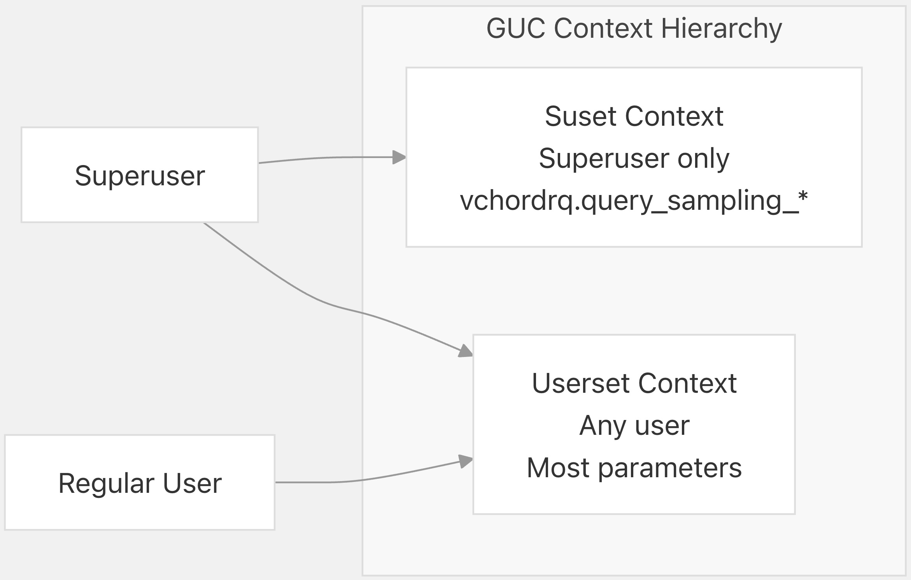
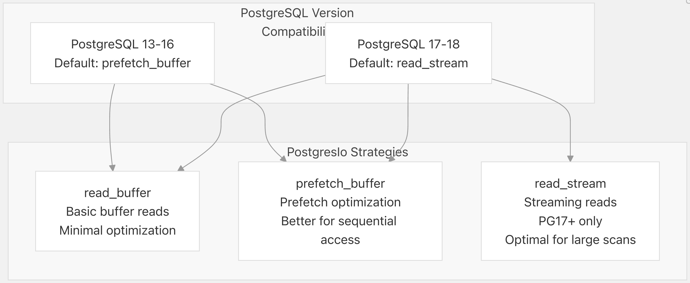
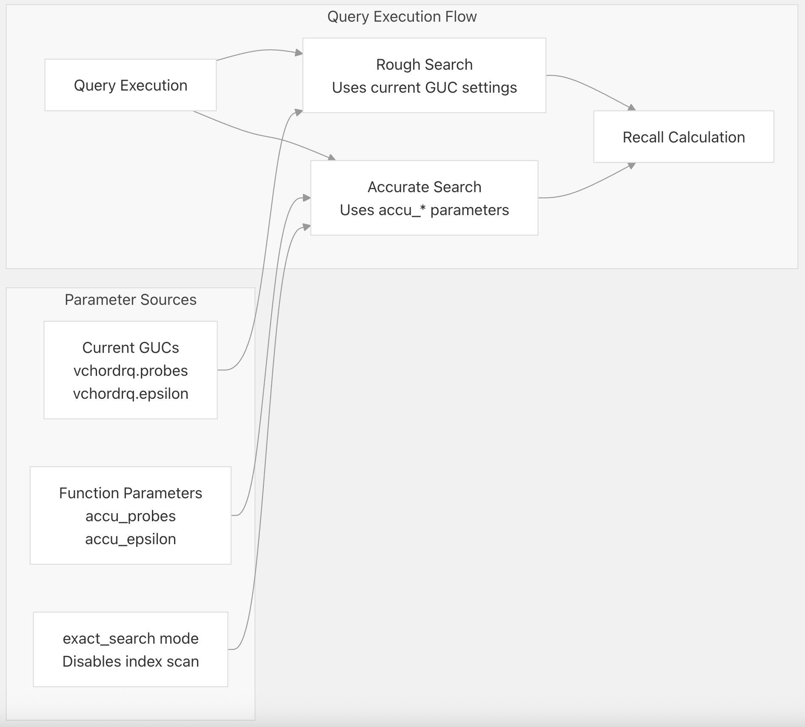

## VectorChord 源码学习: 6.2 配置参数 (Configuration Parameters)  
                                                      
### 作者                                                      
digoal                                                      
                                                      
### 日期                                                      
2025-11-02                                                      
                                                      
### 标签                                                      
VectorChord , 源码学习                                                      
                                                      
----                                                      
                                                      
## 背景           
本文介绍 **VectorChord** 中所有 **GUC (Grand Unified Configuration，统一配置)** 参数的完整参考。这些参数控制着 **vchordrq** 和 **vchordg** 索引方法的行为，包括搜索性能、**I/O (Input/Output)** 策略和查询采样功能。  
  
## 参数类别 (**Parameter Categories**)  
  
**VectorChord** 配置参数根据其功能和影响的索引方法被组织成逻辑分组。  
  
  
  
来源: [`src/index/gucs.rs` 19-84](https://github.com/tensorchord/VectorChord/blob/ac12e257/src/index/gucs.rs#L19-L84) [`src/index/gucs.rs` 86-261](https://github.com/tensorchord/VectorChord/blob/ac12e257/src/index/gucs.rs#L86-L261)  
  
## 参数上下文级别 (**Parameter Context Levels**)  
  
**VectorChord** 参数在不同的 **PostgreSQL GUC** 上下文级别 (**Context Levels**) 上运行，这决定了谁可以修改它们以及它们何时生效。  
  
| 上下文级别 (**Context Level**) | 描述 (**Description**) | 所需权限 (**Required Privileges**) | 示例参数 (**Example Parameters**) |  
| :--- | :--- | :--- | :--- |  
| `Userset` | 任何用户都可以为其会话设置 | 无 | 大多数搜索和 **I/O** 参数 |  
| `Suset` | 只能由超级用户 (**Superuser**) 设置 | 超级用户权限 (**Superuser privileges**) | 查询采样参数 |  
  
  
  
来源: [`src/index/gucs.rs` 92](https://github.com/tensorchord/VectorChord/blob/ac12e257/src/index/gucs.rs#L92-L92) [`src/index/gucs.rs` 172](https://github.com/tensorchord/VectorChord/blob/ac12e257/src/index/gucs.rs#L172-L172) [`src/index/gucs.rs` 182](https://github.com/tensorchord/VectorChord/blob/ac12e257/src/index/gucs.rs#L182-L182) [`src/index/gucs.rs` 192](https://github.com/tensorchord/VectorChord/blob/ac12e257/src/index/gucs.rs#L192-L192)  
  
## vchordrq 索引参数  
  
### 搜索控制参数 (**Search Control Parameters**)  
  
#### vchordrq.enable\_scan  
  
  * **类型 (Type)**: 布尔值 (**Boolean**)  
  * **默认 (Default)**: `true`  
  * **上下文 (Context)**: `Userset`  
  * **描述 (Description)**: 控制 **vchordrq** 索引扫描是否启用。禁用时，查询规划器 (**query planner**) 将不会对查询使用 **vchordrq** 索引。  
  
#### vchordrq.probes  
  
  * **类型 (Type)**: 字符串 (**String**) (逗号分隔的整数)  
  * **默认 (Default)**: `""` (空字符串)  
  * **上下文 (Context)**: `Userset`  
  * **描述 (Description)**: 指定搜索期间要探测的簇 (**clusters**) 数量。可以是单个整数或逗号分隔的列表，用于多级搜索。空字符串使用默认的探测策略 (**probing strategy**)。  
  * **示例 (Example)**: `"10"` 或 `"10,5"` 用于分层探测 (**hierarchical probing**)  
  
#### vchordrq.epsilon  
  
  * **类型 (Type)**: 浮点数 (**Float**)  
  * **默认 (Default)**: `1.9`  
  * **范围 (Range)**: `0.0` 到 `4.0`  
  * **上下文 (Context)**: `Userset`  
  * **描述 (Description)**: 控制搜索半径扩展因子 (**search radius expansion factor**)。较高的值会以牺牲性能为代价，通过扩大搜索区域来提高召回率 (**recall**)。  
  
#### vchordrq.max\_scan\_tuples  
  
  * **类型 (Type)**: 整数 (**Integer**)  
  * **默认 (Default)**: `-1` (无限制)  
  * **范围 (Range)**: `-1` 到 `2147483647`  
  * **上下文 (Context)**: `Userset`  
  * **描述 (Description)**: 限制搜索期间扫描的 **tuple**（元组）的最大数量。`-1` 表示没有限制。用于限制查询执行时间。  
  
来源: [`src/index/gucs.rs` 58-64](https://github.com/tensorchord/VectorChord/blob/ac12e257/src/index/gucs.rs#L58-L64) [`src/index/gucs.rs` 88-122](https://github.com/tensorchord/VectorChord/blob/ac12e257/src/index/gucs.rs#L88-L122) [`src/index/gucs.rs` 302-337](https://github.com/tensorchord/VectorChord/blob/ac12e257/src/index/gucs.rs#L302-L337)  
  
### MaxSim 操作参数 (**MaxSim Operation Parameters**)  
  
#### vchordrq.maxsim\_refine  
  
  * **类型 (Type)**: 整数 (**Integer**)  
  * **默认 (Default)**: `0`  
  * **范围 (Range)**: `0` 到 `2147483647`  
  * **上下文 (Context)**: `Userset`  
  * **描述 (Description)**: 控制向量数组上 **MaxSim** 操作的精炼 (**refinement**) 行为。较高的值可提高多向量相似性搜索的准确性。  
  
#### vchordrq.maxsim\_threshold  
  
  * **类型 (Type)**: 整数 (**Integer**)  
  * **默认 (Default)**: `0`  
  * **范围 (Range)**: `0` 到 `2147483647`  
  * **上下文 (Context)**: `Userset`  
  * **描述 (Description)**: 设置 **MaxSim** 操作优化的阈值 (**threshold**)。用于平衡搜索准确性和性能。  
  
来源: [`src/index/gucs.rs` 66-68](https://github.com/tensorchord/VectorChord/blob/ac12e257/src/index/gucs.rs#L66-L68) [`src/index/gucs.rs` 124-142](https://github.com/tensorchord/VectorChord/blob/ac12e257/src/index/gucs.rs#L124-L142) [`src/index/gucs.rs` 339-345](https://github.com/tensorchord/VectorChord/blob/ac12e257/src/index/gucs.rs#L339-L345)  
  
### 过滤参数 (**Filtering Parameters**)  
  
#### vchordrq.prefilter  
  
  * **类型 (Type)**: 布尔值 (**Boolean**)  
  * **默认 (Default)**: `false`  
  * **上下文 (Context)**: `Userset`  
  * **描述 (Description)**: 在索引扫描期间启用预过滤 (**prefiltering**) 优化。与 **WHERE** 子句结合使用时，可以通过提早过滤候选项来提高性能。  
  
来源: [`src/index/gucs.rs` 70](https://github.com/tensorchord/VectorChord/blob/ac12e257/src/index/gucs.rs#L70-L70) [`src/index/gucs.rs` 143-150](https://github.com/tensorchord/VectorChord/blob/ac12e257/src/index/gucs.rs#L143-L150) [`src/index/gucs.rs` 347-349](https://github.com/tensorchord/VectorChord/blob/ac12e257/src/index/gucs.rs#L347-L349)  
  
### I/O 策略参数 (**I/O Strategy Parameters**)  
  
#### vchordrq.io\_search  
  
  * **类型 (Type)**: 枚举 (**Enum**) (`PostgresIo`)  
  * **默认 (Default)**: `prefetch_buffer` (PG13-16), `read_stream` (PG17+)  
  * **值 (Values)**: `read_buffer`, `prefetch_buffer`, `read_stream`  
  * **上下文 (Context)**: `Userset`  
  * **描述 (Description)**: 控制索引搜索阶段的 **I/O** 策略。不同的策略针对不同的访问模式和 **PostgreSQL** 版本进行了优化。  
  
#### vchordrq.io\_rerank  
  
  * **类型 (Type)**: 枚举 (**Enum**) (`PostgresIo`)  
  * **默认 (Default)**: `prefetch_buffer` (PG13-16), `read_stream` (PG17+)  
  * **值 (Values)**: `read_buffer`, `prefetch_buffer`, `read_stream`  
  * **上下文 (Context)**: `Userset`  
  * **描述 (Description)**: 控制在重新排序 (**reranking**) 阶段（计算最终结果精炼的精确距离时）的 **I/O** 策略。  
  
来源: [`src/index/gucs.rs` 72-84](https://github.com/tensorchord/VectorChord/blob/ac12e257/src/index/gucs.rs#L72-L84) [`src/index/gucs.rs` 151-166](https://github.com/tensorchord/VectorChord/blob/ac12e257/src/index/gucs.rs#L151-L166) [`src/index/gucs.rs` 351-367](https://github.com/tensorchord/VectorChord/blob/ac12e257/src/index/gucs.rs#L351-L367)  
  
### 查询采样参数 (**Query Sampling Parameters**)  
  
#### vchordrq.query\_sampling\_enable  
  
  * **类型 (Type)**: 布尔值 (**Boolean**)  
  * **默认 (Default)**: `false`  
  * **上下文 (Context)**: `Suset` (仅限超级用户)  
  * **描述 (Description)**: 启用用于召回率评估的自动查询采样 (**query sampling**)。启用后，查询会被记录下来，供稍后使用 `vchordrq_sampled_queries` 进行分析。  
  
#### vchordrq.query\_sampling\_max\_records  
  
  * **类型 (Type)**: 整数 (**Integer**)  
  * **默认 (Default)**: `0`  
  * **范围 (Range)**: `0` 到 `10000`  
  * **上下文 (Context)**: `Suset` (仅限超级用户)  
  * **描述 (Description)**: 每个索引保留的最大查询样本数。超出此限制时，旧样本会自动删除。  
  
#### vchordrq.query\_sampling\_rate  
  
  * **类型 (Type)**: 浮点数 (**Float**)  
  * **默认 (Default)**: `0.0`  
  * **范围 (Range)**: `0.0` 到 `1.0`  
  * **上下文 (Context)**: `Suset` (仅限超级用户)  
  * **描述 (Description)**: 采样每个查询的概率 (**Probability**)（0.0 = 从不，1.0 = 总是）。用于控制采样频率，不影响查询性能。  
  
来源: [`src/index/gucs.rs` 30-34](https://github.com/tensorchord/VectorChord/blob/ac12e257/src/index/gucs.rs#L30-L34) [`src/index/gucs.rs` 167-194](https://github.com/tensorchord/VectorChord/blob/ac12e257/src/index/gucs.rs#L167-L194) [`src/index/gucs.rs` 369-379](https://github.com/tensorchord/VectorChord/blob/ac12e257/src/index/gucs.rs#L369-L379)  
  
## vchordg 索引参数  
  
### 搜索控制参数 (**Search Control Parameters**)  
  
#### vchordg.enable\_scan  
  
  * **类型 (Type)**: 布尔值 (**Boolean**)  
  * **默认 (Default)**: `true`  
  * **上下文 (Context)**: `Userset`  
  * **描述 (Description)**: 控制 **vchordg** 索引扫描是否启用。禁用时，查询规划器将不会对查询使用 **vchordg** 索引。  
  
#### vchordg.ef\_search  
  
  * **类型 (Type)**: 整数 (**Integer**)  
  * **默认 (Default)**: `64`  
  * **范围 (Range)**: `1` 到 `65535`  
  * **上下文 (Context)**: `Userset`  
  * **描述 (Description)**: 控制图遍历期间动态候选列表 (**dynamic candidate list**) 的大小。值越高，召回率 (**recall**) 越高，但搜索时间增加。类似于 **HNSW** 的 `ef` 参数。  
  
#### vchordg.beam\_search  
  
  * **类型 (Type)**: 整数 (**Integer**)  
  * **默认 (Default)**: `1`  
  * **范围 (Range)**: `1` 到 `65535`  
  * **上下文 (Context)**: `Userset`  
  * **描述 (Description)**: 控制图搜索的波束宽度 (**beam width**)。较高的值可以通过同时探索多条路径来提高召回率。  
  
#### vchordg.max\_scan\_tuples  
  
  * **类型 (Type)**: 整数 (**Integer**)  
  * **默认 (Default)**: `-1` (无限制)  
  * **范围 (Range)**: `-1` 到 `2147483647`  
  * **上下文 (Context)**: `Userset`  
  * **描述 (Description)**: 限制搜索期间扫描的 **tuple**（元组）的最大数量。`-1` 表示没有限制。用于限制查询执行时间。  
  
来源: [`src/index/gucs.rs` 36-42](https://github.com/tensorchord/VectorChord/blob/ac12e257/src/index/gucs.rs#L36-L42) [`src/index/gucs.rs` 201-238](https://github.com/tensorchord/VectorChord/blob/ac12e257/src/index/gucs.rs#L201-L238) [`src/index/gucs.rs` 263-278](https://github.com/tensorchord/VectorChord/blob/ac12e257/src/index/gucs.rs#L263-L278)  
  
### I/O 策略参数 (**I/O Strategy Parameters**)  
  
#### vchordg.io\_search  
  
  * **类型 (Type)**: 枚举 (**Enum**) (`PostgresIo`)  
  * **默认 (Default)**: `prefetch_buffer` (PG13-16), `read_stream` (PG17+)  
  * **值 (Values)**: `read_buffer`, `prefetch_buffer`, `read_stream`  
  * **上下文 (Context)**: `Userset`  
  * **描述 (Description)**: 控制图遍历期间的 **I/O** 策略。针对不同的 **PostgreSQL** 版本优化页面访问模式。  
  
#### vchordg.io\_rerank  
  
  * **类型 (Type)**: 枚举 (**Enum**) (`PostgresIo`)  
  * **默认 (Default)**: `prefetch_buffer` (PG13-16), `read_stream` (PG17+)  
  * **值 (Values)**: `read_buffer`, `prefetch_buffer`, `read_stream`  
  * **上下文 (Context)**: `Userset`  
  * **描述 (Description)**: 控制在重新排序 (**reranking**) 阶段（计算精确距离时）的 **I/O** 策略。  
  
来源: [`src/index/gucs.rs` 44-56](https://github.com/tensorchord/VectorChord/blob/ac12e257/src/index/gucs.rs#L44-L56) [`src/index/gucs.rs` 239-254](https://github.com/tensorchord/VectorChord/blob/ac12e257/src/index/gucs.rs#L239-L254) [`src/index/gucs.rs` 280-296](https://github.com/tensorchord/VectorChord/blob/ac12e257/src/index/gucs.rs#L280-L296)  
  
## I/O 策略选项 (**I/O Strategy Options**)  
  
**PostgresIo** 枚举 (**enum**) 提供了不同的 **I/O** 优化策略，可适应 **PostgreSQL** 版本功能和工作负载特性。  
  
  
  
| 策略 (**Strategy**) | 描述 (**Description**) | 最佳用例 (**Best Use Case**) | 版本支持 (**Version Support**) |  
| :--- | :--- | :--- | :--- |  
| `read_buffer` | 标准 **PostgreSQL** 缓冲区读取 | 小型索引，随机访问 (**random access**) | 所有版本 |  
| `prefetch_buffer` | 优化后的页面预取 (**prefetching**) | 顺序扫描 (**Sequential scans**)，中型索引 | 所有版本 |  
| `read_stream` | 高级流式读取 (**streaming reads**) | 大型索引，批量操作 (**bulk operations**) | PostgreSQL 17+ |  
  
来源: [`src/index/gucs.rs` 19-28](https://github.com/tensorchord/VectorChord/blob/ac12e257/src/index/gucs.rs#L19-L28) [`src/index/gucs.rs` 44-56](https://github.com/tensorchord/VectorChord/blob/ac12e257/src/index/gucs.rs#L44-L56) [`src/index/gucs.rs` 72-84](https://github.com/tensorchord/VectorChord/blob/ac12e257/src/index/gucs.rs#L72-L84)  
  
## 设置配置参数  
  
### 会话级别配置 (**Session-Level Configuration**)  
  
参数可以使用 `SET` 命令为当前会话设置：  
  
```sql  
-- Enable index scans  
SET vchordrq.enable_scan = true;  
  
-- Configure search parameters  
SET vchordrq.probes = '10,5';  
SET vchordrq.epsilon = 1.5;  
  
-- Set I/O strategy  
SET vchordrq.io_search = 'prefetch_buffer';  
```  
  
### 系统级别配置 (**System-Level Configuration**)  
  
仅限超级用户的参数必须使用 `ALTER SYSTEM` 在系统级别设置：  
  
```sql  
-- Enable query sampling (requires superuser)  
ALTER SYSTEM SET vchordrq.query_sampling_enable = on;  
ALTER SYSTEM SET vchordrq.query_sampling_max_records = 1000;  
ALTER SYSTEM SET vchordrq.query_sampling_rate = 0.1;  
  
-- Reload configuration  
SELECT pg_reload_conf();  
```  
  
### 查看当前值  
  
当前参数值可以使用 `SHOW` 查看：  
  
```sql  
SHOW vchordrq.epsilon;  
SHOW vchordg.ef_search;  
SHOW ALL; -- Shows all GUC parameters including VectorChord ones  
```  
  
来源: [`tests/vchordrq/recall.slt` 12-24](https://github.com/tensorchord/VectorChord/blob/ac12e257/tests/vchordrq/recall.slt#L12-L24) [`tests/vchordrq/recall.slt` 66-76](https://github.com/tensorchord/VectorChord/blob/ac12e257/tests/vchordrq/recall.slt#L66-L76) [`tests/vchordrq/recall.slt` 51-53](https://github.com/tensorchord/VectorChord/blob/ac12e257/tests/vchordrq/recall.slt#L51-L53)  
  
## 参数与查询评估的交互  
  
`vchordrq_evaluate_query_recall` 函数演示了配置参数如何影响查询行为：  
  
  
  
```sql  
-- Example showing vchordrq.epsilon affecting recall  
-- 示例展示 vchordrq.epsilon 如何影响召回率  
SELECT * FROM vchordrq_evaluate_query_recall('my_index_name', 10, 'vchordrq.epsilon=2.5');  
```  
  
来源: [`src/sql/finalize.sql` 230-301](https://github.com/tensorchord/VectorChord/blob/ac12e257/src/sql/finalize.sql#L230-L301) [`tests/vchordrq/recall.slt` 36-43](https://github.com/tensorchord/VectorChord/blob/ac12e257/tests/vchordrq/recall.slt#L36-L43)  
    
# 附录1: 在使用 vchordrq 索引方法时, 如果索引使用了多层结构, 查询参数 vchordrq.probes 的层级配置是否需要与创建索引时指定的层级匹配  
**是的, 必须严格匹配。** `vchordrq.probes` 参数中指定的层级数量必须与索引创建时的层级结构完全一致, 否则会导致运行时错误。   
  
### 层级匹配验证  
  
在查询执行时,系统会验证 `probes` 参数的层级数是否与索引的 `height_of_root` 匹配.    
  
如果不匹配, 会抛出 panic 错误,提示需要的 probes 数量与提供的不符。   
  
### 创建索引时定义层级  
  
在创建索引时, 通过 `lists` 参数定义多层结构:    
  
**示例:**  
```sql  
-- 单层索引 (lists = [1000])  
CREATE INDEX idx ON table USING vchordrq (column vector_l2_ops)  
WITH (options = $toml$  
[build.internal]  
lists = [1000]  
$toml$);  
  
-- 两层索引 (lists = [100, 1000])  
CREATE INDEX idx ON table USING vchordrq (column vector_l2_ops)  
WITH (options = $toml$  
[build.internal]  
lists = [100, 1000]  
$toml$);  
```  
   
  
### 查询时配置 probes  
  
`vchordrq.probes` 参数是一个逗号分隔的字符串,每个值对应一个层级:    
  
**示例:**  
```sql  
-- 对于单层索引 (lists = [1000])  
SET vchordrq.probes = '10';  -- 探测 10 个分区  
  
-- 对于两层索引 (lists = [100, 1000])  
SET vchordrq.probes = '5,20';  -- 第一层探测 5 个,第二层探测 20 个  
  
-- 查询  
SELECT * FROM table ORDER BY column <-> '[...]' LIMIT 10;  
```  
  
### 错误示例  
  
如果层级不匹配,会在查询时报错:    
```  
statement error Error executing ANN query (.+) need 0 probes, but 1 probes provided  
SELECT * from vchordrq_evaluate_query_recall(query=>$$SELECT ctid FROM t ORDER BY val <-> '[0.5, 0.25, 1.0]' LIMIT 10$$);  
```  
  
这个测试用例展示了当索引需要 0 层 probes(单层默认结构)但提供了 1 层 probes 时的错误。   
  
## Notes  
  
- `lists` 参数必须是升序排列的, 最多支持 8 层。   
- 空字符串 `''` 表示使用默认的单层结构(无需额外 probes)。    
- 在 `vchordrq_evaluate_query_recall` 函数中, 系统会自动根据当前 probes 配置推断高精度查询的 probes 设置。   
  
# 附录2: 如何控制 `vchordrq` 索引的 rerank 策略? 从索引本身进行 rerank 还是从 heap 表进行 rerank?   
  
rerank 策略通过索引创建时的 `rerank_in_table` 选项控制, 该选项存储在索引的 `MetaTuple` 元数据中。   
  
### 配置方式  
  
在创建索引时,通过 TOML 配置指定 `rerank_in_table` 参数:   
  
```sql  
-- 从索引进行 rerank (默认行为)  
CREATE INDEX idx ON table USING vchordrq (column vector_l2_ops)  
WITH (options = $toml$  
rerank_in_table = false  
$toml$);  
  
-- 从 heap 表进行 rerank  
CREATE INDEX idx ON table USING vchordrq (column vector_l2_ops)  
WITH (options = $toml$  
rerank_in_table = true  
$toml$);  
```  
  
默认值为 `false`,即从索引进行 rerank。    
  
### 运行时行为  
  
在查询执行时,系统通过 `how()` 函数读取 `MetaTuple` 中的 `rerank_in_heap` 标志来决定使用哪种策略:    
  
- **`RerankMethod::Index`**: 从索引中读取量化后的向量进行精确距离计算    
- **`RerankMethod::Heap`**: 从 heap 表中读取原始向量进行精确距离计算    
  
### 两种策略的区别  
  
**从索引 rerank (`RerankMethod::Index`)**:  
- 使用索引中存储的量化向量进行精确计算   
- 通过 `rerank_index()` 函数实现, 调用 `vectors::read()` 从索引页读取向量数据    
- 性能更好, 因为避免了访问 heap 表  
  
**从 heap 表 rerank (`RerankMethod::Heap`)**:  
- 使用 heap 表中的原始向量进行精确计算   
- 通过 `rerank_heap()` 函数实现,使用 `fetcher.fetch()` 从 heap 表获取原始向量    
- 精度可能更高(如果使用了有损量化),但性能较差   
  
### 注意事项  
  
- MaxSim 搜索不支持 `rerank_in_table = true`,会报错    
- 该配置在索引创建时确定,无法在查询时动态修改   
- 两种策略都支持 prefilter 功能和不同的 I/O 策略(`Io::Plain`、`Io::Simple`、`Io::Stream`)    
  
## Notes  
  
`rerank_in_table` 选项在 `VchordrqIndexOptions` 结构体中定义,是索引构建时的配置参数之一。该选项会被写入索引的 `MetaTuple` 元数据中,并在每次查询时通过 `how()` 函数读取以决定 rerank 策略。    
  
    
  
#### [期望 PostgreSQL|开源PolarDB 增加什么功能?](https://github.com/digoal/blog/issues/76 "269ac3d1c492e938c0191101c7238216")
  
  
#### [PolarDB 开源数据库](https://openpolardb.com/home "57258f76c37864c6e6d23383d05714ea")
  
  
#### [PolarDB 学习图谱](https://www.aliyun.com/database/openpolardb/activity "8642f60e04ed0c814bf9cb9677976bd4")
  
  
#### [PostgreSQL 解决方案集合](../201706/20170601_02.md "40cff096e9ed7122c512b35d8561d9c8")
  
  
#### [德哥 / digoal's Github - 公益是一辈子的事.](https://github.com/digoal/blog/blob/master/README.md "22709685feb7cab07d30f30387f0a9ae")
  
  
#### [About 德哥](https://github.com/digoal/blog/blob/master/me/readme.md "a37735981e7704886ffd590565582dd0")
  
  

  
