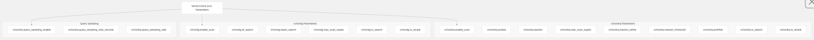
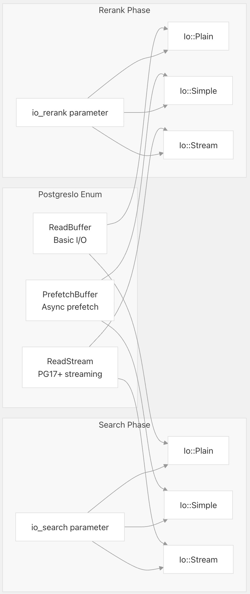
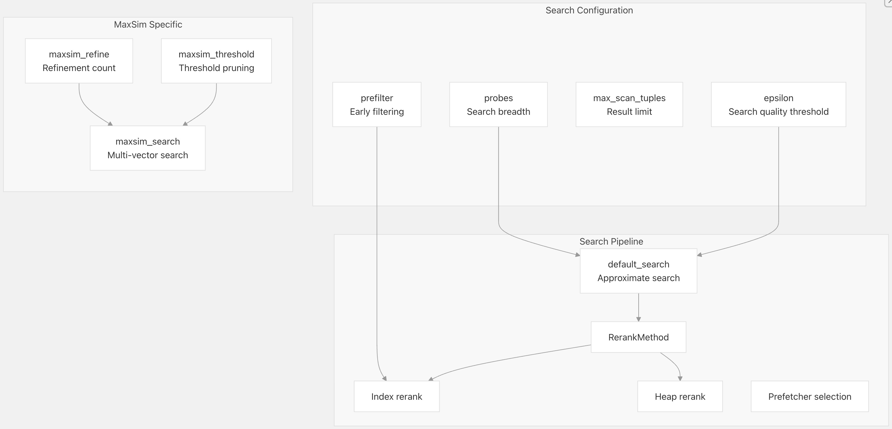
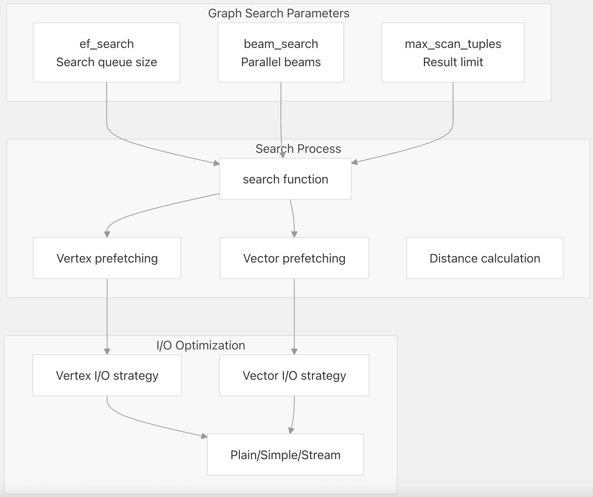
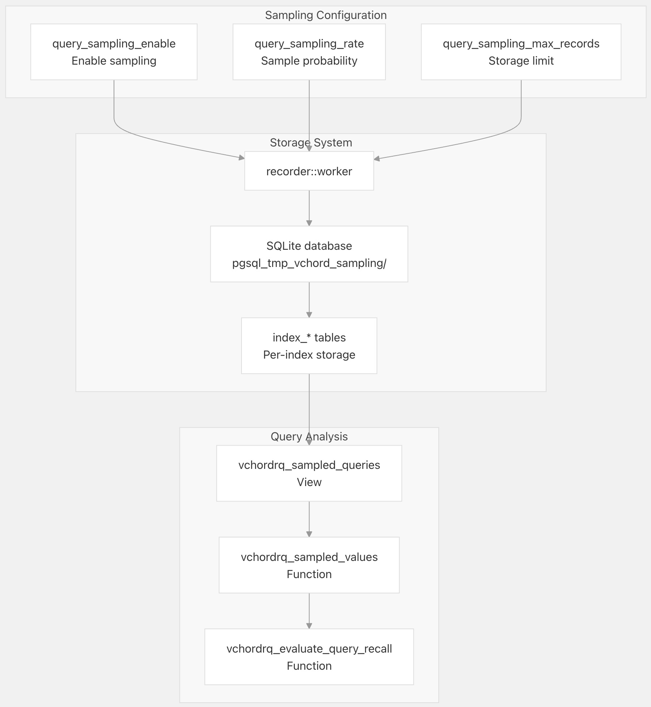
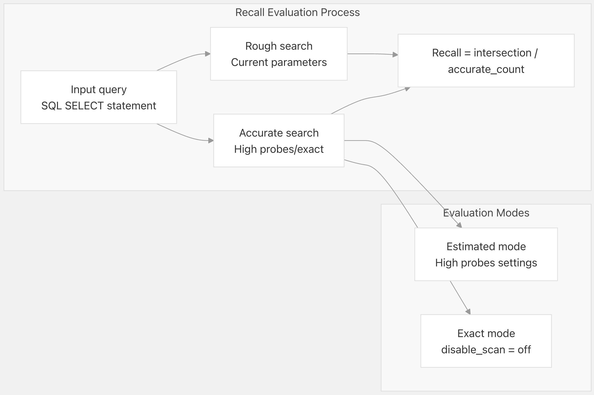
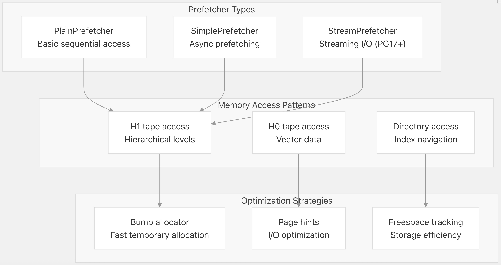

## VectorChord 源码学习: 6.3 Performance Tuning (性能调优)   
                                                        
### 作者                                                        
digoal                                                        
                                                        
### 日期                                                        
2025-11-02                                                        
                                                        
### 标签                                                        
VectorChord , 源码学习                                                        
                                                        
----                                                        
                                                        
## 背景             
本文介绍 **VectorChord** 的性能优化策略，包括 **配置参数**（`Configuration Parameters`）、**I/O 策略**（`I/O Strategies`）、**搜索算法**（`Search Algorithms`）和 **监控工具**（`Monitoring Tools`）。  
  
## Configuration Parameter Hierarchy (配置参数层级结构)  
  
**VectorChord** 提供了按 **索引方法**（`index method`）和 **功能区域**（`functionality area`）组织的广泛调优参数。这些参数控制着搜索行为、I/O 策略和系统限制。  
  
  
  
**来源:** [`src/index/gucs.rs` 86-261](https://github.com/tensorchord/VectorChord/blob/ac12e257/src/index/gucs.rs#L86-L261)  
  
## I/O Strategy Selection (I/O 策略选择)  
  
**VectorChord** 支持多种 I/O 策略，可适应不同的 **PostgreSQL** 版本和 **工作负载特征**（`workload characteristics`）。该策略独立影响搜索（`search`）和重排（`rerank`）两个阶段。  
  
  
  
### I/O Strategy Configuration (I/O 策略配置)  
  
| Strategy (策略) | PostgreSQL Versions (PostgreSQL 版本) | Use Case (用例) | Performance Characteristics (性能特征) |  
| :--- | :--- | :--- | :--- |  
| `read_buffer` | 所有 | 单线程，简单工作负载 | 最低的开销（`overhead`），基本的 I/O |  
| `prefetch_buffer` | 所有 (PG13-16 默认) | 多线程，中等数据集 | **异步预取**（`Asynchronous prefetching`） |  
| `read_stream` | PG17+ (PG17+ 默认) | 大型数据集，**流式传输**（`streaming`） | 优化的流式 I/O |  
  
**来源:** [`src/index/gucs.rs` 19-28](https://github.com/tensorchord/VectorChord/blob/ac12e257/src/index/gucs.rs#L19-L28) [`src/index/gucs.rs` 44-84](https://github.com/tensorchord/VectorChord/blob/ac12e257/src/index/gucs.rs#L44-L84)  
  
## vchordrq Search Optimization (vchordrq 搜索优化)  
  
`vchordrq` 索引方法提供了基于 **残差量化**（`residual quantization`）的搜索，具有多个调优参数，用于平衡 **准确性**（`accuracy`）和 **性能**（`performance`）。  
  
  
  
### Key vchordrq Parameters (关键 vchordrq 参数)  
  
| Parameter (参数) | Type (类型) | Range (范围) | Default (默认值) | Impact (影响) |  
| :--- | :--- | :--- | :--- | :--- |  
| `probes` | string | "1,2,3" 或 "10" | "" | **搜索广度**（`Search breadth`）—— 越高 = 越准确，越慢 |  
| `epsilon` | float | 0.0-4.0 | 1.9 | **质量阈值**（`Quality threshold`）—— 越低 = 越准确 |  
| `max_scan_tuples` | int | -1 to MAX | -1 | **结果限制**（`Result limit`）—— -1 = 无限制 |  
| `prefilter` | bool | true/false | false | 启用 **早期元组过滤**（`early tuple filtering`） |  
| `maxsim_refine` | int | 0 to MAX | 0 | **MaxSim 优化迭代**（`refinement iterations`）次数 |  
  
**来源:** [`src/index/gucs.rs` 58-71](https://github.com/tensorchord/VectorChord/blob/ac12e257/src/index/gucs.rs#L58-L71) [`src/index/vchordrq/scanners/default.rs` 131-159](https://github.com/tensorchord/VectorChord/blob/ac12e257/src/index/vchordrq/scanners/default.rs#L131-L159)  
  
## vchordg Search Optimization (vchordg 搜索优化)  
  
`vchordg` 索引方法使用基于图（`graph-based`）的搜索，采用类似 **HNSW** 的算法，提供专注于 **图遍历**（`graph traversal`）的不同调优参数。  
  
  
  
### Key vchordg Parameters (关键 vchordg 参数)  
  
| Parameter (参数) | Type (类型) | Range (范围) | Default (默认值) | Impact (影响) |  
| :--- | :--- | :--- | :--- | :--- |  
| `ef_search` | int | 1-65535 | 64 | **搜索队列大小**（`Search queue size`）—— 越高 = 越准确，占用内存越多 |  
| `beam_search` | int | 1-65535 | 1 | **并行搜索束**（`Parallel search beams`）—— 越高 = 在大型图上速度越快 |  
| `max_scan_tuples` | int | -1 to MAX | -1 | 结果限制（`Result limit`）—— -1 = 无限制 |  
  
**来源:** [`src/index/gucs.rs` 36-43](https://github.com/tensorchord/VectorChord/blob/ac12e257/src/index/gucs.rs#L36-L43) [`src/index/vchordg/scanners/default.rs` 135-217](https://github.com/tensorchord/VectorChord/blob/ac12e257/src/index/vchordg/scanners/default.rs#L135-L217)  
  
## Query Sampling and Performance Monitoring (查询采样与性能监控)  
  
**VectorChord** 包含一个 **查询采样系统**（`query sampling system`），用于 **性能分析**（`performance analysis`）和 **召回率评估**。该系统自动捕获有代表性的查询，供后续分析。  
  
  
  
### Sampling Configuration (采样配置)  
  
查询采样系统在 **超级用户**（`superuser`）级别运行，并将样本存储在 **SQLite 数据库**（`SQLite databases`）中进行分析：  
  
* **启用采样**: 设置 `vchordrq.query_sampling_enable = on` (需要超级用户权限)  
* **采样率**: 设置 `vchordrq.query_sampling_rate`，范围在 0.0-1.0 之间  
* **存储限制**: 设置 `vchordrq.query_sampling_max_records` (每个索引 0-10000 个样本)  
  
**来源:** [`src/index/gucs.rs` 167-194](https://github.com/tensorchord/VectorChord/blob/ac12e257/src/index/gucs.rs#L167-L194) [`src/recorder/worker.rs` 74-105](https://github.com/tensorchord/VectorChord/blob/ac12e257/src/recorder/worker.rs#L74-L105)  
  
## Recall Evaluation and Quality Metrics (召回率评估与质量指标)  
  
**VectorChord** 提供内置的 **召回率评估**（`recall evaluation`），用于衡量搜索质量与 **基准结果**（`ground truth results`）的对比。  
  
  
  
### Recall Evaluation Usage (召回率评估用法)  
  
`vchordrq_evaluate_query_recall` 函数将 **近似搜索结果**（`approximate search results`）与更准确的基线（`baselines`）进行比较：  
  
```  
-- Evaluate recall for a specific query  
SELECT vchordrq_evaluate_query_recall(  
    query => 'SELECT ctid FROM table ORDER BY vector <-> ''[1,2,3]'' LIMIT 10',  
    exact_search => false,  -- Use high-accuracy approximate search  
    accu_probes => '65535', -- Override probes for ground truth  
    accu_epsilon => 1.9     -- Override epsilon for ground truth  
);  
  
-- Evaluate against exact search (slower but most accurate)  
SELECT vchordrq_evaluate_query_recall(  
    query => 'SELECT ctid FROM table ORDER BY vector <-> ''[1,2,3]'' LIMIT 10',  
    exact_search => true    -- Disable index scan for exact results  
);  
```  
  
**来源:** [`src/sql/finalize.sql` 230-301](https://github.com/tensorchord/VectorChord/blob/ac12e257/src/sql/finalize.sql#L230-L301) [`tests/vchordrq/recall.slt` 35-48](https://github.com/tensorchord/VectorChord/blob/ac12e257/tests/vchordrq/recall.slt#L35-L48)  
  
## Memory Management and Prefetching (内存管理与预取)  
  
**VectorChord** 实现了复杂的 **预取策略**（`prefetching strategies`），以优化内存访问模式并减少 I/O 延迟（`I/O latency`）。  
  
  
  
### Prefetching Configuration (预取配置)  
  
不同的预取策略会根据 I/O 配置自动选择：  
  
| I/O Strategy (I/O 策略) | Prefetcher Type (预取器类型) | Characteristics (特征) |  
| :--- | :--- | :--- |  
| `Io::Plain` | `PlainPrefetcher` | 顺序访问（`Sequential access`），最小开销 |  
| `Io::Simple` | `SimplePrefetcher` | 异步预取，更适合随机访问（`random access`） |  
| `Io::Stream` | `StreamPrefetcher` | 带提示的流式 I/O，最适合大型扫描（`large scans`） |  
  
**来源:** [`src/index/vchordrq/scanners/default.rs` 113-119](https://github.com/tensorchord/VectorChord/blob/ac12e257/src/index/vchordrq/scanners/default.rs#L113-L119) [`src/index/vchordg/scanners/default.rs` 110-121](https://github.com/tensorchord/VectorChord/blob/ac12e257/src/index/vchordg/scanners/default.rs#L110-L121)  
  
## Performance Monitoring Functions (性能监控函数)  
  
**VectorChord** 提供了用于性能监控和索引维护的多个函数。  
  
### Prewarming Functions (预热函数)  
```  
-- Prewarm vchordrq index pages into buffer cache  
SELECT vchordrq_prewarm('index_name');  
SELECT vchordrq_prewarm('index_name', 0); -- Prewarm level 0 only  
  
-- Prewarm vchordg index pages  
SELECT vchordg_prewarm('index_name');  
```  
  
### Query Sampling Views (查询采样视图)  
```  
-- View all sampled queries across all indexes  
SELECT * FROM vchordrq_sampled_queries;  
  
-- Get sampled values for specific index  
SELECT * FROM vchordrq_sampled_values('index_name');  
  
-- Evaluate recall for all sampled queries  
SELECT AVG(recall_value) FROM (  
    SELECT vchordrq_evaluate_query_recall(  
        query => format('SELECT ctid FROM %I.%I ORDER BY %I OPERATOR(%s) %L LIMIT 10',  
                       schema_name, table_name, column_name, operator, value)  
    ) AS recall_value  
    FROM vchordrq_sampled_queries('index_name')  
) AS eval_results;  
```  
  
**来源:** [`src/sql/finalize.sql` 227-229](https://github.com/tensorchord/VectorChord/blob/ac12e257/src/sql/finalize.sql#L227-L229) [`src/sql/finalize.sql` 145-222](https://github.com/tensorchord/VectorChord/blob/ac12e257/src/sql/finalize.sql#L145-L222) [`tests/vchordrq/recall.slt` 112-129](https://github.com/tensorchord/VectorChord/blob/ac12e257/tests/vchordrq/recall.slt#L112-L129)  
        
  
#### [期望 PostgreSQL|开源PolarDB 增加什么功能?](https://github.com/digoal/blog/issues/76 "269ac3d1c492e938c0191101c7238216")
  
  
#### [PolarDB 开源数据库](https://openpolardb.com/home "57258f76c37864c6e6d23383d05714ea")
  
  
#### [PolarDB 学习图谱](https://www.aliyun.com/database/openpolardb/activity "8642f60e04ed0c814bf9cb9677976bd4")
  
  
#### [PostgreSQL 解决方案集合](../201706/20170601_02.md "40cff096e9ed7122c512b35d8561d9c8")
  
  
#### [德哥 / digoal's Github - 公益是一辈子的事.](https://github.com/digoal/blog/blob/master/README.md "22709685feb7cab07d30f30387f0a9ae")
  
  
#### [About 德哥](https://github.com/digoal/blog/blob/master/me/readme.md "a37735981e7704886ffd590565582dd0")
  
  

  
