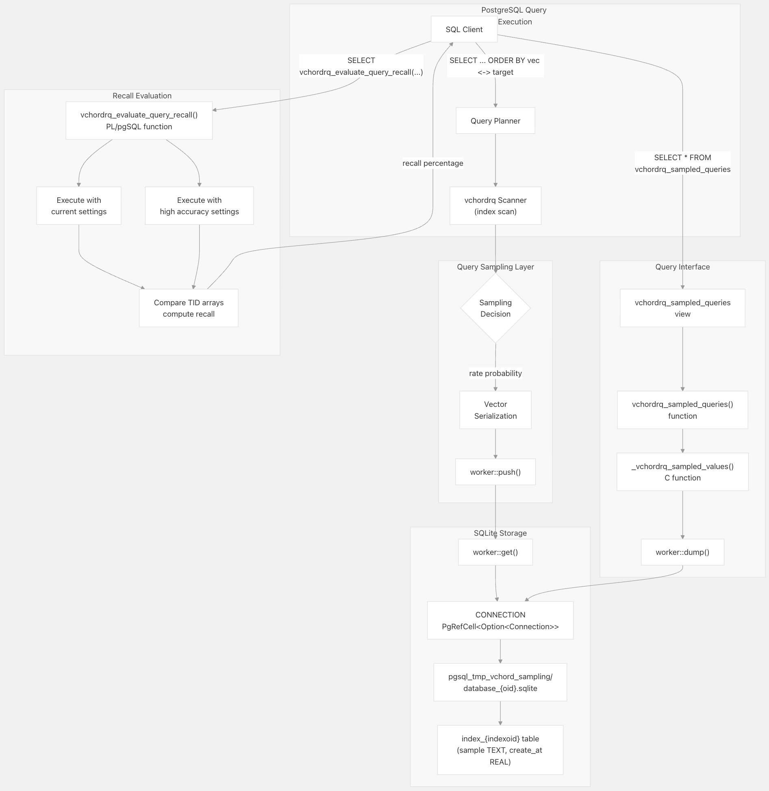
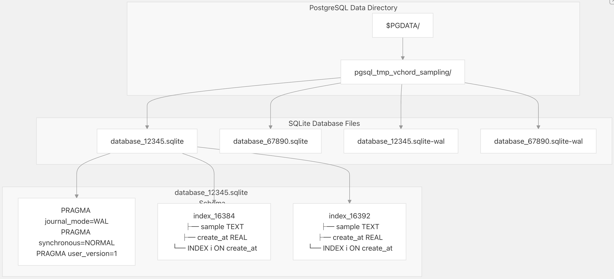
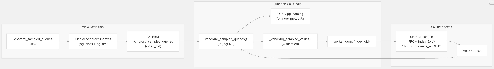
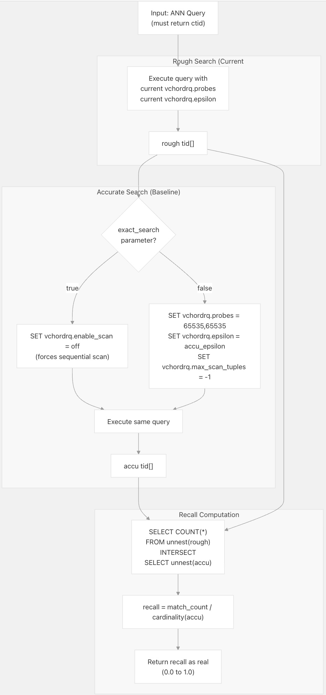
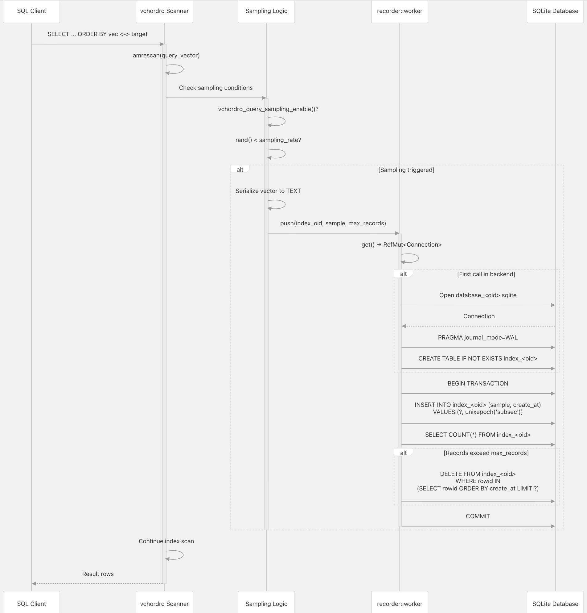

## VectorChord 源码学习: 6.4 查询采样与召回率评估 (Query Sampling and Recall Evaluation)  
                                                          
### 作者                                                          
digoal                                                          
                                                          
### 日期                                                          
2025-11-02                                                          
                                                          
### 标签                                                          
VectorChord , 源码学习                                                          
                                                          
----                                                          
                                                          
## 背景               
本文介绍 **VectorChord** 的查询采样子系统 (**query sampling subsystem**)，该系统捕获针对 **vchordrq** 索引执行的实际向量相似性查询 (**vector similarity queries**)，用于离线分析和召回率评估 (**recall evaluation**)。此功能使数据库管理员能够：  
  
  * 监控在生产工作负载 (**production workloads**) 中正在搜索哪些查询向量 (**query vectors**)  
  * 根据真实的生产查询评估索引召回率的准确性 (**index recall accuracy**)  
  * 根据测得的召回率调整索引参数（`probes`，`epsilon`）  
  * 通过查询模式分析识别性能瓶颈 (**performance bottlenecks**)  
  
查询采样仅适用于 **vchordrq** 索引方法。  
  
**来源**: [`src/sql/finalize.sql` 145-301](https://github.com/tensorchord/VectorChord/blob/ac12e257/src/sql/finalize.sql#L145-L301) [`src/index/gucs.rs` 30-34](https://github.com/tensorchord/VectorChord/blob/ac12e257/src/index/gucs.rs#L30-L34)  
  
## 系统概述 (**System Overview**)  
  
**VectorChord** 的查询采样系统作为一个概率采样层 (**probabilistic sampling layer**) 运行，集成在 **vchordrq** 索引扫描器 (**index scanner**) 中。启用后，它会将查询向量捕获到一个存储在 **PostgreSQL** 数据目录中的 **SQLite** 数据库。  
  
  
  
**来源**: [`src/recorder/worker.rs` 24-72](https://github.com/tensorchord/VectorChord/blob/ac12e257/src/recorder/worker.rs#L24-L72) [`src/index/functions.rs` 90-110](https://github.com/tensorchord/VectorChord/blob/ac12e257/src/index/functions.rs#L90-L110) [`src/sql/finalize.sql` 148-222](https://github.com/tensorchord/VectorChord/blob/ac12e257/src/sql/finalize.sql#L148-L222) [`src/sql/finalize.sql` 230-301](https://github.com/tensorchord/VectorChord/blob/ac12e257/src/sql/finalize.sql#L230-L301)  
  
## 配置参数 (**Configuration Parameters**)  
  
查询采样由三个 **GUC** 参数控制，所有参数都需要超级用户权限（`GucContext::Suset`）：  
  
| 参数 (**Parameter**) | 类型 (**Type**) | 默认值 (**Default**) | 范围 (**Range**) | 描述 (**Description**) |  
| :--- | :--- | :--- | :--- | :--- |  
| `vchordrq.query_sampling_enable` | boolean | `false` | - | 启用/禁用查询采样的主开关 (**Master switch**) |  
| `vchordrq.query_sampling_rate` | float | `0.0` | `0.0` to `1.0` | 采样每个查询的概率（0=从不，1=总是） |  
| `vchordrq.query_sampling_max_records` | integer | `0` | `0` to `10000` | 每个索引保留的最大查询记录数 |  
  
这些参数必须在 `postgresql.conf` 中或通过 `ALTER SYSTEM` 设置，然后执行 `pg_reload_conf()`：  
  
```  
ALTER SYSTEM SET vchordrq.query_sampling_enable = on;  
ALTER SYSTEM SET vchordrq.query_sampling_rate = 0.1;  -- Sample 10% of queries  
ALTER SYSTEM SET vchordrq.query_sampling_max_records = 1000;  
SELECT pg_reload_conf();  
```  
  
`max_records` 参数实现了自动清理 (**automatic cleanup**): 当超过限制时，最旧的采样查询将被删除，以维持配置的最大值。  
  
**来源**: [`src/index/gucs.rs` 30-34](https://github.com/tensorchord/VectorChord/blob/ac12e257/src/index/gucs.rs#L30-L34) [`src/index/gucs.rs` 167-194](https://github.com/tensorchord/VectorChord/blob/ac12e257/src/index/gucs.rs#L167-L194) [`src/index/gucs.rs` 369-379](https://github.com/tensorchord/VectorChord/blob/ac12e257/src/index/gucs.rs#L369-L379)  
  
## 存储架构 (**Storage Architecture**)  
  
查询样本存储在 **PostgreSQL** 数据目录中每个数据库对应的 **SQLite** 文件中。  
  
  
  
**目录结构 (Directory Structure)**：  
  
  * **位置**: `pgsql_tmp_vchord_sampling/` (以 `pgsql_tmp` 前缀命名，以便从 `pg_basebackup` 中排除)  
  * **数据库文件**: `database_{database_oid}.sqlite` (每个 **PostgreSQL** 数据库一个)  
  * **表模式**: `index_{index_oid}` (每个 **vchordrq** 索引一个表)  
  
**Schema 详情**:  
  
  * `sample TEXT`: **PostgreSQL** 数组格式的序列化向量 (**Serialized vector**) (例如，`[0.5,0.25,1.0]`)  
  * `create_at REAL`: 具有亚秒级精度 (**subsecond precision**) 的 **Unix** 时间戳  
  * 在 `create_at` 上创建索引，用于高效的 **FIFO** 维护  
  
**连接管理 (Connection Management)**：  
  
  * 每个后端 (**Per-backend**) 连接存储在 `CONNECTION: PgRefCell<Option<rusqlite::Connection>>` 中  
  * 在首次查询时进行**惰性初始化** (**Lazy initialization**)  
  * **WAL mode** (预写日志模式) 用于并发读取器 (**concurrent readers**)  
  * 在版本不匹配或数据损坏时自动清理 (**Automatic cleanup**)  
  
**来源**: [`src/recorder/worker.rs` 20-72](https://github.com/tensorchord/VectorChord/blob/ac12e257/src/recorder/worker.rs#L20-L72) [`src/recorder/worker.rs` 79-84](https://github.com/tensorchord/VectorChord/blob/ac12e257/src/recorder/worker.rs#L79-L84)  
  
## 访问采样查询 (**Accessing Sampled Queries**)  
  
**VectorChord** 提供了两种检索采样查询的接口 (**interfaces**):  
  
### `vchordrq_sampled_queries` 视图 (**View**)  
  
一个系统级视图 (**system-wide view**)，返回当前数据库中所有 **vchordrq** 索引的采样查询：  
  
```  
SELECT * FROM vchordrq_sampled_queries;  
```  
  
**列 (Columns)**：  
  
  * `schema_name`: 包含索引的模式 (**Schema**)  
  * `index_name`: **vchordrq** 索引的名称  
  * `table_name`: 基础表名称 (**Base table name**)  
  * `column_name`: 向量列名称（**Vector column name**），对于表达式索引 (**expression indexes**) 则为 **NULL**  
  * `operator`: 使用的距离运算符 (**Distance operator**)（`<->`，`<#>`，`<=>`）  
  * `value`: 作为 **TEXT** 的采样查询向量 (**Sampled query vector**)  
  
  
  
**来源**: [`src/sql/finalize.sql` 417-434](https://github.com/tensorchord/VectorChord/blob/ac12e257/src/sql/finalize.sql#L417-L434)  
  
### `vchordrq_sampled_queries(regclass)` 函数 (**Function**)  
  
一个为特定索引返回采样查询的函数：  
  
```  
SELECT * FROM vchordrq_sampled_queries('my_index_name');  
```  
  
此函数执行访问控制检查 (**access control checks**) 并通过内部的 `_vchordrq_sampled_values()` 函数查询 **SQLite** 数据库。  
  
**来源**: [`src/sql/finalize.sql` 148-222](https://github.com/tensorchord/VectorChord/blob/ac12e257/src/sql/finalize.sql#L148-L222) [`src/index/functions.rs` 90-110](https://github.com/tensorchord/VectorChord/blob/ac12e257/src/index/functions.rs#L90-L110)  
  
## 召回率评估 (**Recall Evaluation**)  
  
`vchordrq_evaluate_query_recall()` 函数通过将近似搜索结果 (**approximate search results**) 与基准事实 (**ground truth baseline**) 进行比较来衡量索引召回率 (**index recall**)。  
  
### 函数签名 (**Function Signature**)  
```  
vchordrq_evaluate_query_recall(  
    query text,                      -- ANN query returning ctid column  
    exact_search boolean DEFAULT false,  
    accu_probes TEXT DEFAULT NULL,   -- Probes for accurate baseline  
    accu_epsilon real DEFAULT 1.9    -- Epsilon for accurate baseline  
) RETURNS real  
```  
  
### 召回率计算算法 (**Recall Calculation Algorithm**)  
  
  
  
### 参数 (**Parameters**)  
  
| 参数 (**Parameter**) | 目的 (**Purpose**) |  
| :--- | :--- |  
| `query` | 返回 `ctid` 列的 **SQL** 查询。必须使用 **vchordrq** 索引。 |  
| `exact_search` | 如果为 `true`，则禁用用于基准事实的索引扫描（**index scan**）（强制进行顺序扫描 (**sequential scan**) 以获取 100% 召回率基准）。 |  
| `accu_probes` | 覆盖 (**Override**) `vchordrq.probes` 以获得准确的基准 (**accurate baseline**)。默认值：多级索引 (**multi-level indexes**) 为 `65535,65535`。 |  
| `accu_epsilon` | 覆盖 (**Override**) `vchordrq.epsilon` 以获得准确的基准。默认值：`1.9`。 |  
  
### 返回值 (**Return Value**)  
  
返回一个介于 `0.0` 和 `1.0` 之间的 `real` 值，表示召回率百分比 (**recall percentage**)。如果准确搜索返回零结果 (**zero results**)，则返回 `NaN`。  
  
### 限制 (**Limitations**)  
  
  * **查询必须返回 `ctid`**: 该函数需要**元组标识符** (**tuple identifiers**) 进行比较。  
  * **MaxSim 运算符**: 不能用于估计召回率（`exact_search => false`）。必须使用 `exact_search => true`。  
  * **探针验证 (Probes validation)**: 该函数验证粗略搜索探针 (**rough search probes**) 是否与准确搜索探针的配置匹配。  
  
**来源**: [`src/sql/finalize.sql` 230-301](https://github.com/tensorchord/VectorChord/blob/ac12e257/src/sql/finalize.sql#L230-L301)  
  
## 使用示例 (**Usage Examples**)  
  
### 示例 1：启用采样并收集查询 (**Enable Sampling and Collect Queries**)  
  
```  
-- Enable query sampling (requires superuser)  
ALTER SYSTEM SET vchordrq.query_sampling_enable = on;  
ALTER SYSTEM SET vchordrq.query_sampling_rate = 0.1;  -- 10% sampling rate  
ALTER SYSTEM SET vchordrq.query_sampling_max_records = 500;  
SELECT pg_reload_conf();  
  
-- Execute some queries (sampled probabilistically)  
SELECT * FROM documents   
ORDER BY embedding <-> '[0.1, 0.2, 0.3]'::vector   
LIMIT 10;  
  
-- View sampled queries  
SELECT * FROM vchordrq_sampled_queries   
WHERE index_name = 'documents_embedding_idx';  
```  
  
### 示例 2：批量召回率评估 (**Batch Recall Evaluation**)  
  
```  
-- Evaluate recall for all sampled queries on an index  
SELECT   
    value AS query_vector,  
    vchordrq_evaluate_query_recall(  
        query => format(  
            'SELECT ctid FROM %I.%I ORDER BY %I <-> %L LIMIT 10',  
            schema_name,  
            table_name,  
            column_name,  
            value  
        )  
    ) AS recall  
FROM vchordrq_sampled_queries('my_index')  
ORDER BY recall ASC  
LIMIT 10;  -- Show 10 worst-performing queries  
```  
  
### 示例 3：与精确搜索进行比较 (**Compare Against Exact Search**)  
  
```  
-- Measure recall against exact sequential scan  
SELECT   
    vchordrq_evaluate_query_recall(  
        query => $$  
            SELECT ctid FROM my_table   
            ORDER BY vec <-> '[1.0, 2.0, 3.0]'   
            LIMIT 100  
        $$,  
        exact_search => true  
    ) AS recall_vs_exact;  
```  
  
### 示例 4：根据召回率调整参数 (**Tune Parameters Based on Recall**)  
  
```  
-- Measure current recall  
SELECT AVG(  
    vchordrq_evaluate_query_recall(  
        query => format(  
            'SELECT ctid FROM %I.%I ORDER BY %I <-> %L LIMIT 10',  
            schema_name, table_name, column_name, value  
        )  
    )  
) AS avg_recall  
FROM vchordrq_sampled_queries('my_index');  
  
-- If recall is low, increase probes  
SET vchordrq.probes = '10,10';  -- Increase from default  
  
-- Re-measure  
SELECT AVG(...) AS new_avg_recall FROM ...;  
```  
  
**来源**: [`tests/vchordrq/recall.slt` 66-129](https://github.com/tensorchord/VectorChord/blob/ac12e257/tests/vchordrq/recall.slt#L66-L129)  
  
## 查询执行期间的数据流 (**Data Flow During Query Execution**)  
  
下图说明了查询采样如何集成到 **vchordrq** 索引扫描生命周期 (**index scan lifecycle**) 中：  
  
  
  
**实现注意事项 (Implementation Notes)**：  
  
1.  **概率采样 (Probabilistic Sampling)**：采样决策是针对每次查询执行使用 `rand() < sampling_rate` 进行的。  
2.  **惰性连接初始化 (Lazy Connection Initialization)**：**SQLite** 连接是通过 `worker::get()` 在每个后端进程 (**backend process**) 首次使用时创建的。  
3.  **事务批处理 (Transaction Batching)**：每次样本插入都被包装在一个事务 (**transaction**) 中，如果需要，该事务也会执行维护（删除旧记录）。  
4.  **非阻塞 (Non-Blocking)**：采样错误会被记录日志 (**logged**)，但不会中断查询执行。  
5.  **后端隔离 (Backend Isolation)**：每个 **PostgreSQL** 后端都在 `CONNECTION: PgRefCell<Option<rusqlite::Connection>>` 中维护自己的 **SQLite** 连接。  
  
**来源**: [`src/recorder/worker.rs` 74-105](https://github.com/tensorchord/VectorChord/blob/ac12e257/src/recorder/worker.rs#L74-L105) [`src/recorder/worker.rs` 27-72](https://github.com/tensorchord/VectorChord/blob/ac12e257/src/recorder/worker.rs#L27-L72)  
  
## 实现详情 (**Implementation Details**)  
  
### 向量序列化 (**Vector Serialization**)  
  
采样的查询向量被序列化为 **PostgreSQL** 的文本数组格式 (**text array format**):  
  
```  
[0.5,0.25,1.0]  
```  
  
此格式直接兼容向量类型转换 (**vector type casts**)，可用于 `format()` 调用以进行查询生成。  
  
**来源**: [`tests/vchordrq/recall.slt` 89-96](https://github.com/tensorchord/VectorChord/blob/ac12e257/tests/vchordrq/recall.slt#L89-L96)  
  
### 表达式索引 (**Expression Indexes**)  
  
对于表达式索引（例如 `CREATE INDEX ON t ((vec + const) vector_ops)`），`vchordrq_sampled_queries` 中的 `column_name` 字段为 `NULL`，因为没有直接的列映射。  
  
**来源**: [`tests/vchordrq/recall.slt` 132-147](https://github.com/tensorchord/VectorChord/blob/ac12e257/tests/vchordrq/recall.slt#L132-L147)  
  
### 清理操作 (**Cleanup Operations**)  
  
**按索引清理 (Per-Index Cleanup)**：当 **vchordrq** 索引被删除时，相应的 `index_{oid}` 表通过 `worker::delete_index()` 被移除。  
  
**数据库清理 (Database Cleanup)**：当 **PostgreSQL** 数据库被删除时，**SQLite** 数据库文件不会自动删除。对于已删除的数据库，可能需要手动清理。  
  
**损坏处理 (Corruption Handling)**：如果检测到 **SQLite** 数据库损坏（`ErrorCode::DatabaseCorrupt`），数据库文件将自动删除并在下次使用时重新创建。  
  
**来源**: [`src/recorder/worker.rs` 107-122](https://github.com/tensorchord/VectorChord/blob/ac12e257/src/recorder/worker.rs#L107-L122)  
  
### 版本管理 (**Version Management**)  
  
**SQLite** 数据库包含一个设置为 `RECORDER_VERSION = 1` 的 `user_version` **pragma**。如果版本不匹配，所有 `index_*` 表都将被删除并重新创建。这为 **schema** 更改提供了迁移机制 (**migration mechanism**)。  
  
**来源**: [`src/recorder/worker.rs` 22](https://github.com/tensorchord/VectorChord/blob/ac12e257/src/recorder/worker.rs#L22-L22) [`src/recorder/worker.rs` 46-58](https://github.com/tensorchord/VectorChord/blob/ac12e257/src/recorder/worker.rs#L46-L58)  
  
### 并发与安全 (**Concurrency and Safety**)  
  
  * **WAL Mode (预写日志模式)**：在采样活动时启用并发读取 (**concurrent reads**)。  
  * **NORMAL Synchronous (正常同步)**：平衡持久性 (**durability**) 和性能。  
  * **RefCell 安全性 (Safety)**：`PgRefCell` 确保即使在 **PostgreSQL** 的 **C** 回调模型下，也会强制执行 **Rust** 的借用规则 (**borrowing rules**)。  
  * **后端本地 (Backend-local)**：不需要跨后端同步 (**cross-backend synchronization**)；每个后端独立写入。  
  
**来源**: [`src/recorder/worker.rs` 43-44](https://github.com/tensorchord/VectorChord/blob/ac12e257/src/recorder/worker.rs#L43-L44)  
    
  
#### [期望 PostgreSQL|开源PolarDB 增加什么功能?](https://github.com/digoal/blog/issues/76 "269ac3d1c492e938c0191101c7238216")
  
  
#### [PolarDB 开源数据库](https://openpolardb.com/home "57258f76c37864c6e6d23383d05714ea")
  
  
#### [PolarDB 学习图谱](https://www.aliyun.com/database/openpolardb/activity "8642f60e04ed0c814bf9cb9677976bd4")
  
  
#### [PostgreSQL 解决方案集合](../201706/20170601_02.md "40cff096e9ed7122c512b35d8561d9c8")
  
  
#### [德哥 / digoal's Github - 公益是一辈子的事.](https://github.com/digoal/blog/blob/master/README.md "22709685feb7cab07d30f30387f0a9ae")
  
  
#### [About 德哥](https://github.com/digoal/blog/blob/master/me/readme.md "a37735981e7704886ffd590565582dd0")
  
  

  
