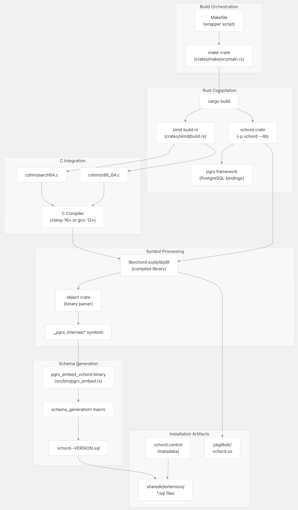
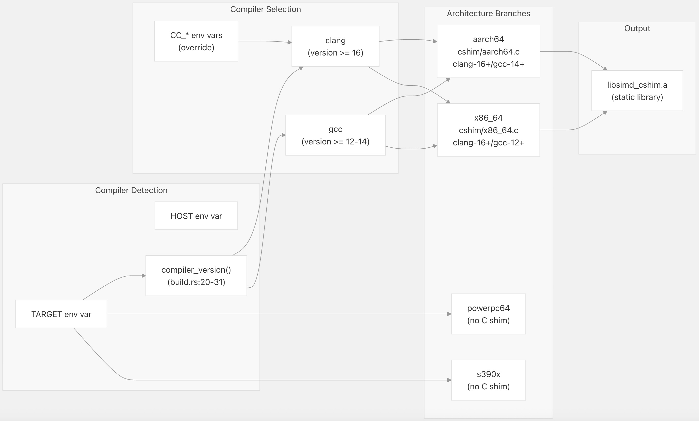
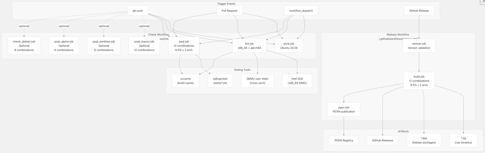
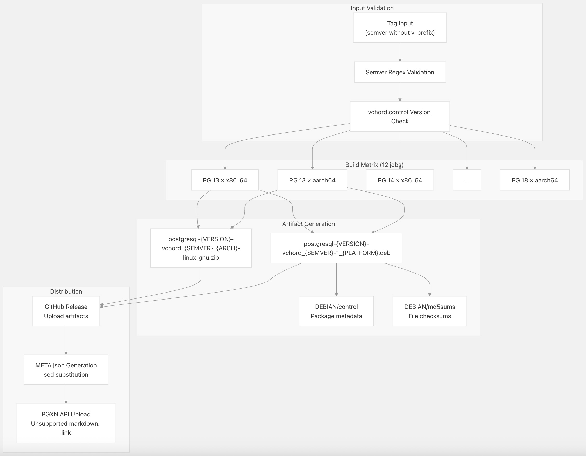

## VectorChord 源码学习: 5 构建与部署 (Building and Deployment)  
                                                              
### 作者                                                              
digoal                                                              
                                                              
### 日期                                                              
2025-11-02                                                              
                                                              
### 标签                                                              
VectorChord , 源码学习                                                              
                                                              
----                                                              
                                                              
## 背景                   
本文介绍 VectorChord 完整的构建 (`build`)、测试 (`testing`)、打包 (`packaging`) 和部署 (`deployment`) 基础设施。解释 **Rust** 代码库是如何被编译成一个 **PostgreSQL 扩展** (`PostgreSQL extension`) 的，**CI/CD 流程** (`CI/CD pipeline`) 如何确保跨多个平台的质量，以及**制品** (`artifacts`) 是如何被打包并分发给最终用户的。  
  
## 概述 (`Overview`)  
  
VectorChord 的构建和部署系统旨在支持：  
  
  * **多平台编译** (`Multi-platform compilation`)：`x86_64`、`aarch64`、`s390x`、`ppc64le`、`riscv64`  
  * **多操作系统支持** (`Multi-OS support`)：Linux (`glibc`/`musl`)、macOS、Windows  
  * **PostgreSQL 版本矩阵** (`PostgreSQL version matrix`)：PostgreSQL 13 至 18  
  * **架构特定优化** (`Architecture-specific optimization`)：针对每个目标编译的 **SIMD** (`Single Instruction, Multiple Data`) 代码路径  
  * **自动化测试** (`Automated testing`)：包含 45 种以上测试矩阵组合的全面 **CI/CD 流程**  
  * **多种分发渠道** (`Multiple distribution channels`)：GitHub Releases、**PGXN** (`PostgreSQL Extension Network`)、**Docker 镜像** (`Docker images`)  
  
构建过程涉及几个关键阶段：**Rust 编译** (`Rust compilation`)、用于 **SIMD** 操作的 **C 垫片** (`C shim`) 编译、从编译后的二进制文件中进行**符号提取** (`symbol extraction`)、通过**代码反射** (`code reflection`) 生成 **SQL 模式** (`SQL schema`)，以及最后打包成平台特定的**制品** (`artifacts`)。  
  
**来源**:  
[`.github/workflows/check.yml` 1-764](https://github.com/tensorchord/VectorChord/blob/ac12e257/.github/workflows/check.yml#L1-L764)  
[`.github/workflows/release.yml` 1-147](https://github.com/tensorchord/VectorChord/blob/ac12e257/.github/workflows/release.yml#L1-L147)  
[`crates/make/src/main.rs` 1-434](https://github.com/tensorchord/VectorChord/blob/ac12e257/crates/make/src/main.rs#L1-L434)  
  
## 构建系统架构 (`Build System Architecture`)  
  
  
  
**构建编排流程** (`Build Orchestration Flow`)：`make` **工具包** (`make crate`)（[`crates/make/src/main.rs` 343-433](https://github.com/tensorchord/VectorChord/blob/ac12e257/crates/make/src/main.rs#L343-L433)）充当主要的构建编排工具。它执行以下操作：  
  
1.  **环境检测** (`Environment Detection`)：读取 `PGRX_PG_CONFIG_PATH` 并执行 `pg_config` 来确定 PostgreSQL 版本和安装路径 ( [`crates/make/src/main.rs` 110-123](https://github.com/tensorchord/VectorChord/blob/ac12e257/crates/make/src/main.rs#L110-L123) )  
2.  **Rust 编译** (`Rust Compilation`)：使用针对目标 PostgreSQL 版本的相应**功能标志** (`feature flags`) 调用 `cargo build` ( [`crates/make/src/main.rs` 162-193](https://github.com/tensorchord/VectorChord/blob/ac12e257/crates/make/src/main.rs#L162-L193) )  
3.  **符号提取** (`Symbol Extraction`)：使用 `object` **工具包** (`object crate`) 解析已编译的二进制文件并提取以 `__pgrx_internals` 开头的符号 ( [`crates/make/src/main.rs` 195-230](https://github.com/tensorchord/VectorChord/blob/ac12e257/crates/make/src/main.rs#L195-L230) )  
4.  **模式生成** (`Schema Generation`)：构建并执行 `pgrx_embed_vchord` 二进制文件，以从 **Rust** 代码生成 **SQL DDL** (`SQL Data Definition Language`) ( [`crates/make/src/main.rs` 232-307](https://github.com/tensorchord/VectorChord/blob/ac12e257/crates/make/src/main.rs#L232-L307) )  
5.  **制品安装** (`Artifact Installation`)：将文件复制到 PostgreSQL 的 `pkglibdir` 和 `sharedir/extension` 目录 ( [`crates/make/src/main.rs` 309-429](https://github.com/tensorchord/VectorChord/blob/ac12e257/crates/make/src/main.rs#L309-L429) )  
  
**来源**:  
[`crates/make/src/main.rs` 15-434](https://github.com/tensorchord/VectorChord/blob/ac12e257/crates/make/src/main.rs#L15-L434)  
[`crates/make/Cargo.toml` 1-18](https://github.com/tensorchord/VectorChord/blob/ac12e257/crates/make/Cargo.toml#L1-L18)  
  
## SIMD 构建流程 (`SIMD Build Process`)  
  
**SIMD** 子系统需要编译特定于架构的 **C** 代码，以实现通过 **Rust 内部函数** (`Rust intrinsics`) 无法获得的操作。[`crates/simd/build.rs` 1-87](https://github.com/tensorchord/VectorChord/blob/ac12e257/crates/simd/build.rs#L1-L87) 的构建脚本处理此编译：  
  
  
  
**编译器版本要求** (`Compiler Version Requirements`)：  
  
| 架构 (`Architecture`) | Clang 最低版本 | GCC 最低版本 | 原因 (`Reason`) |  
| :--- | :--- | :--- | :--- |  
| `aarch64` | 16 | 14 | SVE 支持 (`SVE support`) |  
| `x86_64` | 16 | 12 | AVX-512 内部函数 (`AVX-512 intrinsics`) |  
| `powerpc64` | N/A | N/A | 仅 Rust 内部函数 |  
| `s390x` | N/A | N/A | 仅 Rust 内部函数 |  
  
该构建脚本遵循环境变量 `CC_<target>`、`CC_<target_normalized>`、`TARGET_CC` 和 `CC` 进行编译器覆盖 ( [`crates/simd/build.rs` 33-56](https://github.com/tensorchord/VectorChord/blob/ac12e257/crates/simd/build.rs#L33-L56) )。当目标为 `aarch64` 时，它编译 `cshim/aarch64.c` ( [`crates/simd/build.rs` 64-72](https://github.com/tensorchord/VectorChord/blob/ac12e257/crates/simd/build.rs#L64-L72) )；对于 `x86_64`，它编译 `cshim/x86_64.c` ( [`crates/simd/build.rs` 75-83](https://github.com/tensorchord/VectorChord/blob/ac12e257/crates/simd/build.rs#L75-L83) )。所有编译都使用**优化级别 3** (`Optimization level 3`)。  
  
**来源**:  
[`crates/simd/build.rs` 1-87](https://github.com/tensorchord/VectorChord/blob/ac12e257/crates/simd/build.rs#L1-L87)  
[`crates/simd/Cargo.toml` 1-28](https://github.com/tensorchord/VectorChord/blob/ac12e257/crates/simd/Cargo.toml#L1-L28)  
  
## CI/CD 流程架构 (`CI/CD Pipeline Architecture`)  
  
  
  
### 核心 CI 任务 (`Core CI Jobs`)  
  
`.github/workflows/check.yml` 流程定义了几种任务类型：  
  
**风格强制执行** (`Style Enforcement`) ( [`.github/workflows/check.yml` 13-101](https://github.com/tensorchord/VectorChord/blob/ac12e257/.github/workflows/check.yml#L13-L101) )：  
  
  * `typos`：拼写检查  
  * `taplo fmt --check`：TOML 格式验证  
  * `ruff`：Python 代码检查 (`linting`)  
  * `cargo fmt --check`：Rust 格式化  
  * `cargo deny check`：依赖项许可证和安全验证 (`Dependency license and security validation`)  
  * 对 `.rs`、`.c`、`.py` 文件的许可证头文件验证  
  
**代码检查与单元测试** (`Lint and Unit Tests`) ( [`.github/workflows/check.yml` 102-163](https://github.com/tensorchord/VectorChord/blob/ac12e257/.github/workflows/check.yml#L102-L163) )：  
  
  * 在 `x86_64` 和 `aarch64` 上运行  
  * `cargo clippy --workspace`：以**将警告视为错误** (`warnings-as-errors`) 的方式进行代码检查  
  * `cargo test --workspace`：不包括**集成测试** (`integration tests`) 的**单元测试** (`unit tests`)  
  * **SIMD 测试** (`SIMD Testing`)：使用 **Intel SDE** (`Intel Software Development Emulator`) (`x86_64`) 或 **QEMU** (`aarch64`) 进行的专门测试，后者使用多个 **SVE 向量长度** (`SVE vector lengths`)  
      * `x86_64`: `sde64 -spr` 用于**指令模拟** (`instruction emulation`)  
      * `aarch64`: 三次 **QEMU** 运行，**SVE** 长度分别为 16、32、64 ( [`.github/workflows/check.yml` 152-162](https://github.com/tensorchord/VectorChord/blob/ac12e257/.github/workflows/check.yml#L152-L162) )  
  
**集成测试** (`Integration Tests`) ( [`.github/workflows/check.yml` 164-254](https://github.com/tensorchord/VectorChord/blob/ac12e257/.github/workflows/check.yml#L164-L254) )：  
  
  * **矩阵** (`Matrix`)：6 个 PostgreSQL 版本 (13-18) × 2 种架构 = 12 种组合  
  * 从 **PGDG 仓库** (`PGDG repository`) 设置 PostgreSQL  
  * 安装 `pgvector 0.8.1` 作为依赖项  
  * 编译并安装 VectorChord  
  * 运行 **sqllogictest 套件** (`sqllogictest suites`)：`general/*.slt`、`vchordg/*.slt`、`vchordrq/*.slt`  
  * PostgreSQL 17+ 在 `vchordrq/pg17/*.slt` 中运行额外的测试 ( [`.github/workflows/check.yml` 251-253](https://github.com/tensorchord/VectorChord/blob/ac12e257/.github/workflows/check.yml#L251-L253) )  
  
### 平台特定测试 (`Platform-Specific Testing`)  
  
**macOS 测试** (`macOS Testing`) ( [`.github/workflows/check.yml` 255-340](https://github.com/tensorchord/VectorChord/blob/ac12e257/.github/workflows/check.yml#L255-L340) )：  
  
  * 可选（由提交信息 `job: +psql_macos` 或 PR 正文触发）  
  * 测试 **Apple Silicon** (`aarch64`) 和 **Intel** (`x86_64`) 两种架构  
  * 通过 **Homebrew** 安装 PostgreSQL  
  * 使用来自 `$(brew --prefix llvm@18)` 的 **Clang** 编译器  
  
**Windows 测试** (`Windows Testing`) ( [`.github/workflows/check.yml` 341-449](https://github.com/tensorchord/VectorChord/blob/ac12e257/.github/workflows/check.yml#L341-L449) )：  
  
  * 可选（由提交信息 `job: +psql_windows` 触发）  
  * 使用 EnterpriseDB PostgreSQL 二进制文件  
  * 使用 **MSVC 工具链** (`MSVC toolchain`) 编译  
  * 基于 **PowerShell** 的测试编排  
  
**Alpine Linux (musl libc)** ( [`.github/workflows/check.yml` 450-555](https://github.com/tensorchord/VectorChord/blob/ac12e257/.github/workflows/check.yml#L450-L555) )：  
  
  * 可选（由提交信息 `job: +psql_alpine` 触发）  
  * 测试使用 **musl** 的**静态链接** (`static linking`)  
  * 需要修补 `.cargo/config.toml` 以设置 `-Ctarget-feature=-crt-static` ( [`.github/workflows/check.yml` 514-522](https://github.com/tensorchord/VectorChord/blob/ac12e257/.github/workflows/check.yml#L514-L522) )  
  * 为兼容性使用 **beta Rust 工具链** (`beta Rust toolchain`) (`1.89-beta`)  
  
**跨架构 (Debian)** (`Cross-Architecture (Debian)`) ( [`.github/workflows/check.yml` 556-764](https://github.com/tensorchord/VectorChord/blob/ac12e257/.github/workflows/check.yml#L556-L764) )：  
  
  * 可选（由提交信息 `job: +check_debian` 触发）  
  * 通过 **QEMU 用户态模拟** (`QEMU user emulation`) 测试 `s390x`、`ppc64le`、`riscv64`  
  * 创建带有目标架构二进制文件的 **chroot 环境** (`chroot environment`)  
  * 使用包装脚本调整 `pg_config` 的路径 ( [`.github/workflows/check.yml` 667-672](https://github.com/tensorchord/VectorChord/blob/ac12e257/.github/workflows/check.yml#L667-L672) )  
  * 针对 PowerPC 的特殊处理：符号链接修复和 `QEMU_CPU=power10` ( [`.github/workflows/check.yml` 648-654](https://github.com/tensorchord/VectorChord/blob/ac12e257/.github/workflows/check.yml#L648-L654) )  
  
### 测试矩阵摘要 (`Testing Matrix Summary`)  
  
| 任务类型 (`Job Type`) | 基础任务 (`Base Jobs`) | 可选任务 (`Optional Jobs`) | 组合总数 (`Total Combinations`) |  
| :--- | :--- | :--- | :--- |  
| `style` | 1 | 0 | 1 |  
| `lint` | 2 (`x86_64`, `aarch64`) | 0 | 2 |  
| `psql` | 12 (6 PG × 2 架构) | 0 | 12 |  
| `psql_macos` | 0 | 12 (6 PG × 2 架构) | 12 |  
| `psql_windows` | 0 | 6 (6 PG × 1 架构) | 6 |  
| `psql_alpine` | 0 | 6 (3 PG × 2 架构) | 6 |  
| `check_debian` | 0 | 9 (各种组合) | 9 |  
| **总计** | **15** | **33** | **48** |  
  
**来源**:  
[`.github/workflows/check.yml` 1-764](https://github.com/tensorchord/VectorChord/blob/ac12e257/.github/workflows/check.yml#L1-L764)  
  
## 构建输出结构 (`Build Output Structure`)  
  
`make` 二进制文件生成一个结构化的输出目录：  
  
```  
./build/  
├── raw/                          # Raw installation files  
│   ├── pkglibdir/  
│   │   └── vchord.so             # Shared library (platform-specific extension)  
│   └── sharedir/  
│       └── extension/  
│           ├── vchord.control     # Extension metadata  
│           ├── vchord--0.0.0.sql  # Development SQL (generated)  
│           └── vchord--X.Y.Z.sql  # Release SQL (pre-written)  
└── deb/                          # Debian package structure  
    ├── DEBIAN/  
    │   ├── control               # Package metadata  
    │   └── md5sums               # File checksums  
    └── usr/  
        ├── lib/postgresql/XX/lib/  
        │   └── vchord.so  
        └── share/postgresql/XX/extension/  
            └── (SQL files)  
```  
  
**版本特定行为** (`Version-Specific Behavior`)：  
  
  * **开发版 (`0.0.0`)**：**SQL 模式**通过 `pgrx_embed_vchord` 动态生成 ( [`crates/make/src/main.rs` 413-428](https://github.com/tensorchord/VectorChord/blob/ac12e257/crates/make/src/main.rs#L413-L428) )  
  * **发布版 (`X.Y.Z`)**：直接复制 `sql/install/` 和 `sql/upgrade/` 中预先写入的 **SQL** 文件 ( [`crates/make/src/main.rs` 400-412](https://github.com/tensorchord/VectorChord/blob/ac12e257/crates/make/src/main.rs#L400-L412) )  
  
**来源**:  
[`crates/make/src/main.rs` 380-429](https://github.com/tensorchord/VectorChord/blob/ac12e257/crates/make/src/main.rs#L380-L429)  
  
## 发布与打包 (`Release and Packaging`)  
  
### 发布流程 (`Release Workflow`)  
  
`.github/workflows/release.yml` 流程由 **GitHub Release** 创建或手动调度触发：  
  
  
  
**语义化版本验证** (`Semver Validation`) ( [`.github/workflows/release.yml` 22-36](https://github.com/tensorchord/VectorChord/blob/ac12e257/.github/workflows/release.yml#L22-L36) )：  
  
  * 使用 JavaScript 正则表达式验证**标签格式** (`tag format`)：`MAJOR.MINOR.PATCH[-PRERELEASE][+BUILD]`  
  * 如果标签与**语义化版本** (`Semver`) 规范不匹配，则流程失败  
  
**版本一致性检查** (`Version Consistency Check`) ( [`.github/workflows/release.yml` 79-84](https://github.com/tensorchord/VectorChord/blob/ac12e257/.github/workflows/release.yml#L79-L84) )：  
  
```  
grep -q "default_version = '${SEMVER}'" vchord.control || exit 1  
```  
  
确保 `vchord.control` 版本与发布标签匹配。  
  
**Debian 软件包结构** (`Debian Package Structure`) ( [`.github/workflows/release.yml` 96-110](https://github.com/tensorchord/VectorChord/blob/ac12e257/.github/workflows/release.yml#L96-L110) )：  
  
  * **软件包名称** (`Package name`)：`postgresql-{VERSION}-vchord`  
  * **依赖项** (`Dependencies`)：`postgresql-{VERSION}, libgcc-s1, libc6 (>= 2.35)`  
  * **架构** (`Architecture`)：`amd64` (`x86_64`) 或 `arm64` (`aarch64`)  
  * **维护者** (`Maintainer`)：`Tensorchord <support@tensorchord.ai>`  
  * 使用 `xz` 格式压缩：`dpkg-deb --root-owner-group -Zxz`  
  
**PGXN 发布** (`PGXN Publication`) ( [`.github/workflows/release.yml` 123-147](https://github.com/tensorchord/VectorChord/blob/ac12e257/.github/workflows/release.yml#L123-L147) )：  
  
  * 将 `META.json.in` 中的 `@DISTVERSION@` 替换为实际版本  
  * 使用 `git archive` 创建 **ZIP 压缩包** (`ZIP archive`)，包括修改后的 `META.json`  
  * 通过**认证的 POST 请求** (`authenticated POST`) 上传到 **PGXN**：`https://manager.pgxn.org/upload`  
  
**来源**:  
[`.github/workflows/release.yml` 1-147](https://github.com/tensorchord/VectorChord/blob/ac12e257/.github/workflows/release.yml#L1-L147)  
  
## 安装方法 (`Installation Methods`)  
  
VectorChord 支持多种安装方法：  
  
### Debian 软件包安装 (`Debian Package Installation`)  
```  
# Download from GitHub Releases  
wget https://github.com/tensorchord/VectorChord/releases/download/{VERSION}/postgresql-{PG_VERSION}-vchord_{VERSION}-1_{ARCH}.deb  
  
# Install  
sudo dpkg -i postgresql-{PG_VERSION}-vchord_{VERSION}-1_{ARCH}.deb  
  
# Configure PostgreSQL  
echo "shared_preload_libraries = 'vchord'" | sudo tee -a /etc/postgresql/{PG_VERSION}/main/postgresql.conf  
sudo systemctl restart postgresql  
  
# Enable extension  
psql -c "CREATE EXTENSION vchord CASCADE;"  
```  
  
### 从 ZIP 手动安装 (`Manual Installation from ZIP`)  
```  
# Extract archive  
unzip postgresql-{PG_VERSION}-vchord_{VERSION}_{ARCH}-linux-gnu.zip -d vchord-install  
  
# Copy files to PostgreSQL directories  
sudo cp vchord-install/pkglibdir/vchord.so $(pg_config --pkglibdir)/  
sudo cp vchord-install/sharedir/extension/* $(pg_config --sharedir)/extension/  
  
# Configure and restart  
sudo -u postgres psql -c "ALTER SYSTEM SET shared_preload_libraries = 'vchord';"  
sudo systemctl restart postgresql  
```  
  
### 源码编译 (`Source Compilation`)  
```  
# Prerequisites  
sudo apt-get install -y postgresql-server-dev-{VERSION} clang-18  
  
# Clone repository  
git clone https://github.com/tensorchord/VectorChord.git  
cd VectorChord  
  
# Build and install  
make PG_CONFIG=pg_config build  
sudo make PG_CONFIG=pg_config install  
  
# Configure  
echo "shared_preload_libraries = 'vchord'" >> /etc/postgresql/{VERSION}/main/postgresql.conf  
sudo systemctl restart postgresql  
```  
  
### PGXN 安装 (`PGXN Installation`)  
```  
# Using pgxnclient  
pgxn install vchord  
  
# Manual download and build  
wget https://api.pgxn.org/dist/vchord/{VERSION}/vchord-{VERSION}.zip  
unzip vchord-{VERSION}.zip  
cd vchord-{VERSION}  
make  
sudo make install  
```  
  
**路径解析** (`Path Resolution`)：构建系统使用 `pg_config` 确定安装路径：  
  
  * `pkglibdir`：PostgreSQL 扩展库目录 ( [`crates/make/src/main.rs` 380](https://github.com/tensorchord/VectorChord/blob/ac12e257/crates/make/src/main.rs#L380-L380) )  
  * `sharedir`：PostgreSQL 共享数据目录 ( [`crates/make/src/main.rs` 381](https://github.com/tensorchord/VectorChord/blob/ac12e257/crates/make/src/main.rs#L381-L381) )  
  
**来源**:  
[`.github/workflows/release.yml` 92-110](https://github.com/tensorchord/VectorChord/blob/ac12e257/.github/workflows/release.yml#L92-L110)  
[`crates/make/src/main.rs` 380-398](https://github.com/tensorchord/VectorChord/blob/ac12e257/crates/make/src/main.rs#L380-L398)  
  
## 通过反射生成模式 (`Schema Generation via Reflection`)  
  
`pgrx_embed_vchord` 二进制文件通过**代码反射** (`code reflection`) 执行 **SQL DDL** 生成：  
  
  
  
**符号处理** (`Symbol Processing`) ( [`crates/make/src/main.rs` 195-230](https://github.com/tensorchord/VectorChord/blob/ac12e257/crates/make/src/main.rs#L195-L230) )：  
  
  * 使用 `object` **工具包**解析已编译的二进制文件  
  * 提取匹配模式 `__pgrx_internals*` 的符号  
  * 平台特定处理：  
      * macOS：从导出符号中**剥离前导下划线** (`Stripping leading underscore from exports`) ( [`crates/make/src/main.rs` 204-212](https://github.com/tensorchord/VectorChord/blob/ac12e257/crates/make/src/main.rs#L204-L212) )  
      * Emscripten：使用**符号表** (`Symbol table`) 而非导出符号 ( [`crates/make/src/main.rs` 213-219](https://github.com/tensorchord/VectorChord/blob/ac12e257/crates/make/src/main.rs#L213-L219) )  
      * 其他 Unix：直接解析导出符号 ( [`crates/make/src/main.rs` 221-227](https://github.com/tensorchord/VectorChord/blob/ac12e257/crates/make/src/main.rs#L221-L227) )  
  
**PowerPC64 导入处理** (`PowerPC64 Import Handling`) ( [`crates/make/src/main.rs` 242-256](https://github.com/tensorchord/VectorChord/blob/ac12e257/crates/make/src/main.rs#L242-L256) )：  
  
  * 读取 PostgreSQL `postgres` 二进制文件以提取所有导出符号  
  * 过滤掉特殊符号 (`_start`、`_IO_stdin_used`、`main`)  
  * 将这些作为**导入** (`imports`) 注入到生成的代码中以解决动态链接要求  
  
**模式生成宏** (`Schema Generation Macro`) ( [`src/bin/pgrx_embed.rs` 19-54](https://github.com/tensorchord/VectorChord/blob/ac12e257/src/bin/pgrx_embed.rs#L19-L54) )：  
  
  * 为导入（PowerPC64）生成存根函数 (`Stub functions`)，这些函数在被调用时会 `panic`  
  * 为每个 `__pgrx_internals` 符号声明外部 **Rust** 函数  
  * 调用每个符号以收集 `SqlGraphEntity` 对象  
  * 使用 `PgrxSql::build()` 构建完整的 **SQL 模式**  
  * 输出到 **标准输出** (`stdout`)（由 `make` **工具包**捕获）  
  
**来源**:  
[`crates/make/src/main.rs` 195-307](https://github.com/tensorchord/VectorChord/blob/ac12e257/crates/make/src/main.rs#L195-L307)  
[`src/bin/pgrx_embed.rs` 1-55](https://github.com/tensorchord/VectorChord/blob/ac12e257/src/bin/pgrx_embed.rs#L1-L55)  
  
## 构建系统命令 (`Build System Commands`)  
  
`make` 二进制文件提供了一个**命令行界面** (`command-line interface`)：  
  
```  
# Basic usage  
make PG_CONFIG=pg_config PROFILE=release build  
  
# Cross-compilation  
make PG_CONFIG=pg_config TARGET=aarch64-unknown-linux-gnu PROFILE=release build  
  
# With custom runner (for testing)  
make PG_CONFIG=pg_config RUNNER="qemu-aarch64-static -cpu max" build  
  
# Development build  
make PG_CONFIG=pg_config PROFILE=dev build  
```  
  
**命令参数** (`Command Arguments`) ( [`crates/make/src/main.rs` 35-45](https://github.com/tensorchord/VectorChord/blob/ac12e257/crates/make/src/main.rs#L35-L45) )：  
  
  * `--output <DIR>`：构建输出目录（默认：推断）  
  * `--target <TRIPLE>`：**目标三元组** (`Target triple`)（默认：**主机三元组** (`host triple`)）  
  * `--profile <NAME>`：**Cargo 配置文件** (`Cargo profile`)（默认：`release`）  
  * `--runner <CMD>`：**二进制运行器** (`Binary runner`)（可选）  
  
**环境变量** (`Environment Variables`)：  
  
  * `PGRX_PG_CONFIG_PATH`：`pg_config` 的路径（必需）  
  * `PG_CONFIG`：`PGRX_PG_CONFIG_PATH` 的别名  
  * `TARGET`：构建**目标三元组**  
  * `PROFILE`：构建**配置文件**名称  
  * `RUNNER`：测试**运行器**命令  
  
**配置文件映射** (`Profile Mapping`) ( [`crates/make/src/main.rs` 186-190](https://github.com/tensorchord/VectorChord/blob/ac12e257/crates/make/src/main.rs#L186-L190) )：  
  
  * `dev`、`test` → `target/{triple}/debug/`  
  * `release`、`bench` → `target/{triple}/release/`  
  * 自定义配置文件 → `target/{triple}/{profile}/`  
  
**来源**:  
[`crates/make/src/main.rs` 24-93](https://github.com/tensorchord/VectorChord/blob/ac12e257/crates/make/src/main.rs#L24-L93)  
[`crates/make/src/main.rs` 343-433](https://github.com/tensorchord/VectorChord/blob/ac12e257/crates/make/src/main.rs#L343-L433)  
    
  
#### [期望 PostgreSQL|开源PolarDB 增加什么功能?](https://github.com/digoal/blog/issues/76 "269ac3d1c492e938c0191101c7238216")
  
  
#### [PolarDB 开源数据库](https://openpolardb.com/home "57258f76c37864c6e6d23383d05714ea")
  
  
#### [PolarDB 学习图谱](https://www.aliyun.com/database/openpolardb/activity "8642f60e04ed0c814bf9cb9677976bd4")
  
  
#### [PostgreSQL 解决方案集合](../201706/20170601_02.md "40cff096e9ed7122c512b35d8561d9c8")
  
  
#### [德哥 / digoal's Github - 公益是一辈子的事.](https://github.com/digoal/blog/blob/master/README.md "22709685feb7cab07d30f30387f0a9ae")
  
  
#### [About 德哥](https://github.com/digoal/blog/blob/master/me/readme.md "a37735981e7704886ffd590565582dd0")
  
  

  
