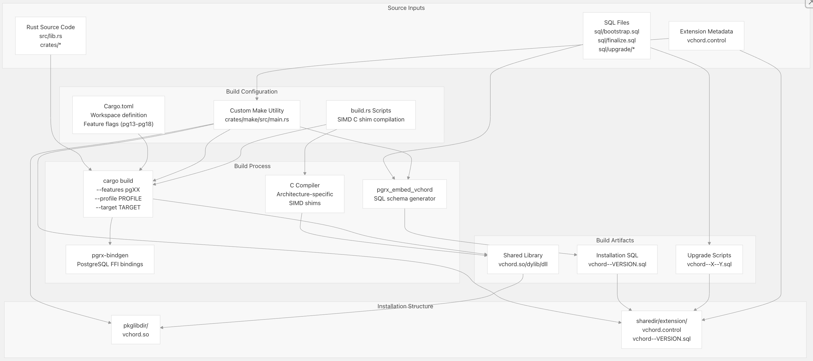
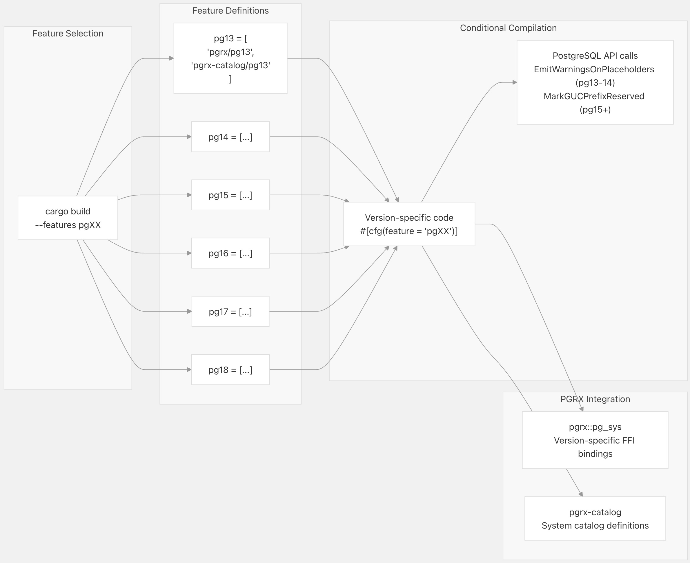
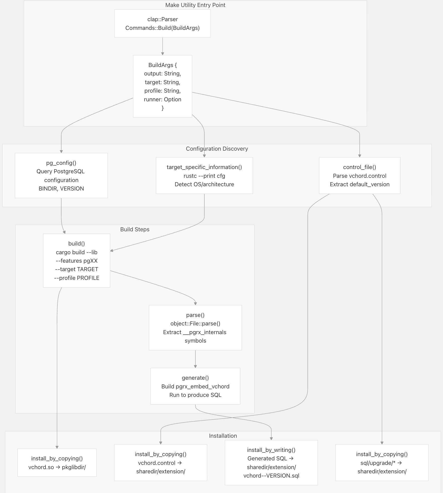
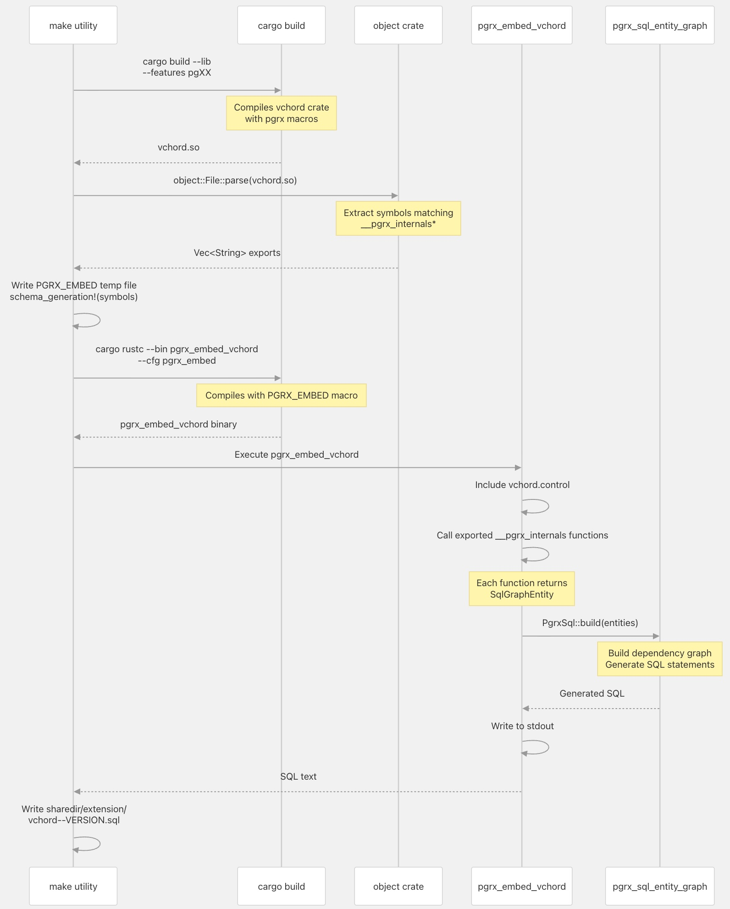
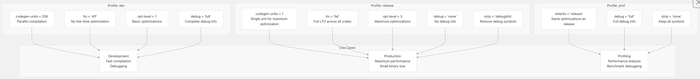
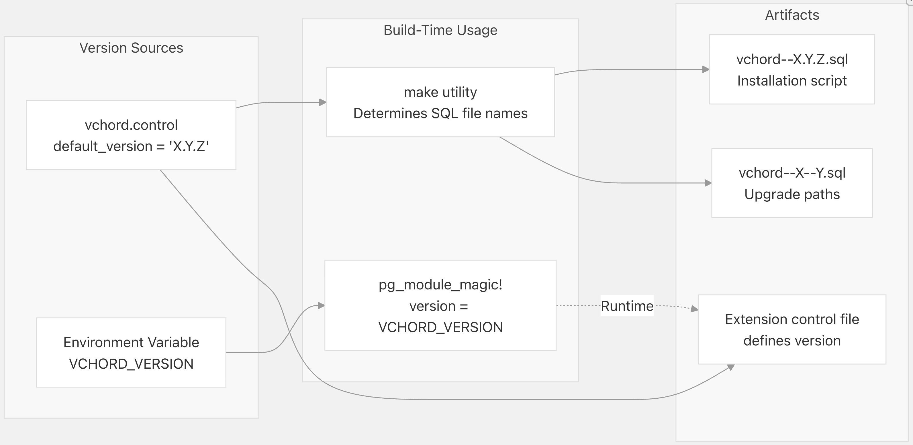
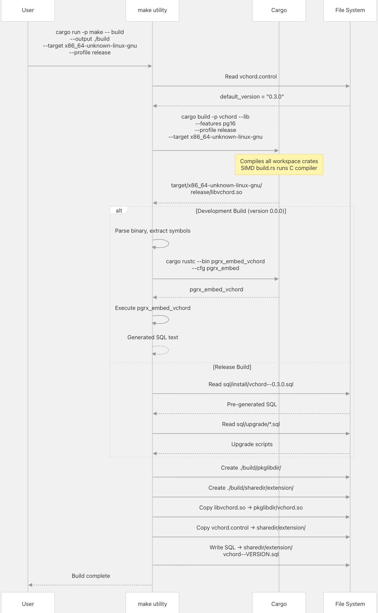

## VectorChord 源码学习: 5.1 构建系统（Build System）  
                                                                
### 作者                                                                
digoal                                                                
                                                                
### 日期                                                                
2025-11-02                                                                
                                                                
### 标签                                                                
VectorChord , 源码学习                                                                
                                                                
----                                                                
                                                                
## 背景                     
本文介绍 VectorChord 的**构建系统**（build system），它负责协调（orchestrates）将 **Rust** 源代码编译成一个 **PostgreSQL** 扩展（extension）。该构建系统处理 **PGRX** 框架集成（integration）、**SQL** 模式（schema）生成、多版本 **PostgreSQL** 支持（PG13-PG18）以及针对特定架构的 **SIMD** 优化（optimizations）。  
  
-----  
  
## 构建架构概览（Build Architecture Overview）  
  
VectorChord 使用一个 **Cargo** 工作区（workspace）结构，以及一个围绕 **PGRX** 构建的自定义**编排层**（orchestration layer）。构建过程将 **Rust** 源代码和 **SQL** 文件转换为一个 **PostgreSQL** 可加载的**共享库**（shared library）以及安装 **SQL** 脚本。  
  
  
  
**构建过程概览（Build Process Overview）**：构建系统使用 `cargo` 进行编译，并由一个自定义的 `make` 工具提供编排。`make` 工具调用 `cargo build` 来生成共享库，然后运行 `pgrx_embed_vchord`，通过**自省**（introspecting）已编译二进制文件（binary）的**导出符号**（exported symbols）来生成安装 **SQL**。最后，它将工件组织成 **PostgreSQL** 扩展的目录结构。  
  
来源:  
[`Cargo.toml` 1-113](https://github.com/tensorchord/VectorChord/blob/ac12e257/Cargo.toml#L1-L113) [`crates/make/src/main.rs` 1-434](https://github.com/tensorchord/VectorChord/blob/ac12e257/crates/make/src/main.rs#L1-L434) [`src/lib.rs` 1-82](https://github.com/tensorchord/VectorChord/blob/ac12e257/src/lib.rs#L1-L82)  
  
-----  
  
## Cargo 工作区结构（Cargo Workspace Structure）  
  
该项目使用 **Cargo** 的**工作区**（workspace）特性将代码组织成多个 **crate**（Rust 库单元），每个 **crate** 都有特定的职责。  
  
| Crate | 位置 (Location) | 目的 (Purpose) |  
| :--- | :--- | :--- |  
| `vchord` | 根目录 (Root) | 主要扩展库，**PGRX** 集成（integration） |  
| `make` | `crates/make` | 自定义构建编排工具 |  
| `simd` | `crates/simd` | 带有 C **垫片**（shims）的 **SIMD** 操作 |  
| `simd_macros` | `crates/simd_macros` | 用于多版本编译的**过程宏**（procedural macros） |  
| `vchordrq` | `crates/vchordrq` | **残差量化**（Residual Quantized）索引实现 |  
| `vchordg` | `crates/vchordg` | **基于图**（Graph-based）的索引实现 |  
| `distance` | `crates/distance` | 距离度量（Distance Metric）实现 |  
| `k_means` | `crates/k_means` | K 均值聚类（K-means Clustering）算法 |  
| `rabitq` | `crates/rabitq` | **RaBitQ** 量化（quantization） |  
| `vector` | `crates/vector` | 向量类型定义 |  
| `index` | `crates/index` | 共享索引基础设施 |  
| `always_equal` | `crates/always_equal` | 用于相等语义（equality semantics）的工具 crate |  
| `small_iter` | `crates/small_iter` | 小尺寸**迭代器**（iterator）优化 |  
  
工作区配置定义了共享的依赖项（dependencies）和 `lint` 规则：  
  
```  
[workspace]  
resolver = "3"  
members = ["crates/*"]  
  
[workspace.dependencies]  
bumpalo = "3.19.0"  
dary_heap = "0.3.8"  
# ... other shared dependencies  
  
[workspace.lints]  
rust.unsafe_code = "deny"  
rust.unsafe_op_in_unsafe_fn = "deny"  
```  
  
来源: [`Cargo.toml` 55-93](https://github.com/tensorchord/VectorChord/blob/ac12e257/Cargo.toml#L55-L93)  
  
-----  
  
## PostgreSQL 版本特性标志（Feature Flags）  
  
VectorChord 使用 **Cargo** **特性标志**（feature flags）支持 **PostgreSQL** 13 到 18 版本。每个版本都需要不同的 **PGRX** **绑定**（bindings）。  
  
  
  
**特性标志用法（Feature Flag Usage）**：构建系统要求必须启用一个 **PostgreSQL** 版本特性。`make` 工具会根据 `pg_config --version` 的输出来自动确定正确的特性，并将其传递给 `cargo build --features`。  
  
`_pg_init` 中的**条件编译**（conditional compilation）示例：  
  
```  
#[cfg(any(feature = "pg13", feature = "pg14"))]  
pgrx::pg_sys::EmitWarningsOnPlaceholders(c"vchord".as_ptr());  
  
#[cfg(any(feature = "pg15", feature = "pg16", feature = "pg17", feature = "pg18"))]  
pgrx::pg_sys::MarkGUCPrefixReserved(c"vchord".as_ptr());  
```  
  
来源: [`Cargo.toml` 15-22](https://github.com/tensorchord/VectorChord/blob/ac12e257/Cargo.toml#L15-L22) [`src/lib.rs` 48-62](https://github.com/tensorchord/VectorChord/blob/ac12e257/src/lib.rs#L48-L62) [`crates/make/src/main.rs` 363-376](https://github.com/tensorchord/VectorChord/blob/ac12e257/crates/make/src/main.rs#L363-L376)  
  
-----  
  
## 自定义 Make 工具（Custom Make Utility）  
  
VectorChord 包含一个自定义的 `make` 工具（`crates/make`），它负责**编排**（orchestrates）构建过程，处理 **PGRX** 集成的复杂性和**工件**（artifact）组织。  
  
  
  
**Make 工具工作流（Make Utility Workflow）**：`make` 工具执行以下几个关键功能：  
  
1.  **配置发现（Configuration Discovery）**：查询 `pg_config` 以获取 **PostgreSQL** 安装路径和版本信息  
2.  **目标检测（Target Detection）**：使用 `rustc --print cfg` 来确定**特定于平台**（platform-specific）的设置（共享库扩展名、可执行文件后缀）  
3.  **构建编排（Build Orchestration）**：使用适当的特性（features）和环境变量调用 `cargo build`  
4.  **符号提取（Symbol Extraction）**：使用 `object` crate 来解析已编译的二进制文件并提取 **PGRX** 内部符号  
5.  **SQL 生成（SQL Generation）**：编译并运行 `pgrx_embed_vchord` 二进制文件以生成安装 **SQL**  
6.  **工件组织（Artifact Organization）**：将文件复制到 **PostgreSQL** 扩展目录结构中  
  
来源: [`crates/make/src/main.rs` 24-434](https://github.com/tensorchord/VectorChord/blob/ac12e257/crates/make/src/main.rs#L24-L434) [`crates/make/Cargo.toml` 1-18](https://github.com/tensorchord/VectorChord/blob/ac12e257/crates/make/Cargo.toml#L1-L18)  
  
### 平台特定的文件扩展名（Platform-Specific File Extensions）  
  
`TargetSpecificInformation` 结构体（struct）处理平台差异：  
  
| 平台 (Platform) | 共享库扩展名 (Shared Library Extension) | 可执行文件扩展名 (Executable Extension) |  
| :--- | :--- | :--- |  
| Linux/Unix | `.so` | (无) |  
| macOS | `.dylib` (PG16+) / `.so` (PG13-15) | (无) |  
| Windows | `.dll` | `.exe` |  
| Emscripten | `.wasm` | `.js` |  
  
`ext_suffix()` 方法考虑了 **macOS** 上针对 **PostgreSQL** 版本的特定要求，其中旧版本（PG13-15）使用 `.so`，而新版本使用 `.dylib`。  
  
来源: [`crates/make/src/main.rs` 47-108](https://github.com/tensorchord/VectorChord/blob/ac12e257/crates/make/src/main.rs#L47-L108)  
  
-----  
  
## PGRX 集成与 SQL 生成（PGRX Integration and SQL Generation）  
  
VectorChord 使用 **PGRX** 框架来连接 **Rust** 和 **PostgreSQL**。构建系统通过**自省**（introspecting）已编译的扩展来生成 **SQL** 模式文件。  
  
  
  
**SQL 生成过程（SQL Generation Process）**：`pgrx_embed_vchord` 二进制文件是一个特殊的**构建目标**（build target），它**自省**（introspects）嵌入在已编译扩展中的 **PGRX** **元数据**（metadata）。`make` 工具执行以下操作：  
  
1.  使用注册 **SQL** 实体（entities）的 **PGRX** **宏**（macros）编译主库  
2.  从已编译的二进制文件中提取以 `__pgrx_internals` 开头的符号  
3.  生成一个列出这些符号的临时宏调用（invocation）  
4.  使用 `--cfg pgrx_embed` 编译 `pgrx_embed_vchord` 以包含此宏  
5.  执行该二进制文件，该文件调用每个符号函数来收集 **SQL** 实体  
6.  将完整的安装 **SQL** 输出到**标准输出**（stdout）  
  
来源: [`crates/make/src/main.rs` 195-307](https://github.com/tensorchord/VectorChord/blob/ac12e257/crates/make/src/main.rs#L195-L307) [`src/bin/pgrx_embed.rs` 1-55](https://github.com/tensorchord/VectorChord/blob/ac12e257/src/bin/pgrx_embed.rs#L1-L55)  
  
### `schema_generation!` 宏（Macro）  
  
```  
macro_rules! schema_generation {  
    ($($symbol:ident)*; $($import:ident)*) => {  
        pub fn main() -> Result<(), Box<dyn std::error::Error>> {  
            // Define stub implementations for PowerPC imports  
            $(  
                const _: () = {  
                    #[unsafe(no_mangle)]  
                    unsafe extern "C" fn $import() {  
                        panic!("{} is called unexpectedly.", stringify!($import));  
                    }  
                };  
            )*  
              
            extern crate vchord as _;  
              
            // Declare external Rust functions for each PGRX symbol  
            extern "Rust" {  
                $(safe fn $symbol() -> SqlGraphEntity;)*  
            }  
              
            // Collect all SQL entities  
            let mut e = vec![SqlGraphEntity::ExtensionRoot(control_file)];  
            $(e.push($symbol());)*  
              
            // Generate SQL  
            let pgrx_sql = PgrxSql::build(e.into_iter(), "vchord".to_string(), false)?;  
            pgrx_sql.write(&mut std::io::stdout())?;  
              
            Ok(())  
        }  
    };  
}  
```  
  
此宏在**编译时**（compile-time）使用从二进制文件（binary）中提取的符号列表进行调用。它生成一个 `main()` 函数，该函数收集所有 **PGRX SQL** 实体并将完整的**模式**（schema）写入**标准输出**（stdout）。  
  
来源: [`src/bin/pgrx_embed.rs` 19-54](https://github.com/tensorchord/VectorChord/blob/ac12e257/src/bin/pgrx_embed.rs#L19-L54)  
  
### PowerPC64 导入处理（Import Handling）  
  
在 **PowerPC64** 架构上，扩展二进制文件可能会引用来自 `postgres` 可执行文件中的符号。`make` 工具通过以下方式处理：  
  
1.  使用 `object` crate 解析 `postgres` 二进制文件  
2.  提取导出的符号（排除 `_start`、`_IO_stdin_used`、`main`）  
3.  将这些作为 `$import` 列表传递给 `schema_generation!`  
4.  宏生成**存根实现**（stub implementations）以满足**链接器**（linker）的要求  
  
来源: [`crates/make/src/main.rs` 242-256]()  
  
-----  
  
## 构建配置文件（Build Profiles）  
  
VectorChord 定义了三个具有不同**优化特性**（optimization characteristics）的**构建配置文件**（build profiles）：  
  
  
  
**配置文件选择（Profile Selection）**：`make` 工具将 **Cargo** 配置文件名称映射到目录名称。`dev` 和 `test` 配置文件使用 `debug` 目录，而 `release` 和 `bench` 使用 `release` 目录。自定义配置文件则直接映射。  
  
| 配置文件 (Profile) | Codegen Units | **LTO** | Opt Level | Debug Info | Strip | 目的 (Purpose) |  
| :--- | :--- | :--- | :--- | :--- | :--- | :--- |  
| `dev` | 256 | off | 1 | full | none | 开发迭代（Development iteration） |  
| `release` | 1 | fat | 3 | none | debuginfo | 生产部署（Production deployment） |  
| `prof` | 1 | fat | 3 | full | none | 性能分析（Performance profiling） |  
  
**LTO 影响（LTO Impact）**：`release` 配置文件的 `lto = "fat"` 在所有工作区 **crate** 中启用了激进的**链接时间优化**（Link-Time Optimizations, **LTO**），从而为 **SIMD** 和距离计算**热路径**（hot paths）带来了显著的性能提升。  
  
来源: [`Cargo.toml` 95-113](https://github.com/tensorchord/VectorChord/blob/ac12e257/Cargo.toml#L95-L113) [`crates/make/src/main.rs` 186-193](https://github.com/tensorchord/VectorChord/blob/ac12e257/crates/make/src/main.rs#L186-L193)  
  
-----  
  
## 环境变量与配置（Environment Variables and Configuration）  
  
构建系统依赖于多个**环境变量**进行配置：  
  
| 变量 (Variable) | 目的 (Purpose) | 设置方 (Set By) | 示例 (Example) |  
| :--- | :--- | :--- | :--- |  
| `PGRX_PG_CONFIG_PATH` | `pg_config` 二进制文件路径 | 用户/CI | `/usr/bin/pg_config` |  
| `TARGET` | 编译**目标三元组**（target triple） | Cargo | `x86_64-unknown-linux-gnu` |  
| `PROFILE` | 构建配置文件（Build profile） | Cargo | `release` |  
| `RUNNER` | 执行**交叉编译**（cross-compiled）二进制文件的命令 | 用户 | `qemu-aarch64` |  
| `VCHORD_VERSION` | 扩展版本字符串 | 构建脚本 | `0.3.0` |  
| `CARGO_CFG_TARGET_ARCH` | 目标架构（Target architecture） | Cargo | `aarch64` |  
| `HOST` | 主机平台三元组（Host platform triple） | Cargo | `x86_64-unknown-linux-gnu` |  
| `PGRX_EMBED` | 临时宏文件路径 | `make` 工具 | `/tmp/VCHORD_PGRX_EMBED` |  
| `CC_$TARGET` | C 编译器**覆盖**（override） | 用户 | `clang-16` |  
  
**PGRX 配置（PGRX Configuration）**：`PGRX_PG_CONFIG_PATH` 变量至关重要——它告诉 **PGRX** 要针对哪个 **PostgreSQL** 安装进行构建。`make` 工具会将此变量传递给两次 `cargo build` 调用。  
  
**交叉编译支持（Cross-Compilation Support）**：进行**交叉编译**（cross-compiling）时，`RUNNER` 变量指定一个**模拟器**（emulator）或远程执行**包装器**（wrapper）。`make` 工具在目标架构（target architecture）上执行 `pgrx_embed_vchord` 时会使用此变量。  
  
来源: [`crates/make/src/main.rs` 176-301](https://github.com/tensorchord/VectorChord/blob/ac12e257/crates/make/src/main.rs#L176-L301) [`crates/simd/build.rs` 34-62](https://github.com/tensorchord/VectorChord/blob/ac12e257/crates/simd/build.rs#L34-L62) [`src/lib.rs` 26](https://github.com/tensorchord/VectorChord/blob/ac12e257/src/lib.rs#L26-L26)  
  
-----  
  
## 扩展版本管理（Extension Version Management）  
  
VectorChord 使用一个在**编译时**（compile time）嵌入并在整个构建过程中引用的版本字符串：  
  
  
  
**版本处理（Version Handling）**：版本在 `vchord.control` 中定义，并由 `make` 工具在**构建时**提取。对于开发构建（`version = "0.0.0"`），该工具通过 `pgrx_embed` **即时**（on-the-fly）生成 **SQL**。对于**发布构建**（release builds），预生成的 **SQL** 文件会从 `sql/install/` 复制。  
  
版本字符串也通过 `pg_module_magic!` 嵌入到**扩展二进制文件**（extension binary）中：  
  
```  
pgrx::pg_module_magic!(  
    name = c"vchord",  
    version = {  
        const RAW: &str = env!("VCHORD_VERSION");  
        // ... compile-time C string construction  
        const { STR }  
    }  
);  
```  
  
来源: [`src/lib.rs` 23-44](https://github.com/tensorchord/VectorChord/blob/ac12e257/src/lib.rs#L23-L44) [`crates/make/src/main.rs` 348-429](https://github.com/tensorchord/VectorChord/blob/ac12e257/crates/make/src/main.rs#L348-L429)  
  
-----  
  
## 调用与输出（Invocation and Output）  
  
典型的构建调用流程：  
  
  
  
**构建输出结构（Build Output Structure）**：  
  
```  
./build/  
├── pkglibdir/  
│   └── vchord.so          # Compiled shared library  
└── sharedir/  
    └── extension/  
        ├── vchord.control        # Extension metadata  
        ├── vchord--0.3.0.sql     # Installation SQL  
        └── vchord--X--Y.sql      # Upgrade scripts (if version != 0.0.0)  
```  
  
该结构模仿了 **PostgreSQL** 的扩展安装布局（installation layout），可以直接复制到 `$PGROOT/lib/` 和 `$PGROOT/share/extension/`。  
  
来源: [`crates/make/src/main.rs` 343-432](https://github.com/tensorchord/VectorChord/blob/ac12e257/crates/make/src/main.rs#L343-L432)  
  
-----  
  
## 依赖项与 Crate 特性（Dependencies and Crate Features）  
  
具有**构建时间**影响的关键依赖项：  
  
| 依赖项 (Dependency) | 版本 (Version) | 目的 (Purpose) | 说明 (Notes) |  
| :--- | :--- | :--- | :--- |  
| `pgrx` | 0.16.1 | PostgreSQL 扩展框架 | PG13-PG18 的特性标志 |  
| `pgrx-catalog` | 0.3.1 | 系统**目录类型**（System catalog types） | 必须与 **PGRX** 版本特性匹配 |  
| `cc` | 1.2.40 | C 编译器集成 | 由 **SIMD** 的 `build.rs` 使用 |  
| `object` | 0.37.3 | 二进制解析 | 提取符号用于 **SQL** 生成 |  
| `mimalloc` | 0.1.48 | 替代**分配器**（Alternative allocator） | 仅限 Linux/macOS，x86\_64/aarch64 |  
| `rusqlite` | 0.37.0 | SQLite 数据库 | 用于查询记录器（query recorder）的捆绑特性 |  
  
**条件编译（Conditional Compilation）**：`mimalloc` **分配器**（allocator）仅在特定平台（platforms）上使用：  
  
```  
#[cfg(any(target_arch = "x86_64", target_arch = "aarch64"))]  
#[cfg(any(target_os = "linux", target_os = "macos"))]  
#[global_allocator]  
static GLOBAL_ALLOCATOR: mimalloc::MiMalloc = mimalloc::MiMalloc;  
```  
  
**SIMD 特性标志（SIMD Feature Flags）**：  
  
  * `init`：启用 **SIMD** 初始化（默认）  
  * `experimental_f16`：启用**半精度浮点**（half-precision float）支持（需要 **Rust nightly** 版本）  
  * `experimental_math`：启用实验性数学操作  
  
来源: [`Cargo.toml` 24-51](https://github.com/tensorchord/VectorChord/blob/ac12e257/Cargo.toml#L24-L51) [`src/lib.rs` 74-82](https://github.com/tensorchord/VectorChord/blob/ac12e257/src/lib.rs#L74-L82) [`crates/simd/Cargo.toml` 7-10](https://github.com/tensorchord/VectorChord/blob/ac12e257/crates/simd/Cargo.toml#L7-L10)  
  
-----  
  
## 构建工件与安装（Build Artifacts and Installation）  
  
`make` 工具生成一个完整的 **PostgreSQL** 扩展包：  
  
**安装函数（Installation Functions）**：  
  
1.  `install_by_copying()`：以适当的权限（数据文件 0644，可执行文件 0755）复制文件。  
2.  `install_by_writing()`：以权限写入生成的内容。  
  
**扩展控制文件（Extension Control File）**：`.control` 文件定义了扩展**元数据**：  
  
```  
# parsed by make utility  
default_version = '0.3.0'  
module_pathname = '$libdir/vchord'  
relocatable = false  
```  
  
**SQL 文件类型（SQL File Types）**：  
  
  * **安装 SQL** (`vchord--VERSION.sql`)：包含类型、操作符、函数和**索引访问方法**（index access methods）的完整**模式定义**。  
  * **升级 SQL** (`vchord--X--Y.sql`)：版本之间的**迁移脚本**。  
  * **引导 SQL** (`bootstrap.sql`)：在主模式生成之前执行。  
  * **最终化 SQL** (`finalize.sql`)：在主模式生成之后执行。  
  
来源: [`crates/make/src/main.rs` 309-429](https://github.com/tensorchord/VectorChord/blob/ac12e257/crates/make/src/main.rs#L309-L429) [`src/lib.rs` 45-46](https://github.com/tensorchord/VectorChord/blob/ac12e257/src/lib.rs#L45-L46)  
    
  
#### [期望 PostgreSQL|开源PolarDB 增加什么功能?](https://github.com/digoal/blog/issues/76 "269ac3d1c492e938c0191101c7238216")
  
  
#### [PolarDB 开源数据库](https://openpolardb.com/home "57258f76c37864c6e6d23383d05714ea")
  
  
#### [PolarDB 学习图谱](https://www.aliyun.com/database/openpolardb/activity "8642f60e04ed0c814bf9cb9677976bd4")
  
  
#### [PostgreSQL 解决方案集合](../201706/20170601_02.md "40cff096e9ed7122c512b35d8561d9c8")
  
  
#### [德哥 / digoal's Github - 公益是一辈子的事.](https://github.com/digoal/blog/blob/master/README.md "22709685feb7cab07d30f30387f0a9ae")
  
  
#### [About 德哥](https://github.com/digoal/blog/blob/master/me/readme.md "a37735981e7704886ffd590565582dd0")
  
  

  
