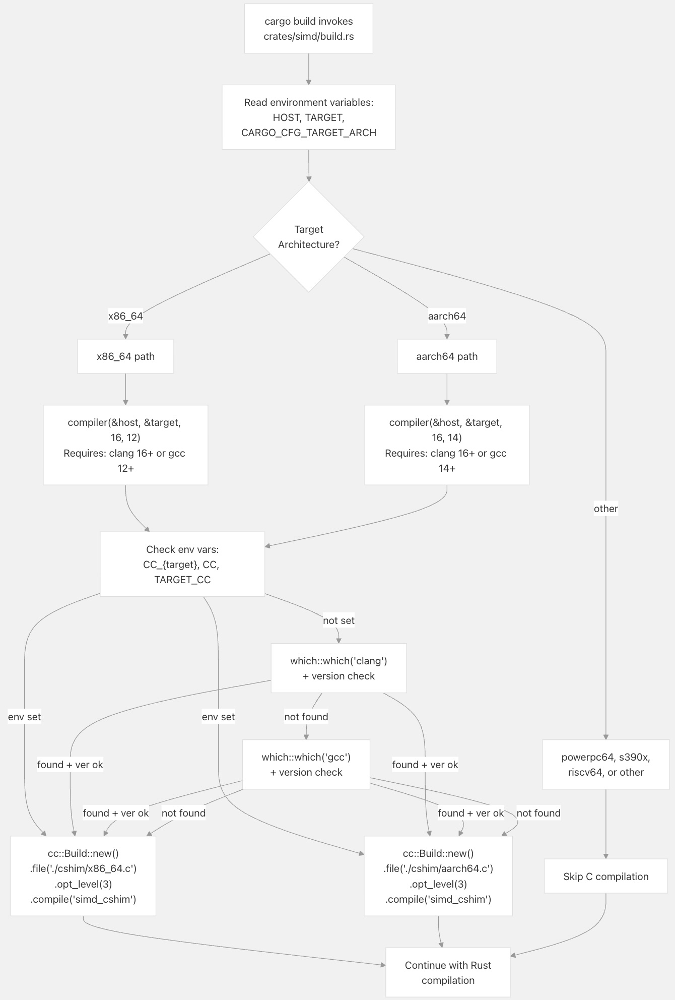
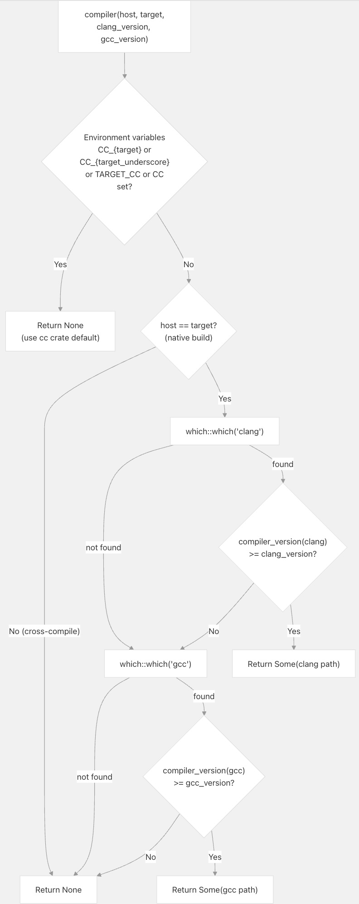
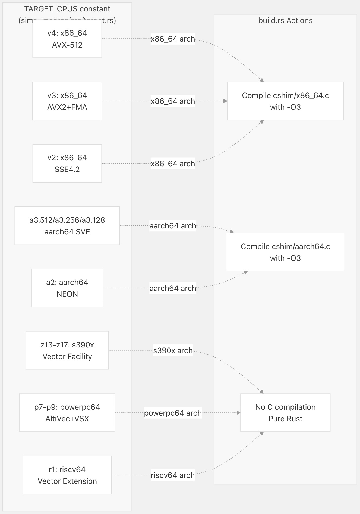
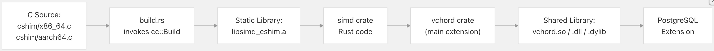

## VectorChord 源码学习: 5.2 SIMD 构建过程（SIMD Build Process）  
                                                                  
### 作者                                                                  
digoal                                                                  
                                                                  
### 日期                                                                  
2025-11-02                                                                  
                                                                  
### 标签                                                                  
VectorChord , 源码学习                                                                  
                                                                  
----                                                                  
                                                                  
## 背景                       
本文介绍 **SIMD 包（SIMD crate）** 的**构建时（build-time）** 编译过程，特别是 **架构特定 C 代码垫片（architecture-specific C code shims）** 如何在 **Rust 构建过程（Rust build process）** 中被编译。这涵盖了 `build.rs` 脚本逻辑、编译器选择以及在任何 **运行时（runtime）** 代码执行之前发生的 **目标架构检测（target architecture detection）**。  
  
## 概述（Overview）  
  
**SIMD 包（SIMD crate）** 使用 `build.rs` **构建脚本（build script）** 在 **构建过程（build process）** 中编译架构特定的 C 代码。这是必要的，因为某些 **SIMD 操作（SIMD operations）** 需要 C 语言实现，这些实现可以针对 **特定目标特性（specific target features）** 进行编译，而 **Rust 的内联汇编（Rust's inline assembly）** 或 **内部函数（intrinsics）** 无法轻易表达。该构建脚本会检测 **目标架构（target architecture）**，选择合适的编译器，并有条件地为特定架构编译 C 垫片（C shims）。  
  
当调用 `cargo build` 时，构建过程会自动运行，并生成一个 **静态库（static library）**（`libsimd_cshim.a`），该库会被链接到最终的 **扩展二进制文件（extension binary）** 中。  
  
**构建过程流程（Build Process Flow）**  
  
  
  
来源: [`crates/simd/build.rs` 58-87](https://github.com/tensorchord/VectorChord/blob/ac12e257/crates/simd/build.rs#L58-L87)  
  
## 构建脚本入口点（Build Script Entry Point）  
  
**构建脚本（build script）** 的执行从 [`crates/simd/build.rs` 58-87](https://github.com/tensorchord/VectorChord/blob/ac12e257/crates/simd/build.rs#L58-L87) 中的 `main` 函数开始。它立即声明了针对 `cshim` 目录的 **重建触发器（rebuild trigger）**，并读取了由 **Cargo** 提供的三个关键 **环境变量（environment variables）**：  
  
| 环境变量（Environment Variable） | 目的（Purpose） | 示例值（Example Value） |  
| :--- | :--- | :--- |  
| `HOST` | 运行构建的机器 | `x86_64-unknown-linux-gnu` |  
| `TARGET` | 正在为其构建的 **目标平台（target platform）** | `x86_64-unknown-linux-gnu` |  
| `CARGO_CFG_TARGET_ARCH` | **简化目标架构（Simplified target architecture）** | `x86_64`、`aarch64`、`s390x` 等 |  
  
该脚本使用 `CARGO_CFG_TARGET_ARCH` 来分派到 **架构特定编译逻辑（architecture-specific compilation logic）**：  
  
```  
match target_arch.as_str() {  
    "aarch64" => { /* ARM compilation */ }  
    "powerpc64" => {}  // No C shims needed  
    "s390x" => {}      // No C shims needed  
    "x86_64" => { /* x86-64 compilation */ }  
    _ => {}            // Unknown architectures skip C compilation  
}  
```  
  
来源: [`crates/simd/build.rs` 58-87](https://github.com/tensorchord/VectorChord/blob/ac12e257/crates/simd/build.rs#L58-L87)  
  
## 编译器选择逻辑（Compiler Selection Logic）  
  
[`crates/simd/build.rs` 33-56](https://github.com/tensorchord/VectorChord/blob/ac12e257/crates/simd/build.rs#L33-L56) 中的 `compiler` 函数实现了一个 **复杂的编译器选择算法（sophisticated compiler selection algorithm）**，该算法在尊重用户配置的同时，确保满足 **最低版本要求（minimum version requirements）**。  
  
**编译器选择决策树（Compiler Selection Decision Tree）**  
  
  
  
优先级顺序是：  
  
1.  **用户指定的编译器（User-specified compiler）**：如果设置了 `CC_{target}`、`CC_{target_with_underscores}`、`TARGET_CC` 或 `CC` 中任何一个 **环境变量（environment variables）**，则返回 `None`，让 `cc` **包（crate）** 使用用户的选择。  
2.  **现代 Clang（Modern Clang）**：如果这是一个 **本地构建（native build）**（**非交叉编译（not cross-compilation）**），并且在 `PATH` 中找到了版本足够的 `clang`，则使用它。  
3.  **现代 GCC（Modern GCC）**：如果 Clang 不可用，但 `gcc` 满足 **版本要求（version requirements）**，则使用它。  
4.  **默认行为（Default behavior）**：返回 `None`，让 `cc` **包（crate）** 选择一个编译器。  
  
**版本检查（version check）** 由 [`crates/simd/build.rs` 20-31](https://github.com/tensorchord/VectorChord/blob/ac12e257/crates/simd/build.rs#L20-L31) 中的 `compiler_version` 执行，该函数通过 `-dumpversion` 调用编译器并从输出中解析 **主版本号（major version number）**。  
  
来源: [`crates/simd/build.rs` 20-31](https://github.com/tensorchord/VectorChord/blob/ac12e257/crates/simd/build.rs#L20-L31) [`crates/simd/build.rs` 33-56](https://github.com/tensorchord/VectorChord/blob/ac12e257/crates/simd/build.rs#L33-L56)  
  
## 架构特定编译要求（Architecture-Specific Compilation Requirements）  
  
不同的架构对 **C 垫片编译（C shim compilation）** 有不同的要求。下表总结了每种支持架构的 **编译策略（compilation strategy）**：  
  
| 架构（Architecture） | 需要 C 垫片（C Shim Required） | 最低 Clang 版本（Minimum Clang Version） | 最低 GCC 版本（Minimum GCC Version） | C 源代码文件（C Source File） | 备注（Notes） |  
| :--- | :--- | :--- | :--- | :--- | :--- |  
| `x86_64` | 是 | 16 | 12 | `cshim/x86_64.c` | 需要现代编译器支持 **AVX-512 支持（AVX-512 support）** |  
| `aarch64` | 是 | 16 | 14 | `cshim/aarch64.c` | 需要现代编译器支持 **SVE 支持（SVE support）** |  
| `powerpc64` | 否 | N/A | N/A | None | **纯 Rust 实现（Pure Rust implementation）** |  
| `s390x` | 否 | N/A | N/A | None | **纯 Rust 实现（Pure Rust implementation）** |  
| `riscv64` | 否 | N/A | N/A | None | **纯 Rust 实现（Pure Rust implementation）** |  
| 其他（Other） | 否 | N/A | N/A | None | **回退到可移植代码（Fallback to portable code）** |  
  
**x86_64 编译（x86_64 Compilation）**  
  
对于 **x86-64 目标（x86-64 targets）**，[`crates/simd/build.rs` 75-83](https://github.com/tensorchord/VectorChord/blob/ac12e257/crates/simd/build.rs#L75-L83) 中的 **构建脚本（build script）** 以 **优化级别 3（optimization level 3）** 编译 `cshim/x86_64.c`。最低编译器版本（**Clang 16** / **GCC 12**）确保支持 **AVX-512 内部函数（AVX-512 intrinsics）** 和相关的 **指令集扩展（instruction set extensions）**。  
  
```  
let mut build = cc::Build::new();  
if let Some(compiler) = compiler(&host, &target, 16, 12) {  
    build.compiler(compiler);  
}  
build.file("./cshim/x86_64.c");  
build.opt_level(3);  
build.compile("simd_cshim");  
```  
  
**aarch64 编译（aarch64 Compilation）**  
  
对于 **ARM 64 位目标（ARM 64-bit targets）**，[`crates/simd/build.rs` 64-72](https://github.com/tensorchord/VectorChord/blob/ac12e257/crates/simd/build.rs#L64-L72) 中的 **构建脚本（build script）** 编译 `cshim/aarch64.c`。较高的 **GCC 版本要求（GCC version requirements）**（**14** 对 **12**）反映了 **SVE（Scalable Vector Extension，可伸缩向量扩展）** 支持在 GCC 中比 x86-64 中的 AVX-512 更晚 **稳定（stabilization）**。  
  
```  
let mut build = cc::Build::new();  
if let Some(compiler) = compiler(&host, &target, 16, 14) {  
    build.compiler(compiler);  
}  
build.file("./cshim/aarch64.c");  
build.opt_level(3);  
build.compile("simd_cshim");  
```  
  
**其他架构（Other Architectures）**  
  
对于 **PowerPC**、`s390x` 和 **RISC-V**，**构建脚本（build script）** 不执行任何操作（[`crates/simd/build.rs` 73-74](https://github.com/tensorchord/VectorChord/blob/ac12e257/crates/simd/build.rs#L73-L74) 中的 **空块（empty blocks）**）。这些架构完全依赖于 **Rust 的内联汇编（Rust's inline assembly）** 或 **内部函数（intrinsics）**，不需要 **C 垫片（C shims）**。这之所以可能，是因为：  
  
* **PowerPC 的 AltiVec（PowerPC's AltiVec）** 和 **VSX** 得到了 **Rust 的 `core::arch` 模块（Rust's `core::arch` module）** 的良好支持。  
* `s390x` **向量设施（Vector Facility）** 具有稳定的 **Rust 内部函数（Rust intrinsics）**。  
* **RISC-V 向量扩展（RISC-V Vector Extension）** 支持较新，但已被 Rust 充分覆盖。  
  
来源: [`crates/simd/build.rs` 64-87](https://github.com/tensorchord/VectorChord/blob/ac12e257/crates/simd/build.rs#L64-L87)  
  
## 构建依赖项和配置（Build Dependencies and Configuration）  
  
[`crates/simd/Cargo.toml` 1-28](https://github.com/tensorchord/VectorChord/blob/ac12e257/crates/simd/Cargo.toml#L1-L28) 声明了 **构建依赖项（build dependencies）**：  
  
**构建时依赖项（Build-time Dependencies）**  
  
* `cc = "1.2.40"` - **C 编译器集成库（C compiler integration library）**，用于处理 **编译器调用（compiler invocation）**、**标志管理（flag management）** 和 **交叉编译（cross-compilation）**。  
* `which = "8.0.0"` - 用于在系统 `PATH` 中定位 `clang` 和 `gcc` **可执行文件（executables）**。  
  
**运行时依赖项（Runtime Dependencies）**（也与构建过程相关）  
  
* `simd_macros` - **过程宏包（procedural macro crate）**，用于在 **编译时（compile time）** 生成 **多版本代码（multiversion code）**。  
* `half = "2.7.0"` - 提供 **f16（half-precision float，半精度浮点）** 支持和 **零拷贝集成（zerocopy integration）**。  
  
**特性标志（Feature Flags）**  
**SIMD 包（SIMD crate）** 定义了几个影响编译的 **特性标志（feature flags）**：  
  
* `init` - **在构建脚本中未使用（Unused in the build script）**，但可能会影响 **运行时初始化（runtime initialization）**。  
* `experimental_f16` - 启用 **原生 Rust f16 支持（native Rust f16 support）** 而非 `half` **包（crate）**。  
* `experimental_math` - 启用 **不稳定的代数浮点运算（unstable algebraic float operations）**。  
  
构建脚本本身不使用这些 **特性（features）**，但它们决定了在 **编译时（compile time）** 启用哪些 **每夜版 Rust 特性（nightly Rust features）**（参见 [`crates/simd/src/lib.rs` 16-29](https://github.com/tensorchord/VectorChord/blob/ac12e257/crates/simd/src/lib.rs#L16-L29)）。  
  
来源: [`crates/simd/Cargo.toml` 1-28](https://github.com/tensorchord/VectorChord/blob/ac12e257/crates/simd/Cargo.toml#L1-L28) [`crates/simd/src/lib.rs` 16-29](https://github.com/tensorchord/VectorChord/blob/ac12e257/crates/simd/src/lib.rs#L16-L29)  
  
## 与目标 CPU 定义的集成（Integration with Target CPU Definitions）  
  
虽然 **构建脚本（build script）** 编译 **C 垫片（C shims）**，但 **目标 CPU 特性定义（target CPU feature definitions）** 位于 [`crates/simd_macros/src/target.rs` 15-162](https://github.com/tensorchord/VectorChord/blob/ac12e257/crates/simd_macros/src/target.rs#L15-L162) 中的 `simd_macros` **包（crate）** 内。这些定义由 **过程宏系统（procedural macro system）** 用于为每个 **SIMD 函数（SIMD function）** 生成 **多个版本（multiple versions）**，但它们不会直接影响构建脚本的行为。  
  
**目标 CPU 到构建策略映射（Target CPU to Build Strategy Mapping）**  
  
  
  
`TARGET_CPUS` **数组（array）** 定义了跨 **5 个架构（5 architectures）** 的 **17 个目标 CPU 配置（17 target CPU configurations）**。在 **构建时（build time）**，**构建脚本（build script）** 只关注 **广泛架构类别（broad architecture category）**（`x86_64` vs `aarch64` vs 其他），而不是 **特定的微架构级别（specific microarchitecture level）**。**精细的 CPU 级别（granular CPU levels）**（例如，x86-64 的 `v2` vs `v3` vs `v4`）是通过 **运行时（runtime）** 的 **特性检测（feature detection）** 来处理的，而不是在 **构建时（build time）** 处理。  
  
来源: [`crates/simd_macros/src/target.rs` 21-162](https://github.com/tensorchord/VectorChord/blob/ac12e257/crates/simd_macros/src/target.rs#L21-L162)  
  
## 构建输出和产物（Build Output and Artifacts）  
  
当 **构建脚本（build script）** 成功执行后，它会生成：  
  
1.  **静态库（Static Library）**：`libsimd_cshim.a`（或 Windows 上的 `simd_cshim.lib`），包含已编译的 C 代码。  
2.  **链接器标志（Linker Flags）**：由 `cc` **包（crate）** 自动传递给 `rustc`，指示它链接 **静态库（static library）**。  
3.  **重建触发器（Rebuild Triggers）**：`cargo::rerun-if-changed=cshim` 确保如果 `cshim/` 目录中的任何文件发生更改，构建脚本会重新运行。  
  
该 **静态库（static library）** 被链接到主 `simd` **包（crate）** 中，然后该包再链接到 `vchord` **包（crate）** 中，最终成为最终 **PostgreSQL 扩展共享库（PostgreSQL extension shared library）**（Linux 上的 `vchord.so`、Windows 上的 `vchord.dll` 或 macOS 上的 `vchord.dylib`）的一部分。  
  
**构建产物流程（Build Artifact Flow）**  
  
  
  
来源: [`crates/simd/build.rs` 59-87](https://github.com/tensorchord/VectorChord/blob/ac12e257/crates/simd/build.rs#L59-L87)  
  
## 错误处理和回退行为（Error Handling and Fallback Behavior）  
  
**构建脚本（build script）** 的设计是 **宽容的（permissive）**，即使 **编译器选择（compiler selection）** 失败也会继续执行：  
  
1.  **缺少编译器（Missing Compiler）**：如果找不到满足 **版本要求（version requirements）** 的 `clang` 或 `gcc`，`compiler` 函数将返回 `None`，`cc` **包（crate）** 会使用其 **默认编译器选择（default compiler selection）**（通常是系统的默认 C 编译器）。  
2.  **交叉编译（Cross-Compilation）**：当 `host != target` 时，脚本会提前返回 `None`，假设用户已通过 **环境变量（environment variables）** 配置了适当的 **交叉编译工具（cross-compilation tools）**。  
3.  **不支持的架构（Unsupported Architectures）**：`match` 语句中未知的架构值会落入 **默认情况（default case）**，即不执行任何操作。  
  
这种 **宽容的设计（permissive design）** 确保了 **构建过程（build process）** 即使在具有 **较旧的编译器（older compilers）** 或 **不寻常的配置（unusual configurations）** 的系统上也能完成，尽管生成的 **SIMD 代码（SIMD code）** 可能是 **非最优的（suboptimal）**。**持续集成/持续部署（CI/CD）管线（CI/CD pipeline）** 会在各种平台上测试构建，以确保这种 **回退行为（fallback behavior）** 是可接受的。  
  
来源: [`crates/simd/build.rs` 33-87](https://github.com/tensorchord/VectorChord/blob/ac12e257/crates/simd/build.rs#L33-L87)  
  
## 与运行时特性检测的关系（Relationship to Runtime Feature Detection）  
  
**构建脚本（build script）** 仅处理 **编译时架构选择（compile-time architecture selection）**。**运行时 CPU 特性检测（Runtime CPU feature detection）** 发生在一个完全独立的系统中：  
  
* **构建时（Build time）** ([`crates/simd/build.rs` 58-87](https://github.com/tensorchord/VectorChord/blob/ac12e257/crates/simd/build.rs#L58-L87)): 基于 `CARGO_CFG_TARGET_ARCH` 编译 **C 垫片（C shims）**。  
* **编译时（Compile time）** ([`crates/simd_macros/src/target.rs` 21-162](https://github.com/tensorchord/VectorChord/blob/ac12e257/crates/simd_macros/src/target.rs#L21-L162)): **过程宏（Procedural macros）** 为每个 **目标 CPU（target CPU）** 生成 **多个函数版本（multiple function versions）**。  
* **运行时（Runtime）** ([`crates/simd/src/lib.rs` 117-312](https://github.com/tensorchord/VectorChord/blob/ac12e257/crates/simd/src/lib.rs#L117-L312)): `is_cpu_detected()` 和相关函数使用 `is_x86_feature_detected!()`、`is_aarch64_feature_detected!()` 等查询 **实际 CPU 特性（actual CPU features）**。  
  
**构建过程（build process）** 是 **架构感知（architecture-aware）** 的，但不是 **微架构感知（microarchitecture-aware）** 的。它为所有 `x86-64` **CPU（CPUs）** 编译相同的 **C 垫片（C shims）**，无论它们是否具有 **SSE4.1**、**AVX2** 还是 **AVX-512**。**多版本编译系统（multiversion compilation system）** 为每个 **微架构级别（microarchitecture level）** 生成 **专用 Rust 代码（specialized Rust code）**，并由 **运行时检测（runtime detection）** 选择合适的版本。  
  
来源: [`crates/simd/build.rs` 58-87](https://github.com/tensorchord/VectorChord/blob/ac12e257/crates/simd/build.rs#L58-L87), [`crates/simd/src/lib.rs` 117-312](https://github.com/tensorchord/VectorChord/blob/ac12e257/crates/simd/src/lib.rs#L117-L312), [`crates/simd_macros/src/target.rs` 21-162](https://github.com/tensorchord/VectorChord/blob/ac12e257/crates/simd_macros/src/target.rs#L21-L162)  
    
  
#### [期望 PostgreSQL|开源PolarDB 增加什么功能?](https://github.com/digoal/blog/issues/76 "269ac3d1c492e938c0191101c7238216")
  
  
#### [PolarDB 开源数据库](https://openpolardb.com/home "57258f76c37864c6e6d23383d05714ea")
  
  
#### [PolarDB 学习图谱](https://www.aliyun.com/database/openpolardb/activity "8642f60e04ed0c814bf9cb9677976bd4")
  
  
#### [PostgreSQL 解决方案集合](../201706/20170601_02.md "40cff096e9ed7122c512b35d8561d9c8")
  
  
#### [德哥 / digoal's Github - 公益是一辈子的事.](https://github.com/digoal/blog/blob/master/README.md "22709685feb7cab07d30f30387f0a9ae")
  
  
#### [About 德哥](https://github.com/digoal/blog/blob/master/me/readme.md "a37735981e7704886ffd590565582dd0")
  
  

  
