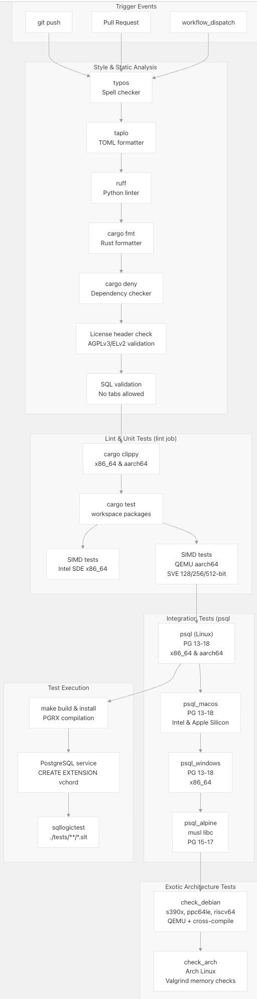
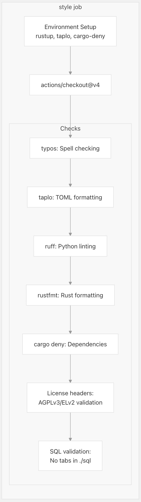
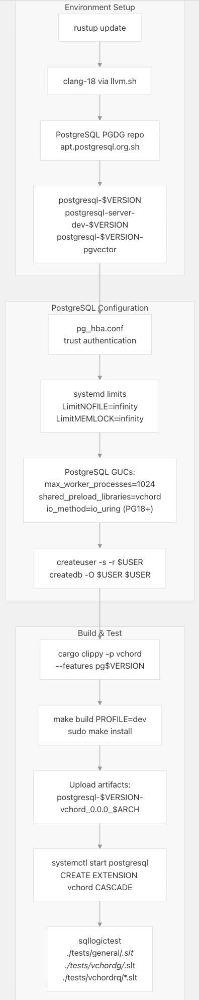
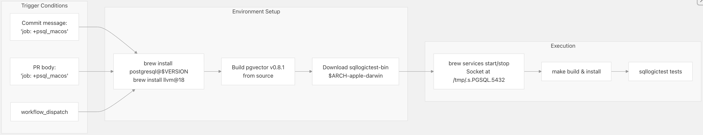
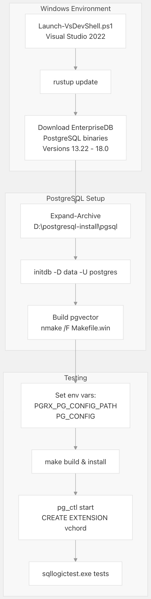
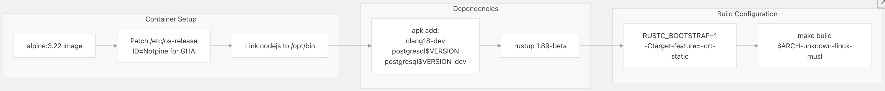
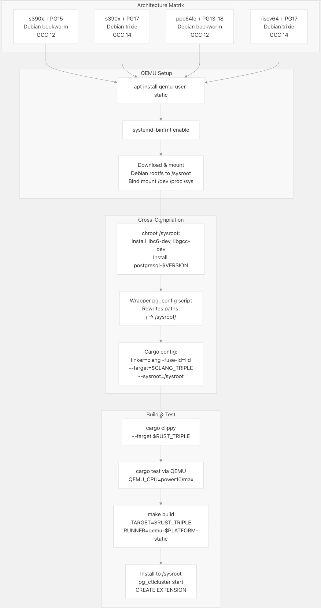
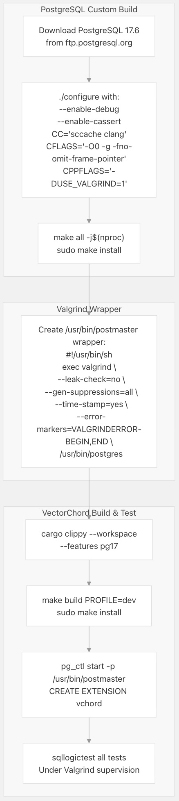
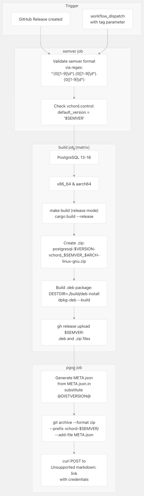

## VectorChord 源码学习: 5.3 CI/CD 管道 (Pipeline)    
                                                                    
### 作者                                                                    
digoal                                                                    
                                                                    
### 日期                                                                    
2025-11-02                                                                    
                                                                    
### 标签                                                                    
VectorChord , 源码学习                                                                    
                                                                    
----                                                                    
                                                                    
## 背景                         
本文分享 **VectorChord** 的**持续集成 (Continuous Integration, CI)** 和**持续部署 (Continuous Deployment, CD)** 基础设施 (infrastructure)，该设施通过 **GitHub Actions** 实现。该**管道 (pipeline)** 确保了代码质量、**跨平台兼容性 (cross-platform compatibility)**，以及针对 **PostgreSQL** 13-18 版本和多种架构 (architectures) 的自动化发布 (automated releases)。  
  
## 概述 (Overview)  
  
**VectorChord** 的 **CI/CD 管道 (pipeline)** 包含两个主要的 **GitHub Actions 工作流程 (workflows)**：  
  
| 工作流程 (Workflow) | 文件 (File) | 触发器 (Trigger) | 目的 (Purpose) |  
| :--- | :--- | :--- | :--- |  
| **检查 (Check)** | [`.github/workflows/check.yml`](https://github.com/tensorchord/VectorChord/blob/ac12e257/.github/workflows/check.yml) | Push (推送), **PR (Pull Request)**, 手动 (Manual) | **风格验证 (Style validation)**, **代码检查 (linting)**, **跨平台测试 (cross-platform testing)** |  
| **发布 (Release)** | [`.github/workflows/release.yml`](https://github.com/tensorchord/VectorChord/blob/ac12e257/.github/workflows/release.yml) | 发布标签 (Release tag), 手动 (Manual) | 构建**制品 (artifacts)**, 发布到 **GitHub**/**PGXN** |  
  
该**管道 (pipeline)** 针对以下内容进行测试：  
  
  * **PostgreSQL 版本 (versions)**: 13, 14, 15, 16, 17, 18  
  * **操作系统 (Operating systems)**: **Linux** (**Ubuntu**, **Alpine**, **Debian**, **Arch**), **macOS** (**Intel**/**Apple Silicon**), **Windows**  
  * **架构 (Architectures)**: **x86\_64**, **aarch64**, **s390x**, **ppc64le**, **riscv64**  
  * **模拟环境 (Emulated environments)**: **Intel SDE** (**x86 指令集 (instruction sets)**), **QEMU** (**ARM SVE**, **非典型架构 (exotic architectures)**)  
  
**来源 (Sources):**  
[`.github/workflows/check.yml` 1-968](https://github.com/tensorchord/VectorChord/blob/ac12e257/.github/workflows/check.yml#L1-L968)  
[`.github/workflows/release.yml` 1-147](https://github.com/tensorchord/VectorChord/blob/ac12e257/.github/workflows/release.yml#L1-L147)  
  
## 检查工作流程架构 (Check Workflow Architecture)  
  
    
  
**工作流程执行流程 (Workflow Execution Flow)**: `Check` **工作流程 (workflow)** 在**并行阶段 (parallel stages)** 中运行，`style` 和 `lint` **并发 (concurrently)** 执行，随后是**平台特定 (platform-specific)** 的**集成测试 (integration tests)**。每个 `psql*` **作业矩阵 (job matrix)** 独立地测试所有 **PostgreSQL** 版本。  
  
**来源 (Sources):**  
[`.github/workflows/check.yml` 3-11](https://github.com/tensorchord/VectorChord/blob/ac12e257/.github/workflows/check.yml#L3-L11)  
[`.github/workflows/check.yml` 13-101](https://github.com/tensorchord/VectorChord/blob/ac12e257/.github/workflows/check.yml#L13-L101)  
[`.github/workflows/check.yml` 102-163](https://github.com/tensorchord/VectorChord/blob/ac12e257/.github/workflows/check.yml#L102-L163)  
[`.github/workflows/check.yml` 164-263](https://github.com/tensorchord/VectorChord/blob/ac12e257/.github/workflows/check.yml#L164-L263)  
  
## 风格和代码检查作业 (Style and Linting Jobs)  
  
### 风格作业 (Style Job)  
  
`style` **作业 (job)** 在 **Ubuntu 24.04** 上运行，并执行**静态分析 (static analysis)** 而不进行**编译 (compilation)**：  
  
    
  
**主要验证规则 (Key validation rules)**：  
  
  * **Rustfmt**: 通过 `--config-path /dev/null` 强制执行 `imports_granularity=Module`  
    [`.github/workflows/check.yml` 38](https://github.com/tensorchord/VectorChord/blob/ac12e257/.github/workflows/check.yml#L38-L38)  
  * **许可证头 (License headers)**: 所有 `.rs`、`.c` 和 `.py` 文件必须包含 **AGPLv3/ELv2** 双重**许可证头 (license header)**  
    [`.github/workflows/check.yml` 44-96](https://github.com/tensorchord/VectorChord/blob/ac12e257/.github/workflows/check.yml#L44-L96)  
  * **SQL 格式化 (formatting)**: 通过 `grep -P '\t' -r ./sql` 禁止 **SQL** 文件中包含制表符 (tab characters)  
    [`.github/workflows/check.yml` 98-100](https://github.com/tensorchord/VectorChord/blob/ac12e257/.github/workflows/check.yml#L98-L100)  
  
**来源 (Sources):**  
[`.github/workflows/check.yml` 13-101](https://github.com/tensorchord/VectorChord/blob/ac12e257/.github/workflows/check.yml#L13-L101)  
  
### 代码检查作业 (Lint Job)  
  
`lint` **作业 (job)** 在 **x86\_64** 和 **aarch64** 上运行，测试**工作区包 (workspace packages)** 和 **SIMD 实现 (implementations)**：  
  
| 阶段 (Stage) | 命令 (Command) | 目的 (Purpose) |  
| :--- | :--- | :--- |  
| **Clippy** | `cargo clippy --workspace --exclude vchord` | 检查除主**扩展 (extension)** 外的所有 **crate**  
[`.github/workflows/check.yml` 139-140](https://github.com/tensorchord/VectorChord/blob/ac12e257/.github/workflows/check.yml#L139-L140) |  
| **单元测试 (Unit tests)** | `cargo test --workspace --exclude vchord --exclude simd` | 测试非 **SIMD** 代码  
[`.github/workflows/check.everytime.yml` 142-143](https://github.com/tensorchord/VectorChord/blob/ac12e257/.github/workflows/check.yml#L142-L143) |  
| **SIMD 测试 (x86)** | `cargo test -p simd` 通过 `/opt/sde/sde64 -spr` | 使用 **Intel SDE** 验证所有 **x86\_64 SIMD 层次 (tiers)**  
[`.github/workflows/check.yml` 145-151](https://github.com/tensorchord/VectorChord/blob/ac12e257/.github/workflows/check.yml#L145-L151) |  
| **SIMD 测试 (ARM)** | `cargo test -p simd` 通过 `qemu-aarch64-static -cpu max` | 测试 128/256/512 位的 **ARM NEON** 和 **SVE**  
[`.github/workflows/check.yml` 152-162](https://github.com/tensorchord/VectorChord/blob/ac12e257/.github/workflows/check.yml#L152-L162) |  
  
**环境配置 (Environment configuration)**：  
  
  * `SCCACHE_GHA_ENABLED=true`: 启用 **GitHub Actions** **Rust 编译 (compilation)** **缓存 (caching)**  
  * `RUSTC_WRAPPER=sccache`: **透明编译缓存 (Transparent compilation caching)**  
  * `RUSTFLAGS=-Dwarnings`: 将警告视为错误 (Treat warnings as errors)  
  
**Intel SDE 设置 (Setup)**: **工作流程 (workflow)** 为 **x86\_64 运行器 (runners)** 下载 **Intel 软件开发模拟器 (Software Development Emulator)** 9.48.0 到 `/opt/sde`，即使在较旧的硬件上，也能启用对 **AVX2**, **AVX-512**, 和 **VPOPCNTDQ 指令 (instructions)** 的验证  
[`.github/workflows/check.yml` 123-127](https://github.com/tensorchord/VectorChord/blob/ac12e257/.github/workflows/check.yml#L123-L127)  
  
**QEMU ARM 设置 (Setup)**: 对于 **aarch64 运行器 (runners)**，`qemu-aarch64-static` 通过 `sve-default-vector-length` 参数测试具有可配置**向量长度 (vector lengths)**（128/256/512 位）的 **ARM SVE**  
[`.github/workflows/check.yml` 129-162](https://github.com/tensorchord/VectorChord/blob/ac12e257/.github/workflows/check.yml#L129-L162)  
  
**来源 (Sources):**  
[`.github/workflows/check.yml` 102-163](https://github.com/tensorchord/VectorChord/blob/ac12e257/.github/workflows/check.yml#L102-L163)  
  
## PostgreSQL 集成测试 (Integration Testing)  
  
### Linux 集成 (psql job)  
  
主要的**集成测试矩阵 (integration test matrix)** 在 **Ubuntu 22.04** 上运行，适用于 **x86\_64** 和 **aarch64**：  
  
    
  
**配置要点 (Configuration highlights)**：  
  
  * **PostgreSQL 18 I/O**: 在 **Linux 5.1+** 上为**异步 I/O (async I/O)** 启用 `io_method = io_uring`  
    [`.github/workflows/check.yml` 214-216](https://github.com/tensorchord/VectorChord/blob/ac12e257/.github/workflows/check.yml#L214-L216)  
  * **共享预加载 (Shared preload)**: **扩展初始化 (extension initialization)** 需要 `shared_preload_libraries = "vchord"`  
    [`.github/workflows/check.yml` 218](https://github.com/tensorchord/VectorChord/blob/ac12e257/.github/workflows/check.yml#L218-L218)  
  * **Sqllogictest 标签 (labels)**: 使用 `--label pg$VERSION` 按 **PostgreSQL** 版本过滤测试，以用于**版本特定 (version-specific)** 的测试文件  
    [`.github/workflows/check.yml` 252-257](https://github.com/tensorchord/VectorChord/blob/ac12e257/.github/workflows/check.yml#L252-L257)  
  
**测试结构 (Test structure)**：  
  
  * `./tests/general/*.slt`: **核心功能测试 (Core functionality tests)**  
  * `./tests/vchordg/*.slt`: **基于图的索引测试 (Graph-based index tests)**  
  * `./tests/vchordrq/*.slt`: **残差量化索引测试 (Residual quantized index tests)**  
  * `./tests/vchordrq/pg17/*.slt`: **PostgreSQL 17+ 特定测试** (**TID64 支持 (support)**)  
  
**制品保留 (Artifact retention)**: 构建**制品 (artifacts)** 会上传并保留 14 天，用于**调试 (debugging)**  
[`.github/workflows/check.yml` 237-243](https://github.com/tensorchord/VectorChord/blob/ac12e257/.github/workflows/check.yml#L237-L243)  
  
**来源 (Sources):**  
[`.github/workflows/check.yml` 164-263](https://github.com/tensorchord/VectorChord/blob/ac12e257/.github/workflows/check.yml#L164-L263)  
  
### macOS 集成 (psql\_macos job)  
  
**macOS** **作业 (job)** 仅为**选择加入 (opt-in only)**，由特殊的**提交消息 (commit messages)** 或**工作流程调度 (workflow dispatch)** 触发：  
  
    
  
**选择加入的理由 (Rationale for opt-in)**: **macOS 运行器 (runners)** 在 **GitHub Actions** 中成本高昂，因此仅在通过提交消息 `job: +psql_macos` 或 **PR** 正文文本**明确请求 (explicitly requested)** 时运行测试  
[`.github/workflows/check.yml` 265-268](https://github.com/tensorchord/VectorChord/blob/ac12e257/.github/workflows/check.yml#L265-L268)  
  
**架构矩阵 (Architecture matrix)**: 测试 `aarch64` (**Apple Silicon**, **macos-15**) 和 `x86_64` (**Intel**, **macos-15-intel**) 两种架构  
[`.github/workflows/check.yml` 273-275](https://github.com/tensorchord/VectorChord/blob/ac12e257/.github/workflows/check.yml#L273-L275)  
  
**Homebrew 特性 (specifics)**：  
  
  * `HOMEBREW_NO_AUTO_UPDATE=1`: 防止 **CI** 期间 **Homebrew** 更新缓慢  
  * **自定义 CC 环境 (Custom CC environment)**: 使用 **Homebrew** 前缀中的 **LLVM 18**  
    [`.github/workflows/check.yml` 292](https://github.com/tensorchord/VectorChord/blob/ac12e257/.github/workflows/check.yml#L292-L292)  
  * **套接字等待 (Socket waiting)**: 重试 60 秒直到 **PostgreSQL** **套接字 (socket)** 出现  
    [`.github/workflows/check.yml` 296-297](https://github.com/tensorchord/VectorChord/blob/ac12e257/.github/workflows/check.yml#L296-L297)  
  
**来源 (Sources):**  
[`.github/workflows/check.yml` 264-355](https://github.com/tensorchord/VectorChord/blob/ac12e257/.github/workflows/check.yml#L264-L355)  
  
### Windows 集成 (psql\_windows job)  
  
**Windows** 测试使用 **EnterpriseDB PostgreSQL 二进制文件 (binaries)**：  
  
    
  
**与 Linux 的主要区别 (Key differences)**：  
  
  * **Visual Studio DevShell**: **C 编译 (compilation)** 所必需  
    [`.github/workflows/check.yml` 384](https://github.com/tensorchord/VectorChord/blob/ac12e257/.github/workflows/check.yml#L384-L384)  
  * **EnterpriseDB URL**: 针对每个 **PostgreSQL** 版本的特定下载 **URL**  
    [`.github/workflows/check.yml` 386-402](https://github.com/tensorchord/VectorChord/blob/ac12e257/.github/workflows/check.yml#L386-L402)  
  * **环境变量清理 (Environment variable cleanup)**: 清除 `PGBIN`、`PGDATA`、`PGROOT`、`PGUSER`、`PGPASSWORD` 以避免冲突  
    [`.github/workflows/check.yml` 380](https://github.com/tensorchord/VectorChord/blob/ac12e257/.github/workflows/check.yml#L380-L380)  
  * **pgvector 编译 (compilation)**: 使用带有 `PGROOT` 参数的 `nmake /F Makefile.win`  
    [`.github/workflows/check.yml` 419-420](https://github.com/tensorchord/VectorChord/blob/ac12e257/.github/workflows/check.yml#L419-L420)  
  
**来源 (Sources):**  
[`.github/workflows/check.yml` 356-470](https://github.com/tensorchord/VectorChord/blob/ac12e257/.github/workflows/check.yml#L356-L470)  
  
### Alpine Linux (psql\_alpine job)  
  
**Alpine** 测试使用 **Docker 容器 (containers)** 验证 **musl libc 兼容性 (compatibility)**：  
  
    
  
**Alpine 特定配置 (Alpine-specific configuration)** ：  
  
* 容器卷 (`Container volumes`): 挂载 (`Mounts`) `/opt` 以实现 `node`（节点）兼容性 [`.github/workflows/check.yml` 484-486](https://github.com/tensorchord/VectorChord/blob/ac12e257/.github/workflows/check.yml#L484-L486)  
* `os-release patch`（os-release 补丁）: 将 `ID=alpine` 更改为 `ID=NotpineForGHA`，以绕过 `GitHub Actions`（GitHub 操作）的检测 [`.github/workflows/check.yml` 500](https://github.com/tensorchord/VectorChord/blob/ac12e257/.github/workflows/check.yml#L500-L500)  
* 静态链接 (`Static linking`): 通过 `-Ctarget-feature=-crt-static` 禁用 `CRT`（C 运行时库）静态链接 [`.github/workflows/check.yml` 547](https://github.com/tensorchord/VectorChord/blob/ac12e257/.github/workflows/check.yml#L547-L547)  
* 不稳定特性 (`Unstable features`): 为了 `target-applies-to-host` 需要 `RUSTC_BOOTSTRAP=1` [`.github/workflows/check.yml` 549](https://github.com/tensorchord/VectorChord/blob/ac12e257/.github/workflows/check.yml#L549-L549)  
  
**PostgreSQL 设置的差异 (`PostgreSQL setup differences`)** :  
  
* 为 `/var/lib/postgresql` 手动创建目录，并将其所有权设为 `postgres`。  
* 使用 `pg_ctl` 而非 `systemd` 进行服务管理 [`.github/workflows/check.yml` 519-527](https://github.com/tensorchord/VectorChord/blob/ac12e257/.github/workflows/check.yml#L519-L527)  
  
**来源:** [`.github/workflows/check.yml` 471-588](https://github.com/tensorchord/VectorChord/blob/ac12e257/.github/workflows/check.yml#L471-L588)  
  
## Exotic Architecture Testing (异构架构测试)  
  
### Debian Cross-Compilation (Debian 交叉编译) (check_debian job)  
  
本测试针对 s390x (IBM 大型机)、ppc64le (PowerPC) 和 riscv64 架构，使用 **QEMU user-mode emulation** (QEMU 用户模式模拟) 进行。  
  
    
  
**QEMU 环境变量 (QEMU environment variables):**  
  
| 架构 (Architecture) | `QEMU_LD_PREFIX` | `QEMU_CPU` | 特殊处理 (Special handling) |  
| :--- | :--- | :--- | :--- |  
| s390x | `/sysroot` | `max` | - |  
| ppc64le | `/sysroot` | `power10` | 修复 `ld64.so.2` 和 `libm.so` 的符号链接 (Symlink fixes) [`.github/workflows/check.yml` 682-685](https://github.com/tensorchord/VectorChord/blob/ac12e257/.github/workflows/check.yml#L682-L685) |  
| riscv64 | `/sysroot` | `max` | - |  
  
**pg\_config 包装器 (pg\_config wrapper)**: 该工作流 (workflow) 创建了一个位于 `/usr/bin/pg_config` 的包装脚本 (wrapper script)，用于：  
  
1.  在 **chroot** (隔离环境) 内执行 `pg_config`。  
2.  使用 `sed` 将所有输出路径从 `/` 重写为 `/sysroot/` [`.github/workflows/check.yml` 700-705](https://github.com/tensorchord/VectorChord/blob/ac12e257/.github/workflows/check.yml#L700-L705)。  
  
这使得 **PGRX** 能够在为目标架构 (target architecture) 编译时找到 **PostgreSQL headers** (头文件)。  
  
**Cargo 交叉编译配置 (Cargo cross-compilation configuration):**  
  
```  
[target.$RUST_TRIPLE]  
runner = ["qemu-$PLATFORM-static"]  
linker = "clang"  
rustflags = [  
    "-Clink-arg=-fuse-ld=lld",  
    "-Clink-arg=--target=$CLANG_TRIPLE",  
    "-Clink-arg=--sysroot=/sysroot",  
    "-Dwarnings",  
]  
```  
  
此配置是在 [`.github/workflows/check.yml` 749-763](https://github.com/tensorchord/VectorChord/blob/ac12e257/.github/workflows/check.yml#L749-L763) 中动态生成的。  
  
**PostgreSQL 18 io\_uring**: 在 **QEMU** 上禁用，因为用户模式模拟 (user-mode emulation) 不支持 **io\_uring** (异步 I/O 机制) [`.github/workflows/check.yml` 718-721](https://github.com/tensorchord/VectorChord/blob/ac12e257/.github/workflows/check.yml#L718-L721)。  
  
**来源 (Sources):** [`.github/workflows/check.yml` 589-811](https://github.com/tensorchord/VectorChord/blob/ac12e257/.github/workflows/check.yml#L589-L811)  
  
### Arch Linux with Valgrind (check\_arch job)  
  
**Arch Linux with Valgrind (check_arch job)（使用 Valgrind 的 Arch Linux 任务）**  
  
**Arch Linux** 任务会从源码编译 **PostgreSQL**，并启用调试符号（**debugging symbols**），然后在 **Valgrind** 下运行所有测试：  
  
    
  
**PostgreSQL 编译标志（compilation flags）**：  
  
* `--enable-debug`：包含调试符号（**debug symbols**）  
* `--enable-cassert`：启用断言检查（**assertion checks**）  
* `-O0`：不进行优化，以便于调试（**debugging**）  
* `-fno-omit-frame-pointer -mno-omit-leaf-frame-pointer`：保留堆栈帧（**stack frames**），以便 **Valgrind** 使用  
* `-fasynchronous-unwind-tables`：启用回溯（**unwinding**），以获得更好的堆栈跟踪（**stack traces**）  
* `-DUSE_ASSERT_CHECKING=1`：附加的断言（**assertions**）  
* `-DRANDOMIZE_ALLOCATED_MEMORY=1`：检测未初始化的内存访问（**uninitialized memory access**）  
* `-DUSE_VALGRIND=1`：支持 **Valgrind** 的内存操作（**memory operations**）  
  
来源：[`.github/workflows/check.yml` 867-888](https://github.com/tensorchord/VectorChord/blob/ac12e257/.github/workflows/check.yml#L867-L888)  
  
**Valgrind 配置（configuration）**：  
  
* `--leak-check=no`：禁用内存泄漏检查（**leak checking**）（对于 CI 来说太慢）  
* `--gen-suppressions=all`：为已知问题生成抑制规则（**suppression rules**）  
* `--error-markers=VALGRINDERROR-BEGIN,VALGRINDERROR-END`：定界符，用于日志解析中的错误标记  
* `--trace-children=yes`：监控派生出的 **PostgreSQL worker** 进程  
  
来源：[`.github/workflows/check.yml` 897-902](https://github.com/tensorchord/VectorChord/blob/ac12e257/.github/workflows/check.yml#L897-L902)  
  
**调试设置（Debugging setup）**：设置 `DEBUGINFOD_URLS=https://debuginfod.archlinux.org` 以自动获取调试符号（**debug symbols**）。  
  
来源：[`.github/workflows/check.yml` 895](https://github.com/tensorchord/VectorChord/blob/ac12e257/.github/workflows/check.yml#L895-L895)  
  
**来源：** [`.github/workflows/check.yml` 812-968](https://github.com/tensorchord/VectorChord/blob/ac12e257/.github/workflows/check.yml#L812-L968)  
  
## 发布工作流程 (Release Workflow)  
  
`Release` **工作流程 (workflow)** 在推送**语义版本标签 (semantic version tag)**（例如 `v0.0.0`）时执行。它侧重于为所有支持的平台构建最终的、可用于**生产环境 (production-ready)** 的**制品 (artifacts)**，并将其发布到 **GitHub** 和 **PGXN**。  
  
  
  
**发布流程步骤**  
  
### 1\. 语义版本验证 (Semantic Version Validation)  
  
该**工作流程 (workflow)** 确保**标签 (tag)** 与 `pgrx` **cargo 项目版本 (project version)** 匹配：  
  
`semver` 作业使用严格的语义化版本控制正则表达式验证版本标签  
```  
^(0|[1-9]\d*)\.(0|[1-9]\d*)\.(0|[1-9]\d*)(?:-(...))?(?:\+(...)))?$  
```  
  
它还会验证 `vchord.control` 是否包含 `default_version` 匹配项：  
```  
grep -q "default_version = '${SEMVER}'" vchord.control || exit 1  
```  
  
[`.github/workflows/release.yml` 10-23](https://github.com/tensorchord/VectorChord/blob/ac12e257/.github/workflows/release.yml#L28-L32)  
  
[`.github/workflows/release.yml` 83](https://github.com/tensorchord/VectorChord/blob/ac12e257/.github/workflows/release.yml#L83-L83)  
  
### 2\. 构建矩阵 (Build Matrix)  
  
**构建矩阵 (build matrix)** 涵盖了 **操作系统 (OS)**、**架构 (architecture)** 和 **PostgreSQL 版本 (version)** 的 24 种组合：  
  
| 操作系统/架构 (OS/Arch) | PG 版本 (Versions) | PGXN 构建 (Build) | 打包 (Packaging) |  
| :--- | :--- | :--- | :--- |  
| **Ubuntu** (**x86\_64**) | 13-18 | 是 (Yes) | **Debian 包 (package)**, **ZIP** |  
| **macOS** (**x86\_64**) | 13-18 | 否 (No) | 仅 **ZIP** |  
| **Windows** (**x86\_64**) | 13-18 | 否 (No) | 仅 **ZIP** |  
| **Alpine** (**aarch64**) | 13-18 | 否 (No) | 仅 **ZIP** |  
  
`pgxn` **作业 (job)** 明确地只在 `x86_64` **运行器 (runner)** 上运行一次，使用 `pg16` 来上传**源归档 (source archive)**。  
  
构建命令:  
```  
make PG_CONFIG=$PG_CONFIG build  
```  
  
### 3\. ZIP 归档创建 (ZIP Archive Creation)  
  
所有构建都会生成一个可移植的 **ZIP 归档 (archive)**    
  
```  
(cd ./build/raw && zip -r ../postgresql-${VERSION}-vchord_${SEMVER}_${ARCH}-linux-gnu.zip .)  
```  
  
ZIP 中包含：  
  
  * `vchord.so` (**共享库 (shared library)**)  
  * `vchord.control` (**扩展元数据 (extension metadata)**)  
  * `vchord--$SEMVER.sql` (**安装脚本 (installation script)**)  
  * **升级脚本 (Upgrade scripts)** (`vchord--x.y--x.z.sql`)  
  
### 4\. Debian 软件包创建 (Debian Package Creation)  
  
该**工作流程 (workflow)** 生成一个具有正确**元数据 (metadata)** 的 `.deb` **软件包 (package)**：  
```  
Package: postgresql-${VERSION}-vchord  
Version: ${SEMVER}-1  
Depends: postgresql-${VERSION}, libgcc-s1, libc6 (>= 2.35)  
Section: database  
Priority: optional  
Architecture: ${PLATFORM}  
Maintainer: Tensorchord <support@tensorchord.ai>  
Description: Vector database plugin for Postgres, written in Rust, specifically designed for LLM  
Homepage: https://vectorchord.ai/  
License: AGPL-3.0-only or Elastic-2.0  
```  
  
[`.github/workflows/release.yml` 98-108](https://github.com/tensorchord/VectorChord/blob/ac12e257/.github/workflows/release.yml#L98-L108)  
  
该**软件包 (package)** 使用：  
  
  * `dpkg-deb --root-owner-group`: 确保**根所有权 (root ownership)**  
  * `-Zxz`: **XZ 压缩 (compression)**  
  * 所有已安装文件的 **MD5 校验和 (checksums)**  
    [`.github/workflows/release.yml` 109-110](https://github.com/tensorchord/VectorChord/blob/ac12e257/.github/workflows/release.yml#L109-L110)  
  
### 5\. GitHub 发布上传 (GitHub Release Upload)  
  
使用 **GitHub CLI** 上传**制品 (artifacts)**：  
```  
gh release upload --clobber $SEMVER \
  ./build/postgresql-${VERSION}-vchord_${SEMVER}-1_${PLATFORM}.deb \
  ./build/postgresql-${VERSION}-vchord_${SEMVER}_${ARCH}-linux-gnu.zip  
```  
  
[`.github/workflows/release.yml` 120-121](https://github.com/tensorchord/VectorChord/blob/ac12e257/.github/workflows/release.yml#L120-L121)  
  
`--clobber` **标志 (flag)** 会在重新上传时覆盖现有文件。  
  
### 6\. PGXN 发布 (PGXN Publishing)  
  
`pgxn` **作业 (job)** 在所有构建完成后运行：  
  
1.  **META.json 生成 (generation)**: 用实际版本替换 `META.json.in` 中的 `@DISTVERSION@`  
    [`.github/workflows/release.yml` 138](https://github.com/tensorchord/VectorChord/blob/ac12e257/.github/workflows/release.yml#L138-L138)  
2.  **Git 归档 (archive)**: 创建一个带有生成的 `META.json` 的**源 tarball (source tarball)**：  
    ```  
    git archive --format zip --prefix "vchord-${SEMVER}/" \
      --add-file META.json -o "./build/vchord--${SEMVER}.zip" HEAD  
    ```  
    [`.github/workflows/release.yml` 139](https://github.com/tensorchord/VectorChord/blob/ac12e257/.github/workflows/release.yml#L139-L139)  
3.  **PGXN 上传 (upload)**: **POST** 到 **PGXN 管理器 API (manager API)**：  
    ```  
    curl --fail -sS \
      --user "tensorchord:${PGXN_PASSWORD}" \
      -F "submit=Release It!" \
      -F "archive=@./build/vchord--${SEMVER}.zip" \
      -H "X-Requested-With: XMLHttpRequest" \
      https://manager.pgxn.org/upload  
    ```  
    [`.github/workflows/release.yml` 141-146](https://github.com/tensorchord/VectorChord/blob/ac12e257/.github/workflows/release.yml#L141-L146)  
  
**凭证 (Credentials)**: **PGXN 密码 (password)** 存储为 **GitHub 密钥 (secret)** `PGXN_PASSWORD`。  
  
**来源 (Sources):**  
[`.github/workflows/release.yml` 1-147](https://github.com/tensorchord/VectorChord/blob/ac12e257/.github/workflows/release.yml#L1-L147)  
  
## SIMD 验证策略 (Validation Strategy)  
  
**VectorChord** 的 **CI 管道 (pipeline)** 包含使用**硬件模拟 (hardware emulation)** 对 **SIMD 指令集 (instruction set)** 进行的**全面验证 (comprehensive validation)**：  
  
  
  
**Intel SDE 配置 (Configuration)**：  
**x86\_64 运行器 (runner)** 使用 **Intel SDE** 的 `-spr` **标志 (flag)** (**Sapphire Rapids**) 来**模拟 (emulate)** 最新的 **x86\_64 微架构 (microarchitecture)**：  
  
```  
cargo \
  --config 'target.'\''cfg(all())'\''.runner = ["/opt/sde/sde64", "-spr", "--"]' \
  test --locked -p simd -- --no-capture  
```  
  
[`.github/workflows/check.yml` 148-150](https://github.com/tensorchord/VectorChord/blob/ac12e257/.github/workflows/check.yml#L148-L150)  
  
这确保了所有 **SIMD 变体 (variants)** (**v2**, **v3**, **v4**, **v4+vpopcntdq**) 都能正确执行，即使 **GitHub Actions 运行器 (runner)** 不原生支持它们。  
  
**ARM SVE 配置 (Configuration)**：  
**aarch64 运行器 (runner)** 测试三种 **SVE 向量长度 (vector lengths)**：  
  
| 向量长度 (Vector length) | 字节宽度 (Byte width) | QEMU 参数 (parameter) | 用例 (Use case) |  
| :--- | :--- | :--- | :--- |  
| 128 位 (**-bit**) | 16 字节 (bytes) | `sve-default-vector-length=16` | **AWS Graviton3** |  
| 256 位 (**-bit**) | 32 字节 (bytes) | `sve-default-vector-length=32` | **Fujitsu A64FX** |  
| 512 位 (**-bit**) | 64 字节 (bytes) | `sve-default-vector-length=64` | **未来 ARM CPU** |  
  
[`.github/workflows/check.yml` 154-161](https://github.com/tensorchord/VectorChord/blob/ac12e257/.github/workflows/check.yml#L154-L161)  
  
每次测试运行都会验证 `simd` **crate** 是否在**运行时 (runtime)** 正确适应**向量长度 (vector length)**。  
  
**重要性 (Why this matters)**: **VectorChord** 的 `multiversion` **宏 (macro)** 为每个 **SIMD 级别 (level)** 生成不同的**代码路径 (code paths)**。如果没有**模拟 (emulation)**，则更高层次的 **SIMD 实现 (implementations)**（例如 **AVX-512**）中的 **Bug** 可能无法在具有较旧 **CPU** 的 **CI 运行器 (runners)** 上被捕获。  
  
**来源 (Sources):**  
[`.github/workflows/check.yml` 117-162](https://github.com/tensorchord/VectorChord/blob/ac12e257/.github/workflows/check.yml#L117-L162)  
  
## 条件作业执行 (Conditional Job Execution)  
  
有几个 **CI 作业 (jobs)** 设置了**选择加入 (opt-in)** 控制来节省**运行器 (runner)** 时间和成本：  
  
| 作业 (Job) | 默认行为 (Default behavior) | 选择加入触发器 (Opt-in trigger) |  
| :--- | :--- | :--- |  
| `psql` | 总是运行 (Always runs) | - |  
| `psql_macos` | 跳过 (Skipped) | 提交消息或 **PR** 正文中的 `job: +psql_macos` |  
| `psql_windows` | 跳过 (Skipped) | 提交消息或 **PR** 正文中的 `job: +psql_windows` |  
| `psql_alpine` | 跳过 (Skipped) | 提交消息或 **PR** 正文中的 `job: +psql_alpine` |  
| `check_debian` | 跳过 (Skipped) | 提交消息或 **PR** 正文中的 `job: +check_debian` |  
| `check_arch` | 跳过 (Skipped) | 提交消息或 **PR** 正文中的 `job: +check_arch` |  
  
**选择加入条件 (The opt-in condition)** 使用 **GitHub Actions 表达式 (expressions)**：  
  
```  
if: |  
  (github.event_name == 'push' && contains(github.event.head_commit.message, 'job: +psql_macos')) ||  
  (github.event_name == 'pull_request' && contains(github.event.pull_request.body, 'job: +psql_macos')) ||  
  github.event_name == 'workflow_dispatch'  
```    
  
[`.github/workflows/check.yml` 265-268](https://github.com/tensorchord/VectorChord/blob/ac12e257/.github/workflows/check.yml#L265-L268)  
  
**相反 (Conversely)**，主要的 `psql` **作业 (job)** 可以通过 `job: -psql` 跳过：  
  
```  
if: |  
  (github.event_name == 'push' && !contains(github.event.head_commit.message, 'job: -psql')) ||  
  (github.event_name == 'pull_request' && !contains(github.event.pull_request.body, 'job: -psql')) ||  
  github.event_name == 'workflow_dispatch'  
```  
  
[`.github/workflows/check.yml` 165-168](https://github.com/tensorchord/VectorChord/blob/ac12e257/.github/workflows/check.yml#L165-L168)  
  
这允许在**快速迭代 (rapid iteration)** 风格/**代码检查 (linting)** 修复时，无需等待完整的**平台测试 (platform tests)**。  
  
**来源 (Sources):**  
[`.github/workflows/check.yml` 165-168](https://github.com/tensorchord/VectorChord/blob/ac12e257/.github/workflows/check.yml#L165-L168)  
[`.github/workflows/check.yml` 265-268](https://github.com/tensorchord/VectorChord/blob/ac12e257/.github/workflows/check.yml#L265-L268)  
  
## 制品保留和分发 (Artifact Retention and Distribution)  
  
所有 **CI 作业 (jobs)** 都会上传**构建制品 (build artifacts)** 以用于**调试 (debugging)** 目的：  
  
```  
- name: Upload Artifacts  
  uses: actions/upload-artifact@v4  
  with:  
    name: postgresql-${{ matrix.version }}-vchord_0.0.0_${{ matrix.arch }}-linux-gnu  
    path: ./build/raw  
    compression-level: 9  
    retention-days: 14  
```  
  
[`.github/workflows/check.yml` 237-243](https://github.com/tensorchord/VectorChord/blob/ac12e257/.github/workflows/check.yml#L237-L243)  
  
**制品命名约定 (Artifact naming convention)**：  
  
```  
postgresql-{VERSION}-vchord_{SEMVER}_{ARCH}-{OS}-{LIBC}  
```  
  
示例：  
  
  * `postgresql-17-vchord_0.0.0_x86_64-linux-gnu` (**glibc**)  
  * `postgresql-16-vchord_0.0.0_aarch64-linux-musl` (**musl**)  
  * `postgresql-15-vchord_0.0.0_x86_64-apple-darwin` (**macOS**)  
  * `postgresql-14-vchord_0.0.0_x86_64-pc-windows-msvc` (**Windows**)  
  * `postgresql-17-vchord_0.0.0_s390x-linux-gnu` (**s390x**)  
  
`./build/raw` 的内容 (**Contents**)：  
  
  * **扩展共享库 (Extension shared library)**（`.so`、`.dylib` 或 `.dll`）  
  * **SQL 安装脚本 (installation scripts)**  
  * **控制文件元数据 (Control file metadata)**  
  * 生成的**升级脚本 (upgrade scripts)**  
  
这些**制品 (artifacts)** 允许**开发人员 (developers)** 在本地测试精确的 **CI 构建 (builds)**，而无需重新构建。  
  
**来源 (Sources):**  
[`.github/workflows/check.yml` 237-243](https://github.com/tensorchord/VectorChord/blob/ac12e257/.github/workflows/check.yml#L237-L243)  
[`.github/workflows/release.yml` 112-122](https://github.com/tensorchord/VectorChord/blob/ac12e257/.github/workflows/release.yml#L112-L122)  
  
## 环境变量和缓存 (Environment Variables and Caching)  
  
**CI 管道 (pipeline)** 使用多个**环境变量 (environment variables)** 进行**优化 (optimization)**：  
  
| 变量 (Variable) | 值 (Value) | 目的 (Purpose) |  
| :--- | :--- | :--- |  
| `SCCACHE_GHA_ENABLED` | `"true"` | 为 **sccache** 启用 **GitHub Actions 缓存后端 (cache backend)** |  
| `RUSTC_WRAPPER` | `"sccache"` | **透明缓存 (Transparently cache)** **Rust 编译 (compilation)** |  
| `RUSTFLAGS` | `"-Dwarnings"` | 将警告视为**编译错误 (compilation errors)** |  
| `CARGO_TERM_COLOR` | `"always"` | 在日志中强制显示**彩色输出 (colored output)** |  
| `RUST_BACKTRACE` | `"1"` | 为**程序崩溃 (panics)** 启用**回溯 (backtraces)** |  
| `RUSTUP_AUTO_INSTALL` | `"0"` | 防止 **rustup** 自动安装（已存在） |  
  
**Sccache 使用 (usage)**: **Mozilla** 的 `sccache-action` 设置了**分布式编译缓存 (distributed compilation caching)**：  
  
```  
- name: Set up Sccache  
  uses: mozilla-actions/sccache-action@v0.0.9  
```  
  
[`.github/workflows/check.yml` 133-134](https://github.com/tensorchord/VectorChord/blob/ac12e257/.github/workflows/check.yml#L133-L134)  
  
通过**缓存 (caching)**，这**显著减少 (dramatically reduces)** 了重复运行时的 **Rust 编译时间 (compilation time)**：  
  
  * 来自**依赖项 (dependencies)** 的**编译制品 (Compiled artifacts)**（例如 **pgrx**）  
  * 来自**宏 (macros)** 的**生成代码 (Generated code)**（例如 `multiversion`）  
  * **SIMD 构建制品 (build artifacts)**  
  
**Sccache 统计 (statistics)**: 该**动作 (action)** 在每个**作业 (job)** 结束时自动打印**缓存命中率 (cache hit rates)** 以监控**有效性 (effectiveness)**。  
  
**来源 (Sources):**  
[`.github/workflows/check.yml` 108-114](https://github.com/tensorchord/VectorChord/blob/ac12e257/.github/workflows/check.yml#L108-L114)  
[`.github/workflows/check.yml` 133-134](https://github.com/tensorchord/VectorChord/blob/ac12e257/.github/workflows/check.yml#L133-L134)  
  
  
#### [期望 PostgreSQL|开源PolarDB 增加什么功能?](https://github.com/digoal/blog/issues/76 "269ac3d1c492e938c0191101c7238216")
  
  
#### [PolarDB 开源数据库](https://openpolardb.com/home "57258f76c37864c6e6d23383d05714ea")
  
  
#### [PolarDB 学习图谱](https://www.aliyun.com/database/openpolardb/activity "8642f60e04ed0c814bf9cb9677976bd4")
  
  
#### [PostgreSQL 解决方案集合](../201706/20170601_02.md "40cff096e9ed7122c512b35d8561d9c8")
  
  
#### [德哥 / digoal's Github - 公益是一辈子的事.](https://github.com/digoal/blog/blob/master/README.md "22709685feb7cab07d30f30387f0a9ae")
  
  
#### [About 德哥](https://github.com/digoal/blog/blob/master/me/readme.md "a37735981e7704886ffd590565582dd0")
  
  

  
