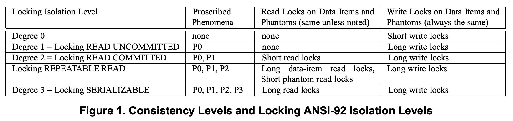
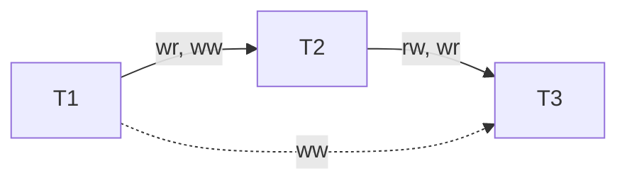
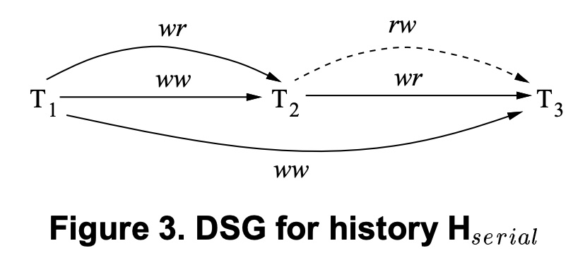
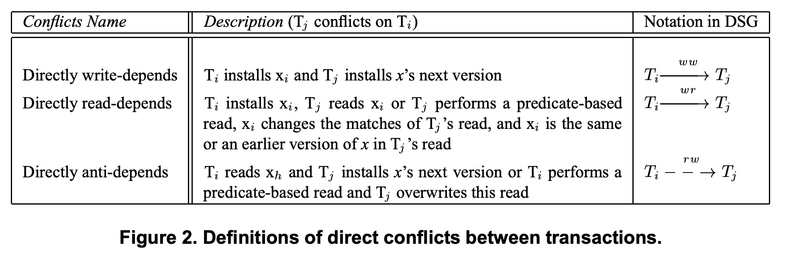
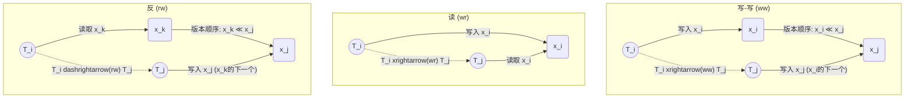
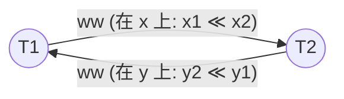
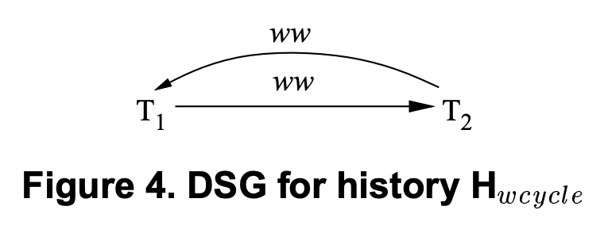
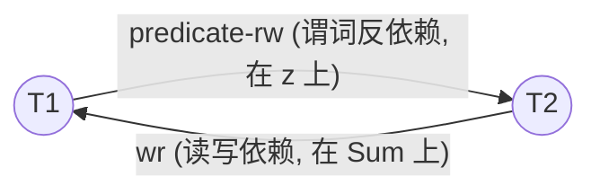
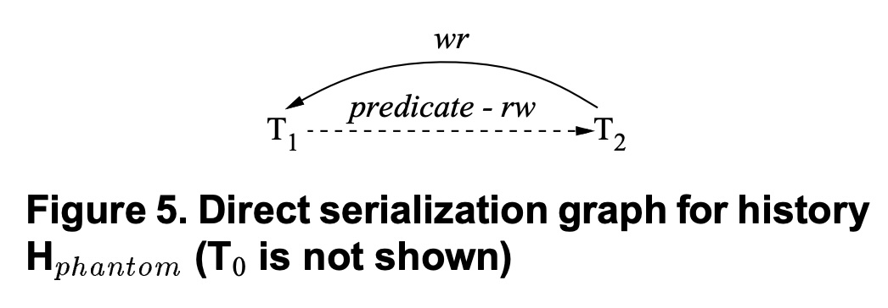
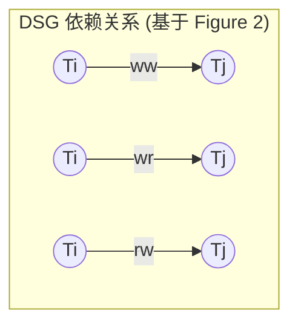

## AI论文解读 | Generalized Isolation Level Definitions
        
### 作者        
digoal        
        
### 日期        
2025-11-03        
        
### 标签        
PostgreSQL , PolarDB , DuckDB , AI , 论文解读        
        
----        
        
## 背景  
      
https://github.com/lonng/db-papers/blob/main/papers/transaction/generalized-isolation-level-definitions.pdf        
  
提示:          
```          
读懂《Generalized Isolation Level Definitions》这篇论文需要提前掌握哪些基础知识, 请使用中文通熟易懂的讲解这些基础知识, 可以引用论文中的图、表或使用Markdown支持的图形(text,mermaid等)增加解释性. 
  
使用中文通熟易懂的解读《Generalized Isolation Level Definitions》这篇论文, 其中的关键内容请着重讲解, 可以引用论文中的图、表或使用Markdown支持的图形(text,mermaid等)增加解释性. 
  
提取《Generalized Isolation Level Definitions》这篇论文中的重要术语, 使用中文对这些术语进行通熟易懂的讲解, 可以引用论文中的图、表或使用Markdown支持的图形(text,mermaid等)增加解释性. 
```     
  
## 1 前置知识 
  
要完全理解这篇相当有技术深度的论文（《广义隔离级别定义》） ，你需要先储备一些数据库理论的“基础知识”。这篇论文的目的是为数据库的**隔离级别**提供一套全新的、更通用的定义，这套定义不依赖于数据库内部用的是什么技术（比如锁或多版本） ，并且能正确处理“幻读”问题 。

想象一下，你要盖一座新奇的摩天大楼（论文的新定义），你首先得了解传统建筑学的基本原理（必备基础知识）。

以下是你需要掌握的 6 个核心基础知识，我会尽量用通俗的语言解释它们：

### 1\. 什么是事务 (Transaction) 与 ACID？

这是最基本、也最重要的概念。

  * **事务 (Transaction)**：就是一系列数据库操作（比如查询、插入、修改）的“**打包**”。这个包里的操作必须**要么全部成功，要么全部失败**。
      * *例子*：银行转账（从A账户扣款，给B账户加款）就是一个事务。绝不能出现A扣了款，B没收到的情况。
  * **ACID**：这是好事务的四个标准：
      * **A (Atomicity) - 原子性**：就是上面说的“要么全做，要么全不做”。
      * **C (Consistency) - 一致性**：事务执行前后，数据库都处于“合法”状态（比如，转账前后，银行的总钱数不变）。
      * **I (Isolation) - 隔离性**：**这是本文的核心！** 指的是多个事务同时运行时，它们互相感觉不到对方的存在，就像是排队一个一个在运行一样 。
      * **D (Durability) - 持久性**：事务一旦提交，它的修改就是永久的，即使数据库崩了也不能丢。

### 2\. 什么是并发控制 (Concurrency Control)？

  * **为什么需要并发？**
    如果所有事务都严格遵守“隔离性”，最简单的办法就是让它们排队（串行执行）。但这样性能太差了！银行窗口排长队，你肯定受不了。
  * **什么是并发？**
    为了提高性能，数据库会让多个事务**同时运行**（并发执行）。
  * **并发的麻烦：冲突 (Conflicts)**
    并发执行时，事务们可能会“打架”。比如：
      * **写-写冲突 (WW)**：两个事务同时修改同一个数据。
      * **读-写冲突 (RW)**：一个事务在读，另一个事务在改。
      * **写-读冲突 (WR)**：一个事务在改，另一个事务在读。
  * **并发控制 (Concurrency Control)**：就是数据库用来管理这些“打架”的机制，它试图在“性能”（让事务并发跑）和“隔离性”（别出乱子）之间找到平衡。

### 3\. 三大并发控制“流派”

这篇论文的一个核心论点是：以前的隔离级别定义，太偏爱“锁”这种流派了 ，导致其他流派（如乐观锁、MVCC）的优秀实现无法被标准所容纳 。所以，你得先知道这些流派是什么：

1.  **悲观锁 (Pessimistic Locking)**
      * *理念*：“先加锁，再办事”。它假设并发冲突很可能发生。
      * *做法*：事务在读数据时加“读锁”，写数据时加“写锁”。如果别的事务想操作这个数据，就必须等待锁被释放。
      * *典型代表*：两阶段锁定 (2PL)。
2.  **乐观锁 (Optimistic Concurrency Control, OCC)**
      * *理念*：“先办事，再检查”。它假设冲突很少发生。
      * *做法*：事务随便读写，但都是在自己的“小本本”上。等到要提交时，再去检查在它执行期间，它所读过的数据是否被别人改了。如果被改了，就提交失败（回滚），然后重试 。
3.  **多版本并发控制 (Multi-Version, MVCC)**
      * *理念*：“写新版，读旧版”。这是目前最主流的技术之一。
      * *做法*：修改数据时，不是直接覆盖旧数据，而是创建一个新版本的数据。这样，读操作可以去读旧版本，写操作可以创建新版本，读写互不阻塞。论文明确提到，他们的定义要能支持 MVCC 。

### 4\. 隔离级别 (Isolation Levels) 与 异常现象 (Phenomena)

这是本文要“重新定义”的主角。

完美的隔离性（就像串行执行）性能太差。因此，数据库标准 (ANSI SQL-92) 允许程序员牺牲一点隔离性来换取更高的性能 。这种“牺牲”会导致一些“灵异事件”，也叫**异常现象 (Phenomena)**。

  * **经典的异常现象：**

    1.  **脏读 (Dirty Read, P1)**：事务A读到了事务B**未提交**（后来可能回滚了）的数据。
    2.  **不可重复读 (Non-Repeatable Read, P2)**：事务A两次读取同一个数据，中间被事务B修改并提交了，导致两次读到的值不一样。
    3.  **幻读 (Phantom Read, P3)**：事务A两次执行同一个**范围查询**（例如 `WHERE age > 20`），中间被事务B插入或删除了数据，导致第二次查询的**结果集**（行数）变了，像见了“鬼影”一样 。

  * **经典的隔离级别：**
    SQL 标准定义了四个级别，级别越高，“灵异事件”越少，但性能也越差：

    1.  **READ UNCOMMITTED (读未提交)**：允许脏读、不可重复读、幻读。
    2.  **READ COMMITTED (读已提交)**：禁止脏读。
    3.  **REPEATABLE READ (可重复读)**：禁止脏读和不可重复读。
    4.  **SERIALIZABLE (可序列化)**：禁止所有异常，等同于串行执行。

**论文的切入点：**
论文指出，用P1、P2、P3这些“现象”来定义级别是**有歧义的** (ambiguous) 。而后来更精确的定义（比如论文 [8] 中提出的 P0-P3）又变成了“**变相的锁定义**” (disguised versions of locking) ，把乐观锁和MVCC都排除在外了。

论文中的 **图 1 (Figure 1)**  就清楚地展示了这种**基于锁的定义**：

| 锁隔离级别 (Locking Isolation Level) | 禁止的现象 (Proscribed Phenomena) | 读锁 (Read Locks) | 写锁 (Write Locks) |
| :--- | :--- | :--- | :--- |
| Degree 1 = Locking READ UNCOMMITTED | P0 | none | Long write locks |
| Degree 2 = Locking READ COMMITTED | P0, P1 | Short read locks | Long write locks |
| Locking REPEATABLE READ | P0, P1, P2 | Long data-item read locks | Long write locks |
| Degree 3 = Locking SERIALIZABLE | P0, P1, P2, P3 | Long read locks | Long write locks |



*（基于论文 Figure 1 简化）*

这篇论文就是要**推翻**这种与实现强绑定的定义。

### 5\. 可序列化 (Serializability) 与 序列化图 (Serialization Graph)

这是理解论文**核心方法论**的钥匙。

  * **可序列化 (Serializability)**：是隔离的“黄金标准”。它指并发执行的结果，**等价于**按 *某一种* 串行顺序执行的结果 。
  * **序列化图 (Serialization Graph, SG)**：是用来**检测**一个并发执行是否满足“可序列化”的数学工具。
      * **节点 (Node)**：图里的每个点代表一个事务（T1, T2...）。
      * **边 (Edge)**：如果 T1 的一个操作与 T2 的一个操作冲突，并且 T1 的操作先发生，就在 T1 和 T2 之间画一个**有向边** (T1 -\> T2)。
  * **黄金法则：**
    > **如果序列化图中没有环 (Cycle)，那么这个并发执行就是“可序列化”的。**

**这篇论文的方法论就是建立在这个基础上的！**

论文不谈P1, P2, P3这些模糊的“现象”，而是定义了一个更精确的图——**直接序列化图 (Direct Serialization Graph, DSG)** 。

这个DSG有三种边（依赖关系） ：

1.  **写-写依赖** ( ww, $T_i \xrightarrow{ww} T_j$ ) 
2.  **读-写依赖** ( wr, $T_i \xrightarrow{wr} T_j$ ) (论文里叫读依赖) 
3.  **写-读依赖** ( rw, $T_i \dashrightarrow T_j$ ) (论文里叫反依赖) 

然后，论文**通过定义DSG中“不允许出现哪种类型的环”来重新定义隔离级别** 。

  * 例如，它定义的 PL-1 级别，就是禁止“完全由 ww 边构成的环” 。
  * 它定义的 PL-3 (可序列化) 级别，就是禁止“所有类型的环” 。

看论文中的 **图 3 (Figure 3)** ，它就画了一个DSG，T1 和 T2 之间有 wr 和 ww 依赖，T2 和 T3 之间有 rw 和 wr 依赖，T1 和 T3 之间有 ww 依赖 。这个图没有环，所以是可序列化的 。





*（基于论文 Figure 3  的结构示意）*

### 6\. 谓词 (Predicates) 与 幻读的本质

  * **谓词 (Predicates)**：就是 SQL 里的 `WHERE` 条件子句 。
  * **幻读 (Phantoms)**：幻读（P3）之所以难处理，是因为它涉及的不是单个数据项，而是一个由 `WHERE` 子句定义的“**范围**”。锁住单个数据项无法阻止新数据项“溜进”这个范围。
  * **论文的贡献**：论文建立了一个精巧的模型，将“谓词查询”也纳入了序列化图中 。它会分析一个事务的**写**操作是否改变了另一个事务的**谓词读**操作的“匹配集” ，从而在 DSG 中建立相应的依赖边（rw 或 wr） 。

-----

### 总结

要读懂这篇论文，你需要：

1.  理解**事务 (ACID)** 的基本概念。
2.  知道**并发控制**是为了平衡**性能**与**隔离性**。
3.  熟悉**锁、乐观锁、MVCC** 这三种并发控制流派。
4.  熟知经典的**隔离级别**（读提交、可重复读等）和它们要解决的**异常现象**（脏读、幻读等）。
5.  **（最关键的）** 理解**可序列化**是通过**序列化图无环**来判断的。
6.  了解**谓词 (WHERE)** 是导致**幻读**的根本原因。

掌握了这些，你就能理解为什么作者要抛弃旧的定义，并看懂他们是如何巧妙地使用“序列化图中的环”来构建一个更通用、更精确的隔离级别新体系的。

你是否希望我详细解释一下，这篇论文是如何用“序列化图” (Serialization Graph) 来重新定义“不可重复读”或“幻读”的？
  
## 2 解读论文 
  
这是一篇在数据库领域具有里程碑意义的论文。它为数据库的“隔离级别”提供了一套全新的、更通用、更精确的定义。

简单来说，这篇论文解决了一个核心问题：**旧的SQL标准（SQL-92）对隔离级别的定义要么含糊不清 ，要么（在后续的修正中）过于依赖“锁”（Locking）这种特定的实现方式 ，这阻碍了数据库技术的发展。**

这篇论文的作者们（Adya, Liskov, O'Neil）提出了一套**与实现无关** (implementation-independent) 的新定义 。无论数据库在底层是用锁、用乐观锁  还是用多版本（MVCC），只要它能满足这套新定义，就被认为是正确的。

下面，我将为你通俗地解读这篇论文的关键内容。

### 1\. 问题的根源：旧定义的“枷锁”

想象一下，你想定义“安全驾驶”。

  * **旧的、含糊的定义 (ANSI SQL-92)**：“不发生事故” 。
      * *问题*：这太模糊了。“事故”怎么定义？差点撞上算不算？
  * **旧的、修正但狭隘的定义 (如论文[8]所述)**：“驾驶时，手必须握住方向盘的10点和2点钟方向，并且必须使用特定的A品牌轮胎” 。
      * *问题*：这确实能防止很多事故，但它把自动驾驶、单手驾驶（在某些情况下）以及使用B品牌轮胎的司机都排除在外了。这种定义是“**变相的锁定义**” (disguised versions of locking) 。

这篇论文指出，数据库界就面临后一个问题 。旧的定义（如论文[8]中的P0-P3现象）死板地规定了事务“不能做什么”（比如，当T1在读时，T2不能写），这本质上就是在描述“锁”的行为 。

**这有什么坏处？**
像 Oracle  或 Gemstone  这样的数据库，它们使用**多版本（MVCC）或乐观**技术，它们允许T1在读的同时T2去写（T2会写一个“新版本”的数据），它们也能实现完美的“可序列化”，但它们却不符合旧的、基于锁的定义 。

**这篇论文的目标**：我们要重新定义“安全驾驶”。我们不关心你怎么开（用锁、用MVCC、用乐观锁都行），我们只关心你驾驶的 **最终结果（历史）** 是不是“安全”的 。

-----

### 2\. 论文的核心工具：数据库模型与序列化图 (DSG)

为了建立新规则，作者首先定义了精确的工具。

#### A. 数据库模型：历史 (History) 与 版本顺序 (Version Order)

论文建立在一个**多版本 (multi-version)** 数据库模型上 。

1.  **历史 (History)**：记录了所有事务的操作（读、写、提交、中止）。
2.  **版本顺序 ( $\ll$ )**：这是最关键的概念之一。对于数据库中的**每一个数据项**（比如x），所有**已提交**的事务对x的写入，都会有一个最终的、唯一的“版本顺序” 。
      * 例如，即使T1先提交，T2后提交，数据库系统也可能决定T2的写入（ $x_2$ ）在版本顺序上“先于”T1的写入（ $x_1$ ），记为 $x_2 \ll x_1$ 。
      * 这个“版本顺序”才是决定事务逻辑顺序的根本，而不是它们的提交时间。

#### B. 核心武器：直接序列化图 (Direct Serialization Graph - DSG)

DSG是用来判断“历史”是否“安全”的最终工具 。

  * **节点 (Node)**：图中的每个点代表一个**已提交**的事务（ 如 $T_1$ , $T_2$ ）。
  * **边 (Edge)**：如果两个事务发生了“冲突”，就在它们之间画一条有向边。

论文定义了三种关键的“依赖”（即冲突）关系，你可以从论文的 **图 2 (Figure 2)** 中看到它们的总结：     

1.  **写-写 依赖 (ww-dependency)**: $T_i \xrightarrow{ww} T_j$

      * *含义*： $T_i$ 写入了 $x_i$ 版本， $T_j$ 写入了 $x_j$ 版本，并且在最终的“版本顺序”中， $x_i$ 恰好在 $x_j$ 的**前一个** 。
      * *可以理解为*： $T_j$ 覆盖了 $T_i$ 的写入。

2.  **读 依赖 (wr-dependency)**: $T_i \xrightarrow{wr} T_j$

      * *含义*： $T_j$ **读取**了 $T_i$ 写入的版本 $x_i$ 。
      * *可以理解为*： $T_j$ 依赖于 $T_i$ 的数据。

3.  **反 依赖 (rw-dependency)**: $T_i \dashrightarrow T_j$ (注意是虚线)

      * *含义*： $T_i$ **读取**了 $x_k$ 版本，而 $T_j$ 写入了 $x_j$ 版本，并且 $x_j$ 是 $x_k$ 的**下一个**版本 。
      * *可以理解为*： $T_j$ 的写入使得 $T_i$ 的读取“过时”了。




#### C. 如何处理“幻读” (Phantoms)？

“幻读”是旧标准最头疼的问题。它指的是 $T_1$ 第一次查询（例如 `WHERE age > 20`）有10行，但 $T_2$ 插入了一行 `age=25`， $T_1$ 再次查询时变成了11行。

论文用了一个极其聪明的模型来捕捉它 ：
当 $T_1$ 执行 `WHERE age > 20` 时，系统（在概念上）会为 $T_1$ 选择一个**版本集 (Version set)** 。这个集合**包含了该表中所有元组的一个版本** ，包括那些还未插入（unborn）的元组 。

  * $T_1$ 第一次读，它读到了 $z_{init}$ （一个“未出生”的版本）。
  * $T_2$ 插入了 $z_2$ （一个可见的 `age=25` 的版本）。
  * 在版本顺序中， $z_{init} \ll z_2$ 。
  * $T_1$ 的读取（`WHERE` 条件）依赖于 $z_{init}$ ，而 $T_2$ 写入了 $z_{init}$ 的“下一个”版本 $z_2$ 。
  * 这就构成了一个**反依赖 (rw-dependency)**： $T_1 \dashrightarrow T_2$ 。

通过这种方式， **“幻读”问题被巧妙地转化为了一个普通的“反依赖”问题** 。

-----

### 3\. 关键成果：用“图的环”重新定义隔离级别

有了DSG这个武器，定义隔离级别就变得非常清晰了。论文用 "G" (Generalized) 现象来命名新的定义 。

**核心思想：隔离级别越高，DSG中允许的“环” (Cycle) 就越少。**

#### 级别 1: PL-1 (类比旧的 READ UNCOMMITTED)

  * **禁止现象 G0: 写循环 (Write Cycles)** 。
  * *含义*：DSG中不允许出现**只由 $ww$ 边**组成的环 。
  * *例子 (论文 $H_{wcycle}$  和 图 4 )*：  
      * $T_1$ 写 x, $T_2$ 写 y。
      * 版本顺序： $x_1 \ll x_2$ (在x上， $T_1$ 在 $T_2$ 前)
      * 版本顺序： $y_2 \ll y_1$ (在y上， $T_2$ 在 $T_1$ 前)
      * *结果*： $T_1 \xrightarrow{ww} T_2$ 并且 $T_2 \xrightarrow{ww} T_1$ 。这构成了一个 **ww-环**，在PL-1中被禁止。




   

*（基于论文 Figure 4  所示的 G0 循环）*

#### 级别 2: PL-2 (类比旧的 READ COMMITTED)

  * **禁止现象 G1: 脏读相关的循环和读取**。

  * G1 是一个“现象大礼包”，它禁止三件事：

    1.  **G1a: 读已中止 (Aborted Reads)**：禁止已提交的 $T_2$ 读取了已中止的 $T_1$ 的数据 。
    2.  **G1b: 读中间值 (Intermediate Reads)**：禁止 $T_2$ 读取 $T_1$ 的“中间”写入（ $T_1$ 后来又写了新的 ）。
    3.  **G1c: 循环信息流 (Circular Information Flow)**：禁止DSG中出现**只由 $ww$ 和 $wr$ 边**组成的环 。

  * *含义*：PL-2 确保你只读到“已提交”并且是“最终”的数据版本，并且事务间的依赖（写和读）不能形成循环。

#### 级别 3: PL-2.99 (类比旧的 REPEATABLE READ)

这个级别非常关键，它精准地定义了“允许幻读，但不允许不可重复读”。

  * **禁止现象 G1 (同上) 和 G2-item**。
  * **G2-item: 数据项反依赖循环 (Item Anti-dependency Cycles)** 。
  * *含义*：禁止DSG中出现包含 **数据项（item）** 的 $rw$ 边的环 。
  * *重点*：它**允许**由 **谓词（predicate）** 的 $rw$ 边（也就是“幻读”边）构成的环 。

#### 级别 4: PL-3 (类比旧的 SERIALIZABLE)

这是最高级别，等同于**冲突可序列化 (conflict-serializability)** 。

  * **禁止现象 G1 和 G2**。
  * **G2: 反依赖循环 (Anti-dependency Cycles)** 。
  * *含义*：禁止DSG中出现**任何**包含 $rw$ 边（无论是数据项还是谓词）的环 。
  * **黄金法则**：在PL-3级别，**DSG 必须无环 (acyclic)** 。

-----

### 4\. PL-2.99 vs PL-3：精准“狙击”幻读

让我们用论文中的 $H_{phantom}$ 例子  和 **图 5 (Figure 5)** 来看清PL-2.99和PL-3的本质区别。

  * **场景 $H_{phantom}$** ：

    1.  $T_1$ 执行 `SELECT SUM(sal) FROM Emp WHERE Dept=Sales`。它（概念上）读取了 x, y 和一个“未出生”的 z ( $z_0$ ) 。
    2.  $T_2$ **插入**了一条新员工 z ( $z_2$ ) 到 Sales 部门，并**更新**了总工资 Sum ( $Sum_2$ ) 。
    3.  $T_1$ 再次读取总工资 Sum，读到了 $Sum_2$ 。
    4.  $T_1$ 发现自己计算的 Sum 和读到的 $Sum_2$ 不一致 。

  * **DSG 分析 (见论文 图 5)**：

    1.  $T_2$ 更新了 Sum， $T_1$ 读到了 $Sum_2$ 。
          * 依赖： $T_2 \xrightarrow{wr} T_1$
    2.  $T_1$ 基于谓词 `Dept=Sales` 读取了“未出生”的 z ( $z_0$ )， $T_2$ 插入了 $z_2$ （ $z_0$ 的下一个版本 ）。
          * 依赖： $T_1 \dashrightarrow T_2$ (**这是一个谓词反依赖**)

  * **结果**：DSG中出现了一个环。




   

*（基于论文 Figure 5 所示的幻读循环）*

  * **结论**：
      * 在 **PL-2.99** (REPEATABLE READ) 中：这个环是**允许**的。因为它包含的是一个**谓词 (predicate)** 反依赖边，而 PL-2.99 只禁止**数据项 (item)** 的反依赖环 。因此，**幻读发生**。
      * 在 **PL-3** (SERIALIZABLE) 中：这个环是**禁止**的。因为它禁止**所有**反依赖环 (G2)，不管它是来自数据项还是谓词 。因此，**幻读被阻止**。

### 总结：这篇论文的重大贡献

1.  **提供了与实现无关的定义** ：
    它不再强迫数据库使用“锁”。任何并发控制技术（锁、MVCC、乐观锁），只要其产生的“历史”在DSG中没有引入被禁止的“环”，就是合法的 。
2.  **精确且灵活地处理了谓词 (幻读)** ：
    它首次在理论上将“幻读”无缝地统一到了反依赖 (rw-dependency) 的框架中 ，使得（例如）REPEATABLE READ 和 SERIALIZABLE 之间的界限变得无比清晰。
3.  **为现代数据库奠定了理论基石**：
    当今主流的 MVCC 数据库（如 PostgreSQL, Oracle, MySQL InnoDB）之所以能够提供高性能的并发，其隔离级别的正确性理论，很大程度上都建立在这篇论文提出的模型之上。
  
## 3 术语 
  
这篇论文《广义隔离级别定义》是数据库领域的一篇经典著作，它为数据库的“隔离级别”提供了一套全新的、更精确且**与具体实现无关**的定义 。

以下是这篇论文中几个最关键的术语，我会用通俗的语言为你解释它们：

-----

### 1\. 核心目标与问题

#### 隔离级别 (Isolation Levels)

  * **通俗讲解**：隔离级别就像你在使用一个在线共享文档（比如Google Docs）时的“隐私设置” 。
      * **最高级别 (SERIALIZABLE)**：你编辑时，别人完全感觉不到你的存在，就像你“锁住”了文档。别人必须等你完成后才能看或编辑。这最安全（一致性高），但性能最差（等待时间长） 。
      * **最低级别 (READ UNCOMMITTED)**：你打的每一个字，别人都能实时看到，哪怕你还没保存（提交），甚至你最后还撤销了（中止）。这性能最好（无等待），但最混乱（一致性差）。
  * **论文中的意义**：商业数据库允许程序员在“一致性”和“性能”之间做权衡 。但这篇论文指出，旧的 ANSI SQL 标准对这些级别的定义是模糊不清的 。

#### 实现无关 (Implementation-Independent)

  * **通俗讲解**：想象一下，我们要定义“通过驾驶考试”。
      * **旧的（实现相关）定义**：你必须使用“手动挡汽车”（**锁 / Locking**），并且双手要握在方向盘的特定位置。
      * **新的（实现无关）定义**：我们不关心你开的是“手动挡”（**锁**）、“自动挡”（**多版本 / Multi-version**） 还是“自动驾驶”（**乐观锁 / Optimistic**）。我们只关心你最终的驾驶表现（**历史 / History**）是否安全、是否遵守了交通规则。
  * **论文中的意义**：论文的目标是提供一套“实现无关”的规范 。旧的修正定义（[8]）是“变相的锁定义” ，这扼杀了使用乐观锁或多版本等更优技术的可能性 。

#### 预防性方法 (Preventative Approach)

  * **通俗讲解**：这是论文对“旧的、基于锁的定义”的称呼 。这种方法为了防止出问题（例如两个事务同时修改一个数据），干脆“阻止”它们并发执行（即加锁）。
  * **论文中的意义**：作者认为这种方法“限制性过强” (overly restrictive) ，因为它禁止了许多明明是安全、合法的并发操作（比如在乐观锁或MVCC中）。

-----

### 2\. 论文的核心模型

为了建立新定义，论文首先定义了它的“世界观”（模型）。

#### 历史 (History)

  * **通俗讲解**：数据库的“行车记录仪”。它忠实地记录了所有事务执行的每一个操作（读、写、提交、中止）的顺序 。
  * **论文中的意义**：论文的定义是基于分析一个“历史”是否“好”来进行的，而不是基于分析数据库的“实现机制” 。

#### 版本顺序 ( Version Order, $\ll$ )

  * **通俗讲解**：这是论文的一个关键创举。对于数据库中的**任何一个数据项**（ 比如 $x$ ），所有**已提交**的事务对 $x$ 的写入，都会有一个最终的、唯一的“版本顺序” 。
  * **关键点**：这个“版本顺序” **不一定** 等于事务的“提交顺序” 。
  * **示例**（基于论文 $H_{write-order}$ ：
    1.  $T_1$ 写入 $x_1$ 并提交。
    2.  $T_2$ 写入 $x_2$ 并在 $T_1$ 之后提交。
    3.  系统**可以**决定，在逻辑上， $T_2$ 的写入应该在 $T_1$ 之前。此时版本顺序就是 $x_2 \ll x_1$ 。这种灵活性是 MVCC 系统工作的基础。

#### 谓词 (Predicates) & 版本集 (Version set)

  * **通俗讲解**：
      * **谓词 (Predicates)**：就是 SQL 里的 `WHERE` 子句（例如 `WHERE age > 30`）。这是导致“幻读” (Phantoms) 的根源 。
      * **版本集 (Version set)**：为了精确定义“幻读”，论文建立了一个模型。当你执行一个 `WHERE` 查询时，系统（在概念上）会为你选择一个“版本集” 。这个集合**包含了该表中所有元组的一个版本**（包括那些还未插入的“未出生”版本）。
  * **论文中的意义**：通过这个模型，当一个事务 $T_2$ **插入**了一条新数据（创造了一个“可见”版本）时，它就与 $T_1$ 读取的那个“未出生”版本发生了冲突。这样，“幻读”就被巧妙地转换成了一个可分析的数据冲突。

-----

### 3\. 新的定义：依赖图 (DSG) 与 环 (Cycles)

这是论文最核心的贡献。它使用“图论”来重新定义隔离级别。

#### 依赖 (Dependencies)

  * **通俗讲解**：如果 $T_2$ 的操作依赖了 $T_1$ 的操作（或者反过来），我们就在 $T_1$ 和 $T_2$ 之间画一条“依赖”的边。
  * **论文中的意义**：作者在论文的 **图 2 (Figure 2)** 中定义了三种核心依赖：      

| 依赖名称 | 描述（ $T_j$ 依赖 $T_i$ ） | 图 2 中的记号 | 通俗理解 |
| :--- | :--- | :--- | :--- |
| **Directly write-depends** (写依赖) | $T_i$ 写入了 $x_i$ ， $T_j$ 写入了 $x_i$ 的下一个版本 $x_j$  | $T_i \xrightarrow{ww} T_j$ | $T_j$ 覆盖了 $T_i$ 的写入。 |
| **Directly read-depends** (读依赖) | $T_j$ 读取了由 $T_i$ 写入的 $x_i$ 版本  | $T_i \xrightarrow{wr} T_j$ | $T_j$ 的数据来源于 $T_i$ 。 |
| **Directly anti-depends** (反依赖) | $T_i$ 读取了 $x_k$ 版本，而 $T_j$ 写入了 $x_k$ 的下一个版本 $x_j$  | $T_i \dashrightarrow T_j$ | $T_j$ 的写入使 $T_i$ 的读取“过时”了。 |

#### 直接序列化图 (Direct Serialization Graph - DSG)

  * **通俗讲解**：一个“项目依赖图”。
      * **节点 (Node)**：图上的点，代表每一个**已提交**的事务 。
      * **边 (Edge)**：图上的箭头，代表上面三种“依赖” 。
  * **论文中的意义**：DSG 是分析一个“历史” (History) 是否“好”的最终工具 。




#### 新的现象 (G-Phenomena) 与 新的级别 (PL-Levels)

论文用“DSG中禁止出现哪种类型的**环 (Cycle)**”来定义新的隔离级别 。一个“环”代表了一个逻辑悖论（ 比如 $T_1$ 依赖 $T_2$ ，同时 $T_2$ 又依赖 $T_1$ ），这说明历史是“坏的”。

  * **PL-1 (禁止 G0: 写循环)**
      * **G0 (Write Cycles)**：DSG 中出现一个**纯 $ww$ 边**组成的环 。
      * *例子 (论文 图 4)*： $T_1$ 覆盖 $T_2$ (在数据 $x$ 上)， $T_2$ 又覆盖 $T_1$ (在数据 $y$ 上) 。这是一个 $ww$ 环，PL-1 禁止它 。     
  * **PL-2 (禁止 G1: 循环信息流)**
      * **G1**：禁止由 $ww$ 和 $wr$ 边组成的环 。并且禁止读取“中止事务”的数据 (G1a)  和“非最终”的数据 (G1b) 。
      * *意义*：确保你只读到已提交的、最终的数据。
  * **PL-3 (禁止 G1, G2: 所有环)**
      * **G2 (Anti-dependency Cycles)**：DSG 中出现包含 $rw$ （反依赖）边的环 。
      * *意义*：**PL-3 (等同于 SERIALIZABLE)**  禁止**所有类型**的环 。一个无环的 DSG 图，即代表着一个“完美”的、可序列化的历史 。

-----

### 4\. 最精妙的定义：PL-2.99 (可重复读)

  * **通俗讲解**：这个级别精准地定义了“**允许幻读，但禁止不可重复读**”。
  * **论文中的意义**：
      * 论文将 $rw$ （反依赖）环分成了两种：
        1.  **G2-item**：在**特定数据项**上的 $rw$ 环（不可重复读）。
        2.  **Predicate-rw**：在**谓词**上的 $rw$ 环（幻读）。
      * **PL-2.99** (即 REPEATABLE READ)  被定义为：**禁止 G1 和 G2-item** 。
      * 这意味着 PL-2.99 **允许**由“谓词反依赖” (Predicate-rw) 构成的环存在。
  * **示例 (论文 图 5)**：     
      * 论文中的 $H_{phantom}$ 例子 展示了一个“幻读”场景。
      * $T_1$ 读了一个范围 (谓词)， $T_2$ 在该范围插入了新数据。
      * 这在 DSG 中产生了一个环，其中一条边是 $T_1 \dashrightarrow T_2$ (谓词反依赖)，另一条是 $T_2 \xrightarrow{wr} T_1$ 。
      * 在 **PL-3** 中，这个环**被禁止**。
      * 在 **PL-2.99** 中，这个环是**被允许**的，因为它是由“谓词” $rw$ 边引起的，而不是“数据项” $rw$ 边 。
  
## 参考        
         
https://github.com/lonng/db-papers/blob/main/papers/transaction/generalized-isolation-level-definitions.pdf    
        
<b> 以上内容基于DeepSeek、Qwen、Gemini及诸多AI生成, 轻微人工调整, 感谢杭州深度求索人工智能、阿里云、Google等公司. </b>        
        
<b> AI 生成的内容请自行辨别正确性, 当然也多了些许踩坑的乐趣, 毕竟冒险是每个男人的天性.  </b>        
    
#### [期望 PostgreSQL|开源PolarDB 增加什么功能?](https://github.com/digoal/blog/issues/76 "269ac3d1c492e938c0191101c7238216")
  
  
#### [PolarDB 开源数据库](https://openpolardb.com/home "57258f76c37864c6e6d23383d05714ea")
  
  
#### [PolarDB 学习图谱](https://www.aliyun.com/database/openpolardb/activity "8642f60e04ed0c814bf9cb9677976bd4")
  
  
#### [PostgreSQL 解决方案集合](../201706/20170601_02.md "40cff096e9ed7122c512b35d8561d9c8")
  
  
#### [德哥 / digoal's Github - 公益是一辈子的事.](https://github.com/digoal/blog/blob/master/README.md "22709685feb7cab07d30f30387f0a9ae")
  
  
#### [About 德哥](https://github.com/digoal/blog/blob/master/me/readme.md "a37735981e7704886ffd590565582dd0")
  
  

  
