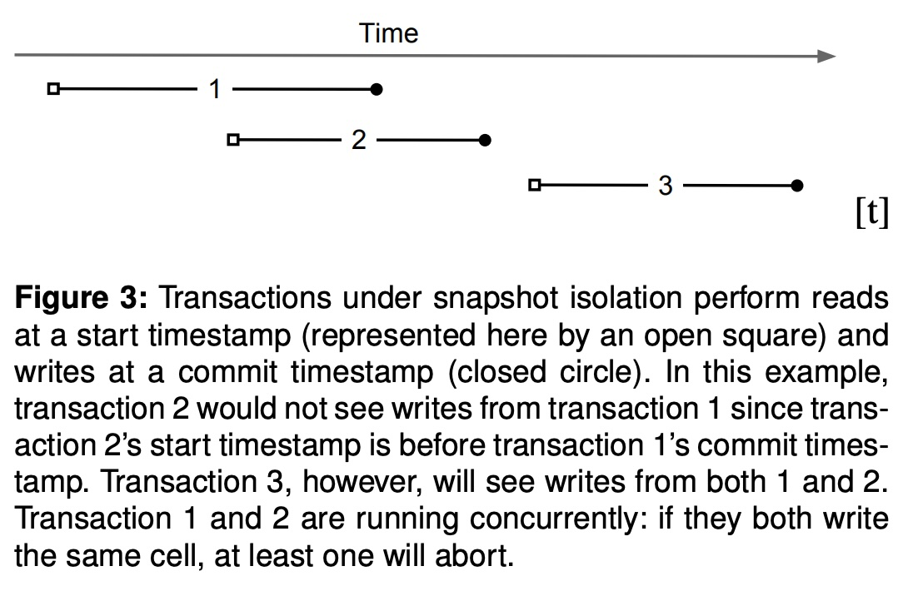
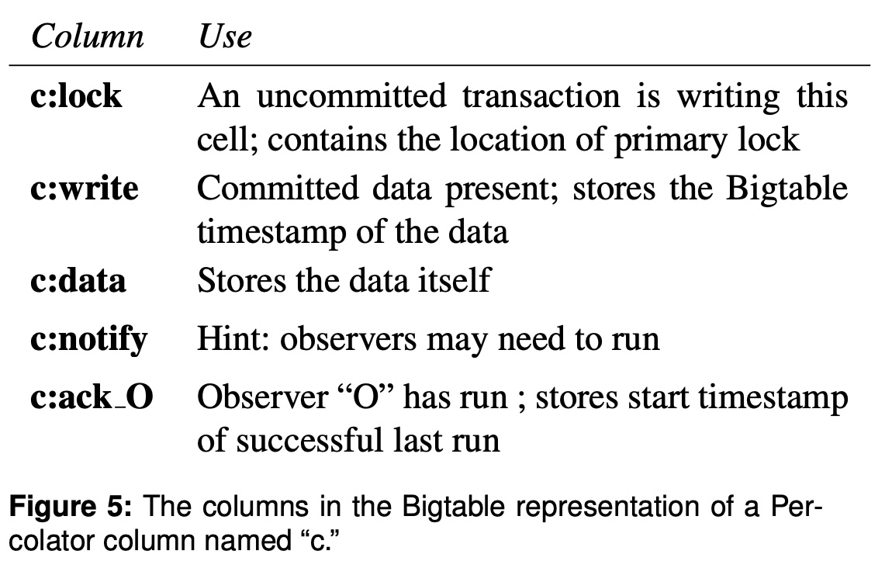

## AI论文解读 | Large-Scale Incremental Processing Using Distributed Transactions And Notifications
        
### 作者        
digoal        
        
### 日期        
2025-11-03        
        
### 标签        
PostgreSQL , PolarDB , DuckDB , AI , 论文解读        
        
----        
        
## 背景  
      
https://github.com/lonng/db-papers/blob/main/papers/transaction/large-scale-incremental-processing-using-distributed-transactions-and-notifications.pdf        
  
提示:          
```          
读懂《Large-Scale Incremental Processing Using Distributed Transactions And Notifications》这篇论文需要提前掌握哪些基础知识, 请使用中文通熟易懂的讲解这些基础知识, 可以引用论文中的图、表或使用Markdown支持的图形(text,mermaid等)增加解释性. 
  
使用中文通熟易懂的解读《Large-Scale Incremental Processing Using Distributed Transactions And Notifications》这篇论文, 其中的关键内容请着重讲解, 可以引用论文中的图、表或使用Markdown支持的图形(text,mermaid等)增加解释性. 
  
提取《Large-Scale Incremental Processing Using Distributed Transactions And Notifications》这篇论文中的重要术语, 使用中文对这些术语进行通熟易懂的讲解, 可以引用论文中的图、表或使用Markdown支持的图形(text,mermaid等)增加解释性. 
```     
  
## 1 前置知识 
  
要读懂这篇关于Percolator的经典论文，你需要对几个核心的计算机科学概念有基本的了解。这篇论文介绍了一个用于大规模增量处理的系统 ，它彻底改变了Google的索引系统 。

简单来说，Percolator被设计用来解决一个问题：**如何快速处理源源不断到来的新数据，并用它们来更新一个“超级巨大”的数据库** ，而不是像以前那样，每次都把所有新旧数据“一锅端”重新处理一遍 。

以下是你需要预先掌握的基础知识，我会用通俗的语言来解释：

### 1\. 基础概念：分布式系统 (Distributed Systems)

Percolator是一个运行在上千台机器上的系统 。因此，你首先要懂分布式系统的基本“游戏规则”：

  * **可扩展性 (Scalability):** 系统如何通过增加更多的机器来处理更多的A数据。
  * **并发 (Concurrency):** 同一时间有成百上千个程序在同时读写数据 。
  * **容错 (Fault Tolerance):** 系统中的任何一台机器都可能随时“宕机”。系统必须能够在部分机器失效的情况下继续工作，并且不能丢数据或把数据搞乱 。

-----

### 2\. 核心问题：批处理 (Batch) vs. 增量处理 (Incremental)

这篇论文的“出发点”就是要用“增量处理”取代“批处理”。

  * **批处理 (Batch Processing)，比如 MapReduce:**

      * **好比：** 每周进行一次大扫除。你把一周积攒的所有垃圾（新数据）和房间里已有的东西（旧数据）放在一起，然后花一天时间彻底打扫一遍（重新处理整个数据集）。
      * **缺点：** 延迟高。如果你周一扔了一个垃圾，它会一直待在原地，直到周末大扫除时才被清理 。这篇论文提到，旧的索引系统更新一次可能要花好几天 。

  * **增量处理 (Incremental Processing)，比如 Percolator:**

      * **好比：** 随手清理。你刚制造了一点垃圾（一份新文档），立刻就把它分类扔掉（立即处理）。
      * **优点：** 延迟极低。数据刚一产生就能被处理和更新，搜索结果因此变得非常“新鲜” 。
      * **挑战：** “随手清理”其实很复杂。当你扔垃圾时，可能需要更新你的“垃圾统计表”和“家务日志”，你必须确保这些操作**同时发生**，不能扔了垃圾却忘了记账。这就是Percolator要解决的核心并发问题。

-----

### 3\. 系统基石：Bigtable (分布式存储)

Percolator并不是从零开始的，它“站”在巨人的肩膀上，这个巨人就是 **Bigtable** 。

  * **它是什么？** 你可以把它想象成一个**超级巨大、分布在上千台机器上的电子表格**。
  * **关键特性：**
    1.  **多维映射表：** 它的“单元格”不仅通过“行”和“列”来定位，还有一个关键的 **“时间戳”** 维度 。这意味着一个单元格可以保存多个版本的数据，每个版本都有一个时间戳。
    2.  **单行事务：** Bigtable自身只支持“单行事务” 。也就是说，你可以原子地（不可分割地）修改*同一行*的多个单元格，但**不能同时修改不同行**。

Percolator要做的，就是在Bigtable这个“只支持单行事务”的系统之上，构建出一个强大的 **“跨行事务”** （甚至跨表事务）系统 。

-----

### 4\. 核心机制 (一)：数据库事务 (Transactions)

这是理解这篇论文**最硬核、最关键**的部分。为了在增量处理中保证数据不出错（比如，不能让一个链接在更新时，一半指向旧页面，一半指向新页面 ），Percolator提供了ACID事务 。

#### 4.1 快照隔离 (Snapshot Isolation)

Percolator使用的特定事务级别叫做“快照隔离” 。

  * **好比：** 你在“拍照”。
  * 当你开始一个事务时，系统会给你一个 **“开始时间戳” (Start Timestamp)** 。
  * 你的事务就像戴上了一副特殊的眼镜，**只能看到数据库在那个“开始时间戳”时刻的“快照”** 。
  * 你看不到任何在你之后开始的事务所做的修改，也看不到其他“正在进行中”的事务所做的修改。
  * 你所有的写入，在“提交”时会获得一个 **“提交时间戳” (Commit Timestamp)** 。

论文中的 **图3 (Figure 3)** 完美地解释了这一点 ：

   

```text
       事务 1 (T1)       <--[读取@t1]----[写入@t3]--->
       事务 2 (T2)            <--[读取@t2]----[写入@t4]--->
       事务 3 (T3)                     <--[读取@t3]--------------[写入@t5]--->
-----------------------------------------------------------------------------> 时间
       t1        t2        t3        t4        t5
```

  * **事务2 (T2)** 在 `t2` 时刻开始读取。它**看不到**T1的写入，因为T1的写入在 `t3` 才提交 。
  * **事务3 (T3)** 在 `t3` 时刻开始读取。它**能看到**T1的写入（因为T1在t3提交了），但**看不到**T2的写入（T2在t4才提交）。

#### 4.2 两阶段提交 (Two-Phase Commit, 2PC)

Percolator是如何利用Bigtable实现这种跨行事务的呢？答案是**两阶段提交** 。

它通过在Bigtable中为每个“数据列”额外配备“元数据列”来实现。正如 **图5 (Figure 5)**  和 **图4 (Figure 4)**  所示，要修改一个数据（比如`bal:data`），Percolator还需要读写 `bal:lock` 和 `bal:write` 这两列。

      

**一个事务（比如“Bob转账7美元给Joe”）的过程 ：**

  * **阶段一：预写 (Prewrite)** 

    1.  事务选定一个单元格作为“**主锁**”（Primary Lock），比如 Bob 的余额 。
    2.  它去“锁定”Bob的单元格：在 `Bob:bal:lock` 列中写入一个标记，表示“我正要修改这里” 。
    3.  然后它去“锁定”所有其他要修改的单元格（称为“**次锁**”，Secondary Locks），比如 Joe 的余额 。
    4.  在锁定（写`lock`列）的同时，它把**新数据**写入`data`列，但用的是 **“开始时间戳”** 。
    5.  **冲突检测：** 在“上锁”时，如果发现这个单元格已经被别人锁了 ，或者在它的“开始时间戳”之后已经有了新的“提交记录”（`write`列），则事务失败（中止）。

  * **阶段二：提交 (Commit)** 

    1.  如果所有单元格都成功“上锁”，事务进入提交阶段。
    2.  它向一个叫“**时间戳预言机**”(Timestamp Oracle) 的服务请求一个 **“提交时间戳”** 。
    3.  **关键一步：** 它回到“主锁”（Bob的余额）那里，用“提交时间戳”在 `Bob:bal:write` 列中写入一条“**提交记录**” 。这个记录指向它在阶段一写入的数据（即“数据在‘开始时间戳’里”）。
    4.  **只要主锁的“提交记录”写入成功，这个事务就宣告成功！** 
    5.  之后，系统会（异步地、懒惰地）去所有“次锁”（Joe的余额）那里，也写入“提交记录”，并清除所有的锁 。

  * **读取数据 (Get):** 当一个读取操作（比如T3）来时，它会检查 `write` 列，找到那个提交时间戳在它“开始时间戳” (`t3`) 之前的最新记录，然后根据记录中的指针，回头去 `data` 列中找到对应版本的数据 。如果它发现 `lock` 列有锁，就意味着有另一个事务正在修改，它就必须等待锁被释放 。

-----

### 5\. 核心机制 (二)：观察者 (Observers) / 通知 (Notifications)

这是Percolator的第二个核心抽象 。如果说“事务”解决了*如何安全地修改数据*，那么“观察者”就解决了*修改完数据后，下一步该做什么*。

  * **好比：** 订阅了“到货通知”。

  * 你可以告诉Percolator：“请**观察**（Observe）‘文档内容’这一列。一旦有任何一行的这一列被写入了新数据，请**通知**我，我要运行‘索引文档’这个函数。” 

  * **工作流：** 这就形成了一个处理链条 ：

    1.  外部进程把一个新爬的网页写入Percolator（写入 `doc:content` 列）。
    2.  `doc:content` 列上的“观察者”被触发，它调用“文档处理器”函数 。
    3.  “文档处理器”函数在一个*新的事务*里运行 ，它解析文档、提取链接，并把链接信息写入 `doc:links` 列。
    4.  `doc:links` 列上可能也有一个“观察者”，它被触发后，调用“聚类”函数来处理重复文档 。
    5.  依此类推……

  * **实现：** Percolator通过一个特殊的 `notify` 列来实现通知 。当一个被观察的列被写入时，该事务也会顺手在 `notify` 列里写个标记 。Percolator的工作进程 (Workers) 会持续扫描这个 `notify` 列，一旦发现标记，就知道有活要干了，然后就去调用对应的观察者函数 。

### 总结

要读懂这篇论文，你需要带着以下几个问题去阅读：

1.  **为什么 MapReduce 不行？** （看引言，理解“延迟”问题 ）
2.  **Percolator 如何在 Bigtable 之上实现跨行事务？** （看2.2节，理解“两阶段提交”和 `lock`/`write` 列 ）
3.  **“快照隔离”是怎么回事？** （看2.2节和图3，理解“开始/提交时间戳” ）     
4.  **“观察者”是如何驱动整个索引流程的？** （看2.4节，理解“通知”和“处理链” ）

如果你能基本理解以上几个概念，你就能抓住Percolator系统的精髓。

希望这份中文预习指南对你有帮助！你希望我为你详细解释其中哪一个概念吗？比如两阶段提交的具体流程？
  
## 2 解读论文 
  
《Large-scale Incremental Processing Using Distributed Transactions and Notifications》这篇论文是Google在2010年发表的，它介绍了**Percolator**系统。这篇论文的意义非凡，因为它标志着Google搜索索引系统从传统的**批处理**（Batch Processing）模式，转型到了高效的**增量处理**（Incremental Processing）模式。

简单来说，Percolator解决了一个核心问题：**如何对一个“超级巨大”的数据集进行连续、快速、原子性的更新。**

---

## 摘要：Percolator的诞生与成就

### 1. 解决的痛点：传统系统的困境

在Percolator之前，Google的索引系统主要依赖 **MapReduce** 等**批处理**工具。

1.  **数据库 (Database)：** 传统数据库无法应对 Google 索引系统**数十 PB 的数据存储**和**每秒数十亿次更新**的吞吐量要求。
2.  **批处理 (MapReduce)：** 虽然能处理大规模数据，但效率依赖于**大批量数据**。它无法高效地处理单个或少数几个文档的更新。要更新一小部分数据，往往需要**重新处理整个数据集**。
    * **后果：** 延迟极高。论文提到，旧的索引系统更新一个网页索引可能需要几天时间。

### 2. 核心成就：延迟减半

Percolator 通过增量处理，实现了：

> **在保持每天处理文档总数不变的情况下，将 Google 搜索结果中文档的平均“年龄” (Average Age) 降低了 50%。**

这意味着网页从被抓取到出现在搜索结果中的时间大大缩短，用户搜索到的信息更加实时和新鲜。

---

## 关键机制一：在 Bigtable 上实现分布式事务

Percolator 的第一个关键创新，是在 Bigtable 这个**只支持单行原子操作**的分布式存储之上，构建了一个支持**跨行、跨表操作的分布式事务系统**。

### 1. 基石：Bigtable 的多版本特性

Percolator 存储在 Bigtable 中。Bigtable 的关键特性是，每个单元格 (Cell) 可以存储**多个版本**的数据，并通过**时间戳**来区分。

### 2. 核心：三个元数据列 (`data`, `lock`, `write`)

Percolator 在 Bigtable 的每列数据上都增加了额外的元数据，正如**论文图4**所示。一个逻辑上的数据列 `c` 实际上对应 Bigtable 中的三个物理列：     

| 列名 | 作用 (Function) | 通俗解释 |
| :--- | :--- | :--- |
| **`c:data`** | 存储实际数据的值。 | 数据的**真实内容**。 |
| **`c:lock`** | 存储事务锁。 | **“有人正在修改我”** 的标记，用于并发控制。 |
| **`c:write`** | 存储提交记录（Commit Record）。 | **“我的哪个版本是最终提交版本”** 的记录，用于读取数据。 |

### 3. 实现事务：两阶段提交 (Two-Phase Commit, 2PC)

Percolator 利用这三个列，结合一个全局的**时间戳预言机 (Timestamp Oracle, TSO)**，实现了事务。

#### A. TSO（时间戳预言机）

TSO 是一个独立的、始终单调递增的服务，它负责给每个事务提供两个时间戳：

1.  **Start Timestamp ( $\text{t}_{\text{start}}$ ):** 事务开始时的读取时间点。
2.  **Commit Timestamp ( $\text{t}_{\text{commit}}$ ):** 事务提交时的最终写入时间点。

#### B. 事务流程 (Prewrite & Commit)

一个事务（比如更新文档 A 和 B）的执行流程如下：

* **阶段一：预写 (Prewrite)**
    1.  事务获取一个 $\text{t}_{\text{start}}$ 。
    2.  **锁定：** 事务尝试在所有要修改的单元格（A和B）的 `lock` 列中写入一把锁。
        * 锁的内容包含：该事务的 $\text{t}_{\text{start}}$ 和一个指向**主锁** (Primary Lock) 的指针。
        * **冲突检测：** 如果发现单元格已被其他事务所锁，或在 $\text{t}_{\text{start}}$ 之后已有提交记录（在 `write` 列），则事务**中止 (Abort)**。
    3.  **写入数据：** 在 A 和 B 的 `data` 列中，写入新数据，并标记时间戳为 $\text{t}_{\text{start}}$ 。

* **阶段二：提交 (Commit)**
    1.  如果所有预写都成功，事务从 TSO 处获取一个 $\text{t}\_{\text{commit}}$ ( $\text{t}\_{\text{commit}} > \text{t}\_{\text{start}}$ )。
    2.  **提交主锁：** 事务在主锁单元格（比如 A）的 `write` 列中写入一条记录： **“ 从 $\text{t}\_{\text{start}}$ 到 $\text{t}\_{\text{commit}}$ ”** 。
    3.  **关键：** 只要主锁提交成功，事务即宣告**成功**。
    4.  **清理次锁：** 事务在所有次锁单元格（B）的 `write` 列中也写入同样的提交记录，并**删除**它们的 `lock` 锁。

### 4. 隔离级别：快照隔离 (Snapshot Isolation, SI)

Percolator 通过时间戳机制，提供了**快照隔离**的事务级别。

* 当一个事务 A 开始时，它只能看到所有**提交时间戳 ( $\text{t}_{\text{commit}}$ )** 小于 A 的**开始时间戳 ( $\text{t}_{\text{start}}$ )** 的数据。
* 它对任何**正在进行中**（有锁，但未提交）的事务或**在其开始之后才提交**的事务的修改是不可见的。
* 这有效地防止了“脏读”（Dirty Reads），并确保了事务的读取是一致的。

---

## 关键机制二：通知和观察者 (Notifications and Observers)

如果说“事务”保证了**数据写入的原子性**，那么“通知和观察者”机制就解决了**数据处理流程的驱动问题**。它将复杂的索引构建过程，分解成一系列**串联起来的、小型、原子性的事务**。

### 1. 概念：数据驱动的流程

在一个索引构建流程中，一个文档的更新通常涉及多个步骤：

> 抓取文档 → 解析内容 → 提取链接 → 更新反向链接表 → 更新最终索引...

Percolator 用**观察者**模式来自动化这个流程。

### 2. 实现：`notify` 列和 Worker

Percolator 通过一个专用的 `notify` 列和后台的 Worker 进程来实现通知机制：

* **`notify` 列：** 当一个事务（例如，写入新文档内容的事务）成功提交后，它会**顺带**在相应的行（即该文档）的 `notify` 列中写入一个标记。
* **Worker 进程：** 大量的 Worker 进程持续**扫描** `notify` 列。
* **触发：** 一旦 Worker 发现了一个 `notify` 标记，它就知道这行数据有“活”要干了。它会调用预先注册好的**观察者函数**（例如：“解析文档”或“提取链接”）。
* **新事务：** 观察者函数在一个**新的事务**中运行，读取变更后的数据，完成自己的任务（比如计算索引），然后写入新的列。
* **链式反应：** 如果这个新的写入也触发了另一个列的 `notify` 标记，那么下一个观察者函数就会被唤醒，从而形成一个**自驱动的、流水线式的处理链条**。

### 3. 优势

这种设计有两大优势：

1.  **增量处理：** 只有发生变化的数据才会被处理，而不是像批处理那样每次处理所有数据。
2.  **容错性：** 由于每个步骤都是一个原子性的事务，即使 Worker 进程宕机，数据也不会丢失或处于不一致状态。未完成的工作只需等待下一个 Worker 再次扫描 `notify` 列即可恢复。

## 总结：Percolator 的意义

Percolator 的价值在于，它成功地将**传统数据库的事务优势**（ACID 保证）与**大规模批处理系统的存储和吞吐量优势**（Bigtable）结合起来，为大规模增量数据处理提供了一个优雅而实用的解决方案。

* **架构上：** 它证明了在大型分布式键值存储上，通过元数据和 2PC 机制，可以高效地实现复杂的分布式事务。
* **应用上：** 它彻底改变了 Google 搜索索引的更新方式，使得搜索结果可以接近实时地反映互联网的变化。
  
## 3 术语 
  
好的，这是一篇开创性的论文，它介绍的系统 **Percolator** 深刻地影响了后续大规模数据处理系统的设计。

理解这篇论文的关键，在于理解它如何“站在”Google的Bigtable（一个分布式存储系统）之上，巧妙地增加了两个核心功能：**分布式事务**和 **通知（观察者）** ，从而把一个“批处理”的索引系统，改造成了“增量处理”的系统 。

以下是这篇论文中的核心术语及其通俗讲解：

---

### 1. 增量处理 (Incremental Processing)

* **通俗讲解：** 这是与“批处理” (Batch Processing) 相对的概念，也是Percolator的核心目标 。
* **批处理 (Batch Processing)：** 就像论文中提到的旧版MapReduce索引系统 。好比你开了一家商店，为了盘点库存，你必须**每天关门歇业**，然后花5个小时，把**仓库里所有商品**（无论新旧）都数一遍。这导致你的商品信息（搜索结果）总是“昨天”的 。
* **增量处理 (Incremental Processing)：** 这好比你升级了系统，商店**不需要关门**。每当“新到一件货”或“卖出一件货”时，系统会**立即、自动地**只更新这一件商品的库存 。
* **论文中的效果：** 通过Percolator实现增量处理，Google的网页索引（商品库存）的平均“年龄”降低了50% 。

---

### 2. 观察者 (Observers) / 通知 (Notifications)

* **通俗讲解：** 这是实现“增量处理”的**触发机制**。它回答了“数据变了，接下来该做什么？”的问题。
* **工作方式：** 程序员可以编写一段代码，称为“观察者” 。然后，你可以告诉Percolator：“请帮我‘观察’这张表里的‘content’列。” 。
* **触发流程：** 当任何一个事务成功写入了‘content’列时，Percolator的通知系统就会被激活，并**自动调用**（在另一个新事务中）你写好的“观察者”代码 。
* **应用场景（论文中的索引流程）：**
    1.  一个外部程序（爬虫）把新爬到的网页写入Percolator表 。
    2.  这次写入触发了“文档处理”观察者，该观察者解析文档、提取链接 。
    3.  “文档处理”观察者把“链接”写入表中，这又触发了“聚类”观察者... 。
    这个链条  让数据像水一样（Percolator意为“过滤器”），自动地从原始数据“流”向了最终索引。

---

### 3. 分布式事务 (Distributed Transactions)

* **通俗讲解：** 这是Percolator提供的**一致性保证** 。它确保了在数千台机器上同时进行的大量微小修改，不会把数据“改乱”。
* **为什么需要它：** 论文提到，如果没有事务，一个简单的“更新文档”和“更新索引”的操作，可能会因为中途机器崩溃，导致“文档表里有，索引表里没有”的**永久性错误** 。
* **ACID 和快照隔离 (Snapshot Isolation)：** Percolator提供了ACID保证 ，具体实现的是“快照隔离” 。
    * **快照隔离：** 意味着每个事务都像是在它启动的那个瞬间，拿到了整个数据库的“快照”（照片）。它读取的永远是这个快照里的数据，不用担心其他事务的干扰 。
    * **论文图3 (Figure 3)  的解释：** 事务2 (T2) *不会* 看到T1的写入，因为T2的“快照时间”（`start_ts_`，开方块）早于T1的“提交时间”（`commit_ts_`，闭圆圈）。而T3会看到T1和T2的写入 。     

---

### 4. 时间戳预言机 (Timestamp Oracle)

* **通俗讲解：** 这是一个 **“发号”服务器** ，专门用来分发时间戳。
* **作用：** 为了实现“快照隔离”，Percolator需要一个全局统一的标准来决定“谁先谁后”。这个服务器就提供了**严格递增**的时间戳 。
* **事务中的使用：** 每个事务都需要和“预言机”交互两次：
    1.  事务开始时，获取一个 `start_ts_`（启动时间戳），决定了它能“看”到哪个快照 。
    2.  事务提交时，获取一个 `commit_ts_`（提交时间戳），作为它写入数据的时间 。
* **性能：** 这个“预言机”是系统核心，但它通过“批量发号”的方式，在单机上每秒可处理约200万个时间戳请求 。

---

### 5. Percolator 的事务实现（核心机制）

Percolator最巧妙的地方在于，它本身不存储数据（数据在Bigtable里），它是在Bigtable之上，通过“在单元格里写元数据”的方式实现了事务。

**基于 论文图5 (Figure 5)**，对于用户的一个普通列 `c`，Percolator会在Bigtable里创建多个实际的列来管理它：     

| Bigtable 列名 | 存储内容  | 作用 (通俗讲解) |
| :--- | :--- | :--- |
| **`c:data`** | 真实的单元格数据 | 存放你写入的“值” 。 |
| **`c:lock`** | 事务的锁信息 | **这是“锁”** 。一个事务在准备提交时会在这里写入。它包含指向“主锁”的指针 。 |
| **`c:write`** | “写入记录” (Write Record) | **这是“提交”的标记**。当事务提交时，它会擦除 `lock` 并在 `write` 列写入一条记录，这条记录指向 `data` 列中对应时间戳的数据 。 |

---

### 6. 两阶段提交 (Two-Phase Commit) 和 主锁 (Primary Lock)

* **通俗讲解：** 这是Percolator确保一个“跨多行、多台机器”的事务**原子性**（要么全成功，要么全失败）的机制。
* **主锁 (Primary Lock)：**
    * **作用：** 为了在客户端可能随时崩溃的环境下安全地提交事务 。
    * **做法：** 在一个事务要修改的所有行中，Percolator会**任意选择一行**作为“主锁” (Primary Lock) 。其他所有的锁（Secondary Locks）都会在锁信息里包含一个指向“主锁”的指针 。
* **提交过程（基于 论文图4 (Figure 4) ）：**     
    1.  **阶段1 (Prewrite)：** 事务（T）启动（`start_ts_`=7）。
        * T 锁住 Bob（**主锁**），并写入 `data@7` 。
        * T 锁住 Joe（**次锁**，指向Bob），并写入 `data@7` 。
        * T 在这个阶段会检查是否有冲突（例如，发现一个`write`记录在`start_ts_`之后，或发现别的`lock`）。
    2.  **阶段2 (Commit)：** T 获取一个 `commit_ts_`（例如 8）。
        * **关键一步：** T **只对“主锁”** （Bob行）执行一个原子的“读-改-写”：检查`lock@7`是否还在，如果（且仅当）它还在，就擦除`lock@7`，并写入`write@8`（内容是指向`data@7`的指针）。
        * 这一步一旦成功（`commit point`），**整个事务就被视为已提交** 。
        * T 随后会异步地去清理所有“次锁”（Joe行），把它们也变成`write@8`记录 。
* **故障恢复：** 如果T在清理Joe时崩溃了，没关系。当另一个事务A遇到Joe的“次锁”时，它会通过锁里的指针找到“主锁”(Bob)。
    * 检查Bob行：发现`write@8`记录（没有`lock@7`了）。
    * 结论：事务T已经成功了。
    * 动作：事务A会主动“前滚” (Roll-forward) 这个锁，帮T完成对Joe的清理 。
    * （反之，如果主锁还在，说明T没提交，事务A就会“回滚” (Roll-back) T）。

---

### 7. 巴士聚集 (Bus Clumping / Platooning)

* **通俗讲解：** 这是一个在“通知”系统中发现的有趣的性能问题，论文用了一个生动的比喻 。
* **问题：** Percolator的“工人”(Workers) 会在表中随机扫描，寻找需要处理的“通知”（脏数据）。
    * 当一个扫描线程（ **“巴士A”** ）发现一个脏数据，它会停下来处理它，导致**变慢** 。
    * 此时，跟在它后面的扫描线程（ **“巴士B”** ）会发现前面的数据都“干净”了（被A处理了），所以B会**加速**，很快追上A 。
    * **结果：** 所有的扫描线程（巴士）都“聚集”到了一起，挤在一个热点区域，导致系统并行度下降 。
* **解决方案（“传送”）：** 论文中提到，他们的解决方案是公共交通系统无法做到的 ：当一个扫描线程发现自己离前面的线程太近时，它会**放弃当前位置，随机“传送”到表中的一个新位置**重新开始扫描 。
  
## 参考        
         
https://github.com/lonng/db-papers/blob/main/papers/transaction/large-scale-incremental-processing-using-distributed-transactions-and-notifications.pdf    
        
<b> 以上内容基于DeepSeek、Qwen、Gemini及诸多AI生成, 轻微人工调整, 感谢杭州深度求索人工智能、阿里云、Google等公司. </b>        
        
<b> AI 生成的内容请自行辨别正确性, 当然也多了些许踩坑的乐趣, 毕竟冒险是每个男人的天性.  </b>        
    
#### [期望 PostgreSQL|开源PolarDB 增加什么功能?](https://github.com/digoal/blog/issues/76 "269ac3d1c492e938c0191101c7238216")
  
  
#### [PolarDB 开源数据库](https://openpolardb.com/home "57258f76c37864c6e6d23383d05714ea")
  
  
#### [PolarDB 学习图谱](https://www.aliyun.com/database/openpolardb/activity "8642f60e04ed0c814bf9cb9677976bd4")
  
  
#### [PostgreSQL 解决方案集合](../201706/20170601_02.md "40cff096e9ed7122c512b35d8561d9c8")
  
  
#### [德哥 / digoal's Github - 公益是一辈子的事.](https://github.com/digoal/blog/blob/master/README.md "22709685feb7cab07d30f30387f0a9ae")
  
  
#### [About 德哥](https://github.com/digoal/blog/blob/master/me/readme.md "a37735981e7704886ffd590565582dd0")
  
  

  
