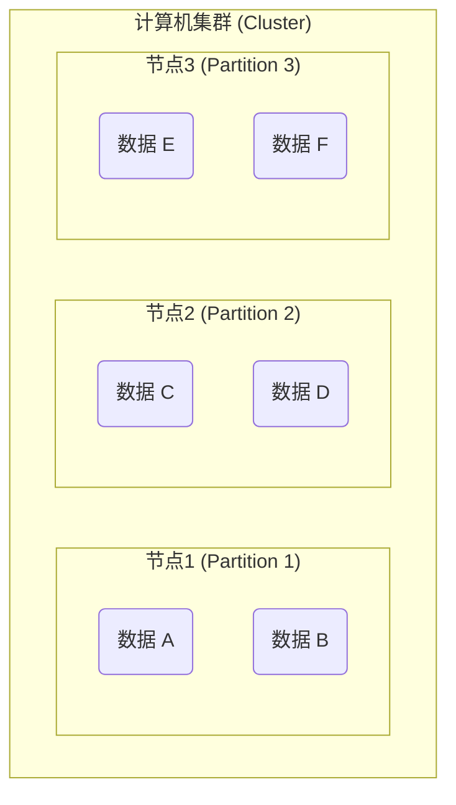
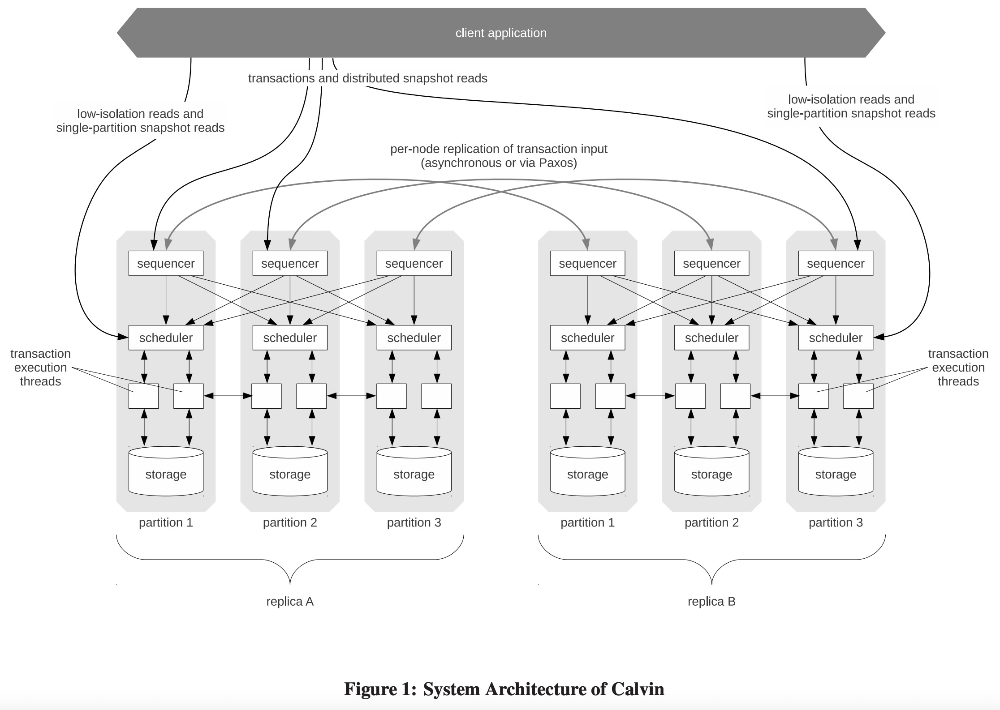
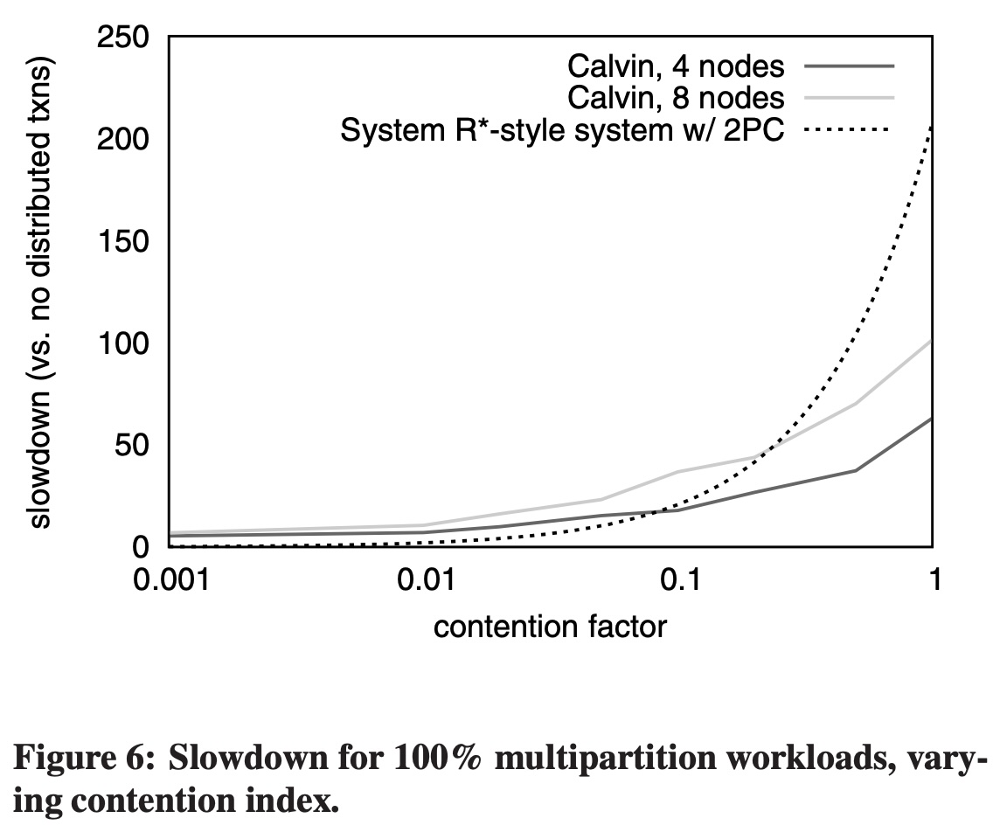
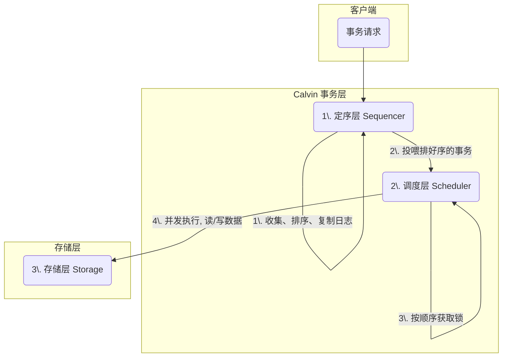
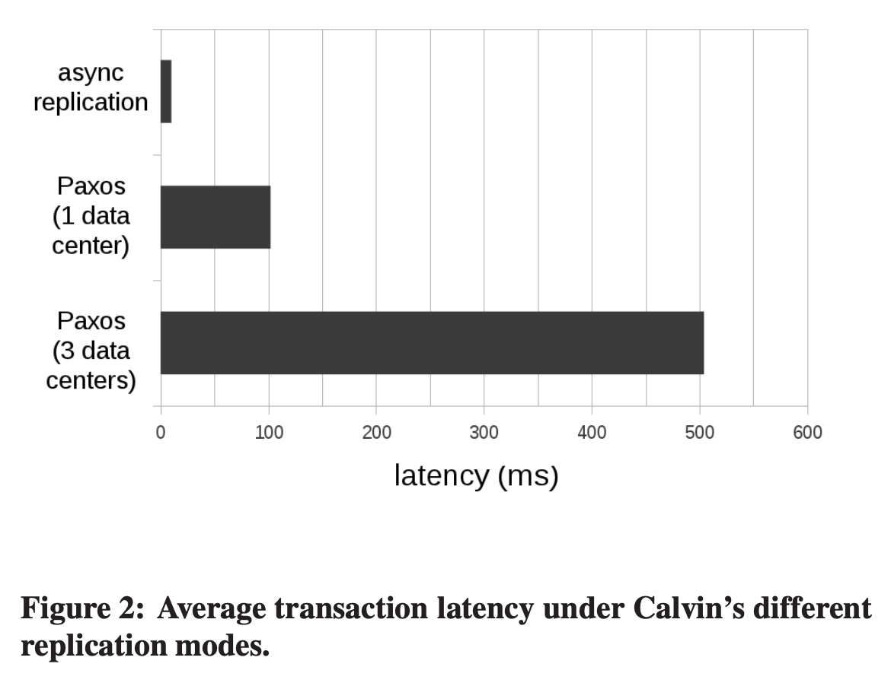
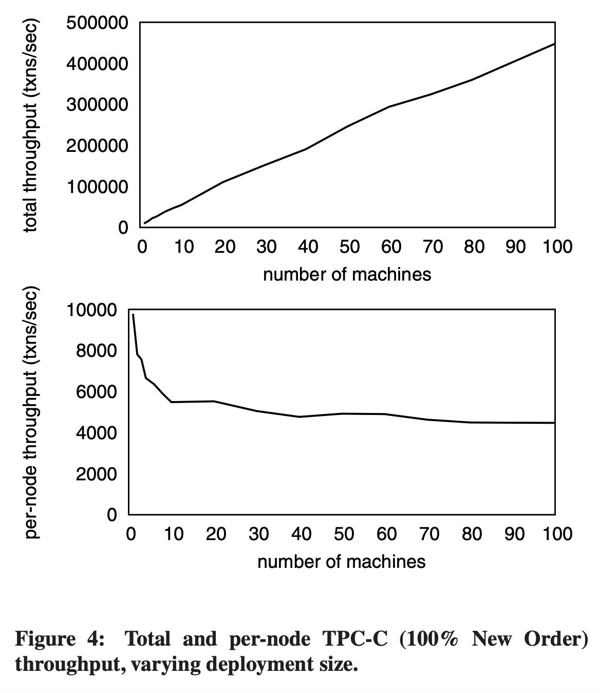
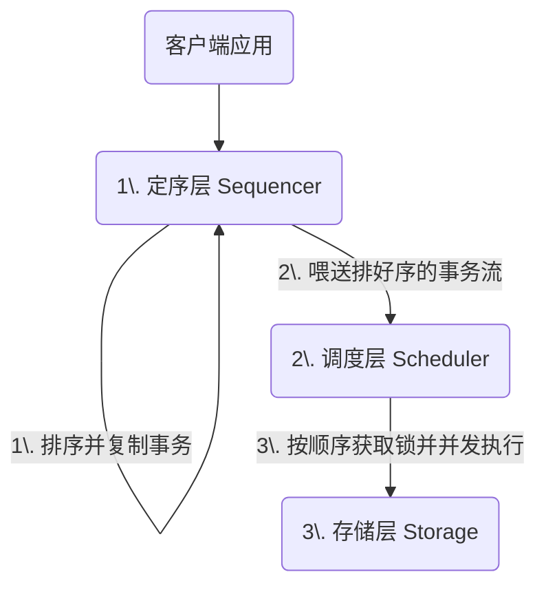

## AI论文解读 | Calvin: Fast Distributed Transactions For Partitioned Database Systems
        
### 作者        
digoal        
        
### 日期        
2025-11-03        
        
### 标签        
PostgreSQL , PolarDB , DuckDB , AI , 论文解读        
        
----        
        
## 背景  
      
https://dl.acm.org/doi/pdf/10.1145/2213836.2213838        
  
提示:          
```          
读懂《Calvin: Fast Distributed Transactions For Partitioned Database Systems》这篇论文需要提前掌握哪些基础知识, 请使用中文通熟易懂的讲解这些基础知识, 可以引用论文中的图、表或使用Markdown支持的图形(text,mermaid等)增加解释性. 
  
使用中文通熟易懂的解读《Calvin: Fast Distributed Transactions For Partitioned Database Systems》这篇论文, 其中的关键内容请着重讲解, 可以引用论文中的图、表或使用Markdown支持的图形(text,mermaid等)增加解释性. 
  
提取《Calvin: Fast Distributed Transactions For Partitioned Database Systems》这篇论文中的重要术语, 使用中文对这些术语进行通熟易懂的讲解, 可以引用论文中的图、表或使用Markdown支持的图形(text,mermaid等)增加解释性. 
```     
  
## 1 前置知识 
  
要读懂《Calvin》这篇论文，你需要对分布式系统和数据库的基础知识有一些了解。这篇论文提出了一个非常巧妙的方案，来解决一个长期存在的“老大难”问题：如何让分布式数据库既支持跨多个服务器的复杂事务，又能实现高性能和高扩展性。

下面我将用通俗的语言，为你讲解理解这篇论文所需的核心基础知识。

-----

### 1\. 数据库的核心追求：ACID 事务

首先，你需要明白什么是“事务”（Transaction）以及为什么它很重要。

  * **什么是事务？**
    想象一下银行转账：你从A账户转100元到B账户。这个操作包含两个步骤：

    1.  A账户减100元。
    2.  B账户加100元。
        “事务”就是把这两个步骤“打包”成一个单一、不可分割的操作单元。

  * **什么是 ACID？**
    ACID 是传统数据库（尤其是关系型数据库）的“黄金标准”，它确保事务的可靠性 ：

      * **A - 原子性 (Atomicity):** 事务要么全部完成（A减100，B加100），要么全部失败（两个操作都不做）。绝不能出现A减了钱，B没收到的情况。
      * **C - 一致性 (Consistency):** 事务必须使数据库从一个一致的状态转移到另一个一致的状态。
      * **I - 隔离性 (Isolation):** 并发执行的事务（比如C也在给B转账）互不干扰 。
      * **D - 持久性 (Durability):** 一旦事务提交，所做的更改将永久保存在数据库中。

**Calvin 的目标之一，就是在“分布式”环境下，依然提供完整的 ACID 事务支持 。**

-----

### 2\. 走向分布式：分区与复制

当数据量太大或请求太多，一台服务器扛不住时，我们就需要“分布式系统”。

  * **分区 (Partitioning):**
    也常被称为“分片”(Sharding)。就是把数据“切”成多份，存放在不同的服务器（节点）上 。

      * **例子：** 1号服务器存A账户，2号服务器存B账户。

  * **复制 (Replication):**
    为了“高可用性”（High Availability，即一台机器挂了，服务还能用），我们把同一份数据复制多份，存在不同的服务器上 。

      * **例子：** A账户的数据，在1号、2号、3号服务器上各存一份。

你可以用下面这个简单的示意图来理解：



> **分区 (Partitioning):** 数据 A/B、C/D、E/F 被分散存储在不同节点上。
> **复制 (Replication) (未画出):** 节点1的数据，可以被完整复制到另一个“备胎”节点（比如节点4）上。

Calvin 的设计就是运行在这样“分区”和“复制”的系统之上的 。

-----

### 3\. 分布式的噩梦：两阶段提交 (2PC)

现在，问题来了。如果一个事务（比如A转账给C）需要同时操作**分区1**（A账户）和**分区2**（C账户），这就是一个“分布式事务”。

  * **传统方案：两阶段提交 (Two-Phase Commit, 2PC)**
    为了保证分布式事务的“原子性”（要么都做，要么都不做），传统数据库使用了 2PC 协议 。

    1.  **阶段一（投票/准备）：** 协调者（一个服务器）问所有参与者（节点1和节点2）：“你们能提交这个事务吗？” 参与者会锁定 (Lock) 它们需要的数据（A和C），然后回答“准备好了”或“失败”。
    2.  **阶段二（提交/回滚）：**
          * 如果所有人都说“准备好了”，协调者就说：“好，都提交！”
          * 只要有一个人说“失败”，协调者就说：“大家全部回滚（撤销）！”

  * **2PC 的致命缺陷：高“争用” (Contention)**
    2PC 的最大问题是，在整个投票和等待提交的过程中，**数据必须一直被锁定** 。如果这个过程因为网络延迟而变慢，其他想要访问A或C账户的事务就只能干等着 。

    **这就是论文中反复提到的“争用成本” (Contention Costs) 。** 在大规模系统中，这种锁定和等待会导致性能急剧下降，系统无法扩展 。

-----

### 4\. Calvin 的“JULIA”：确定性 (Determinism)

为了绕开 2PC 及其高昂的争用成本，Calvin 提出了一个革命性的想法：**确定性执行 (Deterministic Execution)**。

  * **传统系统（非确定性）：** 事务的执行顺序取决于它们到达的时机、线程调度等 。系统必须在“运行时”通过 2PC 和锁来解决冲突。
  * **Calvin（确定性）：** Calvin 说，我们不如**在执行事务之前，先把所有事务排个队，定一个“全球唯一的总顺序”** 。

**这就是 Calvin 架构的核心——定序层 (Sequencing Layer) 。**

你可以把这个“定序器”想象成银行的“叫号机”。

1.  **收集输入：** 所有事务请求（“我要转账”、“我要查询”）都先发送给“定序层” 。
2.  **全局排序：** 定序层（通过 Paxos 等共识算法  或其他方式）为所有事务排一个**全球统一的顺序**（比如，事务1、事务2、事务3...）。
3.  **确定性执行：** 所有节点都严格按照这个顺序来执行事务 。

**这样做的好处是什么？**

  * **不再需要 2PC 提交协议！** 
    因为所有人都按同一个顺序执行，系统可以保证：如果事务A在事务B之前，那么在所有节点上，A对数据的影响一定在B之前被看到。大家“天生”就是一致的，根本不需要在事务执行*完*之后，再通过 2PC 去“检查”大家是否一致。
  * **大大减少了“争用”！** 
    锁定的时间被严格控制在事务执行的瞬间，而不是像 2PC 那样在漫长的投票和网络通信中一直占着锁 。

-----

### 总结：你需要看懂的“核心对决”

为了帮助你理解这篇论文，你可以关注论文中的 **Figure 1** 和 **Figure 6**。  

  * **Figure 1 (系统架构):**     
    这张图展示了 Calvin 的三层架构 。你需要重点关注最上层的 **Sequencer (定序器)** 。它就是我们上面说的“叫号机”，是实现“确定性”的核心。它负责接收事务、排序、并把排好序的事务日志复制 (replication) 给所有副本 。

  * **Figure 6 (性能对比):**     
    这张图是 Calvin “秀肌肉”的地方。它对比了 Calvin 和传统 2PC 系统（图中的 "System R\*-style system w/ 2PC" ）在“高争用” (contention factor)  下的性能“减速” (slowdown)  情况。

    > **看图结论：**  
    > * **虚线 (传统 2PC 系统):** 随着“争用” (contention) 变高（横坐标向右移动），性能下降（“减速”）得非常快，呈指数级恶化 。  
    > * **实线 (Calvin):** 即使在非常高的争用下，Calvin 的性能下降也平缓得多 。  

    > 这张图有力地证明了 Calvin 的核心论点：通过“确定性排序”来消除“分布式提交协议” (2PC)，可以极大地减少争用成本，从而在分布式事务上实现高扩展性 。  

**简而言之，要读懂 Calvin，你需要带着以下问题：**

1.  什么是 ACID 事务？
2.  为什么在“分区”和“复制”的分布式系统上实现 ACID 事务这么难？
3.  传统方案 2PC 的瓶颈是什么？（答案：高争用/Contention）
4.  Calvin 是如何“绕过”这个瓶颈的？（答案：通过“定序层”实现“确定性执行”）

希望这些基础知识的铺垫能帮助你顺利阅读这篇经典的论文！

您希望我深入讲解一下这些概念中的某一个吗？例如 2PC 的具体流程，或者 Calvin 的定序层是如何工作的？
  
## 2 解读论文 
  
好的，这是一篇分布式数据库领域非常经典的论文。Calvin 通过一个非常巧妙的设计，解决了“分布式事务”和“系统扩展性”这对长期存在的矛盾。

我将为你通俗地解读这篇论文，带你理解它的核心思想和关键技术。

-----

### 1\. 论文的核心思想（一句话概括）

Calvin 的核心思想是： **“先排序，再执行”** 。

它通过一个全局统一的“定序器”（Sequencer）， **在事务执行之前，就为所有事务排定一个全球唯一的“执行顺序”** 。所有服务器节点都严格遵守这个顺序来执行事务，从而彻底消灭了传统分布式事务中为了“达成一致”而产生的昂贵网络通信和锁等待（如两阶段提交），实现了极高的性能和扩展性 。

-----

### 2\. 问题的根源：传统分布式事务为什么这么“慢”？

在 Calvin 之前，人们普遍认为分布式系统要实现高扩展性，就必须放弃或削弱事务（ACID）。为什么？

**根源在于“锁”和“一致性协议”（如两阶段提交, 2PC）。**

想象一个跨银行转账（一个“分布式事务”）：

1.  事务开始。
2.  锁定A银行的账户。
3.  锁定B银行的账户。
4.  执行转账计算。
5.  **（问题来了）** A银行和B银行必须通过网络达成一致：“我们是都成功了，还是一起失败？” 这就是 **2PC (Two-Phase Commit)** 。
6.  在这个“互相确认”的过程中，A和B的账户必须**全程锁定** 。

这个“锁定时长”包含了所有网络通信的延迟 。如果有100个事务都在等这两个账户，系统就会被活活卡死。

论文将这个“锁定时长”称为 **“争用足迹” (Contention Footprint)** 。传统 2PC 方案的“争用足迹”非常大，导致性能急剧下降 。

-----

### 3\. Calvin 的“JULIA”：确定性执行 (Determinism)

Calvin 说： **“如果我们能在执行事务前，就让所有人都知道该按什么顺序来做，不就不需要事后再开会（2PC）了吗？”** 

这就是 **“确定性” (Determinism)** 的含义 。

  * **传统（非确定性）方案：** 先执行，再开会（2PC）来解决冲突和达成一致。
  * **Calvin（确定性）方案：** 先开会（排序），再执行。所有人都按预定的顺序执行，保证不会出错 。

通过这种方式，Calvin 将昂贵的“一致性”开销，从“事务执行中”（持锁阶段）移到了“事务执行前”（排序阶段）。这极大地缩短了“争用足迹”。

-----

### 4\. 核心架构：三层解耦（见论文 Figure 1）

Calvin 的系统架构被清晰地分为三层 ，如下图（论文 Figure 1 简化版）所示 ：     



#### 1\. 🥇 定序层 (Sequencing Layer)

这是 Calvin 的“大脑”和“叫号机”。

  * **功能：** 拦截所有客户端的事务请求 ，并为它们排定一个**全球唯一的串行顺序** 。
  * **实现：** 它将时间切分为 10 毫秒的“批次” (Epochs) 。收集这个批次内的所有请求，然后将这个“事务批次”日志复制到所有副本 。
  * **复制：** 这一层就处理了数据复制。它可以是异步的，也可以是基于 Paxos 的同步复制 。

#### 2\. 🥈 调度层 (Scheduling Layer)

这是 Calvin 的“调度中心”和“锁管理器”。

  * **功能：** 接收来自“定序层”的、排好序的事务流 。
  * **核心技术 (Deterministic Locking)：** 调度层是**并发**执行事务的 ，但它通过一个巧妙的“确定性锁管理器”来*保证*执行结果等价于定序层给出的*串行*顺序。
  * **实现：**
    1.  一个专有线程会严格按照串行顺序，**提前**为事务申请它需要的所有锁 。
    2.  锁管理器也必须严格按照这个申请顺序来**授予**锁 。
    3.  一旦一个事务拿到了它需要的所有锁，它就可以被交给一个“工作线程”去并发执行了 。
  * **前提：** 这个设计要求所有事务必须**提前声明**它们的“读/写集”（即它们会读写哪些数据）。

#### 3\. 🥉 存储层 (Storage Layer)

这是 Calvin 的“仓库”和“肌肉”。

  * **功能：** 它是一个“被动”的存储引擎，只负责执行最基本的 `CRUD` 操作（增、删、改、查）。
  * **解耦：** 事务逻辑、并发控制、复制等功能都上移到了上面两层。这使得 Calvin 可以“插入”到任何现有的非事务性存储系统（如键值存储）之上 。

-----

### 5\. 关键技术点（Calvin 的“JULIA”）

#### 1\. 复制：延迟高，但吞吐量不受影响（见 Figure 2）

Calvin 需要在“定序层”通过 Paxos 等协议在副本间同步“事务日志”。如果副本分布在不同的大洲（例如美国、欧洲、亚洲），这个同步延迟可能高达几百毫秒。

**论文 Figure 2** 就展示了这一点：     

  * **Async (异步)：** 延迟几乎为0。
  * **Paxos (1个数据中心)：** 延迟约 100ms 。
  * **Paxos (3个数据中心)：** 延迟高达 500ms 以上 。

**但 Calvin 的神奇之处在于：** 无论这个延迟有多高（500ms 或 1000ms），它 **只影响单个事务的“响应时间”，而完全不影响系统的“总吞吐量” (Throughput)** 。

为什么？因为这个延迟发生在“争用足迹” **之外** ！系统不需要持锁等待这个复制完成。定序器在等待 Paxos 确认的同时，可以继续接收和处理*后续*的事务请求。

#### 2\. 处理磁盘 I/O：化“非确定性”为“确定性”

“确定性”模型有一个天敌：**磁盘 I/O**。
磁盘读写是一个延迟不确定的“非确定性”事件。如果一个事务在执行中突然要读磁盘，它就会卡住，而它持有的锁会阻塞后面所有按顺序排队的事务 。

Calvin 的解决方案非常巧妙，叫做 **“预热” (Warm up)**  ：

1.  当“定序层”收到一个需要读磁盘的事务时，它**不会**立刻把它交给“调度层”。
2.  相反，定序层会“扣下”这个事务，同时向“存储层”发送一个**异步的“预热”请求**，让存储层提前把数据从磁盘加载到内存中 。
3.  定序层会“假装”这个事务在排队，等待一个它估计的磁盘延迟时间（例如 40ms）。
4.  等时间到了，定序层再把这个事务交给调度层。此时，数据大概率已经在内存中了，事务可以“零延迟”地执行，而不会阻塞系统 。

这个方法成功地将“磁盘 I/O 延迟”也移出了“争用足迹”！ 

-----

### 6\. 性能证明（见 Figure 4 和 Figure 6）

Calvin 的设计是否真的有效？论文给出了强力的数据证明。

#### 证明一：线性扩展能力（见 Figure 4）

Figure 4  展示了 Calvin 在 TPC-C（一个标准的数据库基准测试）上的表现：     

  * **上图（总吞吐量）：** 随着机器数量从1增加到100，系统的总吞吐量**几乎呈一条直线**向上增长 。这就是“（近）线性扩展性”。
  * **下图（单机吞吐量）：** 在集群规模超过10台机器后，每台机器的吞吐量基本稳定在 5000 txns/sec 左右 。

**结论：** Calvin 实现了“加机器就能提升性能”的理想状态。在 100 台普通的云主机上，它实现了近 50 万 TPC-C 事务每秒的惊人成绩，这在当时接近了使用高端硬件创造的世界纪录 。

#### 证明二：碾压 2PC（见 Figure 6）

**Figure 6  是这篇论文的“DNF”。** 它对比了在高“争用” (Contention) 情况下，Calvin 和传统 2PC 系统的性能“减速” (Slowdown) 对比。     

  * **横坐标 (Contention Factor)：** 争用程度。越往右，代表数据“越热”，冲突越严重。
  * **纵坐标 (Slowdown)：** 性能下降的倍数。
  * **虚线 (System R\*-style w/ 2PC)：** 传统的 2PC 系统 。
  * **实线 (Calvin)：** Calvin 系统 (4 节点和 8 节点) 。

**结论：** 我们可以清晰地看到，随着争用加剧（横坐标向右移动），传统 2PC 的性能（虚线） **呈指数级崩溃** ，性能下降了 100 多倍 。而 Calvin（实线）的性能下降则**非常平缓**，几乎不受高争用的影响 。

**这无可辩驳地证明了：Calvin 的“确定性”设计，成功地解决了分布式事务在高争用下的性能雪崩问题。**

-----

### 总结

Calvin 是一篇具有里程碑意义的论文。它通过引入“确定性执行”模型，将事务处理流程创新地重构为 **“排序 -\> 调度 -\> 存储”** 三层，彻底消除了传统 2PC 协议带来的“争用足迹” 。它证明了在分布式系统中，ACID 事务和近线性扩展性不仅可以兼得，还能在磁盘存储和跨大洲复制等严苛场景下依然保持极高的吞吐量。
  
## 3 术语 
  
以下是对《Calvin: Fast Distributed Transactions For Partitioned Database Systems》这篇论文中关键术语的提取和通俗讲解。

-----

### 1\. 分布式事务 (Distributed Transaction)

  * **通俗讲解：**
    想象一下你的数据被“分区”（切分）存储在 100 台不同的服务器上。一个“分布式事务”就是一个需要同时读取或修改**多台服务器**上数据的操作 。
  * **例子：**
    银行转账。用户 A（数据在服务器1）给用户 B（数据在服务器2）转账。这个操作必须同时修改两台服务器上的数据，并且要保证“要么都成功，要么都失败”（即原子性）。
  * **论文中的挑战：**
    传统的分布式事务很难在保证 ACID（原子性、一致性、隔离性、持久性）的同时，还能实现高吞吐量和高扩展性 。

### 2\. 两阶段提交 (Two-Phase Commit, 2PC)

  * **通俗讲解：**
    这是实现分布式事务“原子性”的传统“投票”机制。
    1.  **阶段一（准备/投票）：** 协调者问所有参与的服务器：“你们能提交这个事务吗？”所有服务器会锁定它们需要的数据，然后回复“准备好了”或“失败”。
    2.  **阶段二（提交/中止）：** 如果所有人都说“准备好了”，协调者就说“全部提交！”；只要有一个说“失败”，协调者就说“全部中止！” 。
  * **论文中的挑战：**
    2PC 的致命问题在于，**在整个投票和等待最终决定的过程中，事务必须一直持有锁** 。这个过程涉及多次网络往返，速度很慢 。

### 3\. 争用足迹 (Contention Footprint)

  * **通俗讲解：**
    这是一个非常关键的术语。你可以把它理解为“**一个事务从开始占用资源（加锁）到释放资源（解锁）的总时长**” 。
  * **为什么重要：**
    一个事务的“争用足迹”越大，它“霸占”资源的时间就越长，其他需要相同资源的事务就只能排队等待。
  * **论文中的观点：**
    传统 2PC 方案的“争用足迹” **非常大** ，因为它把网络通信延迟（投票、等待提交）的时间也算进了持锁时间 。Calvin 的核心目标就是**通过消除 2PC 来显著缩小这个“争用足迹”** 。

### 4\. 确定性 (Determinism) / 确定性数据库系统

  * **通俗讲解：**
    这是 Calvin 的核心魔法。一个系统是“确定性”的，意味着“**只要给定相同的输入和相同的顺序，无论何时何地运行，它都必须产生完全相同的结果**” 。
  * **对比：**
    传统数据库是“非确定性”的。两个事务同时运行，今天可能是A先执行，明天因为线程调度或网络延迟，可能是B先执行，导致结果的物理顺序不确定 。
  * **Calvin 的做法：**
    Calvin 通过“定序层”强制规定了所有事务的**唯一执行顺序** 。所有服务器节点都必须严格遵守这个顺序。

### 5\. Calvin 的三层架构 (System Architecture)

Calvin 将事务处理分解为三个独立的层次 ，你可以通过论文的 Figure 1（下图简化版）来理解：     



  * **1. 定序层 (Sequencing Layer / Sequencer):**
    这是 Calvin 的“大脑” 。它 **只负责一件事：给所有进来的事务“排队”** ，生成一个全球统一的“事务输入序列”（就像银行的叫号机）。它不执行事务，但它负责将这个排好序的“序列日志”复制到所有副本 。
  * **2. 调度层 (Scheduling Layer / Scheduler):**
    这是 Calvin 的“指挥官” 。它从定序层获取排好序的“任务清单”，然后使用“确定性锁协议”来**并发地执行**这些事务，同时保证执行结果在逻辑上等同于“任务清单”的串行顺序 。
  * **3. 存储层 (Storage Layer):**
    这是 Calvin 的“仓库”。它是一个非常简单的存储引擎，只需要提供 `CRUD`（增删改查）接口 。所有的事务、并发、复制逻辑都由上两层处理了 。

### 6\. 确定性锁协议 (Deterministic Locking Protocol)

  * **通俗讲解：**
    这是“调度层”用来保证“确定性”的规则。它规定：
    1.  事务**必须**按照“定序层”给出的全局顺序来**请求**锁 。
    2.  锁管理器也**必须**严格按照事务的请求顺序来**授予**锁 。
  * **效果：**
    如果事务 A 排在事务 B 前面，并且它们都需要锁 R，那么 B 必须等到 A 执行完毕并释放 R 之后，才能获得 R 的锁 。这就确保了执行结果和全局排序一致。

### 7\. 读/写集 (Read/Write Sets)

  * **通俗讲解：**
    一个事务在执行前，需要访问的 **所有数据（读）** 和需要修改的 **所有数据（写）** 的清单。
  * **论文中的要求：**
    Calvin 的“确定性锁协议”要求所有事务必须**提前声明**它们完整的读/写集 。这是为了让“调度层”能在事务执行前就为它申请所有需要的锁。

### 8\. 乐观锁定位预测 (OLLP - Optimistic Lock Location Prediction)

  * **通俗讲解：**
    这是针对“读/写集”提前未知的情况（例如：需要先读索引，才能知道要改哪条数据）的一个补丁方案 。
  * **做法：**
    1.  客户端先发送一个廉价的、低隔离性的“**侦察查询**”(reconnaissance query)，先找出完整读/写集 。
    2.  然后，再把这个“侦察”到的读/写集和真正的事务逻辑，一起提交给 Calvin 的“定序层” 。
    3.  在“调度层”真正执行时，会（确定性地） **重新检查** 这个读/写集是否仍然有效，如果失效则重启 。

### 9\. 数据预取 / 预热 (Data Prefetching / "Warm up")

  * **通俗讲解：**
    这是 Calvin 用来处理**磁盘存储**（而不仅仅是内存）的关键技术 。
  * **问题：**
    磁盘 I/O 延迟非常高且“非确定性”。如果一个事务在执行中（持锁时）去读磁盘，它会卡住，进而阻塞后面所有排队的事务 。
  * **Calvin 的方案：**
    “定序层”在收到一个需要读盘的事务时，会 **“扣住”** 这个事务 。它先向“存储层”发送一个异步的 **“预热”请求** ，让存储层提前把数据从磁盘加载到内存 。定序层会等待一个“估计的 I/O 延迟时间”，然后再把事务交给“调度层” 。
  * **效果：**
    当事务真正执行时，数据已经在内存中了。**磁盘 I/O 延迟被成功地移出了“争用足迹”** 。

### 10\. (性能对比) Figure 6

这个图是 Calvin 论文最有说服力的证据之一，它展示了 Calvin 如何在高“争用” (Contention) 下完胜 2PC。     

> **图 6 解读：**  
>  
>   * **横坐标 (Contention Factor):** 争用程度。越往右，数据越“热”，冲突越严重。  
>   * **纵坐标 (Slowdown):** 性能下降的倍数。  
>     * **虚线 (System R\*-style w/ 2PC):** 传统 2PC 系统 。  
>     * **实线 (Calvin):** Calvin 系统 。  
>  
> **结论：** 随着争用加剧，2PC 系统（虚线）的性能呈指数级崩溃 。而 Calvin（实线）的性能则非常稳定，受高争用的影响极小 。这证明了 Calvin 的“确定性”设计成功解决了“争用足迹”问题。  
  
## 参考        
         
https://dl.acm.org/doi/pdf/10.1145/2213836.2213838    
        
<b> 以上内容基于DeepSeek、Qwen、Gemini及诸多AI生成, 轻微人工调整, 感谢杭州深度求索人工智能、阿里云、Google等公司. </b>        
        
<b> AI 生成的内容请自行辨别正确性, 当然也多了些许踩坑的乐趣, 毕竟冒险是每个男人的天性.  </b>        
    
#### [期望 PostgreSQL|开源PolarDB 增加什么功能?](https://github.com/digoal/blog/issues/76 "269ac3d1c492e938c0191101c7238216")
  
  
#### [PolarDB 开源数据库](https://openpolardb.com/home "57258f76c37864c6e6d23383d05714ea")
  
  
#### [PolarDB 学习图谱](https://www.aliyun.com/database/openpolardb/activity "8642f60e04ed0c814bf9cb9677976bd4")
  
  
#### [PostgreSQL 解决方案集合](../201706/20170601_02.md "40cff096e9ed7122c512b35d8561d9c8")
  
  
#### [德哥 / digoal's Github - 公益是一辈子的事.](https://github.com/digoal/blog/blob/master/README.md "22709685feb7cab07d30f30387f0a9ae")
  
  
#### [About 德哥](https://github.com/digoal/blog/blob/master/me/readme.md "a37735981e7704886ffd590565582dd0")
  
  

  
