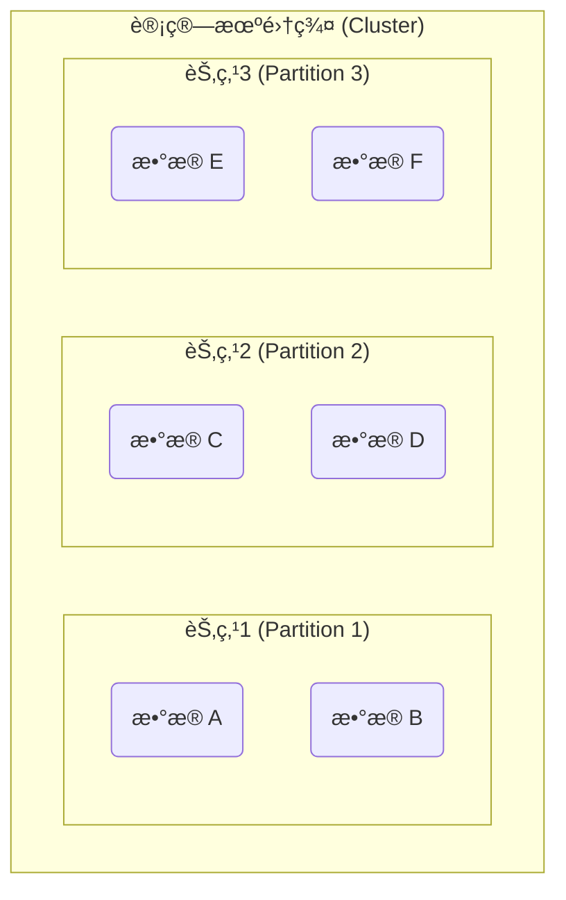
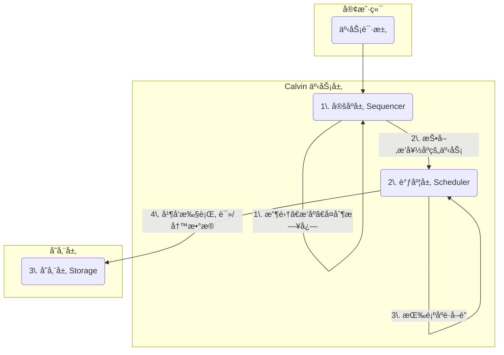
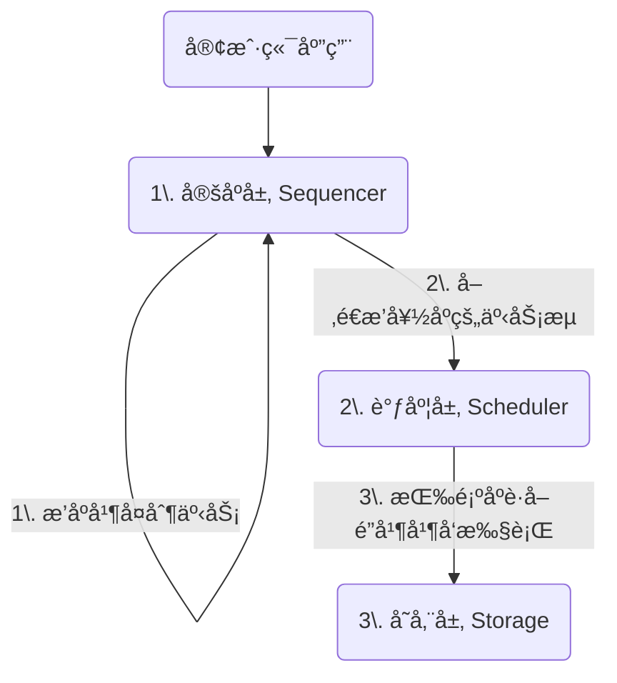

## AI论文解读 | Calvin: Fast Distributed Transactions For Partitioned Database Systems
        
### 作者        
digoal        
        
### 日期        
2025-11-03        
        
### 标签        
PostgreSQL , PolarDB , DuckDB , AI , 论文解读        
        
----        
        
## 背景  
      
https://dl.acm.org/doi/pdf/10.1145/2213836.2213838        
  
æ示:          
```          
读懂《Calvin: Fast Distributed Transactions For Partitioned Database Systems》这篇论文需è¦æå‰æŒæ¡å“ªäº›åŸºç¡€çŸ¥è¯†, 请使用中文通熟易懂的讲解这些基础知识, å¯ä»¥å¼•ç”¨è®ºæ–‡ä¸­çš„图ã€è¡¨æˆ–使用Markdown支æŒçš„图形(text,mermaidç­‰)å¢åŠ è§£é‡Šæ€§. 
  
使用中文通熟易懂的解读《Calvin: Fast Distributed Transactions For Partitioned Database Systems》这篇论文, 其中的关键内容请ç€é‡è®²è§£, å¯ä»¥å¼•ç”¨è®ºæ–‡ä¸­çš„图ã€è¡¨æˆ–使用Markdown支æŒçš„图形(text,mermaidç­‰)å¢åŠ è§£é‡Šæ€§. 
  
æå–《Calvin: Fast Distributed Transactions For Partitioned Database Systems》这篇论文中的é‡è¦æœ¯è¯­, 使用中文对这些术语进行通熟易懂的讲解, å¯ä»¥å¼•ç”¨è®ºæ–‡ä¸­çš„图ã€è¡¨æˆ–使用Markdown支æŒçš„图形(text,mermaidç­‰)å¢åŠ è§£é‡Šæ€§. 
```     
  
## 1 å‰ç½®çŸ¥è¯† 
  
è¦è¯»æ‡‚《Calvin》这篇论文，你需è¦å¯¹åˆ†å¸ƒå¼ç³»ç»Ÿå’Œæ•°æ®åº“的基础知识有一些了解。这篇论文æ出了一个é常巧妙的方案，æ¥è§£å†³ä¸€ä¸ªé•¿æœŸå­˜åœ¨çš„“è€å¤§éš¾â€é—®é¢˜ï¼šå¦‚何让分布å¼æ•°æ®åº“既支æŒè·¨å¤šä¸ªæœåŠ¡å™¨çš„å¤æ‚事务，åˆèƒ½å®ç°é«˜æ€§èƒ½å’Œé«˜æ‰©å±•æ€§ã€‚

下é¢æˆ‘将用通俗的语言，为你讲解ç†è§£è¿™ç¯‡è®ºæ–‡æ‰€éœ€çš„核心基础知识。

-----

### 1\. æ•°æ®åº“的核心追求：ACID 事务

首先，你需è¦æ˜ç™½ä»€ä¹ˆæ˜¯â€œäº‹åŠ¡â€ï¼ˆTransaction）以åŠä¸ºä»€ä¹ˆå®ƒå¾ˆé‡è¦ã€‚

  * **什么是事务？**
    想象一下银行转账：你ä»A账户转100元到B账户。这个æ“作包å«ä¸¤ä¸ªæ­¥éª¤ï¼š

    1.  A账户å‡100元。
    2.  B账户加100元。
        “事务â€å°±æ˜¯æŠŠè¿™ä¸¤ä¸ªæ­¥éª¤â€œæ‰“包â€æˆä¸€ä¸ªå•ä¸€ã€ä¸å¯åˆ†å‰²çš„æ“作å•å…ƒã€‚

  * **什么是 ACID？**
    ACID 是传统数æ®åº“（尤其是关系å‹æ•°æ®åº“）的“黄金标准â€ï¼Œå®ƒç¡®ä¿äº‹åŠ¡çš„å¯é æ€§ ：

      * **A - åŸå­æ€§ (Atomicity):** 事务è¦ä¹ˆå…¨éƒ¨å®Œæˆï¼ˆAå‡100，B加100），è¦ä¹ˆå…¨éƒ¨å¤±è´¥ï¼ˆä¸¤ä¸ªæ“作都ä¸åšï¼‰ã€‚ç»ä¸èƒ½å‡ºç°Aå‡äº†é’±ï¼ŒB没收到的情况。
      * **C - 一致性 (Consistency):** 事务必须使数æ®åº“ä»ä¸€ä¸ªä¸€è‡´çš„状æ€è½¬ç§»åˆ°å¦ä¸€ä¸ªä¸€è‡´çš„状æ€ã€‚
      * **I - 隔离性 (Isolation):** 并å‘执行的事务（比如C也在给B转账）互ä¸å¹²æ‰° 。
      * **D - æŒä¹…性 (Durability):** 一旦事务æ交，所åšçš„更改将永久ä¿å­˜åœ¨æ•°æ®åº“中。

**Calvin 的目标之一，就是在“分布å¼â€ç¯å¢ƒä¸‹ï¼Œä¾ç„¶æ供完整的 ACID äº‹åŠ¡æ”¯æŒ ã€‚**

-----

### 2\. èµ°å‘分布å¼ï¼šåˆ†åŒºä¸å¤åˆ¶

当数æ®é‡å¤ªå¤§æˆ–请求太多，一å°æœåŠ¡å™¨æ‰›ä¸ä½æ—¶ï¼Œæˆ‘们就需è¦â€œåˆ†å¸ƒå¼ç³»ç»Ÿâ€ã€‚

  * **分区 (Partitioning):**
    也常被称为“分片â€(Sharding)。就是把数æ®â€œåˆ‡â€æˆå¤šä»½ï¼Œå­˜æ”¾åœ¨ä¸åŒçš„æœåŠ¡å™¨ï¼ˆèŠ‚点）上 。

      * **例å­ï¼š** 1å·æœåŠ¡å™¨å­˜A账户，2å·æœåŠ¡å™¨å­˜B账户。

  * **å¤åˆ¶ (Replication):**
    为了“高å¯ç”¨æ€§â€ï¼ˆHigh Availability，å³ä¸€å°æœºå™¨æŒ‚了，æœåŠ¡è¿˜èƒ½ç”¨ï¼‰ï¼Œæˆ‘们把åŒä¸€ä»½æ•°æ®å¤åˆ¶å¤šä»½ï¼Œå­˜åœ¨ä¸åŒçš„æœåŠ¡å™¨ä¸Š 。

      * **例å­ï¼š** A账户的数æ®ï¼Œåœ¨1å·ã€2å·ã€3å·æœåŠ¡å™¨ä¸Šå„存一份。

ä½ å¯ä»¥ç”¨ä¸‹é¢è¿™ä¸ªç®€å•çš„示æ„图æ¥ç†è§£ï¼š



> **分区 (Partitioning):** æ•°æ® A/Bã€C/Dã€E/F 被分散存储在ä¸åŒèŠ‚点上。
> **å¤åˆ¶ (Replication) (未画出):** 节点1çš„æ•°æ®ï¼Œå¯ä»¥è¢«å®Œæ•´å¤åˆ¶åˆ°å¦ä¸€ä¸ªâ€œå¤‡èƒâ€èŠ‚点（比如节点4）上。

Calvin 的设计就是è¿è¡Œåœ¨è¿™æ ·â€œåˆ†åŒºâ€å’Œâ€œå¤åˆ¶â€çš„系统之上的 。

-----

### 3\. 分布å¼çš„噩梦：两阶段æ交 (2PC)

ç°åœ¨ï¼Œé—®é¢˜æ¥äº†ã€‚如æœä¸€ä¸ªäº‹åŠ¡ï¼ˆæ¯”如A转账给C）需è¦åŒæ—¶æ“作**分区1**（A账户）和**分区2**（C账户），这就是一个“分布å¼äº‹åŠ¡â€ã€‚

  * **传统方案：两阶段æ交 (Two-Phase Commit, 2PC)**
    为了ä¿è¯åˆ†å¸ƒå¼äº‹åŠ¡çš„“åŸå­æ€§â€ï¼ˆè¦ä¹ˆéƒ½åšï¼Œè¦ä¹ˆéƒ½ä¸åšï¼‰ï¼Œä¼ ç»Ÿæ•°æ®åº“使用了 2PC åè®® 。

    1.  **阶段一（投票/准备）：** å调者（一个æœåŠ¡å™¨ï¼‰é—®æ‰€æœ‰å‚ä¸è€…（节点1和节点2）：“你们能æ交这个事务å—？†å‚ä¸è€…会é”定 (Lock) 它们需è¦çš„æ•°æ®ï¼ˆAå’ŒC），然åå›ç­”“准备好了â€æˆ–“失败â€ã€‚
    2.  **阶段二（æ交/å›æ»šï¼‰ï¼š**
          * 如æœæ‰€æœ‰äººéƒ½è¯´â€œå‡†å¤‡å¥½äº†â€ï¼Œå调者就说：“好，都æ交ï¼â€
          * åªè¦æœ‰ä¸€ä¸ªäººè¯´â€œå¤±è´¥â€ï¼Œå调者就说：“大家全部å›æ»šï¼ˆæ’¤é”€ï¼‰ï¼â€

  * **2PC 的致命缺陷：高“争用†(Contention)**
    2PC 的最大问题是，在整个投票和等待æ交的过程中，**æ•°æ®å¿…须一直被é”定** 。如æœè¿™ä¸ªè¿‡ç¨‹å› ä¸ºç½‘络延迟而å˜æ…¢ï¼Œå…¶ä»–想è¦è®¿é—®A或C账户的事务就åªèƒ½å¹²ç­‰ç€ 。

    **这就是论文中åå¤æ到的“争用æˆæœ¬â€ (Contention Costs) 。** 在大规模系统中，这ç§é”定和等待会导致性能急剧下é™ï¼Œç³»ç»Ÿæ— æ³•æ‰©å±• 。

-----

### 4\. Calvin 的“JULIAâ€ï¼šç¡®å®šæ€§ (Determinism)

为了绕开 2PC åŠå…¶é«˜æ˜‚的争用æˆæœ¬ï¼ŒCalvin æ出了一个é©å‘½æ€§çš„想法：**确定性执行 (Deterministic Execution)**。

  * **传统系统（é确定性）：** 事务的执行顺åºå–决äºå®ƒä»¬åˆ°è¾¾çš„时机ã€çº¿ç¨‹è°ƒåº¦ç­‰ 。系统必须在“è¿è¡Œæ—¶â€é€šè¿‡ 2PC å’Œé”æ¥è§£å†³å†²çªã€‚
  * **Calvin（确定性）：** Calvin 说，我们ä¸å¦‚**在执行事务之å‰ï¼Œå…ˆæŠŠæ‰€æœ‰äº‹åŠ¡æ’个队，定一个“全çƒå”¯ä¸€çš„总顺åºâ€** 。

**这就是 Calvin æ¶æ„的核心——定åºå±‚ (Sequencing Layer) 。**

ä½ å¯ä»¥æŠŠè¿™ä¸ªâ€œå®šåºå™¨â€æƒ³è±¡æˆé“¶è¡Œçš„“å«å·æœºâ€ã€‚

1.  **收集输入：** 所有事务请求（“我è¦è½¬è´¦â€ã€â€œæˆ‘è¦æŸ¥è¯¢â€ï¼‰éƒ½å…ˆå‘é€ç»™â€œå®šåºå±‚†。
2.  **全局æ’åºï¼š** 定åºå±‚（通过 Paxos 等共识算法  或其他方å¼ï¼‰ä¸ºæ‰€æœ‰äº‹åŠ¡æ’一个**å…¨çƒç»Ÿä¸€çš„顺åº**（比如，事务1ã€äº‹åŠ¡2ã€äº‹åŠ¡3...）。
3.  **确定性执行：** 所有节点都严格按照这个顺åºæ¥æ‰§è¡Œäº‹åŠ¡ 。

**这样åšçš„好处是什么？**

  * **ä¸å†éœ€è¦ 2PC æ交åè®®ï¼** 
    因为所有人都按åŒä¸€ä¸ªé¡ºåºæ‰§è¡Œï¼Œç³»ç»Ÿå¯ä»¥ä¿è¯ï¼šå¦‚æœäº‹åŠ¡A在事务B之å‰ï¼Œé‚£ä¹ˆåœ¨æ‰€æœ‰èŠ‚点上，A对数æ®çš„å½±å“一定在B之å‰è¢«çœ‹åˆ°ã€‚大家“天生â€å°±æ˜¯ä¸€è‡´çš„，根本ä¸éœ€è¦åœ¨äº‹åŠ¡æ‰§è¡Œ*完*之å，å†é€šè¿‡ 2PC å»â€œæ£€æŸ¥â€å¤§å®¶æ˜¯å¦ä¸€è‡´ã€‚
  * **大大å‡å°‘了“争用â€ï¼** 
    é”定的时间被严格æ§åˆ¶åœ¨äº‹åŠ¡æ‰§è¡Œçš„ç¬é—´ï¼Œè€Œä¸æ˜¯åƒ 2PC 那样在漫长的投票和网络通信中一直å ç€é” 。

-----

### 总结：你需è¦çœ‹æ‡‚的“核心对决â€

为了帮助你ç†è§£è¿™ç¯‡è®ºæ–‡ï¼Œä½ å¯ä»¥å…³æ³¨è®ºæ–‡ä¸­çš„ **Figure 1** å’Œ **Figure 6**。  

  * **Figure 1 (系统æ¶æ„):**     
    这张图展示了 Calvin 的三层æ¶æ„ 。你需è¦é‡ç‚¹å…³æ³¨æœ€ä¸Šå±‚çš„ **Sequencer (定åºå™¨)** 。它就是我们上é¢è¯´çš„“å«å·æœºâ€ï¼Œæ˜¯å®ç°â€œç¡®å®šæ€§â€çš„核心。它负责æ¥æ”¶äº‹åŠ¡ã€æ’åºã€å¹¶æŠŠæ’好åºçš„事务日志å¤åˆ¶ (replication) 给所有副本 。

  * **Figure 6 (性能对比):**     
    这张图是 Calvin “秀肌肉â€çš„地方。它对比了 Calvin 和传统 2PC 系统（图中的 "System R\*-style system w/ 2PC" ）在“高争用†(contention factor)  下的性能“å‡é€Ÿâ€ (slowdown)  情况。

    > **看图结论：**  
    > * **虚线 (传统 2PC 系统):** éšç€â€œäº‰ç”¨â€ (contention) å˜é«˜ï¼ˆæ¨ªåæ ‡å‘å³ç§»åŠ¨ï¼‰ï¼Œæ€§èƒ½ä¸‹é™ï¼ˆâ€œå‡é€Ÿâ€ï¼‰å¾—é常快，呈指数级æ¶åŒ– 。  
    > * **å®çº¿ (Calvin):** å³ä½¿åœ¨é常高的争用下，Calvin 的性能下é™ä¹Ÿå¹³ç¼“得多 。  

    > 这张图有力地è¯æ˜äº† Calvin 的核心论点：通过“确定性æ’åºâ€æ¥æ¶ˆé™¤â€œåˆ†å¸ƒå¼æ交å议†(2PC)，å¯ä»¥æ大地å‡å°‘争用æˆæœ¬ï¼Œä»è€Œåœ¨åˆ†å¸ƒå¼äº‹åŠ¡ä¸Šå®ç°é«˜æ‰©å±•æ€§ 。  

**简而言之，è¦è¯»æ‡‚ Calvin，你需è¦å¸¦ç€ä»¥ä¸‹é—®é¢˜ï¼š**

1.  什么是 ACID 事务？
2.  为什么在“分区â€å’Œâ€œå¤åˆ¶â€çš„分布å¼ç³»ç»Ÿä¸Šå®ç° ACID 事务这么难？
3.  传统方案 2PC 的瓶颈是什么？（答案：高争用/Contention）
4.  Calvin 是如何“绕过â€è¿™ä¸ªç“¶é¢ˆçš„？（答案：通过“定åºå±‚â€å®ç°â€œç¡®å®šæ€§æ‰§è¡Œâ€ï¼‰

希望这些基础知识的铺å«èƒ½å¸®åŠ©ä½ é¡ºåˆ©é˜…读这篇ç»å…¸çš„论文ï¼

您希望我深入讲解一下这些概念中的æŸä¸€ä¸ªå—？例如 2PC 的具体æµç¨‹ï¼Œæˆ–者 Calvin 的定åºå±‚是如何工作的？
  
## 2 解读论文 
  
好的，这是一篇分布å¼æ•°æ®åº“领域é常ç»å…¸çš„论文。Calvin 通过一个é常巧妙的设计，解决了“分布å¼äº‹åŠ¡â€å’Œâ€œç³»ç»Ÿæ‰©å±•æ€§â€è¿™å¯¹é•¿æœŸå­˜åœ¨çš„矛盾。

我将为你通俗地解读这篇论文，带你ç†è§£å®ƒçš„核心æ€æƒ³å’Œå…³é”®æŠ€æœ¯ã€‚

-----

### 1\. 论文的核心æ€æƒ³ï¼ˆä¸€å¥è¯æ¦‚括）

Calvin 的核心æ€æƒ³æ˜¯ï¼š **“先æ’åºï¼Œå†æ‰§è¡Œâ€** 。

它通过一个全局统一的“定åºå™¨â€ï¼ˆSequencer）， **在事务执行之å‰ï¼Œå°±ä¸ºæ‰€æœ‰äº‹åŠ¡æ’定一个全çƒå”¯ä¸€çš„“执行顺åºâ€** 。所有æœåŠ¡å™¨èŠ‚点都严格éµå®ˆè¿™ä¸ªé¡ºåºæ¥æ‰§è¡Œäº‹åŠ¡ï¼Œä»è€Œå½»åº•æ¶ˆç­äº†ä¼ ç»Ÿåˆ†å¸ƒå¼äº‹åŠ¡ä¸­ä¸ºäº†â€œè¾¾æˆä¸€è‡´â€è€Œäº§ç”Ÿçš„昂贵网络通信和é”等待（如两阶段æ交），å®ç°äº†æ高的性能和扩展性 。

-----

### 2\. 问题的根æºï¼šä¼ ç»Ÿåˆ†å¸ƒå¼äº‹åŠ¡ä¸ºä»€ä¹ˆè¿™ä¹ˆâ€œæ…¢â€ï¼Ÿ

在 Calvin 之å‰ï¼Œäººä»¬æ™®é认为分布å¼ç³»ç»Ÿè¦å®ç°é«˜æ‰©å±•æ€§ï¼Œå°±å¿…须放弃或削弱事务（ACID）。为什么？

**æ ¹æºåœ¨äºâ€œé”â€å’Œâ€œä¸€è‡´æ€§åè®®â€ï¼ˆå¦‚两阶段æ交, 2PC）。**

想象一个跨银行转账（一个“分布å¼äº‹åŠ¡â€ï¼‰ï¼š

1.  事务开始。
2.  é”定A银行的账户。
3.  é”定B银行的账户。
4.  执行转账计算。
5.  **（问题æ¥äº†ï¼‰** A银行和B银行必须通过网络达æˆä¸€è‡´ï¼šâ€œæˆ‘们是都æˆåŠŸäº†ï¼Œè¿˜æ˜¯ä¸€èµ·å¤±è´¥ï¼Ÿâ€ 这就是 **2PC (Two-Phase Commit)** 。
6.  在这个“互相确认â€çš„过程中，Aå’ŒB的账户必须**全程é”定** 。

这个“é”定时长â€åŒ…å«äº†æ‰€æœ‰ç½‘络通信的延迟 。如æœæœ‰100个事务都在等这两个账户，系统就会被活活å¡æ­»ã€‚

论文将这个“é”定时长â€ç§°ä¸º **“争用足迹†(Contention Footprint)** 。传统 2PC 方案的“争用足迹â€éå¸¸å¤§ï¼Œå¯¼è‡´æ€§èƒ½æ€¥å‰§ä¸‹é™ ã€‚

-----

### 3\. Calvin 的“JULIAâ€ï¼šç¡®å®šæ€§æ‰§è¡Œ (Determinism)

Calvin 说： **“如æœæˆ‘们能在执行事务å‰ï¼Œå°±è®©æ‰€æœ‰äººéƒ½çŸ¥é“该按什么顺åºæ¥åšï¼Œä¸å°±ä¸éœ€è¦äº‹åå†å¼€ä¼šï¼ˆ2PC）了å—？â€** 

这就是 **“确定性†(Determinism)** çš„å«ä¹‰ 。

  * **传统（é确定性）方案：** 先执行，å†å¼€ä¼šï¼ˆ2PC）æ¥è§£å†³å†²çªå’Œè¾¾æˆä¸€è‡´ã€‚
  * **Calvin（确定性）方案：** 先开会（æ’åºï¼‰ï¼Œå†æ‰§è¡Œã€‚所有人都按预定的顺åºæ‰§è¡Œï¼Œä¿è¯ä¸ä¼šå‡ºé”™ 。

通过这ç§æ–¹å¼ï¼ŒCalvin 将昂贵的“一致性â€å¼€é”€ï¼Œä»â€œäº‹åŠ¡æ‰§è¡Œä¸­â€ï¼ˆæŒé”阶段）移到了“事务执行å‰â€ï¼ˆæ’åºé˜¶æ®µï¼‰ã€‚è¿™æ大地缩短了“争用足迹â€ã€‚

-----

### 4\. 核心æ¶æ„：三层解耦（è§è®ºæ–‡ Figure 1）

Calvin 的系统æ¶æ„被清晰地分为三层 ，如下图（论文 Figure 1 简化版）所示 ：     



#### 1\. 🥇 定åºå±‚ (Sequencing Layer)

这是 Calvin 的“大脑â€å’Œâ€œå«å·æœºâ€ã€‚

  * **功能：** 拦截所有客户端的事务请求 ，并为它们æ’定一个**å…¨çƒå”¯ä¸€çš„串行顺åº** 。
  * **å®ç°ï¼š** 它将时间切分为 10 毫秒的“批次†(Epochs) 。收集这个批次内的所有请求，然å将这个“事务批次â€æ—¥å¿—å¤åˆ¶åˆ°æ‰€æœ‰å‰¯æœ¬ 。
  * **å¤åˆ¶ï¼š** 这一层就处ç†äº†æ•°æ®å¤åˆ¶ã€‚它å¯ä»¥æ˜¯å¼‚步的，也å¯ä»¥æ˜¯åŸºäº Paxos çš„åŒæ­¥å¤åˆ¶ 。

#### 2\. 🥈 调度层 (Scheduling Layer)

这是 Calvin 的“调度中心â€å’Œâ€œé”管ç†å™¨â€ã€‚

  * **功能：** æ¥æ”¶æ¥è‡ªâ€œå®šåºå±‚â€çš„ã€æ’好åºçš„äº‹åŠ¡æµ ã€‚
  * **核心技术 (Deterministic Locking)：** 调度层是**并å‘**执行事务的 ，但它通过一个巧妙的“确定性é”管ç†å™¨â€æ¥*ä¿è¯*执行结æœç­‰ä»·äºå®šåºå±‚给出的*串行*顺åºã€‚
  * **å®ç°ï¼š**
    1.  一个专有线程会严格按照串行顺åºï¼Œ**æå‰**为事务申请它需è¦çš„æ‰€æœ‰é” ã€‚
    2.  é”管ç†å™¨ä¹Ÿå¿…须严格按照这个申请顺åºæ¥**æˆäºˆ**é” ã€‚
    3.  一旦一个事务拿到了它需è¦çš„所有é”，它就å¯ä»¥è¢«äº¤ç»™ä¸€ä¸ªâ€œå·¥ä½œçº¿ç¨‹â€å»å¹¶å‘执行了 。
  * **å‰æ：** 这个设计è¦æ±‚所有事务必须**æå‰å£°æ˜**它们的“读/写集â€ï¼ˆå³å®ƒä»¬ä¼šè¯»å†™å“ªäº›æ•°æ®ï¼‰ã€‚

#### 3\. 🥉 存储层 (Storage Layer)

这是 Calvin 的“仓库â€å’Œâ€œè‚Œè‚‰â€ã€‚

  * **功能：** 它是一个“被动â€çš„存储引æ“，åªè´Ÿè´£æ‰§è¡Œæœ€åŸºæœ¬çš„ `CRUD` æ“作（å¢ã€åˆ ã€æ”¹ã€æŸ¥ï¼‰ã€‚
  * **解耦：** 事务逻辑ã€å¹¶å‘æ§åˆ¶ã€å¤åˆ¶ç­‰åŠŸèƒ½éƒ½ä¸Šç§»åˆ°äº†ä¸Šé¢ä¸¤å±‚。这使得 Calvin å¯ä»¥â€œæ’å…¥â€åˆ°ä»»ä½•ç°æœ‰çš„é事务性存储系统（如键值存储）之上 。

-----

### 5\. 关键技术点（Calvin 的“JULIAâ€ï¼‰

#### 1\. å¤åˆ¶ï¼šå»¶è¿Ÿé«˜ï¼Œä½†ååé‡ä¸å—å½±å“ï¼ˆè§ Figure 2）

Calvin 需è¦åœ¨â€œå®šåºå±‚â€é€šè¿‡ Paxos ç­‰å议在副本间åŒæ­¥â€œäº‹åŠ¡æ—¥å¿—â€ã€‚如æœå‰¯æœ¬åˆ†å¸ƒåœ¨ä¸åŒçš„大洲（例如ç¾å›½ã€æ¬§æ´²ã€äºšæ´²ï¼‰ï¼Œè¿™ä¸ªåŒæ­¥å»¶è¿Ÿå¯èƒ½é«˜è¾¾å‡ ç™¾æ¯«ç§’。

**论文 Figure 2** 就展示了这一点：     

  * **Async (异步)：** 延迟几ä¹ä¸º0。
  * **Paxos (1个数æ®ä¸­å¿ƒ)：** 延迟约 100ms 。
  * **Paxos (3个数æ®ä¸­å¿ƒ)：** 延迟高达 500ms 以上 。

**但 Calvin çš„ç¥å¥‡ä¹‹å¤„在äºï¼š** 无论这个延迟有多高（500ms 或 1000ms），它 **åªå½±å“å•ä¸ªäº‹åŠ¡çš„“å“应时间â€ï¼Œè€Œå®Œå…¨ä¸å½±å“系统的“总ååé‡â€ (Throughput)** 。

为什么？因为这个延迟å‘生在“争用足迹†**之外** ï¼ç³»ç»Ÿä¸éœ€è¦æŒé”等待这个å¤åˆ¶å®Œæˆã€‚定åºå™¨åœ¨ç­‰å¾… Paxos 确认的åŒæ—¶ï¼Œå¯ä»¥ç»§ç»­æ¥æ”¶å’Œå¤„ç†*åç»­*的事务请求。

#### 2\. 处ç†ç£ç›˜ I/O：化“é确定性â€ä¸ºâ€œç¡®å®šæ€§â€

“确定性â€æ¨¡å‹æœ‰ä¸€ä¸ªå¤©æ•Œï¼š**ç£ç›˜ I/O**。
ç£ç›˜è¯»å†™æ˜¯ä¸€ä¸ªå»¶è¿Ÿä¸ç¡®å®šçš„“é确定性â€äº‹ä»¶ã€‚如æœä¸€ä¸ªäº‹åŠ¡åœ¨æ‰§è¡Œä¸­çªç„¶è¦è¯»ç£ç›˜ï¼Œå®ƒå°±ä¼šå¡ä½ï¼Œè€Œå®ƒæŒæœ‰çš„é”会阻å¡åé¢æ‰€æœ‰æŒ‰é¡ºåºæ’队的事务 。

Calvin 的解决方案é常巧妙，å«åš **“预热†(Warm up)**  ：

1.  当“定åºå±‚â€æ”¶åˆ°ä¸€ä¸ªéœ€è¦è¯»ç£ç›˜çš„事务时，它**ä¸ä¼š**立刻把它交给“调度层â€ã€‚
2.  相å，定åºå±‚会“扣下â€è¿™ä¸ªäº‹åŠ¡ï¼ŒåŒæ—¶å‘“存储层â€å‘é€ä¸€ä¸ª**异步的“预热â€è¯·æ±‚**，让存储层æå‰æŠŠæ•°æ®ä»ç£ç›˜åŠ è½½åˆ°å†…存中 。
3.  定åºå±‚会“å‡è£…â€è¿™ä¸ªäº‹åŠ¡åœ¨æ’队，等待一个它估计的ç£ç›˜å»¶è¿Ÿæ—¶é—´ï¼ˆä¾‹å¦‚ 40ms）。
4.  等时间到了，定åºå±‚å†æŠŠè¿™ä¸ªäº‹åŠ¡äº¤ç»™è°ƒåº¦å±‚。此时，数æ®å¤§æ¦‚ç‡å·²ç»åœ¨å†…存中了，事务å¯ä»¥â€œé›¶å»¶è¿Ÿâ€åœ°æ‰§è¡Œï¼Œè€Œä¸ä¼šé˜»å¡ç³»ç»Ÿ 。

这个方法æˆåŠŸåœ°å°†â€œç£ç›˜ I/O 延迟â€ä¹Ÿç§»å‡ºäº†â€œäº‰ç”¨è¶³è¿¹â€ï¼ 

-----

### 6\. 性能è¯æ˜ï¼ˆè§ Figure 4 å’Œ Figure 6）

Calvin 的设计是å¦çœŸçš„有效？论文给出了强力的数æ®è¯æ˜ã€‚

#### è¯æ˜ä¸€ï¼šçº¿æ€§æ‰©å±•èƒ½åŠ›ï¼ˆè§ Figure 4）

Figure 4  展示了 Calvin 在 TPC-C（一个标准的数æ®åº“基准测试）上的表ç°ï¼š     

  * **上图（总ååé‡ï¼‰ï¼š** éšç€æœºå™¨æ•°é‡ä»1å¢åŠ åˆ°100，系统的总ååé‡**几ä¹å‘ˆä¸€æ¡ç›´çº¿**å‘上å¢é•¿ 。这就是“（近）线性扩展性â€ã€‚
  * **下图（å•æœºååé‡ï¼‰ï¼š** 在集群规模超过10å°æœºå™¨å，æ¯å°æœºå™¨çš„ååé‡åŸºæœ¬ç¨³å®šåœ¨ 5000 txns/sec å·¦å³ ã€‚

**结论：** Calvin å®ç°äº†â€œåŠ æœºå™¨å°±èƒ½æå‡æ€§èƒ½â€çš„ç†æƒ³çŠ¶æ€ã€‚在 100 å°æ™®é€šçš„云主机上，它å®ç°äº†è¿‘ 50 万 TPC-C 事务æ¯ç§’的惊人æˆç»©ï¼Œè¿™åœ¨å½“æ—¶æ¥è¿‘了使用高端硬件创造的世界纪录 。

#### è¯æ˜äºŒï¼šç¢¾å‹ 2PCï¼ˆè§ Figure 6）

**Figure 6  是这篇论文的“DNFâ€ã€‚** 它对比了在高“争用†(Contention) 情况下，Calvin 和传统 2PC 系统的性能“å‡é€Ÿâ€ (Slowdown) 对比。     

  * **横åæ ‡ (Contention Factor)：** 争用程度。越往å³ï¼Œä»£è¡¨æ•°æ®â€œè¶Šçƒ­â€ï¼Œå†²çªè¶Šä¸¥é‡ã€‚
  * **纵åæ ‡ (Slowdown)：** 性能下é™çš„å€æ•°ã€‚
  * **虚线 (System R\*-style w/ 2PC)：** 传统的 2PC 系统 。
  * **å®çº¿ (Calvin)：** Calvin 系统 (4 节点和 8 节点) 。

**结论：** 我们å¯ä»¥æ¸…晰地看到，éšç€äº‰ç”¨åŠ å‰§ï¼ˆæ¨ªåæ ‡å‘å³ç§»åŠ¨ï¼‰ï¼Œä¼ ç»Ÿ 2PC 的性能（虚线） **呈指数级崩溃** ，性能下é™äº† 100 å¤šå€ ã€‚è€Œ Calvin（å®çº¿ï¼‰çš„性能下é™åˆ™**é常平缓**，几ä¹ä¸å—é«˜äº‰ç”¨çš„å½±å“ ã€‚

**这无å¯è¾©é©³åœ°è¯æ˜äº†ï¼šCalvin 的“确定性â€è®¾è®¡ï¼ŒæˆåŠŸåœ°è§£å†³äº†åˆ†å¸ƒå¼äº‹åŠ¡åœ¨é«˜äº‰ç”¨ä¸‹çš„性能雪崩问题。**

-----

### 总结

Calvin 是一篇具有里程碑æ„义的论文。它通过引入“确定性执行â€æ¨¡å‹ï¼Œå°†äº‹åŠ¡å¤„ç†æµç¨‹åˆ›æ–°åœ°é‡æ„为 **“æ’åº -\> 调度 -\> 存储â€** 三层，彻底消除了传统 2PC å议带æ¥çš„“争用足迹†。它è¯æ˜äº†åœ¨åˆ†å¸ƒå¼ç³»ç»Ÿä¸­ï¼ŒACID 事务和近线性扩展性ä¸ä»…å¯ä»¥å…¼å¾—，还能在ç£ç›˜å­˜å‚¨å’Œè·¨å¤§æ´²å¤åˆ¶ç­‰ä¸¥è‹›åœºæ™¯ä¸‹ä¾ç„¶ä¿æŒæ高的ååé‡ã€‚
  
## 3 术语 
  
以下是对《Calvin: Fast Distributed Transactions For Partitioned Database Systems》这篇论文中关键术语的æå–和通俗讲解。

-----

### 1\. 分布å¼äº‹åŠ¡ (Distributed Transaction)

  * **通俗讲解：**
    想象一下你的数æ®è¢«â€œåˆ†åŒºâ€ï¼ˆåˆ‡åˆ†ï¼‰å­˜å‚¨åœ¨ 100 å°ä¸åŒçš„æœåŠ¡å™¨ä¸Šã€‚一个“分布å¼äº‹åŠ¡â€å°±æ˜¯ä¸€ä¸ªéœ€è¦åŒæ—¶è¯»å–或修改**多å°æœåŠ¡å™¨**上数æ®çš„æ“作 。
  * **例å­ï¼š**
    银行转账。用户 A（数æ®åœ¨æœåŠ¡å™¨1）给用户 B（数æ®åœ¨æœåŠ¡å™¨2）转账。这个æ“作必须åŒæ—¶ä¿®æ”¹ä¸¤å°æœåŠ¡å™¨ä¸Šçš„æ•°æ®ï¼Œå¹¶ä¸”è¦ä¿è¯â€œè¦ä¹ˆéƒ½æˆåŠŸï¼Œè¦ä¹ˆéƒ½å¤±è´¥â€ï¼ˆå³åŸå­æ€§ï¼‰ã€‚
  * **论文中的挑战：**
    传统的分布å¼äº‹åŠ¡å¾ˆéš¾åœ¨ä¿è¯ ACID（åŸå­æ€§ã€ä¸€è‡´æ€§ã€éš”离性ã€æŒä¹…性）的åŒæ—¶ï¼Œè¿˜èƒ½å®ç°é«˜ååé‡å’Œé«˜æ‰©å±•æ€§ 。

### 2\. 两阶段æ交 (Two-Phase Commit, 2PC)

  * **通俗讲解：**
    这是å®ç°åˆ†å¸ƒå¼äº‹åŠ¡â€œåŸå­æ€§â€çš„传统“投票â€æœºåˆ¶ã€‚
    1.  **阶段一（准备/投票）：** å调者问所有å‚ä¸çš„æœåŠ¡å™¨ï¼šâ€œä½ ä»¬èƒ½æ交这个事务å—？â€æ‰€æœ‰æœåŠ¡å™¨ä¼šé”定它们需è¦çš„æ•°æ®ï¼Œç„¶åå›å¤â€œå‡†å¤‡å¥½äº†â€æˆ–“失败â€ã€‚
    2.  **阶段二（æ交/中止）：** 如æœæ‰€æœ‰äººéƒ½è¯´â€œå‡†å¤‡å¥½äº†â€ï¼Œå调者就说“全部æ交ï¼â€ï¼›åªè¦æœ‰ä¸€ä¸ªè¯´â€œå¤±è´¥â€ï¼Œå调者就说“全部中止ï¼â€ 。
  * **论文中的挑战：**
    2PC 的致命问题在äºï¼Œ**在整个投票和等待最终决定的过程中，事务必须一直æŒæœ‰é”** 。这个过程涉åŠå¤šæ¬¡ç½‘络往返，速度很慢 。

### 3\. 争用足迹 (Contention Footprint)

  * **通俗讲解：**
    这是一个é常关键的术语。你å¯ä»¥æŠŠå®ƒç†è§£ä¸ºâ€œ**一个事务ä»å¼€å§‹å ç”¨èµ„æºï¼ˆåŠ é”）到释放资æºï¼ˆè§£é”）的总时长**†。
  * **为什么é‡è¦ï¼š**
    一个事务的“争用足迹â€è¶Šå¤§ï¼Œå®ƒâ€œéœ¸å â€èµ„æºçš„时间就越长，其他需è¦ç›¸åŒèµ„æºçš„事务就åªèƒ½æ’队等待。
  * **论文中的观点：**
    传统 2PC 方案的“争用足迹†**é常大** ，因为它把网络通信延迟（投票ã€ç­‰å¾…æ交）的时间也算进了æŒé”时间 。Calvin 的核心目标就是**通过消除 2PC æ¥æ˜¾è‘—缩å°è¿™ä¸ªâ€œäº‰ç”¨è¶³è¿¹â€** 。

### 4\. 确定性 (Determinism) / 确定性数æ®åº“系统

  * **通俗讲解：**
    这是 Calvin 的核心魔法。一个系统是“确定性â€çš„，æ„味ç€â€œ**åªè¦ç»™å®šç›¸åŒçš„输入和相åŒçš„顺åºï¼Œæ— è®ºä½•æ—¶ä½•åœ°è¿è¡Œï¼Œå®ƒéƒ½å¿…须产生完全相åŒçš„结æœ**†。
  * **对比：**
    传统数æ®åº“是“é确定性â€çš„。两个事务åŒæ—¶è¿è¡Œï¼Œä»Šå¤©å¯èƒ½æ˜¯A先执行，æ˜å¤©å› ä¸ºçº¿ç¨‹è°ƒåº¦æˆ–网络延迟，å¯èƒ½æ˜¯B先执行，导致结æœçš„物ç†é¡ºåºä¸ç¡®å®š 。
  * **Calvin çš„åšæ³•ï¼š**
    Calvin 通过“定åºå±‚â€å¼ºåˆ¶è§„定了所有事务的**唯一执行顺åº** 。所有æœåŠ¡å™¨èŠ‚点都必须严格éµå®ˆè¿™ä¸ªé¡ºåºã€‚

### 5\. Calvin 的三层æ¶æ„ (System Architecture)

Calvin 将事务处ç†åˆ†è§£ä¸ºä¸‰ä¸ªç‹¬ç«‹çš„层次 ，你å¯ä»¥é€šè¿‡è®ºæ–‡çš„ Figure 1（下图简化版）æ¥ç†è§£ï¼š     



  * **1. 定åºå±‚ (Sequencing Layer / Sequencer):**
    这是 Calvin 的“大脑†。它 **åªè´Ÿè´£ä¸€ä»¶äº‹ï¼šç»™æ‰€æœ‰è¿›æ¥çš„事务“æ’队â€** ，生æˆä¸€ä¸ªå…¨çƒç»Ÿä¸€çš„“事务输入åºåˆ—â€ï¼ˆå°±åƒé“¶è¡Œçš„å«å·æœºï¼‰ã€‚它ä¸æ‰§è¡Œäº‹åŠ¡ï¼Œä½†å®ƒè´Ÿè´£å°†è¿™ä¸ªæ’好åºçš„“åºåˆ—日志â€å¤åˆ¶åˆ°æ‰€æœ‰å‰¯æœ¬ 。
  * **2. 调度层 (Scheduling Layer / Scheduler):**
    这是 Calvin 的“指挥官†。它ä»å®šåºå±‚è·å–æ’好åºçš„“任务清å•â€ï¼Œç„¶å使用“确定性é”åè®®â€æ¥**并å‘地执行**这些事务，åŒæ—¶ä¿è¯æ‰§è¡Œç»“æœåœ¨é€»è¾‘上等åŒäºâ€œä»»åŠ¡æ¸…å•â€çš„ä¸²è¡Œé¡ºåº ã€‚
  * **3. 存储层 (Storage Layer):**
    这是 Calvin 的“仓库â€ã€‚它是一个é常简å•çš„存储引æ“，åªéœ€è¦æä¾› `CRUD`（å¢åˆ æ”¹æŸ¥ï¼‰æ¥å£ 。所有的事务ã€å¹¶å‘ã€å¤åˆ¶é€»è¾‘都由上两层处ç†äº† 。

### 6\. 确定性é”åè®® (Deterministic Locking Protocol)

  * **通俗讲解：**
    这是“调度层â€ç”¨æ¥ä¿è¯â€œç¡®å®šæ€§â€çš„规则。它规定：
    1.  事务**å¿…é¡»**按照“定åºå±‚â€ç»™å‡ºçš„全局顺åºæ¥**请求**é” ã€‚
    2.  é”管ç†å™¨ä¹Ÿ**å¿…é¡»**严格按照事务的请求顺åºæ¥**æˆäºˆ**é” ã€‚
  * **效æœï¼š**
    如æœäº‹åŠ¡ A æ’在事务 B å‰é¢ï¼Œå¹¶ä¸”它们都需è¦é” R，那么 B 必须等到 A 执行完毕并释放 R 之å，æ‰èƒ½è·å¾— R çš„é” ã€‚è¿™å°±ç¡®ä¿äº†æ‰§è¡Œç»“æœå’Œå…¨å±€æ’åºä¸€è‡´ã€‚

### 7\. 读/写集 (Read/Write Sets)

  * **通俗讲解：**
    一个事务在执行å‰ï¼Œéœ€è¦è®¿é—®çš„ **所有数æ®ï¼ˆè¯»ï¼‰** 和需è¦ä¿®æ”¹çš„ **所有数æ®ï¼ˆå†™ï¼‰** 的清å•ã€‚
  * **论文中的è¦æ±‚：**
    Calvin 的“确定性é”åè®®â€è¦æ±‚所有事务必须**æå‰å£°æ˜**它们完整的读/写集 。这是为了让“调度层â€èƒ½åœ¨äº‹åŠ¡æ‰§è¡Œå‰å°±ä¸ºå®ƒç”³è¯·æ‰€æœ‰éœ€è¦çš„é”。

### 8\. ä¹è§‚é”定ä½é¢„测 (OLLP - Optimistic Lock Location Prediction)

  * **通俗讲解：**
    这是针对“读/写集â€æå‰æœªçŸ¥çš„情况（例如：需è¦å…ˆè¯»ç´¢å¼•ï¼Œæ‰èƒ½çŸ¥é“è¦æ”¹å“ªæ¡æ•°æ®ï¼‰çš„一个补ä¸æ–¹æ¡ˆ 。
  * **åšæ³•ï¼š**
    1.  客户端先å‘é€ä¸€ä¸ªå»‰ä»·çš„ã€ä½éš”离性的“**侦察查询**â€(reconnaissance query)，先找出完整读/写集 。
    2.  然å，å†æŠŠè¿™ä¸ªâ€œä¾¦å¯Ÿâ€åˆ°çš„读/写集和真正的事务逻辑，一起æ交给 Calvin 的“定åºå±‚†。
    3.  在“调度层â€çœŸæ­£æ‰§è¡Œæ—¶ï¼Œä¼šï¼ˆç¡®å®šæ€§åœ°ï¼‰ **é‡æ–°æ£€æŸ¥** 这个读/写集是å¦ä»ç„¶æœ‰æ•ˆï¼Œå¦‚æœå¤±æ•ˆåˆ™é‡å¯ 。

### 9\. æ•°æ®é¢„å– / 预热 (Data Prefetching / "Warm up")

  * **通俗讲解：**
    这是 Calvin 用æ¥å¤„ç†**ç£ç›˜å­˜å‚¨**（而ä¸ä»…仅是内存）的关键技术 。
  * **问题：**
    ç£ç›˜ I/O 延迟é常高且“é确定性â€ã€‚如æœä¸€ä¸ªäº‹åŠ¡åœ¨æ‰§è¡Œä¸­ï¼ˆæŒé”时）å»è¯»ç£ç›˜ï¼Œå®ƒä¼šå¡ä½ï¼Œè¿›è€Œé˜»å¡åé¢æ‰€æœ‰æ’队的事务 。
  * **Calvin 的方案：**
    “定åºå±‚â€åœ¨æ”¶åˆ°ä¸€ä¸ªéœ€è¦è¯»ç›˜çš„事务时，会 **“扣ä½â€** 这个事务 。它先å‘“存储层â€å‘é€ä¸€ä¸ªå¼‚步的 **“预热â€è¯·æ±‚** ，让存储层æå‰æŠŠæ•°æ®ä»ç£ç›˜åŠ è½½åˆ°å†…å­˜ 。定åºå±‚会等待一个“估计的 I/O 延迟时间â€ï¼Œç„¶åå†æŠŠäº‹åŠ¡äº¤ç»™â€œè°ƒåº¦å±‚†。
  * **效æœï¼š**
    当事务真正执行时，数æ®å·²ç»åœ¨å†…存中了。**ç£ç›˜ I/O 延迟被æˆåŠŸåœ°ç§»å‡ºäº†â€œäº‰ç”¨è¶³è¿¹â€** 。

### 10\. (性能对比) Figure 6

这个图是 Calvin 论文最有说æœåŠ›çš„è¯æ®ä¹‹ä¸€ï¼Œå®ƒå±•ç¤ºäº† Calvin 如何在高“争用†(Contention) 下完胜 2PC。     

> **图 6 解读：**  
>  
>   * **横åæ ‡ (Contention Factor):** 争用程度。越往å³ï¼Œæ•°æ®è¶Šâ€œçƒ­â€ï¼Œå†²çªè¶Šä¸¥é‡ã€‚  
>   * **纵åæ ‡ (Slowdown):** 性能下é™çš„å€æ•°ã€‚  
>     * **虚线 (System R\*-style w/ 2PC):** 传统 2PC 系统 。  
>     * **å®çº¿ (Calvin):** Calvin 系统 。  
>  
> **结论：** éšç€äº‰ç”¨åŠ å‰§ï¼Œ2PC 系统（虚线）的性能呈指数级崩溃 。而 Calvin（å®çº¿ï¼‰çš„性能则é常稳定，å—高争用的影å“æå° ã€‚è¿™è¯æ˜äº† Calvin 的“确定性â€è®¾è®¡æˆåŠŸè§£å†³äº†â€œäº‰ç”¨è¶³è¿¹â€é—®é¢˜ã€‚  
  
## å‚考        
         
https://dl.acm.org/doi/pdf/10.1145/2213836.2213838    
        
<b> 以上内容基äºDeepSeekã€Qwenã€GeminiåŠè¯¸å¤šAI生æˆ, 轻微人工调整, æ„Ÿè°¢æ­å·æ·±åº¦æ±‚索人工智能ã€é˜¿é‡Œäº‘ã€Google等公å¸. </b>        
        
<b> AI 生æˆçš„内容请自行辨别正确性, 当然也多了些许踩å‘çš„ä¹è¶£, 毕竟冒险是æ¯ä¸ªç”·äººçš„天性.  </b>        
    
#### [期望 PostgreSQL|å¼€æºPolarDB å¢åŠ ä»€ä¹ˆåŠŸèƒ½?](https://github.com/digoal/blog/issues/76 "269ac3d1c492e938c0191101c7238216")
  
  
#### [PolarDB å¼€æºæ•°æ®åº“](https://openpolardb.com/home "57258f76c37864c6e6d23383d05714ea")
  
  
#### [PolarDB 学习图谱](https://www.aliyun.com/database/openpolardb/activity "8642f60e04ed0c814bf9cb9677976bd4")
  
  
#### [PostgreSQL 解决方案集åˆ](../201706/20170601_02.md "40cff096e9ed7122c512b35d8561d9c8")
  
  
#### [å¾·å“¥ / digoal's Github - 公益是一辈å­çš„事.](https://github.com/digoal/blog/blob/master/README.md "22709685feb7cab07d30f30387f0a9ae")
  
  
#### [About å¾·å“¥](https://github.com/digoal/blog/blob/master/me/readme.md "a37735981e7704886ffd590565582dd0")
  
  

  
