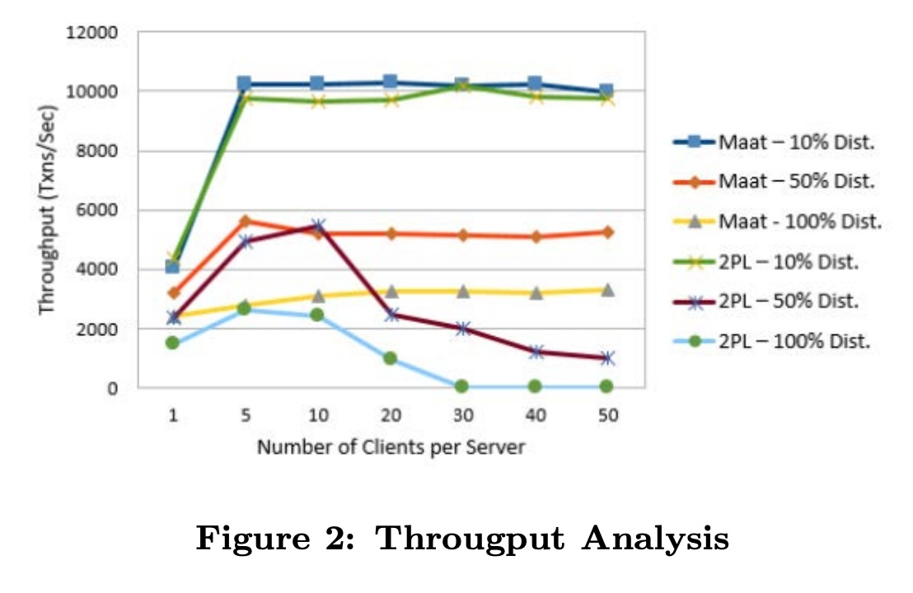
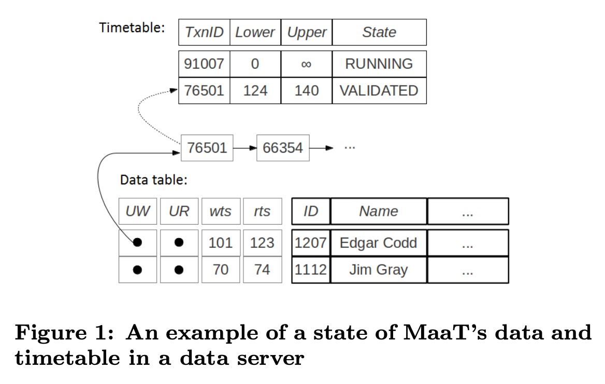
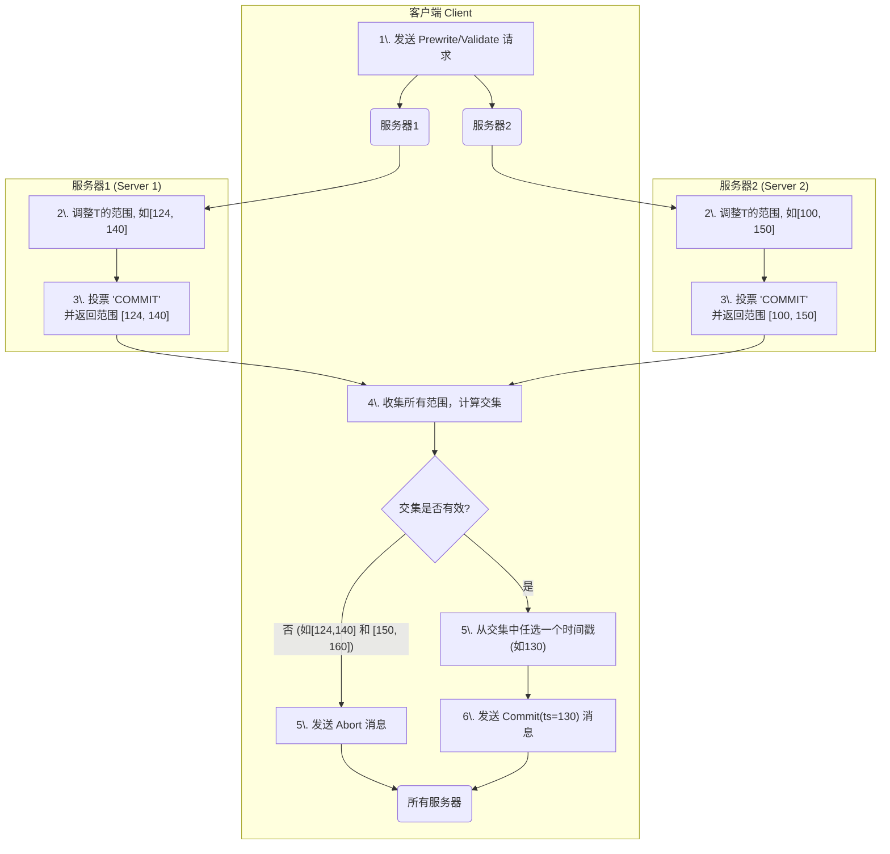
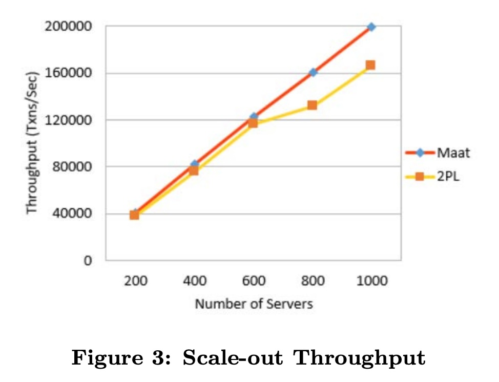
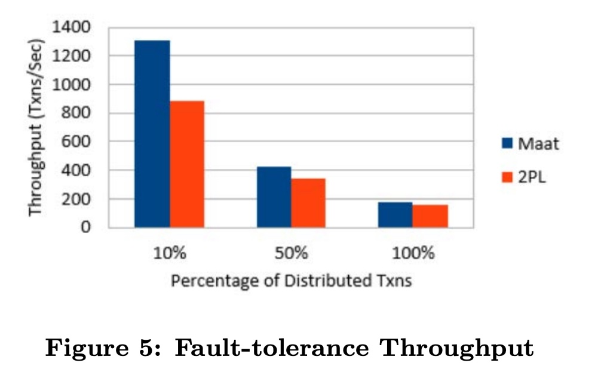

## AI论文解读 | Maat: Effective And Scalable Coordination Of Distributed Transactions In The Cloud
        
### 作者        
digoal        
        
### 日期        
2025-11-03        
        
### 标签        
PostgreSQL , PolarDB , DuckDB , AI , 论文解读        
        
----        
        
## 背景  
      
https://dl.acm.org/doi/pdf/10.14778/2732269.2732270        
  
提示:          
```          
读懂《Maat: Effective And Scalable Coordination Of Distributed Transactions In The Cloud》这篇论文需要提前掌握哪些基础知识, 请使用中文通熟易懂的讲解这些基础知识, 可以引用论文中的图、表或使用Markdown支持的图形(text,mermaid等)增加解释性. 
  
使用中文通熟易懂的解读《Maat: Effective And Scalable Coordination Of Distributed Transactions In The Cloud》这篇论文, 其中的关键内容请着重讲解, 可以引用论文中的图、表或使用Markdown支持的图形(text,mermaid等)增加解释性. 
  
提取《Maat: Effective And Scalable Coordination Of Distributed Transactions In The Cloud》这篇论文中的重要术语, 使用中文对这些术语进行通熟易懂的讲解, 可以引用论文中的图、表或使用Markdown支持的图形(text,mermaid等)增加解释性. 
```     
  
## 1 前置知识 
  
要深入理解《MaaT》这篇论文，你需要先掌握一些数据库和分布式系统领域的基础知识。这篇论文的核心是提出一种新方法（MaaT），用于协调云环境下的“分布式事务”，目标是让它既高效、又能扩展（scalable）。

简单来说，MaaT 试图解决的核心问题是：**如何在由很多台机器组成的云数据库上，既快又准地处理“要么全部成功、要么全部失败”的复杂操作，同时避免传统方法带来的性能瓶颈。**

以下是你需要提前掌握的几个关键基础知识点，我会用通俗的语言来解释：

### 1. 什么是事务 (Transaction) 与 ACID

这是最基础的概念。

* **事务：** 指的是一组数据库操作，这组操作在逻辑上是一个单一的工作单元。最经典的例子是“银行转账”：你从A账户转100元到B账户。
* **ACID：** 这是对事务的四个基本要求：
    * **A - 原子性 (Atomicity):** “转账”这个事务包含两个操作：A账户减100，B账户加100。原子性要求这两个操作**要么都成功，要么都失败**。不能A减了钱，B没收到。
    * **C - 一致性 (Consistency):** 事务必须使数据库从一个一致的状态转移到另一个一致的状态。比如，转账前后，A和B账户的总金额应该是不变的。
    * **I - 隔离性 (Isolation):** 这是论文的重点。当多个事务“并发”（同时）执行时，它们之间不应该互相干扰。比如，在我转账的过程中，另一个人在查询A、B账户的总额，他不应该看到一个“A已经扣款，B还没收款”的中间状态。
    * **D - 持久性 (Durability):** 一旦事务成功“提交”(commit)，它对数据库的更改就必须是永久的，即使系统崩溃了也不会丢失。

### 2. 什么是 "分布式" 事务 (Distributed Transaction)

在云环境中，数据量非常大，通常会被“分区”(partitioning) 存放在成百上千台不同的服务器上 。

* **分布式事务：** 如果一个事务需要读写的数据分布在**多台**不同的服务器上，它就是一个分布式事务。
* **例子：** 还是“银行转账”。如果A账户的数据在服务器1，B账户的数据在服务器2。那么这个“转账”事务就必须跨越两台服务器来协调，确保它们**同时**成功或**同时**失败。这比在单台机器上难得多。

### 3. 什么是并发控制 (Concurrency Control)

这是实现事务“隔离性”(Isolation) 的技术。当两个事务同时访问**同一份**数据时，我们就说它们发生了“冲突”(Conflict)。并发控制就是用来解决冲突的。

这篇论文主要对比了两种主流的并发控制思想：

#### 思想一：悲观并发控制 (Pessimistic) - 先上锁，再办事

* **核心思想：** “悲观”地认为冲突很可能会发生，所以先小人后君子。
* **代表技术：** **两阶段锁定 (2PL - Two-Phase Locking)**。这是大多数传统数据库使用的方法 。
    * **工作方式：** 事务在读取数据时上“读锁”，在修改数据时上“写锁”。你上锁了，别人就得等着你释放锁。
* **论文指出的问题：**
    * **性能差/阻塞 (Blocking):** 事务A锁了数据，事务B就得等着。
    * **死锁 (Deadlock):** A等B的锁，B等A的锁，大家一起卡住。
    * **颠簸 (Thrashing):** 论文在图2 (Figure 2) 中展示了2PL的“颠簸”问题 。当并发量（客户端数量）增加到一定程度（例如超过10），系统中有太多的事务在互相等待锁，导致系统吞吐量（每秒处理的事务数）急剧下降 。     
    * **故障处理难：** 如果一个拿着锁的机器挂了，它持有的锁可能导致其他事务被无限期阻塞 。

#### 思想二：乐观并发控制 (Optimistic / OCC) - 先办事，再检查

* **核心思想：** “乐观”地认为冲突很少发生。
* **工作方式：** 事务先在自己的“私有空间”里执行读写，**不**上锁。
    1.  **读取阶段：** 读数据。
    2.  **验证阶段：** 在准备“提交”时，回去检查“在我工作期间，有没有其他人修改了我读取过的数据？”
    3.  **写入阶段：** 如果验证通过（没冲突），就提交更改。如果验证失败（有冲突），就**中止 (Abort)** 这个事务，然后**重启 (Restart)** 。
* **论文指出的问题：**
    * **重启浪费资源：** 如果一个事务很复杂，最后才发现冲突了，那么它之前做的所有工作都白费了，必须从头再来 。
    * **提交时仍需锁：** 传统的OCC在“验证”和“写入”阶段，为了保证原子性，还是需要在多台机器上短暂地上锁，这没有完全摆脱锁的困扰 。

### 4. 什么是两阶段提交 (2PC - Two-Phase Commit)

这是实现分布式事务“原子性”(Atomicity) 的经典协议。MaaT的一个核心目标就是**消除**在2PC过程中对锁的需求 。

* **背景：** 一个分布式事务，涉及多个服务器（参与者）和一个协调者。
* **工作方式：**
    * **阶段一 (Prepare):** 协调者问所有参与者：“你们准备好提交了吗？” 参与者会检查自己能否完成任务，如果能，就**锁定**相关资源，并回复“准备好了” 。
    * **阶段二 (Commit/Abort):**
        * 如果**所有**参与者都回复“准备好了”，协调者就向所有人发送“提交”命令。
        * 如果**任何一个**参与者回复“不行”（或超时），协调者就向所有人发送“中止”命令。
* **问题：** 在阶段一回复“准备好了”之后，参与者就必须锁定资源，直到收到协调者的最终命令。如果协调者挂了，所有参与者都会被阻塞，这就是“无限期阻塞”问题 。

### 5. 什么是时间戳排序 (Timestamp Ordering)

这是另一种并发控制的思路，也是MaaT技术的核心。

* **核心思想：** 不用锁，而是给每个事务分配一个唯一的时间戳。系统通过比较时间戳来决定事务的执行顺序，确保执行结果等价于“按时间戳顺序”串行执行。
* **MaaT的创新点 (MaaT如何使用)：**
    MaaT没有使用单一的时间戳，而是给每个事务一个 **“动态时间戳范围” (Dynamic Timestamp Ranges)** 。
    * 初始时，一个事务的时间戳范围可能是 [0, ∞]（即“无限大”） 。
    * 当事务T1和T2发生冲突时（比如T1读，T2写），系统**不会**立即中止任何一个事务，而是通过调整它们的时间戳范围来“解决”这个冲突 。
    * 例如，系统可能会把T1的范围调整为 [0, 100]，把T2的范围调整为 [101, ∞]，这实质上是规定了“T1必须在T2之前提交”。
    * 只有当一个事务的时间戳范围被压缩到“无效”（例如 `Lower > Upper`，下限大于上限）时，这个事务才会被迫中止 。

---

### 总结：MaaT 在做什么？

掌握了以上知识后，你就能看懂MaaT的思路了：

1.  MaaT 是一种**乐观并发控制 (OCC)** 方案 。
2.  它**抛弃了传统的锁 (2PL)**，从而避免了死锁和颠簸问题 (Thrashing) 。
3.  它通过使用**动态时间戳范围**，而不是简单的“冲突即重启”，来解决冲突，这**大大降低了事务的中止率** 。
4.  它使用 **“软锁” (Soft Locks)** （一种不阻塞的标记）和数据项上的**读/写时间戳 (rts/wts)**  来帮助调整这些时间戳范围。你可以在论文的 **图1 (Figure 1)** 中看到MaaT的数据结构，包括 `Timetable`（存储事务的 `Lower` 和 `Upper` 范围）和 `Data table`（存储 `wts`, `rts` 以及 `UW`, `UR` 软锁列表）。      
5.  最终，MaaT 实现了一种**完全不需要锁**的（包括在2PC阶段）分布式事务协调机制 。

希望这份基础知识指南能帮助你更顺畅地阅读这篇论文。

您希望我深入解释其中某一个概念（例如 "动态时间戳范围" 或 "两阶段提交"）吗？
  
## 2 解读论文 
  
这是一篇关于**云数据库分布式事务**的重要论文。它提出了一种名为 **MaaT** 的新型并发控制机制 。

简单来说，MaaT 的核心目标是解决一个经典难题：**如何在云环境中，让跨越多台服务器的数据库操作（即“分布式事务”）既能保证数据绝对一致 (ACID)，又能实现极高的性能和扩展性** 。

MaaT 做到这一点的方法是：**彻底抛弃了传统的“锁” (Locking)，实现了一种完全无锁的、基于“动态时间戳范围”的乐观并发控制 (OCC) 方案** 。

下面，我将为您通俗地解读这篇论文的关键内容。

### 1\. 为什么需要MaaT？云数据库的“事务”之痛

在云数据库中，数据被分散（分区）到上百台机器上 。当你执行一个“银行转账”（从A账户转到B账户）时，A账户可能在服务器1，B账户在服务器2。这就构成了一个**分布式事务**。

要保证转账不出错（原子性），就必须协调这两台服务器。传统方法主要有两种，但都有缺陷：

  * **方法一：悲观锁（Pessimistic - 2PL）**

      * **做法：** “先加锁，再办事”。事务在A、B账户上都加上“锁”，在事务完成前，其他任何人都不能碰它们 。
      * **问题：** 在云环境下，这是个灾难。
        1.  **性能差：** 大量事务都在互相等待对方释放锁，导致系统“卡住”（阻塞）。
        2.  **害怕故障：** 如果一个持有锁的机器挂了，它持有的锁可能导致其他事务被无限期“卡死” 。
        3.  **颠簸 (Thrashing)：** 论文的 **图2 (Figure 2)** 清楚地展示了这一点。当并发客户端增多时（横轴），传统2PL（红线和绿线）在分布式事务比例高时（50%和100%），其吞吐量（纵轴）会**急剧崩溃** 。     

  * **方法二：传统乐观锁 (Optimistic - OCC)**

      * **做法：** “先办事，再检查”。事务先假设没有冲突，在最后“提交”时才检查数据是否被他人修改过 。如果发现冲突，就中止并重启 。
      * **问题：**
        1.  **重启浪费：** 冲突多时，大量事务被中止重启，浪费了CPU资源 。
        2.  **没有真正“无锁”：** 在最后的“提交”阶段（即两阶段提交 2PC），为了保证原子性，它们**仍然需要加锁** 。

**MaaT 的目标：** 彻底消除所有锁，包括2PC阶段的锁 ，同时又不像传统OCC那样因为高冲突而导致大量重启。

-----

### 2\. MaaT的核心思想：动态时间戳范围 (Dynamic Timestamp Ranges)

MaaT 是一种**全新设计的乐观并发控制**。它解决冲突的方法不是“加锁”也不是“立即重启”，而是 **“协商”出一个合理的执行顺序** 。

这个“协商”的工具，就是 **动态时间戳范围 (Dynamic Timestamp Ranges)** 。

  * **初始状态：** 每个事务T启动时，都会被分配一个无限大的时间戳范围 `[Lower=0, Upper=∞]` 。这代表它可以在“任何时间点”提交。
  * **冲突处理：** 当事务T在执行过程中遇到冲突时，MaaT**不会**立即中止它，而是会**压缩**它的时间戳范围 。
  * **中止条件：** 只有当一个事务的范围被压缩到“无效”（即 `Lower > Upper`）时，它才会被迫中止 。

**举个例子：**

1.  事务T1启动，范围是 `[0, ∞]`。
2.  T1读取了数据 `x`。`x` 的“最后写入时间戳 (wts)”是 `100`（由一个已提交的事务写入的） 。
3.  **发生冲突（读-写）：** T1读取了`x`在`100`时刻的版本，那么T1的提交时间必须在`100`之后。
4.  **MaaT的操作：** MaaT将T1的范围下限调整为 `100`。T1的范围变为 `[101, ∞]` 。T1继续运行，**没有被阻塞或中止**。
5.  T1又要写入数据 `y`。它发现另一个**正在运行**的事务T2已经读取了 `y`（通过“软锁”发现，后述） 。
6.  **发生冲突（读-写）：** T2读取了 `y` 的旧值，T1要写入新值。为了保证T2的读取有效，T1必须在T2**之后**提交。假设T2当前的范围是 `[105, 120]`。
7.  **MaaT的操作：** T1的提交时间必须晚于T2的提交时间（即 `> 120`）。MaaT将T1的范围下限调整为 `120`。T1的范围变为 `[121, ∞]` 。
8.  **最终：** T1在没有被阻塞的情况下，通过不断“协商”（调整范围），找到了一个可以提交的有效时间点。

-----

### 3\. MaaT如何实现？“三板斧”解构

MaaT通过三个关键机制，将“动态时间戳范围”这个思想变为现实。

#### (1) 软锁 (Soft Locks)：感知“正在运行”的冲突

  * **是什么：** 软锁是事务在读写数据时留下的“标记”，用来告诉其他事务“我正在读/写这个数据” 。
  * **关键点：** 软锁**绝不阻塞**任何其他事务 。它只用于在“验证阶段”收集冲突信息，以便调整时间戳范围 。
  * **类型：** `UW` (Uncommitted Writes) 软写锁，`UR` (Uncommitted Reads) 软读锁 。

#### (2) 数据时间戳 (Data Timestamps)：感知“已经提交”的冲突

  * **是什么：** 每个数据项 `x` 都会额外存储两个时间戳 ：
      * `wts` (write timestamp)：最后*提交*的写操作的时间戳 。
      * `rts` (read timestamp)：最后*提交*的读操作的时间戳 。
  * **作用：** 这两个时间戳代表了“已成定局”的过去。任何新事务都必须通过调整自己的时间戳范围来“尊重”这个历史 。

#### (3) MaaT的数据结构（基于 论文图1）

论文的 **图1 (Figure 1)**  展示了MaaT如何组织这些信息：     

```text
                  [Timetable] (内存中的“事务状态表”)
   TxnID | Lower | Upper | State
+--------+-------+-------+------------+
| 91007  |   0   |   ∞   | RUNNING    |  <-- 新事务
| 76501  |  124  |  140  | VALIDATED  |  <-- 正在提交的事务
+--------+-------+-------+------------+
     |
     +-----------------------------------------+
                                               |
         [Data table] (磁盘上的“数据表”及元数据)  |
 UW | UR | wts | rts | ID   | Name         | ...
+---+----+-----+-----+------+--------------+-----+
| ● | ●  | 101 | 123 | 1207 | Edgar Codd   | ... |
|   | ●  | 70  | 74  | 1112 | Jim Gray     | ... |
+---+----+-----+-----+------+--------------+-----+
```

  * **Timetable：** 存在于每个服务器的内存中，追踪**所有正在运行**的事务及其当前的 `[Lower, Upper]` 时间戳范围和状态（如RUNNING, VALIDATED） 。
  * **Data table：** 存储真实数据，以及：
      * `wts/rts`：记录“已提交”的历史（如 1207号数据被 `101` 时刻写入，`123` 时刻读取） 。
      * `UW/UR`：记录“正在发生”的软锁（如 1207号数据被某个事务（图中显示为76501）加了软写锁） 。

当事务T要读写数据时（例如 1207），它会同时查看 `wts/rts`（历史）和 `UW/UR`（现状），然后在其“验证”阶段  统一调整自己的 `[Lower, Upper]` 范围 。

-----

### 4\. MaaT的“杀手锏”：无锁的两阶段提交 (Lock-Free 2PC)

这是MaaT最显著的优势。传统的2PC需要在“准备”阶段加锁，这会导致阻塞。MaaT的提交流程完全不同：



1.  **阶段1 (Validate)：** 客户端向所有涉及的服务器（如S1, S2）发送“Prewrite-and-Validate”请求 。
2.  **服务器处理：**
      * S1根据自己的数据和软锁，将事务T的范围调整为 `[124, 140]` 。
      * S2根据自己的数据和软锁，将事务T的范围调整为 `[100, 150]` 。
      * S1和S2**不加任何锁**，它们只是各自计算出一个“可提交的时间范围”，然后投票“COMMIT”，并将这个范围返回给客户端 。
3.  **阶段2 (Commit/Abort)：** 客户端收集所有响应 。
      * 它计算所有返回范围的**交集** 。
      * `[124, 140]` ∩ `[100, 150]` = `[124, 140]`。
      * **交集有效！** 
      * 客户端从交集中**任选一个**时间戳，例如 `130`，作为该事务的最终“提交时间戳” 。
      * 客户端向S1和S2发送“Commit”消息，附带时间戳 `130` 。
4.  **写入：** S1和S2收到 `Commit(130)` 消息后，才真正将数据写入，并更新 `wts/rts` 为 `130` 。

**如果交集无效**（例如，S1返回 `[124, 140]`，S2返回 `[150, 160]`），说明在两个服务器上的提交顺序无法协调，客户端会向所有服务器发送“Abort”消息 。

**这个过程全程没有阻塞，没有锁。**

-----

### 5\. MaaT的“成绩单”：实验数据解读

MaaT的性能优势在实验中得到了验证，它在**高冲突、高并发、大规模**的云环境下完胜传统方法。

  * **关键胜利1：MaaT 不会“颠簸” (No Thrashing)**

      * **见 图2 (Figure 2)** ：在50%和100%的分布式事务（高冲突）场景下，随着客户端增多，2PL（两阶段锁）的吞吐量急剧下降 。     
      * **MaaT (蓝色和橙色线) 的吞吐量则保持稳定** 。这证明了无锁设计的优越性。

  * **关键胜利2：MaaT 扩展性极强 (Scales Out)**

      * **见 图3 (Figure 3)** ：当服务器数量从200台增加到1000台时，MaaT（蓝线）的吞吐量基本呈线性增长。     
      * 2PL（橙线）在超过600台服务器后，扩展能力开始跟不上MaaT 。

  * **关键胜利3：MaaT 更“抗揍”（Fault-tolerant）**

      * **见 图5 (Figure 5)** ：在模拟一台服务器故障的情况下（10台服务器中挂1台） 。     
      * MaaT（蓝柱）的吞吐量**远高于**2PL（红柱） 。特别是在10%的分布式事务（标准场景）下，MaaT的吞吐量比2PL高出超过25% 。
      * **原因：** 2PL中，一个服务器故障可能导致锁无法释放，阻塞其他事务。MaaT是无锁的，一个事务的中止（例如超时）不会阻塞其他任何事务 。

### 总结

MaaT 通过**动态时间戳范围**、**软锁**和**数据时间戳**这套组合拳，巧妙地将“冲突”从“必须阻塞或重启”转化为了“协商提交顺序”。它最终实现了一种**完全无锁**的分布式事务处理机制，在性能、可扩展性和故障容忍度上，都显著优于传统的锁和乐观锁机制，是云数据库并发控制领域的一个重要创新。

希望这份解读对您有帮助！您想深入了解MaaT的“垃圾回收”(Garbage Collection) 机制  还是它与“确定性数据库”(Deterministic Locking) 的对比  吗？
  
## 3 术语 
  
好的，我来为您提取并讲解《MaaT》这篇论文中的核心术语。

这篇论文的重点是提出一种名为 MaaT 的**乐观并发控制 (OCC)** 机制 ，它专门为云环境下的**分布式事务**设计，目标是实现高可扩展性、高吞吐量，并避免传统锁机制带来的各种问题 。

以下是理解这篇论文必须掌握的关键术语：

-----

### 1\. 乐观并发控制 (Optimistic Concurrency Control, OCC)

  * **通俗讲解：** 这是一种处理并发事务的“乐观”策略。它假设事务之间很少会发生冲突。
  * **工作方式：** 事务先自由执行（读取数据，在本地缓存中修改），**不上锁**。直到事务准备“提交”时，才进行一次**验证 (Validation)**，检查在它运行期间，它所读取的数据是否已被其他事务修改过。
      * 如果**验证通过**（没冲突），则成功提交。
      * 如果**验证失败**（有冲突），则**中止 (Abort)** 该事务并重启。
  * **论文中的定位：** MaaT 本质上就是一种**重新设计的OCC** 。它保留了OCC不阻塞、不“颠簸”的优点 ，但通过新设计（如下文的“动态时间戳范围”）来解决传统OCC重启率高  和在提交时仍需锁  的问题。

-----

### 2\. 动态时间戳范围 (Dynamic Timestamp Ranges)

  * **通俗讲解：** 这是 MaaT 机制的**绝对核心**。它不是给事务一个“固定”的时间戳，而是给它一个“可以提交”的**时间范围**，这个范围会根据冲突动态调整。
  * **工作方式：**
    1.  **初始化：** 当一个事务 T 启动时，它被赋予一个无限大的时间戳范围，例如 `[Lower=0, Upper=∞]` 。这表示它理论上可以在任何时间点提交。
    2.  **冲突调整：** 当 T 在“验证”阶段发现一个冲突时，MaaT **不会立即中止它**。相反，MaaT 会通过“压缩” T 的时间戳范围来解决这个冲突 。
          * **例1（读-写冲突）：** T 读取了数据 `x`，而 `x` 的“最后写入时间戳 (wts)”是 `100`。这意味着 T 必须在 `100` 之后提交。MaaT 会将 T 的范围调整为 `[Lower=101, Upper=∞]` 。
          * **例2（写-读冲突）：** T 写入了数据 `y`，而 `y` 的“最后读取时间戳 (rts)”是 `74`。这意味着 T 的提交时间必须晚于 `74`。MaaT 会将 T 的范围调整为 `[Lower=75, Upper=∞]` 。
    3.  **中止条件：** 事务 T **只有**在它的时间戳范围被压缩到“无效”（即 `Lower` 大于 `Upper`）时，才会被迫中止 。
  * **优势：** 这种方式将“冲突”转化为了“对提交顺序的约束”，而不是“必须中止”，从而**大大降低了事务的中止率** 。

-----

### 3\. 软锁 (Soft Locks)

  * **通俗讲解：** 为了实现动态时间戳调整，MaaT需要知道“正在运行的”事务（而不仅是“已提交的”）在做什么。软锁就是这个工具。
  * **核心特性：**
    1.  **它不是真锁：** 软锁**绝不会阻塞 (block)** 任何其他事务 。
    2.  **它是“标记”：** 它的唯一作用是 **充当“标记”** ，用来通知其他事务：“嘿，我（一个尚未提交的事务）刚刚读/写了这个数据项。” 。
  * **论文中的实现 (见 图1 )：**     
      * `UW` (Uncommitted Writes)：记录了哪些事务持有该数据的“软写锁” 。
      * `UR` (Uncommitted Reads)：记录了哪些事务持有该数据的“软读锁” 。
  * **作用：** 在“验证”阶段，事务 T 会检查 `UW` 和 `UR` 列表，并根据这些“软冲突”来进一步调整自己的时间戳范围 。

-----

### 4\. MaaT 的数据结构 (Timetable & Data table)

论文中的 **图1 (Figure 1)**  展示了 MaaT 运行所需的数据结构，这对于理解其工作原理至关重要：

```text
[Timetable] (内存中的“事务状态表”)
   TxnID | Lower | Upper | State
+--------+-------+-------+------------+
| 91007  |   0   |   ∞   | RUNNING    |  <-- 追踪活跃事务
| 76501  |  124  |  140  | VALIDATED  |  <-- 及其动态时间戳范围
+--------+-------+-------+------------+
     |
     +-----------------------------------------+
                                               |
         [Data table] (数据表本身，附带元数据)    |
 UW | UR | wts | rts | ID   | Name         | ...
+---+----+-----+-----+------+--------------+-----+
| ● | ●  | 101 | 123 | 1207 | Edgar Codd   | ... |
|   | ●  | 70  | 74  | 1112 | Jim Gray     | ... |
+---+----+-----+-----+------+--------------+-----+
```

  * **Timetable (时刻表)：**
      * **讲解：** 这是一个在每台服务器内存中维护的哈希表 。
      * **作用：** 它追踪所有**正在运行 (RUNNING)** 或**正在验证 (VALIDATED)** 的事务 。
      * **关键字段：** 存储每个事务的 `TxnID`、`Lower`（时间戳下限）、`Upper`（时间戳上限）和 `State`（状态） 。
  * **Data table (数据表) 的元数据：**
      * **讲解：** 除了存储“Edgar Codd”这样的真实数据外，每一行数据还附加了4个用于并发控制的元数据 。
      * **`wts` (write timestamp)：** 记录最后**已提交**的写入操作的时间戳 。
      * **`rts` (read timestamp)：** 记录最后**已提交**的读取操作的时间戳 。
      * **`UW` (Uncommitted Writes)：** 持有该数据“软写锁”的事务列表 。
      * **`UR` (Uncommitted Reads)：** 持有该数据“软读锁”的事务列表 。

-----

### 5\. 无锁两阶段提交 (Lock-Free Two-Phase Commit)

  * **通俗讲解：** 传统上，分布式事务的“提交”需要一个“两阶段提交 (2PC)”协议，而这个协议在“准备”阶段**需要加锁** ，这又回到了锁的问题。MaaT 的设计彻底消除了这个锁。
  * **MaaT 的 2PC 流程：**
    1.  **阶段1 (Validate)：** 客户端向所有涉及的服务器（如 S1、S2）发送“Prewrite-and-Validate”请求 。
          * S1 和 S2 各自独立地调整该事务的时间戳范围，例如 S1 算出范围是 `[124, 140]`，S2 算出是 `[100, 150]` 。
          * 它们**不加锁**，只是把这个计算出的范围返回给客户端 。
    2.  **阶段2 (Commit)：** 客户端收集所有服务器返回的范围。
          * 计算这些范围的**交集** (Intersection) 。
          * (例如：`[124, 140]` ∩ `[100, 150]` = `[124, 140]`)
          * 如果交集**有效**（`Lower <= Upper`），客户端就从交集中**任选一个**时间戳（例如 `130`）作为最终的“提交时间戳” 。
          * 然后，客户端向所有服务器发送 `Commit(130)` 消息 。
          * 如果交集**无效**（例如 `[124, 140]` 和 `[150, 160]`），则事务中止 。
  * **优势：** 整个提交过程**完全没有使用任何（硬）锁** ，避免了2PC协议中的阻塞问题 。

-----

### 6\. 颠簸 (Thrashing)

  * **通俗讲解：** 这是**基于锁 (Lock-based)** 的系统（如 2PL）中的一个“性能崩溃”现象 。
  * **发生过程：**
    1.  当系统中的并发事务数量（并发度）增加时，事务之间互相持有对方所需锁的概率变大。
    2.  事务开始花费大量时间在“等待锁”上，而不是在“执行工作”上。
    3.  当并发度超过某个临界点后，系统的有效吞吐量（每秒完成的事务数）会**急剧下降**，而不是保持平稳或上升 。
  * **论文中的展示：** **图2 (Figure 2)**  完美地展示了“颠簸”。     
      * **2PL**（红线和绿线）在客户端数量（横轴）超过10个时，其吞吐量（纵轴） **迅速崩溃** ，掉到了接近零 。
      * **MaaT**（蓝色、橙色、黄色线）则**完全没有颠簸** 。其吞吐量在高并发下保持稳定，证明了其设计的优越性 。

希望这些讲解能帮助您理解 MaaT 的核心创新点！
  
## 参考        
         
https://dl.acm.org/doi/pdf/10.14778/2732269.2732270    
        
<b> 以上内容基于DeepSeek、Qwen、Gemini及诸多AI生成, 轻微人工调整, 感谢杭州深度求索人工智能、阿里云、Google等公司. </b>        
        
<b> AI 生成的内容请自行辨别正确性, 当然也多了些许踩坑的乐趣, 毕竟冒险是每个男人的天性.  </b>        
    
#### [期望 PostgreSQL|开源PolarDB 增加什么功能?](https://github.com/digoal/blog/issues/76 "269ac3d1c492e938c0191101c7238216")
  
  
#### [PolarDB 开源数据库](https://openpolardb.com/home "57258f76c37864c6e6d23383d05714ea")
  
  
#### [PolarDB 学习图谱](https://www.aliyun.com/database/openpolardb/activity "8642f60e04ed0c814bf9cb9677976bd4")
  
  
#### [PostgreSQL 解决方案集合](../201706/20170601_02.md "40cff096e9ed7122c512b35d8561d9c8")
  
  
#### [德哥 / digoal's Github - 公益是一辈子的事.](https://github.com/digoal/blog/blob/master/README.md "22709685feb7cab07d30f30387f0a9ae")
  
  
#### [About 德哥](https://github.com/digoal/blog/blob/master/me/readme.md "a37735981e7704886ffd590565582dd0")
  
  

  
