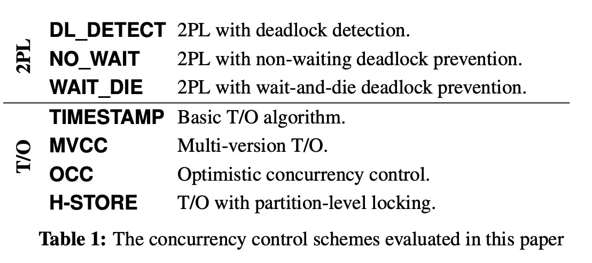
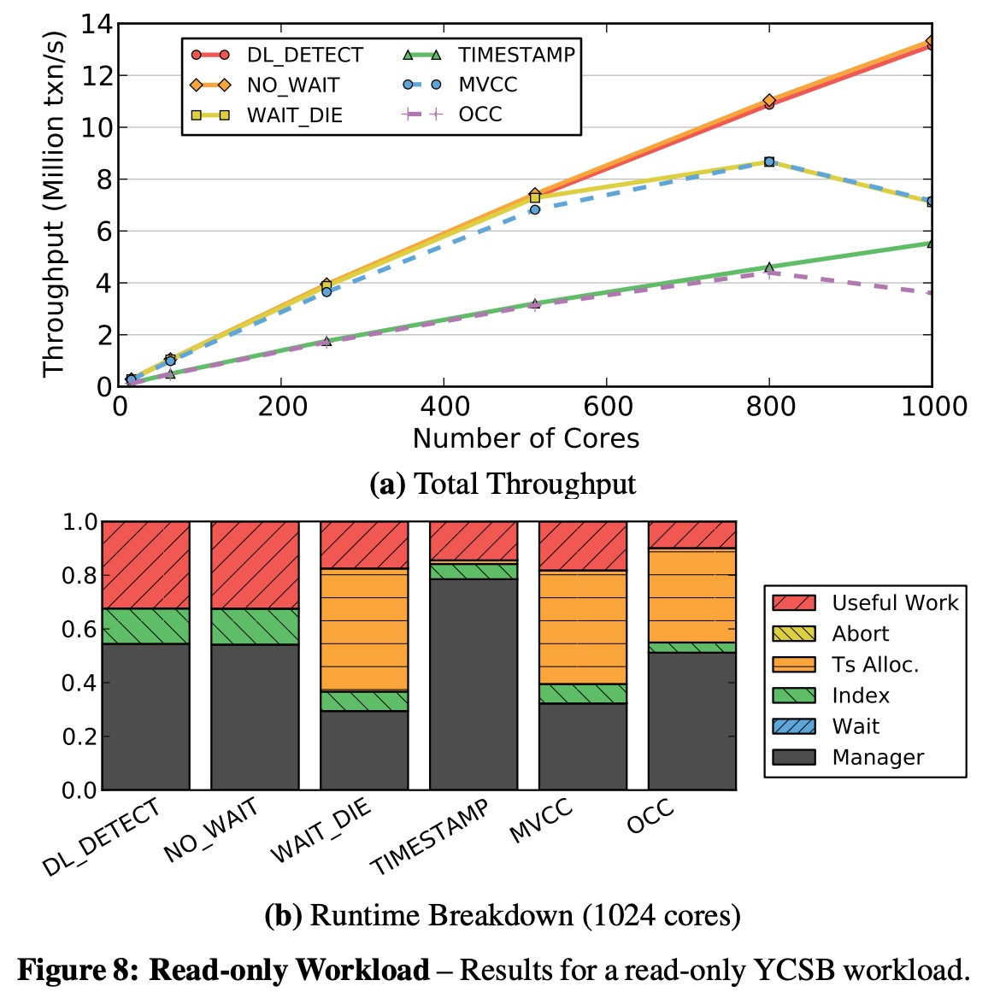
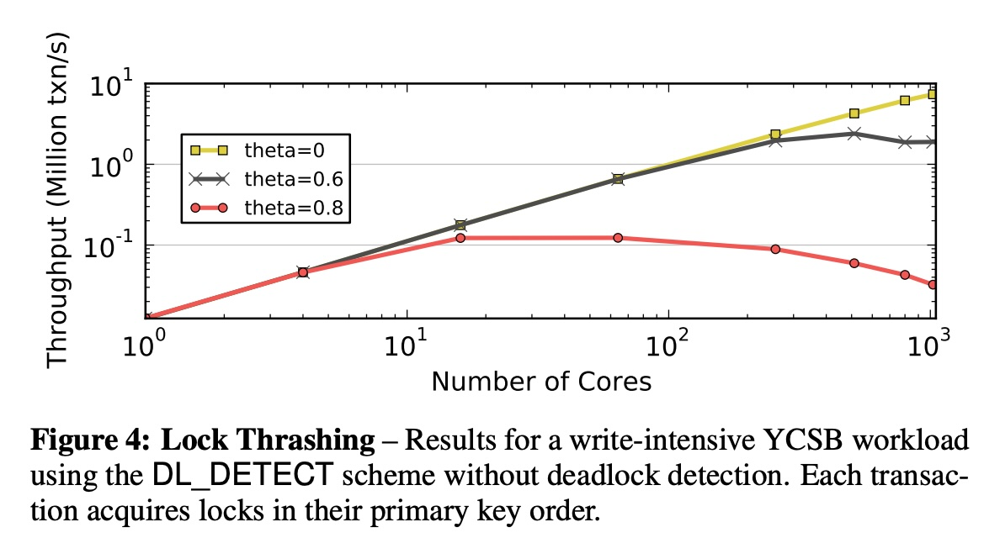
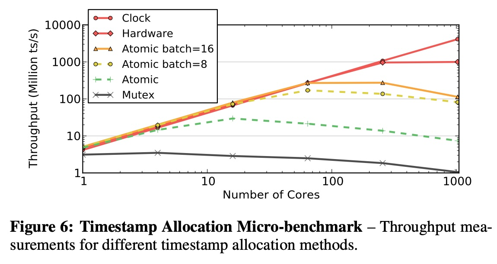
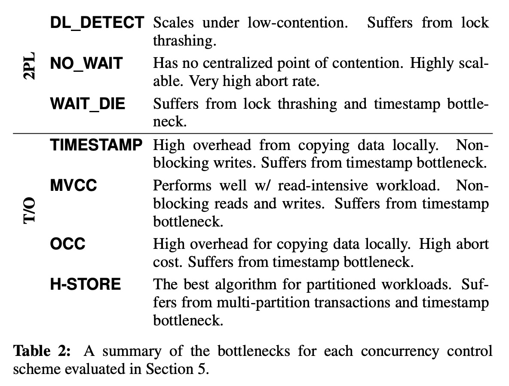
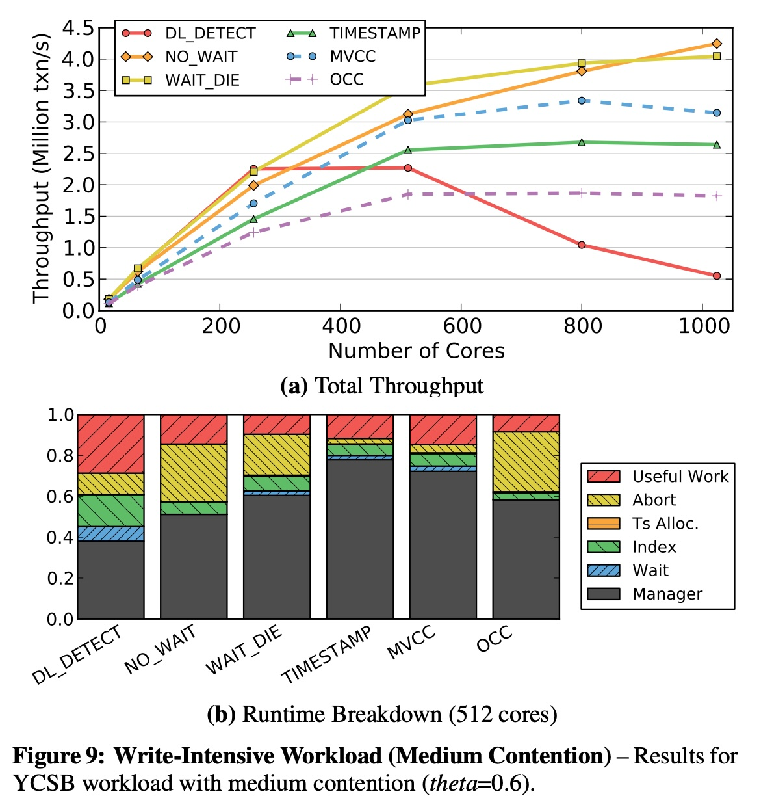
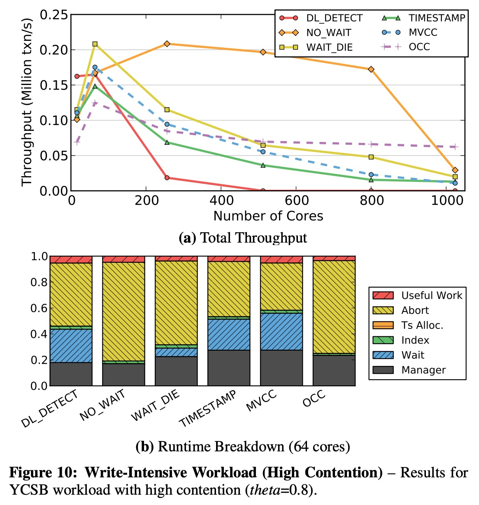

## AI论文解读 | Staring Into The Abyss: An Evaluation Of Concurrency Control With One Thousand Cores
        
### 作者        
digoal        
        
### 日期        
2025-11-03        
        
### 标签        
PostgreSQL , PolarDB , DuckDB , AI , 论文解读        
        
----        
        
## 背景  
      
https://github.com/lonng/db-papers/blob/main/papers/transaction/staring-into-the-abyss:-an-evaluation-of-concurrency-control-with-one-thousand-cores.pdf        
  
提示:          
```          
读懂《Staring Into The Abyss: An Evaluation Of Concurrency Control With One Thousand Cores》这篇论文需要提前掌握哪些基础知识, 请使用中文通熟易懂的讲解这些基础知识, 可以引用论文中的图、表或使用Markdown支持的图形(text,mermaid等)增加解释性. 
  
使用中文通熟易懂的解读《Staring Into The Abyss: An Evaluation Of Concurrency Control With One Thousand Cores》这篇论文, 其中的关键内容请着重讲解, 可以引用论文中的图、表或使用Markdown支持的图形(text,mermaid等)增加解释性. 
  
提取《Staring Into The Abyss: An Evaluation Of Concurrency Control With One Thousand Cores》这篇论文中的重要术语, 使用中文对这些术语进行通熟易懂的讲解, 可以引用论文中的图、表或使用Markdown支持的图形(text,mermaid等)增加解释性. 
```     
  
## 1 前置知识 
  
你好！很高兴能为你解读这篇经典的数据库论文。

这篇论文《Staring into the Abyss: An Evaluation of Concurrency Control with One Thousand Cores》（中文可译为《凝视深渊：千核环境下的并发控制评估》）是一篇非常著名的“系统性评估”论文。它探讨了一个核心问题：**当CPU核心多达1000个时，现有的数据库并发控制算法还扛得住吗？**  结论是：都扛不住，但“死法”各不相同 。

要透彻理解这篇论文，你需要先掌握以下几个基础知识。我会用通俗的语言为你讲解。

-----

### 1\. 核心概念：什么是“事务” (Transaction) 和 ACID？

这是理解数据库并发控制的基石。

  * **什么是事务？**
    你可以把“事务”想象成一个“**不可分割的操作包**”。最经典的例子就是银行转账：

    > **A 转给 B 100 元**
    > 这个操作包包含两个动作：

    > 1.  A 的账户 -100 元
    > 2.  B 的账户 +100 元

    > 这两个动作必须**要么都成功，要么都失败**。不能只减了A的钱，B没收到，那钱就丢了。

  * **什么是 ACID？**
    为了保证事务的可靠性，数据库系统必须遵循四个特性，简称 ACID ：

      * **A - 原子性 (Atomicity):** 事务是“原子的”，不可分割。要么全做，要么全不做 。
      * **C - 一致性 (Consistency):** 事务前后，数据库的“规矩”不能坏。比如，银行的总存款在转账前后应该是不变的。
      * **I - 隔离性 (Isolation):** 这篇论文的**核心**！当很多事务**同时**运行时，它们互相不应该感觉到对方的存在 。A转账给B的同时，C也在转账给D，两者不应互相干扰。
      * **D - 持久性 (Durability):** 事务一旦提交（成功），数据就必须永久保存下来，就算系统断电了也一样。

**这篇论文主要研究的就是如何实现“I”（隔离性）** ，也就是“并发控制”。

### 2\. 核心问题：为什么需要“并发控制” (Concurrency Control)？

想象一下，如果没有“隔离性”，多个人同时操作共享数据（比如抢同一张火车票），会发生什么？

  * **脏读 (Dirty Read):** A修改了数据，但还没提交（可能最后反悔了），B却读到了这个“脏”数据。
  * **不可重复读 (Non-Repeatable Read):** A 第一次读了数据，B 这时修改了它，A 第二次读发现数据变了。
  * **幻读 (Phantom Read):** A 第一次读了一批数据，B 这时插入了新数据，A 第二次读发现多了一些“幽灵”数据。

**并发控制 (Concurrency Control, 简称CC)** 的目的，就是设计一套机制（算法），允许数据库**同时**处理大量事务，同时又**防止**上述这些混乱情况发生，让每个事务都感觉自己是“包场”在跑 。

### 3\. 关键技术：两大类并发控制算法

这篇论文评估的7种算法 ，基本都属于以下两大派系。你可以把它们想象成两种处理“抢着用资源”的策略：

#### A. 悲观派：先加锁再说 (Two-Phase Locking, 2PL)

  * **核心思想：** “我预感会冲突，所以我先锁住我要用的东西，别人别动。” 这是一种**悲观**策略 。
  * **如何工作：** 就像你去图书馆自习，先把座位上的书包放好（加锁）。它分为两个阶段 ：
    1.  **增长阶段 (Growing):** 事务只能不断地**获取**锁。
    2.  **缩减阶段 (Shrinking):** 事务一旦**释放**了任何一个锁，就不能再获取新锁了。
  * **带来的问题：** **死锁 (Deadlock)** 。
    > 事务 A 锁住了数据1，想去锁数据2；
    > 事务 B 锁住了数据2，想去锁数据1。
    > 结果 A 和 B 互相等待对方释放锁，永远等下去，系统就卡死了。

论文中评估的 `DL_DETECT` (死锁检测) , `NO_WAIT` (不等待) , `WAIT_DIE` (等待-死亡)  都是 2PL 解决死锁问题的不同变种。

#### B. 乐观派：先干了再说 (Timestamp Ordering & OCC)

  * **核心思想：** “我猜冲突不常有，我先干活，最后提交时再检查。” 这是一种**乐观**策略。
  * **如何工作（T/O 时间戳排序）：**
    系统在事务开始时给它盖个“时间戳” 。当事务要去读写数据时，数据库会比较事务的时间戳和数据上“最后被访问”的时间戳，来决定这个操作是否“合法”（即是否符合历史顺序）。如果不合法，事务就得**中止 (Abort)** 并重启 。
  * **如何工作（OCC 乐观并发控制）：**
    事务先把所有修改写在自己的“小本本”（私有空间）上 。到最后提交时，系统会进行一次“**验证 (Validation)**”，检查在它干活期间，它读过的数据是不是被别人改了。如果被改了（冲突了），就抛弃“小本本”，事务中止 。
  * **关键变种（MVCC 多版本并发控制）：**
    这是T/O的一个重要变种。它不直接覆盖旧数据，而是**为每次修改创建新版本** 。
    > 比如，一个数据X，原先是10。
    > 事务T1（时间戳是1:00）把它改成12。
    > 事务T2（时间戳是1:05）把它改成15。
    > 数据库里会同时存在：X(v1, 1:00, 12) 和 X(v2, 1:05, 15)。
    > **好处是：** “读”和“写”不会冲突。一个晚来的“读”事务（比如时间戳是1:02），可以去读老版本 X(v1)，而不用等 T2 。

-----

为了帮你理清论文到底对比了什么，这篇论文的 **表1 (Table 1)**  总结了它评估的7种算法，我把它翻译并简化如下：     

| 派系 | 算法名称 | 中文解释 | 核心机制 |
| :--- | :--- | :--- | :--- |
| **2PL (悲观锁)** | `DL_DETECT` | 死锁**检测** | 加锁，但系统会定期检查有没有死锁  |
| **2PL (悲观锁)** | `NO_WAIT` | 死锁**预防** (不等待) | 加锁，如果锁被占，立刻中止，不等待  |
| **2PL (悲观锁)** | `WAIT_DIE` | 死锁**预防** (等待-死亡) | 加锁，如果锁被占，根据时间戳决定是等待还是中止  |
| **T/O (乐观)** | `TIMESTAMP` | 基础时间戳排序 | 用时间戳排序所有操作  |
| **T/O (乐观)** | `MVCC` | 多版本时间戳 | 为修改创建新版本，读写不冲突  |
| **T/O (乐观)** | `OCC` | 乐观并发控制 | 先执行，最后提交时才验证冲突  |
| **T/O (乐观)** | `H-STORE` | 分区锁定 | T/O的一种，但锁的粒度是整个“数据分区”  |

-----

### 4\. 时代背景：“千核” (Many-core) 意味着什么？

这篇论文的精髓在于“**千核**”这个背景。

  * **过去：** 我们靠提高单个CPU的“主频”来提升速度（单核性能）。
  * **现在与未来：** 单核性能到顶了 。芯片厂商转而在一块芯片上塞入**海量**的、相对简单的核心（比如100、1000个）。
  * **带来的挑战：** “并发”的程度高了成百上千倍。
    想象一下，1000个核心同时在跑1000个事务，如果它们都需要访问一个**共享的、中心化的资源**，会发生什么？
    > 比如，所有“悲观锁” (2PL) 都需要查询一个 **中心化的“锁表”** 。
    > 比如，所有“乐观派” (T/O) 都需要从一个 **中心化的“发号器”** 获取时间戳。
    > 这个中心点会瞬间被打爆，成为系统的**超级瓶颈**。1000个核心都在排队等这一个资源，CPU再多也没用，这就是“可扩展性 (Scalability)”崩溃了 。

这篇论文的“深渊 (Abyss)”指的就是这种：在核数极高时，传统算法中那些不起眼的“中心化”小开销被无限放大，最终吞噬了所有性能的恐怖未来。

### 5\. 如何评估：吞吐量 (Throughput) 和 时间分解 (Runtime Breakdown)

最后，你需要看懂论文的评估图表。

  * **吞吐量 (Throughput):** 衡量系统性能的核心指标。单位是“**百万事务/秒** (Million txn/s)” 。越高越好。
  * **时间分解 (Runtime Breakdown):** 这类图表是这篇论文的精华，它展示了 CPU 的时间都花在哪了。

我们来看一个例子，论文的 **图8 (Figure 8)** (我用文字解释图b的构成)：     

```text
[ (a) 总吞吐量图 ]      [ (b) 1024核时的时间分解图 ]
                          +------------------+
 ^                        |  Useful Work     |  <-- 真正干活的时间 (希望它占比高)
 |                        |  (有用功)        |
T                        +------------------+
h                        |  Abort           |  <-- 事务中止和回滚的时间
r                        +------------------+
o                        |  Ts Alloc.       |  <-- **获取时间戳**的排队时间
u                        +------------------+
g                        |  Index           |  <-- 查索引的时间
h                        +------------------+
p                        |  Wait            |  <-- **等待锁**的排队时间
u                        +------------------+
t                        |  Manager         |  <-- **管理锁或时间戳**的CPU时间 (瓶颈!)
 |                        +------------------+
 +-----> Cores             (DL_DETECT) (NO_WAIT) ... (OCC)
```

通过看 (b) 图 ，你就能一针见血地分析出：

  * `DL_DETECT` 这类 2PL 算法，在1024核时，大部分时间都花在了 `Wait`（等锁）和 `Manager`（管理锁）上。
  * `TIMESTAMP`, `MVCC`, `OCC` 这类 T/O 算法，则有大量时间花在了 `Ts Alloc.`（排队领时间戳）上 。

**总结：** 2PL 算法死于“**锁竞争**”瓶颈，T/O 算法死于“**时间戳分配**”瓶颈。

### 总结

要读懂这篇论文，你需要的基础知识是：

1.  **数据库事务 (ACID)**，尤其是隔离性。
2.  **并发控制的必要性**（防止数据错乱）。
3.  **两大派系算法**：悲观锁 (2PL) 和乐观流 (T/O, OCC, MVCC)。
4.  **多核/千核的挑战**：中心化资源的竞争会成为超级瓶颈。
5.  **如何看懂评估**：吞吐量（越高越好）和时间分解（看瓶颈在哪）。

希望这份导读对你有帮助！

-----

接下来，你希望我为你深入讲解论文中提到的某一个具体算法（比如 MVCC 或 OCC），还是某个具体的瓶颈（比如“锁抖动 Lock Thrashing”或“时间戳分配”）呢？
  
## 2 解读论文 
  
你好，很高兴为你解读这篇在数据库领域极具影响力的经典论文。

**《凝视深渊：千核环境下的并发控制评估》**（Staring into the Abyss: An Evaluation of Concurrency Control with One Thousand Cores）这篇论文，光看标题就很有冲击力。“深渊”指的就是“一千个CPU核心”这个在当时（2014年）还未实现、但即将到来的多核（Many-core）时代 。

这篇论文的核心是 **一次“压力测试”** ，它要回答一个问题：

> **“当CPU核心数从个位数暴增到1000个时，我们现有的数据库并发控制（CC）算法还顶得住吗？”**  
>  
> **剧透答案：顶不住。所有的算法都失败了 ，但这篇论文的价值在于揭示了它们是如何以不同的方式“阵亡”的。**  

### 1\. 为什么要做这个研究？（背景）

在论文发表前，芯片的发展已经遇到了瓶颈。厂商们不再追求把单个CPU核心做得更快（提高时钟频率），而是转向在单个芯片上塞进海量的核心（比如几十核、几百核）。

但问题是，数据库管理系统（DBMSs）并不是为这种“千军万马”的并行场面设计的 。当1000个核心同时运行1000个事务（比如1000个人同时抢票或转账），它们会疯狂地竞争访问同一份数据。负责协调秩序的“并发控制”机制，很可能会从“协调者”变成“最大的瓶颈”。

### 2\. 什么是并发控制？（核心概念）

你可以把“并发控制”（Concurrency Control, CC）想象成 **管理数据库读写的“交通规则”** 。它的目标是保证事务的**隔离性（Isolation）** ——即保证每个事务都感觉自己是“包场”在访问数据，不会被其他同时运行的事务干扰，避免出现数据错乱（比如脏读、幻读）。

这篇论文主要评估了当时主流的两大派系共7种算法 ，我们可以用一个简化的**表1**  来概括它们：     

| 派系 | 算法名称 | 中文通俗解释 |
| :--- | :--- | :--- |
| **悲观锁 (2PL)** | `DL_DETECT` | “先加锁，再干活”。系统会定期**检测**有没有“死锁” 。 |
| **(Pessimistic)** | `NO_WAIT` | “先加锁，再干活”。如果锁被占，**立刻失败**（中止），不等待 。 |
| | `WAIT_DIE` | “先加锁，再干活”。如果锁被占，根据“年龄”（时间戳）决定是**等待还是失败** 。 |
| **乐观流 (T/O)** | `TIMESTAMP` | “先干活，后检查”。给每个事务盖个**时间戳**，按顺序来 。 |
| **(Optimistic)** | `MVCC` | **多版本**。写操作不覆盖旧数据，而是创建新版本 。读写互不阻塞。 |
| | `OCC` | **乐观并发控制**。事务先把修改写在“小本本”上，提交时才检查有没有冲突 。 |
| | `H-STORE` | **分区锁**。把数据分成一块块（Partition），锁的粒度是整个“分区” 。 |

### 3\. 实验是怎么做的？（方法）

由于当时不存在1000核的商用CPU，作者们：

1.  **使用了模拟器（Graphite）** ：一个能模拟高达1024个核心运行的CPU模拟器 。
2.  **自建了DBMS**：他们实现了一个轻量级的“内存数据库”测试平台 。这样做是为了排除掉商业数据库中其他复杂功能（如日志、恢复）的干扰，确保他们测出来的瓶颈**只在于并发控制算法本身** 。
3.  **运行标准负载**：使用了YCSB和TPC-C这两个业界标准的数据库性能测试工具 。

### 4\. 关键发现：两大派系的“深渊”（着重讲解）

这篇论文最核心的贡献，就是清晰地指出了不同算法在“千核”压力下的**具体死因**。

#### A. 悲观锁 (2PL) 的深渊：锁抖动 (Lock Thrashing)

  * **现象**：当核心数（并发量）增加时，采用“等待”策略的2PL算法（如 `DL_DETECT`）性能会急剧下降。

  * **死因**：“锁抖动” 。

      * 在低并发时，A事务锁住数据，B事务等待，A很快释放，B继续，一切正常。
      * 在1000核的超高并发下，A等B，B等C，C等D……D又在等A。大量事务（CPU核心）的时间**不是在“干活”（Useful Work），而是在“互相等待”** 。
      * 系统花了90%的力气在排队和管理这个排队（锁管理）上，真正执行的事务吞吐量趋近于零。

  * **图表示意**：
    论文中的**图4 (Figure 4)**  非常经典地展示了这一点。     

    ```text
    ▲ 吞吐量 (Throughput)
    |
    |         /------------------\  <-- theta=0 (低冲突), 性能随核心数线性增长
    |        /                    \
    |       /                      \
    |      / .......................\ <-- theta=0.6 (中冲突), 在几百核后开始下降 
    |     /
    |    /---\
    |   /     \..................... <-- theta=0.8 (高冲突), 性能在16核就到顶, 随后暴跌 
    |
    +----------------------------------->
                      核心数量 (Number of Cores)
    ```

    在高数据冲突（theta=0.8）时，核心越多，性能反而越差，这就是“锁抖动”吞噬了系统性能。

#### B. 乐观流 (T/O) 的深渊：时间戳分配 (Timestamp Allocation)

  * **现象**：乐观流算法（如 `TIMESTAMP`, `MVCC`, `OCC`, `H-STORE`）一开始扩展性很好，但在核心数非常高时，性能同样无法继续提升。

  * **死因**：“时间戳分配”成了中心瓶颈 。

      * 这些算法都需要一个“发号器”来给每个新事务分配一个**全局唯一且递增的时间戳（Timestamp）** 。
      * 在1000核下，所有核心都在**排队等待**这个中心化的“发号器” 。
      * 就算使用最高效的“原子加法”（Atomic Add）指令来实现发号器，这个操作本身也需要在所有CPU核心的缓存间同步，导致了巨大的通信开销（缓存一致性流量）。

  * **图表示意**：
    论文的**图6 (Figure 6)**  揭示了这个瓶颈。     

    ```text
     ▲ 吞吐量 (每秒百万时间戳) - (对数坐标)
     |
     |          .................................  <-- Hardware (硬件实现, 理想情况) 
     |         /
     |        /
     |       /
     |      /------\.............................  <-- Atomic (原子加法), 在32核左右到顶, 随后性能下降 
     |     /
     |    /
     |   /--\....................................  <-- Mutex (互斥锁), 性能极差, 随核心数下降 
     |
     +------------------------------------------->
                     核心数量 (Number of Cores) - (对数坐标)
    ```

    这张图表明，即使用软件能做的最好的“Atomic”（原子操作），这个“发号器”在千核环境下也崩溃了。

### 5\. 总结：所有算法的“墓志铭”

论文的**表2 (Table 2)**  是对所有算法最精辟的总结，清晰地指出了它们各自的瓶颈：     

| 算法 | 总结 (优点) | 瓶颈 (死因) |
| :--- | :--- | :--- |
| **DL\_DETECT** | 在低冲突时扩展性好。 | **锁抖动 (Lock Thrashing)**。 |
| **NO\_WAIT** | 可扩展性强，没有中心瓶颈。 | **极高的事务中止率** (不断重试)。 |
| **WAIT\_DIE** | (综合了2PL和T/O) | **锁抖动** + **时间戳分配瓶颈**。 |
| **TIMESTAMP** | 写入非阻塞。 | 复制数据的开销高；**时间戳分配瓶颈**。 |
| **MVCC** | 读写全非阻塞，读密集型负载性能好。 | **时间戳分配瓶颈**；(版本管理开销)。 |
| **OCC** | (数据复制开销高) | 中止代价高 (要回滚)；**时间戳分配瓶颈**。 |
| **H-STORE** | 分区负载的王者。 | 依赖分区；**时间戳分配瓶颈**。 |

### 6\. 结论与启示

这篇论文得出了一个略显“悲观”但非常重要的结论：
**不要指望通过“缝缝补补”的增量式改进来解决千核时代的数据库并发问题** 。

我们必须彻底重新思考数据库的架构 。这篇论文启发了后续大量的研究，方向包括：

1.  **软硬件协同设计**：论文明确指出，像“时间戳分配”这样的瓶颈，可能需要专门的**硬件**（如`Hardware`计数器）来解决 。
2.  **去中心化设计**：避免任何形式的“全局共享”数据结构，无论是锁表还是时间戳分配器。
3.  **分区（Partitioning）** ：H-STORE的思路是对的，让每个核心只管自己的一亩三分地（分区），尽可能避免跨区协作。

总而言之，这篇论文就像一个“吹哨人”，它系统性地证明了传统并发控制算法在“核海战术”面前的局限性，并为数据库系统未来的发展指明了新的（也是更艰难的）方向。
  
## 3 术语 
  
好的，这篇论文《凝视深渊：千核环境下的并发控制评估》是数据库领域的经典之作。它探讨了当CPU核心数量从几个增长到一千个时，传统的数据库并发控制算法会遇到哪些前所未有的挑战。

以下是从论文中提取的重要术语及其通俗易懂的中文讲解，并均已标注来源。

### 1. 核心背景与问题

**🔹 Many-core (多核 / 千核)**
* **讲解**：指在一个芯片上集成了几十、几百甚至上千个处理核心的CPU架构 。这篇论文的“深渊”（Abyss）指的就是这种前所未有的高并发环境 。
* **为什么重要**：传统数据库是为个位数核心设计的 。当1000个核心同时工作时，协调它们（并发控制）的开销被急剧放大，成为了新的性能瓶颈 。

**🔹 OLTP (联机事务处理)**
* **讲解**：OLTP (On-line Transaction Processing) 指的是那些需要与终端用户实时交互的应用 ，比如航班预订、银行转账或电子商务订单。
* **特点**：这类事务通常很**短小**（short-lived）、只访问**少量数据**（small subset of data），并且会**重复执行**（repetitive）。

**🔹 Scalability (可扩展性)**
* **讲解**：指系统性能是否能随着资源（在这里是CPU核心）的增加而线性增长。
* **论文的发现**：在千核环境下，论文中测试的所有并发控制算法都**未能**实现良好的可扩展性 。

**🔹 Bottleneck (瓶颈)**
* **讲解**：指系统中那个限制了整体性能的“最窄的瓶口”。即使其他部分再快，只要瓶颈存在，系统总性能就上不去 。
* **论文的贡献**：这篇论文系统性地识别了不同算法在千核环境下的**根本瓶颈**（fundamental bottlenecks）。

---

### 2. 核心概念与技术

**🔹 Transaction (事务) 与 ACID**
* **讲解**：“事务”是数据库执行的一个“工作单元”，它由一个或多个操作（如SQL查询）组成 。
* **ACID** 是数据库为了保证事务可靠性必须遵守的四个特性 ：
    1.  **A (Atomicity, 原子性)**：事务要么全部完成，要么全部不做 。
    2.  **C (Consistency, 一致性)**：事务执行后，数据库状态保持一致（比如转账后总金额不变）。
    3.  **I (Isolation, 隔离性)**：并发执行的事务互不干扰，感觉就像只有自己在运行 。
    4.  **D (Durability, 持久性)**：事务一旦提交，数据就永久保存 。

**🔹 Concurrency Control (CC, 并发控制)**
* **讲解**：这就是本文的核心研究对象。它是一种机制，用于协调多个并发（同时）访问数据库的事务，同时保证事务的隔离性和原子性 。

**🔹 论文评估的7种并发控制方案 (见论文表1 )**     

这7种方案基本分为两大派系：

| 派系 | 算法 | 中文讲解 | 核心机制 |
| :--- | :--- | :--- | :--- |
| **悲观派 (2PL)** | `DL_DETECT` | **两阶段锁定 (2PL) + 死锁检测** ：先加锁，再干活。系统会定期检查有没有事务在互相等待（死锁）。 |
| (Pessimistic) | `NO_WAIT` | **2PL + 不等待** ：如果请求的锁被占用，事务**立刻中止**（abort）并重启，绝不等待 。 |
| | `WAIT_DIE` | **2PL + 等待-死亡** ：事务有“年龄”（时间戳）。“年轻”的事务（时间戳大）去请求“年长”的锁时，必须“死亡”（中止）；反之则可以“等待” 。 |
| **乐观派 (T/O)** | `TIMESTAMP` | **基础时间戳排序 (T/O)** ：系统预先给每个事务分配时间戳 。如果事务访问了“未来”的数据（即被更晚时间戳的事务修改过），则中止 。 |
| (Optimistic) | `MVCC` | **多版本并发控制** ：写操作不直接覆盖数据，而是创建**新版本** 。读操作根据自己的时间戳去读取对应的旧版本，读写互不阻塞 。 |
| | `OCC` | **乐观并发控制** ：事务先把所有修改写在自己的“私有空间” 。到提交时才进行“验证”，检查读过的数据是否被别人改了 。如果冲突，则中止 。 |
| | `H-STORE` | **分区锁定** ：数据库被分成多个“分区” 。事务在执行前必须获取它需要访问的所有分区的锁 。 |

---

### 3. 关键瓶颈（“深渊”的真面目）

论文发现，所有算法在千核下都失败了，但“死法”不同。

**🔹 Lock Thrashing (锁抖动)**
* **讲解**：这是**悲观锁 (2PL) 算法**（尤其是`DL_DETECT`）的**主要死因** 。
* **发生过程**：在核心数非常多、数据竞争（Contention）非常激烈时，大量事务都在互相等待对方释放锁 。CPU的大部分时间都花在了“排队等待”上，而不是“干活”（Useful Work），导致系统吞吐量急剧下降，几乎停滞 。
* **图示**：论文的**图4 (Figure 4)**  清晰地显示了在高竞争（theta=0.8）下，吞吐量在16核就达到顶峰，随后随着核心数增加而**暴跌**。     

**🔹 Timestamp Allocation (时间戳分配)**
* **讲解**：这是**乐观派 (T/O) 算法**（如`TIMESTAMP`, `MVCC`, `OCC`, `H-STORE`）的**共同瓶颈** 。
* **发生过程**：所有这些算法都需要一个“发号器”来为每个事务分配一个全局唯一且递增的时间戳 。在1000核环境下，所有核心都在疯狂请求这个“发号器”。
* **为什么是瓶颈**：即使使用最高效的原子加法指令（Atomic Addition），这个操作也需要同步所有核心的缓存 ，导致大量跨核通信 。这个“发号器”成了那个“最慢的收费站”，限制了整个系统（见论文**图6 (Figure 6)** ）。     

**🔹 Contention / Skew (竞争 / 数据倾斜)**
* **讲解**：“竞争”指多个事务试图同时访问同一条数据 。
* **Skew (数据倾斜)**：指数据访问**不均匀**，遵循**Zipfian分布** 。例如，电商系统里90%的访问都集中在10%的“爆款”商品上。
* **为什么重要**：高竞争和高倾斜是导致“锁抖动”的直接原因 。论文通过调整YCSB基准测试的`theta`参数来模拟不同程度的倾斜 。

---

### 4. 评估指标

**🔹 Throughput (吞吐量)**
* **讲解**：衡量系统性能的核心指标，指单位时间内（每秒）系统能成功完成多少事务 。单位通常是“百万事务/秒”（Million txn/s）。

**🔹 Runtime Breakdown (运行时分解)**
* **讲解**：这是论文用来诊断瓶颈的“显微镜” 。它把事务执行的每一刻时间归类到不同部分（见论文**图8b, 9b, 10b**）：           
    * `USEFUL WORK` (有效工作)：真正执行事务逻辑的时间 。
    * `ABORT` (中止开销)：事务失败后回滚所花的时间 。
    * `TS ALLOCATION` (时间戳分配)：花在排队等时间戳上的时间 。（T/O算法的瓶颈点）
    * `WAIT` (等待)：花在等待锁或等待数据上的时间 。（2PL算法的瓶颈点）
    * `MANAGER` (管理器开销)：花在并发控制管理器（如锁管理器）上的CPU时间 。

通过分析这些“分解图”，作者能清晰地看到是`WAIT`时间（锁抖动）还是`TS ALLOCATION`时间（时间戳分配）吃掉了CPU的性能。
  
## 参考        
         
https://github.com/lonng/db-papers/blob/main/papers/transaction/staring-into-the-abyss:-an-evaluation-of-concurrency-control-with-one-thousand-cores.pdf    
        
<b> 以上内容基于DeepSeek、Qwen、Gemini及诸多AI生成, 轻微人工调整, 感谢杭州深度求索人工智能、阿里云、Google等公司. </b>        
        
<b> AI 生成的内容请自行辨别正确性, 当然也多了些许踩坑的乐趣, 毕竟冒险是每个男人的天性.  </b>        
    
#### [期望 PostgreSQL|开源PolarDB 增加什么功能?](https://github.com/digoal/blog/issues/76 "269ac3d1c492e938c0191101c7238216")
  
  
#### [PolarDB 开源数据库](https://openpolardb.com/home "57258f76c37864c6e6d23383d05714ea")
  
  
#### [PolarDB 学习图谱](https://www.aliyun.com/database/openpolardb/activity "8642f60e04ed0c814bf9cb9677976bd4")
  
  
#### [PostgreSQL 解决方案集合](../201706/20170601_02.md "40cff096e9ed7122c512b35d8561d9c8")
  
  
#### [德哥 / digoal's Github - 公益是一辈子的事.](https://github.com/digoal/blog/blob/master/README.md "22709685feb7cab07d30f30387f0a9ae")
  
  
#### [About 德哥](https://github.com/digoal/blog/blob/master/me/readme.md "a37735981e7704886ffd590565582dd0")
  
  

  
