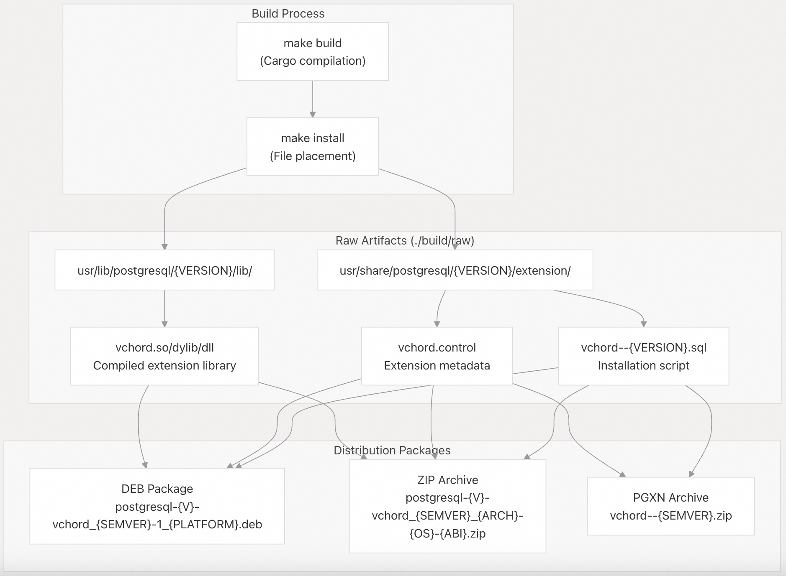
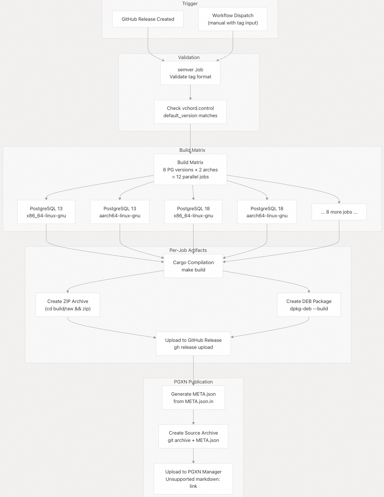
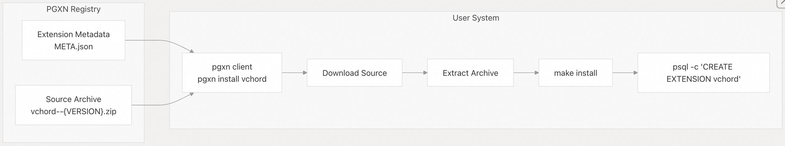

## VectorChord 源码学习: 5.4 封装与分发 (Packaging and Distribution)     
                                
### 作者                                
digoal                                
                                
### 日期                                
2025-11-03                                
                                
### 标签                                
VectorChord , 源码学习                                
                                
----                                
                                
## 背景                                
本文介绍 VectorChord 的封装与分发 (packaging and distribution) 机制，包括包格式 (package formats)、制品结构 (artifact structure)、发布自动化 (release automation) 和安装方法 (installation methods)。  
  
VectorChord 提供三种主要的**分发渠道 (distribution channels)**：  
  
1.  **DEB packages** (DEB 包) - 具有适当依赖管理 (dependency management) 的原生 Debian/Ubuntu 包。  
2.  **ZIP archives** (ZIP 压缩包) - 用于手动安装的平台特定二进制文件包 (binary bundles)。  
3.  **PGXN registry** (PGXN 注册中心) - 用于自动化安装的 PostgreSQL 扩展网络 (PostgreSQL Extension Network)。  
  
-----  
  
## 包格式 (Package Formats)  
  
### DEB 包结构 (DEB Package Structure)  
  
Debian 包是针对 PostgreSQL 版本与架构 (architecture) 的每种组合构建的，遵循标准的 Debian 封装惯例 (packaging conventions)：  
  
```  
postgresql-{VERSION}-vchord_{SEMVER}-1_{PLATFORM}.deb  
├── DEBIAN/  
│   ├── control          # Package metadata and dependencies  
│   └── md5sums          # File integrity checksums  
└── usr/  
    ├── lib/postgresql/{VERSION}/lib/  
    │   └── vchord.so    # Shared library  
    └── share/postgresql/{VERSION}/extension/  
        ├── vchord.control  
        └── vchord--{SEMVER}.sql  
```  
  
**包元数据 (Package Metadata)** ([`.github/workflows/release.yml` 98-108](https://github.com/tensorchord/VectorChord/blob/ac12e257/.github/workflows/release.yml#L98-L108)):  
  
| 字段 (Field) | 描述 (Description) | 示例 (Example) |  
| :--- | :--- | :--- |  
| `Package` | 包名称 | `postgresql-15-vchord` |  
| `Version` | 语义版本 (Semantic version) | `0.2.1-1` |  
| `Depends` | 运行时依赖项 (Runtime dependencies) | `postgresql-15, libgcc-s1, libc6 (>= 2.35)` |  
| `Architecture` | 平台架构 (Platform architecture) | `amd64`, `arm64` |  
| `Section` | Debian 分区 | `database` |  
| `Maintainer` | 联系信息 | `Tensorchord <support@tensorchord.ai>` |  
| `License` | 双重许可模型 (Dual license model) | `AGPL-3.0-only or Elastic-2.0` |  
  
DEB 构建过程 (DEB build process) ([`.github/workflows/release.yml` 96-110](https://github.com/tensorchord/VectorChord/blob/ac12e257/.github/workflows/release.yml#L96-L110)):  
  
1.  将扩展文件 (extension files) 安装到 `./build/deb`，并使用正确的 PostgreSQL 路径。  
2.  使用特定版本依赖项创建 `DEBIAN/control` 文件。  
3.  为所有安装的文件生成 MD5 校验和 (checksums)。  
4.  使用带有 `xz` 压缩和 `root` 权限的 `dpkg-deb` 工具。  
  
**来源 (Sources)**: [`.github/workflows/release.yml` 96-110](https://github.com/tensorchord/VectorChord/blob/ac12e257/.github/workflows/release.yml#L96-L110) [`.github/workflows/check.yml` 228-239](https://github.com/tensorchord/VectorChord/blob/ac12e257/.github/workflows/check.yml#L228-L239)  
  
### ZIP 存档结构 (ZIP Archive Structure)  
  
ZIP 存档包含未经包元数据 (package metadata) 包装的原始编译文件 (raw compiled files)，适用于手动安装或不支持包管理器 (package manager) 的环境：  
  
```  
postgresql-{VERSION}-vchord_{SEMVER}_{ARCH}-{OS}-{ABI}.zip  
└── raw/  
    ├── usr/lib/postgresql/{VERSION}/lib/  
    │   └── vchord.{so|dylib|dll}  
    └── usr/share/postgresql/{VERSION}/extension/  
        ├── vchord.control  
        └── vchord--{SEMVER}.sql  
```  
  
平台特定命名约定 (Platform-specific naming conventions) ([`.github/workflows/check.yml` 236-323](https://github.com/tensorchord/VectorChord/blob/ac12e257/.github/workflows/check.yml#L236-L323)):  
  
| OS/ABI | 架构 (Architecture) | 三元组 (Triple) | 库扩展名 (Library Extension) |  
| :--- | :--- | :--- | :--- |  
| Linux (GNU) | x86\_64 | `x86_64-linux-gnu` | `.so` |  
| Linux (GNU) | aarch64 | `aarch64-linux-gnu` | `.so` |  
| Linux (musl) | x86\_64 | `x86_64-linux-musl` | `.so` |  
| Linux (musl) | aarch64 | `aarch64-linux-musl` | `.so` |  
| macOS | x86\_64 | `x86_64-apple-darwin` | `.dylib` |  
| macOS | aarch64 | `aarch64-apple-darwin` | `.dylib` |  
| Windows | x86\_64 | `x86_64-pc-windows-msvc` | `.dll` |  
  
ZIP 存档在构建完成后创建 ([`.github/workflows/release.yml` 94](https://github.com/tensorchord/VectorChord/blob/ac12e257/.github/workflows/release.yml#L94-L94)):  
```  
(cd ./build/raw && zip -r ../postgresql-${VERSION}-vchord_${SEMVER}_${ARCH}-linux-gnu.zip .)  
```  
  
**来源 (Sources)**: [`.github/workflows/release.yml` 94](https://github.com/tensorchord/VectorChord/blob/ac12e257/.github/workflows/release.yml#L94-L94) [`.github/workflows/check.yml` 236-323](https://github.com/tensorchord/VectorChord/blob/ac12e257/.github/workflows/check.yml#L236-L323)  
  
-----  
  
## 构建制品结构 (Build Artifact Structure)  
  
所有分发格式 (distribution formats) 均源自 `./build/raw` 目录，该目录由 `make install` 目标 (target) 填充：  
  
  
  
**核心扩展文件 (Core Extension Files)**:  
  
1.  **共享库 (Shared Library)** ([`.github/workflows/check.yml` 230-232](https://github.com/tensorchord/VectorChord/blob/ac12e257/.github/workflows/check.yml#L230-L232)):  
      * 包含已编译 Rust 代码的平台特定扩展 (Platform-specific extension)  
      * 在 SQL 脚本中被 `MODULE_PATHNAME` 引用  
      * 必须与 PostgreSQL 版本和架构 (architecture) 匹配  
2.  **控制文件 (Control File)** (`vchord.control`):  
      * 扩展元数据 (Extension metadata)，包括 `default_version`  
      * 指定要求：`requires = 'vector'`  
      * 声明 `shared_preload_libraries` 的必要性  
3.  **SQL 安装脚本 (SQL Installation Scripts)** ([`sql/install/vchord--0.2.1.sql` 1-500](https://github.com/tensorchord/VectorChord/blob/ac12e257/sql/install/vchord--0.2.1.sql)):  
      * 由 `pgrx_embed_vchord` 自动生成   
      * 包含类型 (types)、操作符 (operators)、函数 (functions) 和访问方法 (access methods) 的 DDL (Data Definition Language)  
      * 注释 (Comments) 指示源 Rust 函数  
  
**来源 (Sources)**: [`.github/workflows/check.yml` 228-239](https://github.com/tensorchord/VectorChord/blob/ac12e257/.github/workflows/check.yml#L228-L239) [`.github/workflows/release.yml` 92-110](https://github.com/tensorchord/VectorChord/blob/ac12e257/.github/workflows/release.yml#L92-L110) [`sql/install/vchord--0.2.1.sql` 1-500](https://github.com/tensorchord/VectorChord/blob/ac12e257/sql/install/vchord--0.2.1.sql#L1-L500)  
  
-----  
  
## 发布工作流 (Release Workflow)  
  
发布过程通过 GitHub Actions 完全自动化 (fully automated)，由创建 GitHub 发布 (GitHub release) 或手动工作流调度 (manual workflow dispatch) 触发。  
  
  
  
**工作流阶段 (Workflow Stages)** ([`.github/workflows/release.yml` 1-147](https://github.com/tensorchord/VectorChord/blob/ac12e257/.github/workflows/release.yml#L1-L147)):  
  
### 阶段 1: 语义版本验证 (Semantic Versioning Validation)  
  
`semver` 作业 (job) 验证版本格式 ([`.github/workflows/release.yml` 18-36](https://github.com/tensorchord/VectorChord/blob/ac12e257/.github/workflows/release.yml#L18-L36)):  
  
  * 接受来自 `github.event.inputs.tag` (手动) 或 `github.event.release.tag_name` (自动) 的输入。  
  * 根据语义版本 (semver) 正则表达式进行验证：`^(0|[1-9]\d*)\.(0|[1-9]\d*)\.(0|[1-9]\d*)(?:-.*)?(?:\+.*)?$`  
  * 如果标签 (tag) 与有效的语义版本 (semantic versioning) 不匹配，则失败。  
  * 为后续作业输出已验证的 `SEMVER`。  
  
### 阶段 2: 构建矩阵执行 (Build Matrix Execution)  
  
每个构建作业 (build job) ([`.github/workflows/release.yml` 38-122](https://github.com/tensorchord/VectorChord/blob/ac12e257/.github/workflows/release.yml#L38-L122)):  
  
**环境设置 (Environment Setup)** ([`.github/workflows/release.yml` 52-75](https://github.com/tensorchord/VectorChord/blob/ac12e257/.github/workflows/release.yml#L52-L75)):  
  
```  
rustup update  
sudo apt-get install postgresql-server-dev-${VERSION}  
export PGRX_PG_CONFIG_PATH=pg_config  
export PG_CONFIG=pg_config  
```  
  
**版本验证 (Version Verification)** ([`.github/workflows/release.yml` 79-83](https://github.com/tensorchord/VectorChord/blob/ac12e257/.github/workflows/release.yml#L79-L83)):  
  
```  
grep -q "default_version = '${SEMVER}'" vchord.control || exit 1  
```  
  
确保 `vchord.control` 包含匹配的版本后才继续进行。  
  
**制品创建 (Artifact Creation)** ([`.github/workflows/release.yml` 86-110](https://github.com/tensorchord/VectorChord/blob/ac12e257/.github/workflows/release.yml#L86-L110)):  
  
1.  **ZIP 存档 (ZIP Archive)**:  
  
```  
make PG_CONFIG=$PG_CONFIG build  
(cd ./build/raw && zip -r ../postgresql-${VERSION}-vchord_${SEMVER}_${ARCH}-linux-gnu.zip .)  
```  
  
2.  **DEB 包 (DEB Package)**:  
  
```  
make DESTDIR="./build/deb" install  
mkdir -p ./build/deb/DEBIAN  
echo "Package: postgresql-${VERSION}-vchord..." > ./build/deb/DEBIAN/control  
(cd ./build/deb && find usr -type f -print0 | xargs -0 md5sum) > ./build/deb/DEBIAN/md5sums  
dpkg-deb --root-owner-group -Zxz --build ./build/deb/ ./build/postgresql-${VERSION}-vchord_${SEMVER}-1_${PLATFORM}.deb  
```  
  
**上传到 GitHub (Upload to GitHub)** ([`.github/workflows/release.yml` 112-122](https://github.com/tensorchord/VectorChord/blob/ac12e257/.github/workflows/release.yml#L112-L122)):  
  
```  
gh release upload --clobber $SEMVER ./build/postgresql-${VERSION}-vchord_${SEMVER}-1_${PLATFORM}.deb  
gh release upload --clobber $SEMVER ./build/postgresql-${VERSION}-vchord_${SEMVER}_${ARCH}-linux-gnu.zip  
```  
  
`--clobber` 标志允许在重新运行工作流时覆盖现有文件。  
  
**来源 (Sources)**: [`.github/workflows/release.yml` 18-122](https://github.com/tensorchord/VectorChord/blob/ac12e257/.github/workflows/release.yml#L18-L122)  
  
### 阶段 3: PGXN 发布 (PGXN Publication)  
  
`pgxn` 作业在所有构建完成后运行 ([`.github/workflows/release.yml` 123-147](https://github.com/tensorchord/VectorChord/blob/ac12e257/.github/workflows/release.yml#L123-L147)):  
  
**META.json 生成 (META.json Generation)** ([`.github/workflows/release.yml` 138](https://github.com/tensorchord/VectorChord/blob/ac12e257/.github/workflows/release.yml#L138-L138)):  
  
```  
sed -e "s/@DISTVERSION@/${SEMVER}/g" META.json.in > META.json  
```  
  
模板使用实际的语义版本 (semver) 替换版本占位符 (version placeholders)。  
  
**源存档创建 (Source Archive Creation)** ([`.github/workflows/release.yml` 139](https://github.com/tensorchord/VectorChord/blob/ac12e257/.github/workflows/release.yml#L139-L139)):  
  
```  
git archive --format zip --prefix "vchord-${SEMVER}/" --add-file META.json -o "./build/vchord--${SEMVER}.zip" HEAD  
```  
  
这将创建一个源分发 (source distribution)，包括：  
  
  * 发布提交 (release commit) 时的所有 Git 跟踪文件 (Git-tracked files)  
  * 带有正确版本的生成的 `META.json`  
  * 用于解压的正确目录前缀  
  
**PGXN 上传 (PGXN Upload)** ([`.github/workflows/release.yml` 141-146](https://github.com/tensorchord/VectorChord/blob/ac12e257/.github/workflows/release.yml#L141-L146)):  
  
```  
curl --fail -sS \
  --user "tensorchord:${PGXN_PASSWORD}" \
  -F "submit=Release It!" \
  -F "archive=@./build/vchord--${SEMVER}.zip" \
  -H "X-Requested-With: XMLHttpRequest" \
  https://manager.pgxn.org/upload  
```  
  
上传使用带有身份验证 (authentication) 的 HTTP 表单提交，使扩展程序立即可在 PGXN 上使用。  
  
**来源 (Sources)**: [`.github/workflows/release.yml` 123-147](https://github.com/tensorchord/VectorChord/blob/ac12e257/.github/workflows/release.yml#L123-L147)  
  
## PGXN 发布 (PGXN Publication)  
  
PostgreSQL 扩展网络（PostgreSQL Extension Network, **PGXN**）提供了集中的扩展发现和安装功能。VectorChord 发布源代码发行版（source distributions），用户可以使用 `pgxn` 客户端工具进行安装。  
  
### `META.json` 结构 (`META.json` Structure)  
  
PGXN 要求一个 `META.json` 元数据文件来描述扩展。VectorChord 采用模板方法：  
  
**模板 (`META.json.in`)** [`.github/workflows/release.yml` 138](https://github.com/tensorchord/VectorChord/blob/ac12e257/.github/workflows/release.yml#L138-L138)：  
  
```  
{  
  "name": "vchord",  
  "abstract": "Vector database plugin for Postgres",  
  "version": "@DISTVERSION@",  
  "maintainer": "TensorChord <vectorchord-inquiry@tensorchord.ai>",  
  "license": "agpl_3",  
  "provides": {  
    "vchord": {  
      "abstract": "Vector database plugin",  
      "file": "src/lib.rs",  
      "docfile": "README.md",  
      "version": "@DISTVERSION@"  
    }  
  },  
  "resources": {  
    "homepage": "https://vectorchord.ai/",  
    "repository": {  
      "url": "https://github.com/tensorchord/VectorChord",  
      "web": "https://github.com/tensorchord/VectorChord",  
      "type": "git"  
    }  
  }  
}  
```  
  
在发布期间，`@DISTVERSION@` 占位符会被实际的语义版本（Semantic Version, **semver**）替换。  
  
### PGXN 安装流程 (PGXN Installation Flow)  
  
  
  
用户可以通过以下命令从 PGXN 安装：  
  
```bash  
pgxn install vchord  
psql -c "CREATE EXTENSION vchord CASCADE"  
```  
  
PGXN 会自动执行以下操作：  
  
1.  从 PGXN 注册表（registry）下载源代码  
2.  使用适当的 `PG_CONFIG` 运行 `make install`  
3.  将文件安装到 PostgreSQL 目录  
  
**来源** (Sources)：[`.github/workflows/release.yml` 138-146](https://github.com/tensorchord/VectorChord/blob/ac12e257/.github/workflows/release.yml#L138-L146)  
  
-----  
  
## 安装方法 (Installation Methods)  
  
VectorChord 支持多种安装方法，具体取决于目标环境和用户偏好。  
  
### 方法 1：DEB 软件包安装 (Recommended for Debian/Ubuntu)  
  
**先决条件** (Prerequisites)：  
  
  * 从官方 APT 仓库安装的 PostgreSQL。  
  * 下载的软件包与 PostgreSQL 版本匹配。  
  
**安装步骤** (Installation Steps)：  
  
```bash  
# Download DEB package for your PostgreSQL version and architecture  
wget https://github.com/tensorchord/VectorChord/releases/download/0.2.1/postgresql-15-vchord_0.2.1-1_amd64.deb  
  
# Install with apt (resolves dependencies automatically)  
sudo apt install ./postgresql-15-vchord_0.2.1-1_amd64.deb  
  
# Configure shared_preload_libraries  
sudo -u postgres psql -c "ALTER SYSTEM SET shared_preload_libraries = 'vchord'"  
  
# Restart PostgreSQL  
sudo systemctl restart postgresql  
  
# Create extension in database  
psql -c "CREATE EXTENSION vchord CASCADE"  
```  
  
**依赖关系解析** (Dependency Resolution) [`.github/workflows/release.yml` 100](https://github.com/tensorchord/VectorChord/blob/ac12e257/.github/workflows/release.yml#L100-L100)：  
DEB 软件包会自动安装所需的系统库：  
  
  * `postgresql-{VERSION}` - 确保匹配的 PostgreSQL 安装  
  * `libgcc-s1` - GCC 运行时库  
  * `libc6 (>= 2.35)` - C 标准库  
  
**来源** (Sources)：[`.github/workflows/release.yml` 96-110](https://github.com/tensorchord/VectorChord/blob/ac12e257/.github/workflows/release.yml#L96-L110)  
  
### 方法 2：通过 ZIP 手动安装 (Manual Installation from ZIP)  
  
**使用场景** (Use Cases)：  
  
  * 非 Debian 系统（RHEL、Alpine、macOS、Windows）  
  * 自定义 PostgreSQL 安装  
  * 无法访问软件包管理器（package manager）的环境  
  
**安装步骤** (Installation Steps) [`.github/workflows/check.yml` 228-232](https://github.com/tensorchord/VectorChord/blob/ac12e257/.github/workflows/check.yml#L228-L232)：  
  
```bash  
# Download ZIP for your platform  
wget https://github.com/tensorchord/VectorChord/releases/download/0.2.1/postgresql-15-vchord_0.2.1_x86_64-linux-gnu.zip  
  
# Extract archive  
unzip postgresql-15-vchord_0.2.1_x86_64-linux-gnu.zip  
  
# Determine PostgreSQL directories  
PKGLIBDIR=$(pg_config --pkglibdir)  
SHAREDIR=$(pg_config --sharedir)  
  
# Install shared library  
sudo cp usr/lib/postgresql/15/lib/vchord.so "$PKGLIBDIR/"  
  
# Install extension files  
sudo cp usr/share/postgresql/15/extension/vchord.control "$SHAREDIR/extension/"  
sudo cp usr/share/postgresql/15/extension/vchord--*.sql "$SHAREDIR/extension/"  
  
# Configure and restart (same as DEB method)  
sudo -u postgres psql -c "ALTER SYSTEM SET shared_preload_libraries = 'vchord'"  
sudo systemctl restart postgresql  
psql -c "CREATE EXTENSION vchord CASCADE"  
```  
  
**平台特定注意事项** (Platform-Specific Notes)：  
  
| 平台 (Platform) | 库位置 (Library Location) | 配置文件 (Configuration File) |  
| :--- | :--- | :--- |  
| Linux | `$PKGLIBDIR/vchord.so` | `/etc/postgresql/{VERSION}/main/postgresql.conf` |  
| macOS | `$PKGLIBDIR/vchord.dylib` | `/usr/local/var/postgresql@{VERSION}/postgresql.conf` |  
| Windows | `%PKGLIBDIR%\vchord.dll` | `%PGDATA%\postgresql.conf` |  
  
**来源** (Sources)：[`.github/workflows/check.yml` 228-239](https://github.com/tensorchord/VectorChord/blob/ac12e257/.github/workflows/check.yml#L228-L239) [`.github/workflows/check.yml` 312-323](https://github.com/tensorchord/VectorChord/blob/ac12e257/.github/workflows/check.yml#L312-L323)  
  
### 方法 3：PGXN 安装 (PGXN Installation)  
  
**先决条件** (Prerequisites)：  
  
  * 已安装 `pgxn` 客户端  
  * 构建工具链（Build toolchain，Rust、Clang、PostgreSQL 开发头文件）  
  
**安装步骤** (Installation Steps)：  
  
```bash  
# Install build dependencies  
sudo apt install -y postgresql-server-dev-15 clang-18  
  
# Install Rust toolchain  
curl --proto '=https' --tlsv1.2 -sSf https://sh.rustup.rs | sh  
  
# Install from PGXN (builds from source)  
pgxn install vchord  
  
# Create extension  
psql -c "CREATE EXTENSION vchord CASCADE"  
```  
  
PGXN 会自动执行以下操作：  
  
1.  从 PGXN 注册表（registry）下载源代码  
2.  使用适当的 `PG_CONFIG` 运行 `make install`  
3.  将文件安装到 PostgreSQL 目录  
  
**来源** (Sources)：[`.github/workflows/release.yml` 123-147](https://github.com/tensorchord/VectorChord/blob/ac12e257/.github/workflows/release.yml#L123-L147)  
  
### 方法 4：从源代码构建 (Build from Source)  
  
对于开发或自定义配置，请参阅 构建系统 (Build System) 获取编译说明。  
  
-----  
  
## 版本管理 (Version Management)  
  
### 版本一致性 (Version Consistency)  
  
VectorChord 在多个文件中保持版本一致性：  
  
**主要版本来源** (Primary Version Source) [`.github/workflows/release.yml` 83](https://github.com/tensorchord/VectorChord/blob/ac12e257/.github/workflows/release.yml#L83-L83)：  
  
  * `vchord.control` 包含 `default_version = 'X.Y.Z'`  
  * 这是扩展的**权威版本** (authoritative version)  
  * 必须与 Git **发布标签**（release tag）匹配  
  
**版本验证** (Version Validation) [`.github/workflows/release.yml` 79-83](https://github.com/tensorchord/VectorChord/blob/ac12e257/.github/workflows/release.yml#L79-L83)：  
  
```  
grep -q "default_version = '${SEMVER}'" vchord.control || exit 1  
```  
  
如果版本不匹配，**发布工作流**（release workflow）将失败。  
  
### SQL 升级脚本 (SQL Upgrade Scripts)  
  
VectorChord 提供了用于版本升级的 SQL 脚本：  
  
```  
sql/  
├── install/  
│   └── vchord--0.2.1.sql          # Fresh installation  
└── upgrade/  
    └── vchord--0.2.0--0.2.1.sql   # Upgrade path  
```  
  
**升级脚本结构** (Upgrade Script Structure) [`sql/upgrade/vchord--0.2.0--0.2.1.sql` 1](https://github.com/tensorchord/VectorChord/blob/ac12e257/sql/upgrade/vchord--0.2.0--0.2.1.sql#L1-L1)：  
  
大多数次要版本升级（minor version upgrades）都是**空操作**（no-ops），因为：  
  
  * 扩展使用 `shared_preload_libraries`，这需要服务器重启  
  * 函数定义使用 `MODULE_PATHNAME`，会自动解析到新的库  
  * 类型定义保持**二进制兼容**（binary compatible）  
  
**版本检测** (Version Detection)：  
  
```bash  
SELECT default_version, installed_version FROM pg_available_extensions WHERE name = 'vchord';  
```  
  
**升级执行** (Upgrade Execution)：  
  
```sql  
ALTER EXTENSION vchord UPDATE TO '0.2.1';  
```  
  
PostgreSQL 会自动选择适当的升级路径。  
  
**来源** (Sources)：[`sql/upgrade/vchord--0.2.0--0.2.1.sql` 1](https://github.com/tensorchord/VectorChord/blob/ac12e257/sql/upgrade/vchord--0.2.0--0.2.1.sql#L1-L1) [`.github/workflows/release.yml` 79-83](https://github.com/tensorchord/VectorChord/blob/ac12e257/.github/workflows/release.yml#L79-L83)  
  
-----  
  
## CI/CD Artifact Management (持续集成/持续部署产物管理)  
  
在持续集成（Continuous Integration, CI）过程中，产物（artifacts）会被上传用于测试和验证，它们与正式发布的产物（release artifacts）是不同的。  
  
### Test Artifact Structure (测试产物结构)  
  
CI 任务（jobs）会上传产物用于调试和验证：  
  
来源: [`.github/workflows/check.yml` 233-239](https://github.com/tensorchord/VectorChord/blob/ac12e257/.github/workflows/check.yml#L233-L239)  
  
```  
postgresql-{VERSION}-vchord_0.0.0_{ARCH}-{OS}-{ABI}  
└── raw/  
    └── [same structure as release artifacts]  
```  
  
**Artifact Retention (产物保留)**  
  
来源: [`.github/workflows/check.yml` 239](https://github.com/tensorchord/VectorChord/blob/ac12e257/.github/workflows/check.yml#L239-L239)  
  
  * 保留期限（Retention period）：14 天  
  * 压缩级别（Compression level）：9（最高）  
  * 命名约定（Naming convention）：包含 `0.0.0` 以区别于正式版本  
  
### Platform Coverage (平台覆盖)  
  
CI 构建（builds）并上传产物，以实现广泛的平台覆盖：  
  
来源: [`.github/workflows/check.yml` 164-763](https://github.com/tensorchord/VectorChord/blob/ac12e257/.github/workflows/check.yml#L164-L763)  
  
**Base Matrix (基础矩阵)** (12 种组合):  
  
  * 6 个 PostgreSQL 版本: 13, 14, 15, 16, 17, 18  
  * 2 种架构（architectures）: x86\_64, aarch64  
  * 1 种操作系统（OS）: Linux (GNU libc)  
  
**Optional Extended Testing (可选扩展测试)** (由提交信息或拉取请求描述触发):  
  
  * **macOS**: `psql_macos` 任务（job）  
    来源: [`.github/workflows/check.yml` 255-339](https://github.com/tensorchord/VectorChord/blob/ac12e257/.github/workflows/check.yml#L255-L339)  
      * x86\_64 和 aarch64 Darwin 目标（targets）  
      * Homebrew PostgreSQL 安装  
  * **Windows**: `psql_windows` 任务（job）  
    来源: [`.github/workflows/check.yml` 341-449](https://github.com/tensorchord/VectorChord/blob/ac12e257/.github/workflows/check.yml#L341-L449)  
      * x86\_64 MSVC 目标  
      * EnterpriseDB PostgreSQL 二进制文件（binaries）  
  * **Alpine Linux**: `psql_alpine` 任务（job）  
    来源: [`.github/workflows/check.yml` 450-554](https://github.com/tensorchord/VectorChord/blob/ac12e257/.github/workflows/check.yml#L450-L554)  
      * 使用 **musl libc** 而非 GNU libc  
      * PostgreSQL 版本 15, 16, 17  
  * **Cross-Platform Debian (跨平台 Debian)**: `check_debian` 任务（job）  
    来源: [`.github/workflows/check.yml` 556-763](https://github.com/tensorchord/VectorChord/blob/ac12e257/.github/workflows/check.yml#L556-L763)  
      * s390x (IBM System z)  
      * ppc64le (PowerPC 64-bit little-endian)  
      * riscv64 (RISC-V 64-bit)  
  
**Artifact Naming Convention (产物命名约定)**:  
  
```  
postgresql-{PG_VERSION}-vchord_{VCHORD_VERSION}_{RUST_TARGET}  
```  
  
示例:  
  
  * `postgresql-15-vchord_0.0.0_x86_64-linux-gnu`  
  * `postgresql-17-vchord_0.0.0_aarch64-apple-darwin`  
  * `postgresql-16-vchord_0.0.0_x86_64-pc-windows-msvc`  
  * `postgresql-15-vchord_0.0.0_x86_64-linux-musl`  
  * `postgresql-17-vchord_0.0.0_s390x-linux-gnu`  
  
-----  
  
## Distribution Channels Summary (分发渠道总结)  
  
  
  
**Distribution Decision Matrix (分发决策矩阵)**:  
  
| Use Case (用例) | Recommended Method (推荐方法) | Reasoning (原因) |  
| :--- | :--- | :--- |  
| **Production Debian/Ubuntu** (生产环境 Debian/Ubuntu) | **DEB packages** (DEB 软件包) | Dependency management, system integration (依赖管理、系统集成) |  
| **Production RHEL/CentOS** (生产环境 RHEL/CentOS) | **Manual ZIP installation** (手动 ZIP 安装) | No native package format (没有原生软件包格式) |  
| **Development** (开发) | **Build from source** (从源代码构建) | Custom configurations, latest changes (自定义配置、获取最新更改) |  
| **CI/CD** (持续集成/持续部署) | **Docker images** (Docker 镜像) | Reproducible environments (可复现的环境) |  
| **Evaluation** (评估) | **PGXN installation** (PGXN 安装) | Easy setup, standard tooling (易于设置、标准工具链) |  
| **Air-gapped systems** (气隙系统/隔离网络系统) | **ZIP archives** (ZIP 压缩包) | No internet required after download (下载后无需互联网) |  
| **Multi-version testing** (多版本测试) | **Docker images** (Docker 镜像) | Isolated environments (隔离环境) |  
  
**来源**:  
[`.github/workflows/release.yml` 1-147](https://github.com/tensorchord/VectorChord/blob/ac12e257/.github/workflows/release.yml#L1-L147)  
[`.github/workflows/check.yml` 164-763](https://github.com/tensorchord/VectorChord/blob/ac12e257/.github/workflows/check.yml#L164-L763)  
    
#### [期望 PostgreSQL|开源PolarDB 增加什么功能?](https://github.com/digoal/blog/issues/76 "269ac3d1c492e938c0191101c7238216")
  
  
#### [PolarDB 开源数据库](https://openpolardb.com/home "57258f76c37864c6e6d23383d05714ea")
  
  
#### [PolarDB 学习图谱](https://www.aliyun.com/database/openpolardb/activity "8642f60e04ed0c814bf9cb9677976bd4")
  
  
#### [PostgreSQL 解决方案集合](../201706/20170601_02.md "40cff096e9ed7122c512b35d8561d9c8")
  
  
#### [德哥 / digoal's Github - 公益是一辈子的事.](https://github.com/digoal/blog/blob/master/README.md "22709685feb7cab07d30f30387f0a9ae")
  
  
#### [About 德哥](https://github.com/digoal/blog/blob/master/me/readme.md "a37735981e7704886ffd590565582dd0")
  
  

  
