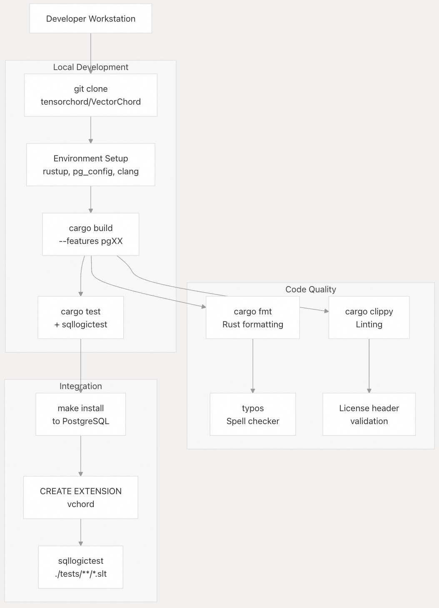
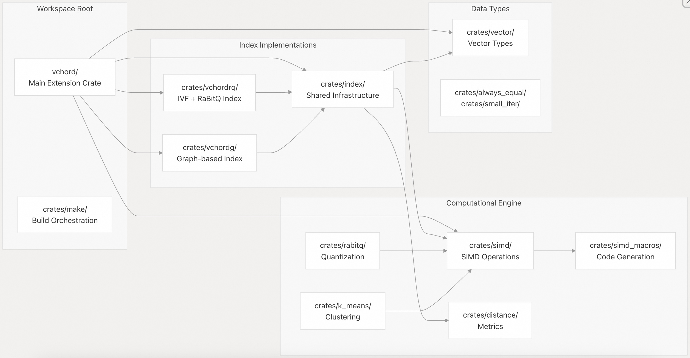
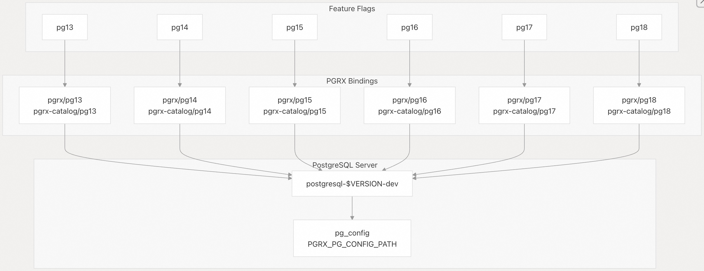
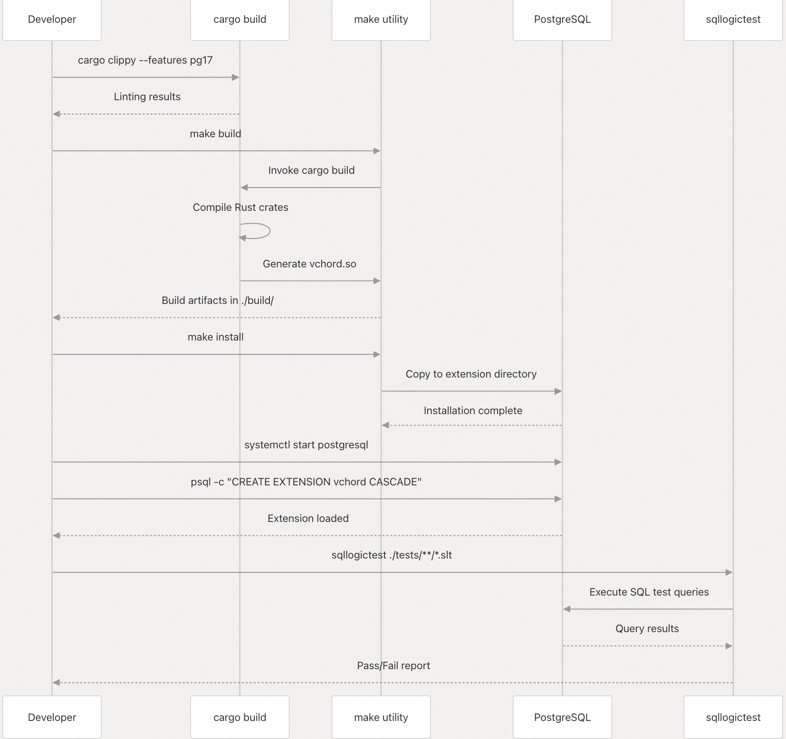
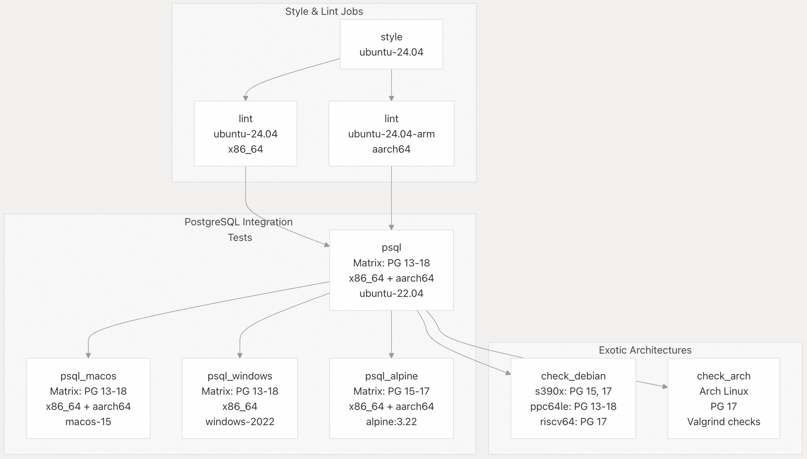
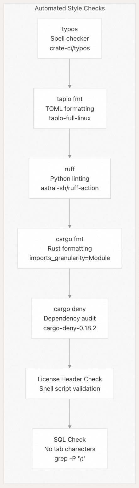
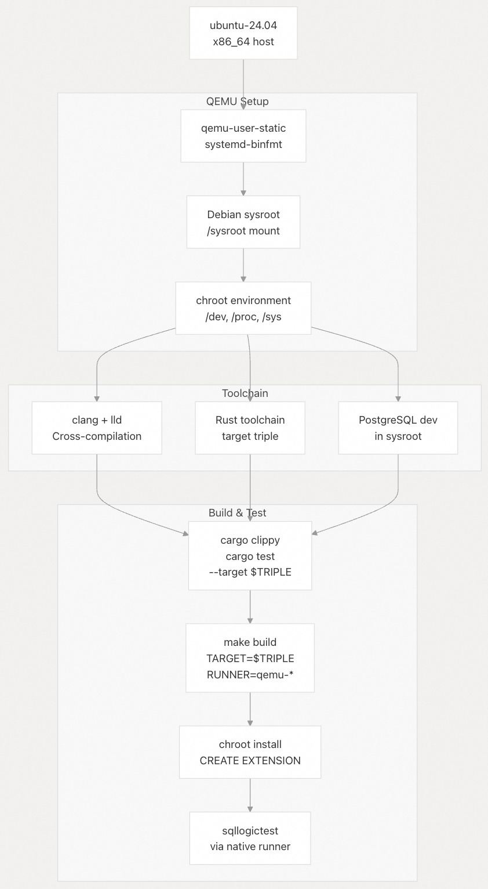
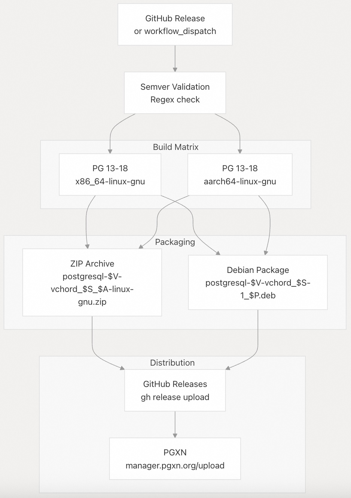

## VectorChord 源码学习: 7 开发 (Development)   
                                    
### 作者                                    
digoal                                    
                                    
### 日期                                    
2025-11-03                                    
                                    
### 标签                                    
VectorChord , 源码学习                                    
                                    
----                                    
                                    
## 背景                                    
本文介绍 VectorChord 项目的**开发环境** (`development environment`)、**构建系统** (`build system`) 和贡献所需的**工作流** (`workflows`)。内容涵盖了**先决条件** (`prerequisites`)、本地开发设置、测试方法以及 **CI/CD 流水线** (`CI/CD pipeline`) 结构。  
  
## 开发环境 (`Development Environment`)  
  
### 先决条件 (`Prerequisites`)  
  
VectorChord 的开发需要以下工具和环境：  
  
| 组件 (`Component`) | 版本/详情 (`Version/Details`) | 用途 (`Purpose`) |  
| :--- | :--- | :--- |  
| **Rust** | Beta/Nightly channel (测试版/每夜版) | 核心语言工具链 (`Core language toolchain`) |  
| **PostgreSQL** | 13, 14, 15, 16, 17, 或 18 | 目标数据库版本 (`Target database versions`) |  
| **LLVM/Clang** | 版本 18 | C 语言编译和 **bindgen** |  
| **PGRX** | 0.16.1 | PostgreSQL-Rust 桥接框架 (`PostgreSQL-Rust bridge framework`) |  
| **sqllogictest** | 最新 | **集成测试** (`Integration test`) 运行器 |  
  
构建系统会根据 **PostgreSQL** 版本和**目标架构** (`target architecture`) 自动配置自身，并在 [**Cargo.toml**](https://github.com/tensorchord/VectorChord/blob/ac12e257/Cargo.toml#L17-L22) 中选择适当的**特性标志** (`feature flags`)。  
  
**开发工作流图** (`Development Workflow Diagram`)  
  
  
  
来源: [`./github/workflows/check.yml` 1-263](https://github.com/tensorchord/VectorChord/blob/ac12e257/.github/workflows/check.yml#L1-L263) [`Cargo.toml` 1-113](https://github.com/tensorchord/VectorChord/blob/ac12e257/Cargo.toml#L1-L113)  
  
### 仓库结构 (`Repository Structure`)  
  
代码库被组织为一个 **Cargo 工作空间** (`Cargo workspace`)，包含主**扩展** (`extension`) 和多个**内部 `crate`**：  
  
  
  
来源: [`Cargo.toml` 24-57](https://github.com/tensorchord/VectorChord/blob/ac12e257/Cargo.toml#L24-L57)  
  
位于仓库根目录的主扩展 **crate** ([`src/lib.rs` 1-82](https://github.com/tensorchord/VectorChord/blob/ac12e257/src/lib.rs#L1-L82)) 使用 **PGRX** 的**模块魔术系统** (`module magic system`)，并在 **PostgreSQL** 启动时通过 `_PG_init()` 加载。这些内部 **crate** 是私有的**工作空间依赖** (`workspace dependencies`)，不会单独发布。  
  
## 构建系统架构 (`Build System Architecture`)  
  
### Cargo 特性 (`Features`) 和 PostgreSQL 版本  
  
VectorChord 使用 **Cargo 特性标志** (`Cargo feature flags`) 来针对不同的 **PostgreSQL** 版本进行编译。每个版本都需要特定的 **PGRX 绑定** (`PGRX bindings`)：  
  
  
  
来源: [`Cargo.toml` 16-22](https://github.com/tensorchord/VectorChord/blob/ac12e257/Cargo.toml#L16-L22) [`./github/workflows/check.yml` 170-203](https://github.com/tensorchord/VectorChord/blob/ac12e257/.github/workflows/check.yml#L170-L203)  
  
构建命令指定目标 **PostgreSQL** 版本：  
  
```  
# Build for PostgreSQL 17  
cargo clippy --features pg17  
make PG_CONFIG=/path/to/pg_config PROFILE=dev build  
make PG_CONFIG=/path/to/pg_config install  
```  
  
`PG_CONFIG` **环境变量** (`environment variable`) 必须指向目标 **PostgreSQL** 安装的正确 `pg_config` **二进制文件** (`binary`) ([`./github/workflows/check.yml` 201-202](https://github.com/tensorchord/VectorChord/blob/ac12e257/.github/workflows/check.yml#L201-L202))。  
  
### 自定义 Make 工具 (`Custom Make Utility`)  
  
该工作空间包含一个用 **Rust** 实现的自定义 `make` **工具** (`utility`) ([`Cargo.lock` 766-773](https://github.com/tensorchord/VectorChord/blob/ac12e257/Cargo.lock#L766-L773))，用于**编排** (`orchestrates`) 整个构建过程。该工具封装了 **PGRX** 的操作，并处理以下内容：  
  
  * **交叉编译** (`Cross-compilation`) 目标规范  
  * **配置文件选择** (`Profile selection`) (dev, release, prof)  
  * 通过 `pgrx_embed` 进行 **SQL 脚本嵌入** (`SQL script embedding`)  
  * **安装路径管理** (`Installation path management`)  
  * **工件组织** (`Artifact organization`)  
  
该 `make` 工具在整个 **CI 流水线** (`CI pipeline`) 中被调用 ([`./github/workflows/check.yml` 234-235](https://github.com/tensorchord/VectorChord/blob/ac12e257/.github/workflows/check.yml#L234-L235) [`./github/workflows/release.yml` 92-96](https://github.com/tensorchord/VectorChord/blob/ac12e257/.github/workflows/release.yml#L92-L96))，并提供了跨平台的**一致接口** (`consistent interface`)。  
  
### SIMD 构建过程 (`SIMD Build Process`)  
  
**SIMD** **crate** 在其 `build.rs` 中定义了一个**专门的构建过程** (`specialized build process`)，用于编译**架构特定的 C 垫片** (`architecture-specific C shims`)，以处理无法用 **Rust** 的**可移植 SIMD 抽象** (`portable SIMD abstractions`) 表示的操作。  
  
## 开发工作流 (`Development Workflows`)  
  
### 本地开发循环 (`Local Development Loop`)  
  
**标准开发周期** (`Standard Development Cycle`)  
  
  
  
来源: [`./github/workflows/check.yml` 229-257](https://github.com/tensorchord/VectorChord/blob/ac12e257/.github/workflows/check.yml#L229-L257)  
  
### 本地运行测试  
  
**单元测试** (`Unit Tests`)  
  
单元测试无需 **PostgreSQL** 即可运行：  
  
```  
# All crates except main vchord extension  
cargo test --workspace --exclude vchord --no-fail-fast  
```  
  
`--exclude vchord` **标志** (`flag`) 是必需的，因为主**扩展 `crate`** (`extension crate`) 需要一个正在运行的 **PostgreSQL** 实例 ([`./github/workflows/check.yml` 142-143](https://github.com/tensorchord/VectorChord/blob/ac12e257/.github/workflows/check.yml#L142-L143))。  
  
**SIMD 测试** (`SIMD Tests`)  
  
**SIMD** 测试用于验证跨**指令集** (`instruction sets`) 的正确性。在安装了 **Intel SDE** 的 **x86\_64** 系统上，测试会在**仿真** (`emulation`) 环境下运行，以验证**非原生** (`non-native`) 指令集：  
  
```  
# With Intel SDE for x86_64 validation  
cargo \
  --config 'target.'\''cfg(all())'\''.runner = ["/opt/sde/sde64", "-spr", "--"]' \
  test -p simd -- --no-capture  
```    
  
在 **ARM** 系统上，**QEMU** 会验证不同的 **SVE 向量长度** (`SVE vector lengths`)：  
  
```  
# ARM SVE with 128-bit vectors  
cargo \
  --config 'target.'\''cfg(all())'\''.runner = ["qemu-aarch64-static", "-cpu", "max,sve-default-vector-length=16"]' \
  test -p simd -- --no-capture  
```    
  
来源: [`./github/workflows/check.yml` 145-162](https://github.com/tensorchord/VectorChord/blob/ac12e257/.github/workflows/check.yml#L145-L162)  
  
**集成测试** (`Integration Tests`)  
  
集成测试使用 [tests/](https://github.com/tensorchord/VectorChord/blob/ac12e257/tests/) 目录下的 **sqllogictest** 文件：  
  
```  
# Run all general tests  
sqllogictest --db $USER --user $USER './tests/general/*.slt' --label pg17  
  
# Run vchordrq-specific tests  
sqllogictest --db $USER --user $USER './tests/vchordrq/*.slt' --label pg17  
  
# PostgreSQL 17+ specific features  
sqllogictest --db $USER --user $USER './tests/vchordrq/pg17/*.slt' --label pg17  
```  
  
`--label` **标志** 允许基于 **PostgreSQL** 版本进行**条件测试执行** (`conditional test execution`)。测试按**索引类型** (`index type`) 和**特性集** (`feature set`) 进行组织 ([`./github/workflows/check.yml` 250-257](https://github.com/tensorchord/VectorChord/blob/ac12e257/.github/workflows/check.yml#L250-L257))。  
  
## CI/CD 流水线结构 (`CI/CD Pipeline Structure`)  
  
### 工作流概述 (`Workflow Overview`)  
  
**检查工作流** (`check workflow`) ([`./github/workflows/check.yml` 1-897](https://github.com/tensorchord/VectorChord/blob/ac12e257/.github/workflows/check.yml#L1-L897)) 在每次 **push** 和 **pull request** 时运行，包含多种**作业类型** (`job types`)：  
  
**CI 流水线作业** (`CI Pipeline Jobs`)  
  
  
  
来源: [`./github/workflows/check.yml` 12-897](https://github.com/tensorchord/VectorChord/blob/ac12e257/.github/workflows/check.yml#L12-L897)  
  
### 平台矩阵 (`Platform Matrix`)  
  
VectorChord 针对广泛的平台矩阵进行测试：  
  
| 平台 (`Platform`) | 架构 (`Architectures`) | PostgreSQL 版本 | 特殊工具 (`Special Tooling`) |  
| :--- | :--- | :--- | :--- |  
| Ubuntu 22.04/24.04 | x86\_64, aarch64 | 13-18 | 标准运行器 (`Standard runners`) |  
| macOS 15 | x86\_64, aarch64 | 13-18 | **Homebrew** PostgreSQL |  
| Windows 2022 | x86\_64 | 13-18 | EnterpriseDB **二进制文件** (`binaries`) |  
| Alpine 3.22 | x86\_64, aarch64 | 15-17 | **musl libc 容器** (`musl libc container`) |  
| Debian (QEMU) | s390x, ppc64le, riscv64 | 13-18 (各不相同) | **交叉编译** (`Cross-compilation`) + **chroot** |  
| Arch Linux | x86\_64 | 17 | **Valgrind 内存检查** (`Valgrind memory checks`) |  
  
**奇异架构测试** (`exotic architecture testing`) ([`./github/workflows/check.yml` 589-810](https://github.com/tensorchord/VectorChord/blob/ac12e257/.github/workflows/check.yml#L589-L810)) 使用**交叉编译**配合 **QEMU 用户模式仿真** (`QEMU user-mode emulation`)，从而无需**原生硬件** (`native hardware`) 即可在 **IBM 大型机** (`IBM mainframes`) (s390x)、**PowerPC** (ppc64le) 和 **RISC-V** (riscv64) 上进行验证。  
  
### 风格强制执行 (`Style Enforcement`)  
  
**风格检查作业组件** (`Style Check Job Components`)  
  
  
  
来源: [`./github/workflows/check.yml` 14-101](https://github.com/tensorchord/VectorChord/blob/ac12e257/.github/workflows/check.yml#L14-L101)  
  
风格 (`style`) 作业在每次提交 (`commit`) 时运行并**强制执行** (`enforces`) 以下规则：  
  
  * **拼写错误** (`Typos`): 捕捉代码和文档中的拼写错误 (`typos`) ([`./github/workflows/check.yml` 28-29](https://github.com/tensorchord/VectorChord/blob/ac12e257/.github/workflows/check.yml#L28-L29))  
  * **TOML 格式化** (`TOML Formatting`): 确保 `Cargo.toml` 和工作空间文件符合格式 ([`./github/workflows/check.yml` 31-32](https://github.com/tensorchord/VectorChord/blob/ac12e257/.github/workflows/check.yml#L31-L32))  
  * **Python 代码检查** (`Python Linting`): 使用 **Ruff** 验证 Python 脚本 ([`./github/workflows/check.yml` 34-35](https://github.com/tensorchord/VectorChord/blob/ac12e257/.github/workflows/check.yml#L34-L35))  
  * **Rust 格式化** (`Rust Formatting`): 通过**模块级导入分组** (`module-level import grouping`) 强制执行一致的 **Rust** 风格 ([`./github/workflows/check.yml` 37-38](https://github.com/tensorchord/VectorChord/blob/ac12e257/.github/workflows/check.yml#L37-L38))  
  * **依赖项审计** (`Dependency Audit`): 检查**安全漏洞** (`security vulnerabilities`) 和**许可证兼容性** (`license compatibility`) ([`./github/workflows/check.yml` 40-41](https://github.com/tensorchord/VectorChord/blob/ac12e257/.github/workflows/check.yml#L40-L41))  
  * **许可证头部** (`License Headers`): 验证所有源文件中的**双许可证头部** (`dual-license headers`) ([`./github/workflows/check.yml` 43-96](https://github.com/tensorchord/VectorChord/blob/ac12e257/.github/workflows/check.yml#L43-L96))  
  * **SQL 格式化** (`SQL Formatting`): 禁止在 **SQL** 文件中使用制表符 (`tab characters`) ([`./github/workflows/check.yml` 98-100](https://github.com/tensorchord/VectorChord/blob/ac12e257/.github/workflows/check.yml#L98-L100))  
  
所有风格检查必须通过后才能开始**代码审查** (`code review`)。  
  
### 跨架构测试详情 (`Cross-Architecture Testing Details`)  
  
`check_debian` 作业展示了 VectorChord 进行**奇异架构验证** (`exotic architecture validation`) 的方法：  
  
**跨架构构建流水线** (`Cross-Architecture Build Pipeline`)  
  
  
  
来源: [`./github/workflows/check.yml` 662-810](https://github.com/tensorchord/VectorChord/blob/ac12e257/.github/workflows/check.yml#L662-L810)  
  
该**跨架构**工作流包括：  
  
1.  设置 **QEMU 用户模式仿真** (`QEMU user-mode emulation`) 和 **systemd-binfmt** ([`./github/workflows/check.yml` 666-668](https://github.com/tensorchord/VectorChord/blob/ac12e257/.github/workflows/check.yml#L666-L668))  
2.  创建包含**绑定挂载** (`bind mounts`) 的 **Debian sysroot** ([`./github/workflows/check.yml` 669-675](https://github.com/tensorchord/VectorChord/blob/ac12e257/.github/workflows/check.yml#L669-L675))  
3.  在 **sysroot** 中安装 **PostgreSQL 开发包** (`PostgreSQL development packages`) ([`./github/workflows/check.yml` 696-706](https://github.com/tensorchord/VectorChord/blob/ac12e257/.github/workflows/check.yml#L696-L706))  
4.  使用自定义的 `.cargo/config.toml` 为**交叉编译** (`cross-compilation`) 配置 **Rust** ([`./github/workflows/check.yml` 739-763](https://github.com/tensorchord/VectorChord/blob/ac12e257/.github/workflows/check.yml#L739-L763))  
5.  在 **QEMU** 下运行 **clippy** 和测试 ([`./github/workflows/check.yml` 766-774](https://github.com/tensorchord/VectorChord/blob/ac12e257/.github/workflows/check.yml#L766-L774))  
6.  在 **chroot** **环境** (`chroot environment`) 中安装扩展 (`extension`) ([`./github/workflows/check.yml` 776-783](https://github.com/tensorchord/VectorChord/blob/ac12e257/.github/workflows/check.yml#L776-L783))  
7.  **原生** (`natively`) 执行 **sqllogictest** (因为主机可以运行**测试驱动程序** (`test driver`)) ([`./github/workflows/check.yml` 798-805](https://github.com/tensorchord/VectorChord/blob/ac12e257/.github/workflows/check.yml#L798-L805))  
  
这种方法使得在没有**专用 CI 运行器** (`dedicated CI runners`) 的架构上进行测试成为可能。  
  
## 发布过程 (`Release Process`)  
  
**发布工作流** (`release workflow`) ([`./github/workflows/release.yml` 1-147](https://github.com/tensorchord/VectorChord/blob/ac12e257/.github/workflows/release.yml#L1-L147)) 在 **GitHub 发布创建** (`GitHub release creation`) 或**手动分发** (`manual dispatch`) 时**触发** (`triggers`)：  
  
**发布工件生成** (`Release Artifact Generation`)  
  
  
  
来源: [`./github/workflows/release.yml` 18-147](https://github.com/tensorchord/VectorChord/blob/ac12e257/.github/workflows/release.yml#L18-L147)  
  
发布过程包括：  
  
1.  验证 **semver 格式** (`semver format`) ([`./github/workflows/release.yml` 22-36](https://github.com/tensorchord/VectorChord/blob/ac12e257/.github/workflows/release.yml#L22-L36))  
2.  验证 `vchord.control` 中的**版本一致性** (`version consistency`) ([`./github/workflows/release.yml` 79-83](https://github.com/tensorchord/VectorChord/blob/ac12e257/.github/workflows/release.yml#L79-L83))  
3.  为所有 **PostgreSQL** 版本和架构进行构建 ([`./github/workflows/release.yml` 38-122](https://github.com/tensorchord/VectorChord/blob/ac12e257/.github/workflows/release.yml#L38-L122))  
4.  创建带有适当**依赖项** (`dependencies`) 的 `.deb` **软件包** (`packages`) ([`./github/workflows/release.yml` 96-110](https://github.com/tensorchord/VectorChord/blob/ac12e257/.github/workflows/release.yml#L96-L110))  
5.  将**工件** (`artifacts`) **上传** (`Uploads`) 到 **GitHub Releases** ([`./github/workflows/release.yml` 112-121](https://github.com/tensorchord/VectorChord/blob/ac12e257/.github/workflows/release.yml#L112-L121))  
6.  **发布** (`Publishes`) 到 **PGXN** ([`./github/workflows/release.yml` 123-147](https://github.com/tensorchord/VectorChord/blob/ac12e257/.github/workflows/release.yml#L123-L147))  
  
## 开发最佳实践 (`Development Best Practices`)  
  
### 代码组织原则 (`Code Organization Principles`)  
  
VectorChord 遵循以下组织模式：  
  
  * **不安全代码隔离** (`Unsafe Code Isolation`): 所有**不安全代码** (`unsafe code`) 必须**明确标记** (`explicitly marked`) 和**记录** (`documented`)。工作空间默认**拒绝** (`denies`) 不安全代码，但允许在特定模块中使用 ([`src/lib.rs` 15-16](https://github.com/tensorchord/VectorChord/blob/ac12e257/src/lib.rs#L15-L16) [`Cargo.toml` 86-87](https://github.com/tensorchord/VectorChord/blob/ac12e257/Cargo.toml#L86-L87))。  
  * **特性标志** (`Feature Flags`): **PostgreSQL** 版本兼容性通过**互斥的特性标志** (`mutually exclusive feature flags`) 来管理，绝不通过**运行时检查** (`runtime checks`)。  
  * **工作空间依赖项** (`Workspace Dependencies`): 版本号和通用**依赖项** (`dependencies`) 在工作空间根目录中声明一次 ([`Cargo.toml` 63-73](https://github.com/tensorchord/VectorChord/blob/ac12e257/Cargo.toml#L63-L73))。  
  * **恐慌策略** (`Panic Policy`): 扩展必须使用 `-Cpanic=unwind` 进行编译，以确保 **Rust** 代码在 **PostgreSQL 回调** (`PostgreSQL callbacks`) 中发生**恐慌** (`panics`) 时能够进行**适当的清理** (`proper cleanup`) ([`src/lib.rs` 74-75](https://github.com/tensorchord/VectorChord/blob/ac12e257/src/lib.rs#L74-L75))。  
  
### 内存管理 (`Memory Management`)  
  
VectorChord 根据不同的上下文使用多种**分配策略** (`allocation strategies`)：  
  
  * **全局分配器** (`Global Allocator`): 在 **x86\_64**/**aarch64** Linux 和 **macOS** 上，**mimalloc** 被用作**全局分配器** ([`src/lib.rs` 77-81](https://github.com/tensorchord/VectorChord/blob/ac12e257/src/lib.rs#L77-L81) [`Cargo.toml` 49-50](https://github.com/tensorchord/VectorChord/blob/ac12e257/Cargo.toml#L49-L50))  
  * **碰撞分配** (`Bump Allocation`): 搜索操作使用**碰撞分配器** (`bump allocators`) 进行**临时分配** (`temporary allocations`) (参见内存管理)  
  * **PostgreSQL 内存上下文** (`PostgreSQL Memory Contexts`): 长期存在的**索引结构** (`index structures`) 通过 **PGRX** 与 **PostgreSQL** 的**内存上下文系统** (`memory context system`) 集成  
  
### 测试策略 (`Testing Strategy`)  
  
测试按范围 (`scope`) 和工具 (`tooling`) 进行结构化：  
  
| 测试类型 (`Test Type`) | 工具 (`Tool`) | 位置 (`Location`) | 用途 (`Purpose`) |  
| :--- | :--- | :--- | :--- |  
| **单元测试** (`Unit Tests`) | `cargo test` | `*/src/*.rs`, `*/tests/*.rs` | 验证单个函数和模块 |  
| **SIMD 测试** | `cargo test` + 仿真 (`emulation`) | `crates/simd/tests/` | 交叉验证指令集 |  
| **集成测试** (`Integration Tests`) | sqllogictest | `tests/**/*.slt` | **端到端 SQL 功能** (`End-to-end SQL functionality`) |  
| **内存安全** (`Memory Safety`) | Valgrind | Arch Linux CI job | 检测**内存泄漏** (`memory leaks`) 和**未定义行为** (`undefined behavior`) |  
  
有关完整的测试详情，参阅测试基础设施。  
  
### 贡献清单 (`Contributing Checklist`)  
  
在提交**拉取请求** (`pull request`) 之前：  
  
1.  **格式化代码** (`Format Code`): 运行 `cargo fmt`，使用**模块级导入粒度** (`module-level import granularity`)  
2.  **通过代码检查** (`Pass Linting`): 确保 `cargo clippy` 不产生任何警告  
3.  **检查拼写** (`Check Spelling`): 运行 `typos` 来捕捉注释和文档中的拼写错误 (`typos`)  
4.  **添加测试** (`Add Tests`): 为新功能添加**单元测试** (`unit tests`)，并为 **SQL** 特性更新 **sqllogictest** 文件  
5.  **验证 SIMD** (`Validate SIMD`): 如果修改 **SIMD** 代码，请使用 **Intel SDE** 或 **QEMU 仿真** (`emulation`) 进行测试  
6.  **更新文档** (`Update Documentation`): 为**公共 API** (`public APIs`) 添加 **docstrings**，并在需要时更新 **README**  
7.  **验证许可证头部** (`Verify License Headers`): 所有新文件都必须包含**双许可证头部** (`dual-license header`)  
8.  **本地测试** (`Test Locally`): 在 **push** 之前，运行完整的**测试套件** (`test suite`) (使用 `cargo test` 和 **sqllogictest**)  
  
**CI 流水线** (`CI pipeline`) 将自动验证所有这些要求，但在本地运行检查可以节省**迭代时间** (`iteration time`)。  
  
      
#### [期望 PostgreSQL|开源PolarDB 增加什么功能?](https://github.com/digoal/blog/issues/76 "269ac3d1c492e938c0191101c7238216")
  
  
#### [PolarDB 开源数据库](https://openpolardb.com/home "57258f76c37864c6e6d23383d05714ea")
  
  
#### [PolarDB 学习图谱](https://www.aliyun.com/database/openpolardb/activity "8642f60e04ed0c814bf9cb9677976bd4")
  
  
#### [PostgreSQL 解决方案集合](../201706/20170601_02.md "40cff096e9ed7122c512b35d8561d9c8")
  
  
#### [德哥 / digoal's Github - 公益是一辈子的事.](https://github.com/digoal/blog/blob/master/README.md "22709685feb7cab07d30f30387f0a9ae")
  
  
#### [About 德哥](https://github.com/digoal/blog/blob/master/me/readme.md "a37735981e7704886ffd590565582dd0")
  
  

  
