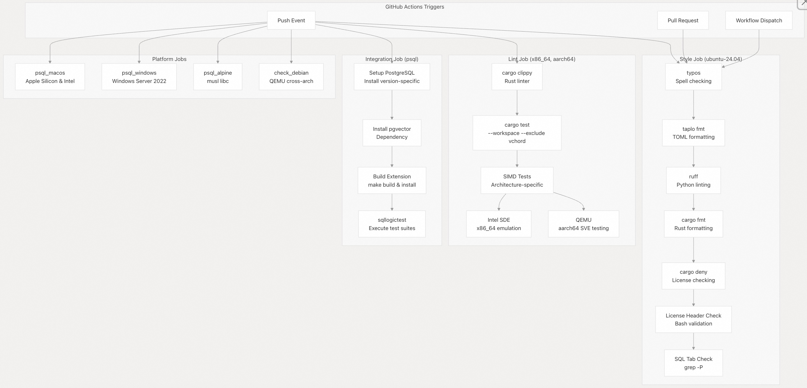
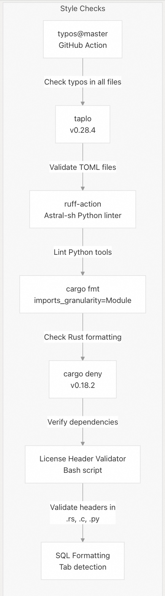
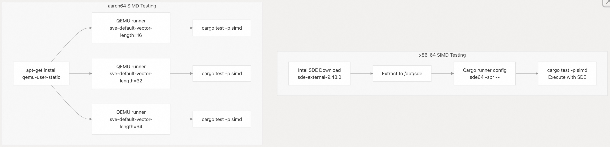
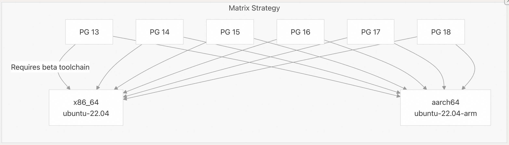
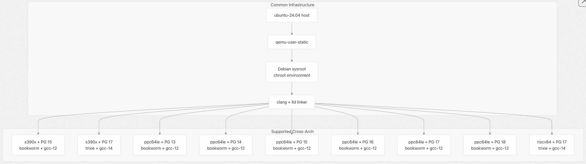
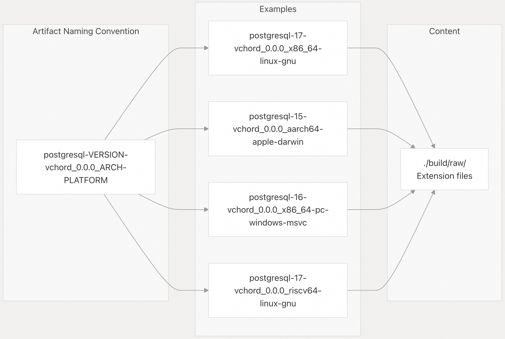

## VectorChord 源码学习: 7.1 测试基础设施 (Testing Infrastructure)  
                                      
### 作者                                      
digoal                                      
                                      
### 日期                                      
2025-11-03                                      
                                      
### 标签                                      
VectorChord , 源码学习                                      
                                      
----                                      
                                      
## 背景                                      
本文介绍 **VectorChord** 全面的**测试基础设施** (Testing Infrastructure)，包括**单元测试** (unit tests)、**SIMD 架构验证** (SIMD architecture validation)，以及跨多个 **PostgreSQL** 版本和平台的**集成测试** (integration testing)。它涵盖了测试执行管道、用于 **SQL** 级别验证的 **sqllogictest 框架**，以及确保在各种硬件架构上保证质量的 **CI/CD 工作流** (workflows)。  
  
-----  
  
## 测试类别概览 (Overview of Test Categories)  
  
| Test Category (测试类别) | Purpose (目的) | Test Runner (测试运行器) | Scope (范围) |  
| :--- | :--- | :--- | :--- |  
| **Style Checks** (风格检查) | 代码格式化和规范 (Code formatting and conventions) | **typos**, **taplo**, **ruff**, **rustfmt** | 所有源代码文件 |  
| **License Validation** (许可证验证) | 标头 (Header) 一致性 | 自定义 **bash 脚本** | `.rs`, `.c`, `.py` 文件 |  
| **Unit Tests** (单元测试) | 组件功能 (Component functionality) | `cargo test` | **Rust workspace crates** (工作区包) |  
| **SIMD Tests** (SIMD 测试) | 架构特定操作 (Architecture-specific operations) | `cargo test` + **SDE**/**QEMU** | 仅 `simd` **crate** (包) |  
| **Integration Tests** (集成测试) | 端到端 **SQL** 功能 (End-to-end SQL functionality) | **sqllogictest** | 包含 **PostgreSQL** 的完整扩展 (Full extension) |  
| **Platform Tests** (平台测试) | 跨架构兼容性 (Cross-architecture compatibility) | **QEMU 用户模式仿真** (user-mode emulation) | 稀有平台 (Exotic platforms) (**s390x**, **ppc64le**, **riscv64**) |  
  
**来源:** [`.github/workflows/check.yml` 1-764](https://github.com/tensorchord/VectorChord/blob/ac12e257/.github/workflows/check.yml#L1-L764)  
  
-----  
  
## 测试执行架构 (Test Execution Architecture)  
  
  
  
**来源:** [`.github/workflows/check.yml` 1-164](https://github.com/tensorchord/VectorChord/blob/ac12e257/.github/workflows/check.yml#L1-L164)  
  
-----  
  
## 风格与代码检查基础设施 (Style and Linting Infrastructure)  
  
`style` **作业** (job) 在 `ubuntu-24.04` 上运行，执行全面的代码质量检查，无需进行完整构建 (full build)：  
  
### 风格检查组件 (Style Check Components)  
  
  
  
**许可证标头验证** (license header validation) 检查所有源代码文件的**双许可证标头** (**AGPLv3** 或 **ELv2**)。它构建特定于语言的注释格式，并验证每个文件的前 N 行：  
  
  * Rust/C 文件：`//` 前缀  
  * Python 文件：`#` 前缀  
  
**来源:** [`.github/workflows/check.yml` 13-101](https://github.com/tensorchord/VectorChord/blob/ac12e257/.github/workflows/check.yml#L13-L101)  
  
### 代码检查配置 (Lint Configuration)  
  
`lint` **作业** (job) 使用架构特定的运行器 (runners) 并强制执行严格编译：  
  
| Configuration (配置) | Value (值) |  
| :--- | :--- |  
| **`RUSTFLAGS`** | `-Dwarnings` (将警告视为错误 (**warnings as errors**)) |  
| **`RUSTC_WRAPPER`** | **`sccache`** (**构建缓存** (build caching)) |  
| **`SCCACHE_GHA_ENABLED`** | `"true"` |  
| **Clippy** 范围 | `--workspace --exclude vchord` |  
| 测试范围 | `--workspace --exclude vchord --exclude simd` |  
  
**来源:** [`.github/workflows/check.yml` 102-163](https://github.com/tensorchord/VectorChord/blob/ac12e257/.github/workflows/check.yml#L102-L163)  
  
-----  
  
## 使用仿真进行 SIMD 测试 (SIMD Testing with Emulation)  
  
**SIMD** 测试在一个专用环境中运行，用于验证跨不同 **CPU** 特性的架构特定实现：  
  
  
  
### x86\_64 SIMD 验证 (Validation)  
  
**英特尔软件开发仿真器** (**Intel Software Development Emulator, SDE**) 允许在可能不支持高级指令集的主机上进行测试：  
  
```bash  
/opt/sde/sde64 -spr -- <test-binary>  
```  
  
`-spr` 标志启用 **Sapphire Rapids (SPR) 微架构仿真** (microarchitecture emulation)，其中包括对 **AVX-512** 的支持。  
  
**来源:** [`.github/workflows/check.yml` 123-151](https://github.com/tensorchord/VectorChord/blob/ac12e257/.github/workflows/check.yml#L123-L151)  
  
### aarch64 SVE 测试 (Testing)  
  
**ARM 可扩展矢量扩展** (**Scalable Vector Extension, SVE**) 测试使用 **QEMU** 运行，包含三种矢量长度（128、256、512 位）：  
  
```bash  
qemu-aarch64-static -cpu max,sve-default-vector-length=16 <test-binary>  # 128-bit  
qemu-aarch64-static -cpu max,sve-default-vector-length=32 <test-binary>  # 256-bit  
qemu-aarch64-static -cpu max,sve-default-vector-length=64 <test-binary>  # 512-bit  
```  
  
这确保了 **SIMD 抽象层** (abstraction layer) 在不同的 **SVE** 实现中能正常工作。  
  
**来源:** [`.github/workflows/check.yml` 152-162](https://github.com/tensorchord/VectorChord/blob/ac12e257/.github/workflows/check.yml#L152-L162)  
  
-----  
  
## sqllogictest 集成测试 (Integration Testing)  
  
### 测试套件结构 (Test Suite Structure)  
  
**VectorChord** 使用 `sqllogictest-rs` (v0.28.4) 进行 **SQL** 级别的**集成测试** (integration testing)。测试运行器执行包含 **SQL** 命令和预期输出模式的 `.slt` 文件。测试被组织在以下目录中：  
  
```  
tests/  
├── general/         # Cross-index general functionality  
│   ├── basic.slt   # CREATE EXTENSION, types, operators  
│   ├── types.slt   # vector, halfvec, scalar8 types  
│   └── *.slt       # Distance operators, sphere search  
├── vchordg/        # Graph-based index tests  
│   ├── index.slt   # CREATE INDEX with vchordg  
│   ├── search.slt  # ef_search parameter, beam search  
│   └── *.slt       # vchordg-specific queries  
├── vchordrq/       # Residual quantized index tests  
│   ├── index.slt   # CREATE INDEX with vchordrq  
│   ├── build.slt   # Build strategies (default, internal, external)  
│   ├── search.slt  # probes, epsilon parameters  
│   ├── maxsim.slt  # MaxSim operator tests  
│   └── pg17/       # PostgreSQL 17+ specific features  
│       └── prefetch.slt  # read_stream API tests  
```  
  
`sqllogictest` **二进制文件** (binary) 使用 `--label pgVERSION` 调用，以启用版本特定的测试条件 (test conditionals)。  
  
**来源:** [`.github/workflows/check.yml` 250-257](https://github.com/tensorchord/VectorChord/blob/ac12e257/.github/workflows/check.yml#L250-L257)  
  
### 测试执行流程 (Test Execution Flow)  
  
**图表：sqllogictest 执行管道 (Execution Pipeline)**  

```mermaid  
graph TB  
    subgraph "Setup Phase"  
        INSTALL_PG["apt-get install<br/>postgresql-server-dev-VERSION"]  
        INSTALL_PGVECTOR["Build pgvector 0.8.1<br/>from tarball"]  
        CONFIG_HBA["Configure /etc/postgresql/VERSION/main/pg_hba.conf<br/>trust authentication"]  
        CREATE_USER["createuser -s -r $USER"]  
        ALTER_PRELOAD["psql -c 'ALTER SYSTEM SET<br/>shared_preload_libraries = vchord'"]  
        STOP_PG["systemctl stop postgresql"]  
    end  
      
    subgraph "Build Phase"  
        CLIPPY["cargo clippy --locked<br/>--target ARCH-unknown-linux-gnu<br/>-p vchord --features pgVERSION"]  
        MAKE_BUILD["make PG_CONFIG=pg_config PROFILE=dev build<br/>Invokes: cargo pgrx package"]  
        MAKE_INSTALL["sudo make PG_CONFIG=pg_config install<br/>Copies: vchord.so, vchord.control, vchord--VERSION.sql"]  
        ARTIFACT["actions/upload-artifact@v4<br/>./build/raw"]  
    end  
      
    subgraph "Test Execution Phase"  
        START_PG["systemctl start postgresql"]  
        CREATE_EXT["psql -c 'CREATE EXTENSION IF NOT EXISTS vchord CASCADE'<br/>Triggers: _pg_init in vchord crate"]  
          
        GENERAL_TESTS["sqllogictest --db $USER --user $USER<br/>'./tests/general/*.slt' --label pgVERSION"]  
        VCHORDG_TESTS["sqllogictest --db $USER --user $USER<br/>'./tests/vchordg/*.slt' --label pgVERSION"]  
        VCHORDRQ_TESTS["sqllogictest --db $USER --user $USER<br/>'./tests/vchordrq/*.slt' --label pgVERSION"]  
        PG17_TESTS["if VERSION >= 17:<br/>sqllogictest './tests/vchordrq/pg17/*.slt'"]  
    end  
      
    INSTALL_PG --> INSTALL_PGVECTOR  
    INSTALL_PGVECTOR --> CONFIG_HBA  
    CONFIG_HBA --> CREATE_USER  
    CREATE_USER --> ALTER_PRELOAD  
    ALTER_PRELOAD --> STOP_PG  
      
    STOP_PG --> CLIPPY  
    CLIPPY --> MAKE_BUILD  
    MAKE_BUILD --> MAKE_INSTALL  
    MAKE_INSTALL --> ARTIFACT  
      
    ARTIFACT --> START_PG  
    START_PG --> CREATE_EXT  
    CREATE_EXT --> GENERAL_TESTS  
    GENERAL_TESTS --> VCHORDG_TESTS  
    VCHORDG_TESTS --> VCHORDRQ_TESTS  
    VCHORDRQ_TESTS --> PG17_TESTS  
```  
  

  
**来源:** [`.github/workflows/check.yml` 184-257](https://github.com/tensorchord/VectorChord/blob/ac12e257/.github/workflows/check.yml#L184-L257)  
  
### sqllogictest 标签系统与配置 (Label System and Configuration)  
  
`sqllogictest` 运行器使用 `--label` 标志支持版本特定的**测试条件** (test conditionals)。这使得测试可以根据 **PostgreSQL** 版本进行跳过或运行：  
  
```  
sqllogictest --db $USER --user $USER './tests/general/*.slt' --label pg17  
```  
  
在 `.slt` 文件中，测试可以使用**条件指令** (conditional directives)：  
  
```  
# Only run on PostgreSQL 17+  
skipif pg13 pg14 pg15 pg16  
statement ok  
-- Test using read_stream API (PG 17+)  
CREATE INDEX ...  
  
# Run on all versions except 18  
onlyif pg13 pg14 pg15 pg16 pg17  
statement ok  
-- Legacy behavior  
```  
  
该**工作流** (workflow) 自动确定要运行哪些**测试套件** (test suites)：  
  
| Condition (条件) | Test Suite (测试套件) | Files Executed (执行的文件) |  
| :--- | :--- | :--- |  
| 始终 (Always) | `./tests/general/*.slt` | 基本扩展功能 (Basic extension features) |  
| 始终 (Always) | `./tests/vchordg/*.slt` | 图索引测试 (Graph index tests) |  
| 始终 (Always) | `./tests/vchordrq/*.slt` | **RQ 树** (RQ-tree) 索引测试 |  
| `VERSION >= 17` | `./tests/vchordrq/pg17/*.slt` | `read_stream` **预取测试** (prefetching tests) |  
  
**来源:** [`.github/workflows/check.yml` 250-257](https://github.com/tensorchord/VectorChord/blob/ac12e257/.github/workflows/check.yml#L250-L257)  
  
-----  
  
## 测试矩阵覆盖 (Testing Matrix Coverage)  
  
### 主要测试矩阵 (Primary Testing Matrix) (psql 作业)  
  
主要的**集成测试作业** (integration test job) 运行一个包含 12 种配置的**矩阵** (matrix)：  
  
| PostgreSQL Version (版本) | Architectures (架构) | Total Combinations (总组合数) |  
| :--- | :--- | :--- |  
| 13, 14, 15, 16, 17, 18 | **x86\_64**, **aarch64** | 12 |  
  
运行器分配 (Runner allocation)：  
  
  * `x86_64`: `ubuntu-22.04`  
  * `aarch64`: `ubuntu-22.04-arm`  
  
  
  
**注意：** 由于兼容性要求，**PostgreSQL 13** 需要 `rustup default beta`。  
  
**来源:** [`.github/workflows/check.yml` 164-254](https://github.com/tensorchord/VectorChord/blob/ac12e257/.github/workflows/check.yml#L164-L254)  
  
### 可选测试矩阵 (Optional Testing Matrices)  
  
额外的平台测试可通过**提交消息** (commit message) 或 **PR 正文注释** (**PR body annotations**) **选择性启用** (opt-in)：  
  
| Job (作业) | Trigger (触发器) | Matrix Size (矩阵大小) | Purpose (目的) |  
| :--- | :--- | :--- | :--- |  
| `psql_macos` | `job: +psql_macos` | 12 种配置 | **macOS** (**Apple Silicon** + **Intel**) 验证 (validation) |  
| `psql_windows` | `job: +psql_windows` | 6 种配置 | **Windows Server 2022** 验证 |  
| `psql_alpine` | `job: +psql_alpine` | 6 种配置 | **musl libc 兼容性** (compatibility) |  
| `check_debian` | `job: +check_debian` | 10 种配置 | 稀有架构验证 (Exotic architecture validation) |  
  
要跳过主 `psql` 作业，请在**提交消息**或 **PR 正文**中使用 `job: -psql`。  
  
**来源:** [`.github/workflows/check.yml` 255-764](https://github.com/tensorchord/VectorChord/blob/ac12e257/.github/workflows/check.yml#L255-L764)  
  
-----  
  
## 平台特定测试 (Platform-Specific Testing)  
  
### macOS 测试基础设施 (Testing Infrastructure)  
  
**macOS** 测试使用 **Homebrew** 进行 **PostgreSQL** 安装：  

```mermaid  
graph TD  
    subgraph "macOS Setup (psql_macos)"  
        BREW_UPDATE["brew update"]  
        LLVM_PATH["Set CC to<br/>brew llvm@18 clang"]  
        BREW_PG["brew install<br/>postgresql@VERSION"]  
        BREW_START["brew services start"]  
        WAIT_SOCKET["Wait for /tmp/.s.PGSQL.5432<br/>60 second timeout"]  
        CREATE_DB["createdb -O USER"]  
        ALTER_SYSTEM["ALTER SYSTEM SET<br/>shared_preload_libraries"]  
        BREW_STOP["brew services stop"]  
          
        PGVECTOR_SRC["Download pgvector 0.8.1"]  
        PGVECTOR_BUILD["make PG_CONFIG=brew_path"]  
        PGVECTOR_INSTALL["sudo make install"]  
          
        SLT_DOWNLOAD["Download sqllogictest<br/>darwin binary"]  
    end  
      
    BREW_UPDATE --> LLVM_PATH  
    LLVM_PATH --> BREW_PG  
    BREW_PG --> BREW_START  
    BREW_START --> WAIT_SOCKET  
    WAIT_SOCKET --> CREATE_DB  
    CREATE_DB --> ALTER_SYSTEM  
    ALTER_SYSTEM --> BREW_STOP  
      
    BREW_STOP --> PGVECTOR_SRC  
    PGVECTOR_SRC --> PGVECTOR_BUILD  
    PGVECTOR_BUILD --> PGVECTOR_INSTALL  
      
    PGVECTOR_INSTALL --> SLT_DOWNLOAD  
```  
  

  
**运行器 (Runners)：**  
  
  * `aarch64`: `macos-15` (**Apple Silicon**)  
  * `x86_64`: `macos-15-intel` (**Intel**)  
  
**来源:** [`.github/workflows/check.yml` 255-340](https://github.com/tensorchord/VectorChord/blob/ac12e257/.github/workflows/check.yml#L255-L340)  
  
### Windows 测试基础设施 (Testing Infrastructure)  
  
**Windows** 测试使用 **EnterpriseDB PostgreSQL 二进制文件** (binaries)：  

```mermaid  
graph TD  
    subgraph "Windows Setup (psql_windows)"  
        CLEAR_ENV["Clear PGBIN, PGDATA, PGROOT vars"]  
        VSDEV["Launch Visual Studio DevShell<br/>amd64 toolchain"]  
        DOWNLOAD_PG["Download EDB binaries<br/>postgresql-VERSION-windows-x64"]  
        EXTRACT["Expand-Archive to D:\\"]  
        INITDB["initdb -D data -U postgres"]  
        PG_START["pg_ctl start"]  
        CREATE_USER["createuser -U postgres -s -r"]  
        CREATE_DB["createdb -O USERNAME"]  
        ALTER_SYS["ALTER SYSTEM SET shared_preload_libraries"]  
        PG_STOP["pg_ctl stop"]  
          
        PGVECTOR_DL["Download pgvector 0.8.1 zip"]  
        PGVECTOR_BUILD["nmake /F Makefile.win"]  
        PGVECTOR_INST["nmake install"]  
          
        SLT_DL["Download sqllogictest<br/>windows-msvc binary"]  
    end  
      
    CLEAR_ENV --> VSDEV  
    VSDEV --> DOWNLOAD_PG  
    DOWNLOAD_PG --> EXTRACT  
    EXTRACT --> INITDB  
    INITDB --> PG_START  
    PG_START --> CREATE_USER  
    CREATE_USER --> CREATE_DB  
    CREATE_DB --> ALTER_SYS  
    ALTER_SYS --> PG_STOP  
      
    PG_STOP --> PGVECTOR_DL  
    PGVECTOR_DL --> PGVECTOR_BUILD  
    PGVECTOR_BUILD --> PGVECTOR_INST  
      
    PGVECTOR_INST --> SLT_DL  
```  
  

  
**运行器 (Runner)：** `windows-2022`  
  
**来源:** [`.github/workflows/check.yml` 341-449](https://github.com/tensorchord/VectorChord/blob/ac12e257/.github/workflows/check.yml#L341-L449)  
  
### Alpine Linux (musl) 测试 (Testing)  
  
**Alpine** 测试在禁用**静态链接** (static linking) 的情况下验证 **musl libc 兼容性** (compatibility)：  
  
应用的关键配置补丁 (configuration patches)：  
  
```bash  
[.cargo/config.toml]  
unstable.host-config = true  
unstable.target-applies-to-host = true  
host.rustflags = ["-Dwarnings", "-Ctarget-feature=-crt-static"]  
build.rustflags = ["-Dwarnings", "-Ctarget-feature=-crt-static"]  
```  
  
环境变量 (Environment variable)：`RUSTC_BOOTSTRAP=1` （启用**不稳定功能** (unstable features)）  
  
**容器 (Container)：** `alpine:3.22`  
  
**来源:** [`.github/workflows/check.yml` 450-555](https://github.com/tensorchord/VectorChord/blob/ac12e257/.github/workflows/check.yml#L450-L555)  
  
-----  
  
## 使用 QEMU 进行跨架构测试 (Cross-Architecture Testing)  
  
### check\_debian 作业架构 (Job Architecture)  
  
`check_debian` **作业** (job) 在 **GitHub Actions** 中不原生支持的架构上验证 **VectorChord**：  
  
  
  
**来源:** [`.github/workflows/check.yml` 556-764](https://github.com/tensorchord/VectorChord/blob/ac12e257/.github/workflows/check.yml#L556-L764)  
  
### QEMU Chroot 设置 (Setup)  
  
**跨架构测试环境** (cross-architecture testing environment) 使用复杂的 **chroot 设置**：  
  
1.  从 `debuerreotype/docker-debian-artifacts` **下载 Debian 根文件系统** (**rootfs**)  
2.  **挂载伪文件系统** (**pseudo-filesystems**): `/dev`, `/dev/pts`, `/proc`, `/sys`, `/tmp`, `/etc/resolv.conf`  
3.  通过 **chroot** 内的 `apt-get` **安装构建依赖** (build dependencies)  
4.  **配置 QEMU 环境变量** (environment variables)：  
      * `QEMU_LD_PREFIX=/sysroot`  
      * `QEMU_CPU=max` （对于 **ppc64le** 是 `power10`）  
  
**平台特定修复** (Platform-specific fixes)：  
  
  * **ppc64le**：针对 `ld64.so.2` 和 `libm.so` 的**符号链接修正** (**Symlink corrections**)  
  
**来源:** [`.github/workflows/check.yml` 630-660](https://github.com/tensorchord/VectorChord/blob/ac12e257/.github/workflows/check.yml#L630-L660)  
  
### 交叉编译配置 (Cross-Compilation Configuration)  
  
**Rust 交叉编译** (**cross-compilation**) 使用特定于目标的设置进行配置：  
  
```toml  
# Generated .cargo/config.toml  
[target.RUST_TRIPLE]  
runner = ["qemu-PLATFORM-static"]  
linker = "clang"  
rustflags = [  
    "-Clink-arg=-fuse-ld=lld",  
    "-Clink-arg=--target=CLANG_TRIPLE",  
    "-Clink-arg=--sysroot=/sysroot",  
    "-Dwarnings",  
]  
  
[env]  
CC_RUST_TRIPLE = "clang"  
CFLAGS_RUST_TRIPLE = "--target=CLANG_TRIPLE --sysroot=/sysroot"  
BINDGEN_EXTRA_CLANG_ARGS_RUST_TRIPLE = "--sysroot=/sysroot"  
```  
  
**三元组** (**triples**) 示例：  
  
  * s390x: `s390x-linux-gnu` / `s390x-unknown-linux-gnu`  
  * ppc64le: `powerpc64le-linux-gnu` / `powerpc64le-unknown-linux-gnu`  
  * riscv64: `riscv64-linux-gnu` / `riscv64gc-unknown-linux-gnu`  
  
**来源:** [`.github/workflows/check.yml` 697-722](https://github.com/tensorchord/VectorChord/blob/ac12e257/.github/workflows/check.yml#L697-L722)  
  
### 适用于跨架构的 PostgreSQL 配置  
  
一个自定义的 `pg_config` **包装脚本** (wrapper script) 为 **chroot** 环境转换路径：  
  
```bash  
#!/usr/bin/env bash  
sudo chroot /sysroot pg_config "$@" \
    | sed -E 's|^/(.*)$|/sysroot/\1|' \
    | sed -E 's|^([A-Z]+) = /(.*)$|\1 = /sysroot/\2|'  
```  
  
这确保了 **Rust 构建脚本** (**build scripts**) 看到带有 **sysroot** 前缀的路径，而 **chroot** 内的 **PostgreSQL** 看到的是正常路径。  
  
**来源:** [`.github/workflows/check.yml` 667-672](https://github.com/tensorchord/VectorChord/blob/ac12e257/.github/workflows/check.yml#L667-L672)  
  
-----  
  
## 制品生成与保留 (Artifact Generation and Retention)  
  
所有**集成测试作业** (integration test jobs) 都会上传**构建制品** (**build artifacts**) 以进行调试和验证：  
  
  
  
**制品属性 (Artifact Properties)：**  
  
  * **压缩 (Compression)：** 级别 9（最大）  
  * **保留期 (Retention)：** 14 天  
  * **格式 (Format)：** GitHub Actions 制品 (zip)  
  
**来源:** [`.github/workflows/check.yml` 233-239](https://github.com/tensorchord/VectorChord/blob/ac12e257/.github/workflows/check.yml#L233-L239) [`.github/workflows/check.yml` 317-323](https://github.com/tensorchord/VectorChord/blob/ac12e257/.github/workflows/check.yml#L317-L323) [`.github/workflows/check.yml` 426-432](https://github.com/tensorchord/VectorChord/blob/ac12e257/.github/workflows/check.yml#L426-L432) [`.github/workflows/check.yml` 534-540](https://github.com/tensorchord/VectorChord/blob/ac12e257/.github/workflows/check.yml#L534-L540) [`.github/workflows/check.yml` 743-749](https://github.com/tensorchord/VectorChord/blob/ac12e257/.github/workflows/check.yml#L743-L749)  
  
-----  
  
## 测试依赖项 (Test Dependencies)  
  
### 必需的外部依赖项 (Required External Dependencies)  
  
| Dependency (依赖项) | Version (版本) | Purpose (目的) | Installation Method (安装方法) |  
| :--- | :--- | :--- | :--- |  
| `postgresql-VERSION` | 13-18 | 目标 **PostgreSQL** | **apt**/**Homebrew**/**EDB 二进制文件** (binaries) |  
| `postgresql-server-dev-VERSION` | 13-18 | 构建头文件 (Build headers) | **apt**/**Homebrew** |  
| `postgresql-VERSION-pgvector` | 0.8.1 | **pgvector** 扩展 (extension) | **apt**/**源代码构建** (source build) |  
| `sqllogictest` | 0.28.4 | 测试运行器 (Test runner) | **GitHub release 二进制文件** |  
| `clang-18` | 18 | C 编译器 (C compiler) | apt.llvm.org |  
| `qemu-user-static` | 最新 | 架构仿真 (Architecture emulation) | **apt**（仅限**跨架构** (cross-arch)） |  
| `sde` | 9.48.0 | **x86\_64 SIMD 仿真** (emulation) | **Intel 下载** |  
  
**来源:** [`.github/workflows/check.yml` 185-218](https://github.com/tensorchord/VectorChord/blob/ac12e257/.github/workflows/check.yml#L185-L218) [`.github/workflows/check.yml` 277-301](https://github.com/tensorchord/VectorChord/blob/ac12e257/.github/workflows/check.yml#L277-L301)  
  
### pgvector 安装模式 (Installation Patterns)  
  
根据平台不同，使用了三种安装模式：  
  
**Linux (apt 包):**  
  
```bash  
sudo apt-get install -y postgresql-VERSION-pgvector  
```  
  
**Linux/macOS (源代码构建):**  
  
```bash  
curl -fsSL https://github.com/pgvector/pgvector/archive/refs/tags/v0.8.1.tar.gz | tar -xz  
make PG_CONFIG=pg_config  
sudo make PG_CONFIG=pg_config install  
```  
  
**Windows (源代码构建):**  
  
```bash  
Invoke-WebRequest -Uri https://github.com/pgvector/pgvector/archive/refs/tags/v0.8.1.zip  
Expand-Archive pgvector-install.zip  
nmake /F Makefile.win PGROOT="D:\postgresql-install\pgsql"  
nmake /F Makefile.win PGROOT="D:\postgresql-install\pgsql" install  
```  
  
**来源:** [`.github/workflows/check.yml` 208-208](https://github.com/tensorchord/VectorChord/blob/ac12e257/.github/workflows/check.yml#L208-L208) [`.github/workflows/check.yml` 295-298](https://github.com/tensorchord/VectorChord/blob/ac12e257/.github/workflows/check.yml#L295-L298) [`.github/workflows/check.yml` 400-405](https://github.com/tensorchord/VectorChord/blob/ac12e257/.github/workflows/check.yml#L400-L405) [`.github/workflows/check.yml` 501-504](https://github.com/tensorchord/VectorChord/blob/ac12e257/.github/workflows/check.yml#L501-L504) [`.github/workflows/check.yml` 684-687](https://github.com/tensorchord/VectorChord/blob/ac12e257/.github/workflows/check.yml#L684-L687)  
  
-----  
  
## 测试执行命令 (Test Execution Commands)  
  
### 完整测试调用 (Complete Test Invocation)  
  
典型的**集成测试**的完整调用：  
  
```bash  
# 1. Build and install extension  
cargo clippy --locked --target ARCH-TRIPLE -p vchord --features pgVERSION --no-deps  
make PG_CONFIG=pg_config PROFILE=dev build  
sudo make PG_CONFIG=pg_config install  
  
# 2. Start PostgreSQL and create extension  
systemctl start postgresql  
psql -c 'CREATE EXTENSION IF NOT EXISTS vchord CASCADE;'  
  
# 3. Run sqllogictest suites  
sqllogictest --db $USER --user $USER './tests/general/*.slt' --label pgVERSION  
sqllogictest --db $USER --user $USER './tests/vchordg/*.slt' --label pgVERSION  
sqllogictest --db $USER --user $USER './tests/vchordrq/*.slt' --label pgVERSION  
  
# 4. PostgreSQL 17+ specific tests  
if [ "VERSION" -ge "17" ]; then  
    sqllogictest --db $USER --user $USER './tests/vchordrq/pg17/*.slt' --label pgVERSION  
fi  
```  
  
**来源:** [`.github/workflows/check.yml` 225-253](https://github.com/tensorchord/VectorChord/blob/ac12e257/.github/workflows/check.yml#L225-L253)  
  
### SIMD 测试调用 (Test Invocation)  
  
带有**仿真器配置** (emulator configuration) 的 **SIMD** 特定测试：  
  
```bash  
# x86_64 with Intel SDE  
cargo \
    --config 'target.'\''cfg(all())'\''.runner = ["/opt/sde/sde64", "-spr", "--"]' \
    test --locked -p simd -- --no-capture  
  
# aarch64 with QEMU (three SVE lengths)  
cargo \
    --config 'target.'\''cfg(all())'\''.runner = ["qemu-aarch64-static", "-cpu", "max,sve-default-vector-length=16"]' \
    test --locked -p simd -- --no-capture  
  
cargo \
    --config 'target.'\''cfg(all())'\''.runner = ["qemu-aarch64-static", "-cpu", "max,sve-default-vector-length=32"]' \
    test --locked -p simd -- --no-capture  
  
cargo \
    --config 'target.'\''cfg(all())'\''.runner = ["qemu-aarch64-static", "-cpu", "max,sve-default-vector-length=64"]' \
    test --locked -p simd -- --no-capture  
```  
  
`--no-capture` 标志确保 **SIMD** 测试输出对于调试是可见的。  
  
**来源:** [`.github/workflows/check.yml` 145-162](https://github.com/tensorchord/VectorChord/blob/ac12e257/.github/workflows/check.yml#L145-L162)  
  
-----  
  
## CI/CD 并发与优化 (Concurrency and Optimization)  
  
### 并发控制 (Concurrency Control)  
  
**CI 工作流** (CI workflows) 使用基于分支的**并发控制**：  
  
```yaml  
concurrency:  
  group: ${{ github.ref }}-${{ github.workflow }}  
  cancel-in-progress: true  
```  
  
这确保了每个分支/工作流组合在同一时间只运行一个工作流，并在新的推送 (pushes) 上自动取消过时的运行。  
  
**来源:** [`.github/workflows/check.yml` 8-10](https://github.com/tensorchord/VectorChord/blob/ac12e257/.github/workflows/check.yml#L8-L10)  
  
### 使用 sccache 进行构建缓存 (Build Caching)  
  
所有编译作业都使用 `sccache` 进行**构建制品缓存** (**build artifact caching**)：  
  
```yaml  
env:  
  SCCACHE_GHA_ENABLED: "true"  
  RUSTC_WRAPPER: "sccache"  
  
steps:  
  - name: Set up Sccache  
    uses: mozilla-actions/sccache-action@v0.0.9  
```  
  
这显著减少了对相同代码重复编译的构建时间。  
  
**来源:** [`.github/workflows/check.yml` 109-112](https://github.com/tensorchord/VectorChord/blob/ac12e257/.github/workflows/check.yml#L109-L112) [`.github/workflows/check.yml` 133-134](https://github.com/tensorchord/VectorChord/blob/ac12e257/.github/workflows/check.yml#L133-L134)  
  
-----  
  
## 测试覆盖总结 (Summary of Test Coverage)  
  
**VectorChord** 的**测试基础设施** (testing infrastructure) 提供了全面的验证，涵盖：  
  
  * **6 个 PostgreSQL 版本** (13-18)  
  * **8+ 种架构** (**architectures**) (**x86\_64**, **aarch64**, **s390x**, **ppc64le**, **riscv64**, **macOS x86\_64**, **macOS ARM64**, **Windows x86\_64**)  
  * **4 种操作系统** (**operating systems**) (**Linux glibc**, **Linux musl**, **macOS**, **Windows**)  
  * **多种 SIMD 指令集** (**instruction sets**) (**AVX-512**, **AVX2**, **SSE4.2**, **NEON**, **SVE**, **s390x Vector Facility**, **PowerPC AltiVec/VSX**, **RISC-V Vector**)  
  * **3 个测试类别** (**test categories**) (**unit**, **SIMD**, **integration**)  
  * 跨 **general**、**vchordg** 和 **vchordrq** 测试套件的 **100 多个 sqllogictest 文件**  
  
基于**矩阵** (matrix-based) 的测试方法确保了 **VectorChord** 在多样化的 **PostgreSQL 部署环境** (deployment landscape) 中能正常运行。  
  
**来源:** [`.github/workflows/check.yml` 1-764](https://github.com/tensorchord/VectorChord/blob/ac12e257/.github/workflows/check.yml#L1-L764)  
      
#### [期望 PostgreSQL|开源PolarDB 增加什么功能?](https://github.com/digoal/blog/issues/76 "269ac3d1c492e938c0191101c7238216")
  
  
#### [PolarDB 开源数据库](https://openpolardb.com/home "57258f76c37864c6e6d23383d05714ea")
  
  
#### [PolarDB 学习图谱](https://www.aliyun.com/database/openpolardb/activity "8642f60e04ed0c814bf9cb9677976bd4")
  
  
#### [PostgreSQL 解决方案集合](../201706/20170601_02.md "40cff096e9ed7122c512b35d8561d9c8")
  
  
#### [德哥 / digoal's Github - 公益是一辈子的事.](https://github.com/digoal/blog/blob/master/README.md "22709685feb7cab07d30f30387f0a9ae")
  
  
#### [About 德哥](https://github.com/digoal/blog/blob/master/me/readme.md "a37735981e7704886ffd590565582dd0")
  
  

  
