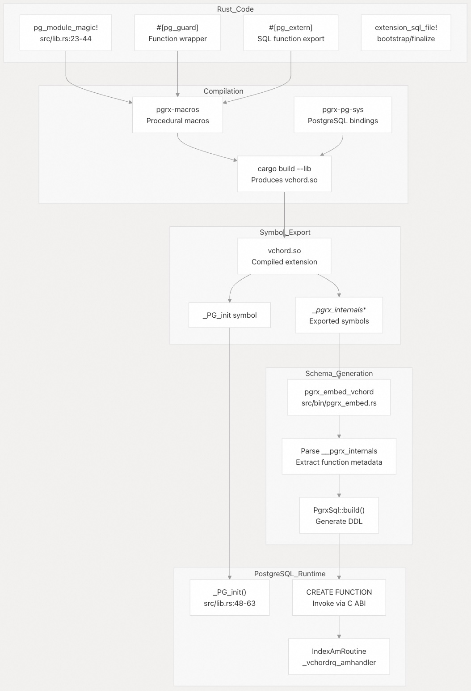
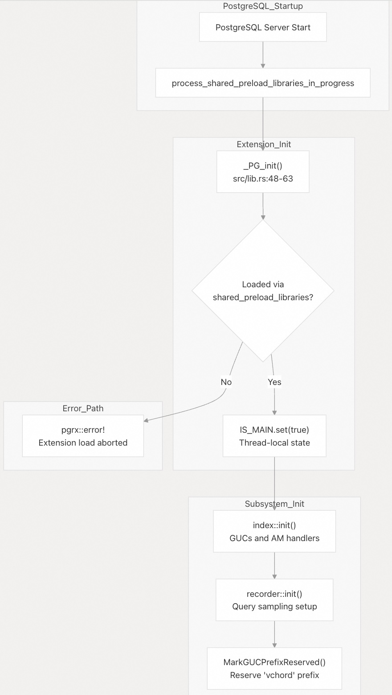
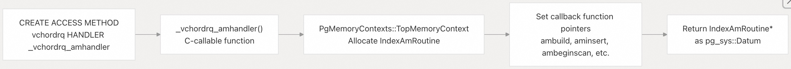
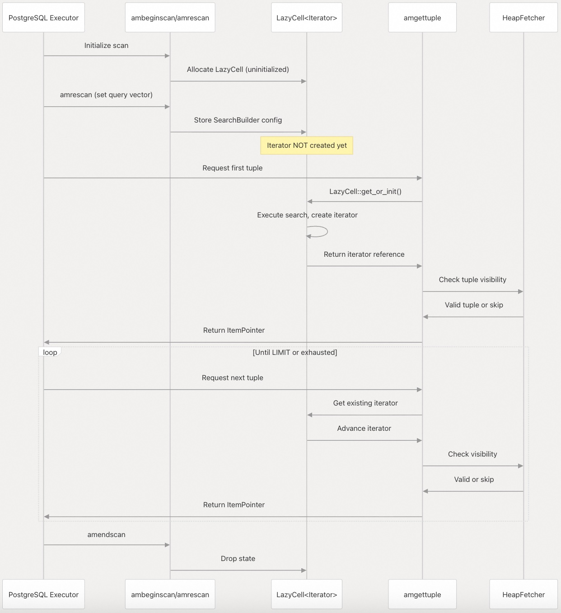
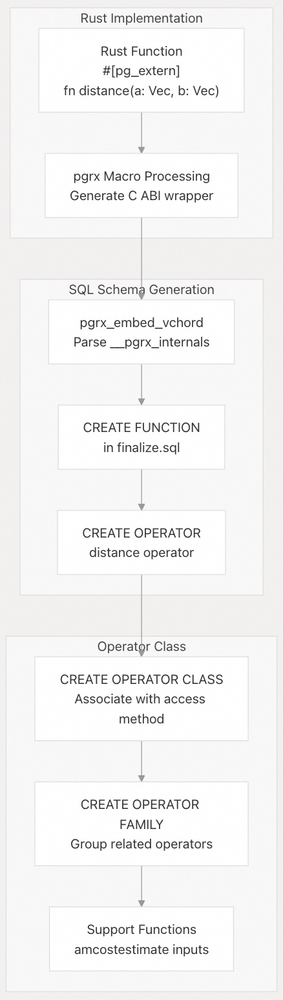
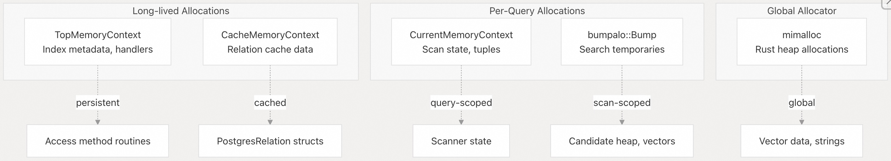
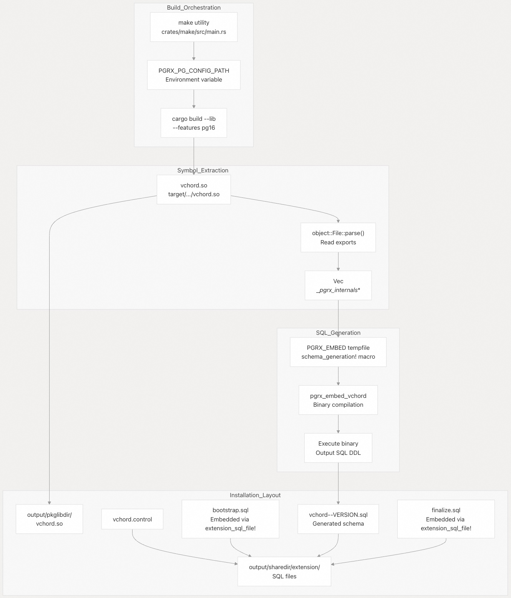
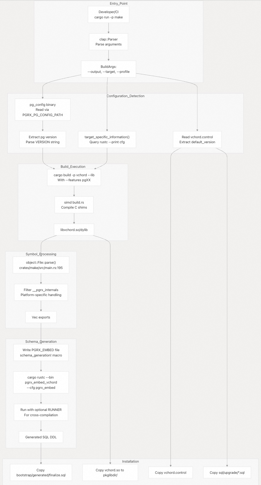

## VectorChord 源码学习: 7.2 扩展开发指南 (Extension Development Guide)  
                                        
### 作者                                        
digoal                                        
                                        
### 日期                                        
2025-11-03                                        
                                        
### 标签                                        
VectorChord , 源码学习                                        
                                        
----                                        
                                        
## 背景                                        
本文为希望扩展 **VectorChord** 或贡献新功能的开发人员提供指导。内容涵盖 **pgrx** 开发模式 (**development patterns**)、实现新的 **操作符** (**operators**，或译作：**运算符**)、创建自定义 **索引访问方法** (**index access methods**) 以及遵循既定的代码模式 (**code patterns**)。  
  
**范围** (**Scope**): 本文侧重于 **VectorChord** 扩展本身内部的开发。  
  
**先决条件** (**Prerequisites**): 熟悉 **Rust** 编程、基本的 **PostgreSQL 内部结构** (**PostgreSQL internals**) 以及 **pgrx 框架** (**pgrx framework**)。  
  
---  
  
## **pgrx** 框架概述（pgrx Framework Overview）  
  
**VectorChord** 使用 **pgrx 0.16.1** 构建，这是一个将 **Rust** 代码与 **PostgreSQL** 的 **C API** 连接起来的框架。该框架提供过程宏（procedural macros）、**PostgreSQL** 函数的安全封装（safe wrappers）以及 **SQL** 模式文件（schema files）的代码生成。  
  
### 关键框架组件（Key Framework Components）  
  
  
  
| 宏/属性（Macro/Attribute） | 用途（Purpose） | 示例位置（Example Location） |  
|---|---|---|  
| `pg_module_magic!` | 声明扩展元数据（metadata）（名称、版本） | [`src/lib.rs` 23-44](https://github.com/tensorchord/VectorChord/blob/ac12e257/src/lib.rs#L23-L44) |  
| `#[pg_guard]` | 封装外部（extern）函数以实现恐慌安全（panic safety） | 应用于所有回调函数（callbacks） |  
| `#[pg_extern]` | 将 **Rust** 函数导出为 **SQL** 函数 | 贯穿整个数据类型模块 |  
| `extension_sql_file!` | 在扩展中嵌入 **SQL** 文件 | [`src/lib.rs` 45-46](https://github.com/tensorchord/VectorChord/blob/ac12e257/src/lib.rs#L45-L46) |  
  
来源: [`Cargo.toml` 39](https://github.com/tensorchord/VectorChord/blob/ac12e257/Cargo.toml#L39-L39) [`src/lib.rs` 23-46](https://github.com/tensorchord/VectorChord/blob/ac12e257/src/lib.rs#L23-L46) [`src/bin/pgrx_embed.rs` 17](https://github.com/tensorchord/VectorChord/blob/ac12e257/src/bin/pgrx_embed.rs#L17-L17)  
  
---  
  
## 扩展结构与组织（Extension Structure and Organization）  
  
**VectorChord** 遵循工作区结构（workspace structure），包含多个专门的 **crate**：  
  
| Crate | 用途（Purpose） |  
|---|---|  
| `vchord` | 主要扩展库（Main extension library），**pgrx** 集成 |  
| `vchordrq` | **RQ-tree** 索引实现 |  
| `vchordg` | 基于图（Graph-based）的索引实现 |  
| `index` | 常见索引操作和实用程序（utilities） |  
| `simd` | **SIMD** 抽象（abstractions）和优化 |  
| `vector` | 向量类型定义 |  
| `distance` | 距离度量（Distance metric）实现 |  
| `rabitq` | **RaBitQ** 量化（quantization） |  
| `k_means` | **K-means** 聚类（clustering） |  
| `make` | 构建编排（Build orchestration） |  
  
主 **crate** 同时导出一个 **cdylib**（用于 **PostgreSQL**）和一个 **lib**（供其他 **crate** 依赖）。它还包括一个用于 **SQL** 生成的二进制目标（binary target）`pgrx_embed_vchord`。  
  
来源: [`Cargo.toml` 1-113](https://github.com/tensorchord/VectorChord/blob/ac12e257/Cargo.toml#L1-L113)  
  
---  
  
## 扩展初始化模式（Extension Initialization Pattern）  
  
### `_PG_init` 函数  
  
需要早期初始化（early initialization）的 **PostgreSQL** 扩展必须通过 `shared_preload_libraries` 加载。`_PG_init` 函数在服务器启动期间被调用：  
  
  
  
**关键实现细节（Key implementation details）**:  
  
1.  **共享库要求检查**（Shared library requirement check） [`src/lib.rs` 51-53](https://github.com/tensorchord/VectorChord/blob/ac12e257/src/lib.rs#L51-L53):  
    ```  
    if !unsafe { pgrx::pg_sys::process_shared_preload_libraries_in_progress } {  
        pgrx::error!("vchord must be loaded via shared_preload_libraries.");  
    }  
    ```  
    这可以防止错过初始化（initialization）的运行时 `CREATE EXTENSION`。  
2.  **线程本地状态跟踪**（Thread-local state tracking） [`src/lib.rs` 65-72](https://github.com/tensorchord/VectorChord/blob/ac12e257/src/lib.rs#L65-L72):  
    ```  
    std::thread_local! {  
        static IS_MAIN: core::cell::Cell<bool> = const { core::cell::Cell::new(false) };  
    }  
      
    #[must_use]  
    fn is_main() -> bool {  
        IS_MAIN.get()  
    }  
    ```  
    用于区分主 **postmaster** 进程（process）和后台工作进程（background workers）。  
3.  **GUC** **前缀保留**（prefix reservation） [`src/lib.rs` 58-62](https://github.com/tensorchord/VectorChord/blob/ac12e257/src/lib.rs#L58-L62):  
    * **PostgreSQL 13-14**: 使用 `EmitWarningsOnPlaceholders()`（已弃用 **deprecated**）  
    * **PostgreSQL 15+**: 使用 `MarkGUCPrefixReserved()` 来保留 `vchord` 命名空间（namespace）。  
    这可以防止其他扩展定义冲突的 **GUC**（Grand Unified Configuration），例如 `vchord.other_param`。  
4.  **初始化序列**（Initialization sequence）:  
    * `index::init()`: 注册访问方法处理程序（access method handlers）和 **GUC**  
    * `recorder::init()`: 设置查询采样基础设施（query sampling infrastructure）  
  
来源: [`src/lib.rs` 48-72](https://github.com/tensorchord/VectorChord/blob/ac12e257/src/lib.rs#L48-L72)  
  
---  
  
## 索引访问方法实现（Index Access Method Implementation）  
  
实现一种新的索引类型需要提供一个 `IndexAmRoutine` 结构，其中包含用于各种生命周期操作（lifecycle operations）的回调函数（callbacks）。  
  
### `IndexAmRoutine` 回调函数架构（IndexAmRoutine Callback Architecture）  
  
  
  
### 处理程序注册模式（Handler Registration Pattern）  
  
访问方法处理程序（Access method handlers）是通过一个返回 `IndexAmRoutine` 指针的函数来注册的。处理函数名称必须匹配模式 `_<amname>_amhandler`。  
  
**注册流程（Registration Flow）**:  
  
  
  
**实现模式（Implementation Pattern）**:  
  
```  
// Pattern used in vchordrq and vchordg  
#[pg_guard]  
#[no_mangle]  
pub extern "C-unwind" fn _vchordrq_amhandler(  
    _fcinfo: pg_sys::FunctionCallInfo,  
) -> pg_sys::Datum {  
    unsafe {  
        // Allocate in TopMemoryContext (persists across queries)  
        let routine = PgMemoryContexts::TopMemoryContext.palloc_struct::<pg_sys::IndexAmRoutine>();  
          
        (*routine).type_ = pg_sys::NodeTag::T_IndexAmRoutine;  
          
        // Required callbacks  
        (*routine).amvalidate = Some(amvalidate);  
        (*routine).amcostestimate = Some(amcostestimate);  
        (*routine).ambuild = Some(ambuild);  
        (*routine).aminsert = Some(aminsert);  
        (*routine).ambulkdelete = Some(ambulkdelete);  
        (*routine).amvacuumcleanup = Some(amvacuumcleanup);  
          
        // Scan callbacks  
        (*routine).ambeginscan = Some(ambeginscan);  
        (*routine).amrescan = Some(amrescan);  
        (*routine).amgettuple = Some(amgettuple);  
        (*routine).amendscan = Some(amendscan);  
          
        // Optional: parallel scan support  
        (*routine).amestimateparallelscan = None;  
        (*routine).aminitparallelscan = None;  
        (*routine).amparallelrescan = None;  
          
        // Flags  
        (*routine).amcanorder = false;  
        (*routine).amcanunique = false;  
        (*routine).amcanmulticol = false;  
        // ... etc  
          
        routine.into_datum().unwrap()  
    }  
}  
```  
  
**关键要求（Critical Requirements）**:  
  
1.  函数必须是 `#[no_mangle]` 以确保稳定的符号名称（stable symbol name）  
2.  必须使用 `#[pg_guard]` 来实现恐慌安全（panic safety）  
3.  必须在 `TopMemoryContext` 中分配 `IndexAmRoutine`（而不是 **Rust** 堆 **heap**）  
4.  必须将 `type_` 字段设置为 `T_IndexAmRoutine`  
5.  所有必需的回调函数必须为非空（non-null）  
  
来源: 模式来源于图中引用的 **vchordrq** 和 **vchordg** 实现  
  
### 构建过程实现（Build Process Implementation）  
  
`ambuild` 回调函数创建索引结构。关键职责（Key responsibilities）包括：  
  
1.  **元数据初始化**（Metadata initialization）：使用索引参数创建 **MetaTuple**  
2.  **数据收集**（Data collection）：对基础表（base table）进行采样（Sample）或扫描（scan）  
3.  **结构构建**（Structure building）：计算中心点（centroids），构建层次结构（hierarchy）  
4.  **并行协调**（Parallel coordination）：对于并行构建，协调领导者（leader）和工作进程（workers）  
5.  **WAL** **日志记录**（logging）：确保崩溃恢复（crash recovery）  
  
构建过程可能支持多种策略（strategies）：  
  
* **默认（Default）**: 单个中心点（Single centroid），最小开销（minimal overhead）  
* **内部（Internal）**: 在 **PostgreSQL** 内部进行采样（Sample）+ **K-means** 聚类  
* **外部（External）**: 从 **pgvector** 表加载预先计算的结构  
  
### 扫描操作模式（Scan Operation Pattern）  
  
扫描操作遵循**惰性求值模型**（lazy evaluation model）：  
  
  
  
**关键实现细节（Key implementation details）**:  
  
* **LazyCell** **模式**：扫描器状态（Scanner state）使用 **LazyCell** 来推迟搜索执行，直到第一次元组（tuple）请求  
* **Bump 分配**（allocation）：在扫描期间使用 `bumpalo::Bump` 进行临时内存分配  
* **MVCC** **合规性**（compliance）：**HeapFetcher** 根据快照（snapshot）验证元组的可见性（tuple visibility）  
  
---  
  
## 添加操作符和操作符类（Adding Operators and Operator Classes）  
  
### 操作符定义工作流程（Operator Definition Workflow）  
  
  
  
### 实现步骤（Implementation Steps）  
  
1.  使用 `#[pg_extern]` **定义 Rust 函数**：  
  
```  
#[pg_extern(immutable, strict, parallel_safe)]  
fn vector_l2_distance(a: Vec<f32>, b: Vec<f32>) -> f32 {  
    // Implementation  
}  
```  
  
2.  在 `sql/finalize.sql` 中**创建 SQL 操作符**：  
  
```  
CREATE OPERATOR <-> (  
    LEFTARG = vector,  
    RIGHTARG = vector,  
    FUNCTION = vector_l2_distance,  
    COMMUTATOR = <->  
);  
```  
  
3.  **定义操作符类**（Operator Class）：  
  
```  
CREATE OPERATOR CLASS vector_l2_ops  
    FOR TYPE vector USING vchordrq AS  
    OPERATOR 1 <-> (vector, vector) FOR ORDER BY float_ops,  
    FUNCTION 1 vector_l2_distance(vector, vector);  
```  
  
来源: [`Cargo.toml` 12-13](https://github.com/tensorchord/VectorChord/blob/ac12e257/Cargo.toml#L12-L13) [`src/lib.rs` 45-46](https://github.com/tensorchord/VectorChord/blob/ac12e257/src/lib.rs#L45-L46)  
  
---  
  
## **GUC** 配置参数（GUC Configuration Parameters）  
  
**VectorChord** 使用 **PostgreSQL** 的 **GUC**（**Grand Unified Configuration**，统一配置系统）系统来处理运行时参数（runtime parameters）。  
  
### **GUC** 注册模式（GUC Registration Pattern）  
  
**GUC** 必须在服务器完成启动之前，在 `_PG_init()` 期间注册：  
  
  
  
### **GUC** 类别（GUC Categories）  
  
| 参数（Parameter） | 类型（Type） | 用途（Purpose） | 范围（Scope） |  
|---|---|---|---|  
| `vchordrq.probes` | int | 要探测（probe）的聚类（clusters）数量 | **Per-query**（每查询） |  
| `vchordrq.epsilon` | real | 搜索扩展因子（Search expansion factor） | **Per-query** |  
| `vchordg.ef_search` | int | 搜索波束宽度（Search beam width） | **Per-query** |  
| `vchordrq.io_strategy` | enum | 预取策略（Prefetch strategy） | **Per-query** |  
  
**实现说明（Implementation notes）**:  
  
* 使用验证回调函数（validation callbacks）来强制执行约束（constraints）  
* 为每查询参数设置 **PGC_USERSET** 上下文（context）  
* 在 **SQL** 注释中记录用于 **PGXN** 元数据  
  
来源: [`src/index/mod.rs` 26](https://github.com/tensorchord/VectorChord/blob/ac12e257/src/index/mod.rs#L26-L26)    
  
---  
  
## 内存管理模式（Memory Management Patterns）  
  
### **PostgreSQL** 内存上下文（Memory Contexts）对比 **Rust** 分配器（Allocators）  
  
**VectorChord** 使用多种内存管理策略：  
  
  
  
### 安全指南（Safety Guidelines）  
  
1.  **上下文分配**（Context allocation）：使用 `PgMemoryContexts::new()` 来进行 **PostgreSQL** 管理的内存分配  
2.  **Bump 分配器**（allocators）：为每次扫描创建新的 **Bump**，并在迭代之间清除  
3.  **生命周期管理**（Lifetime management）：将 **Rust** 引用保持在适当的 **PostgreSQL** 上下文（contexts）中  
4.  **FFI 边界**（boundaries）：切勿将 **Rust** 分配的指针传递给期望 **palloc** 分配内存的 **PostgreSQL** 代码  
  
来源: [`src/lib.rs` 78-81](https://github.com/tensorchord/VectorChord/blob/ac12e257/src/lib.rs#L78-L81)    
  
---  
  
## **SQL** 模式生成（SQL Schema Generation）  
  
**VectorChord** 使用自定义构建管道（build pipeline），将 **pgrx** 的 **SQL** 生成与自定义 `make` 实用程序（utility）相结合，以编排整个构建过程。  
  
### 模式生成管道（Schema Generation Pipeline）  
  
  
  
### 自定义 Make 实用程序（The Custom Make Utility）  
  
位于 [`crates/make/src/main.rs`](https://github.com/tensorchord/VectorChord/blob/ac12e257/crates/make/src/main.rs) 的 `make` 实用程序编排了整个构建过程：  
  
**关键职责（Key Responsibilities）**:  
  
1.  **构建协调**（Build coordination）：使用适当的标志（flags）调用 `cargo build` [`crates/make/src/main.rs` 162-193](https://github.com/tensorchord/VectorChord/blob/ac12e257/crates/make/src/main.rs#L162-L193)  
2.  **符号解析**（Symbol parsing）：使用 `object` **crate** 提取 `__pgrx_internals` 符号 [`crates/make/src/main.rs` 195-230](https://github.com/tensorchord/VectorChord/blob/ac12e257/crates/make/src/main.rs#L195-L230)  
3.  **模式生成**（Schema generation）：编译并运行 `pgrx_embed_vchord` 二进制文件 [`crates/make/src/main.rs` 232-307](https://github.com/tensorchord/VectorChord/blob/ac12e257/crates/make/src/main.rs#L232-L307)  
4.  **安装布局**（Installation layout）：将文件复制到正确的 **PostgreSQL** 目录中 [`crates/make/src/main.rs` 309-433](https://github.com/tensorchord/VectorChord/blob/ac12e257/crates/make/src/main.rs#L309-L433)  
  
**平台特定处理**（Platform-specific handling）:  
  
* **macOS**: 针对 **pg13-15** 和 **pg16+** 使用不同的后缀（suffix），分别是 `.so` 和 `.dylib`。  
    [`crates/make/src/main.rs` 93-107](https://github.com/tensorchord/VectorChord/blob/ac12e257/crates/make/src/main.rs#L93-L107)  
* **PowerPC64**: 提取 **PostgreSQL** 符号（symbols）用于导入（import）。  
    [`crates/make/src/main.rs` 242-256](https://github.com/tensorchord/VectorChord/blob/ac12e257/crates/make/src/main.rs#L242-L256)  
  
### **pgrx\_embed** 二进制文件（The pgrx\_embed Binary）  
  
位于 [`src/bin/pgrx_embed.rs`](https://github.com/tensorchord/VectorChord/blob/ac12e257/src/bin/pgrx_embed.rs) 的 `pgrx_embed_vchord` 二进制文件负责 **SQL** 生成：  
  
**流程（Process）**:  
  
1. **宏生成**（Macro generation）：`Make` 实用程序将 `schema_generation!` 调用写入临时文件。  
    [`crates/make/src/main.rs` 257-266](https://github.com/tensorchord/VectorChord/blob/ac12e257/crates/make/src/main.rs#L257-L266)  
2. **符号解析**（Symbol resolution）：宏为所有 `__pgrx_internals` 符号声明 `extern "Rust"` 函数。  
    [`src/bin/pgrx_embed.rs` 41-46](https://github.com/tensorchord/VectorChord/blob/ac12e257/src/bin/pgrx_embed.rs#L41-L46)  
3. **实体收集**（Entity collection）：调用每个函数以检索 `SqlGraphEntity`。  
    [`src/bin/pgrx_embed.rs` 45-46](https://github.com/tensorchord/VectorChord/blob/ac12e257/src/bin/pgrx_embed.rs#L45-L46)  
4. **DDL** **生成**（DDL generation）：使用 `PgrxSql::build()` 生成 **SQL**。  
    [`src/bin/pgrx_embed.rs` 48](https://github.com/tensorchord/VectorChord/blob/ac12e257/src/bin/pgrx_embed.rs#L48-L48)  
5. **输出**（Output）：将完整的 **SQL** 模式（schema）写入 **stdout**（标准输出）。  
    [`src/bin/pgrx_embed.rs` 49](https://github.com/tensorchord/VectorChord/blob/ac12e257/src/bin/pgrx_embed.rs#L49-L49)  
  
### **手动 SQL 文件**（Manual SQL Files）  
  
该扩展使用三种 **SQL** 文件类型：  
  
| 文件（File） | 用途（Purpose） | 嵌入方式（Embedded Via） | 执行顺序（Execution Order） |  
| :--- | :--- | :--- | :--- |  
| `bootstrap.sql` | 先决条件（Prerequisites）（**pgvector** 依赖项） | `extension_sql_file!` | **First**（第一） |  
| Generated SQL | 自动生成的函数/类型 | `pgrx_embed` output | **Second**（第二） |  
| `finalize.sql` | 操作符（Operators）、操作符类（operator classes）、视图（views） | `extension_sql_file!` | **Last**（最后） |  
  
**最佳实践（Best practices）**:  
  
* 保持 `bootstrap.sql` **最小化**（仅包含依赖项）。  
* 在函数（functions）存在后，于 `finalize.sql` 中**定义操作符**。  
* **切勿手动编辑** 生成的 **SQL**（它会在每次构建时重新生成）。  
  
**来源**:  
[`crates/make/src/main.rs` 1-434](https://github.com/tensorchord/VectorChord/blob/ac12e257/crates/make/src/main.rs#L1-L434)  
[`src/bin/pgrx_embed.rs` 1-55](https://github.com/tensorchord/VectorChord/blob/ac12e257/src/bin/pgrx_embed.rs#L1-L55)  
[`src/lib.rs` 45-46](https://github.com/tensorchord/VectorChord/blob/ac12e257/src/lib.rs#L45-L46)  
  
---  
  
## 添加新索引类型：分步指南（Adding a New Index Type: Step-by-Step）  
  
### 1\. 创建索引 Crate（Index Crate）  
  
在 `crates/` 目录下创建一个新的 **crate**（Rust 包），并添加对 `index`、`simd`、`distance` 等其他 **crate** 的依赖。  
  
### 2\. 定义索引结构（Define Index Structure）  
  
定义索引的元数据和运行时状态结构：  
  
```rust  
pub struct MyIndexMeta {  
    pub dims: u16,  
    pub parameter1: u32,  
    pub parameter2: f32,  
}  
  
pub struct MyIndexBuilder {  
    // Build-time state  
}  
  
pub struct MyIndexScanner {  
    // Scan-time state  
}  
```  
  
### 3\. 实现访问方法回调（Implement Access Method Callbacks）  
  
创建一个 `am.rs` 模块，包含 **处理器注册（handler registration）** 函数：  
  
```rust  
#[pg_guard]  
#[no_mangle]  
pub extern "C-unwind" fn _myindex_amhandler(  
    fcinfo: pg_sys::FunctionCallInfo,  
) -> pg_sys::Datum {  
    // Return IndexAmRoutine  
}  
```  
  
实现必需的回调函数（**callbacks**）：  
  
  * **`amvalidate`**: 验证**操作符类（operator class）**。  
  * **`amcostestimate`**: 提供成本估算。  
  * **`ambuild`**: 构建索引。  
  * **`aminsert`**: 插入**元组（tuple）**。  
  * **`ambeginscan`**、**`amrescan`**、**`amgettuple`**、**`amendscan`**: 扫描操作。  
  
### 4\. 注册 GUC 参数（Register GUC Parameters）  
  
在 `gucs.rs` 文件中添加 **GUC**（Grand Unified Configuration，统一配置系统）注册：  
  
```rust  
pub fn init() {  
    DefineCustomIntVariable(  
        c"myindex.param".as_ptr(),  
        c"Description".as_ptr(),  
        c"Long description".as_ptr(),  
        &mut PARAM_VALUE,  
        DEFAULT,  
        MIN,  
        MAX,  
        PGC_USERSET,  
        0,  
        None, None, None,  
    );  
}  
```  
  
### 5\. 定义 SQL 模式（Define SQL Schema）  
  
在 `sql/finalize.sql` 文件中定义 **SQL 操作符类（SQL Operator Class）**：  
  
```sql  
CREATE OPERATOR CLASS myindex_ops  
    DEFAULT FOR TYPE vector USING myindex AS  
    OPERATOR 1 <-> (vector, vector) FOR ORDER BY float_ops,  
    FUNCTION 1 vector_l2_distance(vector, vector);  
```  
  
### 6\. 添加初始化（Add Initialization）  
  
在主 `lib.rs` 文件中：  
  
```rust  
mod myindex;  
  
fn _pg_init() {  
    // ...  
    myindex::am::init();  
}  
```  
  
### 7\. 编写测试（Write Tests）  
  
在测试目录中创建 `.slt` 文件（**SQL Logic Test**），例如：  
  
```sql  
statement ok  
CREATE TABLE test_vectors (id int, v vector(3));  
  
statement ok  
CREATE INDEX ON test_vectors USING myindex (v) WITH (param1 = 100);  
  
query I  
SELECT id FROM test_vectors ORDER BY v <-> '[1,2,3]' LIMIT 5;  
```  
  
**来源**:  
[`src/index/mod.rs` 22-30](https://github.com/tensorchord/VectorChord/blob/ac12e257/src/index/mod.rs#L22-L30)   
  
---  
  
## 错误处理和安全性（Error Handling and Safety）  
  
### 错误传播（Error Propagation）  
  
VectorChord 使用 **pgrx** 的错误处理宏来实现与 **PostgreSQL** 的集成：  
  
| 宏（Macro） | 用例（Use Case） |  
| :--- | :--- |  
| `pgrx::error!()` | 致命错误，中止事务（aborts transaction） |  
| `pgrx::warning!()` | 非致命警告消息 |  
| `pgrx::notice!()` | 信息性消息 |  
| `pgrx::log!()` | 服务器日志消息 |  
  
**模式（Pattern）**: 在内部使用 `Result<T, E>`，并在外部函数接口（FFI boundaries）处转换为 **pgrx** 错误：  
  
```rust  
#[pg_guard]  
pub extern "C-unwind" fn my_function(...) -> pg_sys::Datum {  
    match internal_function() {  
        Ok(result) => result.into_datum(),  
        Err(e) => pgrx::error!("{}", e),  
    }  
}  
```  
  
### 安全要求（Safety Requirements）  
  
VectorChord 强制执行严格的安全规则：  
  
1.  **默认禁用 `unsafe`**: [`Cargo.toml` 86](https://github.com/tensorchord/VectorChord/blob/ac12e257/Cargo.toml#L86-L86) 设置 `rust.unsafe_code = "deny"`。  
2.  **显式 `unsafe`**: [`src/lib.rs` 15](https://github.com/tensorchord/VectorChord/blob/ac12e257/src/lib.rs#L15-L15) 允许在 **crate** 级别使用 `unsafe`，但 [`Cargo.toml` 87](https://github.com/tensorchord/VectorChord/blob/ac12e257/Cargo.toml#L87-L87) 要求使用 `unsafe_op_in_unsafe_fn`（在 `unsafe` 函数中使用 `unsafe` 操作）。  
3.  **展开安全（Unwind safety）**: [`src/lib.rs` 74-75](https://github.com/tensorchord/VectorChord/blob/ac12e257/src/lib.rs#L74-L75) 要求使用 `-Cpanic=unwind` 以兼容 **PostgreSQL**。  
  
**FFI 安全检查清单（FFI Safety Checklist）**:  
  
* **✓** 所有 `extern "C-unwind"` 函数都带有 **`#[pg_guard]`** 属性。  
* **✓** 没有 **Rust** 类型跨越 **FFI** 边界（使用 **`pg_sys`** 类型）。  
* **✓** **PostgreSQL** 分配的内存绝不会被 **Rust** 释放。  
* **✓** **FFI** 边界处的 **Panic**（程序异常）会被 **`pg_guard`** 捕获。  
  
**来源**:  
[`Cargo.toml` 86-87](https://github.com/tensorchord/VectorChord/blob/ac12e257/Cargo.toml#L86-L87)  
[`src/lib.rs` 15](https://github.com/tensorchord/VectorChord/blob/ac12e257/src/lib.rs#L15-L15)  
[`src/lib.rs` 74-75](https://github.com/tensorchord/VectorChord/blob/ac12e257/src/lib.rs#L74-L75)  
  
-----  
  
## Testing Patterns (测试模式)  
  
### Unit Tests (单元测试)  
  
Rust 单元测试位于 `#[cfg(test)]` 模块中：  
  
```rust  
#[cfg(test)]  
mod tests {  
    use super::*;  
      
    #[test]  
    fn test_my_function() {  
        let result = my_function(args);  
        assert_eq!(result, expected);  
    }  
}  
```  
  
### SQL Logic Tests (SQL 逻辑测试)  
  
VectorChord 使用 `sqllogictest` 进行集成测试（Integration Testing）。测试文件按索引类型组织：  
  
  * `tests/general/*.slt`: 跨索引测试（Cross-index tests）  
  * `tests/vchordrq/*.slt`: 专用于 RQ 索引的测试（RQ-specific tests）  
  * `tests/vchordg/*.slt`: 专用于图索引的测试（Graph-specific tests）  
  
**测试结构**（Test structure）：  
  
```  
# Setup  
statement ok  
CREATE TABLE test_data (id int, vec vector(128));  
  
# Insert test data  
statement ok  
INSERT INTO test_data VALUES ...;  
  
# Create index  
statement ok  
CREATE INDEX ON test_data USING vchordrq (vec);  
  
# Query test  
query I  
SELECT id FROM test_data ORDER BY vec <-> '[...]' LIMIT 10;  
----  
1  
5  
8  
...  
```  
  
### SIMD Testing (SIMD 测试)  
  
SIMD 代码通过 CI（持续集成）在不同架构上进行测试：  
  
  * **x86\_64**：使用 Intel SDE (Software Development Emulator，软件开发模拟器)  
  * **aarch64**：使用 QEMU (Quick Emulator，快速模拟器)  
  
```  
# Test with specific SIMD level  
RUSTFLAGS="-C target-cpu=x86-64-v4" cargo test  
  
# Test with QEMU for SVE lengths  
qemu-aarch64 -cpu max,sve=on,sve256=on ./test_binary  
```  
  
---  
  
## 构建系统集成（Build System Integration）  
  
### 构建系统架构（Build System Architecture）  
  
VectorChord 使用一个由自定义的 **`make` 实用程序**协调的**多阶段构建过程** :  
  
  
  
  * **SIMD 脚本（SIMD Script）**: 探测目标架构并编译 **C shims**（C 垫片）。  
  * **主构建（Main Build）**: 使用 **`cargo`** 构建 **`cdylib`**（动态库）和 **Schema**（模式）生成二进制文件。  
  * **安装（Installation）**: 复制文件到 PostgreSQL 扩展目录。  
  
### SIMD 构建脚本（SIMD Build Script）  
  
**`simd`** **crate** 使用 [`crates/simd/build.rs`](https://github.com/tensorchord/VectorChord/blob/ac12e257/crates/simd/build.rs) 来编译**架构特定**的 **C shims**（C 垫片）。  
  
#### 编译器选择策略（Compiler Selection Strategy）  
  
[`crates/simd/build.rs` 33-56](https://github.com/tensorchord/VectorChord/blob/ac12e257/crates/simd/build.rs#L33-L56)：  
  
1.  检查环境变量（**`CC_<target>`**、**`TARGET_CC`**、**`CC`**）。  
2.  对于**本地构建**（native builds），首选 **clang ≥16** 或 **gcc ≥14 (aarch64)** / **gcc ≥12 (x86\_64)**。  
3.  如果设置了显式的 **`CC`**，则回退（Fallback）到默认编译器。  
  
| 架构（Architecture） | C 源代码（C Source） | 所需编译器（Required Compiler） |  
| :--- | :--- | :--- |  
| **`aarch64`** | **`cshim/aarch64.c`** | **clang ≥16** 或 **gcc ≥14** |  
| **`x86_64`** | **`cshim/x86_64.c`** | **clang ≥16** 或 **gcc ≥12** |  
| **`powerpc64`** | None（纯 **Rust**） | N/A |  
| **`s390x`** | None（纯 **Rust**） | N/A |  
  
#### 实现（Implementation）  
  
[`crates/simd/build.rs` 58-87](https://github.com/tensorchord/VectorChord/blob/ac12e257/crates/simd/build.rs#L58-L87)：  
  
```  
// Simplified from actual code  
let target_arch = var("CARGO_CFG_TARGET_ARCH")?;  
match target_arch.as_str() {  
    "aarch64" => {  
        let mut build = cc::Build::new();  
        if let Some(compiler) = compiler(&host, &target, 16, 14) {  
            build.compiler(compiler);  
        }  
        build.file("./cshim/aarch64.c");  
        build.opt_level(3);  
        build.compile("simd_cshim");  
    }  
    "x86_64" => { /* similar */ }  
    _ => { /* no C shims needed */ }  
}  
```  
  
### 扩展构建配置（Extension Build Configuration）  
  
主 **crate** 同时构建为一个**库**（library）和一个**扩展**（extension）[`Cargo.toml` 7-13](https://github.com/tensorchord/VectorChord/blob/ac12e257/Cargo.toml#L7-L13)：  
  
```  
[lib]  
name = "vchord"  
crate-type = ["cdylib", "lib"]  # Both shared library and Rust library  
  
[[bin]]  
name = "pgrx_embed_vchord"  
path = "./src/bin/pgrx_embed.rs"  # Schema generation binary  
```  
  
### 构建命令（Build Commands）  
  
#### 使用自定义 `make` 实用程序（推荐）  
  
```  
# Set PostgreSQL configuration  
export PGRX_PG_CONFIG_PATH=/usr/bin/pg_config  
  
# Build for development  
cargo run -p make -- build --output ./dist --profile dev  
  
# Build for release  
cargo run -p make -- build --output ./dist --profile release  
  
# Cross-compilation with runner (e.g., QEMU)  
cargo run -p make -- build --output ./dist --target aarch64-unknown-linux-gnu \
    --runner "qemu-aarch64 -L /usr/aarch64-linux-gnu"  
```  
  
#### 直接 `cargo` 命令（仅限开发环境）  
  
```  
# Build extension library  
cargo build --features pg16  
  
# Generate SQL schema (development version only)  
PGRX_EMBED=$(mktemp) cargo run --bin pgrx_embed_vchord --features pg16 \
    -- --cfg pgrx_embed  
```  
  
来源:  
[`crates/make/src/main.rs` 162-433](https://github.com/tensorchord/VectorChord/blob/ac12e257/crates/make/src/main.rs#L162-L433)  
[`crates/simd/build.rs` 58-87](https://github.com/tensorchord/VectorChord/blob/ac12e257/crates/simd/build.rs#L58-L87)  
[`Cargo.toml` 7-13](https://github.com/tensorchord/VectorChord/blob/ac12e257/Cargo.toml#L7-L13)  
  
---  
  
## 代码组织最佳实践 (Code Organization Best Practices)  
  
### 模块结构 (Module Structure)  
  
遵循 **VectorChord** 的组织模式：  
  
```  
crates/  
├── myindex/  
│   ├── src/  
│   │   ├── lib.rs           # Public API, re-exports  
│   │   ├── am.rs            # Access method handlers  
│   │   ├── meta.rs          # Metadata structures  
│   │   ├── build.rs         # Index building  
│   │   ├── insert.rs        # Insert operations  
│   │   ├── scan.rs          # Scan operations  
│   │   └── gucs.rs          # GUC parameters  
│   └── Cargo.toml  
```  
  
  
  
### 命名约定 (Naming Conventions)  
  
| 项 (Item) | 约定 (Convention) | 示例 (Example) |  
| :--- | :--- | :--- |  
| 包 (Crates) | **snake\_case** | `vchordrq`, `simd` |  
| 类型 (Types) | **PascalCase** | `MetaTuple`, `Scanner` |  
| 函数 (Functions) | **snake\_case** | `ambuild`, `aminsert` |  
| 常量 (Constants) | **SCREAMING\_SNAKE\_CASE** | `DEFAULT_PROBES` |  
| 模块 (Modules) | **snake\_case** | `am`, `gucs`, `storage` |  
  
  
  
### 文档 (Documentation)  
  
使用 **Rust doc comments** (文档注释) 并附带示例：  
  
```rust  
/// Build an index from a base table.  
///  
/// # Arguments  
/// * `heap` - The base table relation  
/// * `index` - The index relation being built  
/// * `config` - Index configuration parameters  
///  
/// # Returns  
/// Statistics about the built index  
///  
/// # Safety  
/// Must be called from PostgreSQL with valid relations  
pub unsafe fn ambuild(...) -> IndexBuildResult {  
    // Implementation  
}  
```  
  
**来源**:  
[`src/index/mod.rs` 1-31](https://github.com/tensorchord/VectorChord/blob/ac12e257/src/index/mod.rs#L1-L31)  
  
-----  
  
## 贡献工作流程 (Contributing Workflow)  
  
### 开发环境设置 (Development Setup)  
  
1.  安装依赖项 (**dependencies**):  
  
    ```bash  
    # Install PostgreSQL development headers (安装 PostgreSQL 开发头文件)  
    sudo apt install postgresql-server-dev-16  
  
    # Install Rust toolchain (安装 Rust 工具链)  
    curl --proto '=https' --tlsv1.2 -sSf https://sh.rustup.rs | sh  
    ```  
  
2.  克隆并构建 (**Clone and build**):  
  
    ```bash  
    git clone https://github.com/tensorchord/VectorChord  
    cd VectorChord  
    cargo build --features pg16  
    ```  
  
3.  运行测试 (**Run tests**):  
  
    ```bash  
    cargo test --features pg16  
    cargo clippy --features pg16  
    ```  
  
  
### 代码质量检查 (Code Quality Checks)  
  
**VectorChord** 在 **CI** (持续集成) 中强制执行多项质量检查：  
  
| 检查 (Check) | 工具 (Tool) | 目的 (Purpose) |  
| :--- | :--- | :--- |  
| 格式化 (Formatting) | **rustfmt** | Code style (代码风格) |  
| **Linting** (代码检查) | **clippy** | Common mistakes (常见错误) |  
| 拼写错误 (Typos) | **typos** | Spelling errors (拼写错误) |  
| **TOML** 格式 | **taplo** | Config file format (配置文件格式) |  
| 许可证 (License) | **cargo-deny** | License compliance (许可证合规性) |  
  
**预提交工作流程** (**Pre-commit workflow**):  
  
```bash  
# Format code (格式化代码)  
cargo fmt  
  
# Run clippy (运行 clippy)  
cargo clippy --features pg16 -- -D warnings  
  
# Run tests (运行测试)  
cargo test --features pg16  
  
# Check TOML files (检查 TOML 文件)  
taplo format --check  
```  
  
  
### 提交更改 (Submitting Changes)  
  
1.  从 **main** 分支创建特性分支 (**feature branch**).  
2.  进行更改并使用清晰的**提交消息** (**commit messages**).  
3.  为新功能添加/更新**测试** (**tests**).  
4.  运行完整的质量检查 (**full quality checks**).  
5.  提交附带描述的**拉取请求** (**pull request**).  
  
**来源**:  
[`Cargo.toml` 52-93](https://github.com/tensorchord/VectorChord/blob/ac12e257/Cargo.toml#L52-L93)  
    
    
#### [期望 PostgreSQL|开源PolarDB 增加什么功能?](https://github.com/digoal/blog/issues/76 "269ac3d1c492e938c0191101c7238216")
  
  
#### [PolarDB 开源数据库](https://openpolardb.com/home "57258f76c37864c6e6d23383d05714ea")
  
  
#### [PolarDB 学习图谱](https://www.aliyun.com/database/openpolardb/activity "8642f60e04ed0c814bf9cb9677976bd4")
  
  
#### [PostgreSQL 解决方案集合](../201706/20170601_02.md "40cff096e9ed7122c512b35d8561d9c8")
  
  
#### [德哥 / digoal's Github - 公益是一辈子的事.](https://github.com/digoal/blog/blob/master/README.md "22709685feb7cab07d30f30387f0a9ae")
  
  
#### [About 德哥](https://github.com/digoal/blog/blob/master/me/readme.md "a37735981e7704886ffd590565582dd0")
  
  

  
