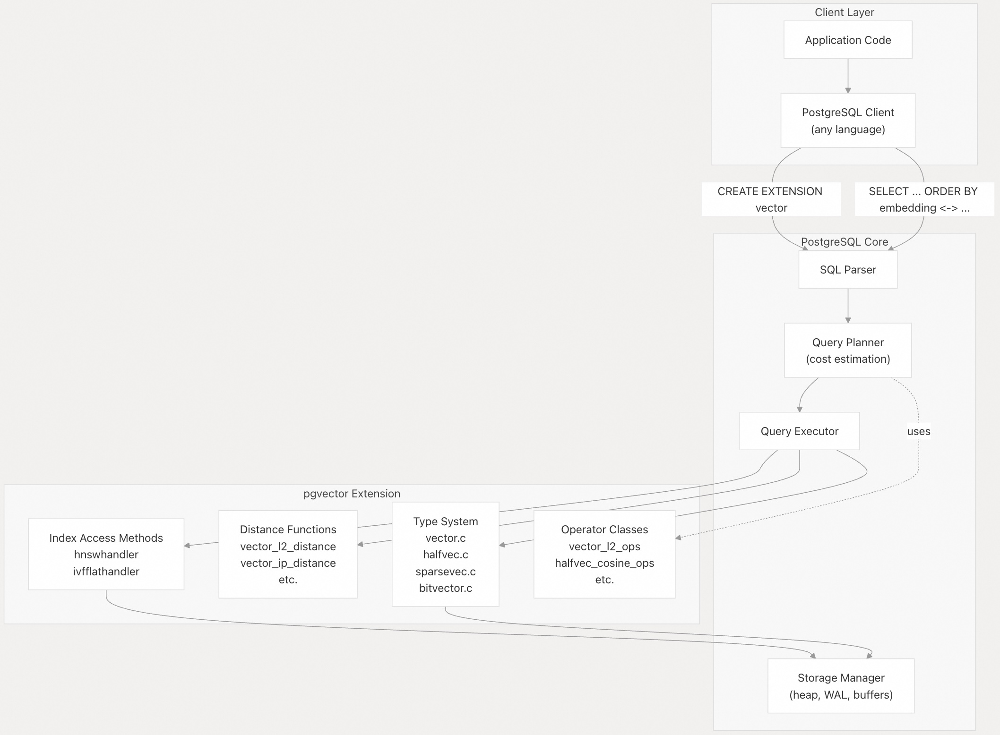
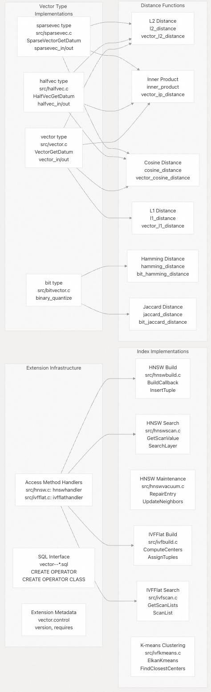
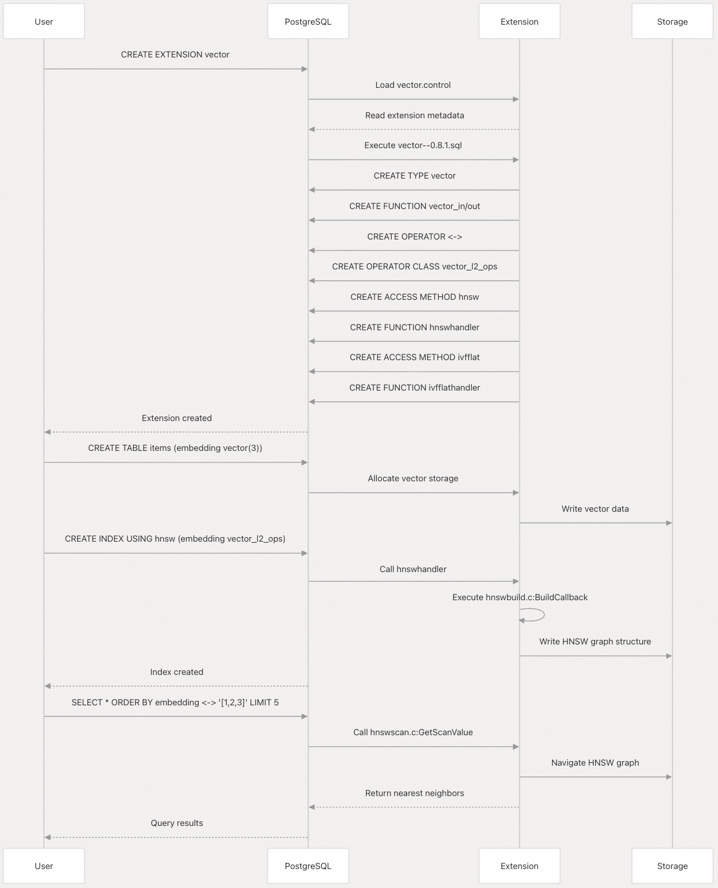

## pgvector 源码学习: 1 pgvector 简介 (Introduction to pgvector)  
                                          
### 作者                                          
digoal                                          
                                          
### 日期                                          
2025-11-03                                          
                                          
### 标签                                          
pgvector , 源码学习                                          
                                          
----                                          
                                          
## 背景                                          
本文介绍 **pgvector** PostgreSQL 扩展（**PostgreSQL extension**）的高级概述（**high-level overview**），包括其架构（**architecture**）、核心功能（**core capabilities**）和关键组件（**key components**）。分享帮助理解 **pgvector** 如何在 PostgreSQL 中实现**向量相似性搜索**（**vector similarity search**）所需的基本概念。  
  
---  
  
## 什么是 pgvector？ (What is pgvector?)  
  
**pgvector** 是一个开源的 PostgreSQL 扩展（**extension**），它为 PostgreSQL 添加了**向量相似性搜索**（**vector similarity search**）功能。它支持存储和查询高维**向量嵌入**（**vector embeddings**）以及常规关系数据，并完全支持 PostgreSQL 的 **ACID** 属性、**时间点恢复**（**point-in-time recovery**, PITR）、**JOINs**（连接）和**事务语义**（**transactional semantics**）。  
  
该扩展实现了针对生产使用优化的**近似最近邻**（**approximate nearest neighbor**, ANN）搜索算法，使应用程序能够高效地在从数千到数十亿个向量的数据集中查找相似向量。  
  
**来源:** [`README.md` 1-15](https://github.com/pgvector/pgvector/blob/d823c445/README.md#L1-L15)  
  
---  
  
## 核心功能 (Core Capabilities)  
  
**pgvector** 提供了以下功能:  
  
| Capability (功能) | Description (描述) | Details (详情) |  
| :--- | :--- | :--- |  
| **Search Modes** (搜索模式) | Exact and approximate nearest neighbor search (精确和近似最近邻搜索) | Exact search for perfect recall (精确搜索实现完美召回); **ANN indexes** for speed-recall tradeoff (**ANN 索引**实现速度-召回率的权衡) |  
| **Vector Types** (向量类型) | Four vector representations (四种向量表示) | `vector` (**float32**), `halfvec` (**float16**), `sparsevec` (sparse float32, 稀疏 float32), `bit` (**binary**, 二进制) |  
| **Distance Metrics** (距离度量) | Six distance functions (六种距离函数) | **L2 distance** (L2 距离), **inner product** (内积), **cosine distance** (余弦距离), **L1 distance** (L1 距离), **Hamming distance** (汉明距离), **Jaccard distance** (Jaccard 距离) |  
| **Index Methods** (索引方法) | Two **ANN** algorithms (两种 **ANN** 算法) | **HNSW** (hierarchical graph, 分层图), **IVFFlat** (**k-means clustering**, k-均值聚类) |  
| **Language Support** (语言支持) | Any language with PostgreSQL client (任何带有 PostgreSQL 客户端的语言) | 30+ language bindings available (30 多种语言绑定可用) |  
| **PostgreSQL Integration** (PostgreSQL 集成) | Full feature compatibility (全面的功能兼容性) | **ACID compliance** (ACID 合规性), **replication** (复制), **partitioning** (分区), **parallel queries** (并行查询) |  
  
**来源:** [`README.md` 5-12](https://github.com/pgvector/pgvector/blob/d823c445/README.md#L5-L12)  
  
---  
  
## 系统架构概览 (System Architecture Overview)  
  
下图展示了 **pgvector** 如何与 PostgreSQL 集成并暴露其功能:  
  
  
  
**关键集成点 (Key Integration Points):**  
  
1.  **Type System** (类型系统): 向 PostgreSQL 的**类型系统**（**type system**）注册四种自定义数据类型（`vector`、`halfvec`、`sparsevec`、`bit`）  
2.  **Operators** (运算符): 定义与 PostgreSQL **运算符框架**（**operator framework**）集成的距离运算符（`<->`、`<#>`、`<=>`、`<+>`、`<~>`、`<%>`）  
3.  **Access Methods** (访问方法): 实现两个 **IndexAmRoutine 处理器**（`hnswhandler`、`ivfflathandler`），它们接入 PostgreSQL 的**索引扫描机制**（**index scan machinery**）  
4.  **Cost Estimation** (成本估算): 提供**成本估算函数**（**cost estimation functions**），帮助查询规划器选择**最优执行计划**（**optimal execution plans**）  
  
**来源:** [`README.md` 1-15](https://github.com/pgvector/pgvector/blob/d823c445/README.md#L1-L15) [`README.md` 194-203](https://github.com/pgvector/pgvector/blob/d823c445/README.md#L194-L203) [`README.md` 330-332](https://github.com/pgvector/pgvector/blob/d823c445/README.md#L330-L332)  
  
---  
  
## 关键组件和代码结构 (Key Components and Code Structure)  
  
下图将系统组件映射到其实现文件:  
  
  
  
**来源:** [`README.md` 942-1059](https://github.com/pgvector/pgvector/blob/d823c445/README.md#L942-L1059)  
  
---  
  
## 文件组织 (File Organization)  
  
**pgvector** 的源代码被组织成**功能模块**（**functional modules**）:  
  
### 核心类型系统 (Core Type System)  
  
* `src/vector.c` - `vector` 类型实现（**float32** 密集向量）  
* `src/halfvec.c` - `halfvec` 类型实现（**float16** 密集向量）  
* `src/sparsevec.c` - `sparsevec` 类型实现（**sparse vectors**, 稀疏向量）  
* `src/bitvector.c` - **二进制量化**（**Binary quantization**）和**位向量操作**（**bit vector operations**）  
  
### HNSW 索引 (HNSW Index)  
  
* `src/hnsw.c` - 主 **HNSW 访问方法处理器**（**access method handler**）  
* `src/hnswbuild.c` - **索引构建逻辑**（**Index construction logic**）  
* `src/hnswinsert.c` - **插入**和**更新操作**（**Insert** and **update operations**）  
* `src/hnswscan.c` - **搜索算法实现**（**Search algorithm implementation**）  
* `src/hnswvacuum.c` - **VACUUM**（清理）和**维护操作**（**maintenance operations**）  
* `src/hnswutils.c` - **HNSW** 实用函数（**Utility functions**）  
  
### IVFFlat 索引 (IVFFlat Index)  
  
* `src/ivfflat.c` - 主 **IVFFlat 访问方法处理器**（**access method handler**）  
* `src/ivfbuild.c` - 使用 **k-means**（k-均值）进行索引构建  
* `src/ivfinsert.c` - 插入操作（**Insert operations**）  
* `src/ivfscan.c` - **基于列表的搜索实现**（**List-based search implementation**）  
* `src/ivfvacuum.c` - **VACUUM**（清理）操作  
* `src/ivfkmeans.c` - **Elkan 的 k-均值聚类算法**（**Elkan's k-means clustering algorithm**）  
* `src/ivfutils.c` - **IVFFlat** 实用函数（**Utility functions**）  
  
### 支持文件 (Support Files)  
  
* `src/halfutils.c` - 使用 **F16C** 进行**半精度浮点转换**（**Half-precision float conversion**）  
* `src/bitutils.c` - 带有 **AVX512 优化**的**位操作**（**Bit manipulation**）  
* `sql/vector--*.sql` - 类型、运算符、函数的 **SQL 定义**（**SQL definitions**）  
  
**来源:** [`README.md` 1-15](https://github.com/pgvector/pgvector/blob/d823c445/README.md#L1-L15)  
  
---  
  
## 扩展生命周期 (Extension Lifecycle)  
  
下图展示了 **pgvector** 如何与 PostgreSQL 的**扩展系统**（**extension system**）集成:  
  
  
  
**来源:** [`README.md` 52-57](https://github.com/pgvector/pgvector/blob/d823c445/README.md#L52-L57) [`README.md` 204-263](https://github.com/pgvector/pgvector/blob/d823c445/README.md#L204-L263)  
  
---  
  
## 版本信息与兼容性 (Version Information and Compatibility)  
  
### 当前版本 (Current Version)  
  
* **最新版本**（**Latest Release**）: 0.8.1 (2025-09-04)  
* **PostgreSQL 支持**（**PostgreSQL Support**）: Versions 13 through 19 (including **rc1**)  
  
### 关键版本里程碑 (Key Version Milestones)  
  
| Version (版本) | Release Date (发布日期) | Major Changes (主要变化) |  
| :--- | :--- | :--- |  
| **0.8.1** | 2025-09-04 | Postgres 18 **rc1** 支持，`binary_quantize` **性能改进**（**performance improvements**） |  
| **0.8.0** | 2024-10-30 | **迭代索引扫描**（**Iterative index scans**），改进的**成本估算**（**cost estimation**），停止支持 Postgres 12 |  
| **0.7.0** | 2024-04-29 | 添加了 `halfvec`、`sparsevec`、`bit` **索引**（**indexing**），**HNSW** 支持 **L1 距离**（**L1 distance**） |  
| **0.6.0** | 2024-01-29 | **HNSW** **并行构建**（**Parallel HNSW builds**），将**向量存储**（**vector storage**）改为**外部存储**（**external**） |  
| **0.5.0** | 2023-08-28 | **HNSW 索引类型**（**HNSW index type**）添加，**IVFFlat** **并行构建**（**parallel builds**） |  
  
### 平台支持 (Platform Support)  
  
* **操作系统**（**Operating Systems**）: Linux, macOS, Windows, FreeBSD  
* **架构**（**Architectures**）: **x86-64** (带有 **SIMD 优化**), **ARM64**, **i386**  
* **CPU 特性**（**CPU Features**）: 对 **AVX**、**F16C**、**FMA**、**AVX512** 的**运行时调度**（**Runtime dispatch**）  
  
**来源:** [`CHANGELOG.md` 1-226](https://github.com/pgvector/pgvector/blob/d823c445/CHANGELOG.md#L1-L226) [`README.md` 16-50](https://github.com/pgvector/pgvector/blob/d823c445/README.md#L16-L50)  
  
---  
  
## 维度限制 (Dimension Limits)  
  
不同的向量类型和索引方法有不同的**维度限制**（**dimensional limitations**）:  
  
| Vector Type (向量类型) | Maximum Dimensions (Storage) (最大维度（存储）) | Maximum Dimensions (HNSW Index) (最大维度（HNSW 索引）) | Maximum Dimensions (IVFFlat Index) (最大维度（IVFFlat 索引）) |  
| :--- | :--- | :--- | :--- |  
| `vector` | 16,000 | 2,000 | 2,000 |  
| `halfvec` | 16,000 | 4,000 | 4,000 |  
| `sparsevec` | 16,000 non-zero (16,000 个非零元素) | 1,000 non-zero (1,000 个非零元素) | Not supported (不支持) |  
| `bit` | 64,000 | 64,000 | 64,000 |  
  
对于更高维度，可以采用**半精度索引**（**half-precision indexing**）、**二进制量化**（**binary quantization**）或**降维**（**dimensionality reduction**）等技术。  
  
**来源:** [`README.md` 250-254](https://github.com/pgvector/pgvector/blob/d823c445/README.md#L250-L254) [`README.md` 368-373](https://github.com/pgvector/pgvector/blob/d823c445/README.md#L368-L373) [`README.md` 813-816](https://github.com/pgvector/pgvector/blob/d823c445/README.md#L813-L816) [`README.md` 942-945](https://github.com/pgvector/pgvector/blob/d823c445/README.md#L942-L945)  
  
---  
  
## 存储要求 (Storage Requirements)  
  
每种向量类型都有不同的**内存占用**（**memory footprints**）:  
  
| Type (类型) | Storage Formula (存储公式) | Example (3 dimensions) (示例（3 维）) |  
| :--- | :--- | :--- |  
| `vector` | `4 × dimensions + 8` bytes | 20 bytes |  
| `halfvec` | `2 × dimensions + 8` bytes | 14 bytes |  
| `sparsevec` | `8 × non-zero + 16` bytes | 40 bytes (3 non-zero, 3 个非零元素) |  
| `bit` | `dimensions / 8 + 8` bytes | 9 bytes |  
  
这些**存储特性**（**storage characteristics**）会影响**索引大小**（**index size**）和**查询性能**（**query performance**）。选择合适的类型需要在**精度要求**（**precision requirements**）与存储和性能约束之间进行权衡。  
  
**来源:** [`README.md` 944-945](https://github.com/pgvector/pgvector/blob/d823c445/README.md#L944-L945) [`README.md` 982-983](https://github.com/pgvector/pgvector/blob/d823c445/README.md#L982-L983) [`README.md` 1020-1021](https://github.com/pgvector/pgvector/blob/d823c445/README.md#L1020-L1021) [`README.md` 1037-1039](https://github.com/pgvector/pgvector/blob/d823c445/README.md#L1037-L1039)  
      
#### [期望 PostgreSQL|开源PolarDB 增加什么功能?](https://github.com/digoal/blog/issues/76 "269ac3d1c492e938c0191101c7238216")
  
  
#### [PolarDB 开源数据库](https://openpolardb.com/home "57258f76c37864c6e6d23383d05714ea")
  
  
#### [PolarDB 学习图谱](https://www.aliyun.com/database/openpolardb/activity "8642f60e04ed0c814bf9cb9677976bd4")
  
  
#### [PostgreSQL 解决方案集合](../201706/20170601_02.md "40cff096e9ed7122c512b35d8561d9c8")
  
  
#### [德哥 / digoal's Github - 公益是一辈子的事.](https://github.com/digoal/blog/blob/master/README.md "22709685feb7cab07d30f30387f0a9ae")
  
  
#### [About 德哥](https://github.com/digoal/blog/blob/master/me/readme.md "a37735981e7704886ffd590565582dd0")
  
  

  
