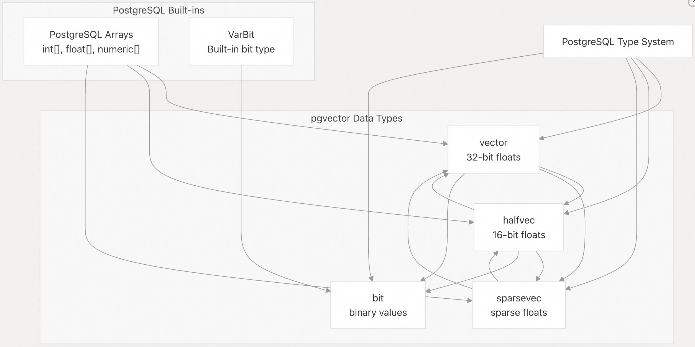
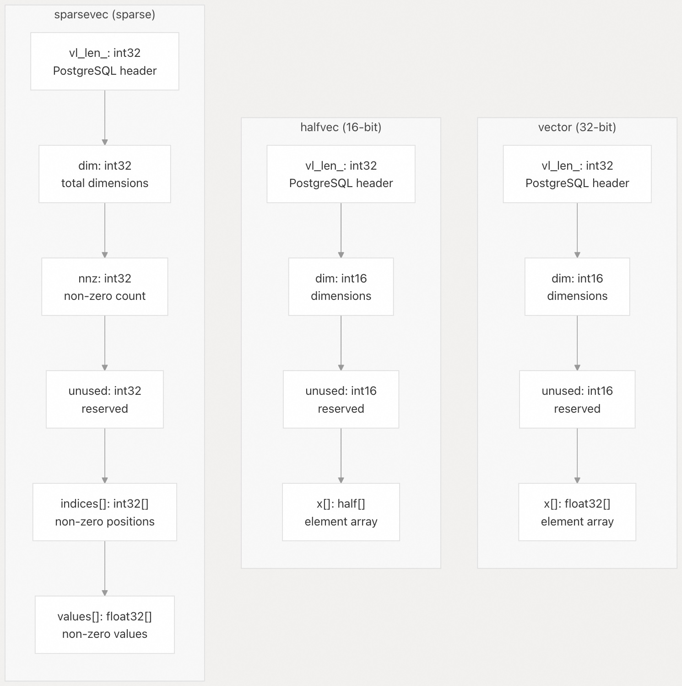
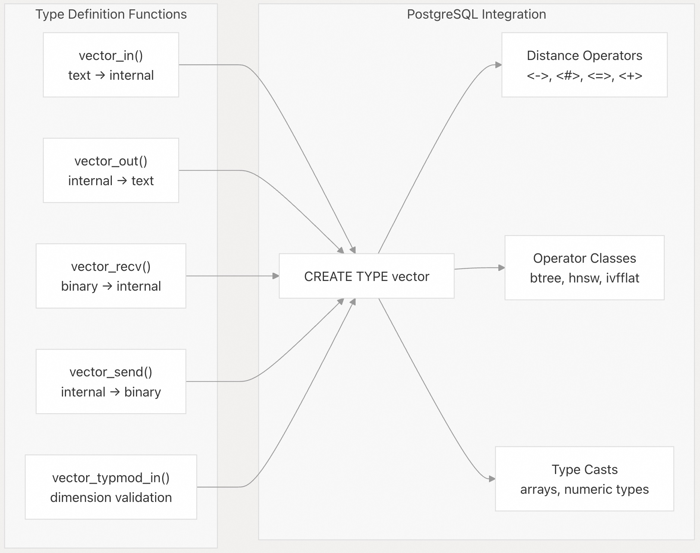
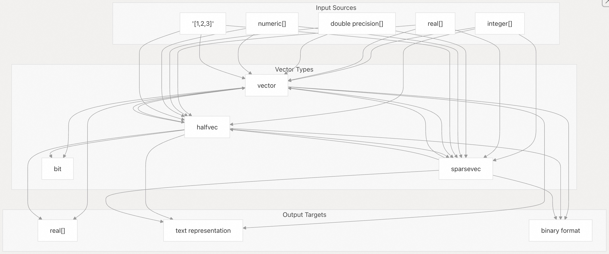
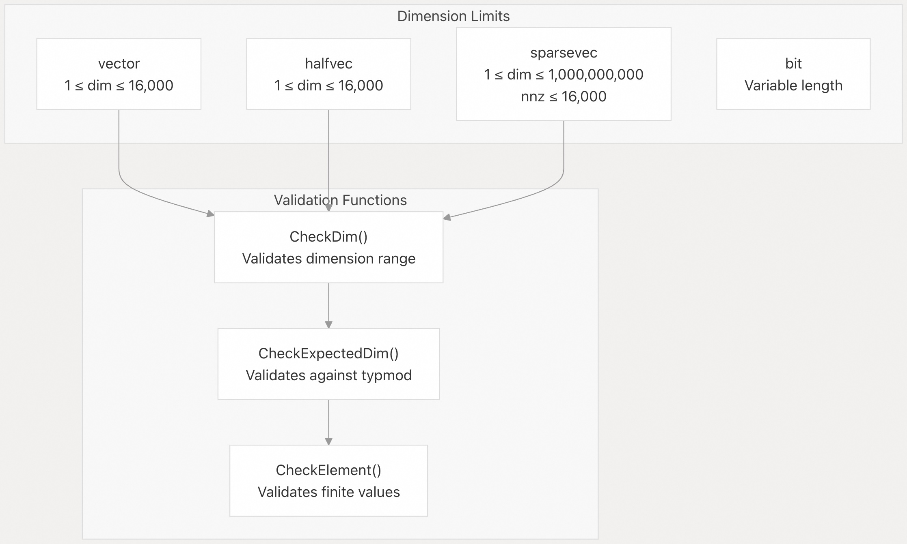

## pgvector 源码学习: 2 向量数据类型（`Vector Data Types`）  
                                            
### 作者                                            
digoal                                            
                                            
### 日期                                            
2025-11-03                                            
                                            
### 标签                                            
pgvector , 源码学习                                            
                                            
----                                            
                                            
## 背景                                            
本文详细介绍 `pgvector` 支持的4种**向量数据类型**（`vector data types`）及其**内部结构**（`internal structures`）、**内存布局**（`memory layouts`）和**类型系统集成**（`type system integration`）。这些数据类型构成了 PostgreSQL 中**向量相似性搜索**（`vector similarity search`）操作和**索引**（`indexing`）的基础。  
  
### 数据类型概述（`Data Type Overview`）  
  
`pgvector` 提供了四种不同的**向量数据类型**（`vector data types`），每种都针对不同的用例和内存要求进行了优化：  
  
| 类型（`Type`） | 元素大小（`Element Size`） | 最大维度（`Max Dimensions`） | 主要用例（`Primary Use Case`） |  
| :--- | :--- | :--- | :--- |  
| `vector` | 32 位浮点数（`32-bit float`） | 16,000 | 通用**密集向量**（`General-purpose dense vectors`） |  
| `halfvec` | 16 位半精度浮点数（`16-bit half-float`） | 16,000 | **内存高效的密集向量**（`Memory-efficient dense vectors`） |  
| `sparsevec` | 32 位浮点数（`32-bit float`） | 1,000,000,000 (注意不是指非零元素个数) | **高维稀疏向量**（`High-dimensional sparse vectors`） |  
| `bit` | 1 位二进制（`1-bit binary`） | 可变（`Variable`） | **二进制量化向量**（`Binary quantized vectors`） |  
  
#### 类型层次结构和关系（`Type Hierarchy and Relationships`）  
  
    
  
来源:  
[`src/vector.h` 11-17](https://github.com/pgvector/pgvector/blob/d823c445/src/vector.h#L11-L17)  
[`src/halfvec.h` 60-66](https://github.com/pgvector/pgvector/blob/d823c445/src/halfvec.h#L60-L66)  
[`src/sparsevec.h` 15-22](https://github.com/pgvector/pgvector/blob/d823c445/src/sparsevec.h#L15-L22)  
[`sql/vector.sql` 6-30](https://github.com/pgvector/pgvector/blob/d823c445/sql/vector.sql#L6-L30)  
  
### 内部内存布局（`Internal Memory Layouts`）  
  
每种向量类型都使用 PostgreSQL 的 `varlena` **结构**（`structure`）来存储**可变长度数据**（`variable-length data`），并采用特定于类型的布局进行**元素存储**（`element storage`）：  
  
#### 密集&稀疏向量内存布局比较（`Dense & Sparse Vector Memory Layout Comparison`）  
  
    
  
来源:  
[`src/vector.h` 11-17](https://github.com/pgvector/pgvector/blob/d823c445/src/vector.h#L11-L17)  
[`src/halfvec.h` 60-66](https://github.com/pgvector/pgvector/blob/d823c445/src/halfvec.h#L60-L66)  
[`src/sparsevec.h` 15-36](https://github.com/pgvector/pgvector/blob/d823c445/src/sparsevec.h#L15-L36)  
  
#### 内存大小计算（`Memory Size Calculations`）  
  
每种类型的**内存占用**（`memory footprint`）由特定的**大小计算宏**（`size calculation macros`）确定：  
  
* **vector**: `VECTOR_SIZE(dim) = offsetof(Vector, x) + sizeof(float) * dim`  
* **halfvec**: `HALFVEC_SIZE(dim) = offsetof(HalfVector, x) + sizeof(half) * dim`  
* **sparsevec**: `SPARSEVEC_SIZE(nnz) = offsetof(SparseVector, indices) + (nnz * sizeof(int32)) + (nnz * sizeof(float))`  
  
来源:  
[`src/vector.h` 6](https://github.com/pgvector/pgvector/blob/d823c445/src/vector.h#L6-L6)  
[`src/halfvec.h` 55](https://github.com/pgvector/pgvector/blob/d823c445/src/halfvec.h#L55-L55)  
[`src/sparsevec.h` 26-30](https://github.com/pgvector/pgvector/blob/d823c445/src/sparsevec.h#L26-L30)  
  
### PostgreSQL 类型系统集成（`PostgreSQL Type System Integration`）  
  
`pgvector` 通过标准的**类型定义函数**（`type definition functions`）和**运算符类**（`operator classes`）与 PostgreSQL 的类型系统集成：  
  
#### 类型定义结构（`Type Definition Structure`）  
  
    
  
来源:  
[`sql/vector.sql` 6-30](https://github.com/pgvector/pgvector/blob/d823c445/sql/vector.sql#L6-L30)  
[`src/vector.c` 165-270](https://github.com/pgvector/pgvector/blob/d823c445/src/vector.c#L165-L270)  
[`src/vector.c` 331-357](https://github.com/pgvector/pgvector/blob/d823c445/src/vector.c#L331-L357)  
  
### 类型转换和类型转换（`Type Conversions and Casting`）  
  
`pgvector` 提供了**向量类型**（`vector types`）和 PostgreSQL **内置类型**（`built-in types`）之间的全面类型转换能力：  
  
#### 转换路径（`Conversion Pathways`）  
  
    
  
来源:  
[`sql/vector.sql` 132-171](https://github.com/pgvector/pgvector/blob/d823c445/sql/vector.sql#L132-L171)  
[`src/vector.c` 432-501](https://github.com/pgvector/pgvector/blob/d823c445/src/vector.c#L432-L501)  
[`src/halfvec.c` 425-494](https://github.com/pgvector/pgvector/blob/d823c445/src/halfvec.c#L425-L494)  
  
#### 类型转换（`Cast Types`）及其行为（`Behavior`）  
  
`pgvector` 为各种转换场景定义了不同的**类型转换**（`cast types`）：  
  
| 从类型（`From Type`） | 到类型（`To Type`） | 转换类型（`Cast Type`） | 函数（`Function`） |  
| :--- | :--- | :--- | :--- |  
| `integer[]` | `vector` | **赋值**（`ASSIGNMENT`） | `array_to_vector` |  
| `vector` | `halfvec` | **隐式**（`IMPLICIT`） | `vector_to_halfvec` |  
| `halfvec` | `vector` | **赋值**（`ASSIGNMENT`） | `halfvec_to_vector` |  
| `vector` | `sparsevec` | **隐式**（`IMPLICIT`） | `vector_to_sparsevec` |  
| `vector` | `bit` | **显式**（`EXPLICIT`） | `binary_quantize` |  
  
来源:  
[`sql/vector.sql` 154-171](https://github.com/pgvector/pgvector/blob/d823c445/sql/vector.sql#L154-L171)  
[`sql/vector.sql` 490-512](https://github.com/pgvector/pgvector/blob/d823c445/sql/vector.sql#L490-L512)  
[`sql/vector.sql` 799-824](https://github.com/pgvector/pgvector/blob/d823c445/sql/vector.sql#L799-L824)  
  
### 维度约束（`Dimensional Constraints`）  
  
每种向量类型都通过**验证函数**（`validation functions`）来执行**维度约束**（`dimensional constraints`）：  
  
#### 约束定义（`Constraint Definitions`）  
  
    
  
来源:  
[`src/vector.h` 4](https://github.com/pgvector/pgvector/blob/d823c445/src/vector.h#L4-L4)  
[`src/halfvec.h` 53](https://github.com/pgvector/pgvector/blob/d823c445/src/halfvec.h#L53-L53)  
[`src/sparsevec.h` 4-5](https://github.com/pgvector/pgvector/blob/d823c445/src/sparsevec.h#L4-L5)  
[`src/vector.c` 84-96](https://github.com/pgvector/pgvector/blob/d823c445/src/vector.c#L84-L96)  
[`src/halfvec.c` 84-96](https://github.com/pgvector/pgvector/blob/d823c445/src/halfvec.c#L84-L96)  
  
#### 类型修饰符验证（`Type Modifier Validation`）  
  
向量类型支持 PostgreSQL 的**类型修饰符**（`type modifiers`）用于指定维度：  
  
* `vector(1536)` - 将 `vector` 约束为恰好 1536 个维度  
* `halfvec(512)` - 将 `halfvec` 约束为 512 个维度  
* `sparsevec(10000)` - 约束 `sparsevec` 的总维度  
  
`typmod_in` 函数在类型创建和**类型转换**（`casting`）操作期间验证这些约束。  
  
来源:  
[`src/vector.c` 331-357](https://github.com/pgvector/pgvector/blob/d823c445/src/vector.c#L331-L357)  
[`src/halfvec.c` 325-351](https://github.com/pgvector/pgvector/blob/d823c445/src/halfvec.c#L325-L351)  
[`sql/vector.sql` 14-16](https://github.com/pgvector/pgvector/blob/d823c445/sql/vector.sql#L14-L16)  
  
### 元素验证和约束（`Element Validation and Constraints`）  
  
所有向量类型都执行**元素级约束**（`element-level constraints`）以确保**数学有效性**（`mathematical validity`）：  
  
#### 值约束（`Value Constraints`）  
  
* **仅限有限值**（`Finite Values Only`）：拒绝 **NaN**（非数字）和**无限值**（`infinite values`）  
* **类型特定范围**（`Type-Specific Ranges`）：每种类型都强制执行其**数值范围限制**（`numeric range limits`）  
* **溢出检测**（`Overflow Detection`）：算术运算会检查**溢出条件**（`overflow conditions`）  
  
每个实现中的 `CheckElement` 函数在**输入处理**（`input processing`）和**数学运算**（`mathematical operations`）期间验证这些约束。  
  
来源:  
[`src/vector.c` 101-113](https://github.com/pgvector/pgvector/blob/d823c445/src/vector.c#L101-L113)  
[`src/halfvec.c` 101-113](https://github.com/pgvector/pgvector/blob/d823c445/src/halfvec.c#L101-L113)  
[`src/vector.c` 231](https://github.com/pgvector/pgvector/blob/d823c445/src/vector.c#L231-L231)  
[`src/halfvec.c` 232](https://github.com/pgvector/pgvector/blob/d823c445/src/halfvec.c#L232-L232)  
  
# 附录1: `sparsevec` 类型的最大维度限制  
`sparsevec` 类型最大支持 **1,000,000,000 (10亿) 维度**。   
  
这个限制在代码中定义为常量 `SPARSEVEC_MAX_DIM`。   
  
当您尝试创建超过此限制的稀疏向量时,系统会抛出错误。 验证逻辑在 `CheckDim()` 函数中实现,该函数在输入解析时被调用。   
  
测试用例也验证了这个限制.   
  
## 其他相关限制  
  
除了维度限制,`sparsevec` 还有以下约束:  
- **最大非零元素数**: 16,000 个   
- **最小维度**: 1    
  
对于 HNSW 索引, 非零元素数的限制可能更严格。   
  
## Notes  
  
相比之下,密集向量类型 `vector` 和 `halfvec` 的最大维度限制要小得多(分别为 2,000 和 4,000 维)。 `sparsevec` 的高维度限制是因为它只存储非零元素,所以即使维度很大,只要非零元素不超过 16,000 个,存储空间仍然可控。   
  
# 附录2: 对比pgvector中的稀疏向量和pg_roaringbitmap中的roaringbitmap数据类型和使用场景  
  
## 稀疏向量（`sparsevec`） vs. Roaring Bitmaps（`roaringbitmap`）  
  
### 📊 数据类型和核心功能对比  
  
| 特性（`Feature`） | `pgvector` 中的 `sparsevec` | `pg_roaringbitmap` 中的 `roaringbitmap` |  
| :--- | :--- | :--- |  
| **数据类型** | **稀疏向量**（`Sparse Vector`） | **压缩位图**（`Compressed Bitmap`） |  
| **存储内容** | 存储**稀疏的浮点数值**（`sparse float values`），即维度索引（`index`）和对应的非零值（`value`）。 | 存储**一组有序的非负整数**（`set of non-negative integers`）。 |  
| **核心目的** | **向量相似性搜索**（`Vector Similarity Search`），计算高维稀疏数据之间的距离。 | **集合运算**（`Set Operations`）和**快速计数/聚合**（`Fast Counting/Aggregation`）。 |  
| **主要操作** | **距离计算**（`Distance`）：内积（`Inner Product`）、余弦距离（`Cosine Distance`）、L2 距离等。 | **集合逻辑运算**：`OR` (并集)、`AND` (交集)、`XOR` (异或)、`ANDNOT` (差集)；**基数计算**（`Cardinality`）。 |  
| **索引支持** | 支持 **HNSW**、**IVFFlat**（用于近似最近邻搜索）。 | 通常用于**快速聚合**或作为**倒排索引**（`Inverted Index`）的构建块。 |  
| **元素类型** | 32 位浮点数（`32-bit float`）。 | 非负整数（通常是 32 位）。 |  
| **最大维度/元素** | 维度上限非常高（$\sim 10^9$），但限制非零元素数量（例如，`pgvector` 限制为 1,000 个非零元素）。 | 可存储任意数量的非负整数（集合大小理论上不受限）。 |  
  
### 💡 典型使用场景对比  
  
| 场景（`Use Case`） | `pgvector` 中的 `sparsevec` | `pg_roaringbitmap` 中的 `roaringbitmap` |  
| :--- | :--- | :--- |  
| **信息检索 (IR)** | **传统 IR 模型**（如 TF-IDF 或 BM25）生成的**词袋模型**（`Bag-of-Words`）特征向量。 | **倒排索引**（`Inverted Index`）中存储包含特定词汇的**文档 ID 集合**。 |  
| **推荐系统** | **用户-物品交互矩阵**（`User-Item Interaction Matrix`）中的稀疏特征，用于**基于内容的推荐**。 | **用户画像**（`User Profiling`）中的**标签集合**或**权限集合**，快速进行用户分组和筛选。 |  
| **相似性搜索** | 在稀疏特征空间中查找**近似最近邻**（`Approximate Nearest Neighbors`）。 | **无法直接用于向量相似性搜索**。主要用于**集合相似性**（如 Jaccard 相似度）的快速集合操作。 |  
| **数据聚合/分析** | **不适用于聚合**，其核心用途是相似性搜索。 | **快速交叉查询**（`Faceted Search`）中的**筛选和计数**。例如，计算同时购买了 A 和 B 商品的用户数量。 |  
| **特征表示** | **机器学习特征**，表示具有许多零值的高维数据点。 | **数据库索引**或**权限/状态标志**，表示一个实体（如用户）拥有的离散 ID 集合。 |  
  
### 总结  
  
这两者虽然都处理**稀疏性**（`Sparsity`），但服务于完全不同的目的：  
  
1.  **`sparsevec` (pgvector)**：关注**相似性**和**数值距离**。它的目的是将稀疏特征用于 **AI/ML 驱动的搜索和推荐**，并利用 HNSW/IVFFlat 等索引技术实现高效的**近似最近邻搜索**。  
2.  **`roaringbitmap` (pg\_roaringbitmap)**：关注**集合**和**布尔逻辑**。它的目的是利用其极致的**压缩率**和**高速集合运算**，解决**多维度筛选**、**标签聚合**和**快速计数**等传统数据分析和索引问题。  
  
如果您需要进行语义搜索或基于特征向量的匹配，请使用 **`sparsevec`**；如果您需要对大量离散 ID 集合进行快速的**交集/并集/计数**操作，请使用 **`roaringbitmap`**。  
  
# 附录3: roaringbitmap可以高速计算汉明距离吗  
`roaringbitmap` 可以用来 **计算** 汉明距离（`Hamming Distance`），并且由于其高效的实现，**计算速度会非常快**。  
  
## 🚀 Roaring Bitmap 与汉明距离  
  
汉明距离（`Hamming Distance`）的数学定义是：在两个等长二进制串（或向量）中，对应位置不同的位数。  
  
$$\text{Hamming Distance}(A, B) = \text{Population Count}(A \oplus B)$$  
  
其中：  
* $A$ 和 $B$ 是两个二进制串。  
* $\oplus$ 是**位异或运算**（`Bitwise XOR`）。  
* $\text{Population Count}$（ 或 $\text{Popcount}$ / **位集计数** ）是计算结果中“1”的个数。  
  
### `pg_roaringbitmap` 的实现方式  
  
`pg_roaringbitmap` 的数据类型本质上就是**高效压缩的整数集合**，可以将其视为一个**超大的稀疏二进制向量**，其中集合中的数字代表二进制向量中“1”的索引位置。  
  
要使用 `pg_roaringbitmap` 计算汉明距离，需要使用它提供的**集合逻辑运算**和**基数计算**功能：  
  
1.  **位异或（XOR）**：  
    `roaringbitmap` 扩展提供了 `rb_xor(bitmap1, bitmap2)` 或 `roaringbitmap1 # roaringbitmap2` 运算符，用于计算两个位图的**对称差集**（`Symmetric Difference`），这在逻辑上等同于两个二进制串的**位异或（XOR）**操作。  
    $$A \oplus B = (A \cup B) \setminus (A \cap B)$$  
  
2.  **位集计数（Population Count / Cardinality）**：  
    `roaringbitmap` 扩展提供了 `rb_cardinality(bitmap)` 函数，用于快速计算位图中元素的数量，这等同于计算异或结果中“1”的个数。  
  
#### 计算步骤和函数：  
  
在 PostgreSQL 中，计算两个 `roaringbitmap` 的汉明距离的 SQL 表达式如下：  
  
$$\text{Hamming Distance}(A, B) = \text{rb\_xor\_cardinality}(A, B)$$  
  
或者，通过两个步骤：  
  
```sql  
SELECT rb_cardinality(roaringbitmap_A # roaringbitmap_B);  
```  
  
### 高速的原因  
  
`roaringbitmap` 之所以能**高速**计算，是因为它将底层的逻辑运算（如 XOR）和基数计算（Cardinality）委托给高度优化的 **CRoaring 库**，该库利用了：  
  
1.  **分块压缩存储**：只存储非零的位（即集合中的整数），而不是完整的、巨大的二进制串。  
2.  **SIMD 指令集**：在进行位图的逻辑运算（XOR）和 $\text{Popcount}$ 时，`CRoaring` 库会使用 CPU 的 **SIMD**（`Single Instruction, Multiple Data`，单指令多数据）指令集进行**并行计算**，从而在底层极大地加速了计算过程。  
  
### 与 `pgvector` 的对比  
  
虽然 `pgvector` 的 `bit` 类型也支持汉明距离（`<~>` 运算符），但 `pgvector` 的 `bit` 类型通常用于处理**等长且不太稀疏**的二进制向量（例如，最大维度 64,000）。  
  
相比之下，`pg_roaringbitmap` 更适合处理：  
* **极度稀疏**（大部分位置为 0）。  
* **理论上维度可以非常大**（因为它只存储非零位的索引）。  
  
因此，对于由**大量、稀疏的二值化特征**构成的“向量”，`pg_roaringbitmap` 是一个计算汉明距离的极佳选择。  
  
# 附录3: sparsevec VS RoaringBitmap  
您询问的是 pgvector 中的**稀疏向量类型 (`sparsevec`)** 与 **RoaringBitmap** 的对比。   
  
需要明确的是:pgvector 代码库中**没有实现 RoaringBitmap**。 pgvector 只实现了以下数据类型:    
  
- `vector` (密集向量,float32)  
- `halfvec` (半精度向量,float16)    
- `bit` (二值向量)  
- `sparsevec` (稀疏向量,float32)  
  
## 稀疏向量 (sparsevec) 的实现  
  
`sparsevec` 使用**压缩稀疏行 (CSR) 格式**存储:    
  
**存储结构:**  
- 索引数组 (int32[],0-based,升序排列)  
- 值数组 (float[])  
- 只存储非零元素  
  
**存储开销:** `16 + 8×nnz` 字节,其中 nnz 是非零元素数量    
  
**限制条件:** [4](#0-3)   
- 最大维度: 10亿  
- 最大非零元素: 16,000  
  
**支持的操作:** [5](#0-4)   
- L2 距离 (`<->`)  
- 内积 (`<#>`)  
- 余弦距离 (`<=>`)  
- L1 距离 (`<+>`)  
  
## 与 RoaringBitmap 的概念对比  
  
虽然 pgvector 没有实现 RoaringBitmap,但可以从概念上对比:  
  
| 特性 | sparsevec | RoaringBitmap (概念) |  
|------|-----------|---------------------|  
| **数据类型** | 浮点数 (float32) | 布尔值 (bit) |  
| **存储格式** | CSR (索引+值) | 压缩位图 |  
| **用途** | 稀疏向量相似度搜索 | 集合运算、位图索引 |  
| **压缩策略** | 只存非零值 | 自适应压缩(数组/位图/游程) |  
| **支持操作** | 向量距离计算 | 集合交并差、位运算 |  
  
pgvector 中最接近位图的类型是 `bit`, 但它是 **固定长度的位串** , 不是压缩位图.   
  
## Notes  
  
如果您需要在 PostgreSQL 中使用 RoaringBitmap, 应该查看专门的 RoaringBitmap 扩展(如 `pg_roaringbitmap`), 而不是 pgvector。pgvector 的 `sparsevec` 专注于 **稀疏浮点向量的相似度搜索** , 而 RoaringBitmap 专注于 **高效的集合运算和位图索引** , 两者解决的是不同的问题领域。   
           
#### [期望 PostgreSQL|开源PolarDB 增加什么功能?](https://github.com/digoal/blog/issues/76 "269ac3d1c492e938c0191101c7238216")
  
  
#### [PolarDB 开源数据库](https://openpolardb.com/home "57258f76c37864c6e6d23383d05714ea")
  
  
#### [PolarDB 学习图谱](https://www.aliyun.com/database/openpolardb/activity "8642f60e04ed0c814bf9cb9677976bd4")
  
  
#### [PostgreSQL 解决方案集合](../201706/20170601_02.md "40cff096e9ed7122c512b35d8561d9c8")
  
  
#### [德哥 / digoal's Github - 公益是一辈子的事.](https://github.com/digoal/blog/blob/master/README.md "22709685feb7cab07d30f30387f0a9ae")
  
  
#### [About 德哥](https://github.com/digoal/blog/blob/master/me/readme.md "a37735981e7704886ffd590565582dd0")
  
  

  
