## pgvector 源码学习: 2.1 `vector` 类型  
                                              
### 作者                                              
digoal                                              
                                              
### 日期                                              
2025-11-03                                              
                                              
### 标签                                              
pgvector , 源码学习                                              
                                              
----                                              
                                              
## 背景                                              
`vector` 类型是 **pgvector** 中用于存储带有单精度 (32 位) 浮点元素**的稠密向量** (`dense vectors`) 的主要数据类型。它为向量相似性搜索操作提供了规范的表示，并且是该扩展的**近似最近邻** (`approximate nearest neighbor`) 索引能力的基础。  
  
本文涵盖了 `vector` 类型的内部表示 (`Internal Representation`)、I/O 函数、类型转换、操作和特定函数。  
  
## 内部表示 (`Internal Representation`)  
  
### 内存布局 (`Memory Layout`)  
  
`vector` 类型被实现为 **PostgreSQL** 的 `varlena` 类型，其结构如下：  
  
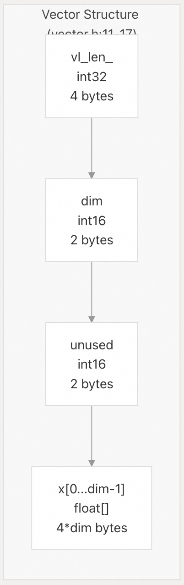    
  
来源:  
[`src/vector.h` 11-17](https://github.com/pgvector/pgvector/blob/d823c445/src/vector.h#L11-L17)  
  
| 字段 (`Field`) | 类型 (`Type`) | 大小 (`Size`) | 描述 (`Description`) |  
| :--- | :--- | :--- | :--- |  
| `vl_len_` | `int32` | 4 字节 | 包含整个结构总大小的 `Varlena header` (可变长度头部) |  
| `dim` | `int16` | 2 字节 | 维度数 (1 到 16,000) |  
| `unused` | `int16` | 2 字节 | 保留供将来使用，始终为零 |  
| `x` | `float[]` | `4 × dim` 字节 | **单精度浮点元素** (`single-precision float elements`) 数组 |  
  
**总大小**: `4 * dimensions + 8` 字节  
  
### 维度约束 (`Dimension Constraints`)  
  
  * **最小维度**: 1  
  * **最大维度**: 16,000 (`VECTOR_MAX_DIM`)  
  * **最大索引维度**: 2,000 (`HNSW` 和 `IVFFlat` 索引)    
  
备注: 为什么索引维度比类型最大可存储维度更小? 主要考虑到索引的存储结构, 索引如果是双向链表, 那么一个页面最少要能存3个向量才有意义. 再扣掉其他的头信息等, 一般被索引的值不能超过数据库BlockSize的四分之一.  
  
为什么类型有长度限制? 除了类型本身的值边界, 同样也考虑到存储结构. 例如页内存储的最大值就是不能超过页大小. 如果是变长类型TOAST存储, 则取决于PG的硬编码, 最大的值在压缩后不超过1GB.    
  
来源:  
[`src/vector.h` 4](https://github.com/pgvector/pgvector/blob/d823c445/src/vector.h#L4-L4) [`src/vector.c` 85-96](https://github.com/pgvector/pgvector/blob/d823c445/src/vector.c#L85-L96)  
  
### 元素约束 (`Element Constraints`)  
  
所有向量元素必须是有限的单精度浮点值：  
  
  * 非数 (`Not a Number`, `NaN`)  
  * 无无穷大 (`Infinity`)  
  * 无负无穷大 (`-Infinity`)  
  
这些约束在输入解析、二进制接收和数组转换期间强制执行。  
  
来源:  
[`src/vector.c` 99-113](https://github.com/pgvector/pgvector/blob/d823c445/src/vector.c#L99-L113)  
  
## 输入/输出函数 (`Input/Output Functions`)  
  
### 文本表示 (`Textual Representation`)  
  
#### 输入格式 (`vector_in`)  
  
`vector_in` 函数将文本表示转换为内部格式。向量表示为方括号中包含的**逗号分隔值** (`comma-separated values`)：  
  
```  
[1.5, 2.0, 3.5]  
```  
  
**解析过程的关键特性**:  
  
  * 使用 `strtof()` 进行解析 (匹配 **PostgreSQL** 的 `float4in` 行为)  
  * 元素和分隔符周围允许有**空格** (`Whitespace`)  
  * 检查溢出/下溢的**范围检查** (`Range checking`)  
  * 针对类型修饰符的**维度验证** (`Dimension validation`)  
  
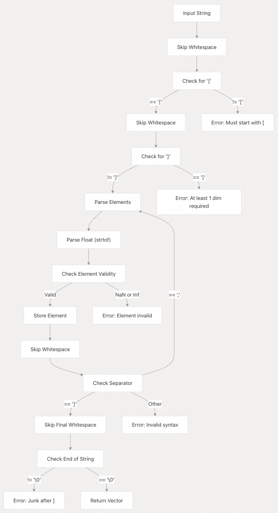    
  
来源:  
[`src/vector.c` 165-270](https://github.com/pgvector/pgvector/blob/d823c445/src/vector.c#L165-L270)  
  
#### 输出格式 (`vector_out`)  
  
`vector_out` 函数使用**最短十进制表示**将内部表示转换为文本格式。  
  
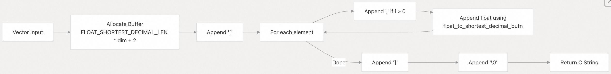    
  
来源:  
[`src/vector.c` 278-315](https://github.com/pgvector/pgvector/blob/d823c445/src/vector.c#L278-L315)  
  
### 二进制表示 (`Binary Representation`)  
  
#### 二进制输入 (`vector_recv`)  
  
二进制格式使用 **PostgreSQL** 的**二进制协议** (`binary protocol`)：  
  
| 偏移量 (`Offset`) | 字段 (`Field`) | 类型 (`Type`) | 描述 (`Description`) |  
| :--- | :--- | :--- | :--- |  
| 0 | `dim` | `int16` | 维度数 |  
| 2 | `unused` | `int16` | 保留 (必须为 0) |  
| 4 | `x[0]` | `float4` | 第一个元素 |  
| 8 | `x[1]` | `float4` | 第二个元素 |  
| ... | ... | ... | ... |  
  
来源:  
[`src/vector.c` 363-392](https://github.com/pgvector/pgvector/blob/d823c445/src/vector.c#L363-L392)  
  
#### 二进制输出 (`vector_send`)  
  
以相同的二进制格式序列化向量，用于 `COPY BINARY` 操作和网络传输。  
  
来源:  
[`src/vector.c` 397-411](https://github.com/pgvector/pgvector/blob/d823c445/src/vector.c#L397-L411)  
  
## 类型修饰符 (`Type Modifiers`)  
  
**类型修饰符**允许在创建表时指定预期的维度数：  
  
```  
CREATE TABLE items (embedding vector(3));  
```  
  
### 类型修饰符函数  
  
    
  
来源:  
[`src/vector.c` 332-358](https://github.com/pgvector/pgvector/blob/d823c445/src/vector.c#L332-L358) [`src/vector.c` 417-427](https://github.com/pgvector/pgvector/blob/d823c445/src/vector.c#L417-L427)  
  
## 类型转换与造型 (`Type Conversions and Casts`)  
  
### 数组到向量的转换 (`Array to Vector Conversions`)  
  
`vector` 类型支持从 **PostgreSQL** 数组类型自动转换：  
  
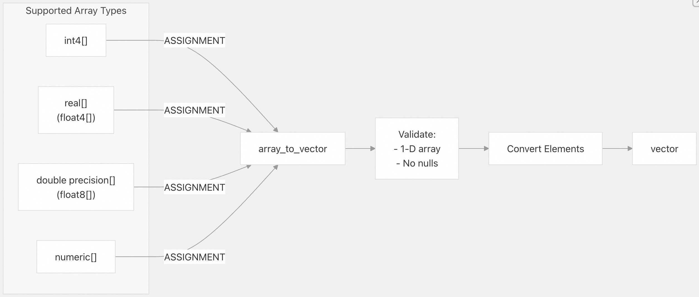    
  
**实现细节**:  
  
  * 验证数组是 1 维的  
  * 检查是否存在空值 (`null values`) (不允许)  
  * 将每个元素转换为 `float` (单精度)  
  * 对于 `numeric[]`，通过 `numeric_float4()` 转换  
  * 转换后验证所有元素都是有限的  
  
来源:  
[`src/vector.c` 432-501](https://github.com/pgvector/pgvector/blob/d823c445/src/vector.c#L432-L501) [`sql/vector.sql` 160-170](https://github.com/pgvector/pgvector/blob/d823c445/sql/vector.sql#L160-L170)  
  
### 向量到数组的转换 (`Vector to Array Conversion`)  
  
`vector_to_float4` 函数提供反向转换：  
  
```  
SELECT embedding::real[] FROM items;  
```  
  
转换类型(Cast type): `IMPLICIT` (隐式，自动)  
  
来源:  
[`src/vector.c` 506-525](https://github.com/pgvector/pgvector/blob/d823c445/src/vector.c#L506-L525) [`sql/vector.sql` 157-158](https://github.com/pgvector/pgvector/blob/d823c445/sql/vector.sql#L157-L158)  
  
### 跨类型向量转换 (`Cross-Type Vector Conversions`)  
  
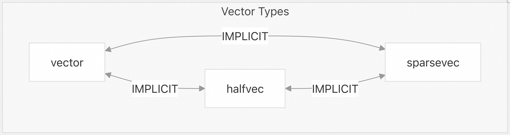    
  
**转换函数**:  
  
  * `halfvec_to_vector`: 将半精度转换为单精度  
  * `vector_to_halfvec`: 将单精度转换为半精度 (`IMPLICIT`)  
  * `vector_to_sparsevec`: 将稠密转换为稀疏 (`IMPLICIT`)  
  * `sparsevec_to_vector`: 将稀疏转换为稠密 (`ASSIGNMENT`)  
  
来源:  
[`src/vector.c` 530-547](https://github.com/pgvector/pgvector/blob/d823c445/src/vector.c#L530-L547) [`sql/vector.sql` 154-498](https://github.com/pgvector/pgvector/blob/d823c445/sql/vector.sql#L154-L498)  
  
## 距离运算符与函数 (`Distance Operators and Functions`)  
  
### 核心距离运算符 (`Core Distance Operators`)  
  
`vector` 类型支持四种主要的距离运算符：  
  
| 运算符 (`Operator`) | 距离指标 (`Distance Metric`) | 函数 (`Function`) | 返回类型 (`Return Type`) |  
| :--- | :--- | :--- | :--- |  
| `<->` | L2 (欧几里得, `Euclidean`) | `l2_distance` | `float8` |  
| `<#>` | 负内积 (`Negative inner product`) | `vector_negative_inner_product` | `float8` |  
| `<=>` | 余弦距离 (`Cosine distance`) | `cosine_distance` | `float8` |  
| `<+>` | L1 (曼哈顿/出租车, `Manhattan/Taxicab`) | `l1_distance` | `float8` |  
  
来源:  
[`sql/vector.sql` 174-192](https://github.com/pgvector/pgvector/blob/d823c445/sql/vector.sql#L174-L192)  
  
### 距离函数实现 (`Distance Function Implementations`)  
  
#### L2 距离 (`L2 Distance`)  
  
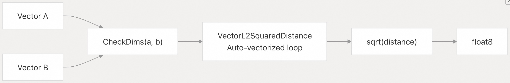    
  
**实现**: 在支持的平台上使用 `target_clones` 属性进行 `FMA` (Fused Multiply-Add，融合乘加) 优化。  
  
来源:  
[`src/vector.c` 549-578](https://github.com/pgvector/pgvector/blob/d823c445/src/vector.c#L549-L578)  
  
#### 内积 (`Inner Product`)  
  
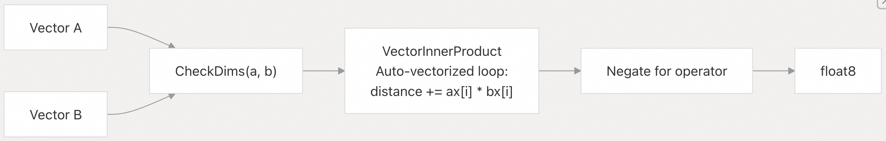    
  
**注意**: `<#>` 运算符返回**负内积** (`negative inner product`)，因为 **PostgreSQL** 仅支持索引扫描的升序 (`ascending order`)。  
  
来源:  
[`src/vector.c` 596-636](https://github.com/pgvector/pgvector/blob/d823c445/src/vector.c#L596-L636)  
  
#### 余弦距离 (`Cosine Distance`)  
  
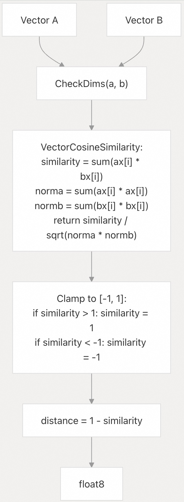    
  
来源:  
[`src/vector.c` 638-685](https://github.com/pgvector/pgvector/blob/d823c445/src/vector.c#L638-L685)  
  
#### L1 距离 (`L1 Distance`)  
  
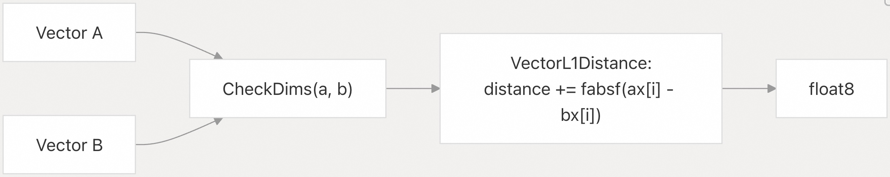    
  
来源:  
[`src/vector.c` 714-739](https://github.com/pgvector/pgvector/blob/d823c445/src/vector.c#L714-L739)  
  
## 算术运算 (`Arithmetic Operations`)  
  
### 逐元素运算符 (`Element-wise Operators`)  
  
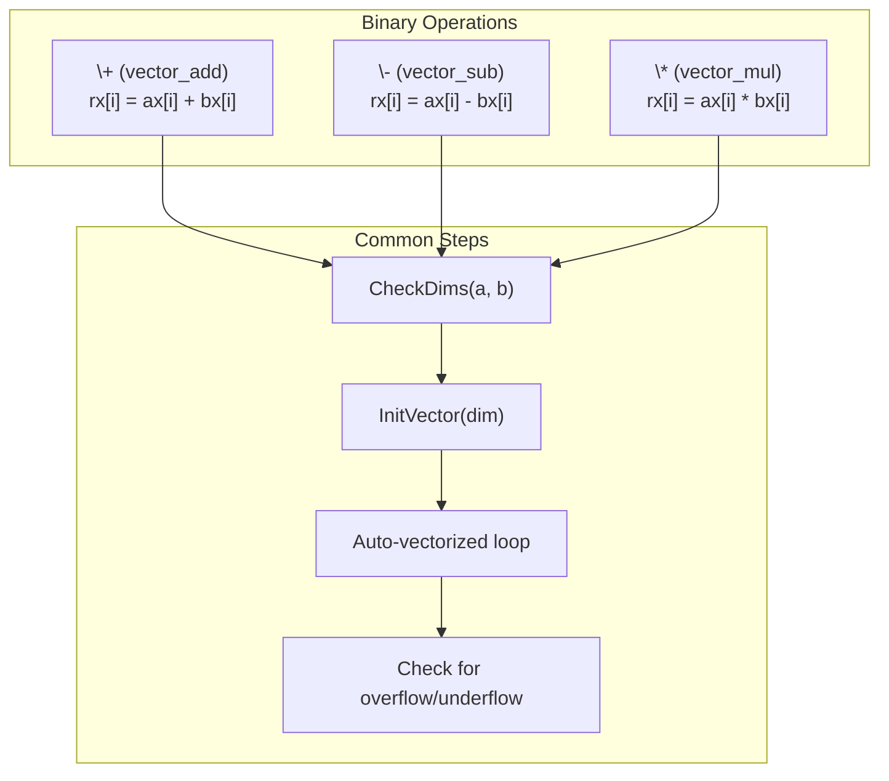
  
| 运算符 (`Operator`) | 函数 (`Function`) | 描述 (`Description`) |  
| :--- | :--- | :--- |  
| `+` | `vector_add` | 向量加法 |  
| `-` | `vector_sub` | 向量减法 |  
| `*` | `vector_mul` | 逐元素乘法 (`Element-wise multiplication`) |  
| `/` | `vector_div` | 逐元素除法 (`Element-wise division`) |  
| `-` | `vector_neg` | 向量取反 (一元运算符) |  
  
**溢出/下溢检测**:  
  
  * 加法/减法: 操作后检查 `isinf()`  
  * 乘法: 检查 `isinf()` (溢出) 和特殊的零处理 (下溢)  
  
来源:  
[`src/vector.c` 813-910](https://github.com/pgvector/pgvector/blob/d823c445/src/vector.c#L813-L910)  
  
### 向量连接 (`Vector Concatenation`)  
  
`||` 运算符连接两个向量：  
  
```  
SELECT '[1,2]'::vector || '[3,4]'::vector;  -- Returns [1,2,3,4]  
```  
  
**实现**:  
  
  * 验证总维度 ≤ 16,000  
  * 分配具有组合维度的新向量  
  * 复制来自两个源向量的元素  
  
来源:  
[`src/vector.c` 915-936](https://github.com/pgvector/pgvector/blob/d823c445/src/vector.c#L915-L936)  
  
## 实用函数 (`Utility Functions`)  
  
### 维度查询 (`Dimension Query`)  
```  
SELECT vector_dims(embedding) FROM items;  
```  
  
| 函数 (`Function`) | 返回类型 (`Return Type`) | 描述 (`Description`) |  
| :--- | :--- | :--- |  
| `array_dims(vector)` | `integer` | 返回维度数 |  
  
以 `integer` 形式返回维度数。  
  
来源:  
[`src/vector.c` 744-751](https://github.com/pgvector/pgvector/blob/d823c445/src/vector.c#L744-L751)  
  
### L2 范数 (`L2 Norm`)  
```  
SELECT vector_norm(embedding) FROM items;  
```  
  
| 函数 (`Function`) | 返回类型 (`Return Type`) | 描述 (`Description`) |  
| :--- | :--- | :--- |  
| `l2_norm(vector)` | `float8` | 计算欧几里得范数 ($\sqrt{\sum_{i=1}^{n} x_i^2}$) |  
  
计算欧几里得范数 (L2 范数): $\sqrt{\sum_{i=1}^{n} x_i^2}$  
  
来源:  
[`src/vector.c` 756-769](https://github.com/pgvector/pgvector/blob/d823c445/src/vector.c#L756-L769)  
  
### L2 归一化 (`L2 Normalization`)  
```  
SELECT l2_normalize(embedding) FROM items;  
```  
  
| 函数 (`Function`) | 返回类型 (`Return Type`) | 描述 (`Description`) |  
| :--- | :--- | :--- |  
| `l2_normalize(vector)` | `vector` | 将向量归一化为单位长度 (`unit length`) |  
  
将向量归一化为单位长度：  
  
  * 如果输入范数为零，则返回零向量  
  * 检查归一化值是否溢出  
  * 结果具有与输入相同的维度  
  
来源:  
[`src/vector.c` 774-808](https://github.com/pgvector/pgvector/blob/d823c445/src/vector.c#L774-L808)  
  
### 二进制量化 (`Binary Quantization`)  
```  
SELECT binary_quantize(embedding)::bit(3) FROM items;  
```  
  
| 函数 (`Function`) | 返回类型 (`Return Type`) | 描述 (`Description`) |  
| :--- | :--- | :--- |  
| `vector_to_bit(vector)` | `bit` | 将向量元素映射到 1 位 |  
  
将向量转换为二进制表示：  
  
  * 每个元素映射到 1 位: 如果 `> 0` 则为 `1`，否则为 `0`  
  * 返回 **PostgreSQL** `bit` 类型  
  * 用于内存高效的**近似搜索** (`approximate search`)  
  
来源:  
[`src/vector.c` 941-967](https://github.com/pgvector/pgvector/blob/d823c445/src/vector.c#L941-L967)  
  
### 子向量提取 (`Subvector Extraction`)  
```  
SELECT subvector(embedding, 1, 3) FROM items;  
```  
  
| 函数 (`Function`) | 返回类型 (`Return Type`) | 描述 (`Description`) |  
| :--- | :--- | :--- |  
| `slice(vector, start, count)` | `vector` | 提取连续的子向量 |  
  
提取连续的子向量：  
  
  * 使用 1-基于索引 (SQL 约定)  
  * 返回指定维度数的向量  
  * 处理边缘情况 (起始/计数验证)  
  
来源:  
[`src/vector.c` 972-1014](https://github.com/pgvector/pgvector/blob/d823c445/src/vector.c#L972-L1014)  
  
## 比较运算符 (`Comparison Operators`)  
  
### 比较语义 (`Comparison Semantics`)  
  
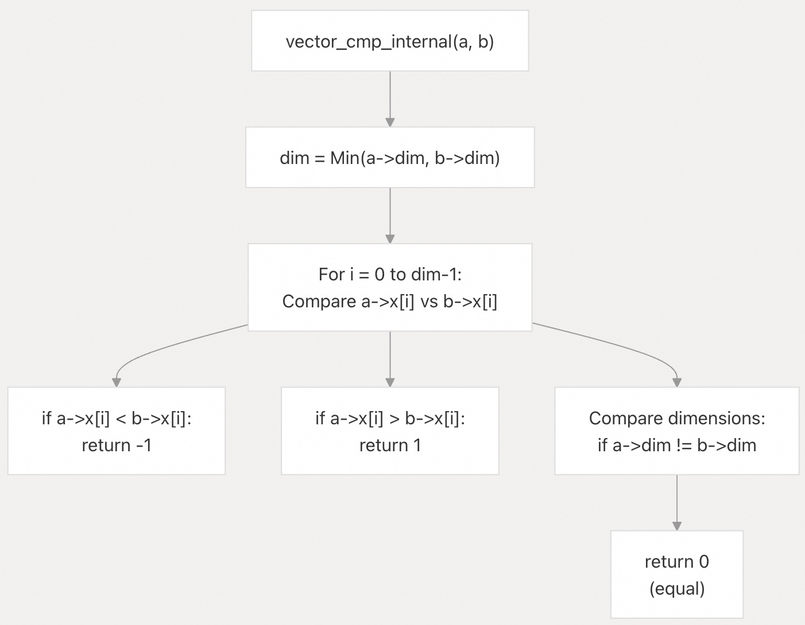    
  
| 运算符 (`Operator`) | 函数 (`Function`) |  
| :--- | :--- |  
| `<` | `vector_lt` |  
| `<=` | `vector_le` |  
| `=` | `vector_eq` |  
| `<>` | `vector_ne` |  
| `>=` | `vector_ge` |  
| `>` | `vector_gt` |  
  
**比较顺序**:  
  
1.  逐元素比较 (字典序, `lexicographic`)  
2.  如果所有比较的元素都相等，则较短的向量小于较长的向量  
  
**支持的运算符**:  
  
  * `<`, `<=`, `=`, `<>`, `>=`, `>`  
  * **B-树运算符类** (`B-tree operator class`) `vector_ops` (默认, `DEFAULT`)  
  
来源:  
[`src/vector.c` 1019-1132](https://github.com/pgvector/pgvector/blob/d823c445/src/vector.c#L1019-L1132) [`sql/vector.sql` 283-290](https://github.com/pgvector/pgvector/blob/d823c445/sql/vector.sql#L283-L290)  
  
## 聚合函数 (`Aggregate Functions`)  
  
### `AVG` 聚合 (`AVG Aggregate`)  
```  
SELECT AVG(embedding) FROM items;  
```  
  
| 函数 (`Function`) | 状态类型 (`State Type`) | 描述 (`Description`) |  
| :--- | :--- | :--- |  
| `AVG(vector)` | `double precision[]` | 计算向量平均值 |  
  
**实现架构**:  
  
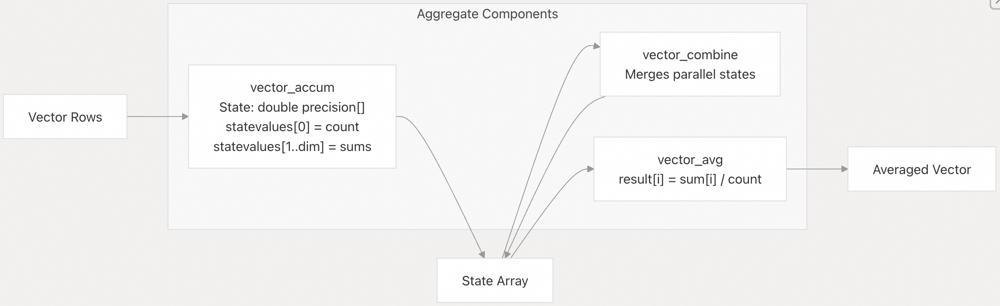    
  
**特性**:  
  * 使用 `double precision[]` 作为**中间状态** (`intermediate state`) 以避免精度损失  
  * 通过 `COMBINEFUNC` (组合函数) 支持**并行聚合** (`parallel aggregation`)  
  * 累加期间检查溢出  
  * 初始条件: `{0}` (计数为零)  
  
来源:  
[`src/vector.c` 1137-1302](https://github.com/pgvector/pgvector/blob/d823c445/src/vector.c#L1137-L1302) [`sql/vector.sql` 116-123](https://github.com/pgvector/pgvector/blob/d823c445/sql/vector.sql#L116-L123)  
  
### `SUM` 聚合 (`SUM Aggregate`)  
```  
SELECT SUM(embedding) FROM items;  
```  
  
| 函数 (`Function`) | 状态类型 (`State Type`) | 描述 (`Description`) |  
| :--- | :--- | :--- |  
| `SUM(vector)` | `vector` | 计算向量总和 |  
  
**实现**:  
  
  * 对**状态转换** (`state transition`) 和**组合函数**使用 `vector_add`  
  * 比 `AVG` 更简单 (没有平均步骤)  
  * **并行安全** (`Parallel-safe`)  
  
来源:  
[`sql/vector.sql` 125-130](https://github.com/pgvector/pgvector/blob/d823c445/sql/vector.sql#L125-L130)  
  
## 用于索引的运算符类 (`Operator Classes for Indexing`)  
  
### `IVFFlat` 运算符类  
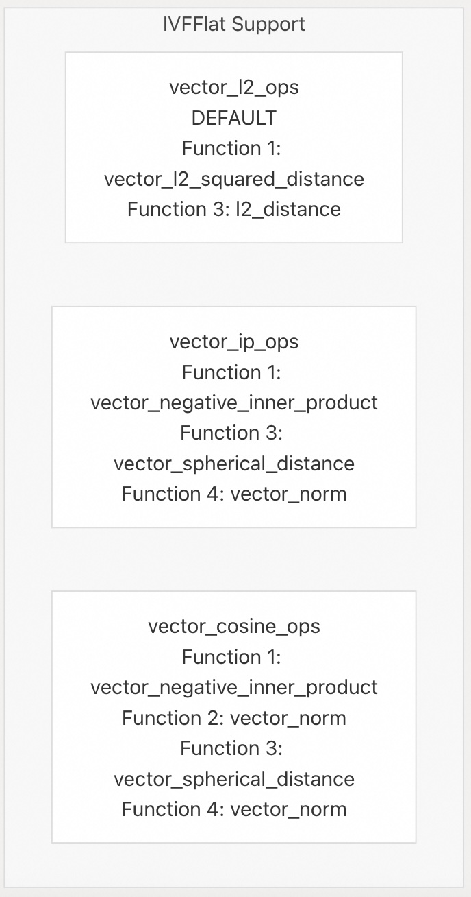    
  
| 距离指标 (`Distance Metric`) | 运算符类 (`Operator Class`) |  
| :--- | :--- |  
| L2 距离 (`<->`) | `vector_l2_ops` |  
| 负内积 (`<#>`) | `vector_ip_ops` |  
| 余弦距离 (`<=>`) | `vector_cosine_ops` |  
  
来源:  
[`sql/vector.sql` 292-311](https://github.com/pgvector/pgvector/blob/d823c445/sql/vector.sql#L292-L311)  
  
### `HNSW` 运算符类  
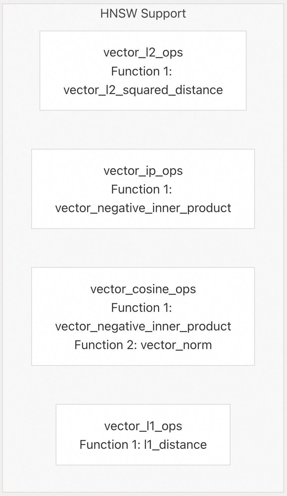    
  
| 距离指标 (`Distance Metric`) | 运算符类 (`Operator Class`) |  
| :--- | :--- |  
| L2 距离 (`<->`) | `vector_l2_ops` |  
| 负内积 (`<#>`) | `vector_ip_ops` |  
| 余弦距离 (`<=>`) | `vector_cosine_ops` |  
| L1 距离 (`<+>`) | `vector_l1_ops` |  
  
**注意**: `HNSW` 支持 `L1` 距离，而 `IVFFlat` 不支持。  
  
来源:  
[`sql/vector.sql` 313-332](https://github.com/pgvector/pgvector/blob/d823c445/sql/vector.sql#L313-L332)  
  
## 性能优化 (`Performance Optimizations`)  
  
### CPU 特性调度 (`CPU Feature Dispatching`)  
  
`vector` 类型使用**运行时 CPU 特性检测** (`runtime CPU feature detection`) 来优化距离计算：  
  
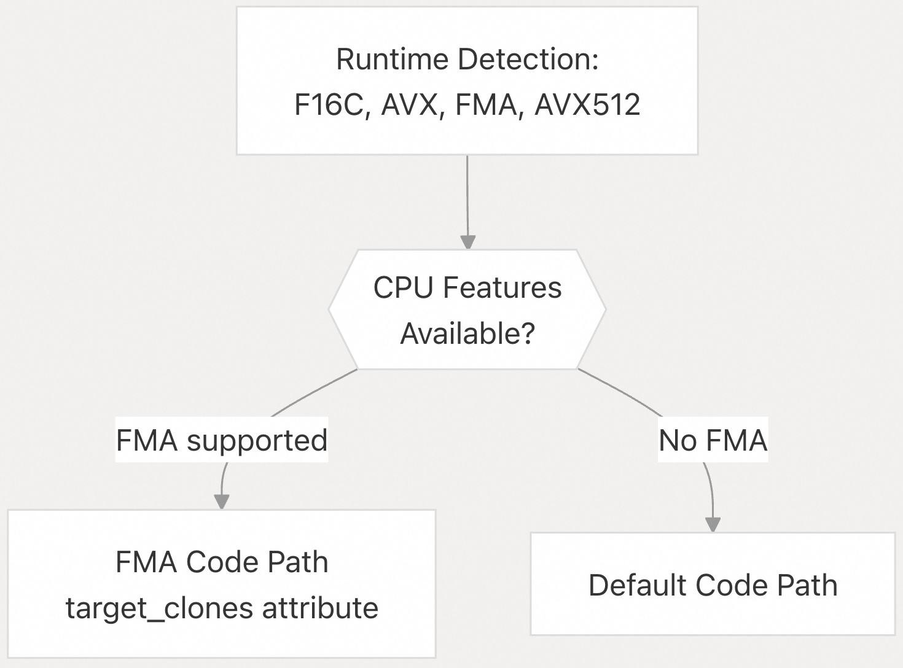    
  
**优化技术**:  
  
  * 在 GNU/Linux 上对多版本函数使用 `target_clones` 属性  
  * **自动向量化** (`Auto-vectorization`) 编译器提示  
  * **快速数学标志** (`Fast math flags`) (`-fassociative-math`, `-fno-signed-zeros`)  
  * 使用 `-march=native` 进行**架构特定构建** (`Architecture-specific builds`)  
  
来源:  
[`src/vector.c` 32-36](https://github.com/pgvector/pgvector/blob/d823c445/src/vector.c#L32-L36)  
  
### 自动向量化 (`Auto-vectorization`)  
  
距离和算术运算中的大多数循环都标记为**自动向量化**：  
  
```  
/* Auto-vectorized */  
for (int i = 0; i < dim; i++)  
{  
    float diff = ax[i] - bx[i];  
    distance += diff * diff;  
}  
```  
  
编译器可以使用 **SIMD 指令** (`SIMD instructions`) (SSE、AVX 等) 来处理每次迭代中的多个元素。  
  
来源:  
[`src/vector.c` 554-560](https://github.com/pgvector/pgvector/blob/d823c445/src/vector.c#L554-L560)  
  
## 存储特性 (`Storage Characteristics`)  
  
### 存储类别 (`Storage Class`)  
  
`vector` 类型使用 `STORAGE = external`：  
  
  * 通常不内联存储在表的**主堆** (`main heap`) 中  
  * 存储在 **TOAST** (`The Oversized-Attribute Storage Technique`，超大属性存储技术) 中  
  * 防止压缩 (`external` vs. `extended`)  
  * 优化性能而非压缩  
  
来源:  
[`sql/vector.sql` 23-30](https://github.com/pgvector/pgvector/blob/d823c445/sql/vector.sql#L23-L30)  
  
### 内存占用示例 (`Memory Footprint Examples`)  
  
| 维度 (`Dimensions`) | 存储大小 (`Storage Size`) | 示例用例 (`Example Use Case`) |  
| :--- | :--- | :--- |  
| 128 | 520 字节 | 小型嵌入 (`Small embeddings`) |  
| 384 | 1,544 字节 | 句子嵌入 (`Sentence embeddings`) |  
| 768 | 3,080 字节 | BERT 风格模型 (`BERT-style models`) |  
| 1536 | 6,152 字节 | OpenAI 嵌入 (`OpenAI embeddings`) |  
| 2000 | 8,008 字节 | 索引最大值 (`Maximum for indexing`) |  
  
来源:  
[`README.md` 944](https://github.com/pgvector/pgvector/blob/d823c445/README.md#L944-L944)  
       
#### [期望 PostgreSQL|开源PolarDB 增加什么功能?](https://github.com/digoal/blog/issues/76 "269ac3d1c492e938c0191101c7238216")
  
  
#### [PolarDB 开源数据库](https://openpolardb.com/home "57258f76c37864c6e6d23383d05714ea")
  
  
#### [PolarDB 学习图谱](https://www.aliyun.com/database/openpolardb/activity "8642f60e04ed0c814bf9cb9677976bd4")
  
  
#### [PostgreSQL 解决方案集合](../201706/20170601_02.md "40cff096e9ed7122c512b35d8561d9c8")
  
  
#### [德哥 / digoal's Github - 公益是一辈子的事.](https://github.com/digoal/blog/blob/master/README.md "22709685feb7cab07d30f30387f0a9ae")
  
  
#### [About 德哥](https://github.com/digoal/blog/blob/master/me/readme.md "a37735981e7704886ffd590565582dd0")
  
  

  
