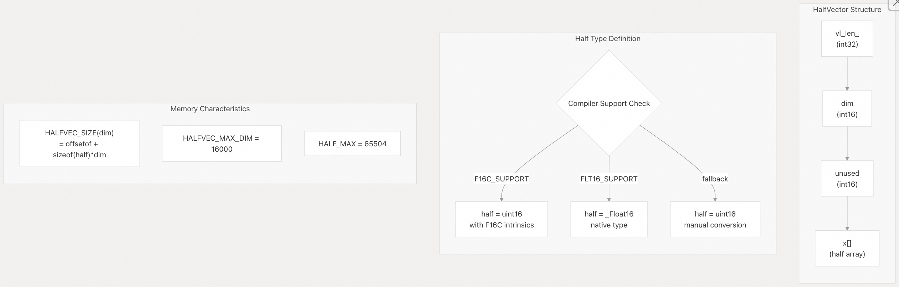
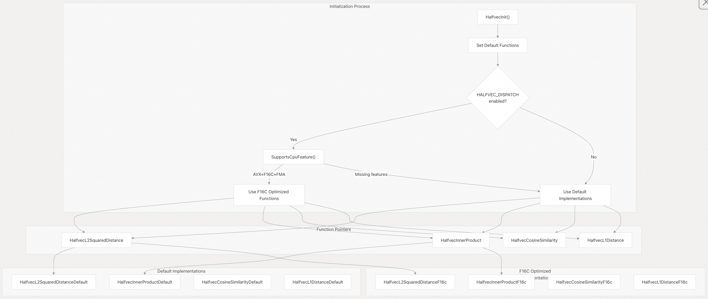
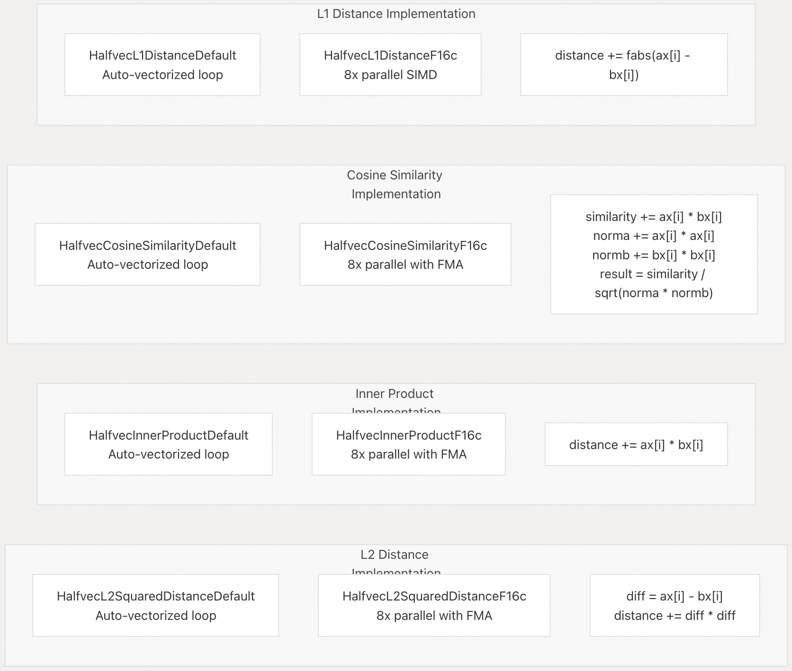
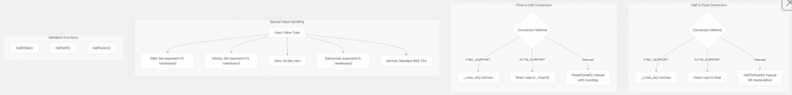
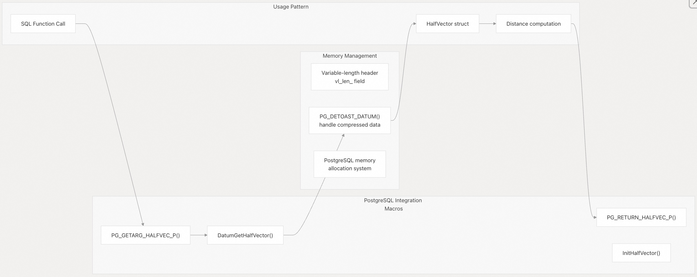

## pgvector 源码学习: 2.2 halfvec 类型 (`halfvec Type`)  
                                                
### 作者                                                
digoal                                                
                                                
### 日期                                                
2025-11-03                                                
                                                
### 标签                                                
pgvector , 源码学习                                                
                                                
----                                                
                                                
## 背景                                                
本文介绍 `halfvec` 数据类型，它是 `pgvector` 中一种 16 位**半精度浮点向量** (`half-precision floating point vector`) 实现。`halfvec` 类型提供了**内存高效的向量存储** (`memory-efficient vector storage`)，其**内存占用** (`memory footprint`) 约为标准 `vector` 类型的一半，同时为大多数**向量相似性应用** (`vector similarity applications`) 保持了合理的**精度** (`precision`)。  
  
## 数据结构和内存布局 (`Data Structure and Memory Layout`)  
  
`halfvec` 类型是通过 `HalfVector` **结构体** (`struct`) 实现的，它遵循 PostgreSQL 的**可变长度数据** (`varlena`) **约定** (`conventions`)，以实现高效的存储和检索。  
  
  
  
**来源:**  
[`src/halfvec.h` 60-66](https://github.com/pgvector/pgvector/blob/d823c445/src/halfvec.h#L60-L66) [`src/halfvec.h` 45-51](https://github.com/pgvector/pgvector/blob/d823c445/src/halfvec.h#L45-L51) [`src/halfvec.h` 53-55](https://github.com/pgvector/pgvector/blob/d823c445/src/halfvec.h#L53-L55)  
  
`HalfVector` 结构体包含:  
  
* `vl_len_`: 用于 PostgreSQL 集成的**可变长度头部** (`Variable-length header`)  
* `dim`: **维度数** (`Number of dimensions`) (16 位有符号整数)  
* `unused`: 留待未来扩展的**保留字段** (`Reserved field`)  
* `x[]`: 存储**半精度值** (`half-precision values`) 的**灵活数组构件** (`Flexible array member`)  
  
`half` 类型根据**编译器能力** (`compiler capabilities`) 进行**条件定义** (`conditionally defined`):  
  
| **支持级别** (`Support Level`) | **定义** (`Definition`) | **用途** (`Usage`) |  
| :--- | :--- | :--- |  
| `F16C_SUPPORT` | `uint16` with F16C **内在函数** (`intrinsics`) | x86-64 with F16C **指令集** (`instruction set`) |  
| `FLT16_SUPPORT` | `_Float16` **原生类型** (`native type`) | Modern compilers with **原生半精度支持** (`native half support`) |  
| **备用方案** (`Fallback`) | `uint16` with **手动转换** (`manual conversion`) | 没有硬件支持的旧系统 |  
  
## CPU 优化和运行时调度 (`CPU Optimization and Runtime Dispatching`)  
  
`halfvec` 实现使用精密的**运行时调度** (`runtime dispatching`)，根据可用的 CPU **特性** (`features`) 来选择最佳的**距离计算算法** (`distance computation algorithms`)。  
  
  
  
**来源:**  
[`src/halfutils.c` 276-298](https://github.com/pgvector/pgvector/blob/d823c445/src/halfutils.c#L276-L298) [`src/halfutils.c` 252-273](https://github.com/pgvector/pgvector/blob/d823c445/src/halfutils.c#L252-L273) [`src/halfvec.h` 8-36](https://github.com/pgvector/pgvector/blob/d823c445/src/halfvec.h#L8-L36)  
  
调度系统会检查这些 CPU 特性:  
  
* **AVX**: 用于 256 位 **SIMD** (Single Instruction, Multiple Data) **操作** (`operations`) 的**高级向量扩展** (`Advanced Vector Extensions`)  
* **F16C**: 硬件**半精度转换指令** (`half-precision conversion instructions`)  
* **FMA**: 用于提升性能的**融合乘加操作** (`Fused multiply-add operations`)  
* **OSXSAVE**: 操作系统对**扩展状态管理** (`extended state management`) 的支持  
  
## 距离函数实现 (`Distance Function Implementations`)  
  
每个**距离度量** (`distance metric`) 都有默认（**自动向量化** (`auto-vectorized`)）和 F16C **优化实现** (`optimized implementations`)，这些实现使用 256 位 SIMD **指令** (`instructions`) 同时处理 8 个半精度值。  
  
  
  
**来源:**  
[`src/halfutils.c` 27-41](https://github.com/pgvector/pgvector/blob/d823c445/src/halfutils.c#L27-L41) [`src/halfutils.c` 44-76](https://github.com/pgvector/pgvector/blob/d823c445/src/halfutils.c#L44-L76) [`src/halfutils.c` 79-89](https://github.com/pgvector/pgvector/blob/d823c445/src/halfutils.c#L79-L89) [`src/halfutils.c` 122-142](https://github.com/pgvector/pgvector/blob/d823c445/src/halfutils.c#L122-L142)  
  
### F16C SIMD 优化模式 (`F16C SIMD Optimization Pattern`)  
  
F16C 优化函数遵循一致的模式:  
  
1.  **批量处理** (`Bulk Processing`): 使用 `__m256` **向量** (`vectors`) 一次处理 8 个元素  
2.  **半精度转浮点数转换** (`Half-to-Float Conversion`): 使用 `_mm256_cvtph_ps()` 进行高效转换  
3.  SIMD **操作** (`Operations`): 利用 `_mm256_fmadd_ps()` 进行**融合乘加** (`fused multiply-add`)  
4.  **累加** (`Accumulation`): 使用**水平加法** (`horizontal addition`) 汇总部分结果  
5.  **剩余元素处理** (`Remainder Processing`): 使用**标量操作** (`scalar operations`) 处理剩余元素  
  
| SIMD **指令** (`Instruction`) | **目的** (`Purpose`) | **用途** (`Usage`) |  
| :--- | :--- | :--- |  
| `_mm_loadu_si128()` | Load 8 half values | **内存到寄存器传输** (`Memory to register transfer`) |  
| `_mm256_cvtph_ps()` | Convert half to float | F16C **转换指令** (`conversion instruction`) |  
| `_mm256_fmadd_ps()` | **融合乘加** (`Fused multiply-add`) | **核心算术操作** (`Core arithmetic operations`) |  
| `_mm256_sub_ps()` | Subtract vectors | **差值计算** (`Difference calculations`) |  
| `_mm256_storeu_ps()` | Store results | **累加步骤** (`Accumulation step`) |  
  
## 类型转换和实用工具函数 (`Type Conversion and Utility Functions`)  
  
`halfvec` 实现提供了**半精度** (`half-precision`) 和**单精度格式** (`single-precision formats`) 之间全面的**转换实用工具** (`conversion utilities`)，并针对不同的**硬件能力** (`hardware capabilities`) 进行了**优化** (`optimizations`)。  
  
  
  
**来源:**  
[`src/halfutils.h` 62-141](https://github.com/pgvector/pgvector/blob/d823c445/src/halfutils.h#L62-L141) [`src/halfutils.h` 146-239](https://github.com/pgvector/pgvector/blob/d823c445/src/halfutils.h#L146-L239) [`src/halfutils.h` 23-57](https://github.com/pgvector/pgvector/blob/d823c445/src/halfutils.h#L23-L57)  
  
### 手动转换算法 (`Manual Conversion Algorithm`)  
  
当硬件支持不可用时，该实现使用**手动位操作** (`manual bit manipulation`)，遵循 **IEEE 754 半精度格式** (`half-precision format`):  
  
**半精度格式 (16 位):**  
  
* 1 个**符号位** (`sign bit`)  
* 5 个**指数位** (`exponent bits`) (**偏差** (`bias`): 15)  
* 10 个**尾数位** (`mantissa bits`)  
  
**转换过程** (`Conversion process`):  
  
1.  **提取** (`Extract`) 符号、指数和尾数**组件** (`components`)  
2.  处理**特殊情况** (`special cases`) (`NaN`、**无穷大** (`infinity`)、**零** (`zero`)、**次正规数** (`subnormal`))  
3.  **调整** (`Adjust`) 指数偏差 (半精度为 15 → 浮点数为 127)  
4.  **重建** (`Reconstruct`) 32 位浮点数**表示** (`representation`)  
  
## 性能特征 (`Performance Characteristics`)  
  
`halfvec` 类型提供了显著的**内存节省** (`memory savings`) 和有竞争力的**性能特征** (`performance characteristics`):  
  
| **指标** (`Metric`) | `halfvec` | `vector` | **改进** (`Improvement`) |  
| :--- | :--- | :--- | :--- |  
| **内存使用** (`Memory Usage`) | 2 bytes/element | 4 bytes/element | 50% **减少** (`reduction`) |  
| **精度范围** (`Precision Range`) | ±65,504 | ±3.4×10³⁸ | **足以满足大多数机器学习 (ML) 需求** |  
| **精度位数** (`Precision Digits`) | ~3-4 decimal | ~7 decimal | **足以满足嵌入 (embeddings) 需求** |  
| SIMD **元素** (`Elements`) | 8 per 256-bit | 8 per 256-bit | **并行度相同** (`Same parallelism`) |  
| **缓存效率** (`Cache Efficiency`) | Higher | Lower | 每个**缓存行** (`cache line`) 的向量数量增加 2 倍 |  
  
**性能考量** (`Performance considerations`):  
  
* **F16C 支持** (`Support`): 在现代 x86-64 CPU 上提供**近乎最佳的性能** (`near-optimal performance`)  
* **自动向量化** (`Auto-vectorization`): **编译器优化** (`Compiler optimizations`) 有助于默认实现  
* **内存带宽** (`Memory Bandwidth`): 减少的**内存流量** (`memory traffic`) 提高了大型数据集的**吞吐量** (`throughput`)  
* **转换开销** (`Conversion Overhead`): 使用硬件 F16C 指令时**最小** (`Minimal`)  
  
**来源:**  
[`src/halfvec.h` 53](https://github.com/pgvector/pgvector/blob/d823c445/src/halfvec.h#L53-L53) [`src/halfvec.h` 50](https://github.com/pgvector/pgvector/blob/d823c445/src/halfvec.h#L50-L50) [`src/halfutils.c` 44-298](https://github.com/pgvector/pgvector/blob/d823c445/src/halfutils.c#L44-L298)  
  
## 与 PostgreSQL 的集成 (`Integration with PostgreSQL`)  
  
`halfvec` 类型使用标准 `varlena` 约定 (conventions) 和**访问器宏** (`accessor macros`) 与 PostgreSQL 的**类型系统** (`type system`) **无缝集成** (`integrates seamlessly`):  
  
  
  
**来源:**  
[`src/halfvec.h` 55-58](https://github.com/pgvector/pgvector/blob/d823c445/src/halfvec.h#L55-L58) [`src/halfvec.h` 68](https://github.com/pgvector/pgvector/blob/d823c445/src/halfvec.h#L68-L68)  
  
该集成提供了:  
  
* **自动解压** (`Automatic detoasting`): **透明地** (`transparently`) 处理压缩/**行外** (`out-of-line`) **数据**  
* **内存安全** (`Memory safety`): 使用 PostgreSQL 的**内存上下文系统** (`memory context system`)  
* **类型一致性** (`Type consistency`): 维护 PostgreSQL 关于**用户定义类型** (`user-defined types`) 的约定  
* **函数接口** (`Function interface`): 标准的**参数** (`argument`) 和**返回值处理** (`return value handling`)  
      
#### [期望 PostgreSQL|开源PolarDB 增加什么功能?](https://github.com/digoal/blog/issues/76 "269ac3d1c492e938c0191101c7238216")
  
  
#### [PolarDB 开源数据库](https://openpolardb.com/home "57258f76c37864c6e6d23383d05714ea")
  
  
#### [PolarDB 学习图谱](https://www.aliyun.com/database/openpolardb/activity "8642f60e04ed0c814bf9cb9677976bd4")
  
  
#### [PostgreSQL 解决方案集合](../201706/20170601_02.md "40cff096e9ed7122c512b35d8561d9c8")
  
  
#### [德哥 / digoal's Github - 公益是一辈子的事.](https://github.com/digoal/blog/blob/master/README.md "22709685feb7cab07d30f30387f0a9ae")
  
  
#### [About 德哥](https://github.com/digoal/blog/blob/master/me/readme.md "a37735981e7704886ffd590565582dd0")
  
  

  
