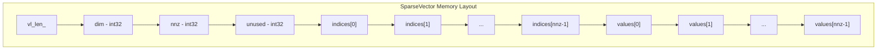
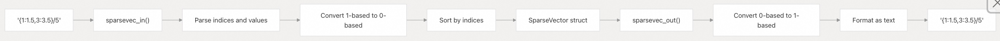
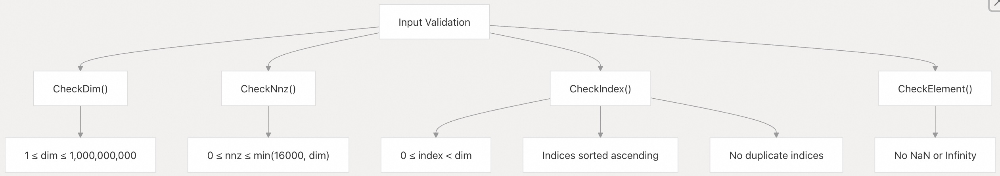
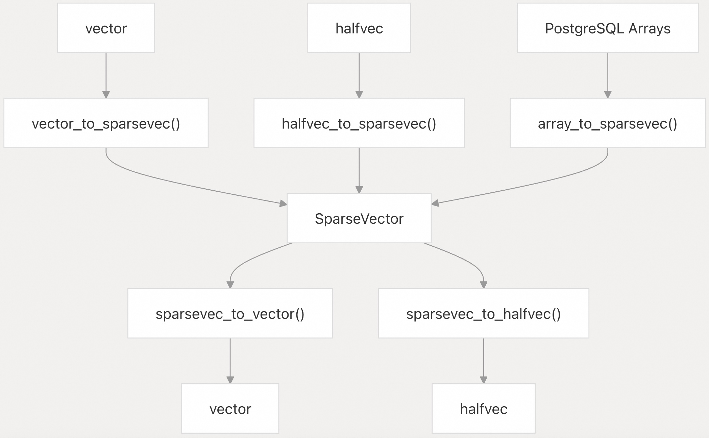
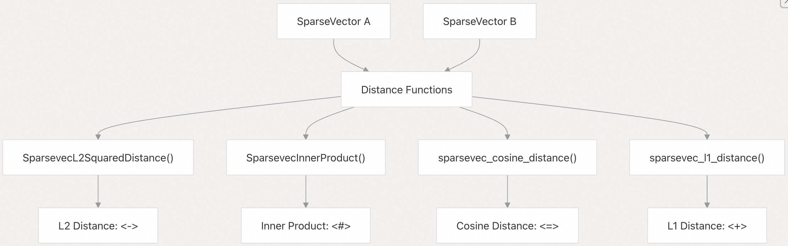
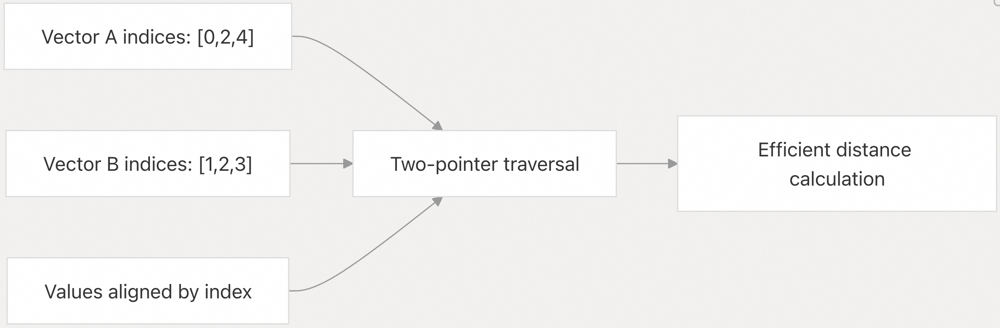
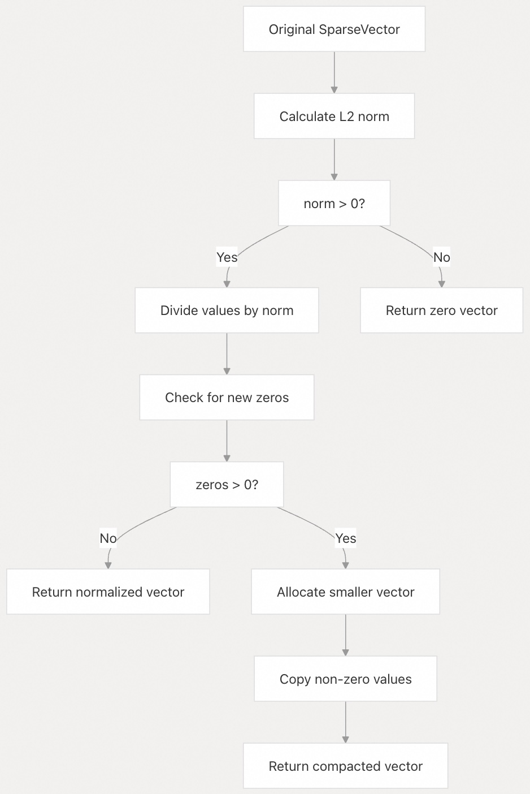
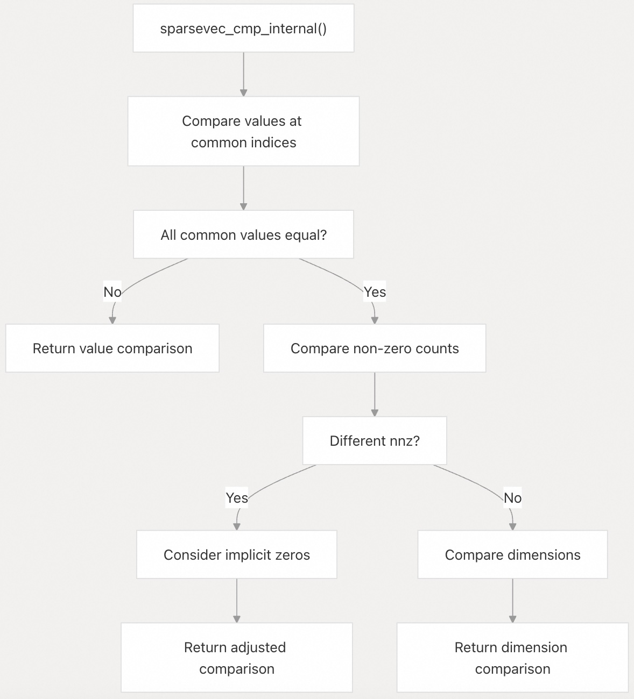

## pgvector 源码学习: 2.3 稀疏向量类型 (`sparsevec Type`)  
                                                  
### 作者                                                  
digoal                                                  
                                                  
### 日期                                                  
2025-11-03                                                  
                                                  
### 标签                                                  
pgvector , 源码学习                                                  
                                                  
----                                                  
                                                  
## 背景                                                  
`sparsevec` 类型 (`type`) 为 pgvector 中的稀疏向量 (`sparse vectors`) 提供了高效的存储和计算。这种数据类型 (`data type`) 专为大多数元素为零的向量而优化，仅存储非零值 (`non-zero values`) 及其索引 (`indices`)，以最大限度地减少内存使用和计算时间。  
  
## 内部结构和内存布局 (`Internal Structure and Memory Layout`)  
  
`SparseVector` 结构体 (`struct`) 采用紧凑的内存布局 (`compact memory layout`)，用于存储维度 (`dimensions`)、非零计数 (`non-zero count`) 和打包的索引-值对 (`packed index-value pairs`)。  
  

  
**SparseVector 内存布局 (`Memory Layout`)**  
  
来源:  
[`src/sparsevec.h` 15-22](https://github.com/pgvector/pgvector/blob/d823c445/src/sparsevec.h#L15-L22)  
[`src/sparsevec.h` 26-36](https://github.com/pgvector/pgvector/blob/d823c445/src/sparsevec.h#L26-L36)  
  
该结构将索引 (`indices`) 和值 (`values`) 分离到同一内存分配 (`memory allocation`) 中的不同数组 (`arrays`) 中。`SPARSEVEC_VALUES` 宏 (`macro`) 通过将所有索引的大小添加到基础结构偏移量 (`base structure offset`) 来计算值数组的偏移量 (`offset`)。  
  
| 字段 (`Field`) | 类型 (`Type`) | 用途 (`Purpose`) |  
| :--- | :--- | :--- |  
| `vl_len_` | int32 | PostgreSQL 变长数组头 (`varlena header`) |  
| `dim` | int32 | 总向量维度 (`Total vector dimensions`) |  
| `nnz` | int32 | 非零元素的数量 (`Number of non-zero elements`) |  
| `unused` | int32 | 保留字段 (`Reserved field`) (始终为零) |  
| `indices[]` | int32[] | 非零元素的零基索引 (`Zero-based indices`) |  
| `values[]` | float[] | 对应的非零值 (`Corresponding non-zero values`) |  
  
来源:  
[`src/sparsevec.h` 15-22](https://github.com/pgvector/pgvector/blob/d823c445/src/sparsevec.h#L15-L22)  
  
## 文本表示格式 (`Text Representation Format`)  
  
稀疏向量使用一种专门的文本格式 (`text format`)，明确列出非零元素及其索引。  
  
  
  
**文本格式处理管道 (`Text Format Processing Pipeline`)**  
  
来源:  
[`src/sparsevec.c` 187-389](https://github.com/pgvector/pgvector/blob/d823c445/src/sparsevec.c#L187-L389)  
[`src/sparsevec.c` 408-456](https://github.com/pgvector/pgvector/blob/d823c445/src/sparsevec.c#L408-L456)  
  
文本格式遵循以下模式 (`pattern`): `{index1:value1,index2:value2,...}/dimensions`  
  
**格式规则 (`Format Rules`):**  
  
* 在文本表示中，使用 1-基于索引 (`1-based indexing`) (SQL 约定)  
* 索引必须是在维度界限内 (`dimension bounds`) 的正整数  
* 值必须是有限的浮点数 (`finite floating-point numbers`)  
* 在输入解析 (`input parsing`) 期间，零值会自动排除  
* 输出会自动以升序 (`ascending order`) 排列索引  
  
来源:  
[`src/sparsevec.c` 306-312](https://github.com/pgvector/pgvector/blob/d823c445/src/sparsevec.c#L306-L312)  
[`src/sparsevec.c` 376-386](https://github.com/pgvector/pgvector/blob/d823c445/src/sparsevec.c#L376-L386)  
  
## 约束和验证 (`Constraints and Validation`)  
  
稀疏向量实现 (`implementation`) 强制执行多项约束 (`constraints`)，以确保数据完整性 (`data integrity`) 和性能 (`performance`)。  
  
| 约束 (`Constraint`) | 限制 (`Limit`) | 错误消息 (`Error Message`) |  
| :--- | :--- | :--- |  
| 最大维度 (`Maximum dimensions`) | 1,000,000,000 | "sparsevec cannot have more than 1000000000 dimensions" |  
| 最大非零元素 (`Maximum non-zero elements`) | 16,000 | "sparsevec cannot have more than 16000 non-zero elements" |  
| 最小维度 (`Minimum dimensions`) | 1 | "sparsevec must have at least 1 dimension" |  
| 索引边界 (`Index bounds`) | 0 ≤ index < dim | "sparsevec index out of bounds" |  
| 索引顺序 (`Index ordering`) | 升序 (`Ascending`) | "sparsevec indices must be in ascending order" |  
| 索引唯一性 (`Index uniqueness`) | 无重复 (`No duplicates`) | "sparsevec indices must not contain duplicates" |  
  
来源:  
[`src/sparsevec.h` 4-5](https://github.com/pgvector/pgvector/blob/d823c445/src/sparsevec.h#L4-L5)  
[`src/sparsevec.c` 54-65](https://github.com/pgvector/pgvector/blob/d823c445/src/sparsevec.c#L54-L65)  
[`src/sparsevec.c` 71-87](https://github.com/pgvector/pgvector/blob/d823c445/src/sparsevec.c#L71-L87)  
[`src/sparsevec.c` 93-116](https://github.com/pgvector/pgvector/blob/d823c445/src/sparsevec.c#L93-L116)  
  
  
  
**稀疏向量验证函数 (`Sparse Vector Validation Functions`)**  
  
来源:  
[`src/sparsevec.c` 54-65](https://github.com/pgvector/pgvector/blob/d823c445/src/sparsevec.c#L54-L65)  
[`src/sparsevec.c` 71-87](https://github.com/pgvector/pgvector/blob/d823c445/src/sparsevec.c#L71-L87)  
[`src/sparsevec.c` 93-116](https://github.com/pgvector/pgvector/blob/d823c445/src/sparsevec.c#L93-L116)  
[`src/sparsevec.c` 122-133](https://github.com/pgvector/pgvector/blob/d823c445/src/sparsevec.c#L122-L133)  
  
## 类型转换 (`Type Conversions`)  
  
`sparsevec` 类型支持与其他 pgvector 类型和 PostgreSQL 数组 (`arrays`) 进行双向转换 (`bidirectional conversion`)。  
  
  
  
**类型转换函数 (`Type Conversion Functions`)**  
  
来源:  
[`src/sparsevec.c` 586-624](https://github.com/pgvector/pgvector/blob/d823c445/src/sparsevec.c#L586-L624)  
[`src/sparsevec.c` 629-667](https://github.com/pgvector/pgvector/blob/d823c445/src/sparsevec.c#L629-L667)  
[`src/sparsevec.c` 672-798](https://github.com/pgvector/pgvector/blob/d823c445/src/sparsevec.c#L672-L798)  
  
**支持的数组类型 (`Supported Array Types`):**  
  
* `int4[]` (整数数组 (`integer arrays`))  
* `float4[]` (实数数组 (`real arrays`))  
* `float8[]` (双精度数组 (`double precision arrays`))  
* `numeric[]` (数值数组 (`numeric arrays`))  
  
转换过程 (`conversion process`) 会自动排除零值并验证所有约束。对于数组转换，有特殊处理 (`special handling`) 以确保在不同的浮点表示 (`floating-point representations`) 中正确检测到 NaN 和 Infinity 值。  
  
来源:  
[`src/sparsevec.c` 704-736](https://github.com/pgvector/pgvector/blob/d823c445/src/sparsevec.c#L704-L736)  
[`src/sparsevec.c` 754-779](https://github.com/pgvector/pgvector/blob/d823c445/src/sparsevec.c#L754-L779)  
  
## 距离函数和运算符 (`Distance Functions and Operators`)  
  
稀疏向量支持与密集向量相同的距离度量 (`distance metrics`)，并针对稀疏数据提供了优化实现 (`optimized implementations`)。  
  
  
  
**稀疏向量距离运算符 (`Sparse Vector Distance Operators`)**  
  
来源:  
[`src/sparsevec.c` 851-861](https://github.com/pgvector/pgvector/blob/d823c445/src/sparsevec.c#L851-L861)  
[`src/sparsevec.c` 918-928](https://github.com/pgvector/pgvector/blob/d823c445/src/sparsevec.c#L918-L928)  
[`src/sparsevec.c` 948-988](https://github.com/pgvector/pgvector/blob/d823c445/src/sparsevec.c#L948-L988)  
[`src/sparsevec.c` 993-1037](https://github.com/pgvector/pgvector/blob/d823c445/src/sparsevec.c#L993-L1037)  
  
**算法优化 (`Algorithm Optimization`):**  
距离函数使用双指针技术 (`two-pointer technique`)，通过同时遍历两个稀疏向量的索引数组 (`indices arrays`) 来高效计算距离。这种方法的复杂度为 O(nnz₁ + nnz₂)，而非 O(dim)。  
  
  
  
**双指针距离算法 (`Two-Pointer Distance Algorithm`)**  
  
来源:  
[`src/sparsevec.c` 804-846](https://github.com/pgvector/pgvector/blob/d823c445/src/sparsevec.c#L804-L846)  
[`src/sparsevec.c` 882-913](https://github.com/pgvector/pgvector/blob/d823c445/src/sparsevec.c#L882-L913)  
  
## 归一化和向量操作 (`Normalization and Vector Operations`)  
  
`sparsevec` 类型提供 L2 归一化 (`L2 normalization`)，并对归一化后可能产生零值的边缘情况 (`edge cases`) 进行特殊处理。  
  
  
  
**带零值压缩的 L2 归一化 (`L2 Normalization with Zero Compaction`)**  
  
来源:  
[`src/sparsevec.c` 1060-1124](https://github.com/pgvector/pgvector/blob/d823c445/src/sparsevec.c#L1060-L1124)  
  
归一化过程 (`normalization process`) 包括溢出检测 (`overflow detection`) 和自动压缩 (`automatic compaction`)，当除以范数 (`norm`) 产生额外的零值时，确保稀疏表示 (`sparse representation`) 保持最优。  
  
## 比较和排序 (`Comparison and Ordering`)  
  
稀疏向量实现了字典序比较 (`lexicographic comparison`)，它同时考虑索引和值，并对不同维度的向量进行特殊处理。  
  
  
  
**稀疏向量比较逻辑 (`Sparse Vector Comparison Logic`)**  
  
来源:  
[`src/sparsevec.c` 1129-1165](https://github.com/pgvector/pgvector/blob/d823c445/src/sparsevec.c#L1129-L1165)  
  
比较算法 (`comparison algorithm`) 确保一致的排序 (`consistent ordering`)，同时处理比较稀疏表示的复杂性，其中缺失的索引代表隐式零 (`implicit zeros`)。  
      
#### [期望 PostgreSQL|开源PolarDB 增加什么功能?](https://github.com/digoal/blog/issues/76 "269ac3d1c492e938c0191101c7238216")
  
  
#### [PolarDB 开源数据库](https://openpolardb.com/home "57258f76c37864c6e6d23383d05714ea")
  
  
#### [PolarDB 学习图谱](https://www.aliyun.com/database/openpolardb/activity "8642f60e04ed0c814bf9cb9677976bd4")
  
  
#### [PostgreSQL 解决方案集合](../201706/20170601_02.md "40cff096e9ed7122c512b35d8561d9c8")
  
  
#### [德哥 / digoal's Github - 公益是一辈子的事.](https://github.com/digoal/blog/blob/master/README.md "22709685feb7cab07d30f30387f0a9ae")
  
  
#### [About 德哥](https://github.com/digoal/blog/blob/master/me/readme.md "a37735981e7704886ffd590565582dd0")
  
  

  
