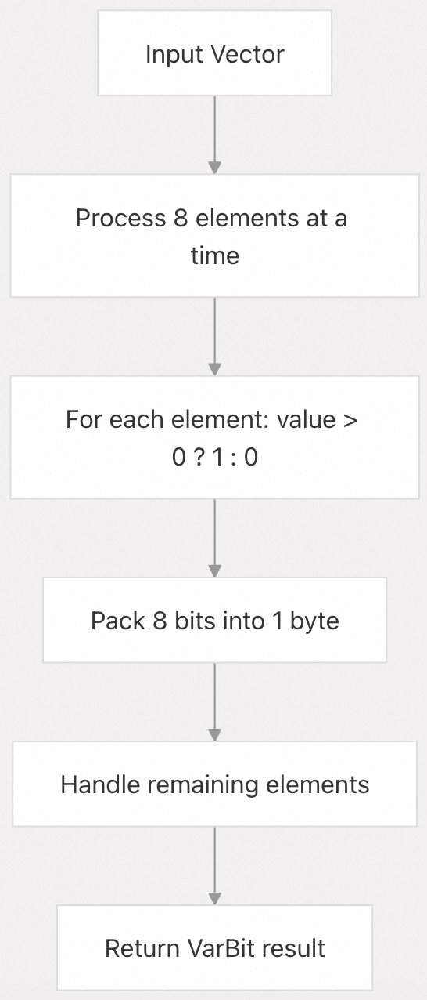
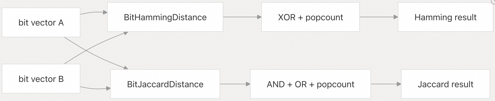
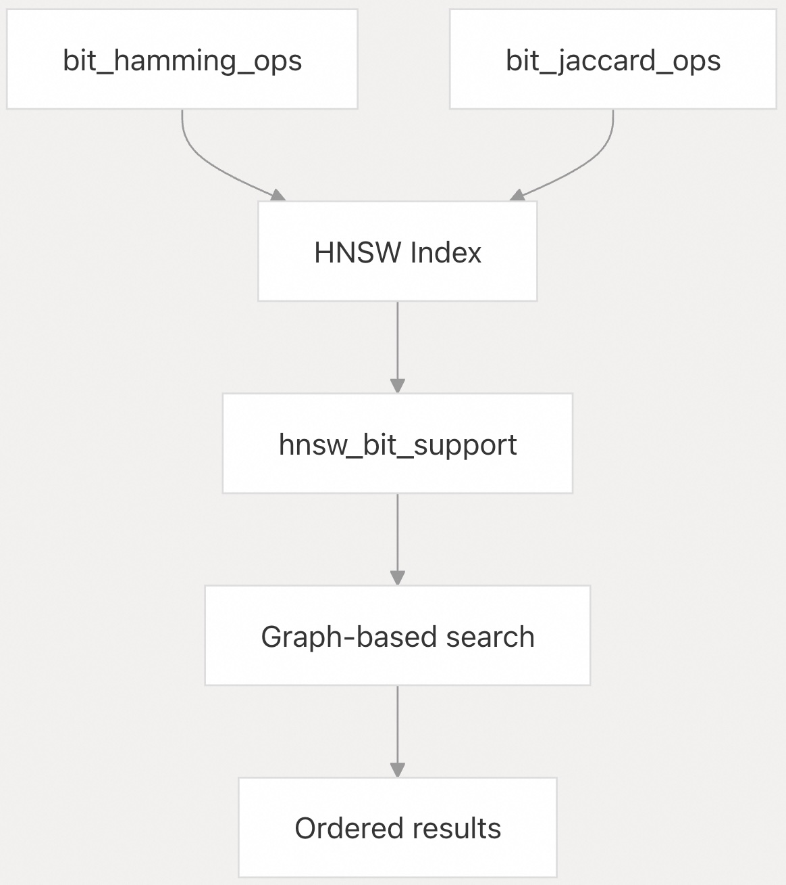
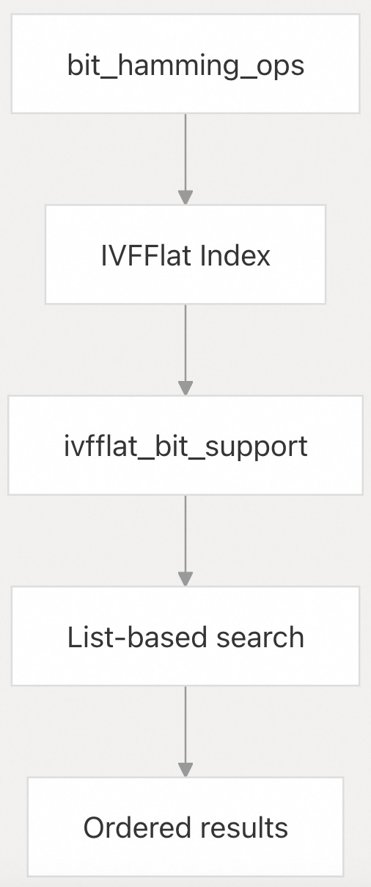
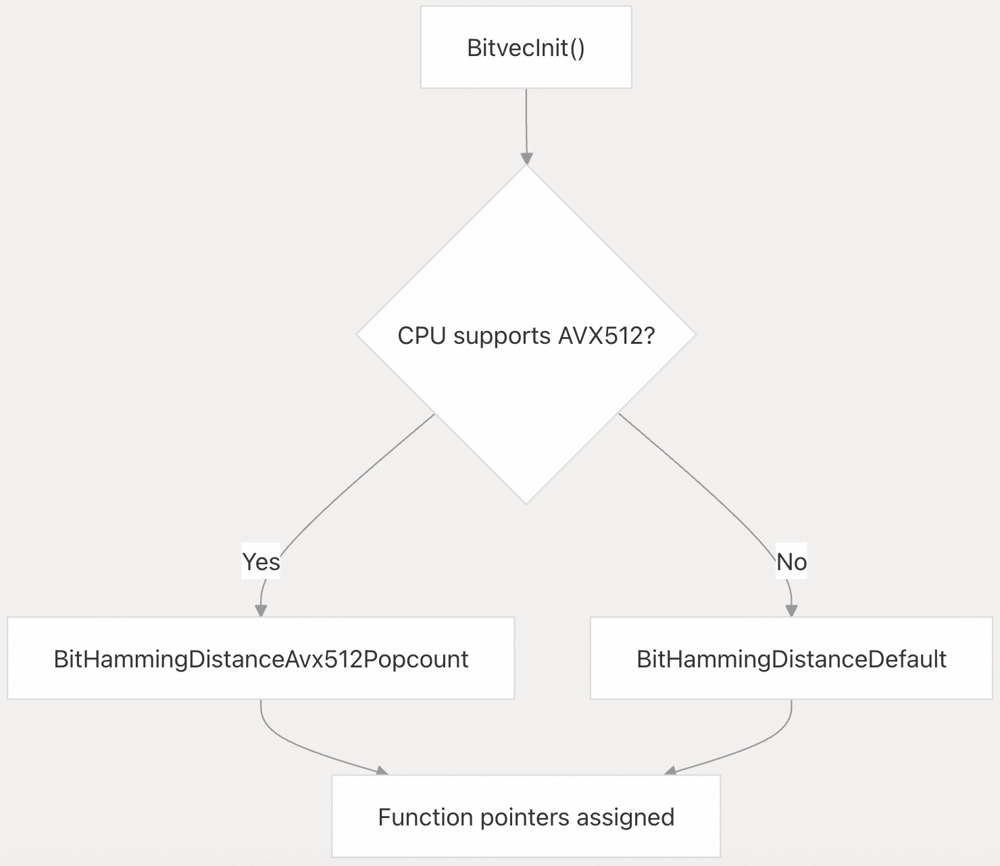
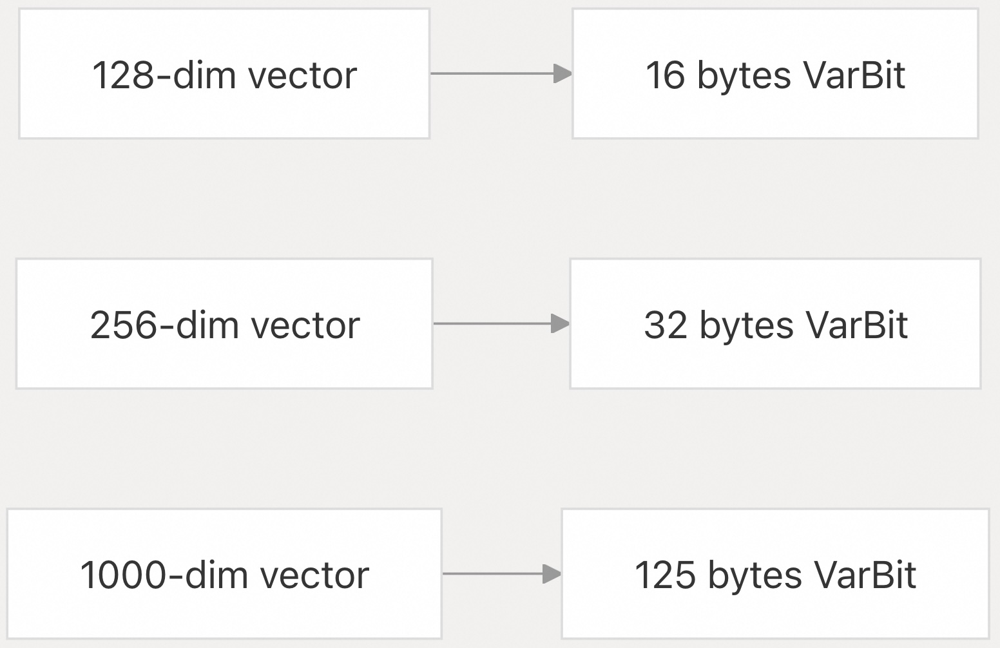
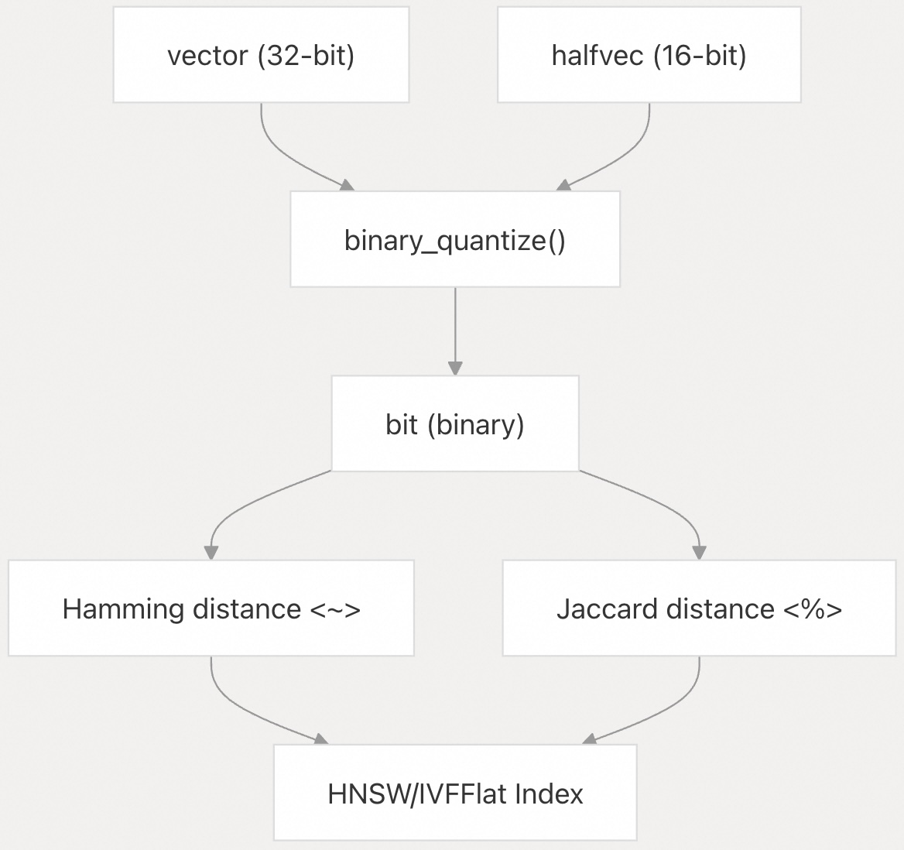

## pgvector 源码学习: 2.4 bit 类型 (bit Type)  
                                                    
### 作者                                                    
digoal                                                    
                                                    
### 日期                                                    
2025-11-03                                                    
                                                    
### 标签                                                    
pgvector , 源码学习                                                    
                                                    
----                                                    
                                                    
## 背景                                                    
pgvector 中的 `bit` 类型扩展了 PostgreSQL 内置的 `bit` 类型，赋予其向量相似度搜索 (vector similarity search) 能力。本页面涵盖了 pgvector 对 `bit` 类型的增强功能，包括二进制量化 (binary quantization)、距离函数 (distance functions)、运算符 (operators) 和索引支持 (indexing support)，以实现高效的二进制向量操作 (binary vector operations)。  
  
## 概述 (Overview)  
  
pgvector 扩展了 PostgreSQL 的 `bit` 类型，通过以下方式支持二进制量化向量 (binary quantized vectors)：  
  
* 二进制量化函数 (Binary quantization functions)，用于将 `vector` 和 `halfvec` 转换为 `bit`  
* 用于二进制相似度搜索 (binary similarity search) 的汉明 (Hamming) 和杰卡德 (Jaccard) 距离函数  
* 距离运算符 (Distance operators) `<~>` 和 `<%>`  
* 通过 HNSW 和 IVFFlat 访问方法 (access methods) 实现的索引支持 (Index support)  
* 使用 SIMD 指令 (SIMD instructions) 的 CPU 优化实现 (CPU-optimized implementations)  
  
## 二进制量化 (Binary Quantization)  
  
二进制量化将连续的浮点向量 (continuous floating-point vectors) 转换为二进制表示 (binary representations)，其中每个维度 (dimension) 变成一个比特位 (0 或 1)。这项技术极大地减少了内存使用 (memory usage)，并能通过位操作 (bitwise operations) 实现更快的相似度计算 (similarity computations)。  
  
### 量化函数 (Quantization Functions)  
  
pgvector 提供了两个二进制量化函数：  
  
| 函数 (Function) | 输入类型 (Input Type) | 目的 (Purpose) |  
| :--- | :--- | :--- |  
| `binary_quantize(vector)` | `vector` | 将 32 位浮点向量 (32-bit float vector) 转换为二进制 |  
| `binary_quantize(halfvec)` | `halfvec` | 将 16 位半精度向量 (16-bit half vector) 转换为二进制 |  
  
量化规则 (quantization rule) 很简单：值大于 0 的变为 1，值小于或等于 0 的变为 0。  
  
### 实现细节 (Implementation Details)  
  
为了提高效率，二进制量化算法以 8 个维度 (dimensions) 的块 (chunks) 为单位处理向量：  
  
  
  
**来源 (Sources):**  
[`src/vector.c` 941-967](https://github.com/pgvector/pgvector/blob/d823c445/src/vector.c#L941-L967) [`src/halfvec.c` 893-919](https://github.com/pgvector/pgvector/blob/d823c445/src/halfvec.c#L893-L919)  
  
## 距离函数 (Distance Functions)  
  
pgvector 实现了两个针对二进制向量 (binary vectors) 优化的距离函数：  
  
### 汉明距离 (Hamming Distance)  
  
汉明距离计算的是两个二进制向量中对应比特位不同的位置的数量。它是通过异或操作 (XOR operations) 后跟比特计数 (bit counting) 来计算的。  
  
* **函数 (Function):** `hamming_distance(bit, bit) RETURNS float8`  
* **运算符 (Operator):** `<~>`  
* **用例 (Use case):** 衡量二进制相似度 (binary similarity)，重复检测 (duplicate detection)  
  
### 杰卡德距离 (Jaccard Distance)  
  
杰卡德距离基于杰卡德系数 (Jaccard coefficient) 衡量差异度 (dissimilarity)，计算公式为 `1 - |交集 (intersection)| / |并集 (union)|`，其中交集和并集是通过位操作 AND (bitwise AND) 和 OR (bitwise OR) 来计算的。  
  
* **函数 (Function):** `jaccard_distance(bit, bit) RETURNS float8`  
* **运算符 (Operator):** `<%>`  
* **用例 (Use case):** 集合相似度 (Set similarity)，带有二进制特征的文档相似度 (document similarity with binary features)  
  
### 距离计算架构 (Distance Computation Architecture)  
  
  
  
**来源 (Sources):**  
[`src/bitutils.h` 11-12](https://github.com/pgvector/pgvector/blob/d823c445/src/bitutils.h#L11-L12) [`src/bitutils.c` 47-71](https://github.com/pgvector/pgvector/blob/d823c445/src/bitutils.c#L47-L71) [`src/bitutils.c` 96-129](https://github.com/pgvector/pgvector/blob/d823c445/src/bitutils.c#L96-L129)  
  
## 运算符 (Operators)  
  
pgvector 为 `bit` 向量定义了两个距离运算符：  
  
| 运算符 (Operator) | 函数 (Function) | 可交换性 (Commutative) | 目的 (Purpose) |  
| :--- | :--- | :--- | :--- |  
| `<~>` | `hamming_distance` | 是 (Yes) | 汉明距离 (Hamming distance) |  
| `<%>` | `jaccard_distance` | 是 (Yes) | 杰卡德距离 (Jaccard distance) |  
  
这些运算符与 PostgreSQL 的查询规划器 (query planner) 集成，可用于 `ORDER BY` 子句 (clauses) 中的最近邻搜索 (nearest neighbor queries)。  
  
**来源 (Sources):**  
[`sql/vector.sql` 660-668](https://github.com/pgvector/pgvector/blob/d823c445/sql/vector.sql#L660-L668)  
  
## 索引支持 (Index Support)  
  
pgvector 为 `bit` 向量提供了 HNSW 和 IVFFlat 索引的运算符类 (operator classes)：  
  
### HNSW 索引支持 (HNSW Index Support)  
  
  
  
### IVFFlat 索引支持 (IVFFlat Index Support)  
  
  
  
### 运算符类 (Operator Classes)  
  
| 索引类型 (Index Type) | 运算符类 (Operator Class) | 支持的运算符 (Supported Operators) | 距离函数 (Distance Functions) |  
| :--- | :--- | :--- | :--- |  
| HNSW | `bit_hamming_ops` | `<~>` | `hamming_distance` |  
| HNSW | `bit_jaccard_ops` | `<%>` | `jaccard_distance` |  
| IVFFlat | `bit_hamming_ops` | `<~>` | `hamming_distance` |  
  
**来源 (Sources):**  
[`sql/vector.sql` 672-689](https://github.com/pgvector/pgvector/blob/d823c445/sql/vector.sql#L672-L689)  
  
## CPU 优化 (CPU Optimizations)  
  
pgvector 实现了运行时 CPU 特性检测 (runtime CPU feature detection) 和调度 (dispatching)，以在不同架构 (architectures) 上实现最佳性能 (optimal performance)。  
  
### 函数指针调度 (Function Pointer Dispatch)  
  
  
  
### 优化策略 (Optimization Strategies)  
  
| 策略 (Strategy) | 实现 (Implementation) | 优势 (Benefit) |  
| :--- | :--- | :--- |  
| 目标克隆 (Target Clones) | `BIT_TARGET_CLONES` 属性 (attribute) | 编译器生成 (Compiler-generated) 的调度 |  
| SIMD 指令 (SIMD Instructions) | AVX512 VPOPCNTDQ | 并行位计数 (Parallel popcount) 操作 |  
| 内置函数 (Built-in Functions) | `__builtin_popcountl` | 硬件位计数 (Hardware popcount)（可用时） |  
  
### 性能特征 (Performance Characteristics)  
  
优化后的实现以数据块 (chunks) 的形式处理数据：  
  
* **默认 (Default):** 使用 `popcount64` 的 64 位块  
* **AVX512:** 使用向量位计数指令 (vector popcount instructions) 的 512 位块  
* **回退 (Fallback):** 使用查找表 (lookup tables) 的逐字节 (byte-by-byte) 处理  
  
**来源 (Sources):**  
[`src/bitutils.c` 27-32](https://github.com/pgvector/pgvector/blob/d823c445/src/bitutils.c#L27-L32) [`src/bitutils.c` 74-93](https://github.com/pgvector/pgvector/blob/d823c445/src/bitutils.c#L74-L93) [`src/bitutils.c` 205-222](https://github.com/pgvector/pgvector/blob/d823c445/src/bitutils.c#L205-L222)  
  
## 内存布局和存储 (Memory Layout and Storage)  
  
二进制向量在内部使用 PostgreSQL 的 `VarBit` 类型，提供：  
  
* **紧凑存储 (Compact storage):** 每字节存储 8 个维度  
* **可变长度 (Variable length):** 支持不同大小的向量  
* **对齐 (Alignment):** 针对 SIMD 操作的正确内存对齐 (memory alignment)  
  
  
  
**来源 (Sources):**  
[`src/vector.c` 947-948](https://github.com/pgvector/pgvector/blob/d823c445/src/vector.c#L947-L948) [`src/halfvec.c` 899-900](https://github.com/pgvector/pgvector/blob/d823c445/src/halfvec.c#L899-L900)  
  
## 与其他类型的集成 (Integration with Other Types)  
  
二进制量化 (Binary quantization) 在连续 (continuous) 和二进制向量表示之间架起了一座桥梁：  
  
  
  
这使得应用程序可以使用高精度向量 (high-precision vectors) 进行训练 (training)，并使用低精度二进制向量进行快速推理 (fast inference) 和存储 (storage)。  
  
**来源 (Sources):**  
[`sql/vector.sql` 55-56](https://github.com/pgvector/pgvector/blob/d823c445/sql/vector.sql#L55-L56) [`sql/vector.sql` 385-386](https://github.com/pgvector/pgvector/blob/d823c445/sql/vector.sql#L385-L386)  
  
# 附录: 汉明距离和杰卡德距离的应用场景  
pgvector 中 `hamming_distance` 和 `jaccard_distance` 这两个二进制向量距离函数的业务场景和用法。   
  
## Hamming Distance (汉明距离)  
  
Hamming distance 计算两个二进制向量中不同位的数量,使用 XOR 操作后计数 1 的个数实现。    
  
**业务场景:**  
- **二进制相似度检测** - 比较两个二进制特征向量的相似程度   
- **重复检测** - 在图像哈希、文档指纹等场景中检测近似重复    
- **错误检测** - 在通信和存储系统中检测位错误   
  
**用法示例:**  
  
创建表并插入二进制向量:    
```sql  
CREATE TABLE items (id bigserial PRIMARY KEY, embedding bit(3));  
INSERT INTO items (embedding) VALUES ('000'), ('111');  
```  
  
查询最近邻:   
```sql  
SELECT * FROM items ORDER BY embedding <~> '101' LIMIT 5;  
```  
  
创建 HNSW 索引以加速查询:    
```sql  
CREATE INDEX ON items USING hnsw (embedding bit_hamming_ops);  
```  
  
## Jaccard Distance (杰卡德距离)  
  
Jaccard distance 基于 Jaccard 系数计算, 公式为 `1 - |交集| / |并集|`, 使用 AND 和 OR 位运算实现。    
  
**业务场景:**  
- **集合相似度** - 比较两个集合的相似程度   
- **文档相似度** - 使用二进制特征表示的文档相似度计算   
- **推荐系统** - 基于用户行为的二进制表示进行相似用户查找   
  
**用法示例:**  
  
查询最近邻:   
```sql  
SELECT * FROM items ORDER BY embedding <%> '101' LIMIT 5;  
```  
  
创建 HNSW 索引:    
```sql  
CREATE INDEX ON items USING hnsw (embedding bit_jaccard_ops);  
```  
  
## 二进制量化场景  
  
两个距离函数常与 `binary_quantize` 函数配合使用,将浮点向量转换为二进制向量以节省存储和加速计算:    
  
```sql  
-- 创建表达式索引  
CREATE INDEX ON items USING hnsw ((binary_quantize(embedding)::bit(3)) bit_hamming_ops);  
  
-- 查询  
SELECT * FROM items ORDER BY binary_quantize(embedding)::bit(3) <~> binary_quantize('[1,-2,3]') LIMIT 5;  
  
-- 重排序以提高召回率  
SELECT * FROM (  
    SELECT * FROM items ORDER BY binary_quantize(embedding)::bit(3) <~> binary_quantize('[1,-2,3]') LIMIT 20  
) ORDER BY embedding <=> '[1,-2,3]' LIMIT 5;  
```  
  
## 性能优化  
  
两个距离函数都实现了 CPU 优化,在支持 AVX512 的平台上使用 SIMD 指令加速计算。    
  
# Notes  
  
- 两个距离函数都支持 IVFFlat 和 HNSW 索引类型    
- `bit` 类型最多支持 64,000 维    
- 操作符 `<~>` 对应 `hamming_distance`, `<%>` 对应 `jaccard_distance`    
- 这些功能在 pgvector 0.7.0 版本中添加    
  
关于汉明距离的加速, 还有一种实现方法是smlar + 倒排索引, 原理可参考:   
- [《PostgreSQL ghtree实现的海明距离排序索引, 性能不错(模糊图像) - pg-knn_hamming - bit string 比特字符串 相似度搜索》](../202003/20200326_08.md)    
- [《HTAP数据库 PostgreSQL 场景与性能测试之 16 - (OLTP) 文本特征向量 - 相似特征(海明...)查询》](../201711/20171107_17.md)    
- [《海量数据,海明(simhash)距离高效检索(smlar) - 阿里云RDS PosgreSQL最佳实践 - bit string 比特字符串 相似度搜索》](../201708/20170804_01.md)    
    
#### [期望 PostgreSQL|开源PolarDB 增加什么功能?](https://github.com/digoal/blog/issues/76 "269ac3d1c492e938c0191101c7238216")
  
  
#### [PolarDB 开源数据库](https://openpolardb.com/home "57258f76c37864c6e6d23383d05714ea")
  
  
#### [PolarDB 学习图谱](https://www.aliyun.com/database/openpolardb/activity "8642f60e04ed0c814bf9cb9677976bd4")
  
  
#### [PostgreSQL 解决方案集合](../201706/20170601_02.md "40cff096e9ed7122c512b35d8561d9c8")
  
  
#### [德哥 / digoal's Github - 公益是一辈子的事.](https://github.com/digoal/blog/blob/master/README.md "22709685feb7cab07d30f30387f0a9ae")
  
  
#### [About 德哥](https://github.com/digoal/blog/blob/master/me/readme.md "a37735981e7704886ffd590565582dd0")
  
  

  
