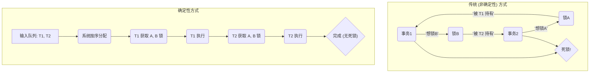
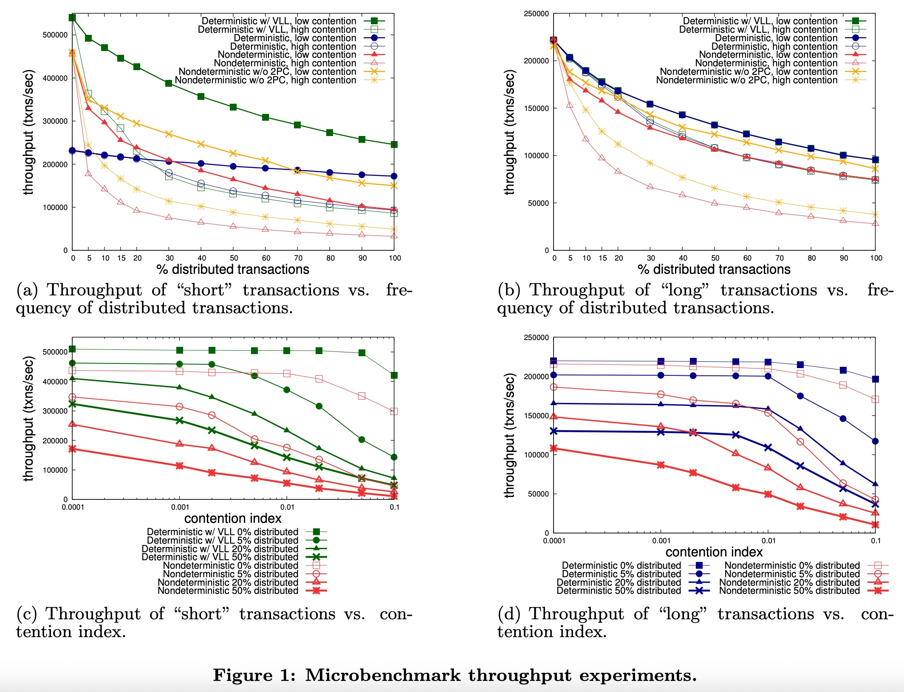
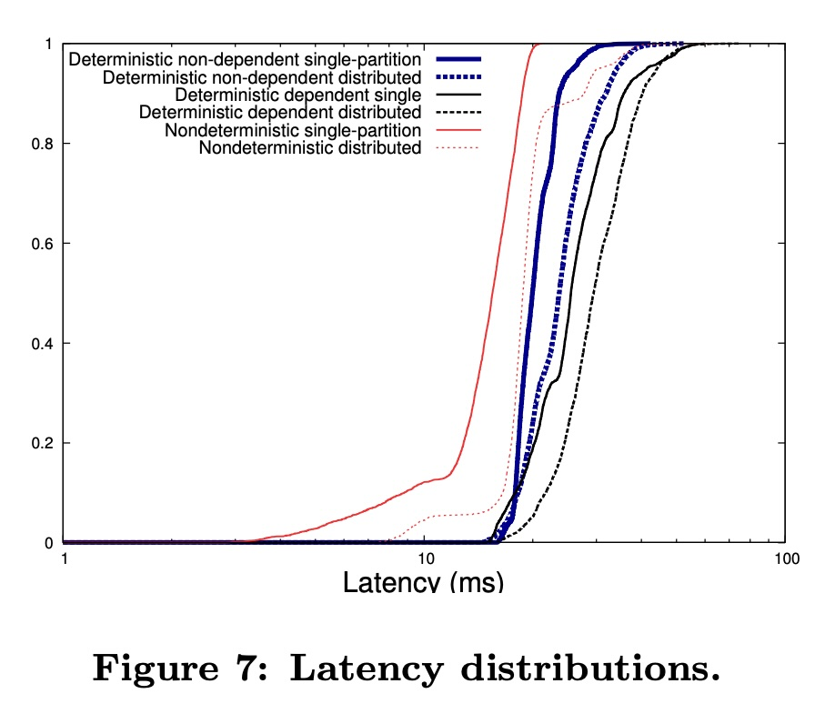
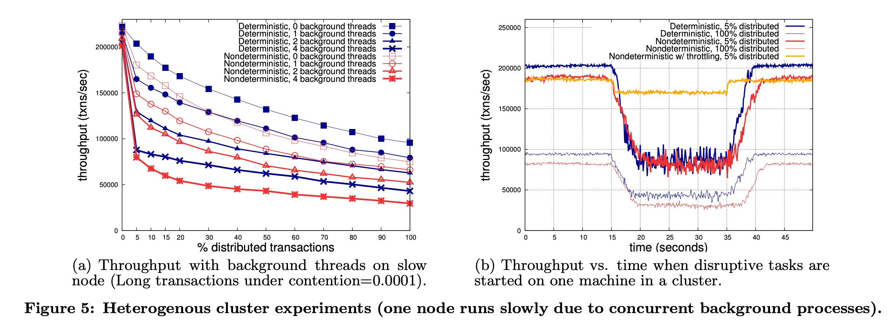
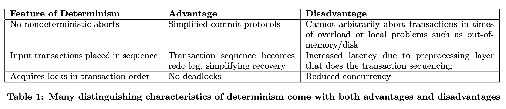
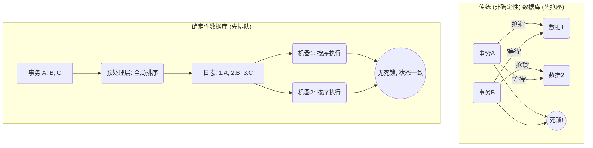
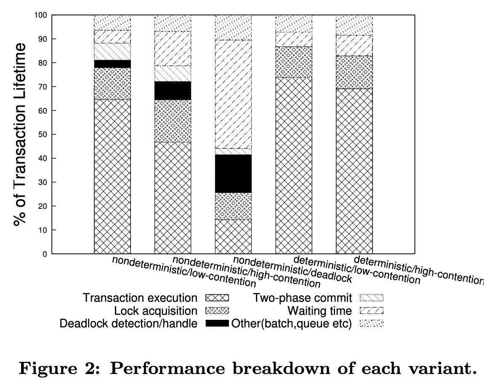
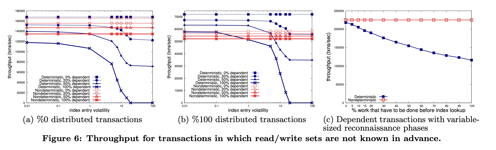

## AI论文解读 | An Evaluation of the Advantages and Disadvantages of Deterministic Database Systems
        
### 作者        
digoal        
        
### 日期        
2025-11-04        
        
### 标签        
PostgreSQL , PolarDB , DuckDB , AI , 论文解读        
        
----        
        
## 背景  
      
https://dl.acm.org/doi/pdf/10.14778/2732951.2732955        
  
提示:          
```          
读懂《An Evaluation of the Advantages and Disadvantages of Deterministic Database Systems》这篇论文需要提前掌握哪些基础知识, 请使用中文通熟易懂的讲解这些基础知识, 可以引用论文中的图、表或使用Markdown支持的图形(text,mermaid等)增加解释性. 
  
使用中文通熟易懂的解读《An Evaluation of the Advantages and Disadvantages of Deterministic Database Systems》这篇论文, 其中的关键内容请着重讲解, 可以引用论文中的图、表或使用Markdown支持的图形(text,mermaid等)增加解释性. 
  
提取《An Evaluation of the Advantages and Disadvantages of Deterministic Database Systems》这篇论文中的重要术语, 使用中文对这些术语进行通熟易懂的讲解, 可以引用论文中的图、表或使用Markdown支持的图形(text,mermaid等)增加解释性. 
```     
  
## 1 前置知识 
  
要读懂这篇论文《An Evaluation of the Advantages and Disadvantages of Deterministic Database Systems》 ，你需要对数据库系统和分布式系统的一些核心概念有基本的了解。这篇论文实质上是在比较两种设计数据库的“哲学思想”：

1.  **传统（非确定性）数据库**：就像一个繁忙的厨房，厨师们（事务）各自抢夺食材和厨具（数据和锁）。系统尽力保证最后能上菜（数据一致），但不保证每次做菜的顺序都一样。
2.  **确定性数据库**：像一条严格的自动化生产线。所有订单（事务）必须**预先排好队** ，然后严格按照这个顺序执行 。只要订单队列相同，生产结果（数据库状态）就绝对相同 。

这篇论文就是通过实验来对比这两种模式的优劣 。

以下是你需要提前掌握的基础知识，我会结合论文中的图表来解释为什么它们很重要。

-----

### 1\. 事务 (Transaction) 与 ACID

这是理解任何数据库论文的基础。

  * **事务 (Transaction)**：一系列数据库操作（如读取、写入、更新）的集合，这些操作被视为一个**不可分割的单元**。最经典的例子就是银行转账：从A账户扣款，给B账户加款。这两个操作必须“要么都成功，要么都失败”。
  * **ACID**：这是传统数据库对事务的四大保证：
      * **原子性 (Atomicity)**：事务不可分割（如上所述）。
      * **一致性 (Consistency)**：事务使数据库从一个有效状态变为另一个有效状态。
      * **隔离性 (Isolation)**：多个事务并发执行时，互不干扰，感觉就像只有自己在运行。
      * **持久性 (Durability)**：事务一旦提交，其结果就是永久的。

**为什么这很重要？**
论文开篇就提到，确定性执行提供了比传统ACID更强的保证 。ACID只保证事务等效于*某个*串行顺序，而确定性系统保证它等效于*唯一确定*的那个输入顺序 。

### 2\. 并发控制 (Concurrency Control)

这是论文的**第一个核心战场**：当多个事务同时运行时，如何保证隔离性 (Isolation)，防止数据被写乱？

  * **传统方式（非确定性）：锁 (Locking)**

      * 论文中的“非确定性”原型机使用了**两阶段加锁 (2PL)** 。
      * **通俗理解**：事务在访问数据前，必须先“上锁”（比如锁住A账户）。在事务结束前，它不能释放任何锁。
      * **核心问题：死锁 (Deadlock)** 。
          * 事务1 锁住了A，想等 B。
          * 事务2 锁住了B，想等 A。
          * 两者互相等待，系统卡死。传统数据库必须有“死锁检测”机制 ，然后强制“杀死”（回滚）一个事务来解开死锁 。

  * **确定性方式：按序加锁 (Ordered Locking)**

      * 确定性系统首先对所有事务进行全局排序（比如放进一个队列）。
      * 系统严格按照这个队列顺序来**依次请求锁** 。
      * **核心优势：避免死锁 (Deadlock Avoidance)** 。因为所有人都按顺序排队拿锁，永远不会出现上述的循环等待。
      * 这正是论文提到的确定性系统的**最大优势**之一 。

你可以这样理解两者的区别：



### 3\. 分布式事务 (Distributed Transactions)

这是论文的**第二个核心战场**：当一个事务需要跨越多台机器时（比如A账户在机器1，B账户在机器2），如何保证原子性（要么都成功，要么都失败）？

  * **传统方式：两阶段提交 (Two-Phase Commit, 2PC)** 

      * 这是一个协调协议。协调者先问所有机器：“你们能提交吗？”（**投票阶段**）。
      * 如果所有机器都说“能”，协调者再说：“大家一起提交！”（**提交阶段**） 。
      * **核心问题**：这个过程需要大量网络通信，非常缓慢且复杂 。

  * **确定性方式：日志复制 (Log Replication)**

      * 确定性系统不需要2PC。它们的设计思路是：既然所有副本（Replicas）都拿到了**完全相同的输入日志（事务队列）** ，并且它们的执行逻辑是**确定的** ，那么它们**不需要互相通信**，也能各自独立地达到完全一致的最终状态 。
      * **核心优势**：极大简化甚至消除了分布式提交协议 。

**为什么这很重要？**
请看论文的**图1(a)和1(b)** 。    

你会看到几条“Nondeterministic”（非确定性）的线。其中：

  * `Nondeterministic` (带三角的线) 代表使用 2PC 的传统系统。
  * `Nondeterministic w/o 2PC` (带方块的线) 代表一个*理想中*不需要 2PC 的传统系统（这在现实中不安全，只是为了做对比） 。

这两条线之间的**巨大性能差距** ，就显示了 2PC 协议的开销有多大。而确定性系统（`Deterministic`，带圆圈的线）从设计上就避免了这个开销。

### 4\. 核心权衡：延迟、吞吐量与灵活性

这篇论文的核心是评估“利弊” ，所以你需要理解以下几个关键的性能权衡：

  * **权衡1：延迟 (Latency) vs 吞吐量 (Throughput)**

      * **吞吐量 (Throughput)**：系统每秒能处理多少事务 (txns/sec)。**越高越好**。这是图1、3、4、5、6、8的Y轴 。
      * **延迟 (Latency)**：完成一个事务需要多长时间。**越低越好**。
      * **确定性系统的权衡**：
          * **坏处 (高延迟)**：因为它需要一个“预处理层” (preprocessing layer) 来给所有事务排序 ，这导致事务必须先排队，增加了**延迟** 。**图7**  清晰地显示，确定性系统（Deterministic）的延迟普遍高于非确定性系统（Nondeterministic） 。    
          * **好处 (高吞吐量)**：因为它避免了死锁  和 2PC ，在**高冲突**或**多分布式事务**的场景下（如图1中“% distributed transactions”很高时），它的**吞吐量**反而更高 。

  * **权衡2：灵活性 (Flexibility)**

      * **“未知”事务 (Dependent Transactions)**：如果一个事务不知道它要访问哪些数据（例如，通过二级索引查找用户），确定性系统就傻眼了，因为它没法在“预处理”阶段知道要锁什么。它必须用一个叫 OLLP 的技术  先“试运行”一遍 ，这会极大增加开销和延迟 。**图6**  专门测试了这种情况。    
      * **系统过载 (Overload)**：
          * 传统系统如果发现某台机器过载，可以**随意中止 (abort) 某些事务**来释放资源 。
          * 确定性系统**不能随意中止** ，因为中止是一个“非确定性”事件，会导致副本不一致 。
          * **图5(b)**  完美展示了这个问题：当一台机器变慢时（中间的低谷），确定性系统（Deterministic）的性能**暴跌** 。而非确定性系统如果开启了“节流”（Nondeterministic w/ throttling），可以通过中止本地事务来保持高吞吐量 。    

-----

### 总结：你需要的基础知识清单

为了看懂这篇论文的“神仙打架”，你需要先了解：

| 基础知识 | 为什么它很重要 (对应论文的核心观点) |
| :--- | :--- |
| **事务 (Transaction) & ACID** | 数据库的基本操作和保证，是讨论的起点 。 |
| **并发控制 (Concurrency Control)** | 理解“确定性”和“非确定性”在处理并发时的根本区别。 |
| **锁 (Locking) & 死锁 (Deadlock)** | 传统系统的主要性能瓶颈 ，也是确定性系统要解决的核心问题 。 |
| **分布式事务 & 2PC** | 跨机器时传统系统的另一个主要性能瓶颈 ，也是两种架构的关键差异点 。 |
| **吞吐量 (Throughput) & 延迟 (Latency)** | 衡量数据库“快不快”的两个核心指标，论文中的图表主要就是这两个 。 |
| **数据争用 (Contention)** | 指多个事务抢夺同一份数据。这是论文中一个关键的实验变量 。 |
| **复制 (Replication)** | 即数据备份。这是确定性系统最主要的设计动机之一（让备份变得简单） 。 |

最后，论文的 **表1 (Table 1)**  对这些优缺点做了非常好的总结，你可以先从这张表看起，它清晰地列出了确定性设计的“一体两面”（Advantage / Disadvantage）。    

希望这份指南能帮助你理解这篇论文！
  
## 2 解读论文 
  
这是一篇非常经典的数据库论文，它用一场“公平对决”的方式，深入探讨了“确定性数据库”和“传统数据库”各自的优缺点。

我会用最通俗易懂的方式为您解读这篇论文的核心内容。

### 核心思想：“先排队” vs “先抢座”

这篇论文对比了两种设计数据库的哲学思想 ：

1.  **传统（非确定性）数据库 (Nondeterministic)**：

      * **比喻：“先抢座”** 。
      * **工作方式**：当很多事务（比如“转账”、“查库存”）同时到达时，系统允许它们“同时开跑”，各自去抢夺自己需要的数据资源（通过“加锁”）。
      * **优点**：响应快（延迟低），因为事务可以立即开始执行 。
      * **缺点**：容易“打架”。比如两个事务互相等待对方手里的资源，导致**死锁 (Deadlock)** 。如果事务跨越多台机器（分布式事务），协调成本（如“两阶段提交”2PC）非常高 。

2.  **确定性数据库 (Deterministic)**：

      * **比喻：“先排队”** 。
      * **工作方式**：所有事务（无论来自哪里）必须先进入一个“预处理层” (preprocessing layer) 。这个层会给所有事务排一个**全局唯一的顺序**（比如放进一个日志）。所有机器严格按照这个顺序执行事务 。
      * **优点**：**永远不会死锁**（因为是按顺序拿资源）。分布式事务也变得简单，不需要复杂的2PC协议 。
      * **缺点**：“排队”本身需要时间，所以**延迟 (Latency) 更高** 。而且系统变得“死板”，缺乏灵活性 。

这篇论文的**最大贡献**在于，它在*同一个代码库* (Calvin) 中实现了这两种原型机 ，确保了实验对比的公平性（避免了“苹果对橘子”的比较 ）。



-----

### 论文的精髓：优缺点的“一体两面”

这篇论文的作者在 **表1 (Table 1)** 中就给出了一个完美的总结 。确定性系统的每一个特点几乎都同时带来了好处和坏处：    

| 确定性的特征 | 👍 优点 | 👎 缺点 |
| :--- | :--- | :--- |
| **事务必须按序获取锁** | **没有死锁 (No deadlocks)**  | **并发能力下降** (Reduced concurrency)  |
| **事务必须按输入日志顺序执行** | 日志本身就是“重做日志”，**简化了恢复** | **增加了延迟** (Increased latency)，因为要先经过预处理层  |
| **不允许非确定性中止** | **简化了提交协议** (Simplified commit protocols)，如2PC  | **无法随意中止事务**，比如在系统过载时  |

-----

### 关键实验解读（着重讲解）

这篇论文通过几个关键实验，清晰地展示了上述优劣势在实际中有多大影响。

#### 1\. 确定性的“王牌”：在高冲突下避免死锁 (图1, 图2)       

  * **实验内容**：测试在不同“分布式事务占比”和“数据冲突率 (contention)”下的系统吞吐量（每秒处理多少事务）。
  * **图1(a) 结果 (高冲突)**：
      * 观察“Nondeterministic, high contention”（带三角的线），当分布式事务（X轴）从0%增加时，它的吞吐量（Y轴） **急剧下降** 。
      * 而“Deterministic w/ VLL, high contention”（带方块的线）虽然也下降，但**性能始终高得多** 。
  * **为什么？请看图2 (性能分解)**：
      * 图2显示了“nondeterministic”系统在出现死锁时（`nondeterministic/high-contention deadlock`），绝大部分时间（浅灰色部分 `Waiting time`）都花在了 **“等待”** 上 。
      * **结论**：分布式死锁对传统系统的打击是**毁灭性**的 。确定性系统因为从设计上**避免了死锁** ，在高冲突、高分布式负载下获得了巨大的吞吐量优势 。

#### 2\. 确定性的“阿喀琉斯之踵” (1)：无法应对过载 (图5)

这是确定性系统最致命的弱点。

  * **实验内容**：在8台机器的集群中，**故意让其中1台机器变慢**（模拟CPU过载或硬件异构）。
  * **图5(b) 结果 (性能随时间变化)**：    
      * 在第15秒，"捣乱任务"开始，1台机器变慢 。
      * 确定性系统（`Deterministic`，蓝/红线）的**吞吐量瞬间崩溃** 。
      * 非确定性系统（`Nondeterministic`，深红/绿线）也崩溃了 。
      * **但是！** 观察黄线 (`Nondeterministic w/ throttling`)：它只下降了一点，很快**恢复到了接近正常的水平** 。
  * **为什么？**
      * **确定性系统（崩溃）** ：它必须按顺序执行。如果事务`#5`在慢机器上卡住了，所有机器上的`#6`、`#7`...都必须**停下等待**。整个集群的性能被“慢机器”拖垮了 。
      * **非确定性系统（恢复）** ：黄线代表的系统开启了“节流” (throttling) 。它可以**主动“中止” (abort) 那些在慢机器上运行的本地事务** ，释放资源去处理其他机器正在等待的**关键分布式事务** 。
  * **结论**：确定性系统**缺乏灵活性**，无法处理不可预测的“慢节点”或系统过载 。这是它在现实世界中（集群环境总是不均匀的）的巨大劣势 。

#### 3\. 确定性的“阿喀琉斯之踵” (2)：延迟与“未知”事务 (图7, 图6)

  * **(A) 延迟 (图7)**：    

      * 这张图显示了完成单个事务所需要的时间 。
      * **结果**：非确定性系统（`Nondeterministic`，红/粉线）的曲线**明显偏左**，意味着**延迟更低**（更快完成）。
      * **原因**：确定性系统（蓝/黑线）的事务必须先去“预处理层”排队，这增加了固有的延迟 。

  * **(B) “未知”事务 (图6)**：   

      * **问题**：确定性系统要求在事务开始前就知道它要读写哪些数据（以便正确排序）。但如果事务需要通过“二级索引”查找数据（比如“查询用户名为'Bob'的ID”），它就无法预知了。
      * **解决方案 (OLLP)**：确定性系统必须先“试运行”一次（称为“侦察阶段”）来找出要锁的数据 。
      * **图6(a) 结果**：非确定性系统（红线）的性能基本不受影响 。而确定性系统（蓝线）的性能随着“索引波动性”（即“试运行”结果出错的概率）的增加而**急剧下降** 。

  * **结论**：对于**延迟敏感型**应用 ，或者有大量**复杂查询**（无法预知读写集）的应用 ，确定性系统非常不适合。

-----

### 最终总结：没有银弹，只有取舍

这篇论文得出了一个非常清晰的结论：**没有哪种架构是绝对的赢家，它们适用于完全不同的场景** 。

  * **你应该选择 确定性 (Deterministic) 数据库，如果...**

      * 你的首要目标是**极高的吞吐量**（每秒处理海量事务）。
      * 你有大量的**分布式事务**和**高数据冲突**（它的“不死锁”优势能发挥到极致）。
      * 你可以容忍**较高的延迟**（比如后台批处理），并且你的集群环境非常**稳定、可预测** 。

  * **你应该选择 传统 (Nondeterministic) 数据库，如果...**

      * 你的应用对**延迟非常敏感**（比如在线交易、网页请求）。
      * 你的系统环境**不可预测**（比如云环境，机器性能随时波动），你需要系统有能力**灵活应对过载** 。
      * 你的事务逻辑**很复杂**（例如，大量依赖二级索引查询），无法在事务开始前就知道所有要访问的数据。

希望这个解读能帮助您理解这篇论文的精髓！
  
## 3 术语 
  
好的，这篇论文探讨了数据库设计中一个非常核心的权衡。我为您提取了其中最重要的术语，并用通俗易懂的中文进行讲解，同时引用论文中的图表来帮助理解。

-----

### 1\. 确定性 (Deterministic) vs. 非确定性 (Nondeterministic) 数据库

这是理解整篇论文的基石，代表了两种截然相反的数据库设计哲学。

  * **确定性数据库 (Deterministic Database)**

      * **通俗讲解**：就像一条严格的**自动化生产线**。只要给它相同的输入（事务请求），它保证**永远产生完全相同的最终状态** 。如果两条生产线（副本）收到完全相同的订单列表（输入日志），它们生产出的产品（数据库状态）也绝对一模一样。
      * **论文定义**：给定相同的事务性输入，数据库系统总是结束于相同的最终状态 。

  * **非确定性数据库 (Nondeterministic Database)**

      * **通俗讲解**：这是传统的数据库，就像一个繁忙的**厨房**。多个厨师（事务）同时在工作，他们会互相抢夺资源（数据、锁）。虽然最后菜（数据）都做好了，并且符合ACID标准，但每次运行，厨师们（事务）的内部执行顺序可能是不同的 。
      * **论文定义**：传统数据库只保证事务以*等效于某个串行顺序*的方式处理，但不同的数据库实例（或同个实例的不同次运行）可能等效于*不同的*串行顺序 。

### 2\. 复制 (Replication) 与 副本分歧 (Replica Divergence)

这是确定性数据库试图解决的核心问题之一。

  * **复制 (Replication)**
      * **通俗讲解**：为了防止单点故障（比如一台机器坏了）导致数据丢失或服务中断，我们会把数据复制多份，存在不同的机器上（这些机器互为“副本”，Replica）。
  * **副本分歧 (Replica Divergence)**
      * **通俗讲解**：这是传统（非确定性）复制的噩梦。想象一下，两个副本（厨房）收到了完全相同的订单。但由于网络延迟、线程调度等“非确定性”因素，它们内部处理订单的顺序不一致，最终导致做出来的菜（数据库状态）不一样了。
      * **确定性的优势**：确定性系统从根本上解决了这个问题。因为“相同的输入=相同的状态”，副本之间**无需通信协调**，只要保证它们接收到相同的输入（事务日志），就永远不会发生分歧 。

### 3\. 预处理层 (Preprocessing Layer) / 输入一致 (Agreement on Input)

这是确定性系统实现其承诺（“相同的输入”）所必须的组件，也是它的一个主要开销来源。

  * **通俗讲解**：为了保证所有副本都收到“相同的输入”，确定性系统必须有一个“**总调度室**”（预处理层）。所有客户端的事务请求都先发到这里，由它来**全局排序、打包**（通常是成批次），然后再广播给所有数据库节点 。

  * **带来的问题**：事务不能马上执行，必须先去“总调度室”排队。这个排队过程会**增加延迟 (Latency)** 。

  * **图示**：

    ```mermaid
    graph TD
        C1(客户端 A) --> Pre(预处理层 / 总调度室)
        C2(客户端 B) --> Pre
        C3(客户端 C) --> Pre
        Pre -- '1\.T_A, 2\.T_C, 3\.T_B' --> Log(排好序的事务日志)
        Log --> DB1(数据库副本1)
        Log --> DB2(数据库副本2)
        DB1 --> StateX(最终状态 X)
        DB2 --> StateX(最终状态 X)
    ```

### 4\. 死锁 (Deadlock) - 检测 vs. 避免

这是确定性系统相比传统系统最大的**性能优势**来源。

  * **死锁 (Deadlock)**
      * **通俗讲解**：在“厨房”模型（非确定性）中，事务A拿了锅（锁A），在等铲子（锁B）；同时事务B拿了铲子（锁B），在等锅（锁A）。两者互相等待，都卡住了。
  * **非确定性 (死锁检测)**：传统系统必须时刻“巡逻”（检测死锁），发现死锁后，还得“杀死”（中止）一个事务来解开这个僵局 。
  * **确定性 (死锁避免)**：在“生产线”模型（确定性）中，所有事务**必须按照预先排好的顺序去获取锁** 。就像排队打饭，排在前面的（事务A）先拿，拿完才轮到后面的人（事务B）。后面的人可以等，但绝不会发生“循环等待” 。
  * **论文佐证**：**避免死锁 (Deadlock avoidance)** 是确定性数据库获得可扩展性的**最大优势** 。在 **图1(a)和(b)** 中，当“高争用”(high contention)时，非确定性系统（Nondeterministic）的吞吐量急剧下降，这很大程度上就是由死锁（尤其是分布式死锁）造成的 。    

### 5\. 两阶段提交 (Two Phase Commit, 2PC)

这是传统（非确定性）系统处理“分布式事务”（跨机器事务）的标准方法，开销巨大。

  * **通俗讲解**：当一个转账事务需要操作两台机器（比如A在机器1，B在机器2）时，传统系统为了保证“原子性”（要么都成功，要么都失败），必须使用2PC。
    1.  **阶段一（投票）** ：协调者问所有机器：“你们能提交吗？”
    2.  **阶段二（提交）** ：如果都说“能”，协调者再通知大家：“一起提交！”
  * **确定性的优势**：确定性系统（由于上述的复制和故障处理机制）可以**极大简化甚至完全消除**这个协议 。这又是一个巨大的性能提升点。

### 6\. 事务中止 (Transaction Abort)

这是确定性系统最致命的**缺点**，体现了它的“死板”。

  * **通俗讲解**：“中止”是一个非确定性行为。如果允许系统随意中止事务（比如因为过载），那么一个副本可能中止了，另一个副本却成功了，两者状态就会**分歧** 。
  * **带来的问题**：确定性系统**不能随意中止事务**来应对突发状况，比如**系统过载** 。
  * **论文佐证**：**图5(b)** 完美展示了这个问题。    
      * 实验中，一台机器突然变慢（模拟过载）。
      * 确定性系统（`Deterministic`，蓝/红线） **性能瞬间崩溃** ，因为它必须等待那台慢机器完成任务（无法中止它）。
      * 而非确定性系统（`Nondeterministic w/ throttling`，黄线）可以通过**主动中止**慢机器上的本地事务来“丢车保帅”，释放资源处理关键任务，从而**维持了高吞吐量** 。

### 7\. 读写集 (Read/Write Sets) / 依赖型事务 (Dependent Transactions)

这是确定性系统面临的另一个**实现难题**。

  * **读写集**：指一个事务将要读取和写入的数据项集合。
  * **难题**：确定性系统为了高效地按顺序加锁，通常需要**提前知道**事务的读写集 。
  * **依赖型事务 (Dependent Transactions)**：指那些**无法提前知道**读写集的事务 。
      * **例子**：`UPDATE users SET points = 100 WHERE city = 'Beijing'`。在执行前，你根本不知道`city = 'Beijing'`的用户有哪些，也就无法提前锁定他们 。
  * **OLLP (Optimistic Lock Location Prediction)**：论文中提到的一种解决方案 。
      * **通俗讲解**：分两步走。先“**侦察**”（试运行）一次，看看事务到底访问了哪些数据 。然后带着这个“预测”的读写集，再去“**正式执行**” 。
      * **缺点**：“侦察”本身消耗资源，增加了延迟 。而且如果“侦察”和“执行”期间数据变了（如 **图6** 中“index entry volatility”增加时），预测就会失败，事务必须中止重试，导致性能下降 。    

### 8\. 争用指数 (Contention Index, CI)

这是论文实验中衡量“数据冲突激烈程度”的关键指标。

  * **通俗讲解**：实验中，数据被分为“热数据”（很多人抢）和“冷数据”（没人抢）。
  * **定义**：CI = $1/K$ ，其中 $K$ 是热数据的总数 。
      * **高争用 (High Contention)**： $CI=0.01$ （K=100）。意味着只有100个热数据，大家抢破头的概率很高 。
      * **低争用 (Low Contention)**： $CI=0.0001$ （K=10000）。意味着有10000个热数据，大家撞到一起的概率很低 。
  * **意义**：这个术语是理解**图1**系列实验的前提。这些图显示，确定性系统在“高争用”时优势最大（因为避免了死锁），而在“低争用”时优势不明显。    
  
## 参考        
         
https://dl.acm.org/doi/pdf/10.14778/2732951.2732955    
        
<b> 以上内容基于DeepSeek、Qwen、Gemini及诸多AI生成, 轻微人工调整, 感谢杭州深度求索人工智能、阿里云、Google等公司. </b>        
        
<b> AI 生成的内容请自行辨别正确性, 当然也多了些许踩坑的乐趣, 毕竟冒险是每个男人的天性.  </b>        
    
#### [期望 PostgreSQL|开源PolarDB 增加什么功能?](https://github.com/digoal/blog/issues/76 "269ac3d1c492e938c0191101c7238216")
  
  
#### [PolarDB 开源数据库](https://openpolardb.com/home "57258f76c37864c6e6d23383d05714ea")
  
  
#### [PolarDB 学习图谱](https://www.aliyun.com/database/openpolardb/activity "8642f60e04ed0c814bf9cb9677976bd4")
  
  
#### [PostgreSQL 解决方案集合](../201706/20170601_02.md "40cff096e9ed7122c512b35d8561d9c8")
  
  
#### [德哥 / digoal's Github - 公益是一辈子的事.](https://github.com/digoal/blog/blob/master/README.md "22709685feb7cab07d30f30387f0a9ae")
  
  
#### [About 德哥](https://github.com/digoal/blog/blob/master/me/readme.md "a37735981e7704886ffd590565582dd0")
  
  

  
