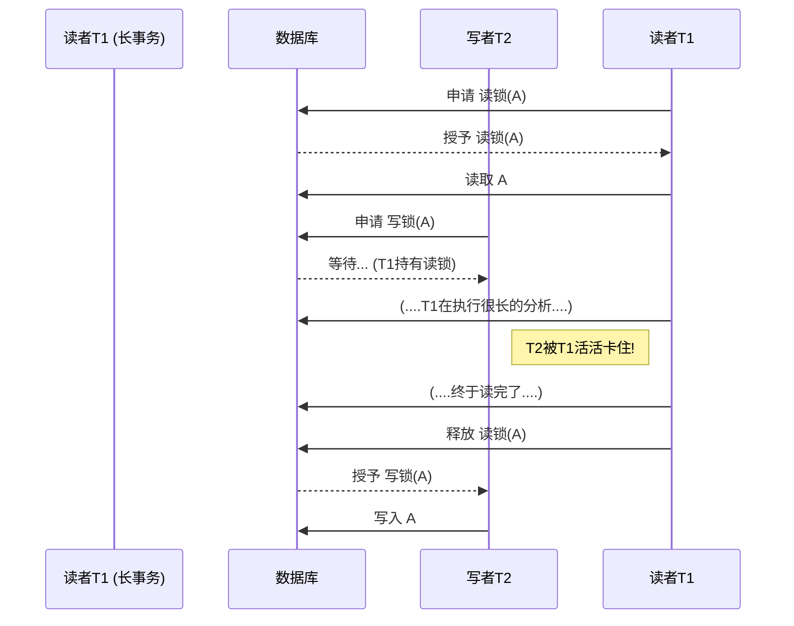
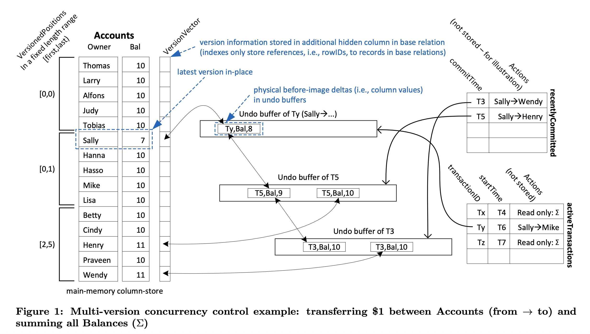
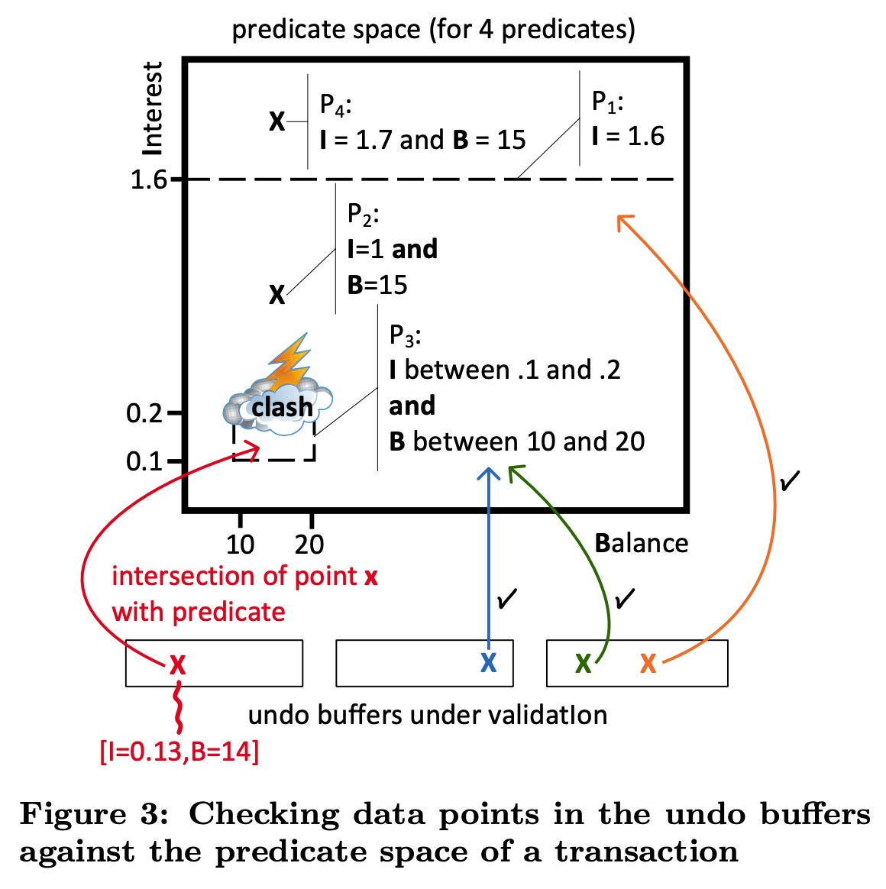
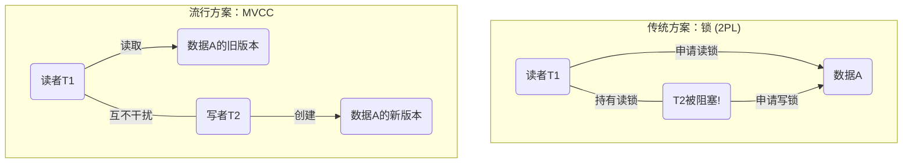
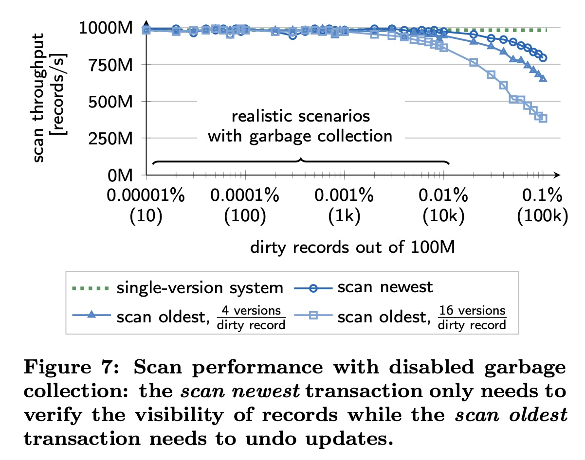
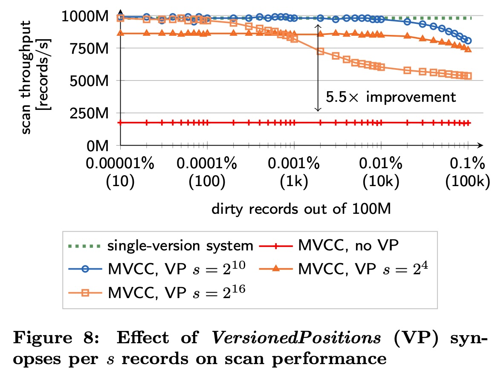
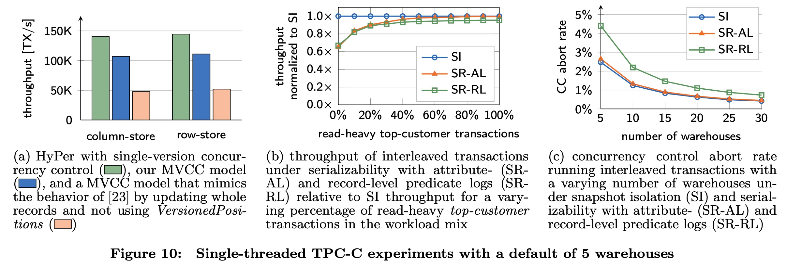
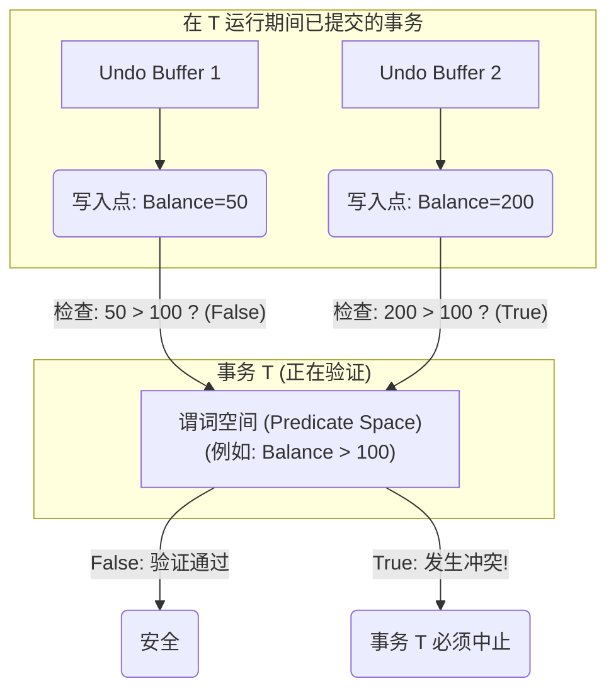
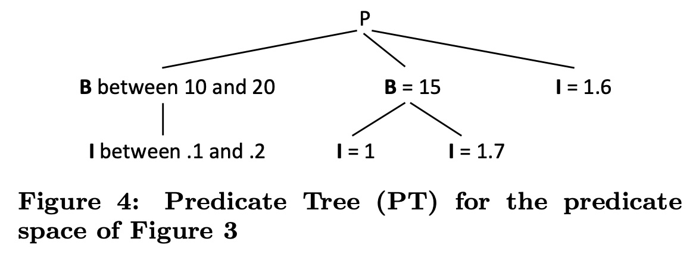

## AI论文解读 | Fast Serializable Multi-Version Concurrency Control for Main-Memory Database Systems
        
### 作者        
digoal        
        
### 日期        
2025-11-04        
        
### 标签        
PostgreSQL , PolarDB , DuckDB , AI , 论文解读        
        
----        
        
## 背景  
      
https://dl.acm.org/doi/pdf/10.1145/2723372.2749436        
  
提示:          
```          
读懂《Fast Serializable Multi-Version Concurrency Control for Main-Memory Database Systems》这篇论文需要提前掌握哪些基础知识, 请使用中文通熟易懂的讲解这些基础知识, 可以引用论文中的图、表或使用Markdown支持的图形(text,mermaid等)增加解释性. 
  
使用中文通熟易懂的解读《Fast Serializable Multi-Version Concurrency Control for Main-Memory Database Systems》这篇论文, 其中的关键内容请着重讲解, 可以引用论文中的图、表或使用Markdown支持的图形(text,mermaid等)增加解释性. 
  
提取《Fast Serializable Multi-Version Concurrency Control for Main-Memory Database Systems》这篇论文中的重要术语, 使用中文对这些术语进行通熟易懂的讲解, 可以引用论文中的图、表或使用Markdown支持的图形(text,mermaid等)增加解释性. 
```     
  
## 1 前置知识 
  
要透彻理解这篇论文 （一篇关于内存数据库并发控制的经典之作），你需要先掌握一些数据库领域的基础知识。

这篇论文的核心是提出了一种 **既快又能保证最高隔离级别（可串行化）的多版本并发控制（MVCC）方案，尤其适用于内存数据库（Main-Memory Database）** 。

下面，我将为你通俗易懂地讲解你需要储备的 8 个关键基础知识点。

-----

### 1\. 什么是事务 (Transaction)？

你可以把“事务”想象成一个 **“任务包”** ，这个包里包含了一系列数据库操作（比如，转账操作包含“A账户减钱”和“B账户加钱”）。

这个任务包必须遵守 **ACID** 原则，即：

  * **原子性 (Atomicity):** 任务包里的所有操作，要么**全部成功**，要么**全部失败**（回滚到初始状态）。转账不能只减钱不加钱。
  * **一致性 (Consistency):** 事务执行前后，数据库都必须保持在“正确”的状态（比如，A和B的总金额不变）。
  * **隔离性 (Isolation):** 关键点！当很多事务（任务包） **同时** 运行时，它们不应该互相干扰 。A转B的同时，C也在转D，大家不该把数据搞乱。
  * **持久性 (Durability):** 事务一旦成功提交，结果就是永久的，即使系统崩溃也不会丢失。

这篇论文要解决的核心问题，就是如何高效地实现**隔离性 (Isolation)**。

-----

### 2\. 为什么需要并发控制 (Concurrency Control)？

当只有一个用户时，世界是美好的。但现实中，数据库每时每刻都有成百上千的“任务包”在同时运行。如果不加控制，就会天下大乱，比如：

  * **更新丢失：** 你和我同时给一个商品A（库存10）补货，你补5个，我补10个。如果我俩都读取了“10”，然后你写回“15”，我后写回“20”。你补的5个就“丢失”了。
  * **脏读：** 你修改了数据但还没提交（任务包还没封口），我却读取了你“改到一半”的数据。万一你最后决定撤销（回滚），我读到的就是“脏”数据。

**并发控制**的**目的**，就是设计一套规则，在允许多个事务同时运行（并发）的前提下，保证结果和它们“一个一个排队运行”（串行）的结果是一样的。

-----

### 3\. 黄金标准：可串行化 (Serializability)

**可串行化**是数据库隔离性的**最高级别** 。

它向用户承诺：“你尽管同时提交任务，我（DBMS）保证最后的结果，一定等同于你把这些任务**按*某种*顺序一个一个排队执行**的结果。”

这是最安全、最省心的保证。但这篇论文也指出，这个黄金标准“实现起来代价高昂” (hard to implement efficiently) 。

-----

### 4\. 经典方案：锁 (Locking)

为了实现“可串行化”，最经典的方法就是 **“加锁”** ，特别是 **两阶段锁定 (2PL)** 。

  * **规则很简单：** 你要读数据A？先加个“读锁”。你要写数据A？先加个“写锁”。
  * **锁的冲突：** “读锁”和“读锁”不冲突（大家可以一起读）。但“写锁”和“读锁”、“写锁”和“写锁”都冲突。
  * **问题来了：** 论文明确指出了锁的**巨大缺点**： **“读和写会互相阻塞” (readers and writers block each other)** 。

想象一下“读写阻塞”的场景：



在读写频繁的系统中，这种阻塞会严重拖累性能。

-----

### 5\. 论文的核心：多版本并发控制 (MVCC)

为了解决“读写阻塞”问题，**MVCC (Multi-Version Concurrency Control)** 诞生了 。

  * **核心思想：** 不用锁！当“写者”要修改数据时，**它不去覆盖旧数据**，而是**创建一个新版本**的数据 。

  * **最大好处：** **“读”绝不阻塞“写”，“写”也绝不阻塞“读”** 。

      * “读者”T1来了，它要读数据A。系统说：“T1你早上8点来的，你就看8点那个版本的数据吧。”
      * “写者”T2来了，它要修改数据A。系统说：“没问题，你改吧，我给你创建个9点的新版本。”
      * T1和T2**完美地错开了**，T1读它的旧版本，T2写它的新版本，互不干扰！

  * **这篇论文的特殊实现 (见图1)：**    

      * 传统的MVCC是创建新版本。这篇论文为了**内存数据库**的扫描性能，采用了一种更巧妙的方式： **“原地更新” (latest version in-place)** 。
      * 但是，它会把**修改前的“旧数据” (before-image deltas)** 存到一块叫 **`Undo buffer`** 的地方 。
      * 如图1所示，`Version Vector`  像个链表头，指向了`Undo buffer`中这条数据的“前世今生” 。
      * 当一个“读者”事务（比如T4）启动时 ，它会根据自己的`startTime` ，从`in-place`的最新数据开始，利用`Undo buffer`里的旧数据，一路“倒退”回滚，直到找到它“出生时”该看到的那个版本 。

 

-----

### 6\. MVCC的“妥协”：快照隔离 (SI)

MVCC虽然解决了读写阻塞，但大多数系统（如Oracle, PostgreSQL）默认只提供一个 **“快照隔离” (Snapshot Isolation, SI)** 的级别 。

  * **什么是SI？** 就是上面说的，每个事务都只能看到它**启动那一刻**的数据库“快照” 。
  * **SI的问题？** 论文指出，SI 不是 **完全的“可串行化”** 。它很美好，但有极少数情况下（称为“写偏斜”等异常）会导致数据出错，而这些错误是“可串行化”绝不会允许的。
  * **难题：** 把SI“升级”到完全的“可串行化”，代价“高得吓人” (prohibitively expensive) 。

**这篇论文的重点，就是要找到一种*廉价*的方法，把SI升级到“可串行化”。**

-----

### 7\. 论文的舞台：内存数据库 (Main-Memory DB)

这篇论文的方案是为**内存数据库** (MMDB) 设计的 。

  * **和传统数据库的区别：** 传统数据库数据在磁盘上，I/O是瓶颈。内存数据库所有数据都在RAM里，速度快到飞起。
  * **为什么重要？**
    1.  在内存里，CPU和缓存(Cache)才是瓶颈，而不是I/O。
    2.  内存数据库**非常依赖全表扫描**（因为太快了）。
    3.  因此，任何并发控制方案**都绝不能拖慢“扫描”的速度**。

这就是为什么论文花大力气设计“原地更新”  和 "VersionedPositions"（一种快速跳过旧版本的索引），目的就是为了保持极高的扫描性能。

-----

### 8\. 论文的“绝招”：基于谓词的验证 (Predicate Validation)

终于到了论文的**核心创新点** 。

还记得吗？SI的“升级”代价很高，因为传统方案需要跟踪一个事务**读过的所有数据 (Read Set)** 。如果一个事务扫描了10亿条数据，光是“记账”的开销就受不了。

这篇论文的“绝招”是：
**“我不管你读了多少，我只关心你*问了什么问题*。”**

  * **什么是“问题”？** 就是 **“谓词” (Predicate)** 。

  * “谓词”就是你SQL语句里的`WHERE`条件。

      * `SELECT ... WHERE Balance > 100`，你的“谓词”就是 `Balance > 100`。
      * `SELECT ... WHERE Type = 'A' AND Date < '2025-01-01'`，你的“谓词”就是 `Type='A' AND Date < ...`。

  * **验证过程 (见图3)：**    

    1.  事务T在运行时，不记录它读过的10亿行数据，只记录它用的“谓词” （ 比如图3里的 $P_{1}$ , $P_{2}$ , $P_{3}$ , $P_{4}$ ）。这形成了一个“谓词空间” (predicate space) 。
    2.  当T准备提交时，它会去检查在它“运行期间”，**别的事务**都“写”了哪些新数据（这些新数据都记录在那些事务的 `Undo buffers` 里 ）。
    3.  **核心检查：** 如图3所示，T会检查那些“新写”的数据点(X)，**是否会落入我T的“谓词空间”里？** 
    4.  **结果：**
          * **如果落入了**（如图3的"clash" ），说明T“刚读过的数据”已经被别人改了（这叫“幻读”）。T的快照已经“过时”了，T**必须中止 (Abort)** 。
          * **如果都没落入**，说明T的“所见”依然是“真实”，T**可以安全提交 (Commit)**。

A data point 'x' from an undo buffer clashes with predicate P3.] 

这种方法极其高效，因为它检查的`Undo buffers`（写集）通常很小，而它完美地避免了跟踪庞大的“读集” 。

-----

### 总结

你需要理解：

1.  **事务 (ACID)** 是基础。
2.  **并发控制**是为了解决“隔离性”问题。
3.  **可串行化**是最高目标，但**锁 (2PL)** 方案因“读写阻塞”  而性能不佳。
4.  **MVCC** 通过“多版本”解决了“读写阻塞” ，但通常只实现**快照隔离 (SI)**。
5.  SI **不是**可串行化的，有安全漏洞 。
6.  在**内存数据库**中，方案必须对“扫描”友好。
7.  **本文的贡献：** 提出了一种基于**谓词 (Predicate) 验证**的**廉价**方法，在 MVCC (SI) 的基础上实现了**完全的可串行化** ，且对内存数据库的扫描性能影响极小 。

理解了这8点，你就抓住了这篇论文的脉络，可以开始阅读正文了。

您希望我详细解释以上任何一个知识点，还是讨论论文中的其他部分（例如它如何处理索引  或如何进行垃圾回收 ）？
  
## 2 解读论文 
  
这是一篇来自数据库顶级会议 SIGMOD 2015 的高影响力论文，它提出了一种为**内存数据库 (Main-Memory Database)** 设计的，既能实现**完全可串行化 (Serializability)** 隔离级别，又**速度极快**的**多版本并发控制 (MVCC)** 方案 。

用一句话总结这篇论文的贡献：

> 它巧妙地利用了 Undo Buffer（撤销日志）和一种新颖的“谓词验证”技术，解决了“快照隔离 (SI)” 升级到“完全可串行化”时性能会“高得吓人”的传统难题 。它证明了，在内存数据库中，我们几乎不再需要在安全的可串行化和高性能的快照隔离之间做妥协 。

-----

### 1\. 问题的背景：高性能与高安全性的“两难”

在数据库中，多个事务（任务）同时运行时，需要“隔离”（Isolation）来保证数据不错乱 。

  * **最高安全标准（黄金标准）：** “可串行化” (Serializability)。它保证并发执行的结果，一定等同于“一个一个排队”执行的结果 。这是最安全的，但传统实现（如两阶段锁 2PL）性能很差，因为“读”和“写”会互相阻塞 。
  * **高性能方案：MVCC**。为了解决“读写阻塞”，诞生了“多版本并发控制” (MVCC) 。
      * **核心思想：** 写入（Update）时不直接覆盖旧数据，而是创建新版本 。
      * **巨大优势：** 读者（Reader）永远不会阻塞写入者（Writer），反之亦然 。这对于读多写少的负载非常棒。




  * **MVCC 的“妥协”：快照隔离 (SI)**。
    MVCC 虽好，但大多数系统（如 Oracle、PostgreSQL）默认只提供了“快照隔离” (SI) 。SI 简单理解就是：每个事务只能看到它启动那一刻的数据库“快照” 。
      * **SI 的问题：** SI **不是** 100% 安全的。在某些情况下（如“写偏斜”），它会允许一些不“可串行化”的结果，导致数据不一致 。
      * **升级的代价：** 业界都知道 SI 有问题，但想把它“升级”到完全的可串行化，代价“高得吓人” (prohibitively expensive) 。传统方案要求数据库跟踪一个事务**读过的所有数据 (Read Set)** 。如果一个事务扫描了10亿条数据，光是“记账”的开销就无法承受 。

**本文要解决的核心矛盾：** 如何在 MVCC 架构下，以**极低的成本**，将“快照隔离 (SI)” 升级为“完全可串行化”？

-----

### 2\. 关键内容一：巧妙的版本维护（省空间、快扫描）

传统 MVCC 为了维护多版本，要么把新版本写到新地方，要么把旧版本挪走。这在内存数据库中会破坏数据连续性，严重拖慢“全表扫描”的速度。

本文提出了一种为“扫描性能”优化的版本维护方式，我们可以从 **论文图1** 中看懂它：    

**核心设计有三点：**

1.  **“原地更新” (In-place update)：**
    一个数据项**最新**的版本，永远保存在主表（图中的 `Accounts` 表）的“原地” 。
      * *好处：* 对于新启动的事务，读取最新数据时，就和单版本系统一样快，扫描性能极高 。
2.  **“Undo Buffer” 存旧版本：**
    当一个事务（如 T5）要修改数据时（比如把 Sally 的 Bal 从 9 改成 8），它会先把**旧值 (9)**（称为"before-image delta"，即物理前镜像）存入自己的 `Undo buffer` 中 。
      * *好处：* 这个 `Undo buffer` 本来就是为了“事务回滚” (Rollback) 而存在的 。现在论文把它“废物利用”，顺便用来存历史版本，几乎**没有额外的存储开销** 。
3.  **“Version Vector” 串联历史：**
    `Accounts` 表旁边有个隐藏的 `Version Vector`（版本向量）。它就像一个指针，指向这个数据项“最新的旧版本”在 `Undo buffer` 里的位置 。
      * *如图1所示：* `Accounts` 表中 Sally 的 Bal 最新值是 7 。
      * `Version Vector` 指向 `Ty,Bal,8`（事务 `Ty` 把它从 8 改成了 7）。
      * `Ty,Bal,8` 这条记录又指向 `T5,Bal,9`（事务 `T5` 把它从 9 改成了 8）。
      * `T5,Bal,9` 又指向 `T3,Bal,10`（事务 `T3` 把它从 10 改成了 9）。
      * 这就形成了一条“版本链”，串起了数据的“前世今生” 。

**读者如何获取数据？**
当一个老事务（如 T4，它在 T5 和 Ty 之前启动）来读 Sally 的数据时 ，它会：

1.  读取“原地”的最新值 7 。
2.  顺着 `Version Vector` 链条回溯 。
3.  它看到 `Ty` 的修改，因为 `Ty` 的时间戳（一个大数）\> T4 的 `startTime`，它应用 `Ty` 的 undo，把 7 还原成 8 。
4.  它看到 `T5` 的修改，因为 `T5` 的 `commitTime` \> T4 的 `startTime` ，它应用 `T5` 的 undo，把 8 还原成 9 。
5.  它看到 `T3` 的修改，因为 `T3` 的 `commitTime` \< T4 的 `startTime` ，它知道 9 就是它应该看的值，停止回溯 。

-----

### 3\. 关键内容二：廉价的可串行化验证（本文“绝招”）

这是本文最核心的创新。它解决的是 SI 无法解决的“幻读” (Phantom) 问题。

  * **传统（昂贵）方案：** 跟踪事务的“读集” (Read Set) 。事务 T 扫描了10亿行数据（`WHERE c=1`），就必须“锁住”这10亿行，或者至少把这10亿行都“记下来” 。如果此时有别人插入了一行 `c=1` 的新数据，T 就必须中止。这个“记账”成本太高 。

  * **本文（廉价）方案：** 我不关心你“读了多少数据”，我只关心你 **“用什么条件读的”** 。
    这个方案源自一种叫“精度锁” (Precision Locking) 的思想 。

**验证过程（参见论文图3）：**    

1.  **Step 1: 记录“谓词” (Log Predicates)**
    当事务 T 在运行时，它**不记录**它读过的海量数据，而是**只记录**它用来读数据的“谓词”（即 `WHERE` 语句） 。

      * 如图3所示，T 用了 P1, P2, P3, P4 四个谓词来读取数据 。比如 P3 是：`I between .1 and .2 AND B between 10 and 20` 。
      * 这四个谓词共同构成了 T 的“读取空间” (Predicate Space) 。

2.  **Step 2: 检查“写集” (Validate against Write Sets)**
    当 T 准备提交时，它必须检查：在我运行期间（从我的 `startTime` 到我的 `commitTime`），有没有**其他事务**提交了 **“写操作”** （增、删、改），而这些“写操作” **“侵入”** 了我的“读取空间”？ 

      * **如何检查？** T 会查看系统的 `recentlyCommitted`（最近提交）列表 （见图1 ）。    
      * T 遍历这些“最近提交”事务的 `Undo buffers` 。
      * 对于 `Undo buffer` 中的**每一条**修改/插入/删除的记录（即图3下方的 `x` 点），T 都会拿这个 `x` 点的值（如 `[I=0.13, B=14]` ）去**代入**自己的“谓词”中进行计算 。

3.  **Step 3: 发现冲突 (Clash\!)**

      * 如图3所示，T 发现，某个 `Undo buffer` 里的 `x` 点 `[I=0.13, B=14]` **满足 (satisfies)** 了自己的谓词 P3 。
      * **“Clash”（冲突）发生了！** 
      * **这说明了什么？** 这说明 T 读完数据后，别人（T'）插入或修改了一个 *本应该* 被 T 读到的数据（即“幻读”）。T 在 `startTime` 看到的“快照”已经“过时”了，不符合可串行化。
      * **结果：** 事务 T **必须中止 (Abort)** 。如果检查完所有 `Undo buffers` 都没有 `Clash`，T 才能安全提交。

**这个方案为什么廉价？**
它的验证成本，只取决于“最近提交事务的**写集**大小” ( $|W|$ ) ，而 **不是** “当前事务的 **读集** 大小” ( $|R|$ ) 。
在现代“读多写少” (read-heavy) 的负载中 ，写集通常非常小，而读集（扫描）可能巨大。这个方案完美地抓住了这一点。

-----

### 4\. 关键内容三：为高速扫描而生的 "Versioned Positions"

这篇论文是为内存数据库设计的，而内存数据库的“命根子”之一就是极快的扫描速度 。

  * **问题：** 即使使用了“原地更新”，在扫描时，CPU 依然需要检查**每一行**的 `Version Vector` 是不是 `null` 。这个“检查” (if-else) 操作会严重干扰 CPU 的流水线（分支预测失败），拖慢扫描速度。

  * **解决方案：Versioned Positions (VP) 概要**
    这是一种“概要” (Synopses) 结构，如图1左侧所示 。

    1.  系统将表数据按“固定范围”（如 1024 行）分块 。
    2.  对于每一块，用一个 `VersionedPositions` 条目来记录 **“该块中第一个被修改的行号”** 和 **“最后一个被修改的行号”** 。
    3.  如图1，`[0, 5)` 这 5 行（Thomas 到 Tobias）的 VP 是 `(0,0)`（在图1中被`{0,0)`的`VersionedPositions`条目所代表，但原文图示为`[0,0)`） 。原文中`[0,0)`表示`first`和`last`相同，表示该范围没有版本 。
    4.  `[2, 5)` 范围（Henry 到 Wendy）的 VP 记录了范围 `(2,5)`，表示从第2行到第5行有版本 。*(注：图1的(2,5)更像是行号范围，而VP条目记录的是该范围内的修改位置)*

  * **扫描时如何工作？** 

    1.  扫描代码启动，先查看 VP 条目。
    2.  如果 VP 是 `(0,0)`（ 表示这个 1024 行的块 **“纯净无污染”** ），扫描代码会进入一个“极速模式”循环，**不带任何 if-else 检查**，全速扫描这 1024 行 。
    3.  如果 VP 是 `(2,5)`，扫描代码会：全速扫描 0-1 行 -\> 进入“慢速模式”检查 2-5 行的 `Version Vector`  -\> 再次全速扫描该块的剩余行。
    4.  这确保了在数据修改稀疏时（大部分情况），扫描性能几乎不受影响 。

-----

### 5\. 结论与影响

论文通过实验证明了他们方案的优越性：

1.  **扫描性能 (图7)：** 在合理数量的修改下（0.1%），扫描性能几乎与“单版本”系统持平 。    
2.  **VP 优化效果 (图8)：** 使用 VP 概要，比“逐行检查”的 MVCC 扫描**快了 5.5 倍** 。    
3.  **可串行化的代价 (图10b)：** 这是**最震撼**的结果。从 SI（快照隔离）升级到 SR-AL（本文的属性级可串行化），性能**几乎没有下降**（吞吐量保持在 SI 的 95% 以上）。    
4.  **TPC-C 性能 (图10a)：** 在写密集的 TPC-C 测试中，本文方案的吞吐量远超其他 MVCC 仿品（如 Hekaton 模式）和 2PL 。

**最终结论：** 这篇论文提供了一个非常高效的、可串行化的 MVCC 实现，它性能极高、开销极低。它有力地证明了，对于内存数据库而言，开发者**不再需要为了性能而牺牲数据一致性**，可以直接使用“完全可串行化”这个最高隔离级别 。
  
## 3 术语 
  
很高兴能为您从这篇技术论文《Fast Serializable Multi-Version Concurrency Control for Main-Memory Database Systems》中提取重要术语, 并用通俗的中文进行讲解。

这篇论文的核心贡献是提出了一种为**内存数据库**设计的, 既能实现**完全可串行化** (Serializability), 又几乎和普通的**快照隔离** (SI) 一样快的 **MVCC** (多版本并发控制) 机制 。

以下是论文中的关键术语及其讲解:

### 1\. 核心并发控制概念

#### 🔸 多版本并发控制 (Multi-Version Concurrency Control, MVCC)

  * **通俗讲解:** 这是一种管理数据并发访问的流行技术 。
  * 想象一下, 在没有 MVCC 的情况下 (例如使用锁), 当一个人 (写入者) 正在修改某行数据时, 其他所有人 (读取者) 都必须排队等待, 直到他改完为止 。
  * **MVCC** 解决了这个问题。它通过为数据保留多个 "版本" (Version) 来实现 。当写入者在创建一个**新版本**时, 读取者可以同时去读取他所需要的那个**旧版本** 。
  * **核心优势:** 实现了 "读不阻塞写, 写不阻塞读" 。

#### 🔸 快照隔离 (Snapshot Isolation, SI)

  * **通俗讲解:** 这是 MVCC 系统最常提供的一种隔离级别 。
  * 它就像是给每个事务拍了一张 "快照" (Snapshot)。事务只能看到在它开始那一刻, 数据库已经提交的数据状态 。
  * SI 解决了大多数并发问题, 但它**不是完美**的。在某些情况下, 它仍然会允许一些不符合 "可串行化" 的异常情况 (即数据"不一致") 发生 。

#### 🔸 可串行化 (Serializability)

  * **通俗讲解:** 这是数据库隔离级别的 "黄金标准", 也是最严格的级别 。
  * 它向用户保证, 即使有成百上千个事务在同时运行, 其最终结果也**等同于**把这些事务一个接一个地 (串行) 执行 。这能防止所有已知的并发异常, 确保数据的绝对一致性 。
  * **挑战:** 实现可串行化通常非常困难, 且代价高昂, 会严重影响性能 。而这篇论文的目标就是让它变得 "又快又便宜" 。

-----

### 2\. 论文提出的 MVCC 实现机制

#### 🔹 原地更新 (In-place Updates)

  * **通俗讲解:** 这是本文实现 MVCC 的一个关键选择。
  * 很多 MVCC 系统在修改数据时, 会在新的内存地址创建一条 "新版本" 记录。而本文的方法是: 直接在数据**原来的位置**上进行修改 (即 "原地更新") 。
  * **优势:** 保持了数据在内存中的紧凑和连续性, 这对于需要高速扫描数据的分析类查询 (OLAP) 至关重要 。

#### 🔹 Undo 缓冲区 (Undo Buffers)

  * **通俗讲解:** 既然数据被 "原地更新" 了, 那么修改前的 "旧版本" 数据去哪了?
  * 答案是: 它们被作为 "前像" (before-image deltas) 存储在了该事务的 **Undo 缓冲区** (或称 Undo 日志) 中 。
  * 这就像是你在编辑文档时, 系统为你保存的 "撤销" (Undo) 记录。这些记录不仅用于事务失败时回滚 , 更重要的是, 它们被用来给其他事务重建它们需要的旧版本 。

#### 🔹 版本向量 (Version Vector)

  * **通俗讲解:** 这是一个核心数据结构, 用来串联一个数据的所有历史版本。
  * **如图1所示:** 在主表 (Accounts) 旁边, 有一个隐藏的 "Version Vector" 列 。它为表中的每一行都维护一个指针 。    
      * 如果某行数据没被修改过 (如 `Thomas`), 指针为空。
      * 如果被修改过 (如 `Sally`), 指针会指向**最新的那个旧版本** (存储在 `Ty` 的 Undo 缓冲区中, 值为8) 。而那个版本又会指向 "更旧" 的版本 (在 `T5` 缓冲区, 值为9) , 依此类推, 形成一个 "版本链" 。
  * 当一个事务需要读取 `Sally` 的旧版本时, 它就会顺着这个版本链回溯, 直到找到符合它 "快照" 时间的版本 。

-----

### 3\. 创新的可串行化验证机制

这是本文的**核心创新点** 。

#### 🔸 精确锁定 (Precision Locking)

  * **通俗讲解:** 这是一种用于实现可串行化的老技术 , 本文对其进行了改造和应用 。
  * 传统思想是 "锁定" 你读过的东西。而 "精确锁定" 的思想是:
    > "我 (事务 T) 不锁定我读过的东西, 但我必须在我提交时确保, 在我运行期间, 没有任何其他事务**写入** (Write) 了任何**满足我读取条件** (Read Predicate) 的数据。" 
  * 这个 "读取条件" (比如 `WHERE balance > 100`) 就是 "谓词" (Predicate)。

#### 🔸 谓词日志 (Predicate Logging) & 谓词空间 (Predicate Space)

  * **通俗讲解:** 为了实现上述的 "精确锁定" 检查, 系统必须知道事务 "读取了什么范围"。
  * **谓词日志 (Predicate Logging):** 事务在运行时, 会把它的所有 `WHERE` 查询条件 (即 "谓词") 记录在一个日志中 。
  * **谓词空间 (Predicate Space):** 该事务记录的所有谓词组合起来, 就定义了它所 "关心" 的数据范围, 这就是它的 "谓词空间" 。
  * **如图3所示:** 图中的大方框代表一个事务 T 的谓词空间 , 它由四个谓词 (P1, P2, P3, P4) 共同定义 。    

#### 🔸 可串行化验证 (Serializability Validation)

  * **通俗讲解:** 这是事务提交前的 "期末考试", 用以保证可串行化 。
  * **验证过程:** 事务 T 准备提交。系统会遍历在 T 运行期间 (T 的 startTime 和 commitTime 之间 ) 已提交的其他事务的 **Undo 缓冲区** 。
  * 系统会检查这些 Undo 缓冲区中的 "写入点" (即图3中那些 `x` 点 ) 是否 "闯入" 了 T 的谓词空间 (大方框) 。    
  * **如图3所示:** 左下角的 `x` 点 (`[I=0.13, B=14]`)  满足了谓词 P3 (`I between .1 and .2 AND B between 10 and 20`) , 发生了 "冲突" (clash) 。
  * **结果:** 这意味着 T 的读取结果可能已经 "过时" 了 (发生了幻读), T 必须被中止 (Abort) 并重启 。

您可以使用下面的 Mermaid 图来辅助理解这个验证过程:



#### 🔸 谓词树 (Predicate Tree, PT)

  * **通俗讲解:** 这是 "谓词空间" 的一种高效存储和检查结构 。
  * 当一个事务有大量 `WHERE` 条件时, 把它们组织成一棵树 (如图4所示 ), 可以让系统在验证时非常快地判断一个 "写入点" 是否命中了任意一个谓词 。    

-----

### 4\. 关键性能优化

#### 🔹 版本化位置 (Versioned Positions)

  * **通俗讲解:** 这是本文用来解决 MVCC 扫描性能低下的"黑科技" 。
  * **问题:** 内存数据库依赖极快的全表扫描 。但在 MVCC 下, 扫描时每条记录都必须检查一下 `Version Vector` (版本向量), 看看它是否有旧版本, 这个 "if" 判断会严重拖慢扫描速度 。
  * **解决方案:** 如图1左上角所示 , 系统维护一个叫 `Versioned Positions` 的概要数据。它把数据分成若干大块 (例如每1024条记录一块) , 并且只记录每块中 "第一个" 和 "最后一个" 有旧版本的记录位置 。    
  * **效果:** 扫描时, 先看这个概要。如果一个概要显示某一大块数据 (如 `[0,0)` 区间 ) **完全没有旧版本** , 那么扫描器就可以用最优的速度 "全速冲刺" 扫过这整块数据, *无需进行任何逐条的版本检查* 。论文评估显示, 这带来了 5.5 倍的性能提升 。

希望这份讲解对您理解这篇论文有所帮助\!

您是否希望我基于这些术语, 进一步总结一下这篇论文的核心工作流程?
  
## 参考        
         
https://dl.acm.org/doi/pdf/10.1145/2723372.2749436    
        
<b> 以上内容基于DeepSeek、Qwen、Gemini及诸多AI生成, 轻微人工调整, 感谢杭州深度求索人工智能、阿里云、Google等公司. </b>        
        
<b> AI 生成的内容请自行辨别正确性, 当然也多了些许踩坑的乐趣, 毕竟冒险是每个男人的天性.  </b>        
    
#### [期望 PostgreSQL|开源PolarDB 增加什么功能?](https://github.com/digoal/blog/issues/76 "269ac3d1c492e938c0191101c7238216")
  
  
#### [PolarDB 开源数据库](https://openpolardb.com/home "57258f76c37864c6e6d23383d05714ea")
  
  
#### [PolarDB 学习图谱](https://www.aliyun.com/database/openpolardb/activity "8642f60e04ed0c814bf9cb9677976bd4")
  
  
#### [PostgreSQL 解决方案集合](../201706/20170601_02.md "40cff096e9ed7122c512b35d8561d9c8")
  
  
#### [德哥 / digoal's Github - 公益是一辈子的事.](https://github.com/digoal/blog/blob/master/README.md "22709685feb7cab07d30f30387f0a9ae")
  
  
#### [About 德哥](https://github.com/digoal/blog/blob/master/me/readme.md "a37735981e7704886ffd590565582dd0")
  
  

  
