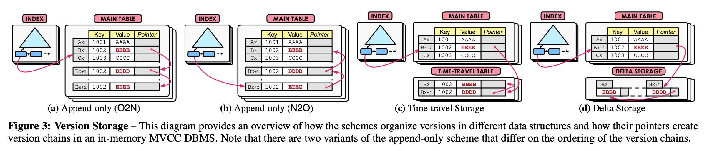
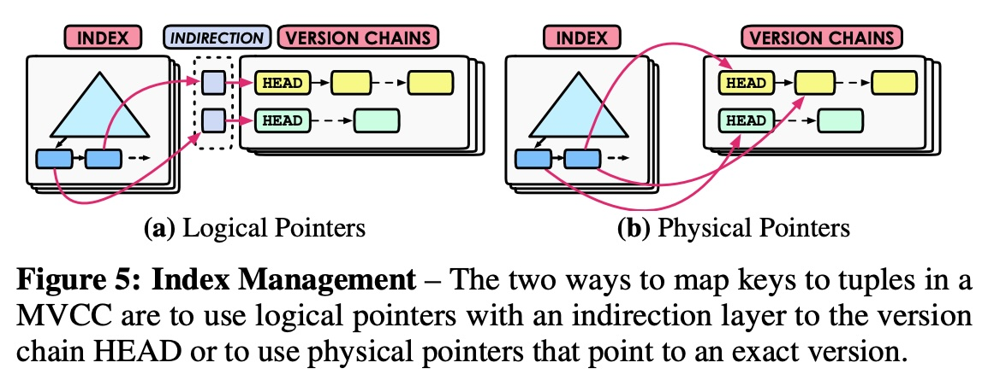
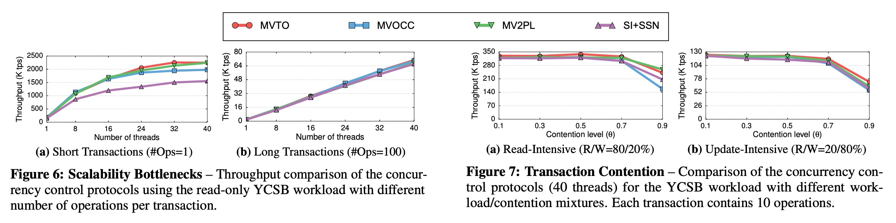
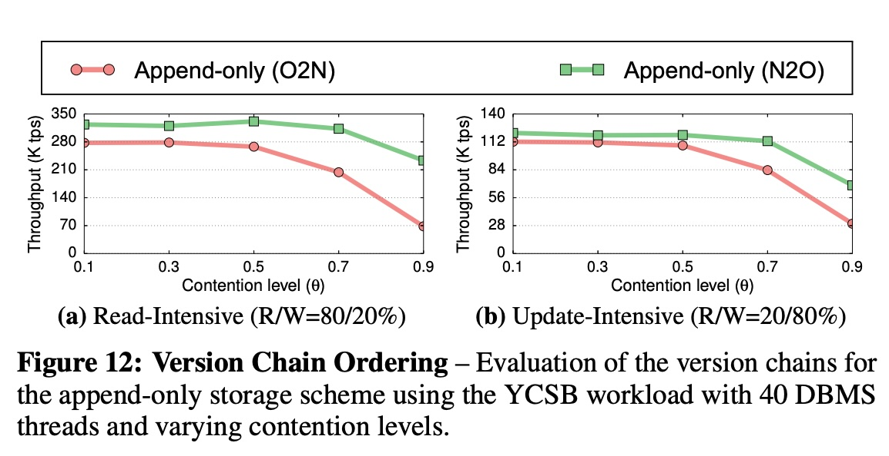
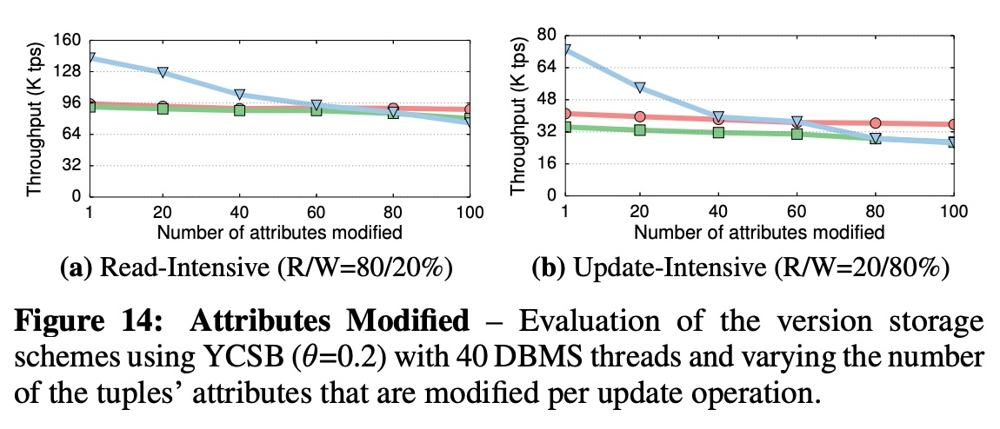
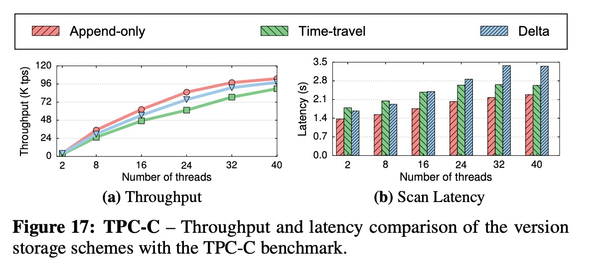
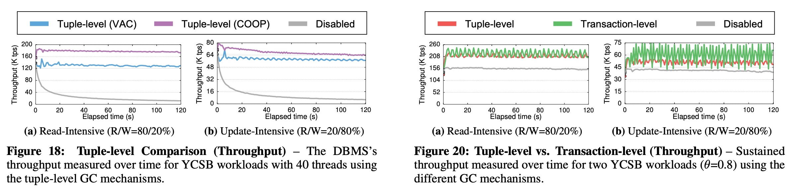
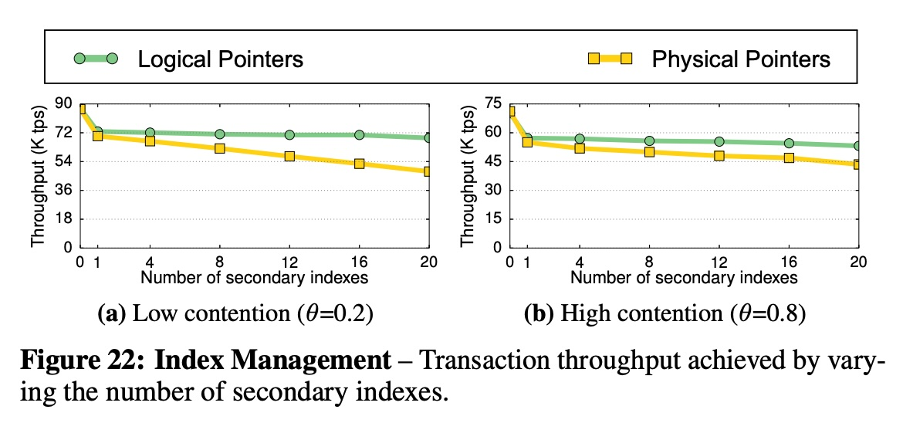
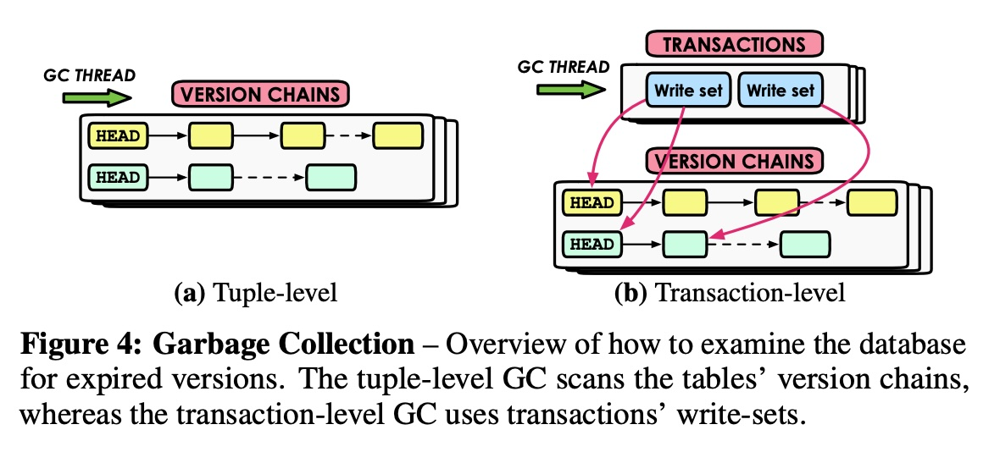

## AI论文解读 | An Empirical Evaluation of In-Memory Multi-Version Concurrency Control
        
### 作者        
digoal        
        
### 日期        
2025-11-04        
        
### 标签        
PostgreSQL , PolarDB , DuckDB , AI , 论文解读        
        
----        
        
## 背景  
      
https://dl.acm.org/doi/pdf/10.14778/3067421.3067427        
  
提示:          
```          
读懂《An Empirical Evaluation of In-Memory Multi-Version Concurrency Control》这篇论文需要提前掌握哪些基础知识, 请使用中文通熟易懂的讲解这些基础知识, 可以引用论文中的图、表或使用Markdown支持的图形(text,mermaid等)增加解释性. 
  
使用中文通熟易懂的解读《An Empirical Evaluation of In-Memory Multi-Version Concurrency Control》这篇论文, 其中的关键内容请着重讲解, 可以引用论文中的图、表或使用Markdown支持的图形(text,mermaid等)增加解释性. 
  
提取《An Empirical Evaluation of In-Memory Multi-Version Concurrency Control》这篇论文中的重要术语, 使用中文对这些术语进行通熟易懂的讲解, 可以引用论文中的图、表或使用Markdown支持的图形(text,mermaid等)增加解释性. 
```     
  
## 1 前置知识 
  
你好！这是一篇非常经典的数据库系统论文，它之所以重要，是因为它不是在“发明”一个全新的东西，而是在“评测”和“对比”现有的主流技术。

读懂这篇论文，你需要对数据库系统，特别是事务处理（Transaction Processing）有一些基础了解。把它想象成一篇“现代多核CPU上，哪种数据库并发技术最强？—— 大型横向评测报告”。

以下是你需要提前掌握的基础知识，我会用尽量通俗的语言来讲解：

### 1\. 核心概念：什么是事务 (Transaction) 与 ACID？

你首先需要知道数据库为什么要“并发控制”。

  * **事务 (Transaction):** 想象一下“银行转账”。这个操作包含两个步骤：1. A账户减钱；2. B账户加钱。这两个步骤必须**要么都成功，要么都失败**。你不能只减钱不加钱。像这样一组必须“同生共死”的操作单元，就叫做一个事务。
  * **ACID:** 这是好数据库的“四大金条”，确保事务的可靠性。
      * **A (Atomicity) 原子性:** 刚刚说的“同生共死”。
      * **C (Consistency) 一致性:** 事务完成后，数据库从一个“正确”的状态变成了另一个“正确”的状态（比如，总存款不变）。
      * **D (Durability) 持久性:** 事务一旦提交，数据就永久保存，哪怕断电。
      * **I (Isolation) 隔离性:** **这是本文的重点。** 当100个人同时在转账（并发执行）时，数据库必须让他们感觉自己是“独自”在操作，一个人的操作不应该被另一个人“插队”或“看走眼”。

-----

### 2\. 核心问题：什么是并发控制 (Concurrency Control)？

隔离性（Isolation）说起来容易，做起来难。如果没有并发控制，会发生很多诡异的“灵异事件”，比如：

  * **脏读 (Dirty Read):** 你读到了别人“没做完”的事务产生的数据（比如A刚减了钱，B还没加钱，你跑去一查，发现总存款少了）。
  * **不可重复读 (Non-Repeatable Read):** 你在同一个事务里读了两次数据，结果不一样（因为中间有别人修改了它）。
  * **幻读 (Phantom Read):** 你在同一个事务里查了两次“有多少员工”，结果第二次多了一个人（因为中间有别人插入了新员工）。

并发控制的**目标**，就是用一种机制来防止这些“灵异事件”，保证隔离性。

#### 传统方案：锁 (Locking)

最直观的办法就是“加锁”。当你要修改数据A时，先把它“锁”住。别人想用A？等着。等你用完“解锁”了，他才能用。

  * **优点:** 简单粗暴，逻辑清晰。
  * **缺点:** **性能极差。** 想象一下，你只是想“读”一下数据，结果另一个人正在“写”，你就得排队等着。在多核CPU时代，大家都在等锁，CPU就全在空转，效率很低。

-----

### 3\. 论文核心：多版本并发控制 (MVCC)

**MVCC (Multi-Version Concurrency Control)** 是为了解决“锁”的性能问题而生的 。

**核心思想：** 不要锁，不要等！“读”和“写”可以同时发生。

**怎么做到？** 靠“版本”。当一个事务要**修改**数据时，它不会在原始数据上改，而是**创建一个新版本**的拷贝，在拷贝上修改 。

**举个例子（谷歌文档）：**

  * 你（事务T1）正在阅读第一页。
  * 你的同事（事务T2）在*同一时间*开始修改第一页。
  * 在MVCC系统里：
      * 你（T1）继续阅读你刚打开时的 **“旧版本”**  (Version 1) 。
      * 你同事（T2）创建了一个 **“新版本”**  (Version 2)，并在上面修改 。
  * **结果：** 你们俩互不干扰。T1的“读”不会阻塞T2的“写”，T2的“写”也不会阻塞T1的“读”。

这篇论文研究的就是，在**内存数据库**和**多核CPU**这个新环境下，MVCC的各种实现方式到底哪个好 。

-----

### 4\. 论文背景：内存数据库 (In-Memory DBMS)

  * **传统数据库:** 数据主要在**磁盘 (Disk)** 上，磁盘I/O是最大的性能瓶颈 。
  * **内存数据库:** 所有数据都在**内存 (RAM)** 里 。内存读写比磁盘快成千上万倍。
  * **瓶颈转移:** 当磁盘不再是瓶颈时，**CPU** 和 **内存访问的同步开销** (Synchronization Overhead) 就成了新的瓶颈 。这篇论文就是在这种“新瓶颈”下做的评测。

-----

### 5\. 论文评测的四大金刚 (Key Design Decisions)

这篇论文的精髓，就是把MVCC的实现拆成了四大块，然后分别评测 。你需要知道这四大块是干嘛的：

#### 1\. 并发控制协议 (Concurrency Control Protocol)

> **“大家同时开工，最后发现冲突了，听谁的？”**

MVCC只是提供了多版本，但你还是得决定“哪个事务在哪个事务前面”（即“序列化顺序”）。

  * **MVTO (时间戳):** 谁先进来谁就早，按时间戳排序 。
  * **MVOCC (乐观):** 大家先“乐观地”干活，假设没冲突。等到最后要“提交”时，再检查一遍。如果发现干活期间读的数据被别人改了，就“自认倒霉”，回滚重做 。
  * **MV2PL (两阶段锁):** 还是用锁，但是锁的是“版本”，比传统锁要快 。

#### 2\. 版本存储 (Version Storage)

> **“你创建了新版本，这堆新旧版本的数据放哪？怎么组织？”**

你可以参考论文的 **Figure 3** 。    

  * **Append-only (追加式):** 这是最朴素的。新版本直接“追加”在老版本后面，形成一个“版本链”。
      * 你可以想象成 `数据A -> 旧版本1 -> 旧版本2 ...` 。
      * 它又分两种：**O2N** (从老到新) 和 **N2O** (从新到老) 。
  * **Time-Travel (时间旅行式):** “主表”里永远只放最新版本。老版本被挪到一个单独的“历史表”里 。
  * **Delta Storage (增量式):** “主表”里永远是最新版本。但是“历史区”存的不是完整的老版本，而是“修改的增量”（比如，你只改了“年龄”，它就只存“旧年龄是18”）。


```text
// 版本存储的（极简）示意图
(a) Append-only (N2O)
    Index -> [V3 (最新)] -> [V2] -> [V1 (最老)]

(b) Time-travel
    Index -> [V3 (主表)]
                |
                v
             [V2, V1 (历史表)]

(c) Delta
    Index -> [V3 (主表, 20岁)]
                |
                v
             [Delta: "年龄从19改成20", Delta: "年龄从18改成19"]
```

#### 3\. 垃圾回收 (Garbage Collection, GC)

> **“版本越积越多，总得有人去删掉那些‘绝对不会再被用到的’旧版本吧？”** 

这个“删除”过程就叫GC。

  * **Tuple-level (元组级):** 检查“每一个”旧版本，看它是不是“过期”了 。
      * **VAC (后台清理):** 派一个专门的“清洁工”线程（Background Thread）在后台慢慢扫 。
      * **COOP (协同清理):** “谁污染谁治理”。事务自己在访问数据时，“顺手”把路上的过期版本给清了 。
  * **Transaction-level (事务级):** 不一个一个地检查版本，而是检查“整个事务”。如果T1事务创建的所有版本都过期了，就批量删掉 。

#### 4\. 索引管理 (Index Management)

> **“索引是为了帮你快速定位数据。但在MVCC里，一个数据有N个版本，索引该指向谁？”** 

你可以参考论文的 **Figure 5** 。    

  * **Logical Pointers (逻辑指针):**

      * 索引指向一个**固定的ID**（比如主键PKey或元组ID）。
      * 这个ID再通过一个“中间层”（比如哈希表）指向“版本链的头部”（通常是最新版）。
      * **优点:** 更新数据时（产生新版本），索引**不用动**，只要改那个“中间层”的指向就行 。
      * **缺点:** 读数据时要查两次（一次索引，一次中间层），慢一点 。

  * **Physical Pointers (物理指针):**

      * 索引**直接指向**某个版本的物理内存地址 。
      * **优点:** 读数据快，一步到位 。
      * **缺点:** 更新数据是**灾难**。你每创建一个新版本，就得更新**所有**指向它的索引（主键索引、二级索引……）。

-----

### 6\. 评测基准：什么是 OLTP？

  * **OLTP (Online Transaction Processing, 联机事务处理):**  指的就是像银行、电商、订票系统这样，有大量用户在进行**高并发、短小**事务的场景。
  * **OLAP (Online Analytical Processing, 联机分析处理):** 指的是“数据分析”场景，比如“统计过去一年所有商品的销售额”。这种事务通常很长，很复杂。
  * **YCSB, TPC-C:**  这是两种最常用来模拟OLTP场景的“跑分软件”（Benchmark），论文用它们来测试性能。

### 总结一下

你需要掌握的知识点是：

1.  **ACID**（尤其是隔离性）是数据库事务的基础。
2.  传统 **“锁”** 方案性能差。
3.  **MVCC** 通过“多版本”实现了“读写不阻塞”，是现代数据库的主流方案。
4.  在**内存数据库**和**多核CPU**的背景下，MVCC的性能瓶颈从磁盘I/O转移到了CPU同步。
5.  这篇论文就是通过实验，评测了实现MVCC的**四大关键设计**（并发协议、版本存储、垃圾回收、索引管理）在OLTP负载下的性能表现。

当你理解了这5点，你就能看懂论文里的那些图表（比如 Figure 6 , Figure 12 ）到底在比较什么了。      

希望这个解释对你有帮助！你可以先从论文的第1节（Introduction）和第2节（Background）读起，它们对这些基础知识也有简要的介绍 。
  
## 2 解读论文 
  
这是一篇数据库领域非常重要的论文，它如同一份“**现代数据库（MVCC）技术选型深度评测报告**” 。

这篇论文**不是在发明**一个新技术，而是在**评测**现有技术。它的核心贡献是，在现代“**多核CPU**”和“**内存数据库**”  的背景下，系统性地评估了实现“多版本并发控制 (MVCC)”的四种关键设计决策 ，并找出了真正影响性能的瓶颈 。

以下是这篇论文的通俗解读：

-----

### 1\. 为什么要做这个研究？（背景）

  * **什么是 MVCC？** MVCC (Multi-Version Concurrency Control) 是目前最主流的数据库并发技术 。它允许“读”和“写”操作同时进行，互不阻塞。
      * **通俗理解：** 想象一下你和同事在编辑同一个谷歌文档。你（“读”事务）在看第1页时，同事（“写”事务）开始修改第1页。MVCC 的作用是，它会给你一个你打开文档时的“旧版本”（V1），让你的同事在“新版本”（V2）上修改 。这样，你们俩谁也不用等谁。
  * **为什么“老”评测不够用？** 几乎所有现代数据库（Oracle, Postgres, MySQL, SAP HANA）都在用 MVCC 。但上一次对 MVCC 的大型评测还是在 1980 年代 。
      * **过去的瓶颈：** 1980 年代的电脑是**单核 CPU**，数据在**磁盘**上 。最大的瓶颈是“慢到爆炸的磁盘 I/O”。
      * **现在的瓶颈：** 现代服务器是**几十核 CPU**，数据全在**内存**里 。瓶颈变成了“**多核心之间的同步开销**” 。
  * **论文的目标：** 在现代硬件上，重新评测 MVCC 的各种实现，看看谁才是“多核之王”。

-----

### 2\. 核心拆解：MVCC 的四大关键设计

论文将 MVCC 的实现拆解为四大组件，并逐一进行了“控制变量”实验 。

#### 1\. 并发控制协议 (Concurrency Control Protocol)

> **“当两个事务真的发生冲突时（比如都想修改同一行），听谁的？”**

  * **MVTO (时间戳排序):** “先来后到”。每个事务进来时领一个时间戳，严格按时间戳顺序执行 。
  * **MVOCC (乐观并发):** “先干再说，不行拉倒”。事务“乐观地”假设没有冲突，直接干活 。到最后“提交”时才检查，如果发现自己读过的数据被别人改了，就“自认倒霉”，回滚重做 。
  * **MV2PL (两阶段锁):** “先锁后用”。在 MVCC 基础上仍然使用锁，但锁的是“版本”，比传统锁高效 。
  * **SSI (可串行化快照隔离):** “记小本本”。通过跟踪事务间的依赖关系 ，来检测“危险”的冲突，并主动中止其中一个事务 。

**评测发现（见 Figure 6, 7）：**    
在高冲突（High Contention）的场景下，**MVOCC (乐观) 的性能会崩溃** 。因为它直到最后才发现冲突，导致前面做的工作全部白费 。相比之下，MVTO (时间戳) 和 SSI (记小本本) 的表现更稳定 。

#### 2\. 版本存储 (Version Storage)

> **“新版本、旧版本……这些数据具体怎么存？放哪里？”**

这是本文发现**最关键**的设计之一 。论文中的 **Figure 3** 直观地展示了区别：    

```text
// 论文 Figure 3 的简化示意图

(a/b) Append-only (追加式):
      [索引] -> [V3(新)] <-> [V2] <-> [V1(旧)]
      (所有版本都在一个表里，串成“版本链”)

(c) Time-travel (时间旅行式):
      [索引] -> [V3(新)] (在主表)
                   |
                   +---> [V2, V1(旧)] (在单独的“历史表”)

(d) Delta Storage (增量式):
      [索引] -> [V3(新)] (在主表，原地更新)
                   |
                   +---> [Delta V2, Delta V1] (在“增量区”，只存“改了什么”)
```

  * **Append-only (追加式):** 所有版本都存在同一个表空间 。它又分两种：
      * **O2N (从老到新):** 索引指向*最老*的版本 。**（代表：Postgres, Hekaton）**
      * **N2O (从新到老):** 索引指向*最新*的版本 。**（代表：MemSQL）**
  * **Time-travel (时间旅行式):** 主表永远只存最新版本 。旧版本被移到一个单独的“历史表” 。**（代表：SAP HANA）** 
  * **Delta Storage (增量式):** 主表永远只存最新版本，并且是“原地更新” (in-place update) 。旧数据被存为“增量”（Delta，即只记录被修改的字段） 。**（代表：Oracle, MySQL InnoDB）** 

**评测发现（见 Figure 12, 14, 17）：**         

  * **Append-only (O2N) 性能很差** 。因为读数据（通常要最新的）需要遍历很长的版本链，这在多核高并发下是灾难 。
  * **Delta Storage (增量式) 是“更新之王”** 。在“写多读少”的场景下，如果事务只修改少量字段，它性能最好，因为它只复制“增量”，开销很小 。
  * **Delta 的弱点**：它对于“分析型”查询（如全表扫描） **性能极差** 。因为它需要从一堆零碎的“增量”中把数据“拼装”回来 。
  * **Append-only (N2O)** 和 **Time-travel** 是比较均衡的方案，但它们在创建新版本时需要复制整个元组，对内存分配的开销很敏感 。

#### 3\. 垃圾回收 (Garbage Collection, GC)

> **“旧版本越积越多，总得有人来打扫。谁来扫？怎么扫？”**

如果没有 GC，系统会因为版本链太长而性能骤降，并耗尽内存 。

  * **Tuple-level (VAC):** “后台吸尘器” 。派一个或多个“清洁工”线程（Background Thread）在后台慢慢扫描，清理过期的元组 。
  * **Tuple-level (COOP):** “协同清理” 。执行事务的“工作线程”在干活时“顺手”把路过的垃圾（过期版本）清理掉 。
  * **Transaction-level (事务级):** “批量回收” 。不一个一个地看元组，而是按“事务”的粒度来回收 。使用“Epoch (纪元)”机制 ，当一个“纪元”内的所有事务都结束后，这个纪元产生的所有垃圾就可以被安全地批量回收 。

**评测发现（见 Figure 18, 20）：**    

  * **Transaction-level (事务级) 性能最好** 。
  * 原因是：它“批量回收” ，极大地减少了“清洁工”和“工作线程”之间的同步开销（锁竞争） 。

#### 4\. 索引管理 (Index Management)

> **“一个数据有 N 个版本，索引应该指向谁？”**

  * **Logical Pointers (逻辑指针):** 索引指向一个“逻辑ID”（比如主键） 。访问时，需要先查索引拿到 ID，再用 ID 去一个“中间层”（如哈希表）找到版本链的真正地址 。
      * **优点：** 更新数据（创建新版本）时，索引**不需要修改** 。
      * **缺点：** 读数据慢（需要两次查找） 。
  * **Physical Pointers (物理指针):** 索引*直接指向*某个物理版本 。
      * **优点：** 读数据快（一步到位） 。
      * **缺点：** 更新数据是灾难。如果一个表有10个索引，你每创建一个新版本，就必须去修改**所有10个索引** 。

**评测发现（见 Figure 22）：**    
在“写密集”且“多索引”的场景下，**Logical Pointers (逻辑指针) 完胜** 。更新多个索引的代价实在太高了 。

-----

### 3\. 核心结论与启示

这篇论文最重要的发现，是颠覆了“传统认知” 。

1.  **最关键的不是“并发协议”，而是“版本存储”！**

      * 大家以前总在争论“乐观”好还是“悲观”好 ，但这篇论文指出，**版本存储方案（Version Storage）对性能的（尤其是多核扩展性）影响是决定性的** 。
      * 比如，Postgres 和 Hekaton 使用的 Append-only (O2N) 方案，被证明在多核下有严重的扩展性问题 。
      * 而 Oracle/MySQL 用的 Delta Storage 方案，虽然“更新”性能极佳 ，但“扫描”性能是硬伤 ，不适合混合负载。

2.  **“垃圾回收 (GC)” 是关键瓶颈，而“事务级GC”是出路。**

      * GC 的性能与数据库的吞吐量紧密相关 。
      * “事务级GC”因为同步开销小，提供了最好的性能和最低的内存占用 。

3.  **在多索引、写密集的场景下，请使用“逻辑指针”。**

      * 为了“读”快一点而使用“物理指针”，在“写”密集时会导致性能严重下降 。

总而言之，这篇论文为所有“内存多核数据库”的设计者提供了一份宝贵的实践指南：**在关注高大上的“并发算法”之前，请先把你“版本存储”和“垃圾回收”这两个基础组件的性能搞定**。
  
## 3 术语 
  
好的，这篇论文深入探讨了现代“内存数据库”中“多版本并发控制 (MVCC)”的内部实现。以下是从该论文中提取的核心术语及其通俗讲解：

### 1\. 核心概念：MVCC

**MVCC (Multi-Version Concurrency Control / 多版本并发控制)** 

  * **通俗讲解：**
    这是现代数据库（如 Oracle、PostgreSQL、MySQL InnoDB）最主流的并发技术 。

    把它想象成 **“谷歌文档的协同编辑”** 。当你（事务A）在读取文档时，你的同事（事务B）可以同时修改它。你看到的是你 **打开文档时** 的那个“版本”（V1）；而你同事的修改会产生一个新的“版本”（V2）。

    **核心思想是：** “写”操作不会覆盖旧数据，而是创建新版本。这使得“读”和“写”可以互不阻塞地同时进行，极大提高了并行性 。

  * **技术定义：**
    数据库管理系统 (DBMS) 会为数据库中的每个逻辑对象（通常是“元组”）维护多个物理版本 。

### 2\. 关键组件：MVCC 的四大设计决策

这篇论文的精髓在于，它将 MVCC 的实现拆分为四大块，并逐一进行了评测 。

-----

#### 决策一：并发控制协议 (Concurrency Control Protocol)

> **通俗讲解：** 大家都用 MVCC，但如果两个事务“同时”要修改“同一行”数据，到底该听谁的？这就是“协议”要解决的冲突问题。

  * **MVTO (Timestamp Ordering / 时间戳排序)** 
      * **讲解：** “严格按先来后到”。每个事务在开始时都会领到一个唯一的时间戳（ Transaction ID, $T_{id}$ ） 。系统根据这个时间戳来决定事务的执行顺序。
  * **MVOCC (Optimistic Concurrency Control / 乐观并发控制)** 
      * **讲解：** “先干再说，不行拉倒”。事务“乐观地”假设不会有冲突 ，自由地执行操作。直到最后“提交”时，系统才会检查一遍（这个过程叫 Validation Phase，验证阶段）。如果发现该事务在执行期间，它读取过的数据被其他事务修改了，系统就会中止（Abort）这个事务，让它重做 。
  * **MV2PL (Two-Phase Locking / 两阶段锁)** 
      * **讲解：** “先锁后用”。这是一种“悲观”的策略。事务在访问（读或写）数据版本之前，必须先获取相应的“锁” 。在 MVCC 环境下，锁是嵌在元组头信息里的（比如 `txn-id` 字段）。
  * **Serialization Certifier (序列化认证器)** 
      * **讲解：** “记小本本，防患未然”。它允许事务先在较低的隔离级别（如快照隔离）上运行，同时在后台维护一个“依赖图”（Serialization Graph）。当它发现某些事务的组合（如“写偏斜” Write-Skew）可能会破坏“可串行化”时，它会主动中止其中一个事务 。

-----

#### 决策二：版本存储 (Version Storage)

> **通俗讲解：** 数据库产生了 V1, V2, V3... 这么多版本，这些数据在内存里具体是怎么存放和组织的？

  * **Version Chain (版本链)** 

      * **讲解：** 用一个指针字段，把同一行数据的所有物理版本（从新到旧，或从旧到新）像“锁链”一样串起来 。

  * **Append-only Storage (追加式存储)** 

      * **讲解：** 这是最直接的方式。所有版本（无论新旧）都存放在同一个表空间里 。当需要更新时，系统会复制一份当前版本，修改后“追加”到存储区 。
      * **O2N (Oldest-to-Newest)：** 版本链“从老到新”。索引指向**最老**的版本 。
      * **N2O (Newest-to-Oldest)：** 版本链“从新到老”。索引指向**最新**的版本 。
 
    你可以参考论文中的 **Figure 3 (a) 和 (b)** 来理解这两种链的区别：    

    ```mermaid
    graph TD
        subgraph "Figure 3(a): Append-only (O2N)"
            Idx1(Index) --> V1(V1 - 最老) --> V2(V2) --> V3(V3 - 最新)
        end
        subgraph "Figure 3(b): Append-only (N2O)"
            Idx2(Index) --> V3_2(V3 - 最新) --> V2_2(V2) --> V1_2(V1 - 最老)
        end
    ```

  * **Time-Travel Storage (时间旅行式存储)** 

      * **讲解：** （见 Figure 3c）“最新版”和“历史版”分开存放。主表 (Main Table) 里永远只保留最新的“主版本” (master version) 。所有旧版本都被移动到一个单独的“时间旅行表” (time-travel table) 。

  * **Delta Storage (增量式存储)** 

      * **讲解：** （见 Figure 3d）这是 Oracle 和 MySQL (InnoDB) 使用的方式 。主表永远只存最新版本，并且是“原地更新” (in-place update) 。当数据被修改时，系统不会复制整个旧版本，而是只把被修改字段的“旧值”存为一个“增量”(Delta) ，并放入一个叫“回滚段”(Rollback Segment) 的地方 。

-----

#### 决策三：垃圾回收 (Garbage Collection, GC)

> **通俗讲解：** 版本越积越多，内存迟早会爆。必须有一个“清洁工”来回收那些“绝对不会再被任何事务所访问”的过期版本 。

  * **Epoch-based Management (基于“纪元”的管理)** 
      * **讲解：** 这是现代内存数据库中避免 GC 瓶颈的常用方法 。系统会按时间划分“纪元”（Epoch，比如每 40 毫秒一个纪元）。当一个“纪元”（比如第100号纪元）以及它之前的所有纪元（\<100号）中，**没有任何**活跃事务时，系统就可以“安全地”批量回收这些纪元产生的所有过期版本 。
  * **Tuple-level GC (元组级GC)** 
      * **讲解：** 以“元组版本”为单位进行回收。
      * **VAC (Background Vacuuming / 后台清理)：** （见 Figure 4a）派一个或多个“清洁工”线程（Background Thread）在后台持续扫描数据库，寻找并回收过期版本 。     
      * **COOP (Cooperative Cleaning / 协同清理)：** “工作线程”自己（即执行事务的线程）在遍历版本链时，“顺手”把路过的过期版本清理掉 。
  * **Transaction-level GC (事务级GC)** 
      * **讲解：** （见 Figure 4b）以“事务”为单位进行回收 。当一个事务（连同它所属的纪元）过期后，这个事务创建的所有版本都可以被“批量”回收。

-----

#### 决策四：索引管理 (Index Management)

> **通俗讲解：** 索引（比如 B+ 树）是为了快速定位数据。但在 MVCC 中，一个数据有 N 个版本，索引到底应该指向谁？

  * **Logical Pointers (逻辑指针)** 
      * **讲解：** （见 Figure 5a）索引不直接指向数据的物理内存地址，而是指向一个“逻辑ID”（比如主键 PKey 或元组ID TupleId） 。系统需要一个“中间层”（Indirection Layer）来把这个 ID 映射到版本链的“头部”（HEAD）。    
      * **优点：** 当数据更新、版本链头部发生变化时，索引**不需要**被修改，只需要更新那个“中间层” 。
  * **Physical Pointers (物理指针)** 
      * **讲解：** （见 Figure 5b）索引的“值”直接就是某个数据版本的**物理内存地址** 。
      * **缺点：** 这种方式只适用于 Append-only 存储 。当数据更新、产生一个新版本时，数据库必须把这个新版本的物理地址插入到**所有**相关的二级索引中，导致“写”操作非常昂贵 。
  
## 参考        
         
https://dl.acm.org/doi/pdf/10.14778/3067421.3067427    
        
<b> 以上内容基于DeepSeek、Qwen、Gemini及诸多AI生成, 轻微人工调整, 感谢杭州深度求索人工智能、阿里云、Google等公司. </b>        
        
<b> AI 生成的内容请自行辨别正确性, 当然也多了些许踩坑的乐趣, 毕竟冒险是每个男人的天性.  </b>        
    
#### [期望 PostgreSQL|开源PolarDB 增加什么功能?](https://github.com/digoal/blog/issues/76 "269ac3d1c492e938c0191101c7238216")
  
  
#### [PolarDB 开源数据库](https://openpolardb.com/home "57258f76c37864c6e6d23383d05714ea")
  
  
#### [PolarDB 学习图谱](https://www.aliyun.com/database/openpolardb/activity "8642f60e04ed0c814bf9cb9677976bd4")
  
  
#### [PostgreSQL 解决方案集合](../201706/20170601_02.md "40cff096e9ed7122c512b35d8561d9c8")
  
  
#### [德哥 / digoal's Github - 公益是一辈子的事.](https://github.com/digoal/blog/blob/master/README.md "22709685feb7cab07d30f30387f0a9ae")
  
  
#### [About 德哥](https://github.com/digoal/blog/blob/master/me/readme.md "a37735981e7704886ffd590565582dd0")
  
  

  
